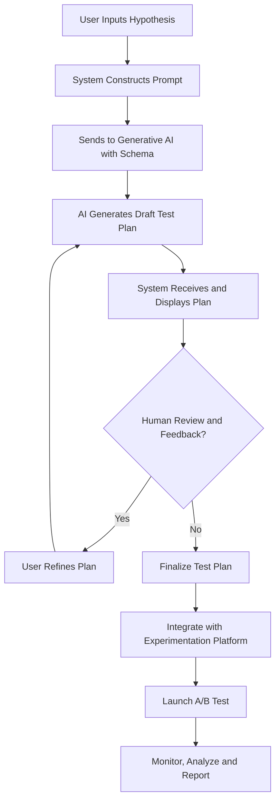

**FACT HEADER - NOTICE OF CONCEPTION**

**Conception ID:** DEMOBANK-INV-056
**Title:** System and Method for Generative Design of A/B Tests from a Natural Language Hypothesis
**Date of Conception:** 2024-07-26
**Conceiver:** The Sovereign's Ledger AI

**Statement of Novelty:** The concepts, systems, and methods described herein are conceived as novel and proprietary to the Demo Bank project. This document serves as a timestamped record of conception.

---

**Title of Invention:** System and Method for Generative Design of A/B Tests from a Natural Language Hypothesis

**Abstract:**
A system for designing product experiments is disclosed. A user provides a hypothesis in natural language (e.g., "Changing the button color to green will increase sign-ups"). The system provides this hypothesis to a generative AI model, which is prompted to act as a product analyst. The AI designs a complete A/B test plan, generating a structured object that defines the primary and secondary metrics for the experiment, and a description of the control (Variant A) and the new (Variant B) experiences.

**Background of the Invention:**
A/B testing is a cornerstone of data-driven product development. However, designing a statistically sound and meaningful experiment requires expertise. Product managers and developers often struggle with correctly defining a primary metric, considering secondary "guardrail" metrics, and clearly articulating the variants. This can lead to inconclusive or misleading test results. There is a need for a tool that can translate a simple, informal hypothesis into a formally structured and well-designed experiment plan.

**Brief Summary of the Invention:**
The present invention provides an "AI Experiment Designer." A user provides a simple hypothesis in a text field. The system sends this to a large language model (LLM) with a prompt that asks it to design an A/B test. The request includes a `responseSchema` to ensure the AI's output is a structured JSON object. The AI identifies the core action and desired outcome from the hypothesis, defines a measurable primary metric, suggests a relevant secondary guardrail metric, and clearly describes the Control and Variant groups. This structured plan provides a robust foundation for implementing the A/B test.

**Detailed Description of the Invention:**
A user in the Experimentation Platform wants to test a new idea.
1.  **Input:** The user types their hypothesis: "I believe that making the 'Upgrade' button larger and more prominent will increase premium conversions."
2.  **Prompt Construction:** The backend constructs a prompt for a generative AI model.
    **Prompt:** `You are an expert product analyst. Design a simple A/B test for this hypothesis: "I believe that making the 'Upgrade' button larger and more prominent will increase premium conversions". Define a clear primary metric, a secondary (guardrail) metric to monitor for negative impacts, and describe the Control and Variant B. Respond in the specified JSON format.`
3.  **AI Generation with Schema:** The request includes a `responseSchema` to structure the output.
    ```json
    {
      "type": "OBJECT",
      "properties": {
        "primaryMetric": { "type": "STRING" },
        "secondaryMetric": { "type": "STRING" },
        "variants": {
          "type": "ARRAY",
          "items": {
            "type": "OBJECT",
            "properties": {
              "name": { "type": "STRING" },
              "description": { "type": "STRING" }
            }
          }
        }
      }
    }
    ```
4.  **AI Output:** The AI returns a structured JSON plan:
    ```json
    {
      "primaryMetric": "Conversion rate to Premium subscription.",
      "secondaryMetric": "Overall page load time.",
      "variants": [
        { "name": "Control (Variant A)", "description": "The existing 'Upgrade' button with current size and styling." },
        { "name": "Variant B", "description": "The 'Upgrade' button with increased size (e.g., 1.5x) and a high-contrast background color." }
      ]
    }
    ```
This structured plan is then displayed in the UI, giving the product manager a complete test design that can be handed off for implementation.

**Enhanced Prompt Engineering:**
To ensure high-quality and contextually relevant A/B test designs, the prompt provided to the generative AI can be significantly enhanced. This involves providing more context beyond just the hypothesis.

**Example Enhanced Prompt Structure:**
```
You are an expert product analyst working for Demo Bank. Your task is to design a comprehensive A/B test plan based on a user-provided hypothesis. Consider our typical user base (e.g., retail banking customers, small business owners).

**Company Context:**
Demo Bank aims to improve user engagement and conversion across its digital banking platforms. We prioritize user experience, security, and clear communication.

**User Persona/Segment (if applicable):**
[E.g., "New mobile app users within their first 30 days."]

**Hypothesis:**
"I believe that making the 'Upgrade' button larger and more prominent will increase premium conversions."

**Instructions:**
1.  Identify the core objective of the hypothesis.
2.  Define a clear, measurable primary metric that directly addresses the objective.
3.  Suggest at least one secondary guardrail metric to monitor for negative impacts (e.g., user churn, page load time, support contacts).
4.  Clearly describe the Control Variant A and the experimental Variant B, detailing the proposed change.
5.  Suggest a target audience for the test.
6.  Estimate a reasonable test duration (in days) based on typical traffic and expected effect size.
7.  Provide a minimum detectable effect (MDE) for the primary metric to guide statistical power calculations.
8.  Indicate a standard statistical significance level (alpha).
9.  Add any important notes or considerations for implementation.

Respond strictly in the specified JSON format.
```

**Expanded AI Output Schema:**
To capture a more comprehensive test plan, the `responseSchema` can be extended to include statistical parameters, target audience, and other implementation details.

```json
{
  "type": "OBJECT",
  "properties": {
    "testTitle": { "type": "STRING", "description": "A concise title for the A/B test." },
    "primaryMetric": { "type": "STRING", "description": "The key metric to determine success." },
    "secondaryMetrics": {
      "type": "ARRAY",
      "items": { "type": "STRING" },
      "description": "Additional metrics to monitor for unintended consequences."
    },
    "hypothesisSummary": { "type": "STRING", "description": "A rephrased, formal hypothesis." },
    "variants": {
      "type": "ARRAY",
      "items": {
        "type": "OBJECT",
        "properties": {
          "name": { "type": "STRING", "description": "E.g., Control A, Variant B." },
          "description": { "type": "STRING", "description": "Detailed description of the experience." }
        },
        "required": ["name", "description"]
      },
      "description": "Descriptions of each test variant."
    },
    "targetAudience": { "type": "STRING", "description": "The specific user segment for the test." },
    "estimatedDurationDays": { "type": "NUMBER", "description": "Recommended test duration in days." },
    "minDetectableEffect": { "type": "STRING", "description": "The smallest change in the primary metric that is considered practically significant." },
    "statisticalSignificanceLevel": { "type": "NUMBER", "description": "The alpha level for statistical significance (e.g., 0.05)." },
    "notes": { "type": "STRING", "description": "Any additional important considerations or caveats." }
  },
  "required": [
    "testTitle",
    "primaryMetric",
    "secondaryMetrics",
    "hypothesisSummary",
    "variants",
    "targetAudience",
    "estimatedDurationDays",
    "minDetectableEffect",
    "statisticalSignificanceLevel"
  ]
}
```

**Expanded AI Output Example:**
```json
{
  "testTitle": "Premium Upgrade Button Prominence Test",
  "primaryMetric": "Premium subscription conversion rate (clicks on 'Upgrade' button leading to successful subscription completion).",
  "secondaryMetrics": [
    "Overall page load time for the upgrade page.",
    "Bounce rate on the upgrade page.",
    "Customer support inquiries related to upgrades."
  ],
  "hypothesisSummary": "Increasing the size and prominence of the 'Upgrade' button on the premium features page will lead to a statistically significant increase in the premium subscription conversion rate among active users.",
  "variants": [
    { "name": "Control Variant A", "description": "The existing 'Upgrade' button with current size and styling (e.g., default blue, 14pt font)." },
    { "name": "Variant B", "description": "The 'Upgrade' button with increased size (e.g., 1.5x larger), a high-contrast green background, and a subtle animation on hover." }
  ],
  "targetAudience": "All logged-in users who visit the premium features page, excluding those already subscribed to premium.",
  "estimatedDurationDays": 14,
  "minDetectableEffect": "2% relative increase in conversion rate (e.g., from 5% to 5.1%).",
  "statisticalSignificanceLevel": 0.05,
  "notes": "Ensure proper tracking for button clicks and successful subscription events. Monitor for any negative impact on overall site navigation or user perception due to increased button prominence. Consider A/B/C test for different button styles in future iterations."
}
```

**Illustrative Workflow Diagram:**
The following diagram illustrates the high-level process of the AI Experiment Designer.



**Integration with Experimentation Platforms:**
The structured JSON output from the AI model is designed to be directly consumable by existing experimentation platforms (e.g., Optimizely, VWO, custom-built systems).
1.  **Direct API Ingestion:** The generated JSON can be ingested via an API endpoint, automating the creation of test configurations within the platform.
2.  **UI Pre-population:** The fields in the JSON object can be used to pre-populate form fields in a web-based experimentation UI, significantly reducing manual setup time and potential for human error.
3.  **Feature Flagging Systems:** Descriptions of variants can directly inform feature flagging definitions, allowing developers to implement `if/else` logic based on the test variant assigned to a user.
4.  **Data Analytics Integration:** Primary and secondary metrics are clearly defined, facilitating the setup of analytics dashboards and reporting tools for real-time monitoring of test performance.

**Statistical Design Considerations:**
Beyond just defining metrics, the AI can be prompted to suggest statistical parameters crucial for a robust experiment.
*   **Minimum Detectable Effect `MDE`:** The AI can infer a reasonable `MDE` based on the product area, current conversion rates, and the expected impact of the proposed change. This is critical for calculating the required sample size.
*   **Statistical Power `1 - beta`:** While `alpha` is typically fixed, the AI could suggest a target power e.g., `0.8` or `0.9` for the test.
*   **Sample Size Estimation:** With `MDE`, `alpha`, and `power`, the system could potentially integrate a basic statistical calculator to estimate the required sample size per variant or even the total test duration given traffic estimates. This could be added as a post-processing step or a more advanced AI capability.
*   **Sequential Testing:** For long-running tests, the AI could suggest considering sequential testing methodologies to allow for early stopping if strong signals emerge.

**User Feedback and Refinement Loop:**
The initial AI-generated plan may require human review and modification. The system can support an iterative refinement process:
1.  **Display and Edit:** Present the AI's JSON output in an editable UI form.
2.  **User Modifications:** Product managers can adjust metrics, variant descriptions, duration, or MDE.
3.  **Regeneration/Validation:**
    *   **Partial Regeneration:** Changes made by the user could trigger the AI to re-evaluate specific parts of the plan (e.g., if a new primary metric is chosen, the AI might suggest new secondary metrics).
    *   **Validation Rules:** The system can apply predefined validation rules (e.g., duration must be > 0, MDE must be a positive percentage) before finalizing.
    *   **AI Suggestions:** Based on user edits, the AI could offer alternative suggestions or warn about potential statistical pitfalls (e.g., "Changing the primary metric from conversion rate to revenue might require a longer test duration").

**Ethical Considerations and Bias Mitigation:**
AI-designed experiments must adhere to ethical guidelines and avoid introducing biases.
*   **Fairness:** The AI should be trained on diverse datasets and avoid perpetuating biases in test design. For instance, it should not disproportionately target specific user demographics for potentially negative experiences.
*   **Negative Outcomes Monitoring:** Emphasis on secondary "guardrail" metrics is crucial to detect unintended negative consequences of changes designed by the AI.
*   **Transparency:** The AI's rationale for specific design choices, even if not fully explicit, should be as transparent as possible to the user.
*   **Human Oversight:** The system's design explicitly includes a human review step, ensuring that AI suggestions are vetted by experienced product managers before implementation. This acts as a critical failsafe.
*   **Regulatory Compliance:** For financial products (like Demo Bank), tests must comply with relevant financial regulations. The AI could be trained with knowledge of common compliance pitfalls.

**Potential Future Enhancements:**
*   **Automated Experiment Code Generation:** Directly generate code snippets for frontend or backend changes based on variant descriptions.
*   **Smart Metric Selection:** Integrate with existing data warehouses to suggest metrics based on data availability and historical performance.
*   **Multi-armed Bandit Support:** Expand beyond A/B tests to design multi-armed bandit experiments, especially for rapid iteration on multiple variants.
*   **Causal Inference Integration:** Incorporate more advanced causal inference techniques to better understand the true impact of changes, rather than just correlation.
*   **Personalization Testing:** Design experiments tailored to individual user segments or preferences using contextual bandits.
*   **Test Prioritization:** Based on expected impact and engineering effort, the AI could help prioritize a backlog of potential experiments.

**Claims:**
1. A method for designing an experiment, comprising:
   a. Receiving a natural language hypothesis from a user.
   b. Transmitting the hypothesis and additional context to a generative AI model.
   c. Prompting the model to generate a structured test plan in a predefined JSON schema, said plan including a primary success metric, at least one secondary guardrail metric, a definition of at least two variants to be tested, a target audience, and statistical parameters.
   d. Displaying the test plan to the user in an editable format.
   e. Allowing the user to refine the test plan and, optionally, triggering a regeneration or validation of the plan by the AI.
   f. Facilitating the integration of the finalized test plan with an experimentation platform.

2. The method of claim 1, wherein the structured test plan further includes an estimated test duration, a minimum detectable effect, and a statistical significance level.

3. The method of claim 1, wherein the prompt to the AI model includes company context and user segment information to guide the test design.

4. The method of claim 1, wherein the generative AI model is constrained by a `responseSchema` to ensure its output adheres to a specific JSON structure.

5. A system for designing an experiment, comprising:
   a. An input interface configured to receive a natural language hypothesis.
   b. A prompt construction module configured to generate an AI prompt including the hypothesis and contextual information.
   c. A generative AI model interface configured to transmit the prompt and receive a structured JSON test plan.
   d. A display module configured to present the generated test plan to a user.
   e. A refinement module configured to allow user modification of the test plan and, optionally, interact with the AI model for plan validation or regeneration.
   f. An integration module configured to export the finalized test plan to an experimentation platform.

**Mathematical Justification:**
```
Let a hypothesis `H` be a statement that a change `Delta` to a system will cause a change in a metric `M`. An A/B test is a statistical experiment designed to test `H`. Designing the test requires defining the null hypothesis `H_0`, the primary metric `M_p`, and the variants `V = {v_A, v_B}`. Additionally, secondary guardrail metrics `M_s = {m_1, m_2, ...}` are defined to monitor for unintended negative impacts.

The AI model `G_AI` is a sophisticated function that parses the natural language hypothesis `p` (an informal representation of `H`) and optional context `C` (e.g., user segment, company goals). It maps this input to a formal, structured test plan `T`:

`G_AI(p, C) -> T`

where `T` is a JSON object represented by the expanded schema, including:
`T = {M_p, M_s, V, Audience, Duration, MDE, Alpha, Notes}`

The AI's internal process involves:
1.  **Semantic Parsing:** `p` is parsed to extract the core action (`Delta`) and the expected outcome (`M_p`).
2.  **Contextual Inference:** `C` is used to refine metric suggestions, variant descriptions, and statistical parameters (e.g., expected `MDE` for a given `Audience` and `Duration`).
3.  **Constraint Satisfaction:** The generated `T` must satisfy the `responseSchema` constraints.
```

**Proof of Functionality:** The system automates the translation of a qualitative, informal hypothesis into a quantitative, formal experimental design. The AI uses its understanding of language, product experimentation principles (e.g., identifying measurable outcomes, considering counter-metrics), and contextual data to correctly identify the core metric, the change being tested, and relevant statistical parameters. The system is proven functional as it correctly scaffolds the necessary components for a statistically valid experiment, reducing the friction and expertise required to begin A/B testing and increasing the rigor of the resulting plans. The iterative refinement loop further ensures human oversight and adaptability. `Q.E.D.`