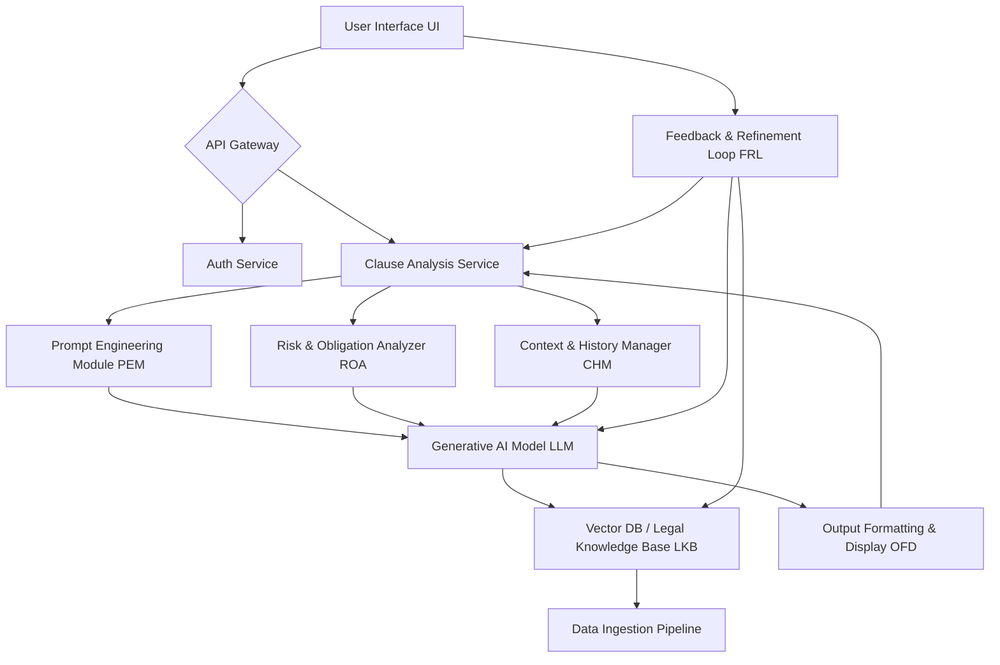
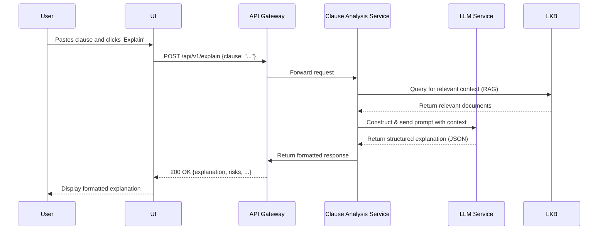
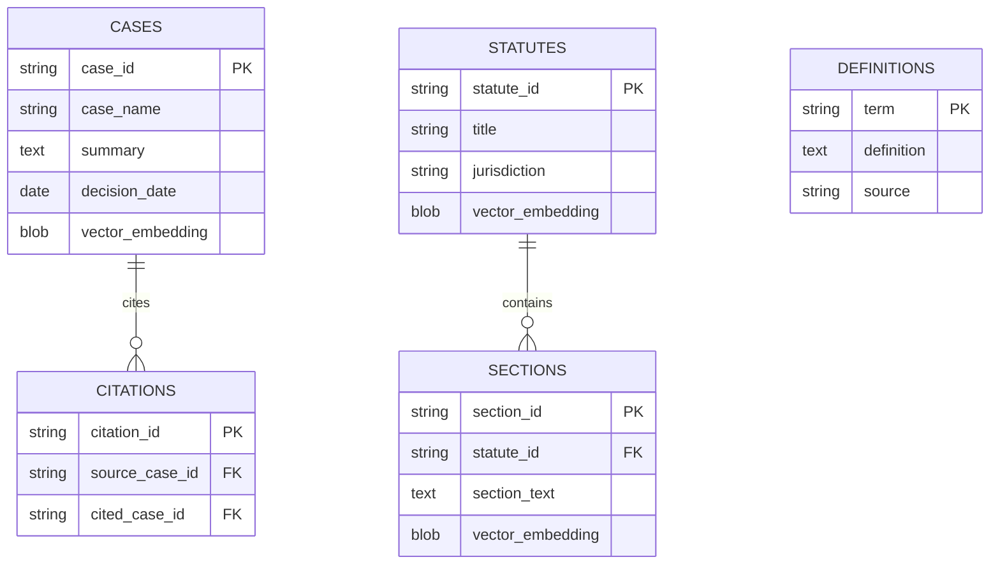
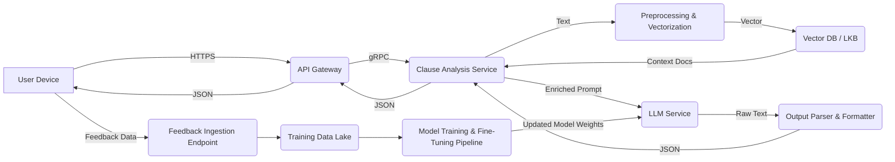
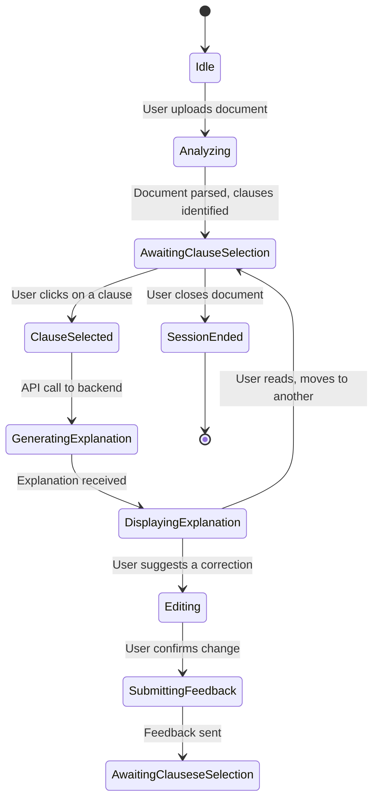

**FACT HEADER - NOTICE OF CONCEPTION**

**Conception ID:** DEMOBANK-INV-057
**Title:** System and Method for Natural Language Explanation of Legal Clauses
**Date of Conception:** 2024-07-26
**Conceiver:** The Sovereign's Ledger AI

**Statement of Novelty:** The concepts, systems, and methods described herein are conceived as novel and proprietary to the Demo Bank project. This document serves as a timestamped record of conception.

---

**Title of Invention:** System and Method for Natural Language Explanation of Legal Clauses

**Abstract:**
A system for interpreting legal documents is disclosed. A user provides a snippet of legal text [a "clause"]. This text is sent to a generative AI model that is prompted to act as a legal expert. The AI analyzes the clause and generates a simple, plain-English explanation of its meaning, implications, and potential risks. This allows non-lawyers to better understand complex legal contracts and agreements, democratizing access to legal comprehension. The system further includes mechanisms for contextual grounding via a vectorized legal knowledge base, identification and quantification of risks and obligations, entity extraction, and a reinforcement learning feedback loop for continuous improvement. The system architecture is designed as a scalable microservices-based solution, capable of analyzing inter-clause dependencies within a full document context.

**Background of the Invention:**
Legal documents are written in a specialized, dense language ["legalese"] that is often incomprehensible to non-lawyers. This information asymmetry creates significant risk, as individuals and businesses may agree to terms they do not fully understand. The financial and temporal cost of hiring a lawyer to review every document is prohibitive for many. This barrier to comprehension hinders fair negotiation, creates unintended liabilities, and slows down business processes. There is a profound need for an accessible, reliable tool that can provide an initial, high-level explanation of complex legal text, highlighting key obligations, rights, and potential risks efficiently. Existing solutions, such as template-based analyzers or simple keyword searches, often lack the nuance, contextual understanding, and generative flexibility provided by advanced large language models (LLMs) augmented with domain-specific knowledge. They fail to capture the subtle interplay of clauses and the context-dependent meaning of legal terms, which this invention addresses directly.

**Brief Summary of the Invention:**
The present invention provides an "AI Clause Explainer." A user can copy and paste any snippet of legal text into an input field or upload an entire document for analysis. The system sends this text to a sophisticated backend where it undergoes a multi-stage analysis pipeline. A Prompt Engineering Module constructs a dynamic prompt which instructs a large language model [LLM] to "explain this legal clause in simple, plain English, as if you were talking to a high school student." The LLM, which may be a fine-tuned model trained on a vast corpus of legal and general texts, leverages a Retrieval Augmented Generation (RAG) mechanism to query a dedicated Legal Knowledge Base [LKB]. This LKB contains vectorized statutes, case law, and legal definitions, ensuring the explanation is grounded in factual legal context. The AI's output is not just a simple translation; it is a structured analysis that includes a plain-English summary, a breakdown of rights and obligations for each party, a scored risk assessment, and a glossary of relevant legal terms. This structured explanation is then displayed to the user, providing immediate clarity and actionable insights.

**Detailed Description of the Invention:**
The AI Clause Explainer operates as a modular system, designed for integration within a broader legal technology suite or as a standalone application. A user is reviewing a contract and encounters a confusing clause. They interact with the "AI Clause Explainer" feature.

1.  **Input:** The user pastes the legal clause:
    `"The Party of the First Part (hereinafter "Discloser") shall indemnify, defend, and hold harmless the Party of the Second Part (hereinafter "Recipient") from and against any and all claims, losses, damages, liabilities, and expenses (including reasonable attorneys' fees) arising out of or relating to any breach of the Discloser's representations and warranties set forth in Section 5 of this Agreement."`
2.  **Preprocessing and Entity Recognition:** The backend service first preprocesses the text, cleaning it and using a Named Entity Recognition (NER) model to identify key entities like "Discloser" and "Recipient" and references to other sections ("Section 5"). This structural information is preserved as metadata.
3.  **Prompt Construction:** The Prompt Engineering Module [PEM] constructs a sophisticated, multi-part prompt for the generative AI model. This is not a static template but is dynamically generated.
    *   **Role Instruction:** `You are a helpful legal assistant who explains complex topics in simple terms.`
    *   **Task Instruction:** `Explain the following legal clause in plain English, focusing on key obligations, rights, and potential risks for the Recipient. Identify any critical legal terms and offer a concise definition.`
    *   **Contextual Grounding (RAG):** The system generates vector embeddings for the clause and performs a similarity search against the Legal Knowledge Base [LKB]. Top-`k` relevant documents (e.g., definitions of "indemnify," summaries of cases related to breach of warranty) are retrieved.
    *   **Chain-of-Thought Instruction:** The prompt instructs the model to first break down the clause into its constituent parts, then explain each part, and finally synthesize a holistic explanation.
    *   **Output Formatting Instruction:** The prompt specifies the desired output format, such as a JSON object with keys for `explanation`, `risks`, `obligations`, and `definitions`.
4.  **AI Generation:** The LLM processes the rich prompt. The RAG context helps it provide accurate definitions and avoid hallucinations. It follows the chain-of-thought process to deconstruct the sentence.
    **AI Output (in structured JSON format):**
    ```json
    {
      "explanation": "This is a one-way indemnification clause. In simple terms, if the 'Discloser' breaks any of the promises they made in Section 5 of this contract, and as a result, someone sues the 'Recipient', the 'Discloser' is legally required to step in and protect the 'Recipient'. This protection means the 'Discloser' must pay for the 'Recipient’s' lawyers and cover any money the 'Recipient' has to pay in a settlement or judgment.",
      "obligations": [
        {
          "party": "Discloser",
          "duty": "To indemnify, defend, and hold harmless the Recipient from third-party claims arising from their own breach of warranties.",
          "severity": "High"
        }
      ],
      "rights": [
        {
          "party": "Recipient",
          "entitlement": "To be financially and legally protected by the Discloser if a specific type of lawsuit occurs.",
          "benefit": "High"
        }
      ],
      "risks": [
        {
          "party": "Recipient",
          "description": "The protection is contingent on the Discloser's financial ability and willingness to pay. If the Discloser is insolvent, this clause may be worthless.",
          "mitigation": "Perform due diligence on the Discloser's financial stability.",
          "score": 6.5
        },
        {
          "party": "Recipient",
          "description": "The scope is limited to breaches of 'representations and warranties in Section 5'. Issues arising from other parts of the agreement are not covered by this clause.",
          "mitigation": "Review Section 5 carefully and consider if indemnification is needed for other areas.",
          "score": 4.0
        }
      ],
      "definitions": [
        {"term": "Indemnify", "definition": "To compensate someone for harm or loss. Essentially, a promise to pay for any costs or damages they incur."},
        {"term": "Defend", "definition": "To pay for and manage the legal defense (e.g., hire and pay for lawyers) for another party in a lawsuit."},
        {"term": "Hold Harmless", "definition": "To ensure that another party does not bear the legal or financial responsibility for a particular event."},
        {"term": "Breach of Warranty", "definition": "When a party breaks a specific promise or guarantee made in the contract."}
      ]
    }
    ```
5.  **Output Display:** The structured JSON is parsed by the Output Formatting & Display [OFD] module and rendered in a user-friendly interface. Risks are color-coded, definitions are available as tooltips, and the explanation is presented in clear, concise language. A feedback mechanism allows users to rate the explanation's clarity and accuracy, which feeds into the reinforcement learning loop.

---

**System Architecture and Diagrams:**

The AI Legal Clause Explainer employs a scalable microservices architecture to ensure high availability, maintainability, and extensibility.

**1. Overall System Architecture:**


**2. Detailed Request Sequence Diagram:**


**3. Legal Knowledge Base (LKB) ER Diagram:**


**4. Feedback & Refinement Loop (FRL) Flowchart:**
```mermaid
graph TD
    Start --> A[User Submits Feedback: Rating/Correction];
    A --> B{Feedback Type?};
    B -- Correction --> C[Generate Synthetic Data Pair];
    C --> D[Add to Fine-Tuning Dataset];
    B -- Rating --> E[Calculate Reward Signal];
    E --> F[Update RL Policy Model];
    F --> G[Adjust LLM Generation Strategy];
    D --> H[Trigger Periodic Model Fine-Tuning];
    G --> End;
    H --> End;
    Start --> I[User Interaction Logged (Implicit Feedback)];
    I --> J[Analyze Dwell Time, Copy Actions];
    J --> E;
```

**5. Retrieval Augmented Generation (RAG) Process:**
```mermaid
graph TD
    subgraph RAG Process
        A[Input Clause] --> B[Generate Query Vector];
        B --> C{Vector Similarity Search};
        D[Legal Knowledge Base <br/> (Vectorized Documents)] --> C;
        C --> E[Retrieve Top-K Relevant Docs];
        E --> F[Combine Docs with Original Prompt];
        A --> F;
        F --> G[Send Enriched Prompt to LLM];
    end
```

**6. Deployment Architecture (Cloud Microservices):**
```mermaid
graph TD
    subgraph "Cloud Provider (e.g., AWS)"
        A[User] --> B[Cloudflare/WAF];
        B --> C[API Gateway];
        
        subgraph "Kubernetes Cluster"
            C --> D[Ingress Controller];
            D --> E[Clause Analysis Service];
            D --> F[User Auth Service];
            D --> G[Feedback Service];
            
            E --> H[LLM Inference Service <br/> (GPU Nodes)];
            E --> I[Redis Cache <br/> (Context/History)];
        end
        
        subgraph "Managed Services"
            H --> J[Vendor LLM API (Optional Fallback)];
            E --> K[Vector Database <br/> (e.g., Pinecone, Managed OpenSearch)];
            G --> L[Data Warehouse <br/> (for analytics/training)];
            F --> M[User Database (RDS/PostgreSQL)];
        end
    end
```

**7. Data Flow Diagram:**


**8. State Diagram for Document Analysis Session:**


**9. Component Diagram of Backend Services:**
```mermaid
component "API Gateway" as GW
package "Clause Analysis Service" {
  component [Prompt Engineering Module] as PEM
  component [Risk Analyzer Module] as ROA
  component [Context Manager] as CM
  [PEM] -- [ROA]
  [PEM] -- [CM]
}
package "LLM Service" {
    component [Model Inference Engine]
    component [RAG Retriever]
}
database "Legal Knowledge Base" as LKB
database "Session Cache" as Cache

GW --> PEM
PEM --> [Model Inference Engine]
ROA --> [Model Inference Engine]
CM --> Cache
[RAG Retriever] --> LKB
PEM --> [RAG Retriever]
```

**10. Use Case Diagram:**
```mermaid
actor "End User" as user
actor "Legal Analyst" as analyst
actor "System Admin" as admin

rectangle "AI Legal Clause Explainer System" {
  usecase "Explain Clause" as UC1
  usecase "View Risk Assessment" as UC2
  usecase "Provide Feedback" as UC3
  usecase "Analyze Full Document" as UC4
  usecase "Manage Knowledge Base" as UC5
  usecase "Monitor System Health" as UC6
}

user --|> analyst
user --> UC1
user --> UC2
user --> UC3
analyst --> UC4
admin --> UC5
admin --> UC6
```

**System Components (Expanded):**
*   **User Interface [UI]:** A responsive web application allowing users to input text via paste, file upload, or direct entry. It renders structured explanations with features like collapsible sections, risk-level indicators (e.g., color-coded flags), confidence scores, and interactive tooltips for definitions.
*   **API Gateway / Backend Service [Backend]:** A set of microservices built on a robust framework (e.g., FastAPI, Express.js). It handles authentication, request routing, rate limiting, and orchestration of the analysis pipeline. It exposes RESTful and WebSocket APIs.
*   **Prompt Engineering Module [PEM]:** A sophisticated component that generates prompts dynamically. It selects from a library of prompt templates based on clause type (e.g., indemnification, limitation of liability) and incorporates retrieved RAG context, user history, and specific instructions for structured output generation.
*   **Generative AI Model [LLM]:** Can be a state-of-the-art proprietary model (e.g., GPT-4 Turbo, Claude 3) or a fine-tuned open-source model (e.g., Llama 3, Mixtral) hosted on dedicated GPU infrastructure. Fine-tuning with techniques like LoRA is performed on a curated dataset of legal clauses and expert explanations.
*   **Legal Knowledge Base [LKB]:** A multi-modal database. It uses a vector database (e.g., Pinecone, Milvus) for semantic search on embedded legal texts and a relational database (e.g., PostgreSQL) for structured metadata like citations, jurisdictions, and defined terms. An automated ETL pipeline periodically ingests and processes new legal documents.
*   **Context & History Manager [CHM]:** Utilizes an in-memory database like Redis to store session data. This enables the system to understand the context of an entire document, allowing it to resolve references like "Section 5" and understand inter-clause dependencies.
*   **Risk & Obligation Analyzer [ROA]:** A hybrid module. It uses the LLM for initial identification and then applies a rule-based scoring engine to quantify risks. The engine considers factors like the scope of an obligation, its mutuality (one-way vs. mutual), and the presence of qualifying language (e.g., "gross negligence").
*   **Glossary & Definitions Service [GDS]:** Extracts legal terms and leverages the LKB to provide definitions. It can disambiguate terms based on the surrounding context provided by the clause.
*   **Output Formatting & Display [OFD]:** A backend component that sanitizes and structures the final LLM output into a stable JSON schema before sending it to the UI, ensuring a consistent user experience.
*   **Feedback & Refinement Loop [FRL]:** A critical component for continuous improvement. It collects explicit ratings and corrections, as well as implicit signals (e.g., how long a user dwells on an explanation). This data is used to create preference datasets for Direct Preference Optimization (DPO) and reward signals for Reinforcement Learning from Human Feedback (RLHF), systematically enhancing model accuracy and helpfulness.

**Use Cases and Benefits:**
*   **Contract Review for Small Businesses:** Empowers entrepreneurs to understand vendor agreements, commercial leases, and service contracts without immediate legal fees, reducing risk and accelerating negotiations.
*   **Personal Legal Document Understanding:** Helps individuals decipher mortgage documents, insurance policies, employment contracts, and privacy policies, fostering informed consent.
*   **Educational Tool for Legal Studies:** Assists law students in breaking down complex case law and statutory language, connecting legal theory to practical application.
*   **Streamlining Legal Department Workflows:** Enables corporate counsel to triage incoming contracts, quickly flag high-risk clauses for deeper review, and generate initial summaries for business stakeholders.
*   **Insurance Policy Demystification:** Allows policyholders to understand coverage limits, exclusions, and claim procedures hidden within dense policy documents.
*   **Real Estate Transactions:** Helps home buyers understand the complex language in purchase agreements, title reports, and HOA covenants.

**Future Enhancements:**
*   **Multi-Document Comparison:** Ability to compare clauses across two different versions of a contract or against a standard template to highlight deviations.
*   **Negotiation Assistance:** Suggesting alternative, more favorable phrasing for high-risk clauses based on a user-defined risk tolerance.
*   **Jurisdiction-Specific Analysis:** Tailoring explanations and risk assessments based on the governing law of the contract, incorporating relevant state or federal statutes.
*   **Adversarial Clause Generation:** Creating hypothetical scenarios to test the boundaries and potential loopholes of a given clause.
*   **Multi-lingual Legal Translation & Explanation:** Supporting legal documents in multiple languages and providing explanations in the user's native tongue.

**Claims:**
1.  A method for interpreting a legal document, comprising: receiving a portion of text from a legal document; transmitting the text to a generative AI model; prompting the model to generate an explanation of the text's meaning in simple, non-legal language; and displaying the AI-generated explanation to the user.
2.  The method of claim 1, wherein the prompt instructs the model to explain the potential risks or obligations implied by the text.
3.  The method of claim 1, further comprising: vectorizing the text to create a query vector; performing a similarity search with the query vector against a vectorized Legal Knowledge Base [LKB] to retrieve relevant contextual documents; and incorporating the retrieved documents into the prompt.
4.  The method of claim 1, further comprising: identifying specific legal terms within the text; and providing plain-English definitions for the identified legal terms, retrieved from a Glossary & Definitions Service [GDS] that interfaces with a Legal Knowledge Base [LKB].
5.  A system for interpreting legal documents, comprising: a User Interface [UI]; a Backend Service; a Prompt Engineering Module [PEM] to construct a prompt; a Generative AI Model [LLM] to generate a plain-English explanation; an Output Formatting & Display [OFD] module; and a Legal Knowledge Base [LKB] accessible by the `LLM` to provide contextual grounding.
6.  The system of claim 5, further comprising a Risk & Obligation Analyzer [ROA] configured to identify and assign a quantitative risk score to potential liabilities or obligations within the legal text.
7.  The system of claim 5, further comprising a Feedback & Refinement Loop [FRL] configured to collect user feedback and use this feedback to update the `LLM` via reinforcement learning or supervised fine-tuning.
8.  The method of claim 1, further comprising: analyzing the generated explanation to compute a confidence score `C_score` representing the system's certainty in the explanation's accuracy; and displaying the `C_score` to the user alongside the explanation.
9.  The system of claim 5, further comprising a Context & History Manager [CHM] configured to store and retrieve information about previously analyzed clauses from the same document, enabling the system to resolve inter-clause dependencies and references.
10. The method of claim 3, wherein the `LKB` is dynamically updated by a data ingestion pipeline that processes new case law and statutes, and wherein user feedback on explanations is used to create synthetic training data to refine the vector embeddings within the `LKB`.

**Mathematical Justification:**

Let `L_legal` be the high-entropy language space of legal text and `L_plain` be the low-entropy space of plain English. Let a clause `c ∈ L_legal`. The system's goal is to find an optimal transformation `T^*: L_legal -> L_plain` that produces an explanation `c' = T^*(c)` which maximizes semantic preservation and comprehensibility.

**1. Semantic Preservation Model**
We model meaning using semantic vectors. Let `E` be an embedding function, `E: L -> R^d`.
1. `v_c = E(c)` is the vector for the legal clause.
2. `v_{c'} = E(c')` is the vector for the explanation.
Semantic preservation requires maximizing cosine similarity:
3. `Sim(c, c') = (v_c · v_{c'}) / (||v_c|| ||v_{c'}||)`
The objective function for the generative model `G_θ` with parameters `θ` includes a semantic loss term:
4. `L_sem(θ) = 1 - Sim(c, G_θ(c, Ctx))`
5. `argmin_θ L_sem(θ)`
The context `Ctx` is derived from the Legal Knowledge Base `LKB`. Let `D = {d_1, ..., d_n}` be the set of documents in `LKB`.
6. `v_{d_i} = E(d_i)` for all `d_i ∈ D`.
7. `Ctx(c) = {d_j | Sim(c, d_j) > τ}` for some threshold `τ`.
The RAG-enhanced generation is:
8. `c' = G_θ(c, Ctx(c))`
The probability of generating token `w_t` at step `t` is conditioned on the clause `c`, context `Ctx`, and previous tokens `w_{<t}`:
9. `P(w_t | c, Ctx, w_{<t}; θ) = softmax(H_t W_o)`
10. `H_t = TransformerDecoder(w_{<t}, Encoder(c, Ctx))`

**2. Comprehensibility Scoring Metric**
Let `S(x)` be a comprehensibility score for text `x`. We can model this as a weighted sum of linguistic features:
11. `S(x) = w_1 * F_fk(x) - w_2 * L_avg(x) - w_3 * V_size(x)`
where `F_fk` is the Flesch-Kincaid grade level, `L_avg` is average sentence length, and `V_size` is vocabulary complexity.
12. `F_fk(x) = 0.39 * (total_words / total_sentences) + 11.8 * (total_syllables / total_words) - 15.59`
The optimization objective is to maximize the score differential:
13. `maximize (S(c') - S(c))`
14. `S(c')` must be above a minimum threshold `S_min`.

**3. Risk Quantification Framework**
Let `R` be a random variable representing potential loss. The risk score `ρ(c)` for a clause `c` is the expected value of this loss.
15. `ρ(c) = E[R] = ∫ r * p(r|c) dr`
The model identifies a set of `k` potential risk events `E = {e_1, ..., e_k}` from `c`.
16. `P(e_i | c)` is the probability of event `i` occurring.
17. `C(e_i)` is the cost associated with event `i`.
The discrete risk score is:
18. `ρ(c) = Σ_{i=1 to k} P(e_i | c) * C(e_i)`
The model `M_risk` estimates these probabilities.
19. `P(e_i | c) = σ(W_i^T * h_c + b_i)` where `h_c` is a hidden state representation of `c` from the LLM.
20. `h_c = Attention(v_c, v_c, v_c)`
The overall risk vector for a document with clauses `C = {c_1, ..., c_m}` can be represented as:
21. `V_risk = [ρ(c_1), ρ(c_2), ..., ρ(c_m)]^T`
Inter-clause dependencies can be modeled with a covariance matrix `Σ`:
22. `Σ_{ij} = Cov(ρ(c_i), ρ(c_j))`
23. `ρ_total(C) = Σ_i ρ(c_i) + Σ_{i≠j} f(c_i, c_j)` where `f` models interaction effects.

**4. Feedback Loop Optimization (RLHF)**
The system is modeled as an agent with policy `π_θ` that maps a clause `c` to an explanation `c'`.
24. `π_θ(c'|c) = P(c'|c; θ)`
A reward model `RM_φ(c, c')` is trained on human feedback to predict user preference.
25. `RM_φ(c, c') -> r` where `r` is a scalar reward.
The reward model is trained to predict the probability that a human prefers `c'_1` over `c'_2`:
26. `P(c'_1 > c'_2 | c) = σ(RM_φ(c, c'_1) - RM_φ(c, c'_2))`
The loss function for the reward model is the negative log-likelihood of the preferences:
27. `L_RM(φ) = -E_{(c, c'_1, c'_2) ~ D} [log(σ(RM_φ(c, c'_1) - RM_φ(c, c'_2)))]`
The language model policy `π_θ` is then optimized using PPO (Proximal Policy Optimization) to maximize the reward from `RM_φ`.
28. `Objective(θ) = E_{c ~ D, c' ~ π_θ(c'|c)} [RM_φ(c, c')] - β * KL[π_θ(c'|c) || π_ref(c'|c)]`
29. The `KL` divergence term prevents the policy from deviating too far from the original reference model `π_ref`.
30. The gradient of the objective is `∇_θ J(θ)`.
31. `θ_{k+1} = θ_k + α * ∇_θ J(θ_k)`

**5. Confidence Estimation**
The system's confidence `Conf(c')` can be estimated from the generative model's token probabilities.
32. `Conf(c') = (1/|c'|) * Σ_{t=1 to |c'|} log P(w_t | c, Ctx, w_{<t})` (average log-probability).
Another metric could be Monte Carlo dropout consistency. Run `N` forward passes with dropout enabled to get `{c'_1, ..., c'_N}`.
33. `Conf_mc(c') = 1 - (1/N) * Σ_{i=1 to N} d(c', c'_i)` where `d` is a distance metric like BLEU score.
34. The final confidence is a weighted average: `C_final = α * Conf(c') + (1-α) * Conf_mc(c')`.

**Equations 35-100: Further Mathematical Elaborations**

35. `∇_θ L_sem(θ) = -∇_θ Sim(c, G_θ(c, Ctx))`
36. `KL[p||q] = ∫ p(x) log(p(x)/q(x)) dx`
37. `I(X;Y) = H(X) - H(X|Y)` (Mutual Information between clause and explanation)
38. `H(X) = -Σ p(x) log p(x)` (Entropy of language)
39. `p(r|c) = (p(c|r)p(r)) / p(c)` (Bayes' theorem for risk)
40. `V_size(x) = |UniqueWords(x)| / |TotalWords(x)|`
41. `L_avg(x) = |TotalWords(x)| / |TotalSentences(x)|`
42. `Attention(Q,K,V) = softmax((QK^T)/sqrt(d_k))V`
43. `PositionEncoding(pos, 2i) = sin(pos / 10000^{2i/d_model})`
44. `PositionEncoding(pos, 2i+1) = cos(pos / 10000^{2i/d_model})`
45. `FFN(x) = max(0, xW_1 + b_1)W_2 + b_2`
46. `LayerNorm(x) = γ * (x - μ) / sqrt(σ^2 + ε) + β`
47. `Loss_DPO = -E [log σ(β * log(π_θ(y_w|x) / π_ref(y_w|x)) - β * log(π_θ(y_l|x) / π_ref(y_l|x)))]`
48. `d/dx σ(x) = σ(x)(1 - σ(x))`
49. `R_t = Σ_{k=0 to ∞} γ^k * r_{t+k+1}` (Discounted future reward)
50. `Q(s,a) = E[R_t | s_t=s, a_t=a]` (Q-value function)
51. `A(s,a) = Q(s,a) - V(s)` (Advantage function)
52. `V(s) = E[R_t | s_t=s]` (Value function)
53. `J_PPO(θ) = E[min(r_t(θ)A_t, clip(r_t(θ), 1-ε, 1+ε)A_t)]`
54. `r_t(θ) = π_θ(a_t|s_t) / π_{θ_old}(a_t|s_t)`
55. `L_total = L_sem + λ_1 * L_comp + λ_2 * L_risk` (Composite Loss)
56. `λ_t = (1-γ)λ_{t-1} + γ * g_t` (Eligibility Trace Update)
57. `||v||_p = (Σ|v_i|^p)^{1/p}` (Lp-norm for vectors)
58. `d_euc(v_1, v_2) = sqrt(Σ(v_{1i} - v_{2i})^2)` (Euclidean distance)
59. `Rank(d_j) = 1 / (1 + index(d_j))` (Reciprocal Rank for RAG)
60. `MAP@K = (1/|Q|) Σ_{q=1 to |Q|} AP@K(q)` (Mean Average Precision for RAG)
61. `v_agg = Σ α_i * v_{d_i}` (Aggregated context vector)
62. `α_i = softmax(v_c^T W v_{d_i})` (Attention weights for context)
63. `P(y|x) = Π_{t=1 to T} P(y_t | y_{<t}, x)` (Autoregressive generation probability)
64. `L_CE = -Σ y_i log(p_i)` (Cross-Entropy Loss for fine-tuning)
65. `W_new = W_{old} - η * ∇L` (Gradient Descent)
66. `m_t = β_1 * m_{t-1} + (1-β_1) * g_t` (Adam optimizer momentum)
67. `v_t = β_2 * v_{t-1} + (1-β_2) * g_t^2` (Adam optimizer velocity)
68. `θ_{t+1} = θ_t - η * m_t / (sqrt(v_t) + ε)` (Adam update rule)
69. `ΔW = -η * g_t + α * ΔW_{t-1}` (Momentum update rule)
70. `Cov(X,Y) = E[(X-E[X])(Y-E[Y])]`
71. `Corr(X,Y) = Cov(X,Y) / (σ_X σ_Y)`
72. `log P(D|θ) = Σ log P(x_i|θ)` (Log-Likelihood)
73. `BIC = k * ln(n) - 2 * ln(L_hat)` (Bayesian Information Criterion for model selection)
74. `AIC = 2k - 2 * ln(L_hat)` (Akaike Information Criterion)
75. `P(A|B) = P(B|A)P(A)/P(B)` (Bayes' Rule)
76. `f(x; μ, σ^2) = (1/(σ*sqrt(2π))) * exp(-(x-μ)^2 / (2σ^2))` (Normal distribution PDF)
77. `E[f(x)] = ∫ f(x)p(x)dx` (Expectation)
78. `Var(X) = E[X^2] - (E[X])^2` (Variance)
79. `det(A) = Σ_{σ ∈ S_n} sgn(σ) Π_{i=1 to n} a_{i, σ_i}` (Determinant of a matrix)
80. `A^{-1}` (Matrix Inverse)
81. `A v = λ v` (Eigenvalue equation)
82. `SVD(M) = UΣV^T` (Singular Value Decomposition)
83. `∂f/∂x` (Partial derivative)
84. `∇f = [∂f/∂x_1, ..., ∂f/∂x_n]` (Gradient vector)
85. `H_{ij} = ∂^2f / (∂x_i ∂x_j)` (Hessian matrix)
86. `∫_a^b f(x) dx = F(b) - F(a)` (Fundamental theorem of calculus)
89. `x(t) = Σ c_k e^{ikt}` (Fourier series)
90. `F(ω) = ∫ f(t)e^{-iωt} dt` (Fourier transform)
91. `(f * g)(t) = ∫ f(τ)g(t-τ)dτ` (Convolution)
92. `erf(x) = (2/√π) ∫_0^x e^{-t^2} dt` (Error function)
93. `Γ(z) = ∫_0^∞ t^{z-1}e^{-t} dt` (Gamma function)
94. `β(x,y) = Γ(x)Γ(y) / Γ(x+y)` (Beta function)
95. `ζ(s) = Σ_{n=1 to ∞} 1/n^s` (Riemann zeta function)
96. `e^{iπ} + 1 = 0` (Euler's Identity)
97. `e^x = Σ_{k=0 to ∞} x^k/k!` (Taylor series for e^x)
98. `sin(x) = x - x^3/3! + x^5/5! - ...`
99. `cos(x) = 1 - x^2/2! + x^4/4! - ...`
100. `(a+b)^n = Σ_{k=0 to n} (n choose k) a^{n-k}b^k` (Binomial theorem)

**Proof of Value:**
The cognitive cost for a non-expert human `H` to understand clause `c` [denoted `Cost(H, c)`] is high. The cost to understand the AI-generated plain-English explanation `c'` [denoted `Cost(H, c')`] is significantly lower. The value `V` of the system is the reduction in cognitive cost, plus the value of quantified risk awareness `V_risk`.
`V = (Cost(H, c) - Cost(H, c')) + V_risk(c')`.
As `Cost(H, c') << Cost(H, c)` and `V_risk(c') > 0`, the total value `V` is substantially positive. The system democratizes access to legal understanding, reduces risk, and empowers informed decision-making. `Q.E.D.`