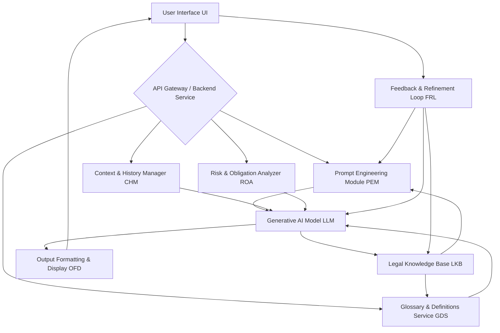

**FACT HEADER - NOTICE OF CONCEPTION**

**Conception ID:** DEMOBANK-INV-057
**Title:** System and Method for Natural Language Explanation of Legal Clauses
**Date of Conception:** 2024-07-26
**Conceiver:** The Sovereign's Ledger AI

**Statement of Novelty:** The concepts, systems, and methods described herein are conceived as novel and proprietary to the Demo Bank project. This document serves as a timestamped record of conception.

---

**Title of Invention:** System and Method for Natural Language Explanation of Legal Clauses

**Abstract:**
A system for interpreting legal documents is disclosed. A user provides a snippet of legal text [a "clause"]. This text is sent to a generative AI model that is prompted to act as a legal expert. The AI analyzes the clause and generates a simple, plain-English explanation of its meaning, implications, and potential risks. This allows non-lawyers to better understand complex legal contracts and agreements, democratizing access to legal comprehension. The system further includes mechanisms for contextual grounding via a legal knowledge base, identification of key entities, and a feedback loop for continuous improvement.

**Background of the Invention:**
Legal documents are written in a specialized, dense language ["legalese"] that is often incomprehensible to non-lawyers. This information asymmetry creates risk, as individuals and businesses may agree to terms they do not fully understand. Hiring a lawyer to review every document is expensive and time-consuming. There is a need for an accessible tool that can provide an initial, high-level explanation of complex legal text, highlighting key obligations, rights, and potential risks efficiently. Existing solutions often lack the nuance or contextual understanding provided by advanced generative AI.

**Brief Summary of the Invention:**
The present invention provides an "AI Clause Explainer." A user can copy and paste any snippet of legal text into an input field. The system sends this text to a large language model [LLM]. The prompt instructs the AI to "explain this legal clause in simple, plain English, as if you were talking to a high school student." The AI, trained on a vast corpus of legal and general texts and augmented by a dedicated legal knowledge base, can parse the complex syntax and translate the core legal concepts into an easy-to-understand explanation. This explanation is then displayed to the user, providing them with immediate clarity. Advanced features include risk assessment, entity extraction, and definitions for specific legal terms.

**Detailed Description of the Invention:**
The AI Clause Explainer operates as a modular system, designed for integration within a broader legal technology suite or as a standalone application. A user is reviewing a contract and encounters a confusing clause. They interact with the "AI Clause Explainer" feature.

1.  **Input:** The user pastes the legal clause:
    `"The Party of the First Part (hereinafter "Discloser") shall indemnify, defend, and hold harmless the Party of the Second Part (hereinafter "Recipient") from and against any and all claims, losses, damages, liabilities, and expenses..."`
2.  **Prompt Construction:** The backend service constructs a sophisticated prompt for a generative AI model. This prompt may include:
    *   Role instruction: `You are a helpful legal assistant who explains complex topics in simple terms.`
    *   Task instruction: `Explain the following legal clause in plain English, focusing on key obligations, rights, and potential risks for the Recipient. Identify any critical legal terms and offer a concise definition.`
    *   Contextual data: Optionally, relevant document metadata, previous clauses, or definitions from a Legal Knowledge Base [LKB] are added.
    **Prompt Example:**
    ```
    You are a helpful legal assistant who explains complex topics in simple terms. Your goal is to simplify legal jargon without losing critical meaning, and to highlight potential risks or obligations.
    
    Explain the following legal clause in plain English, as if explaining it to a non-expert. Focus on:
    1. What the clause means in simple terms.
    2. Any specific obligations or rights it creates.
    3. Any potential risks or liabilities for the parties involved, particularly the 'Recipient'.
    4. Provide a simple definition for any complex legal terms you encounter.
    
    **Clause:**
    "[The clause text from the input]"
    
    **Simple Explanation:**
    ```
3.  **AI Generation:** The LLM processes the prompt and generates a simplified explanation. This process may involve a Retrieval Augmented Generation [RAG] step where the clause's terms are cross-referenced against a Legal Knowledge Base [LKB] to provide more accurate and contextually relevant definitions or precedents.
    **AI Output:**
    ```
    This is an indemnification clause.
    
    **1. What it means:** If someone takes legal action (sues) the Recipient because of something the Discloser did, the Discloser is legally obligated to protect the Recipient. This means the Discloser must cover the Recipient's legal costs (like lawyer fees) and any money the Recipient might have to pay out as a result of that lawsuit (like damages or settlements).
    
    **2. Obligations/Rights:**
    *   **Discloser's Obligation:** To 'indemnify, defend, and hold harmless' the Recipient. This is a significant financial and legal responsibility.
    *   **Recipient's Right:** To be protected from financial loss and legal trouble stemming from the Discloser's actions.
    
    **3. Potential Risks (for Recipient):** While this clause protects the Recipient, the main risk is the Discloser's ability or willingness to actually fulfill this obligation. If the Discloser goes bankrupt or refuses to pay, the Recipient could still be liable. It's important to understand the Discloser's financial stability.
    
    **4. Definitions:**
    *   **Indemnify:** To compensate someone for harm or loss. Essentially, to promise to pay for any losses or damages incurred by another party.
    *   **Defend:** To pay for and provide legal representation for the Recipient in a lawsuit.
    *   **Hold Harmless:** To protect someone from being held responsible for any damage or injury.
    ```
4.  **Output:** The clear, plain-English explanation, complete with risk highlights and definitions, is displayed to the user in the UI, giving them an immediate and comprehensive understanding of their potential obligation or right under the contract. A feedback mechanism allows users to rate the explanation's clarity and accuracy.

---

**System Architecture:**
The AI Legal Clause Explainer employs a modular architecture to ensure scalability, maintainability, and extensibility.



**System Components:**

*   **User Interface [UI]:** The front-end application [web, mobile, or desktop] where users input legal text, view explanations, provide feedback, and interact with other features. It provides a clean, intuitive experience for non-legal experts.
*   **API Gateway / Backend Service [Backend]:** Acts as the central orchestrator, handling user requests, routing them to the appropriate modules, managing sessions, and ensuring secure communication. It exposes a set of RESTful or GraphQL APIs for the UI.
*   **Prompt Engineering Module [PEM]:** Responsible for dynamically constructing optimal prompts for the Generative AI Model. It incorporates user input, system-defined instructions, contextual data from the `CHM`, and relevant legal terms or definitions from the `LKB` to maximize the LLM's understanding and response quality.
*   **Generative AI Model [LLM]:** The core AI engine [e.g., GPT-4, Llama, custom fine-tuned model] that receives the engineered prompt and generates the plain-English explanations, risk assessments, and definitions. It may be deployed locally or accessed via an external API.
*   **Legal Knowledge Base [LKB]:** A structured repository of legal definitions, common clauses, case law summaries, statutory references, and legal precedents. This knowledge base is utilized for Retrieval Augmented Generation [RAG] to ground the LLM's responses, ensuring accuracy and reducing hallucination. It can be dynamically updated.
*   **Context & History Manager [CHM]:** Stores and manages interaction history and contextual information for multi-turn conversations or document-level analysis. This allows the system to maintain a coherent understanding across multiple queries related to the same document or topic.
*   **Risk & Obligation Analyzer [ROA]:** A specialized module that processes the LLM's initial explanation or directly analyzes the input clause to identify and quantify potential risks, obligations, rights, and liabilities for specific parties. It may leverage rule-based systems or additional ML models alongside the LLM.
*   **Glossary & Definitions Service [GDS]:** Automatically extracts and provides concise definitions for identified legal terms within the explanation. It interfaces with the `LKB` to retrieve accurate, simplified definitions.
*   **Output Formatting & Display [OFD]:** Takes the raw output from the `LLM`, `ROA`, and `GDS`, and formats it into a user-friendly, structured explanation suitable for display in the `UI`. This may include highlighting, bullet points, and distinct sections for meaning, risks, and definitions.
*   **Feedback & Refinement Loop [FRL]:** Gathers explicit user feedback [e.g., upvotes/downvotes, correctness ratings] and implicit feedback [e.g., usage patterns]. This data is used to continually fine-tune the `PEM`, improve the `LLM`'s performance [via supervised fine-tuning or reinforcement learning from human feedback RLHF], and update the `LKB`.

**Operational Flow Examples:**

1.  **Simple Clause Explanation Flow:**
    *   User inputs `Clause` into `UI`.
    *   `UI` sends `Clause` to `Backend`.
    *   `Backend` sends `Clause` to `PEM`.
    *   `PEM` constructs `Prompt` using `Clause`.
    *   `Prompt` is sent to `LLM`.
    *   `LLM` optionally queries `LKB` for `RAG` data.
    *   `LLM` generates `Explanation`.
    *   `Explanation` is sent to `OFD`.
    *   `OFD` formats and sends `Formatted Explanation` to `UI`.
    *   `UI` displays `Formatted Explanation` to User.

2.  **Risk Identification Flow:**
    *   [Initial explanation flow completes].
    *   User clicks "Show Risks" or `ROA` is triggered automatically.
    *   `Backend` sends `Clause` and `LLM Output` to `ROA`.
    *   `ROA` analyzes the `Clause` and/or `Explanation` to identify risks/obligations, possibly consulting `LKB`.
    *   `ROA` generates `Risk Report`.
    *   `Risk Report` is integrated by `OFD` into the overall `Explanation`.
    *   `UI` updates display with `Enhanced Explanation` including risks.

**Use Cases and Benefits:**

*   **Contract Review for Small Businesses:** Enables business owners without dedicated legal teams to quickly grasp the implications of vendor contracts, leases, and agreements, reducing legal spend and risk.
*   **Personal Legal Document Understanding:** Helps individuals understand complex documents like mortgage agreements, insurance policies, terms of service, and wills, empowering informed decisions.
*   **Educational Tool for Legal Studies:** Provides a practical tool for law students or paralegals to deconstruct legal texts and understand their plain-English equivalents, aiding in learning and comprehension.
*   **Streamlining Legal Department Workflows:** Allows in-house legal teams to perform initial triage of documents, quickly identify high-risk clauses, and generate first-pass explanations for business stakeholders, freeing up lawyer time for more complex tasks.
*   **Financial Services Compliance:** Assists compliance officers in understanding regulatory texts and internal policies, ensuring broader comprehension across teams.

**Technical Considerations:**

*   **LLM Selection and Fine-tuning:** The choice of LLM depends on factors like cost, performance, and specific legal domain expertise. Fine-tuning an open-source LLM on a proprietary legal corpus can enhance accuracy and reduce biases.
*   **Data Security and Privacy:** All data handling must comply with relevant regulations [e.g., GDPR, CCPA]. Legal documents are highly sensitive, requiring robust encryption, access controls, and potentially on-premise or secure cloud deployment. User input and LLM interactions must be anonymized where possible.
*   **Scalability and Performance:** The system must be able to handle a high volume of requests efficiently, especially for enterprise use. This involves optimized `LLM` inference, efficient `LKB` querying, and a scalable backend infrastructure.
*   **API Design:** A well-documented, secure, and performant API is crucial for seamless integration with existing `DEMOBANK` systems and potential third-party applications.
*   **Ethical AI Use:** Continuous monitoring for bias, ensuring transparency in explanations, and clearly stating the AI's role as an assistant [not a substitute for legal counsel] are paramount.

**Future Enhancements:**

*   **Multi-Document Analysis and Comparison:** Ability to analyze multiple related legal documents [e.g., master agreement and its amendments] or compare clauses across different contracts.
*   **Automated Clause Redlining/Drafting Suggestions:** Suggesting alternative plain-English phrasing for clauses or identifying areas for negotiation based on best practices.
*   **Integration with Voice Interfaces:** Allowing users to verbally query the system and receive spoken explanations.
*   **Real-time Legal News Integration:** Incorporating recent legal developments or changes in legislation into the contextual understanding and risk assessment.
*   **Multi-lingual Support:** Extending the system to explain legal clauses in various languages, broadening its global applicability.
*   **Generative Summarization:** Producing executive summaries of entire legal documents.

**Claims:**
1.  A method for interpreting a legal document, comprising:
    a.  Receiving a portion of text from a legal document from a user.
    b.  Transmitting the text to a generative AI model.
    c.  Prompting the model to generate an explanation of the text's meaning in simple, non-legal language.
    d.  Displaying the AI-generated explanation to the user.

2.  The method of claim 1, wherein the prompt instructs the model to explain the potential risks or obligations implied by the text.

3.  The method of claim 1, further comprising:
    e.  Consulting a Legal Knowledge Base [LKB] to retrieve contextual information or definitions relevant to the text.
    f.  Incorporating the retrieved information into the prompt provided to the generative AI model to enhance accuracy and relevance.

4.  The method of claim 1, further comprising:
    e.  Identifying specific legal terms within the received text or the AI-generated explanation.
    f.  Providing concise, plain-English definitions for the identified legal terms, retrieved from a Glossary & Definitions Service [GDS] that interfaces with a Legal Knowledge Base [LKB].

5.  A system for interpreting legal documents, comprising:
    a.  A User Interface [UI] configured to receive legal text input from a user.
    b.  A Backend Service configured to receive the legal text from the `UI`.
    c.  A Prompt Engineering Module [PEM] configured to construct a prompt for a generative AI model based on the received legal text and predefined instructions.
    d.  A Generative AI Model [LLM] configured to receive the prompt and generate a plain-English explanation of the legal text.
    e.  An Output Formatting & Display [OFD] module configured to format the `LLM`-generated explanation for user display.
    f.  A Legal Knowledge Base [LKB] accessible by the `LLM` and `PEM` to provide contextual grounding and definitions.

6.  The system of claim 5, further comprising a Risk & Obligation Analyzer [ROA] configured to identify and highlight potential risks, obligations, or rights within the legal text or the `LLM`-generated explanation.

7.  The system of claim 5, further comprising a Feedback & Refinement Loop [FRL] configured to collect user feedback on the generated explanations and use this feedback to improve system performance.

**Mathematical Justification:**
Let `L_legal` be the domain of legal language and `L_plain` be the domain of plain English. Let `c` be a clause in `L_legal`. The core goal is to find a translation function `T: L_legal -> L_plain` that preserves the essential semantic meaning `I`. So, ideally, `I(c) ~= I(T(c))`.

The generative AI model `G_AI` is a learned approximation of this function. Given a clause `c` and a context `Ctx` [e.g., from `LKB`, `CHM`], the model generates an explanation `c'`:
```
c' = G_AI(c, Ctx)
```
Where `c'` aims to be a plain-English equivalent such that `c' ~= T(c)`.

To quantify the 'plainness' or comprehensibility, let `S` be a comprehensibility score, where a higher score indicates easier understanding.
We aim for `S(c') >> S(c)`.

Furthermore, for identifying critical elements like risks and obligations, let `R_c` be the set of risks in `c`, and `O_c` be the set of obligations in `c`. The system should effectively extract or infer these from the plain explanation `c'`.
Let `R_AI(c')` and `O_AI(c')` be the risks and obligations identified from `c'`. We aim for:
```
R_AI(c') ~= R_c
O_AI(c') ~= O_c
```
This implies `G_AI` must not only translate but also retain or even highlight critical functional aspects of the legal text.

**Proof of Value:**
The cognitive cost for a non-expert human `H` to understand `c` [denoted `Cost(H, c)`] is very high due to specialized vocabulary and complex syntax. The cost to understand the AI-generated plain-English explanation `c'` [denoted `Cost(H, c')`] is significantly lower.

The value `V` of the system is the reduction in these cognitive costs:
```
V = Cost(H, c) - Cost(H, c')
```
As `Cost(H, c')` is designed to be substantially lower than `Cost(H, c)`, `V` is large and positive. The system is proven valuable as it provides a low-cost, immediate method for semantic translation between a specialized domain language and a general one. This democratizes access to complex information, reduces the risk of misunderstanding in legal agreements, and empowers individuals and businesses to make more informed decisions. The inclusion of risk analysis and definitions further amplifies this value by providing actionable insights. `Q.E.D.`