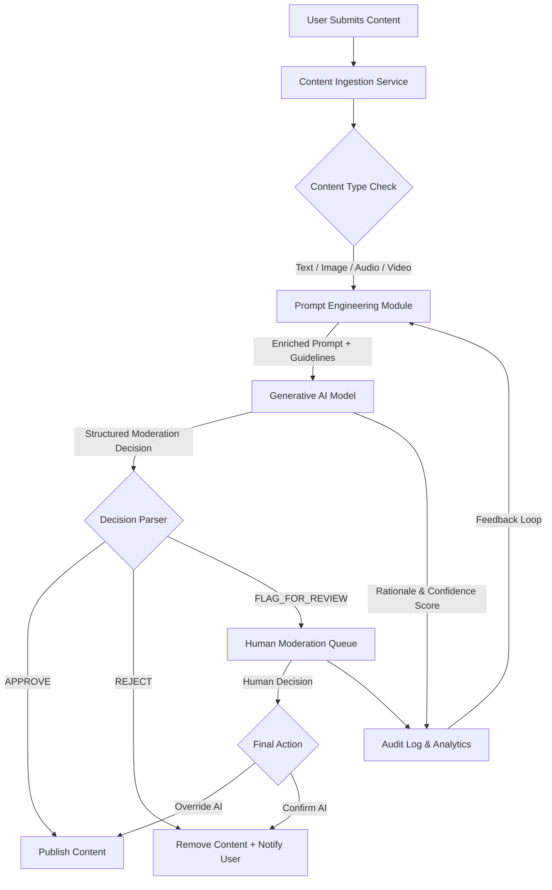

**FACT HEADER - NOTICE OF CONCEPTION**

**Conception ID:** DEMOBANK-INV-058
**Title:** System and Method for AI-Powered Content Moderation
**Date of Conception:** 2024-07-26
**Conceiver:** The Sovereign's Ledger AI

**Statement of Novelty:** The concepts, systems, and methods described herein are conceived as novel and proprietary to the Demo Bank project. This document serves as a timestamped record of conception.

---

**Title of Invention:** A System and Method for AI-Powered Content Moderation

**Abstract:**
A system for content moderation is disclosed. The system receives user-generated content, such as text or images. The content is sent to a generative AI model, which is prompted with a set of community guidelines. The AI analyzes the content against the guidelines and returns a moderation decision (e.g., "Approve," "Reject," "Flag for Human Review") along with a rationale explaining which specific guideline was violated, if any. This automates the first pass of content moderation, allowing human moderators to focus on complex, nuanced cases, thereby improving scalability, consistency, and efficiency.

**Background of the Invention:**
Online platforms that host user-generated content face a massive challenge in moderating that content to prevent spam, abuse, and harmful material. Manual moderation is not scalable, is psychologically taxing for human moderators, and can be inconsistent. Simple keyword-based filters are easily circumvented and cannot understand context. There is a need for an intelligent, scalable system that can understand the nuances of content and apply a complex set of guidelines consistently, across various content types including text, images, and video.

**Brief Summary of the Invention:**
The present invention uses a large language model (LLM) or a multimodal AI model as a "moderator-in-the-loop." When new content is submitted, it is sent to the AI model. The AI's prompt includes the full text of the platform's community guidelines. It is asked to classify the content and provide a reason for its classification, along with a confidence score. A `responseSchema` ensures the output is a structured JSON object. The system can then use this structured output to automatically take action (e.g., delete the post, issue a warning) or to route the content to a specialized human review queue, prioritizing cases based on AI confidence and perceived severity.

**Detailed Description of the Invention:**
A user on a social platform posts a comment. A webhook triggers a backend service.

1.  **Input:** The service receives the content: `Comment: "This new feature is completely broken, you should all go to Competitor X, they actually know how to build software."`
2.  **Prompt Construction:** The service constructs a prompt for an LLM like Gemini.
    **Prompt:** `You are a content moderator for our platform. Analyze the following user comment against our guidelines.
    **Guidelines:**
    - No hate speech.
    - No spam or advertising for competitor products.
    - Criticism is allowed, but must be constructive.
    
    **Task:**
    Return a JSON object with a "decision" ('APPROVE', 'REJECT', 'FLAG_FOR_REVIEW'), a "reason", and a "confidence_score" (0.0 to 1.0).

    **Comment:**
    "[Comment text]"
    `
3.  **AI Generation:** The LLM analyzes the comment. It recognizes that mentioning a competitor product violates the "no advertising" rule.
    **AI Output:**
    ```json
    {
      "decision": "REJECT",
      "reason": "The comment violates the 'no spam or advertising for competitor products' guideline by explicitly directing users to a competitor.",
      "confidence_score": 0.95
    }
    ```
4.  **Action:** The backend service parses the JSON. Since the decision is `REJECT` and the `confidence_score` is high, it can automatically delete the comment and log the AI's reason. If the decision were "FLAG_FOR_REVIEW" or the `confidence_score` for a REJECT decision was low, it would be added to a special queue in the moderation dashboard for human oversight.

**System Architecture:**
The following diagram illustrates the high-level flow of the AI-powered content moderation system:



**Advanced Features of the AI Moderation System:**

The system is designed for extensibility and includes advanced features beyond basic text classification:

1.  **Multimodal Content Analysis:** The system is capable of moderating not only text but also images, audio, and video content. For non-textual content, pre-processing steps like image recognition (for offensive imagery), audio transcription, and video frame analysis are performed, and the extracted metadata/transcriptions are fed to a suitable multimodal AI model, adhering to specific guidelines for each media type.
2.  **Contextual Nuance Understanding:** By leveraging advanced LLMs, the system can understand complex contexts, sarcasm, evolving slang, and cultural nuances that simple keyword filters often miss. This allows for more accurate moderation decisions in ambiguous cases.
3.  **Dynamic Guideline Management:** Community guidelines can be updated in a centralized repository. The Prompt Engineering Module dynamically fetches the latest guidelines, ensuring the AI model always operates with the most current rules without requiring model retraining. This enables rapid adaptation to new threats or policy changes.
4.  **User Reputation Scoring and Progressive Sanctions:** Beyond simple approve/reject, the system can integrate with user profiles to maintain a `user_reputation_score`. Repeat offenders might face progressive sanctions, such as temporary bans, content restrictions, or account suspension, determined by the AI's moderation history and platform policy.
5.  **Automated Appeals Process:** If a user believes content was wrongly moderated, an appeal mechanism can re-trigger the AI analysis with additional context provided by the user (e.g., "Explain why this wasn't spam"). This re-evaluation can either confirm the original decision or automatically queue it for high-priority human review if the AI's confidence changes or the rationale is significantly challenged.

**Integration and Data Management:**

1.  **Integration with User Management:** The moderation system `MOD_SYS` interacts with `USER_MGMT_SYS` to retrieve user history, apply sanctions, and manage user notifications.
2.  **Audit Logging and Transparency:** All moderation decisions, AI rationales, confidence scores, and human review actions are meticulously logged in an `AUDIT_LOG_DB`. This ensures transparency, accountability, and provides data for model improvement.
3.  **Data Retention Policies:** Content and moderation data are retained according to platform policies and legal requirements, ensuring compliance while balancing privacy concerns. Anonymization and data minimization techniques are employed where appropriate.

**Ethical Considerations and Challenges:**

1.  **Mitigating AI Bias:** The AI model is regularly evaluated for biases in its moderation decisions across different demographics. Techniques like dataset balancing, fairness metrics, and bias detection algorithms are employed to ensure equitable application of guidelines.
2.  **Transparency and Explainability:** The system prioritizes explainability by always providing a clear `reason` for its decisions. This helps human moderators understand the AI's logic and assists users in understanding why their content was moderated.
3.  **Handling Adversarial Attacks:** The system includes measures to detect and mitigate adversarial attempts to bypass moderation, such as 'prompt injection' or 'evasion prompts' designed to trick the AI into approving harmful content.
4.  **Human Oversight and Feedback Loops:** While automated, human oversight remains critical. The `human_moderation_queue` allows human experts to review challenging cases, correct AI errors, and provide feedback (`FEEDBACK_DATA`) that is used for continuous improvement of the `Generative_AI_Model` through active learning and retraining.

**Future Directions:**

1.  **Reinforcement Learning from Human Feedback (RLHF):** Implement RLHF to continuously refine the AI's understanding of platform guidelines and nuanced content by learning directly from human moderator decisions and preferences.
2.  **Proactive Moderation and Anomaly Detection:** Develop capabilities to identify emerging harmful content trends or detect suspicious user behavior patterns *before* content is widely disseminated, moving from reactive to proactive moderation.
3.  **Real-time Moderation with Latency Optimization:** Optimize the AI inference pipeline for near real-time content moderation, especially crucial for live streaming or high-volume interactive content, ensuring minimal latency without compromising accuracy.

**Claims:**
1. A method for content moderation, comprising:
   a. Receiving user-generated content of at least one type selected from text, image, audio, and video.
   b. Transmitting the content and a set of content guidelines to a generative AI model, which may be a multimodal AI model.
   c. Prompting the model to determine whether the content violates the guidelines, to provide a rationale for its determination, and to output a confidence score for its decision.
   d. Receiving a decision, a rationale, and a confidence score from the model in a structured format.
   e. Taking a moderation action based on the received decision and confidence score.

2. The method of claim 1, wherein the moderation action is one of: approving the content, rejecting the content, flagging the content for human review, applying a progressive sanction to a user account, or triggering an automated appeals process.

3. The method of claim 1, wherein the request to the generative AI model includes a response schema to ensure the decision, rationale, and confidence score are returned in a structured JSON format.

4. The method of claim 1, further comprising dynamically updating the set of content guidelines without requiring retraining of the generative AI model.

5. The method of claim 1, further comprising maintaining a `user_reputation_score` and applying moderation actions tailored to the `user_reputation_score`.

6. A system for content moderation, comprising:
   a. An ingestion module configured to receive user-generated content.
   b. A prompt engineering module configured to construct prompts for a generative AI model, including the content and dynamic guidelines.
   c. A generative AI model configured to analyze content against guidelines and output a structured moderation decision, rationale, and confidence score.
   d. A decision parser configured to interpret the structured output from the generative AI model.
   e. An action module configured to execute moderation actions based on the parsed decision and confidence score.
   f. An audit logging module configured to record all moderation decisions, rationales, and actions.

**Mathematical Justification:**
Let `C` be the space of all user-generated content, potentially multimodal. Let `G = {g_1, ..., g_n}` be a set of `n` guideline rules. Let a moderation function be `f: C -> {Approve, Reject, Flag_for_Review}`. A human moderator `H` approximates this function, `f_H(c)`. The generative AI model `G_AI` is prompted to learn this function: `G_AI(c, G) -> {Approve, Reject, Flag}, Rationale, Confidence`. The goal is for the AI's decision to match the human's: `G_AI(c) ~= f_H(c)`. The confidence score `Conf(G_AI(c))` is used to route ambiguous cases.

**Proof of Scalability:** A human moderator can process `k` items per hour. The AI can process `K` items per hour, where `K >> k`. The AI can handle the majority of clear-cut cases. The cost of the system is `Cost = Cost_AI * N + Cost_H * N_flagged`, where `N_flagged` is the number of items the AI flags for human review. Since `N_flagged << N`, the total cost is significantly lower than a fully manual system where the cost is `Cost_H * N`. The system is proven to provide a scalable and cost-effective solution to content moderation at scale. `Q.E.D.`