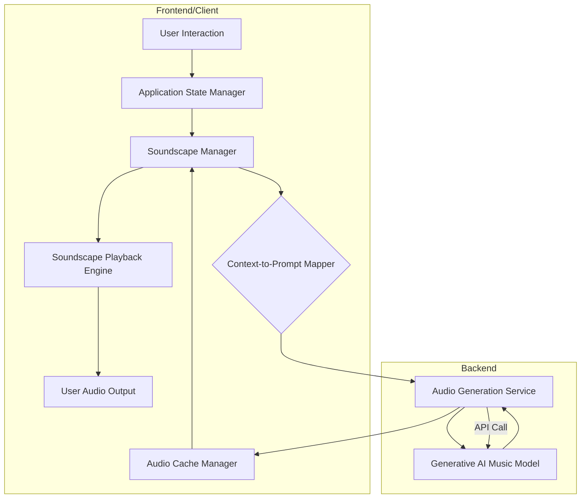

**FACT HEADER - NOTICE OF CONCEPTION**

**Conception ID:** DEMOBANK-INV-059
**Title:** System and Method for Generating Adaptive User Interface Soundscapes
**Date of Conception:** 2024-07-26
**Conceiver:** The Sovereign's Ledger AI

**Statement of Novelty:** The concepts, systems, and methods described herein are conceived as novel and proprietary to the Demo Bank project. This document serves as a timestamped record of conception.

---

**Title of Invention:** System and Method for Generating Adaptive User Interface Soundscapes

**Abstract:**
A system for creating non-intrusive, adaptive background music for a software application is disclosed. The system monitors the user's current activity or context within the application (e.g., "browsing," "focused work," "error state"). This context is used to prompt a generative AI music model. The AI generates a short, ambient musical piece that reflects the current context. The system can seamlessly transition between these generated soundscapes as the user's context changes, enhancing the user experience without being distracting.

**Background of the Invention:**
Sound can significantly impact user experience, but most applications are silent or use a limited set of static sound effects. Using traditional licensed music for backgrounds is expensive and repetitive. There is a need for a system that can generate an infinite variety of royalty-free, contextually appropriate background music that enhances, rather than distracts from, the user's task.

**Brief Summary of the Invention:**
The present invention is an "AI-powered DJ" for a user interface. The application's state manager tracks the user's current context. When the context changes (e.g., the user opens a data-heavy analytics view), the system sends a prompt to a generative AI music model like Google's MusicLM. The prompt might be, "Generate a 60-second, minimalist, ambient electronic music loop suitable for deep focus and data analysis." The AI model returns a generated audio file, which the application's UI then begins to play in a loop. If the user navigates to a more social or collaborative part of the app, a new prompt is sent to generate a more upbeat track.

**Detailed Description of the Invention:**
A client-side "Soundscape Manager" service subscribes to the application's global state. This manager orchestrates the entire process of detecting context changes, requesting new audio, and managing playback.

1.  **Context Monitoring and Change Detection:**
    *   The `Soundscape Manager` continuously monitors the application's global state, which is managed by a central `Application State Manager`.
    *   When a significant state change occurs (e.g., navigation to a new view, activation of a specific feature, user interaction patterns), the `Soundscape Manager` is notified.
    *   Example: The user navigates from the main dashboard to a complex data visualization view. The application state changes from `context: 'browsing'` to `context: 'analysis'`.

2.  **Prompt Generation via `Context-to-Prompt Mapper`:**
    *   Upon detecting a context change, the `Soundscape Manager` queries a `Context-to-Prompt Mapper`. This mapper is a configurable component (e.g., a dictionary or a rules engine) that translates structured application contexts into natural language prompts optimized for a generative AI music model.
    *   The mapper can include variables from the context, such as `user_preferences_mood_preference`, `data_density_level`, `time_of_day`, etc., to create richer, more personalized prompts.
    *   Example: `'analysis'` context, combined with `user_preference: 'calm'`, `time_of_day: 'morning'`, might yield: `"Generate a 60-second, calm, minimalist, ambient electronic music loop suitable for deep focus and data analysis, with a subtle morning vibe."`

3.  **AI Music Generation via `Audio Generation Service`:**
    *   The `Soundscape Manager` sends the generated prompt to a dedicated `Audio Generation Service`. This service acts as a secure intermediary, making API calls to a generative AI music model (e.g., Google's MusicLM, OpenAI's Jukebox, a proprietary model).
    *   The `Audio Generation Service` handles API authentication, rate limiting, and potentially model selection if multiple generative models are supported. It also manages the format conversion and initial processing of the generated audio.
    *   The service aims to return a short, high-quality audio file (e.g., MP3, OGG, WAV).

4.  **Audio Caching:**
    *   Before playing, the generated audio is stored in a client-side `Audio Cache`. This cache stores recently generated or frequently used soundscapes, reducing the need for repeated AI generation calls, especially for recurring contexts.
    *   The cache can employ a Least Recently Used (LRU) or similar eviction policy.

5.  **Audio Playback and Seamless Transition:**
    *   The `Soundscape Manager` loads the audio from the cache into an HTML5 `<audio>` element (or equivalent client-side audio API).
    *   Playback begins, typically on a loop.
    *   Crucially, when a new track is introduced, the system employs a subtle crossfade mechanism. The outgoing track's volume is gradually decreased while the incoming track's volume is simultaneously increased, ensuring a smooth, non-jarring transition that maintains immersion.
    *   Volume normalization is applied to all generated tracks to ensure consistent loudness across different soundscapes.

6.  **Error State and Event-Driven Sounds:**
    *   Beyond background music, the system can generate specific, short, non-looping sounds for distinct application events or error states.
    *   If the user encounters an application error, the state might change to `context: 'error'`. The `Context-to-Prompt Mapper` would then generate a prompt for "a short, neutral, and unobtrusive sound to signify an application error," which the `Audio Generation Service` would process, and the `Soundscape Manager` would play once.
    *   Similarly, for success notifications, warnings, or completion indicators, unique audio cues can be generated.

### System Architecture

The proposed system comprises several interconnected components, designed for modularity, scalability, and seamless integration with existing application frameworks.



**Description of Components:**

*   **Application State Manager:** Centralized service within the application that tracks and broadcasts changes in the user's current context, view, or activity.
*   **Soundscape Manager:** The core orchestration service on the client-side. It subscribes to state changes, requests prompts, interacts with the cache, and controls audio playback.
*   **Context-to-Prompt Mapper:** A logic module that translates structured application context data (e.g., `{'view': 'analytics', 'data_density': 'high', 'user_focus': 'deep'}`) into natural language prompts for the generative AI model. It can incorporate user preferences.
*   **Audio Generation Service:** A backend service that securely interfaces with external Generative AI Music Models. It handles API authentication, request formatting, model selection, and initial audio processing (e.g., format conversion, basic mastering).
*   **Generative AI Music Model:** The external AI service responsible for generating novel audio compositions based on text prompts.
*   **Audio Cache Manager:** Client-side component that stores recently generated or frequently accessed audio files to minimize latency and API calls. It manages cache eviction policies.
*   **Soundscape Playback Engine:** The client-side audio player responsible for loading, playing, looping, crossfading, and managing the volume of audio tracks. It typically leverages HTML5 audio APIs or Web Audio API.
*   **User Audio Output:** The device speakers or headphones through which the user hears the generated soundscapes.

### Key Components

The system's functionality is built upon several distinct, yet interconnected, components:

#### `Application State Monitor`
This component is responsible for observing and reporting changes in the user's current activity and context within the software application. It might track:
*   Active view/screen
*   Current task or workflow stage
*   Type and volume of data being displayed
*   User interaction patterns (e.g., idle vs. active, typing speed)
*   System notifications (errors, successes)
It acts as the primary data source for the `Soundscape Manager`.

#### `Context-to-Prompt Mapper`
A crucial intermediary, this module translates the raw or structured application context into an effective textual prompt for the generative AI. Its responsibilities include:
*   **Context Normalization:** Standardizing various application contexts into a unified format.
*   **Prompt Templating:** Using predefined templates or a rule-based system to construct prompts.
*   **Personalization Integration:** Incorporating user-specific preferences (e.g., preferred genres, moods, instrument choices) into the prompt.
*   **Dynamic Prompt Augmentation:** Adjusting prompts based on environmental factors (e.g., time of day, day of week) or system load.
For example, for a "data entry" context, if the user prefers "upbeat" music, the mapper might generate: `Generate a 90-second, slightly upbeat, lo-fi hip-hop track for focused data entry.`

#### `Audio Generation Service`
This backend service acts as a gateway to one or more generative AI music models. Its functions include:
*   **API Management:** Securely handling API keys, authentication, and rate limits for AI model integrations.
*   **Model Routing:** Directing prompts to the most appropriate or available AI model.
*   **Request Optimization:** Formatting prompts and parameters (e.g., length, instrument preference) for specific AI models.
*   **Post-Generation Processing:** Performing basic audio mastering, such as volume normalization and format conversion (e.g., from raw AI output to MP3/OGG), before serving the audio to the client.

#### `Soundscape Playback Engine`
The client-side module responsible for the actual playback experience. Key features include:
*   **Audio Loading and Decoding:** Efficiently loading and preparing audio files for playback.
*   **Looping:** Seamlessly looping background music tracks.
*   **Crossfading and Transitions:** Implementing smooth volume fades between an outgoing and an incoming track to prevent abrupt changes.
*   **Volume Control:** Managing global and contextual volume levels, potentially with adaptive adjustment based on application activity or user input.
*   **Event-Driven Playback:** Playing short, non-looping sound cues for specific events (e.g., errors, notifications).

#### `Audio Cache Manager`
This client-side component optimizes performance and reduces reliance on the `Audio Generation Service`:
*   **Storage:** Persistently storing recently generated or frequently requested audio tracks.
*   **Eviction Policy:** Implementing strategies like LRU (Least Recently Used) to manage cache size.
*   **Pre-fetching:** Proactively fetching and caching audio for anticipated future contexts to minimize perceived latency during transitions.
*   **Integrity Checks:** Ensuring cached audio files are valid and not corrupted.

### Advanced Features and Embodiments

The core system can be extended with several advanced features to further enhance user experience, personalization, and adaptability.

#### User Preferences and Personalization
*   **Explicit Customization:** Allow users to define their preferred musical styles, moods, instrumentations, or even specific keywords (e.g., "orchestral," "jazz fusion," "rainy day ambiance") which are then integrated into the prompts generated by the `Context-to-Prompt Mapper`.
*   **Implicit Feedback Learning:** Observe user behavior (e.g., skipping tracks, adjusting volume, spending longer in certain contexts with specific soundscapes) to subtly refine prompt generation or track selection over time, creating a more personalized soundscape.

#### Dynamic Prompt Refinement
*   Instead of static prompts, the system can dynamically refine prompts. For instance, if an initial prompt generates an unsuitable track (e.g., too energetic for 'focus' context, as determined by user feedback or internal metrics), the system can add modifiers like `less intense` or `more soothing` to the next generation request.
*   Leverage large language models (LLMs) to intelligently parse user intent and application context into highly nuanced prompts.

#### Biometric Integration
*   Integrate with biometric sensors (e.g., heart rate monitors, galvanic skin response sensors) to detect user stress levels, focus, or relaxation.
*   Use this real-time biometric data to modify prompts or even generate immediate, adaptive sound adjustments (e.g., if stress levels rise, transition to a more calming soundscape).

#### Multi-AI Model Support
*   The `Audio Generation Service` can be configured to integrate with and dynamically select from multiple generative AI music models. This allows for:
    *   **Fallback Mechanism:** If one model fails or is unavailable, another can be used.
    *   **Specialization:** Different models might excel at generating specific genres or moods. The system can learn which model performs best for which type of prompt.
    *   **Cost Optimization:** Choose models based on generation cost and required quality.

#### Layered Soundscapes
*   Instead of a single track, the system can generate and play multiple, distinct audio layers concurrently.
*   Example: A base ambient layer for the general context, combined with a subtle "data stream" layer when large datasets are loading, and a gentle "success chime" layer upon task completion. Each layer can be independently generated and controlled.

#### Adaptive Volume Control
*   Automatically adjust the soundscape's volume based on:
    *   **Application Activity:** Lower volume during active typing or voice input, raise it during passive browsing.
    *   **External Audio:** Integrate with system audio output to detect other active audio sources (e.g., video calls, media playback) and duck the soundscape volume accordingly.
    *   **User Preference:** Learn and adapt to individual user's preferred ambient sound levels.

### Potential Use Cases

The Adaptive User Interface Soundscapes system has broad applicability across various software domains, enhancing user experience in diverse contexts.

*   **Productivity and Focus Applications:**
    *   **Example:** A code editor or writing application.
    *   **Benefit:** Generate ambient, non-distracting soundscapes tailored for deep work, flow state, or concentration, transitioning as the user moves between coding, debugging, or documentation.
*   **Data Analytics and Business Intelligence Dashboards:**
    *   **Example:** Financial trading platforms, marketing analytics tools.
    *   **Benefit:** Provide calm, focused backdrops for complex data analysis, shifting to slightly more dynamic tones when critical alerts or new data streams arrive, without being alarming.
*   **Educational Software and E-Learning Platforms:**
    *   **Example:** Online course modules, interactive learning environments.
    *   **Benefit:** Create engaging soundscapes for different learning activities (e.g., calm for reading, inspiring for creative tasks, subtly rhythmic for problem-solving), improving retention and engagement.
*   **Creative Tools (Graphic Design, Video Editing):**
    *   **Example:** Adobe Creative Suite, Figma.
    *   **Benefit:** Offer dynamic background music that matches the creative flow, whether it's brainstorming, intricate detailing, or final rendering, aiding concentration and mood.
*   **Healthcare and Wellness Applications:**
    *   **Example:** Meditation apps, therapy portals, health monitoring dashboards.
    *   **Benefit:** Generate calming, anxiety-reducing soundscapes for wellness activities, or gentle, reassuring tones for health data review, adapting to detected user stress.
*   **Gaming User Interfaces (Non-Diegetic):**
    *   **Example:** Game menus, inventory screens, character customization.
    *   **Benefit:** Enhance immersion and user experience within game interfaces with contextually relevant, non-intrusive music that maintains the game's theme without being part of the game world itself.
*   **Operating Systems and Desktop Environments:**
    *   **Example:** Adaptive system sounds and background ambience for desktop or mobile OS.
    *   **Benefit:** Provide a dynamic, evolving sonic environment for the entire computing experience, making interactions more pleasant and less jarring.

### Performance Considerations

Implementing an adaptive generative music system requires careful consideration of performance to ensure a smooth and responsive user experience.

*   **Latency of AI Generation:**
    *   **Challenge:** Generative AI models can take several seconds to minutes to produce an audio track. This latency is critical during context transitions.
    *   **Mitigation:**
        *   **Audio Caching:** Store generated tracks to avoid repeated API calls for common contexts.
        *   **Pre-fetching:** Anticipate likely future contexts and pre-generate audio in the background.
        *   **Fast Fallbacks:** If AI generation is too slow, fall back to a cached default track or a small library of pre-composed ambient loops.
        *   **Asynchronous Generation:** Ensure AI calls are non-blocking on the UI thread.

*   **Bandwidth Consumption:**
    *   **Challenge:** Streaming or downloading audio files, especially for new generations, can consume significant network bandwidth.
    *   **Mitigation:**
        *   **Efficient Audio Formats:** Use compressed formats like MP3 or OGG.
        *   **Optimized Lengths:** Generate shorter loops (e.g., 30-90 seconds) to reduce file size.
        *   **Client-side Cache:** Reduce repeated downloads.
        *   **Streaming/Chunking:** If supported by the AI service, stream audio as it's generated.

*   **Client-side Processing:**
    *   **Challenge:** Decoding audio, applying crossfades, and managing multiple audio elements can consume CPU and memory, especially on less powerful devices.
    *   **Mitigation:**
        *   **Web Audio API:** Utilize modern browser APIs for efficient audio processing.
        *   **Optimized Playback Engine:** Ensure the `Soundscape Playback Engine` is lightweight and uses efficient algorithms for transitions.
        *   **Resource Management:** Carefully manage the number of active audio elements and dispose of unused resources.

*   **Scalability:**
    *   **Challenge:** High user concurrency could overwhelm the `Audio Generation Service` or the underlying Generative AI Music Model APIs.
    *   **Mitigation:**
        *   **Backend Scaling:** Implement a scalable backend for the `Audio Generation Service` (e.g., serverless functions, container orchestration).
        *   **Rate Limiting & Queuing:** Manage requests to the external AI models to stay within API limits.
        *   **Multi-Model Support:** Distribute load across multiple AI models or providers.
        *   **Aggregated Caching:** Consider server-side caching of popular context-generated tracks.

### Security Considerations

The integration of external AI services and the handling of user data necessitate robust security measures.

*   **API Key and Credential Management:**
    *   **Challenge:** Direct client-side calls to generative AI APIs would expose sensitive API keys.
    *   **Mitigation:** All calls to the Generative AI Music Model must be proxied through a secure backend `Audio Generation Service`. This service must store API keys securely (e.g., environment variables, secret management services) and never expose them to the client.

*   **Data Privacy and User Consent:**
    *   **Challenge:** If user preferences or biometric data are used to personalize soundscapes, this data is sensitive.
    *   **Mitigation:**
        *   **Anonymization/Pseudonymization:** Process user data in a way that minimizes direct identification.
        *   **Explicit Consent:** Obtain clear and informed consent from users before collecting or using their data for personalization.
        *   **Secure Storage:** Store any collected user preferences securely and in compliance with data protection regulations (e.g., GDPR, CCPA).
        *   **Data Minimization:** Only collect data absolutely necessary for the intended functionality.

*   **Content Moderation and Bias:**
    *   **Challenge:** Generative AI models can sometimes produce unexpected or potentially inappropriate content, even audio.
    *   **Mitigation:**
        *   **Prompt Filtering:** Implement a robust prompt filtering mechanism in the `Audio Generation Service` to prevent malicious or inappropriate prompts from reaching the AI model.
        *   **Output Monitoring:** If feasible, incorporate mechanisms to quickly identify and remove or flag unsuitable generated audio.
        *   **Model Selection:** Choose AI models known for their robustness and safety features.

*   **Denial-of-Service (DoS) Attacks:**
    *   **Challenge:** Malicious users could try to flood the `Audio Generation Service` with requests, leading to increased costs or service degradation.
    *   **Mitigation:**
        *   **Rate Limiting:** Implement strict rate limiting on the `Audio Generation Service` to prevent excessive requests from a single client or IP address.
        *   **Authentication/Authorization:** Ensure only authenticated and authorized application instances can make requests.
        *   **Cost Monitoring:** Set up alerts for unusual spikes in AI API usage to detect and respond to potential attacks.

**Claims:**
1.  A system for generating adaptive user interface audio, comprising:
    a. An `Application State Monitor` configured to determine a user's current context within a software application;
    b. A `Context-to-Prompt Mapper` configured to translate said current context, optionally augmented by user preferences, into a textual prompt;
    c. An `Audio Generation Service` configured to transmit said textual prompt to a generative AI music model and receive a generated audio composition in response;
    d. An `Audio Cache Manager` configured to store and retrieve said generated audio compositions; and
    e. A `Soundscape Playback Engine` configured to play said audio composition to the user, including seamlessly transitioning between compositions.

2.  The system of claim 1, wherein the `Soundscape Playback Engine` is further configured to apply a crossfade transition between an outgoing audio composition and an incoming audio composition when the user's context changes.

3.  The system of claim 1, wherein the `Context-to-Prompt Mapper` is configured to incorporate explicit user preferences, implicit user behavior feedback, or biometric data into the generation of the textual prompt.

4.  The system of claim 1, wherein the `Audio Generation Service` is configured to integrate with and select from a plurality of generative AI music models based on criteria such as model performance, cost, or specialization.

5.  The system of claim 1, further comprising a `Soundscape Manager` configured to orchestrate the determination of context, prompt generation, audio generation, caching, and playback.

6.  A method for enhancing user experience in a software application, comprising:
    a. Continuously monitoring an application's state to detect changes in a user's context;
    b. Mapping the detected context to a specific textual prompt for audio generation;
    c. Requesting a new audio composition from a generative AI music model via an `Audio Generation Service` using said prompt;
    d. Caching the received audio composition on a client device;
    e. Playing the audio composition to the user; and
    f. When the user's context changes, gracefully transitioning from a currently playing audio composition to a newly generated or cached audio composition using a crossfade.

7.  The method of claim 6, further comprising generating and playing distinct, non-looping audio cues for specific application events or error states.

8.  The method of claim 6, further comprising dynamically adjusting the volume of the playing audio composition based on detected application activity or external audio sources.

9.  The method of claim 6, wherein the textual prompt is dynamically refined based on analysis of previous generated audio effectiveness or user feedback.

10. The method of claim 6, wherein multiple distinct audio layers are generated and played concurrently, with each layer adapting to different aspects of the user's context or application events.

**Mathematical Justification:**
```
Let S be the set of all user states or contexts within an application.
Let A be the space of all possible audio soundscapes.
Let U(s, a) be a utility function representing the user's focus or satisfaction when in state `s` belonging to `S` while hearing audio `a` belonging to `A`.
The goal is to find a policy `pi: S -> A` that maps each state to an audio track to maximize the user's utility.
The generative AI model `G_AI` is a function that takes a text description of the state `s` and generates an audio track:
```
G_AI(description(s)) -> a'
```

Proof of Utility:
A static system uses a single audio track `a_static` for all states, yielding an average utility `E[U(s, a_static)]`.
The adaptive system provides a state-dependent track `a'_s` generated by `G_AI(description(s))`.
The AI is trained to generate audio that is thematically and emotionally aligned with its text prompt.
Therefore, it is highly probable that the utility of the context-aware track is greater than the utility of the static track for any given state:
```
P(U(s, a'_s) > U(s, a_static)) > 0.5
```
By always selecting a more contextually appropriate track, the system's expected utility over time `E[U(s, G_AI(description(s)))]` will be higher than that of a static system, proving its utility. `Q.E.D.`
```