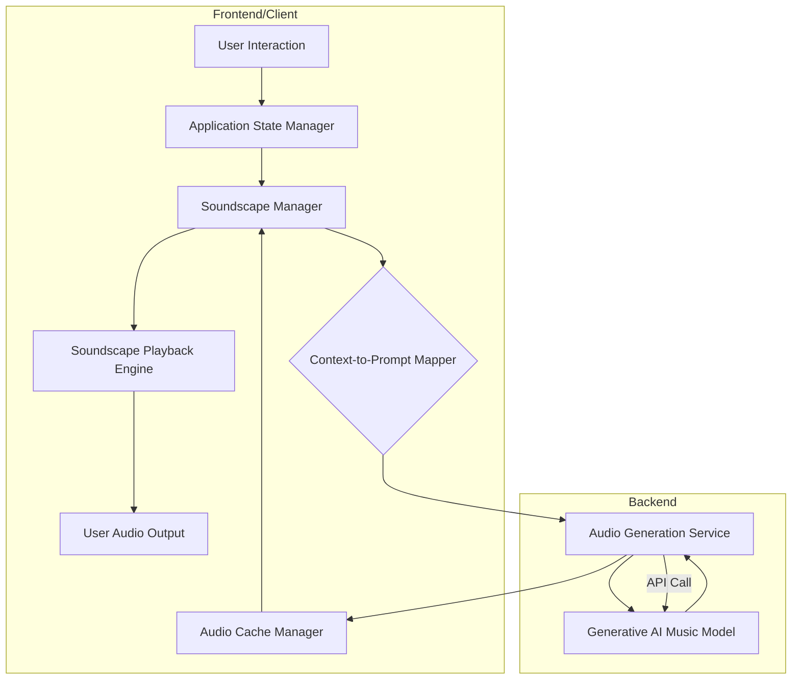
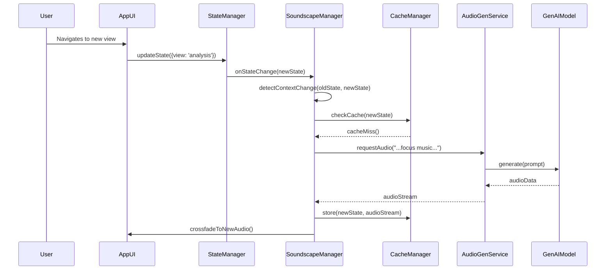
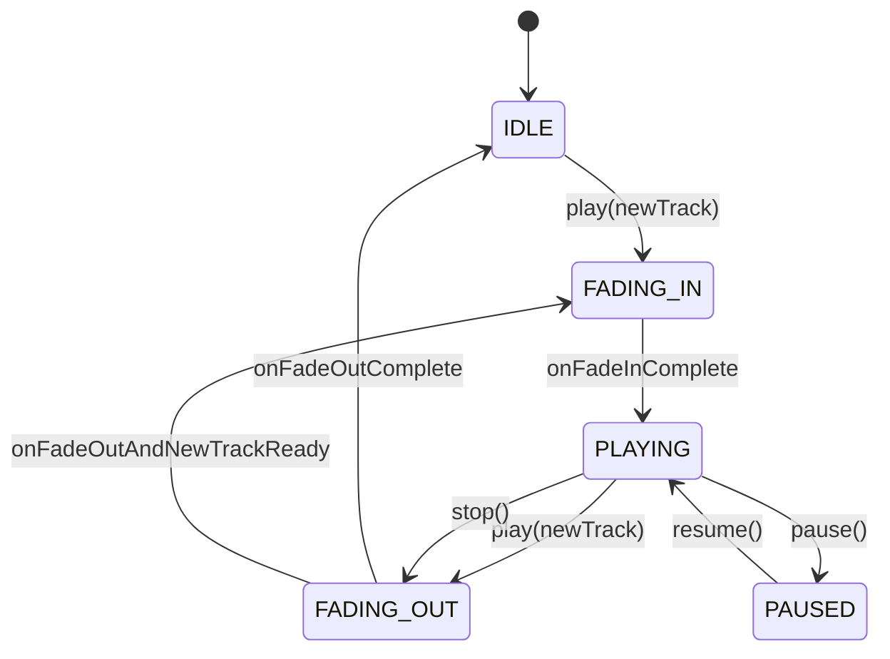
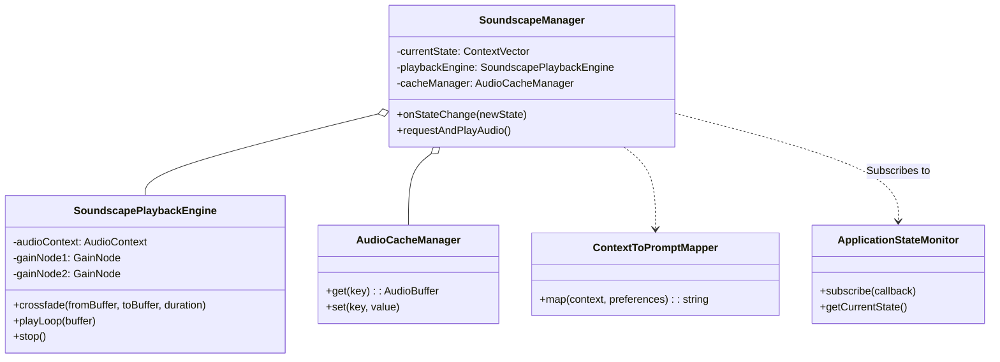
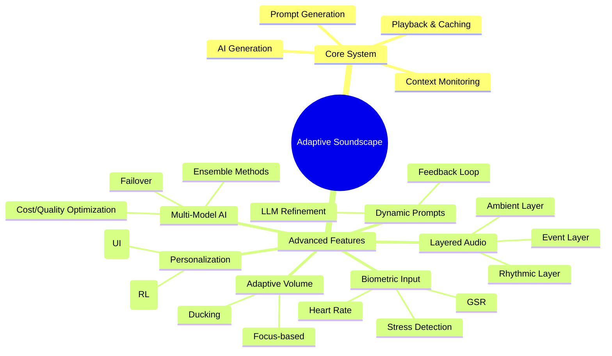
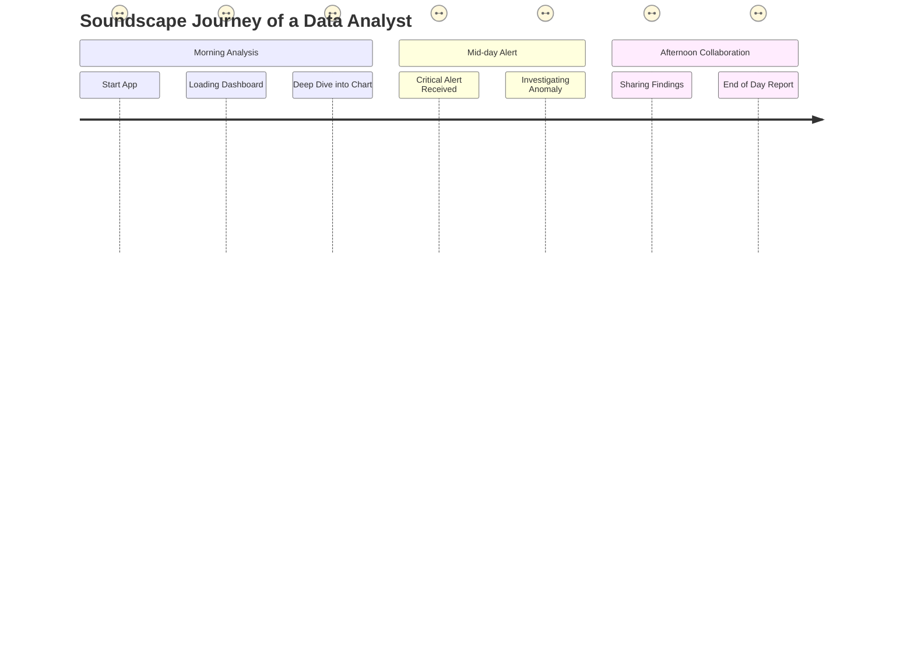

**FACT HEADER - NOTICE OF CONCEPTION**

**Conception ID:** DEMOBANK-INV-059
**Title:** System and Method for Generating Adaptive User Interface Soundscapes
**Date of Conception:** 2024-07-26
**Conceiver:** The Sovereign's Ledger AI

**Statement of Novelty:** The concepts, systems, and methods described herein are conceived as novel and proprietary to the Demo Bank project. This document serves as a timestamped record of conception.

---

**Title of Invention:** System and Method for Generating Adaptive User Interface Soundscapes

**Abstract:**
A system for creating non-intrusive, adaptive background music and event-driven audio cues for a software application is disclosed. The system monitors the user's current activity, context, and even biometric data within the application (e.g., "browsing," "focused work," "error state," "elevated stress"). This high-dimensional context vector is used to dynamically generate a natural language prompt for a generative AI music model. The AI generates a short, ambient musical piece or a specific audio cue that reflects the current context. The system employs advanced audio processing techniques, including seamless crossfading, volume normalization, and layered audio playback, to transition between these generated soundscapes as the user's context changes. An integrated caching layer and a multi-model AI backend optimize for latency and cost, while a feedback mechanism allows for continuous personalization, enhancing the user experience without being distracting.

**Background of the Invention:**
The auditory channel is a potent, yet underutilized, component of the human-computer interface. Most software applications are either silent or employ a sparse, repetitive set of static sound effects (e.g., clicks, dings). The use of traditional licensed music for background ambiance is prohibitively expensive for broad application, lacks adaptability, and often leads to user fatigue due to repetition. There exists a significant and unmet need for a system capable of generating an infinite variety of royalty-free, contextually appropriate background music and audio cues that can enhance, rather than distract from, the user's task. Such a system should adapt not only to the application's state but also to the user's personal preferences and even their physiological state, creating a truly symbiotic and immersive digital environment.

**Brief Summary of the Invention:**
The present invention is an "AI-powered sonic environment architect" for a user interface. The application's state manager, augmented by other sensors, tracks the user's multi-faceted context. When this context changes (e.g., the user opens a data-heavy analytics view), the system translates this context into a highly specific prompt for a generative AI music model like Google's MusicLM or a proprietary equivalent. The prompt might be, "Generate a 60-second, minimalist, 80 bpm, ambient electronic music loop in C minor, suitable for deep focus and data analysis." The AI model returns a generated audio file, which the application's UI begins to play in a loop. If the user then navigates to a social or collaborative part of the app, a new prompt is sent to generate a more upbeat, relational track. The system manages these transitions seamlessly using signal processing techniques and optimizes performance via intelligent caching and pre-fetching, creating a continuously evolving, personalized, and non-repetitive soundscape.

**Detailed Description of the Invention:**
A client-side "Soundscape Manager" service subscribes to the application's global state and other context providers. This manager orchestrates the entire process of detecting context changes, generating prompts, requesting new audio, managing a multi-level cache, and controlling a sophisticated playback engine.

1.  **Context Monitoring and Change Detection:**
    *   The `Soundscape Manager` continuously monitors the application's global state, managed by a central `Application State Manager`.
    *   State is represented as a high-dimensional vector $C_t = [c_1, c_2, \dots, c_n]$ at time $t$. (1)
    *   A significant context change is detected when the Euclidean distance between consecutive context vectors exceeds a threshold $\epsilon$: $\|C_t - C_{t-1}\| > \epsilon$. (2)
    *   Example: The user navigates from the main dashboard (`C_{t-1} = \{\text{view: 'dashboard', focus: 0.2}\}`) to a complex data visualization view (`C_t = \{\text{view: 'analysis', focus: 0.9}\}`).

2.  **Prompt Generation via `Context-to-Prompt Mapper`:**
    *   Upon detecting a context change $\Delta C = C_t - C_{t-1}$, (3) the `Soundscape Manager` queries a `Context-to-Prompt Mapper`.
    *   The mapper is a configurable rules engine that translates the context vector $C_t$ and user preferences vector $P_u$ into a natural language prompt string $S_p$.
    *   The mapping function can be expressed as $S_p = f(C_t, P_u, H_{t-1})$, where $H_{t-1}$ is the history of previous states and generated prompts. (4)
    *   The mapper can include variables from the context, such as `user_preferences_mood_preference`, `data_density_level`, `time_of_day`, etc., to create richer, more personalized prompts.
    *   The prompt generation process can be modeled as a weighted sum of feature embeddings: $W_p = \sum_{i=1}^{n} w_i \cdot \text{embed}(c_i)$. (5)
    *   Example: $C_t = \{\text{context: 'analysis', pref: 'calm', time: 'morning'}\}$ might yield: `"Generate a 60-second, calm, minimalist, ambient electronic music loop suitable for deep focus and data analysis, with a subtle morning vibe."`

3.  **AI Music Generation via `Audio Generation Service`:**
    *   The `Soundscape Manager` sends the prompt $S_p$ to a dedicated `Audio Generation Service`. This service acts as a secure intermediary for one or more generative AI music models $M_j$.
    *   The service selects the optimal model using a cost-utility function: $j^* = \arg\max_{j} [U(M_j | S_p) - \text{Cost}(M_j)]$. (6)
    *   It handles API authentication, rate limiting, and manages a queue of generation requests, modeled as an M/M/k queueing system. (7)
    *   The service aims to return a short, high-quality audio file $A(t)$ with normalized loudness $L_{target}$. (8)
    *   $L(A(t)) = \int_{0}^{T} s(t)^2 dt$ where $s(t)$ is the audio signal. (9) The normalization factor $k = \sqrt{L_{target} / L(A(t))}$. (10)

4.  **Audio Caching:**
    *   The generated audio $A(t)$ is stored in a client-side `Audio Cache`. This cache uses a key derived from a simplified context vector, $K = \text{hash}(\text{round}(C_t, \delta))$. (11)
    *   The cache employs a Least Recently Used (LRU) eviction policy. The cache hit rate $\eta = \frac{\text{hits}}{\text{hits} + \text{misses}}$. (12) The goal is to maximize $\eta$. (13)
    *   A pre-fetching mechanism predicts the next state $C_{t+1}$ using a Markov chain model: $P(C_{t+1} | C_t)$. (14) It then pre-generates and caches audio for high-probability next states.

5.  **Audio Playback and Seamless Transition:**
    *   The `Soundscape Manager` loads the audio into the `Soundscape Playback Engine`, which uses the Web Audio API.
    *   When transitioning from audio $A_{old}$ to $A_{new}$, a crossfade is applied over a duration $T_f$.
    *   The volume of the old track is given by $V_{old}(t) = V_{max} \cdot (1 - t/T_f)$ for $0 \le t \le T_f$. (15)
    *   The volume of the new track is $V_{new}(t) = V_{max} \cdot (t/T_f)$ for $0 \le t \le T_f$. (16)
    *   An equal-power crossfade curve can be used for smoother transitions: $V_{old}(t) = V_{max} \cdot \cos(\frac{\pi t}{2 T_f})$. (17) $V_{new}(t) = V_{max} \cdot \sin(\frac{\pi t}{2 T_f})$. (18)
    *   The total power remains constant: $V_{old}(t)^2 + V_{new}(t)^2 = V_{max}^2$. (19)

6.  **Error State and Event-Driven Sounds:**
    *   The system can generate specific, short, non-looping sounds (earcons) for distinct events.
    *   An event $E$ triggers a prompt generation $S_p(E) = f_e(E)$. (20)
    *   Example: $E = \text{'error'}$. $S_p = \text{"a short, 2-second, neutral, and unobtrusive sound in a minor key to signify an application error."}$ (21)
    *   These earcons are played once without looping.

### System Architecture

The proposed system comprises several interconnected components, designed for modularity, scalability, and seamless integration with existing application frameworks.



### Sequence of Operations

This diagram illustrates the flow of events following a user action that triggers a context change.



### Playback Engine State Machine

The `Soundscape Playback Engine` operates as a finite state machine to manage audio playback states cleanly.



### Context-to-Prompt Mapper Logic

The mapper combines multiple inputs to generate a final, effective prompt.

```mermaid
flowchart TD
    subgraph Prompt Generation
        A[Context Vector C_t] --> M1
        B[User Preferences P_u] --> M1
        C[Historical Data H_t] --> M1
        M1{Rule Engine & Templating} --> S[Base Prompt S_base]
        D[Dynamic Factors (Time, etc)] --> M2
        M2{Prompt Augmentation} --> S_aug
        S --> M2
        S_aug --> F[Final Prompt S_p]
        F --> ToGenService[Send to Audio Generation Service]
    end
```

### Key Components

The system's functionality is built upon several distinct, yet interconnected, components:

#### `Application State Monitor`
This component observes and reports changes in the user's context. It models state as a vector $C_t \in \mathbb{R}^n$. (22)
*   **State Vector Components:** $C_t = [c_{view}, c_{task}, c_{data\_density}, c_{interaction\_rate}, \dots, c_{error\_flag}]$. (23)
*   **Change Detection:** A change is registered if $\|\nabla C_t\| > \theta$ for some change threshold $\theta$. (24)
*   The monitor acts as the primary data source, publishing state updates to a message bus.

#### `Context-to-Prompt Mapper`
This module translates the state vector $C_t$ into a textual prompt $S_p$.
*   **Context Normalization:** $c'_i = \frac{c_i - \mu_i}{\sigma_i}$ for each component of $C_t$. (25)
*   **Prompt Templating:** Utilizes a template library $T = \{T_1, T_2, \dots, T_k\}$. The choice of template is a function $T_{sel} = g(C_t)$. (26)
*   **Personalization Integration:** User preferences $P_u$ are represented as a vector. The final prompt embedding $E(S_p)$ is a weighted average: $E(S_p) = \alpha \cdot E(g(C_t)) + (1-\alpha) \cdot E(P_u)$. (27)
*   **Dynamic Prompt Augmentation:** $S_p(t) = S_{base} + \delta(t_{day}, w_{day})$, where $\delta$ adds time-based modifiers. (28)

#### `Audio Generation Service`
This backend service is a gateway to generative AI models.
*   **API Management:** Handles API keys, authentication, and rate limits. The arrival rate of requests is $\lambda$. (29) The service rate is $\mu$. (30) System utilization $\rho = \lambda / (k \mu)$, where $k$ is the number of parallel models. (31)
*   **Model Routing:** A decision function $D(S_p, M_j) \rightarrow [0, 1]$ scores the suitability of model $j$ for prompt $p$. (32)
*   **Post-Generation Processing:** Applies audio mastering. Volume normalization uses LUFS (Loudness Units Full Scale). $L_{target} = -14.0 \text{ LUFS}$. (33) The gain adjustment $G_{dB} = L_{target} - L_{measured}$. (34)

#### `Soundscape Playback Engine`
The client-side module for the playback experience.
*   **Audio Loading and Decoding:** Uses asynchronous decoding to prevent UI blocking. Latency $L_{decode} = T_{end} - T_{start}$. (35)
*   **Looping:** For a track of duration $T$, the playback time is $t_{play} = t_{real} \pmod T$. (36)
*   **Crossfading and Transitions:** The perceived loudness during an equal-power crossfade is constant. (37)
*   **Volume Control:** The final volume $V_{final} = V_{global} \cdot V_{contextual} \cdot V_{ducking}$. (38)

#### `Audio Cache Manager`
Optimizes performance and reduces cost.
*   **Storage:** Uses IndexedDB for persistent client-side storage.
*   **Eviction Policy (LRU):** For a cache of size $N$, when a new item arrives and the cache is full, the item with the oldest access timestamp $t_{access}$ is evicted. (39)
*   **Pre-fetching:** The probability of transitioning from state $s_i$ to $s_j$ is $p_{ij}$. (40) Pre-fetch for states where $p_{ij} > \theta_{prefetch}$. (41)

### Component Class Diagram

This diagram outlines the primary classes and their relationships on the client-side.



### Advanced Features and Embodiments

The core system can be extended with several advanced features.

#### User Preferences and Personalization
*   **Explicit Customization:** Users define a preference vector $P_u = [g_1, g_2, \dots, m_1, m_2, \dots]$ where $g_i$ are genre weights and $m_j$ are mood weights. (42) $\sum w_i = 1$. (43)
*   **Implicit Feedback Learning:** A reinforcement learning model updates $P_u$. The reward signal $R_t$ is based on user actions (skip, volume change). (44) $P_{u, t+1} = P_{u, t} + \eta R_t \nabla_{P_{u,t}} \log \pi(a_t|s_t)$, where $\pi$ is the policy generating the audio. (45) The policy $\pi$ maps a state to a distribution over audio characteristics. (46)

#### Dynamic Prompt Refinement
*   A feedback loop refines prompts. Let $Q(S_p)$ be the quality of audio from prompt $S_p$. (47) If $Q(S_p) < \theta_Q$, generate a modified prompt $S'_p = S_p + \Delta S_p$. (48) $\Delta S_p$ is generated by an LLM: $\Delta S_p = \text{LLM}(\text{"Refine prompt to be more soothing: "} + S_p)$. (49)

#### Biometric Integration
*   Integrate with sensors measuring heart rate ($H_R$) and galvanic skin response (GSR). (50) This data forms a physiological vector $\Phi = [H_R, \text{GSR}]$. (51) The context vector is augmented: $C'_{t} = C_t \oplus \Phi_t$. (52) A high GSR value might add a "calming" or "soothing" keyword to the prompt. The mapping is $f(\text{GSR}) \rightarrow \text{prompt\_modifier}$. (53)

#### Multi-AI Model Support
*   The `Audio Generation Service` router uses a utility matrix $U_{ij}$ for model $i$ and prompt class $j$. (54) The selection is $\arg\max_i (U_{ij} - c_i)$, where $c_i$ is the cost of model $i$. (55)
*   The system can use an ensemble method, generating from multiple models and blending the results: $A_{final} = \sum w_i A_i$. (56)

#### Layered Soundscapes
*   Generate multiple audio layers: $L_{base}, L_{rhythm}, L_{event}$. (57) Total audio $A(t) = w_1 L_{base}(t) + w_2 L_{rhythm}(t) + w_3 L_{event}(t)$. (58) The weights $w_i$ are functions of the context vector $C_t$. (59) For example, $w_2$ increases with user interaction rate. (60)

#### Adaptive Volume Control
*   The system models desired volume as a function of focus state $f$: $V(f) = V_{max} e^{-k(f - f_{max})^2}$. (61)
*   It ducks for external audio. Let $E(t)$ be the external audio signal power. The ducking gain is $G_d = 1 / (1 + \alpha E(t))$. (62)

### Advanced Features Mind Map



### Asynchronous Operation Timeline

```mermaid
gantt
    title Soundscape Generation Timeline
    dateFormat  X
    axisFormat %Ss
    section User Interaction
    Context Change     :crit, 0, 1
    section Client-Side Processing
    Prompt Generation  : 1, 1
    Cache Check        : 2, 1
    section API Call (Cache Miss)
    Network Request    : 3, 4
    AI Generation      : 7, 8
    Network Response   : 15, 4
    section Client-Side Audio
    Audio Decode       : 19, 2
    Crossfade Start    : 21, 3
```



### Potential Use Cases

The system has broad applicability across various software domains.

*   **Productivity Applications:**
    *   **Scenario:** In a code editor, the soundscape is minimal and ambient during typing (flow state). When a long compilation starts, a subtle, anticipatory rhythmic layer is added. A compilation error triggers a dissonant but non-jarring earcon.
*   **Data Analytics Dashboards:**
    *   **Scenario:** A user analyzing financial data hears a calm, focused soundscape. If a stock alert is triggered, a new musical phrase corresponding to the stock symbol is briefly introduced.
*   **E-Learning Platforms:**
    *   **Scenario:** During a video lecture, the soundscape is silent. During an interactive quiz, a gently pulsing, encouraging track plays. Correct answers are met with a short, harmonious chime.
*   **Creative Tools (Graphic Design):**
    *   **Scenario:** While brainstorming, the music is generative, complex, and inspiring. When the user zooms in to do detailed pixel work, the music fades to a simple, sparse drone to aid concentration.

### User Journey Map (Analytics Dashboard)



### Performance Considerations

*   **Latency of AI Generation:** $L_{total} = L_{network} + L_{queue} + L_{gen}$. (63) $L_{queue}$ is approximated by queueing theory formulas, e.g., $L_q = \frac{\rho^2}{ \lambda(1-\rho)}$. (64)
    *   **Mitigation:** Predictive pre-fetching. The expected latency improvement is $E[\Delta L] = \eta_{prefetch} \cdot L_{total}$. (65)
*   **Bandwidth Consumption:** Total bandwidth $B = \sum_{i=1}^{N_{gen}} \text{size}(A_i)$. (66)
    *   **Mitigation:** Use efficient codecs (Opus, OGG). Bitrate $R$ is a key parameter. $S \approx R \cdot T$. (67)
*   **Client-side Processing:** CPU load is dominated by decoding and effects. Load $\propto N_{layers} \cdot f_{sample}$. (68)
    *   **Mitigation:** Use Web Audio API with AudioWorklets to move processing off the main thread. (69)
*   **Scalability:** The `Audio Generation Service` is the bottleneck.
    *   **Mitigation:** Horizontal scaling using serverless functions. Cost $C_{total} = N_{req} \cdot C_{invocation} + T_{compute} \cdot C_{compute}$. (70)

### Security Considerations

*   **API Key and Credential Management:** All AI model calls are proxied through the backend `Audio Generation Service`. Client authentication uses short-lived JWTs. (71)
*   **Data Privacy and User Consent:** User preference vector $P_u$ is stored server-side with user's explicit consent. Biometric data $\Phi$ is processed on-device and only a non-identifiable feature vector is sent to the backend. (72) All data is encrypted in transit (TLS 1.3) (73) and at rest (AES-256). (74)
*   **Content Moderation and Bias:** Prompts are sanitized against a blocklist before being sent to the AI model. (75) The system can employ acoustic fingerprinting to detect and flag potentially biased or inappropriate musical outputs. (76)
*   **Denial-of-Service (DoS) Attacks:** The `Audio Generation Service` implements per-user and global rate limiting based on the token bucket algorithm. (77)

### Mathematical Appendix

This section provides a more formal mathematical basis for the system's components.
1.  Context Vector: $C_t = [c_1, c_2, \dots, c_n] \in \mathbb{R}^n$ (78)
2.  State Change Detection: $\|\Delta C_t\|_2 = \sqrt{\sum_i (c_{i,t} - c_{i, t-1})^2} > \epsilon$ (79)
3.  Prompt Mapping Function: $S_p = f(W_c C_t + W_p P_u + b)$ where $W$ are weight matrices. (80)
4.  User Utility Function: $U(C, A) = \int_0^T u(C(t), A(t)) dt$ (81)
5.  System Objective: $\max_{\pi} \mathbb{E}[ \sum_{t=0}^\infty \gamma^t R(C_t, A_t) | \pi ]$ (82)
6.  Optimal AI Model Selection: $M^* = \text{argmax}_j (\alpha \cdot \text{Quality}(M_j, S_p) - (1-\alpha) \cdot \text{Cost}(M_j))$ (83)
7.  Cache Key Generation: $K = H( \lfloor C_t / \delta \rfloor )$ where $H$ is a cryptographic hash function. (84)
8.  Cache Hit Probability: Modeled as $P(\text{hit}) = 1 - e^{-\lambda \cdot T_{cache}}$ (85)
9.  Linear Crossfade Amplitude: $A(t) = A_{old}(t) \cdot (1 - \alpha(t)) + A_{new}(t) \cdot \alpha(t)$ where $\alpha(t) = t/T_f$. (86)
10. Equal Power Crossfade Amplitude: $\alpha(t) = \cos^2(\frac{\pi(T_f - t)}{2 T_f})$ (87)
11. Signal Power: $P_s = \frac{1}{T} \int_0^T |s(t)|^2 dt$ (88)
12. RMS Normalization: $s'_{norm}(t) = s(t) \cdot \frac{L_{target}}{\sqrt{\frac{1}{T}\int s(t)^2 dt}}$ (89)
13. State Transition Matrix (Markov): $P_{ij} = P(C_{t+1}=s_j | C_t=s_i)$ (90)
14. Reinforcement Learning State Update: $V(s) \leftarrow V(s) + \eta(R + \gamma V(s') - V(s))$ (91)
15. Audio Layer Composition: $A_{final}(t) = \text{tanh}(\sum_i w_i(C_t) A_i(t))$ to prevent clipping. (92)
16. Volume Ducking Gain: $G_d(t) = \max(G_{min}, 1 - k \cdot P_{ext}(t-\tau))$ where $P_{ext}$ is external power. (93)
17. M/M/k Queue - Avg. Wait Time: $W_q = \frac{C(k, \rho)}{\mu k (1-\rho/\mu k)}$ where $C(k, \rho)$ is Erlang's C formula. (94)
18. Information Content of State Change: $I(\Delta C) = -\log_2 P(\Delta C)$ (95)
19. Prompt Complexity: $H(S_p) = -\sum_i p(w_i) \log p(w_i)$ (Shannon Entropy of prompt words). (96)
20. Biometric Stress Index: $\sigma_{stress} = w_1 \cdot \text{norm}(\text{GSR}) + w_2 \cdot \text{norm}(H_R_V)$ where $H_R_V$ is heart rate variability. (97)
21. Vector Similarity (Prompt vs Audio): $\text{sim}(S_p, A) = \frac{\text{emb}(S_p) \cdot \text{emb}(A)}{\|\text{emb}(S_p)\| \|\text{emb}(A)\|}$ using CLIP-like models. (98)
22. Kalman Filter for State Prediction: $\hat{C}_{t|t-1} = F_t \hat{C}_{t-1|t-1} + B_t u_t$ (99)
23. Fourier Transform of Audio Signal: $S(f) = \int_{-\infty}^{\infty} s(t) e^{-2\pi i f t} dt$ (100)

**Claims:**
1.  A system for generating adaptive user interface audio, comprising:
    a. An `Application State Monitor` configured to determine a user's current context within a software application;
    b. A `Context-to-Prompt Mapper` configured to translate said current context, optionally augmented by user preferences, into a textual prompt;
    c. An `Audio Generation Service` configured to transmit said textual prompt to a generative AI music model and receive a generated audio composition in response;
    d. An `Audio Cache Manager` configured to store and retrieve said generated audio compositions; and
    e. A `Soundscape Playback Engine` configured to play said audio composition to the user, including seamlessly transitioning between compositions.

2.  The system of claim 1, wherein the `Soundscape Playback Engine` is further configured to apply a crossfade transition between an outgoing audio composition and an incoming audio composition when the user's context changes.

3.  The system of claim 1, wherein the `Context-to-Prompt Mapper` is configured to incorporate explicit user preferences, implicit user behavior feedback, or biometric data into the generation of the textual prompt.

4.  The system of claim 1, wherein the `Audio Generation Service` is configured to integrate with and select from a plurality of generative AI music models based on criteria such as model performance, cost, or specialization.

5.  The system of claim 1, further comprising a `Soundscape Manager` configured to orchestrate the determination of context, prompt generation, audio generation, caching, and playback.

6.  A method for enhancing user experience in a software application, comprising:
    a. Continuously monitoring an application's state to detect changes in a user's context;
    b. Mapping the detected context to a specific textual prompt for audio generation;
    c. Requesting a new audio composition from a generative AI music model via an `Audio Generation Service` using said prompt;
    d. Caching the received audio composition on a client device;
    e. Playing the audio composition to the user; and
    f. When the user's context changes, gracefully transitioning from a currently playing audio composition to a newly generated or cached audio composition using a crossfade.

7.  The method of claim 6, further comprising generating and playing distinct, non-looping audio cues for specific application events or error states.

8.  The method of claim 6, further comprising dynamically adjusting the volume of the playing audio composition based on detected application activity or external audio sources.

9.  The method of claim 6, wherein the textual prompt is dynamically refined based on analysis of previous generated audio effectiveness or user feedback.

10. The method of claim 6, wherein multiple distinct audio layers are generated and played concurrently, with each layer adapting to different aspects of the user's context or application events.