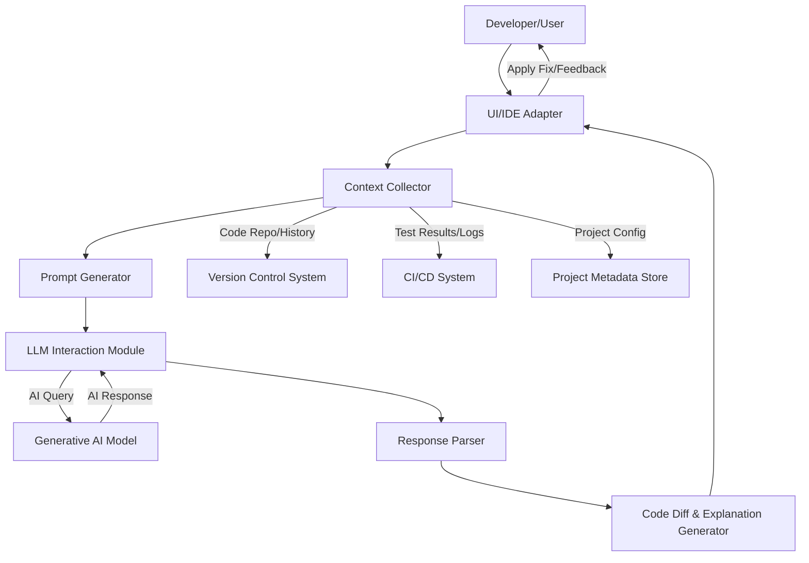

**FACT HEADER - NOTICE OF CONCEPTION**

**Conception ID:** DEMOBANK-INV-060
**Title:** An AI-Powered Conversational Debugging Assistant
**Date of Conception:** 2024-07-26
**Conceiver:** The Sovereign's Ledger AI

**Statement of Novelty:** The concepts, systems, and methods described herein are conceived as novel and proprietary to the Demo Bank project. This document serves as a timestamped record of conception.

---

**Title of Invention:** An AI-Powered Conversational Debugging Assistant

**Abstract:**
A system for assisting in software debugging is disclosed. A developer provides a snippet of code and an error message or a description of the unexpected behavior. This information is sent to a generative AI model, which is prompted to act as an expert debugger. The AI analyzes the code and the error, identifies the likely root cause of the bug, and suggests a specific code change to fix it. The system can engage in a conversational turn-based interaction, allowing the developer to ask follow-up questions and refine the solution with the AI. Furthermore, the system is designed to integrate with IDEs and version control systems to enrich debugging context and automate the application of suggested fixes.

**Background of the Invention:**
Debugging is a fundamental but often frustrating part of software development. It requires a deep understanding of the code, the system it runs on, and logical problem-solving skills. Developers can spend hours trying to identify the root cause of a bug. While traditional debuggers help inspect the state of a program, they do not provide insights or suggest solutions. There is a need for an intelligent "partner" that can help developers reason about their code and accelerate the debugging process, reducing development cycles and improving code quality.

**Brief Summary of the Invention:**
The present invention provides an "AI Debugger," typically implemented as an IDE extension or a web-based tool. A developer can paste their problematic code and the resulting error message. The system sends this context to a large language model (LLM) with a prompt that frames the problem. The AI, having been trained on billions of lines of code and technical documentation, can often identify the bug and generate a corrected version of the code snippet, along with a natural language explanation of what was wrong and why the suggested fix works. The system also supports gathering additional contextual information, such as relevant commit history, recent code changes, and environment configurations, to provide more accurate and targeted debugging assistance.

**Detailed Description of the Invention:**
A developer has a function that is not working as expected. They interact with the AI Debugger.
1.  **Input:** The developer provides:
    *   **Code:** `const user = { name: "Alex" }; console.log(user.profile.age);`
    *   **Error:** `TypeError: Cannot read properties of undefined (reading 'age')`
2.  **Prompt Construction:** The system combines these into a prompt for an LLM like Gemini.
    **Prompt:** `You are an expert JavaScript debugger. The following code is throwing an error. Explain the cause of the bug and provide the corrected code.

    **Code:**
    ```javascript
    const user = { name: "Alex" };
    console.log(user.profile.age);
    ```

    **Error:**
    ```
    TypeError: Cannot read properties of undefined (reading 'age')
    ```
    `
3.  **AI Generation:** The LLM analyzes the code and error. It recognizes that `user.profile` is undefined.
    **AI Output:**
    `
    **Explanation:**
    The error occurs because you are trying to access the 'age' property on 'user.profile', but the 'profile' key does not exist on the 'user' object. You are trying to read a property from something that is undefined.

    **Suggested Fix:**
    You should either add the 'profile' object or use optional chaining to safely access the property without causing an error.

    **Corrected Code (with optional chaining):**
    ```javascript
    const user = { name: "Alex" };
    // This will now safely return 'undefined' instead of crashing.
    console.log(user.profile?.age);
    ```
    `
4.  **Output:** The explanation and corrected code are displayed to the developer, allowing them to quickly understand and fix the bug.

**System Architecture:**



**Core Components:**

1.  **`UI/IDE Adapter`:** This component serves as the interface between the developer and the AI Debugger. It can be implemented as a plugin for popular IDEs (e.g., VS Code, IntelliJ) or a standalone web application. It facilitates:
    *   Receiving problematic code snippets and error messages.
    *   Displaying AI-generated explanations and suggested code fixes.
    *   Allowing conversational follow-up questions from the developer.
    *   Enabling one-click application of suggested fixes as code patches.

2.  **`Context Collector`:** Responsible for gathering all relevant information to enrich the debugging request. This includes:
    *   The primary code snippet and error message.
    *   Surrounding code context (e.g., file contents, function definitions).
    *   Recent commit history from the `Version Control System`.
    *   Relevant logs or test failure reports from the `CI/CD System`.
    *   Project configuration, dependencies, and environment variables from the `Project Metadata Store`.

3.  **`Prompt Generator`:** Constructs a comprehensive and optimized prompt for the `Generative AI Model`. This involves:
    *   Structuring the input (code, error, context) into a clear and concise format.
    *   Injecting system instructions (e.g., "You are an expert `language` debugger.").
    *   Adding few-shot examples if beneficial for specific problem types.
    *   Ensuring token limits are respected and context window is efficiently utilized.

4.  **`LLM Interaction Module`:** Manages the communication with the underlying `Generative AI Model`. This includes:
    *   Handling API calls to various LLM providers (e.g., Google Gemini, OpenAI GPT).
    *   Managing API keys and authentication.
    *   Implementing retry mechanisms for transient errors.
    *   Potentially managing conversation history for turn-based interactions.

5.  **`Response Parser`:** Processes the raw output from the `Generative AI Model`. This involves:
    *   Extracting the explanation and suggested code from the AI's natural language response.
    *   Identifying code blocks and distinguishing them from explanatory text.
    *   Validating the structure and content of the generated code.

6.  **`Code Diff & Explanation Generator`:** Takes the parsed AI output and formats it for presentation to the user.
    *   Generates a clear `diff` or `patch` file highlighting the suggested changes.
    *   Formats the explanation for readability, potentially breaking it down into steps or key insights.
    *   Prepares the output for rendering within the `UI/IDE Adapter`.

7.  **`Feedback Loop Manager`:** Captures implicit and explicit feedback from developers.
    *   **Implicit:** Tracking whether a suggested fix was applied, reverted, or ignored.
    *   **Explicit:** Allowing developers to rate the usefulness of a suggestion or provide comments.
    *   This feedback is crucial for fine-tuning and continuous improvement of the `Generative AI Model` over time, potentially through reinforcement learning from human feedback RLFH.

**Advanced Capabilities:**

*   **Automated Test Case Generation:** The AI Debugger can generate minimal reproducible test cases for a reported bug or, conversely, suggest new unit tests to validate the proposed fix and prevent future regressions.
*   **Integration with Version Control:** By analyzing `git blame` or recent commit messages, the AI can infer who last touched relevant code or what the intent of a recent change was, providing deeper contextual understanding.
*   **Performance Bottleneck Identification:** Beyond logical errors, the AI could be prompted to analyze code for potential performance issues, suggesting algorithmic improvements or identifying inefficient patterns.
*   **Security Vulnerability Scanning:** The AI can be trained to recognize common security vulnerabilities (e.g., SQL injection, XSS) within code snippets and suggest remediations.
*   **Multi-Language Support:** The system is inherently extensible to support a wide range of programming languages, provided the underlying LLM has been trained on a diverse code corpus.

**Conceptual Data Structures:**

*   **`DebugRequest`:**
    ```
    {
        "code_snippet": "string",
        "error_message": "string",
        "language": "string",
        "file_path": "string",
        "line_start": "number",
        "line_end": "number",
        "conversation_history": "[DebugMessage, ...]",
        "context_files": "[{ path: string, content: string }, ...]",
        "version_control_info": "{ commit_id: string, branch: string, author: string, ... }",
        "ci_cd_logs": "[string, ...]"
    }
    ```
*   **`DebugResponse`:**
    ```
    {
        "explanation": "string",
        "suggested_code": "string",
        "code_diff": "string",
        "confidence_score": "number",
        "follow_up_questions": "[string, ...]",
        "is_actionable": "boolean"
    }
    ```
*   **`DebugMessage`:**
    ```
    {
        "role": "enum[user, ai]",
        "content": "string",
        "timestamp": "datetime"
    }
    ```

**Claims:**
1.  A method for debugging software, comprising:
    a. Receiving a snippet of source code and an associated error description from a user.
    b. Transmitting the code and error description as context to a generative AI model.
    c. Prompting the model to identify the cause of the error and suggest a code modification to fix it.
    d. Displaying the suggested code modification and an explanation to the user.

2.  The method of claim 1, wherein the interaction is conversational, allowing the user to ask follow-up questions about the suggested fix.

3.  The method of claim 1, further comprising:
    e. Collecting additional contextual information including, but not limited to, surrounding code, relevant commit history from a version control system, and log data from a continuous integration/continuous deployment CI/CD system.
    f. Incorporating said additional contextual information into the prompt provided to the generative AI model to enhance debugging accuracy.

4.  The method of claim 1, further comprising:
    e. Receiving user feedback regarding the utility of a suggested code modification.
    f. Utilizing said user feedback to continuously improve the performance and accuracy of the generative AI model through a feedback loop mechanism.

5.  A system for debugging software, comprising:
    a. A user interface or integrated development environment IDE adapter configured to receive source code and error descriptions, and to display AI-generated debugging insights.
    b. A context collector module configured to gather contextual data from various sources, including version control systems and CI/CD pipelines.
    c. A prompt generator module configured to construct optimized prompts for a generative AI model.
    d. An LLM interaction module configured to communicate with the generative AI model.
    e. A response parser module configured to extract explanations and suggested code from the AI model's output.
    f. A code diff and explanation generator module configured to present suggested fixes as actionable code patches.

6.  The system of claim 5, further comprising a feedback loop manager configured to capture and process user feedback for model improvement.

**Mathematical Justification:**
Let a program be a function `P[i] -> o`, mapping an input `i` to an output `o`. Let the expected output be `o_expected`. A bug exists if `P[i] -> o_actual != o_expected`. The error message `E` is a symptom of this bug. The debugging problem is to find a modified program `P'` such that `P'[i] -> o_expected`. The AI model `G_AI` is a function that takes the faulty program, the input, the error, and a comprehensive context `C`, and suggests a fix:
```
G_AI[P, i, E, C] -> P'
```
The effectiveness of the system can be evaluated by the probability of `P'` resolving the bug:
```
Accuracy = P[P'[i] = o_expected | P, i, E, C]
```
The conversational aspect implies an iterative refinement process, where `G_AI_k` is the model's suggestion at iteration `k`, and `Q_k` is the user's follow-up question/refinement:
```
P'_{k+1} = G_AI[P'_k, i, E, C, Q_k]
```
This iterative approach aims to maximize `Accuracy` over multiple turns.

**Proof of Functionality:** The LLM is trained on a vast corpus of code, error messages, and their corresponding fixes [e.g., from Stack Overflow, GitHub commits, and documented bug resolutions]. It learns a probabilistic mapping between a [code, error, context] tuple and a likely code modification. The system is proven functional because the AI can generate a candidate fix `P'` such that the probability `P[P'[i] = o_expected]` is high. This automates the hypothesis-generation and solution-proposal parts of the debugging process, which are the most time-consuming for human developers. The continuous feedback loop further refines this mapping, ensuring improvement over time. `Q.E.D.`

**Future Enhancements / Roadmap:**
*   **Proactive Debugging:** Integrate with static analysis tools to identify potential bugs or code smells before runtime, providing pre-emptive suggestions.
*   **Root Cause Analysis for Complex Systems:** Extend the AI's capability to analyze distributed system logs and traces to pinpoint issues across multiple services.
*   **Self-Healing Code:** Develop mechanisms for the AI to automatically propose, test, and apply fixes in non-critical environments with minimal human intervention.
*   **Human-in-the-Loop Orchestration:** Allow developers to guide the AI through different debugging strategies or suggest areas of focus.
*   **Code Generation for Missing Components:** If an error indicates a missing function or class, the AI could generate a basic implementation template.

**Ethical Considerations:**
*   **Bias in Training Data:** Ensuring the AI does not perpetuate or amplify biases present in its training data, leading to suboptimal or discriminatory suggestions.
*   **Security Implications:** Carefully managing the AI's access to sensitive codebases and ensuring that suggested fixes do not introduce new vulnerabilities.
*   **Over-Reliance:** Preventing developers from becoming overly reliant on the AI, fostering continued critical thinking and problem-solving skills.
*   **Privacy:** Protecting intellectual property and sensitive code by ensuring secure data handling and processing, especially when interacting with external LLM services.