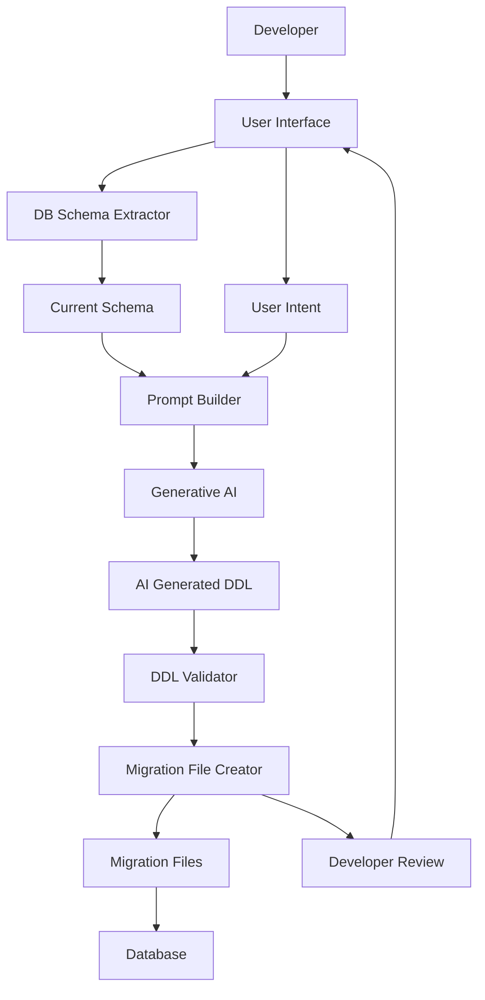

**FACT HEADER - NOTICE OF CONCEPTION**

**Conception ID:** DEMOBANK-INV-061
**Title:** System and Method for AI-Assisted Database Schema Evolution
**Date of Conception:** 2024-07-26
**Conceiver:** The Sovereign's Ledger AI

**Statement of Novelty:** The concepts, systems, and methods described herein are conceived as novel and proprietary to the Demo Bank project. This document serves as a timestamped record of conception.

---

**Title of Invention:** System and Method for AI-Assisted Database Schema Evolution

**Abstract:**
A system for managing database schema changes is disclosed. A developer provides a natural language description of a desired change, for example, "Add a 'last_name' field to the users table". The system provides this, along with the current table schema, to a generative AI model. The AI generates the formal Data Definition Language (DDL) command, for example, `ALTER TABLE`, required to perform the migration, and can also generate the corresponding "down" migration script to revert the change. This accelerates the process of database schema evolution and reduces the risk of syntactical errors.

**Background of the Invention:**
Database schema migrations are a critical but often cumbersome part of the software development lifecycle. Writing correct DDL syntax for different SQL dialects can be error-prone, and forgetting to write a corresponding "down" migration can make rollbacks difficult. This process, while seemingly simple, requires specific knowledge and careful execution. There is a need for a tool that can translate high-level developer intent directly into correct, complete, and reversible migration scripts.

**Brief Summary of the Invention:**
The present invention is an "AI Migration Assistant," typically integrated into a database migration tool or IDE. A developer provides a high-level description of the desired schema change. The system reads the current schema of the relevant table and sends both the schema and the natural language description to a large language model (LLM). The prompt instructs the AI to generate both the "up" and "down" migration SQL statements. The AI's response is then used to create a new, ready-to-run migration file. This process can include validation and human review steps to ensure correctness and safety.

**System Architecture:**

A high-level overview of the system components is presented below.



**Detailed Description of the Invention:**
A developer uses a command-line tool integrated with their project or an IDE extension. The workflow proceeds as follows:

1.  **Command Invocation:** The developer runs a command like:
    ```bash
    db-migrate create --ai "Add a non-null phone_number column to the users table with a default value of 'N/A'"
    ```
2.  **Context Gathering - Schema Extraction:** The tool inspects the database connection specified in the project configuration to obtain the current `CREATE TABLE` statement or equivalent schema definition for the `users` table. This step might involve querying `INFORMATION_SCHEMA` or database-specific metadata tables.
3.  **Prompt Construction:** The tool constructs a sophisticated prompt for an LLM like Gemini. This prompt includes:
    *   A clear system message establishing the AI's role, for example, "You are an expert database administrator fluent in SQL dialects."
    *   The current schema of the relevant tables.
    *   The user's natural language request.
    *   Instructions to generate both "up" and "down" migration scripts.
    *   Potential few-shot examples of similar requests and their corresponding SQL outputs to guide the model.
    **Example Prompt Snippet:**
    ```
    You are an expert database administrator. A user wants to modify a table. The current schema for the 'users' table is:
    ```sql
    CREATE TABLE users (id INT PRIMARY KEY, email TEXT);
    ```
    The user's request is: "Add a non-null phone_number column to the users table with a default value of 'N/A'".

    Generate the 'up' and 'down' migration scripts in SQL. Ensure the SQL is compatible with PostgreSQL.
    ```
4.  **AI Generation:** The LLM processes the structured prompt and generates the SQL migration scripts.
    **Example AI Output:**
    ```sql
    -- UP Migration
    ALTER TABLE users ADD COLUMN phone_number VARCHAR(255) NOT NULL DEFAULT 'N/A';

    -- DOWN Migration
    ALTER TABLE users DROP COLUMN phone_number;
    ```
5.  **AI Response Parsing and Validation:** The system parses the AI's output. It then runs preliminary checks on the generated SQL:
    *   **Syntactical Validation:** Checks if the SQL is syntactically correct for the target database dialect.
    *   **Semantic Validation:** Attempts to identify potential issues like dropping critical columns without data migration, incorrect data types, or conflicting constraints. This might involve a 'dry run' against a temporary database instance or a schema comparison tool.
    *   **Safety Checks:** Flags potentially destructive operations for explicit user approval.
6.  **User Review and Feedback Loop:** The generated SQL scripts, along with any validation warnings, are presented to the developer for review. The developer can:
    *   **Approve:** Accept the scripts as-is.
    *   **Modify:** Edit the scripts directly within the tool.
    *   **Reject:** Discard the generated scripts and potentially provide feedback to the AI. This feedback can be used to fine-tune the underlying LLM for future requests.
7.  **File Creation and Version Control Integration:** Upon developer approval, the tool creates a new timestamped migration file, for example, `20240726_add_phone_to_users.sql`, containing the generated SQL. This file is then automatically added to the project's version control system, for example, Git, often with an auto-generated commit message. The file is now ready to be applied to the database.
8.  **CI/CD Integration:** The generated migration files can be seamlessly integrated into Continuous Integration/Continuous Deployment pipelines, allowing automated testing and deployment of schema changes.

**Advanced Features and Considerations:**

*   **Contextual Awareness Expansion:** The system can be enhanced to consider more than just the immediate table schema. This includes foreign key relationships, existing indexes, trigger definitions, and even sample data distributions to generate more robust and data-aware migrations.
*   **Data Migration Generation:** Beyond DDL, the AI can be prompted to generate Data Manipulation Language (DML) scripts to accompany schema changes. For example, if a column type changes from `INT` to `TEXT`, the AI could suggest a conversion function for existing data.
*   **Multi-Database Dialect Support:** The prompt constructor can be configured to instruct the AI to generate SQL specific to different database systems, for example, PostgreSQL, MySQL, SQL Server, Oracle, by including dialect-specific instructions or by selecting a specialized AI model.
*   **Safety and Guardrails:**
    *   **Permissions and Access Control:** The AI's ability to generate and suggest changes can be tied to a developer's permissions, preventing unauthorized or overly destructive operations.
    *   **Impact Analysis:** The system could analyze the potential impact of a change, for example, estimated downtime for large table alterations, and present it to the developer.
*   **Integration with ORMs/Frameworks:** The system can extend its capabilities to also suggest or generate updates to Object-Relational Mapper models, for example, Django models, SQLAlchemy models, to keep application code synchronized with the new schema.
*   **Continuous Learning:** A robust feedback loop, where developers rate or modify AI-generated migrations, can be used to continuously fine-tune the LLM, improving its accuracy and adherence to specific project conventions over time.

**Claims:**
1.  A method for modifying a database schema, comprising:
    a. Receiving a natural language description of a desired schema change from a user.
    b. Providing the user's description and the current database schema as context to a generative AI model.
    c. Prompting the model to generate a formal database migration script, such as a Data Definition Language DDL command, to execute the desired change.
    d. Receiving the generated migration script from the model.
    e. Storing the migration script in a new migration file for later application.

2.  The method of claim 1, wherein the prompt further instructs the model to generate a second migration script to revert the schema change.

3.  The method of claim 1, further comprising:
    a. Validating the syntactical correctness of the generated migration script against a target database dialect.
    b. Presenting the generated migration script and validation results to the user for review and approval.

4.  The method of claim 1, wherein the prompt further instructs the model to generate Data Manipulation Language DML scripts to transform existing data in conjunction with the schema change.

5.  The method of claim 1, wherein the prompt specifies a particular database dialect, and the generative AI model is configured to produce SQL compatible with that dialect.

6.  The method of claim 1, further comprising automatically integrating the stored migration script into a version control system upon user approval.

**Mathematical Justification:**
Let the database schema be a state `S`. A migration is a transformation `T[S] -> S'`. A developer's intent is a natural language description `d`. The goal is to find a function `f[d, S] -> T` that generates the correct transformation. The generative AI model `G_AI` learns an approximation of this function `G_AI[d, S] -> T' approx T`. The system also requests the inverse transformation `T^-1` for the down migration.

**Proof of Correctness:** The system is correct if the generated transformation `T'` accurately reflects the user's intent `d`. The AI model, trained on a massive corpus of natural language descriptions and corresponding SQL code, for example, from GitHub commits and migration files, learns the mapping between intent and formal syntax. By providing the current schema `S` as context, the model can generate a syntactically and semantically valid transformation `T'`. The correctness is further enhanced by generating the inverse `T'^-1`, as this forces the model to generate a reversible, and therefore more robust, change. Q.E.D.