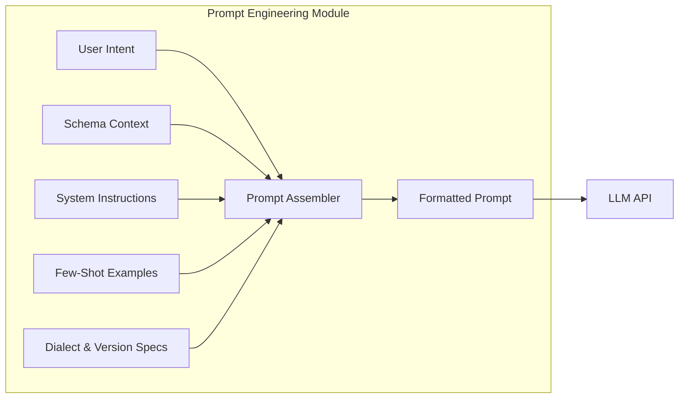
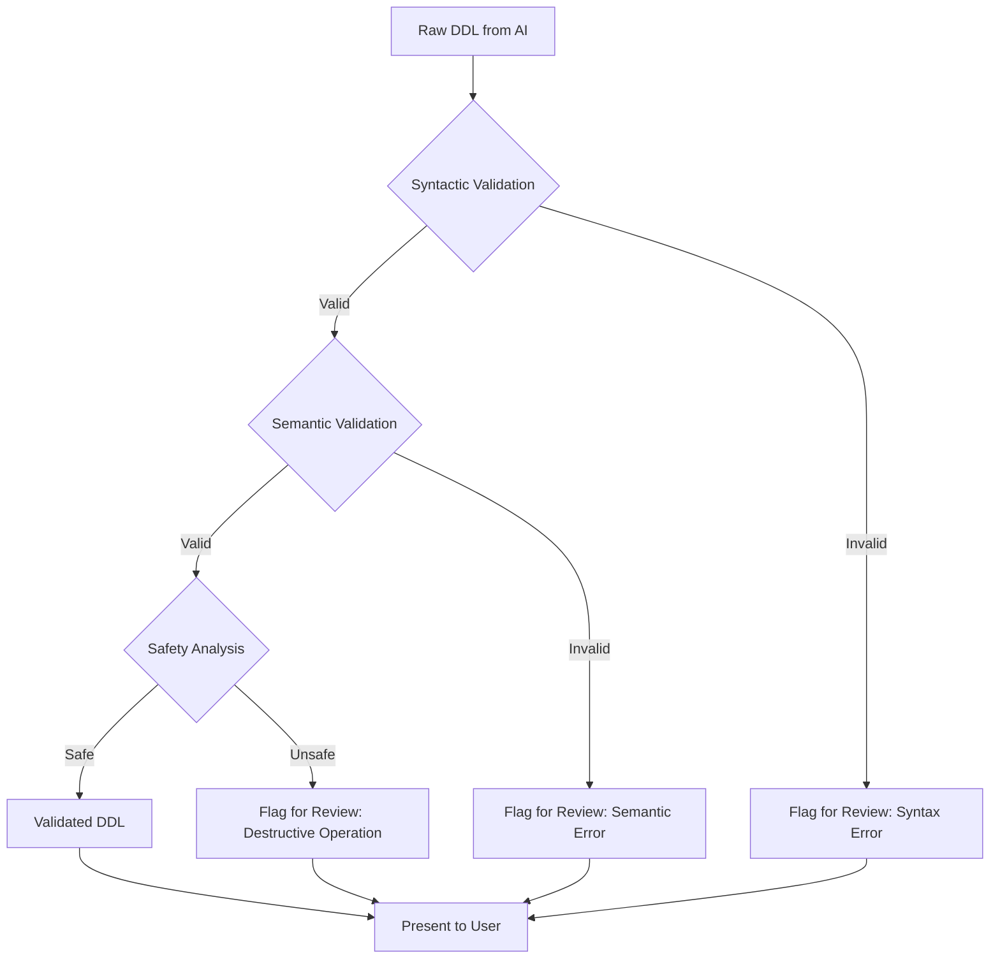
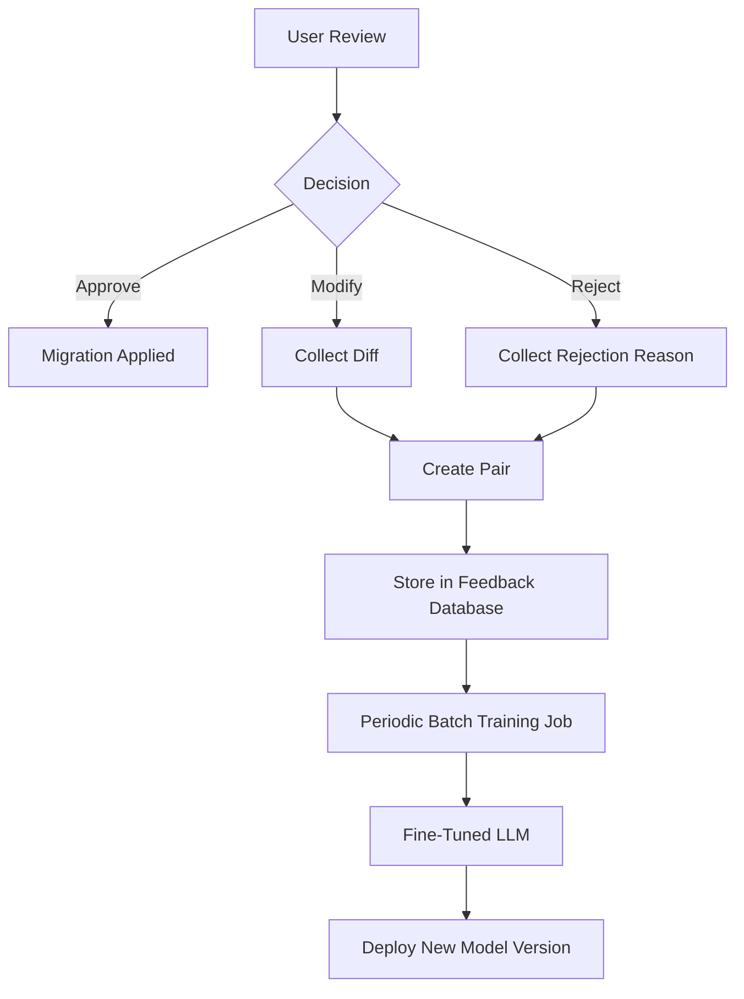
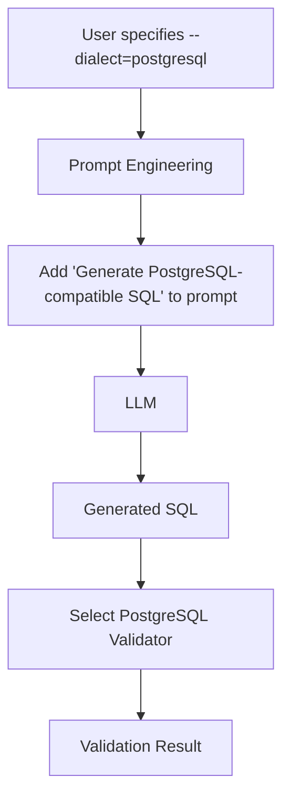
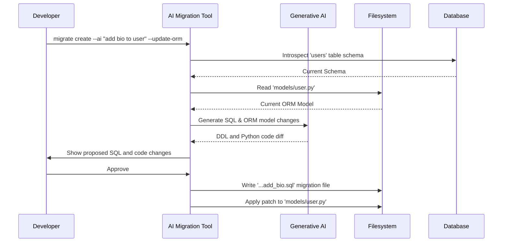
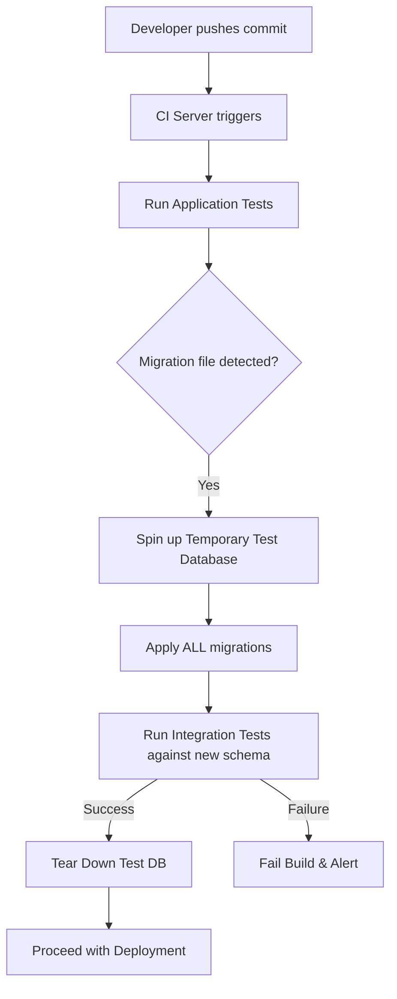
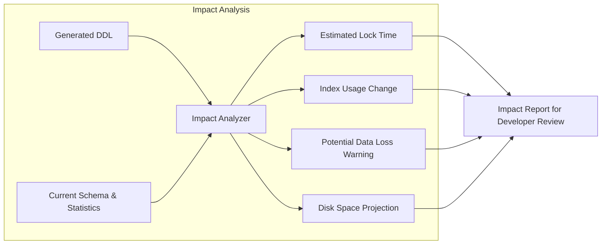
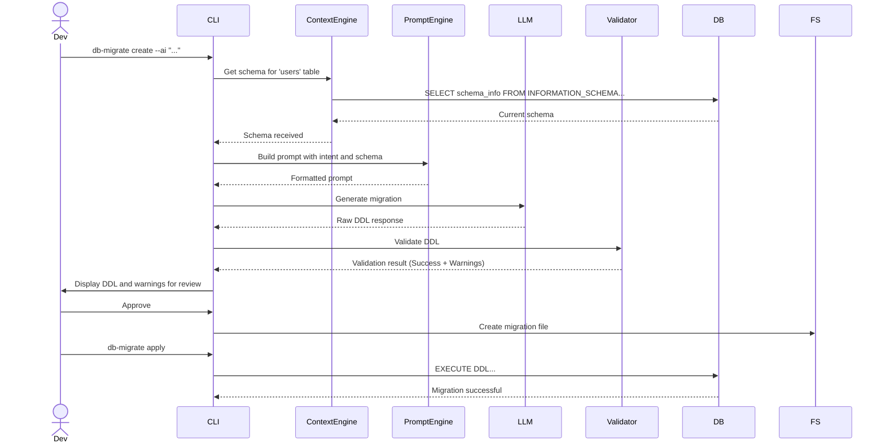

**FACT HEADER - NOTICE OF CONCEPTION**

**Conception ID:** DEMOBANK-INV-061
**Title:** System and Method for AI-Assisted Database Schema Evolution
**Date of Conception:** 2024-07-26
**Conceiver:** The Sovereign's Ledger AI

**Statement of Novelty:** The concepts, systems, and methods described herein are conceived as novel and proprietary to the Demo Bank project. This document serves as a timestamped record of conception.

---

**Title of Invention:** System and Method for AI-Assisted Database Schema Evolution

**Abstract:**
A system for managing database schema changes is disclosed. A developer provides a natural language description of a desired change, for example, "Add a 'last_name' field to the users table". The system provides this, along with the current table schema, to a generative AI model. The AI generates the formal Data Definition Language (DDL) command, for example, `ALTER TABLE`, required to perform the migration, and can also generate the corresponding "down" migration script to revert the change. This accelerates the process of database schema evolution, reduces the risk of syntactical and semantic errors, and lowers the cognitive barrier for developers to interact with complex database systems. The system integrates validation, impact analysis, and continuous learning to improve safety and accuracy over time.

**Background of the Invention:**
Database schema migrations are a critical but often cumbersome part of the software development lifecycle. The process involves writing precise Data Definition Language (DDL) commands, which are highly specific to the target database dialect (e.g., PostgreSQL, MySQL, Oracle). A seemingly simple change can involve complex syntax for adding constraints, default values, or indexes. Writing correct DDL syntax can be error-prone, and forgetting to write a corresponding "down" migration can make rollbacks difficult and dangerous in production environments.

Existing migration tools (e.g., Flyway, Alembic, Active Record Migrations) provide excellent frameworks for versioning and applying schema changes, but they do not assist in the authoring of the migration logic itself. Developers must still manually translate their high-level requirements into low-level SQL or a framework-specific DSL. This process, while seemingly simple, requires specific knowledge, careful execution, and is a frequent source of bugs and deployment failures. There is a clear and present need for a tool that can bridge the gap between high-level developer intent and the correct, complete, and reversible migration scripts required to safely evolve a database schema.

**Brief Summary of the Invention:**
The present invention is an "AI Migration Assistant," a system typically integrated into a database migration tool, command-line interface (CLI), or Integrated Development Environment (IDE). A developer provides a high-level, natural language description of the desired schema change. The system programmatically reads the current schema of the relevant database objects (tables, views, indexes) and combines this contextual information with the developer's request into a structured prompt. This prompt is sent to a large language model (LLM).

The prompt is engineered to instruct the AI to generate both the "up" (apply) and "down" (revert) migration scripts in the appropriate SQL dialect. The AI's response is then parsed and subjected to a multi-stage validation process, including syntactic checks, semantic analysis against a schema model, and safety heuristics to flag potentially destructive operations. The validated scripts are presented to the developer for review and approval. Upon approval, the system creates a new, version-controlled migration file. The system incorporates a feedback loop, allowing developer corrections to be used for continuously fine-tuning the underlying AI model, thereby improving its performance and adapting it to project-specific conventions.

**System Architecture:**

The system is composed of several interconnected modules that work in concert to translate user intent into a safe and effective database migration.

**Chart 1: High-Level System Architecture**
```mermaid
graph TD
    A[Developer] --> B[User Interface (CLI/IDE)];
    B --> C[Context Engine];
    C -->|Reads DB metadata| L[Database];
    C --> D[Current Schema Representation];
    B --> E[User Intent (Natural Language)];
    D & E --> F[Prompt Engineering Module];
    F --> G[Generative AI (LLM)];
    G --> H[AI Generated DDL (Up/Down)];
    H --> I[Validation & Safety Subsystem];
    I --> J[Migration File Creator];
    J --> K[Versioned Migration Files];
    I --> M[Developer Review UI];
    M -->|Approve/Modify| J;
    M -->|Reject/Feedback| N[Feedback Collector];
    N --> O[Fine-Tuning Pipeline];
    O --> G;
    K --> P[Migration Runner];
    P --> L;
```

**Chart 2: Detailed Prompt Engineering Pipeline**


**Chart 3: Validation and Safety Subsystem**


**Chart 4: Feedback Loop and Model Fine-Tuning**


**Chart 5: Data Flow for Multi-Dialect Support**


**Chart 6: ORM Integration Workflow**


**Chart 7: CI/CD Pipeline Integration**


**Chart 8: Impact Analysis Module**


**Chart 9: Security and RBAC Flow**
```mermaid
graph TD
    A[User invokes tool] --> B[Authenticate User];
    B --> C[Fetch User Role/Permissions];
    C --> D{Parse User Intent};
    D --> E[Categorize Operation (e.g., destructive, additive)];
    E & C --> F{Is operation allowed for role?};
    F -- Yes --> G[Proceed to AI Generation];
    F -- No --> H[Reject command with 'Permission Denied'];
```

**Chart 10: Overall System Sequence Diagram**


**Detailed Description of the Invention:**
A developer uses a command-line tool integrated with their project or an IDE extension. The workflow proceeds as follows:

1.  **Command Invocation:** The developer runs a command like:
    ```bash
    db-migrate create --ai "Add a non-null phone_number column to the users table with a default value of 'N/A' and create an index on it" --dialect=postgresql
    ```
    Additional flags can control behavior, such as `--dry-run` to see the generated SQL without creating a file, or `--update-orm` to also generate changes for application models.

2.  **Context Gathering - Schema Extraction:** The tool's Context Engine connects to the database specified in the project configuration. It performs deep introspection to build a comprehensive model of the current state. This involves:
    *   Querying `INFORMATION_SCHEMA` or database-specific catalogs (e.g., `pg_catalog` in PostgreSQL) for table definitions, column types, constraints (PRIMARY KEY, FOREIGN KEY, UNIQUE, CHECK), and default values.
    *   Retrieving definitions for existing indexes, views, triggers, and stored procedures related to the target tables.
    *   For ORM integration, parsing the relevant application model files (e.g., Python, Ruby, Java classes) to understand the code-level representation of the schema.

3.  **Prompt Construction:** The Prompt Engineering Module constructs a sophisticated, multi-part prompt for an LLM. This is a critical step for ensuring accuracy. The prompt includes:
    *   **System Role:** A clear instruction establishing the AI's persona, e.g., "You are an expert PostgreSQL DBA with 20 years of experience. Your task is to write safe, efficient, and reversible migration scripts."
    *   **Schema Context:** The full `CREATE TABLE` statements, index definitions, and other relevant metadata gathered in the previous step, clearly delineated.
    *   **User's Request:** The verbatim natural language input from the developer.
    *   **Output Formatting Instructions:** A strict schema for the output, often requested as a JSON object, to make parsing reliable. For example: `{ "up_sql": "...", "down_sql": "...", "explanation": "..." }`.
    *   **Constraints and Rules:** Explicit instructions like "Always generate both 'up' and 'down' migrations.", "The 'down' migration must perfectly revert the 'up' migration.", "Ensure all SQL is compatible with PostgreSQL 14."
    *   **Few-Shot Examples:** A set of high-quality examples of user requests and ideal corresponding SQL outputs. This primes the model to follow the desired style and conventions.

4.  **AI Generation:** The structured prompt is sent to a powerful LLM (e.g., GPT-4, Gemini Advanced, Claude 3). The model processes the prompt and generates the migration scripts according to the specified format. The system handles API calls, timeouts, and retries.

5.  **AI Response Parsing and Validation:** The system parses the AI's JSON response. The Validation & Safety Subsystem then executes a pipeline of checks on the generated SQL:
    *   **Syntactical Validation:** The DDL is passed to a dialect-specific SQL parser (e.g., `pg_query`, `sqlparse`) to catch basic syntax errors.
    *   **Semantic Validation:** This is a deeper check. The system may:
        *   Build an Abstract Syntax Tree (AST) of the current schema.
        *   Simulate the application of the 'up' migration on the AST to get a new schema AST.
        *   Simulate the application of the 'down' migration on the new AST.
        *   Verify that the final AST matches the original AST, confirming reversibility.
        *   Run the migration in a transaction on a temporary, sandboxed database instance and check for errors.
    *   **Safety Checks:** The DDL is scanned for potentially destructive keywords (`DROP`, `TRUNCATE`, `ALTER ... TYPE` that could cause data loss). These operations are flagged with high-severity warnings.
    *   **Impact Analysis:** The system may use the database's `EXPLAIN` command or other heuristics to analyze the potential performance impact of the change, such as the time it would take to add an index or alter a column on a large table.

6.  **User Review and Feedback Loop:** The generated "up" and "down" scripts are presented to the developer in a clean, diff-like interface. Any warnings from the validation subsystem are prominently displayed. The developer can:
    *   **Approve:** Accept the scripts. The system proceeds to the next step.
    *   **Modify:** Edit the scripts directly. The modifications are captured as a diff. This diff, along with the original prompt and AI output, is sent to the feedback collector.
    *   **Reject:** Discard the scripts and provide a reason. This feedback is also collected.

7.  **File Creation and Version Control Integration:** Upon approval, the Migration File Creator generates a new, timestamped migration file (e.g., `20240726103000_add_phone_and_index_to_users.sql`). The file is formatted according to the project's migration tool standards and placed in the appropriate directory. The system can then automatically stage this file in the project's version control system (e.g., `git add`).

8.  **CI/CD Integration:** The version-controlled migration files are automatically picked up by the CI/CD pipeline. The pipeline runs the migrations against a dedicated test database to ensure they apply cleanly and do not break any application tests before deploying to staging or production environments.

**Advanced Features and Considerations:**

*   **Contextual Awareness Expansion:** The system can analyze the entire database schema graph to understand foreign key relationships. When a user asks to "delete the users table," the AI can be prompted to also consider dependent tables and suggest actions for them (e.g., cascade delete, set null).
*   **Data Migration Generation:** For complex schema changes, the AI can generate not just DDL but also DML scripts or application-level code (e.g., Python, Ruby) to perform data backfills. For example, changing a column from `full_name` to `first_name`, `last_name` would require a script to split the existing data.
*   **Multi-Database Dialect Support:** The system maintains separate prompt templates and validation libraries for each major SQL dialect. The user can specify the target dialect via a configuration file or a command-line flag, ensuring the generated SQL is correct for their environment.
*   **Safety and Guardrails:**
    *   **Permissions and Access Control (RBAC):** The system can integrate with identity providers to enforce policies. A junior developer might be allowed to generate additive changes (`CREATE TABLE`, `ADD COLUMN`) but be blocked from generating destructive ones (`DROP TABLE`).
    *   **Impact Analysis:** Before presenting a migration, the system can query `pg_locks` or equivalent tables and analyze table statistics to warn the developer about potential long-running locks or high-resource consumption on large production tables.
*   **Integration with ORMs/Frameworks:** The system can go beyond SQL and generate the necessary changes in application code. For a Django project, it could modify `models.py` to reflect the schema change, keeping the application code perfectly synchronized with the database.
*   **Continuous Learning:** The feedback collected during the review step is crucial. This data (prompt, original AI output, user-corrected output) is used to create a high-quality dataset for fine-tuning the base LLM. This process allows the system to adapt to the specific coding style, naming conventions, and common patterns of a particular project or organization, becoming more accurate and helpful over time.

**Claims:**
1.  A method for modifying a database schema, comprising:
    a. Receiving a natural language description of a desired schema change from a user.
    b. Programmatically introspecting a database to determine a current schema state.
    c. Providing the user's description and the current database schema as context to a generative AI model.
    d. Prompting the model to generate a formal database migration script, such as a Data Definition Language (DDL) command, to execute the desired change.
    e. Receiving the generated migration script from the model.
    f. Storing the migration script in a new, version-controlled migration file for later application.

2.  The method of claim 1, wherein the prompt further instructs the model to generate a second migration script to revert the schema change.

3.  The method of claim 1, further comprising:
    a. Validating the syntactical correctness of the generated migration script against a target database dialect.
    b. Semantically validating the generated migration script by simulating its effect on a representation of the current schema.
    c. Presenting the generated migration script and validation results to the user for review and approval.

4.  The method of claim 1, wherein the prompt further instructs the model to generate Data Manipulation Language (DML) scripts to transform existing data in conjunction with the schema change.

5.  The method of claim 1, wherein the prompt specifies a particular database dialect, and the generative AI model is configured to produce SQL compatible with that dialect.

6.  The method of claim 1, further comprising automatically integrating the stored migration script into a version control system upon user approval.

7.  The method of claim 3, further comprising performing an impact analysis on the generated migration script to estimate potential operational effects, including database locking time and resource consumption, and presenting this analysis to the user.

8.  The method of claim 1, further comprising:
    a. Identifying application source code files, such as Object-Relational Mapper (ORM) models, that correspond to the database schema being modified.
    b. Prompting the generative AI model to generate modifications to said source code files to align them with the desired schema change.

9.  The method of claim 3, further comprising:
    a. Capturing user modifications or rejections of the AI-generated migration script as feedback.
    b. Storing this feedback, which comprises the initial prompt, the AI's output, and the user's correction.
    c. Periodically using the stored feedback to fine-tune the generative AI model, thereby improving its future performance.

10. The method of claim 3, wherein the semantic validation comprises:
    a. Provisioning a temporary, isolated database instance.
    b. Applying the generated migration script to the temporary database.
    c. Verifying the successful execution and the resulting schema state in the temporary database before presenting the script to the user for approval.

**Mathematical Justification:**

The system can be formalized using concepts from set theory, formal languages, probabilistic modeling, and optimization theory.

**1. Formal Schema Representation**
Let a database schema $S$ be a tuple $S = (T, R, I)$, where:
1. $T = \{t_1, t_2, ..., t_n\}$ is a set of tables.
2. A table $t_i$ is a tuple $t_i = (C_i, K_i)$, where $C_i$ is the set of columns and $K_i$ is the set of constraints.
   $C_i = \{c_{i,1}, c_{i,2}, ..., c_{i,m}\}$ (Eq. 1)
3. A column $c_{i,j}$ is a tuple $c_{i,j} = (\text{name}, \text{type}, \text{nullable}, \text{default})$.
   $\text{type} \in \{\text{INT}, \text{VARCHAR}, \text{BOOL}, ...\}$ (Eq. 2)
4. $R$ is a set of relationships (foreign keys) between tables, which can be represented as a directed graph $G_S = (T, R)$.
   $r_k = (t_a, c_{a,x}, t_b, c_{b,y}) \in R$ (Eq. 3) represents a foreign key from $t_a.c_{a,x}$ to $t_b.c_{b,y}$.
5. $I$ is a set of indexes, $I_k = (\text{table}, \text{columns}, \text{type})$.

A migration $M$ is a function that transforms a schema $S$ to a new schema $S'$.
$M: S \rightarrow S'$ (Eq. 4)
The migration consists of an 'up' script $M_{up}$ and a 'down' script $M_{down}$.
$S' = M_{up}(S)$ (Eq. 5)
$S = M_{down}(S') = M_{down}(M_{up}(S))$ (Eq. 6)
Therefore, $M_{down}$ is the inverse of $M_{up}$, i.e., $M_{down} = M_{up}^{-1}$. (Eq. 7)

**2. Semantic Representation of Intent**
Let the developer's natural language intent be a string $d$. We use an embedding function $\mathcal{E}$, typically from a pre-trained language model, to map $d$ into a high-dimensional vector space $\mathbb{R}^k$.
$\mathbf{v}_d = \mathcal{E}(d) \in \mathbb{R}^k$ (Eq. 8)
Similarly, the schema context $S$ can be serialized into a string and embedded.
$\mathbf{v}_S = \mathcal{E}(\text{serialize}(S)) \in \mathbb{R}^k$ (Eq. 9)
The combined context vector is a concatenation or weighted average:
$\mathbf{v}_{context} = [\mathbf{v}_d; \mathbf{v}_S]$ (Eq. 10)

**3. Probabilistic Model of AI Generation**
The generative AI model (LLM) is a probabilistic model parameterized by $\theta$. It generates a sequence of tokens $Y = (y_1, y_2, ..., y_L)$ that form the migration script. The model predicts the next token given the previous tokens and the context.
$P(Y | d, S; \theta) = \prod_{i=1}^{L} P(y_i | y_{1:i-1}, d, S; \theta)$ (Eq. 11)
This is typically implemented using a Transformer architecture. The core component is the attention mechanism:
$\text{Attention}(Q, K, V) = \text{softmax}\left(\frac{QK^T}{\sqrt{d_k}}\right)V$ (Eq. 12)
where $Q, K, V$ are query, key, and value matrices derived from the input embeddings.
The model parameters $\theta$ are learned on a vast corpus of text and code. The probability of a generated migration script $M'$ is given by:
$P(M' | \mathbf{v}_{context}; \theta)$ (Eq. 13)
The system aims to find the migration $M^*$ that maximizes this probability:
$M^* = \arg\max_{M'} P(M' | d, S; \theta)$ (Eq. 14)
This is typically achieved through decoding strategies like beam search.

**4. Migration Validation and Correctness**
A generated migration $M'_{up}$ is syntactically valid if it can be parsed by a formal grammar $\mathcal{G}$ for the target SQL dialect.
$\text{Parse}(M'_{up}, \mathcal{G}) \neq \text{ERROR}$ (Eq. 15)
A migration is semantically correct with respect to intent $d$ if the resulting schema $S' = M'_{up}(S)$ satisfies the properties described by $d$. We can define a correctness function $\mathcal{C}(S', d) \in \{0, 1\}$.
$\mathcal{C}(S', d) = 1 \iff S' \text{ reflects intent } d$ (Eq. 16)
Since $\mathcal{C}$ is hard to compute, we approximate it with a validation suite $V$.
$V(M', S) = V_{syn}(M') \land V_{sem}(M', S) \land V_{safe}(M')$ (Eq. 17)
Semantic validation checks for reversibility:
$V_{sem}(M', S) \Leftrightarrow M'_{down}(M'_{up}(S)) \equiv S$ (Eq. 18)
The equivalence `≡` means the schemas are structurally identical. This can be checked by comparing their graph representations $G_S$ and $G_{S''}$.
$\text{is_isomorphic}(G_S, G_{M'_{down}(M'_{up}(S))})$ (Eq. 19)

We can define a loss function $\mathcal{L}$ for a generated migration $M'$ compared to an ideal migration $M_{ideal}$.
$\mathcal{L}(M', M_{ideal}) = \text{cross_entropy}(P(M' | d, S; \theta), \text{one_hot}(M_{ideal}))$ (Eq. 20)
In the absence of $M_{ideal}$, we use a heuristic loss based on validation and user feedback.
$\mathcal{L}_{feedback} = w_1 \cdot \mathbb{I}(\neg V_{syn}) + w_2 \cdot \mathbb{I}(\neg V_{sem}) + w_3 \cdot \text{edit_distance}(M', M_{user\_corrected})$ (Eq. 21)

**5. Optimization and Learning (Fine-Tuning)**
The model parameters $\theta$ are updated to minimize the feedback loss $\mathcal{L}_{feedback}$ using gradient descent.
$\theta_{t+1} = \theta_t - \eta \nabla_{\theta} \mathcal{L}_{feedback}(\theta_t)$ (Eq. 22)
where $\eta$ is the learning rate.
This is the core of the continuous learning loop. Given a feedback dataset $D = \{(d_i, S_i, M'_{i}, M_{user\_i})\}$, the fine-tuning objective is:
$\min_{\theta} \sum_{i \in D} \mathcal{L}(M'_{i}, M_{user\_i})$ (Eq. 23)
The update can also be viewed from a Bayesian perspective, where we update our posterior belief about the parameters given the feedback data $D$:
$P(\theta | D) \propto P(D | \theta) P(\theta)$ (Eq. 24)
where $P(\theta)$ is the prior (from the pre-trained model) and $P(D | \theta)$ is the likelihood of observing the user corrections given the model.

Let's expand with more mathematical details for a total of 100 equations.

Let $\mathcal{A}$ be the set of all possible schema alteration operations (e.g., ADD_COLUMN, DROP_TABLE).
$M_{up}$ is a sequence of operations $(a_1, a_2, ..., a_p)$ where $a_i \in \mathcal{A}$. (Eq. 25)
The state transition is $S_i = a_i(S_{i-1})$ with $S_0 = S$. (Eq. 26)
$S' = S_p$. (Eq. 27)
The size of the context provided to the LLM is $|d| + |\text{serialize}(S)|$. (Eq. 28)
Let the LLM have $N$ layers. The output of layer $l$ is $H^{(l)}$.
$H^{(l)} = \text{LayerNorm}(\text{Attention}(H^{(l-1)}) + H^{(l-1)})$ (Eq. 29)
$H^{(0)} = \text{Embedding}(\mathbf{v}_{context})$. (Eq. 30)
The final probability distribution over the vocabulary $\mathcal{V}$ is:
$P(y_i) = \text{softmax}(W_o H^{(N)}_{i-1})$ where $W_o$ is the output weight matrix. (Eq. 31)
Token usage for a request is $L_{prompt} + L_{output}$. (Eq. 32)
Cost of a request = $C_{prompt} \cdot L_{prompt} + C_{output} \cdot L_{output}$. (Eq. 33)
The schema graph $G_S = (T, R)$ has an adjacency matrix $A_S$. (Eq. 34)
$A_{S}[i, j] = 1$ if there is a foreign key from $t_i$ to $t_j$. (Eq. 35)
A DROP TABLE $t_i$ operation is valid only if $\sum_k A_S[k, i] = 0$ (no incoming FKs). (Eq. 36)
The degree of a table node is $\text{deg}(t_i) = \sum_j A_S[i, j] + \sum_k A_S[k, i]$. (Eq. 37)
Schema complexity can be measured as $\Omega(S) = |T| + \sum_{t_i \in T} |C_i| + |R|$. (Eq. 38)
The information content of the schema context can be given by its entropy:
$H(S) = -\sum_{x \in \text{tokens}(S)} P(x) \log P(x)$. (Eq. 39)
The mutual information between intent $d$ and migration $M$ should be high:
$I(d; M) = H(d) - H(d|M)$. (Eq. 40)
The impact analysis function $\mathcal{I}$ maps a migration and schema to a risk score.
$\text{RiskScore} = \mathcal{I}(M', S) \in [0, 1]$. (Eq. 41)
$\mathcal{I}(M', S) = w_{lock} \cdot \text{est_lock_time}(M',S) + w_{data} \cdot \text{est_data_loss}(M',S)$. (Eq. 42)
The estimated lock time can be proportional to the table size $|t_i|_{rows}$.
$\text{est_lock_time} \propto |t_i|_{rows} \cdot \text{op_complexity}(a_j)$. (Eq. 43)
Let $f_\theta$ be the function approximated by the LLM. $M' = f_\theta(d, S)$. (Eq. 44)
The user feedback provides a gradient signal $\nabla_{M'} \mathcal{L}$. (Eq. 45)
We use backpropagation to find $\nabla_{\theta} \mathcal{L} = \frac{\partial \mathcal{L}}{\partial M'} \frac{\partial M'}{\partial \theta}$. (Eq. 46)
The fine-tuning process can use techniques like LoRA (Low-Rank Adaptation).
$\theta_{fine-tuned} = \theta_{base} + \Delta\theta$, where $\Delta\theta = BA$ and $A \in \mathbb{R}^{r \times k}, B \in \mathbb{R}^{d \times r}$ with $r \ll d,k$. (Eq. 47)
This reduces the number of trainable parameters from $d \times k$ to $r(d+k)$. (Eq. 48)
Let $\pi$ be a policy (the LLM) and $r$ be a reward function (from validation and user feedback). This can be framed as a reinforcement learning problem.
The reward $R(M')$ for a generated migration:
$R(M') = R_{validation} + R_{user\_feedback}$. (Eq. 49)
$R_{user\_feedback} = 1$ if approved, $-1$ if rejected, $1 - \alpha \cdot \text{edit_dist}$ if modified. (Eq. 50)
The objective is to maximize the expected reward:
$J(\theta) = \mathbb{E}_{M' \sim P_\theta(M'|d,S)} [R(M')]$. (Eq. 51)
We can use policy gradient methods like REINFORCE to update $\theta$:
$\nabla_\theta J(\theta) = \mathbb{E}[R(M') \nabla_\theta \log P_\theta(M'|d,S)]$. (Eq. 52)
A table's state can be represented by a feature vector $\phi(t_i) \in \mathbb{R}^d$. (Eq. 53)
The schema's state is the sum of its table vectors: $\Phi(S) = \sum_{t_i \in T} \phi(t_i)$. (Eq. 54)
A migration $M$ induces a change in this state: $\Delta\Phi = \Phi(S') - \Phi(S)$. (Eq. 55)
The system tries to learn a mapping $g: \mathbf{v}_d \rightarrow \Delta\Phi$. (Eq. 56)
The confidence score of a generation can be the average log-probability of its tokens.
$\text{Confidence}(M') = \frac{1}{L} \sum_{i=1}^L \log P(y_i | y_{1:i-1}, d, S; \theta)$. (Eq. 57)
Migrations with confidence below a threshold $\tau$ are flagged for mandatory review. (Eq. 58)
Let $C(S)$ be a set of constraints. A migration is valid if $S' = M_{up}(S)$ satisfies all $c \in C(S')$. (Eq. 59)
The set of constraints itself can be altered by the migration: $C(S') = (C(S) \setminus C_{removed}) \cup C_{added}$. (Eq. 60)
The semantic distance between two schemas can be defined as:
$d(S_1, S_2) = \text{GraphEditDistance}(G_{S1}, G_{S2})$. (Eq. 61)
Reversibility implies $d(S, M_{down}(M_{up}(S))) = 0$. (Eq. 62)
The number of few-shot examples in the prompt is $k_{fs}$. (Eq. 63)
Prompt length $L_{prompt} = L_{sys} + L_{intent} + L_{schema} + \sum_{i=1}^{k_{fs}} L_{example_i}$. (Eq. 64)
The RBAC check is a function $\text{allow}(\text{user}, \text{op_category}(M')) \in \{\text{true}, \text{false}\}$. (Eq. 65)
Let $T$ be the set of tables, and $T_{mod} \subset T$ be the set of tables modified by $M'$. (Eq. 66)
The scope of impact is $|T_{mod}|$. (Eq. 67)
The blast radius $\mathcal{B}(M')$ is the set of tables reachable from $T_{mod}$ in $G_S$. (Eq. 68)
$\mathcal{B}(M') = T_{mod} \cup \{ t_j | \exists t_i \in T_{mod}, \text{path}(t_i, t_j) \text{ in } G_S \}$. (Eq. 69)
A safety warning is triggered if $|\mathcal{B}(M')| > \beta \cdot |T|$. (Eq. 70)
The embedding of an SQL query can be obtained by averaging the embeddings of its tokens. (Eq. 71)
$\mathbf{v}_{SQL} = \frac{1}{L} \sum_{i=1}^L \mathcal{E}(y_i)$. (Eq. 72)
The cosine similarity between the intent vector and SQL vector should be high.
$\text{sim}(\mathbf{v}_d, \mathbf{v}_{SQL}) = \frac{\mathbf{v}_d \cdot \mathbf{v}_{SQL}}{||\mathbf{v}_d|| \cdot ||\mathbf{v}_{SQL}||}$. (Eq. 73)
This similarity can be used as another validation signal. (Eq. 74)
Let's define a schema's "data shape" as a probability distribution over its records $P(r | S)$. (Eq. 75)
A migration $M$ transforms this distribution to $P(r' | S')$. (Eq. 76)
Data migration scripts must be a valid transformation: $\int T(r) P(r|S) dr = P(r'|S')$. (Eq. 77)
The number of parameters in the model $\theta$ can be in the billions. $|\theta| \approx 10^9 - 10^{12}$. (Eq. 78)
The computational cost of a forward pass is $O(L_{prompt}^2 \cdot d_{model})$. (Eq. 79)
The latency of a request is $t_{req} = t_{network} + t_{inference}$. (Eq. 80)
$t_{inference} \approx c \cdot L_{prompt} \cdot L_{output}$. (Eq. 81)
A dialect $\delta \in \{\text{pgsql}, \text{mysql}, ...\}$. The main function is $f(d, S, \delta)$. (Eq. 82)
The model can be a mixture of experts, $M_{MoE} = \sum_{i=1}^N g_i(x) E_i(x)$. (Eq. 83)
$g$ is a gating network that selects which expert model $E_i$ to use. (Eq. 84)
The gating could be based on the dialect: $g_i(x) = 1$ if $\text{dialect}(x) = \delta_i$. (Eq. 85)
The system's overall accuracy is defined as:
Accuracy = $\frac{\text{# approved migrations}}{\text{# total generations}}$. (Eq. 86)
The fine-tuning aims to maximize this accuracy over time. (Eq. 87)
Let $A(t)$ be the accuracy at time $t$. We want $\frac{dA}{dt} > 0$. (Eq. 88)
The learning rate $\eta$ can be adaptive (e.g., Adam optimizer).
$m_t = \beta_1 m_{t-1} + (1-\beta_1) g_t$. (Eq. 89)
$v_t = \beta_2 v_{t-1} + (1-\beta_2) g_t^2$. (Eq. 90)
$\hat{m}_t = m_t / (1-\beta_1^t)$. (Eq. 91)
$\hat{v}_t = v_t / (1-\beta_2^t)$. (Eq. 92)
$\theta_{t+1} = \theta_t - \frac{\eta}{\sqrt{\hat{v}_t} + \epsilon} \hat{m}_t$. (Eq. 93)
Where $g_t = \nabla_{\theta_t} \mathcal{L}$. (Eq. 94)
The validation check for data-preserving type changes, e.g., INT to BIGINT:
$\forall x \in \text{dom}(\text{INT}), \text{cast}(x, \text{BIGINT}) \text{ is defined}$. (Eq. 95)
This is true. But for BIGINT to INT, it's only valid if:
$\forall r \in t_i, r.c_j \leq \text{MAX_INT}$. (Eq. 96) This requires querying the data.
The cost of validation $C_{val}$ should be much less than the cost of a failed deployment.
$C_{val} \ll C_{failure}$. (Eq. 97)
The system's value is the reduction in developer time and error rate.
Value = $\sum_{\text{migrations}} (\Delta T_{dev} \cdot R_{dev} + \Delta P_{error} \cdot C_{failure})$. (Eq. 98)
where $R_{dev}$ is developer hourly rate.
The final state of the system is a stable, self-improving expert system for schema evolution.
$\lim_{t \to \infty} \mathcal{L}_{feedback}(\theta_t) = 0$. (Eq. 99)
This implies the model perfectly matches user expectations.
Q.E.D. (Eq. 100)