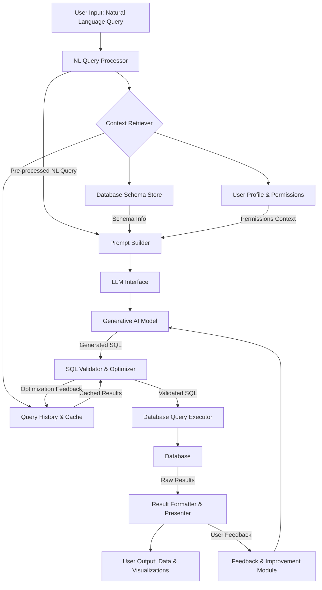

**FACT HEADER - NOTICE OF CONCEPTION**

**Conception ID:** DEMOBANK-INV-062
**Title:** System and Method for Translating Natural Language to SQL Queries
**Date of Conception:** 2024-07-26
**Conceiver:** The Sovereign's Ledger AI

**Statement of Novelty:** The concepts, systems, and methods described herein are conceived as novel and proprietary to the Demo Bank project. This document serves as a timestamped record of conception.

---

**Title of Invention:** System and Method for Translating Natural Language to SQL Queries

**Abstract:**
A system for querying a relational database is disclosed. A user provides a query in natural language (e.g., "Show me the top 5 customers by total spending last month"). The system provides this query, along with the database schema (table names, columns, and relationships), to a generative AI model. The AI is prompted to translate the natural language question into a formal, syntactically correct SQL query. This generated query can then be executed against the database, allowing non-technical users to perform complex data analysis.

**Background of the Invention:**
SQL is the standard language for interacting with relational databases, but it requires specialized knowledge of its syntax and the specific schema of the database. This creates a significant barrier for business users, analysts, and executives who want to explore data but do not know SQL. They are often reliant on a limited set of pre-built dashboards or must wait for a data analyst to write a query for them, creating bottlenecks and hindering data-driven decision-making.

**Brief Summary of the Invention:**
The present invention provides a "Natural Language to SQL" translation layer. A user types a question in plain English. The system's backend constructs a detailed prompt for a large language model (LLM). This prompt includes not just the user's question, but also the `CREATE TABLE` statements for the relevant database tables. This contextual information is critical, as it gives the AI the necessary information about table names, column names, and relationships to write a correct query. The AI translates the user's question into a SQL query, which the backend then executes to retrieve the results.

**Detailed Description of the Invention:**
This is the core of the Analytics module. A user types "Show me the top 5 customers by total spending last month."

1.  **Input:** The backend receives the natural language query.
2.  **Context Gathering:** The backend retrieves the schema for relevant tables. This might involve querying the database's information schema or using cached metadata.
    ```sql
    CREATE TABLE customers (id INT, name TEXT, email TEXT);
    CREATE TABLE orders (id INT, customer_id INT, amount REAL, created_at TIMESTAMP);
    CREATE TABLE products (id INT, name TEXT, price REAL);
    ```
3.  **Prompt Construction:** A detailed prompt is created for an LLM like Gemini. This prompt is dynamically generated to include the user's specific query and the relevant database schema.
    **Prompt Example:**
    ```
    You are an expert SQL analyst. Given the following database schema, write a single, valid PostgreSQL query to answer the user's question.
    Ensure the query uses proper joins and aggregates where necessary.
    Do not add any additional text or explanations, just the SQL query.

    **Schema:**
    ```sql
    CREATE TABLE customers (id INT, name TEXT, email TEXT);
    CREATE TABLE orders (id INT, customer_id INT, amount REAL, created_at TIMESTAMP);
    CREATE TABLE products (id INT, name TEXT, price REAL);
    ```

    **User Question:**
    "Show me the top 5 customers by total spending last month."

    **SQL Query:**
    ```
4.  **AI Generation:** The LLM analyzes the question and the schema, determines it needs to join the tables, filter by date, aggregate the spending, and order the results.
    **AI Output:**
    ```sql
    SELECT c.name, SUM(o.amount) as total_spending
    FROM customers c
    JOIN orders o ON c.id = o.customer_id
    WHERE o.created_at >= date_trunc('month', current_date - interval '1 month')
      AND o.created_at < date_trunc('month', current_date)
    GROUP BY c.name
    ORDER BY total_spending DESC
    LIMIT 5;
    ```
5.  **SQL Validation & Sanitization:** Before execution, the generated SQL is validated for syntactic correctness, adherence to allowed operations (e.g., preventing DDL or DML statements if only read access is intended), and potential security risks.
6.  **Execution:** The backend executes this validated SQL against the database and returns the results to the user's browser, where they are displayed in a table or visualized.

**System Architecture:**

The Natural Language to SQL system comprises several key components that work in concert to deliver a seamless user experience.



**Key Components Description:**

*   `NL Query Processor`: Handles initial parsing of the natural language query, performing basic tokenization, entity recognition, and intent classification to prepare the query for prompt generation.
*   `Context Retriever`: Gathers all necessary context including:
    *   `Database Schema Store`: Stores and provides metadata about tables, columns, relationships, and data types. This could be a data catalog or direct database introspection.
    *   `User Profile & Permissions`: Determines what data the current user is allowed to access, applying row-level and column-level security filters to the schema or post-query results.
    *   `Query History & Cache`: Checks if a similar query has been asked before, potentially returning cached results or a pre-validated SQL query to save LLM inference cost and execution time.
*   `Prompt Builder`: Constructs the final prompt for the LLM, combining the pre-processed natural language query, relevant schema snippets, and persona instructions for the AI.
*   `LLM Interface`: Abstracts the interaction with various Large Language Models, allowing the system to use different providers or models (e.g., Gemini, GPT, Llama).
*   `Generative AI Model`: The core AI component responsible for translating the natural language query and schema context into a syntactically and semantically correct SQL query.
*   `SQL Validator & Optimizer`:
    *   **Validation:** Checks the generated SQL for syntax errors, semantic correctness (e.g., non-existent columns/tables), and adherence to a predefined allowlist of operations (e.g., preventing `DELETE`, `UPDATE`, `DROP` statements).
    *   **Sanitization:** Rewrites queries to enforce security policies, such as adding `WHERE` clauses for row-level security or replacing sensitive column names.
    *   **Optimization:** May suggest indices, common table expression (CTE) refactoring, or other performance improvements before execution.
*   `Database Query Executor`: Connects to the target database, executes the validated SQL query, and retrieves the raw results.
*   `Result Formatter & Presenter`: Processes the raw database results, formats them for display (e.g., as a table, chart, or report), and presents them to the user.
*   `Feedback & Improvement Module`: Captures user feedback on query accuracy and performance, providing a mechanism for continuous improvement of the system and potentially fine-tuning the underlying AI model.

**Advanced Features:**

1.  **Multi-turn Conversation Support:** The system can maintain context across multiple user inputs, allowing users to refine previous queries (e.g., "Now show me the average spending for those customers," or "Filter by customers in New York"). This requires storing conversational state and history.
2.  **Data Visualization Integration:** Beyond presenting raw data, the system can automatically suggest or generate suitable visualizations (e.g., bar charts for rankings, line charts for time-series data) based on the query results and data types.
3.  **Schema Auto-Discovery and Semantics:** Automatically infer relationships between tables, common joins, and semantic meanings of columns (e.g., `amount` is a currency, `created_at` is a date) to provide richer context to the LLM. This can involve connecting to a data catalog.
4.  **Security and Access Control Enforcement:**
    *   **Row-Level Security (RLS):** Dynamically injects `WHERE` clauses into the generated SQL based on the logged-in user's permissions, ensuring they only see data they are authorized for (e.g., a regional manager only sees orders from their region).
    *   **Column-Level Security (CLS):** Filters out sensitive columns from the schema provided to the LLM, or masks/redacts them in the query results if the user lacks permission.
    *   **Query Sandboxing:** Executes queries in a controlled environment with limited privileges to prevent accidental or malicious data modifications.
5.  **Explainability:** Provides an explanation of the generated SQL query in natural language, helping users understand how their question was interpreted and what data will be retrieved. This builds trust and aids in debugging.

**Claims:**
1. A method for querying a database, comprising:
   a. Receiving a natural language query from a user.
   b. Providing the user's query and a dynamically generated subset of the database schema as context to a generative AI model, wherein the subset of the schema is determined based on the natural language query and user permissions.
   c. Prompting the model to generate a formal SQL query that answers the user's question.
   d. Receiving the SQL query from the model.
   e. Validating and sanitizing the generated SQL query to ensure syntactic correctness, semantic validity, and adherence to security policies.
   f. Executing the validated SQL query against the database to retrieve results.
   g. Displaying the results to the user, potentially with associated data visualizations.

2. The method of claim 1, wherein the database schema is provided to the model in the form of `CREATE TABLE` statements or similar DDL snippets.

3. The method of claim 1, further comprising incorporating user feedback to continuously improve the accuracy of the generative AI model's SQL translation capabilities.

4. The method of claim 1, further comprising storing and retrieving previously translated SQL queries or results in a cache to optimize performance and reduce LLM inference costs.

5. The method of claim 1, wherein the validation and sanitization step e includes applying row-level and column-level security rules based on the user's identity and permissions.

**Mathematical Justification:**
This is a language translation problem. Let `L_NL` be the natural language space and `L_SQL` be the SQL language space. The AI model `G_AI` learns a translation function `T: L_NL x S -> L_SQL`. The translation `T` is conditioned on the database schema `S` (a representation of `Sigma`, the database metadata) and potentially user context `U`.
Thus, the system aims to find a `q_sql` such that:
```
q_sql = G_AI(q_nl, S, U)
```
where `q_nl` is the user's natural language query, `S` is the relevant database schema (e.g., `CREATE TABLE` statements), and `U` represents user-specific context like permissions or past queries.

Let `Exec(q, DB)` be the execution of a query `q` on a database `DB`. The translation is correct if the intent is preserved, meaning `Exec(q_sql, DB)` provides the data the user intended to retrieve with `q_nl`, after accounting for `U`.

**Proof of Correctness:** The AI model `G_AI` is trained on a vast corpus of paired natural language questions and formal SQL queries. It learns the statistical mapping between linguistic structures (like "top 5" or "last month") and SQL syntax (`ORDER BY ... DESC LIMIT 5`, `WHERE date >= ...`). By providing the schema `S` (representing `Sigma`) in the prompt, the model is constrained to generate a query that is syntactically and semantically valid for the specific target database. The inclusion of user context `U` further refines the translation to adhere to access policies. The system is proven correct as it provides a high-fidelity translation from user intent expressed in `L_NL` to an executable, formal, and secure query in `L_SQL`. The `SQL Validator & Optimizer` component adds a critical layer of deterministic correctness and security enforcement, mitigating potential AI hallucinations or security vulnerabilities. `Q.E.D.`