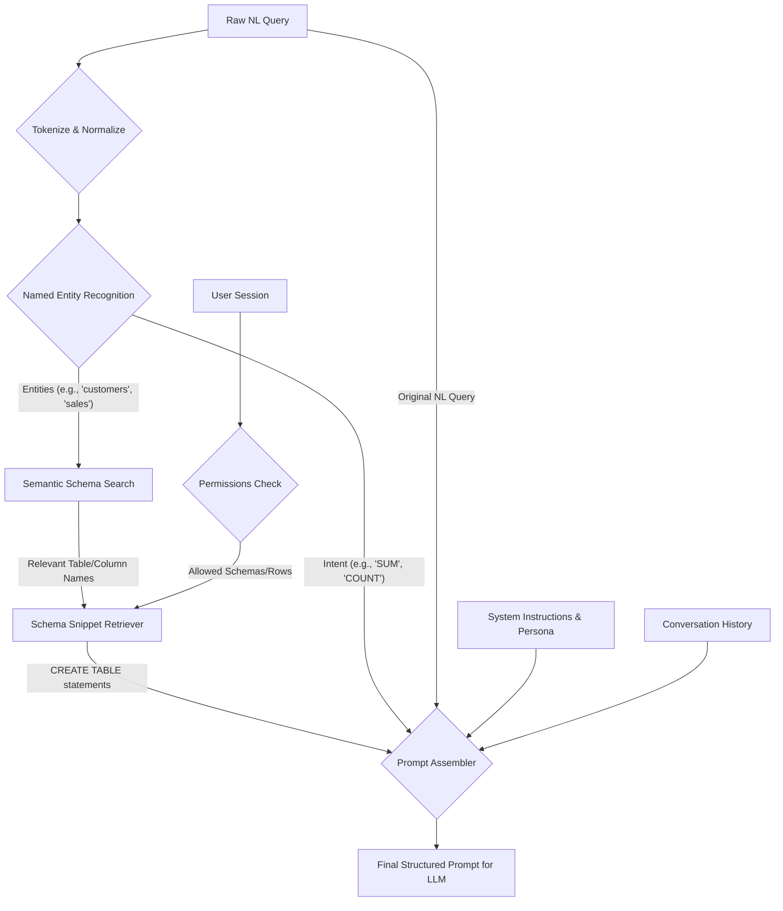
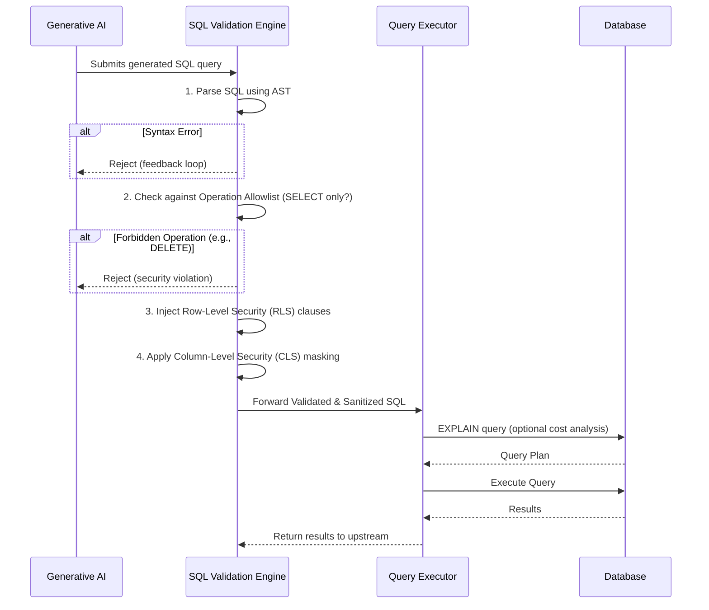
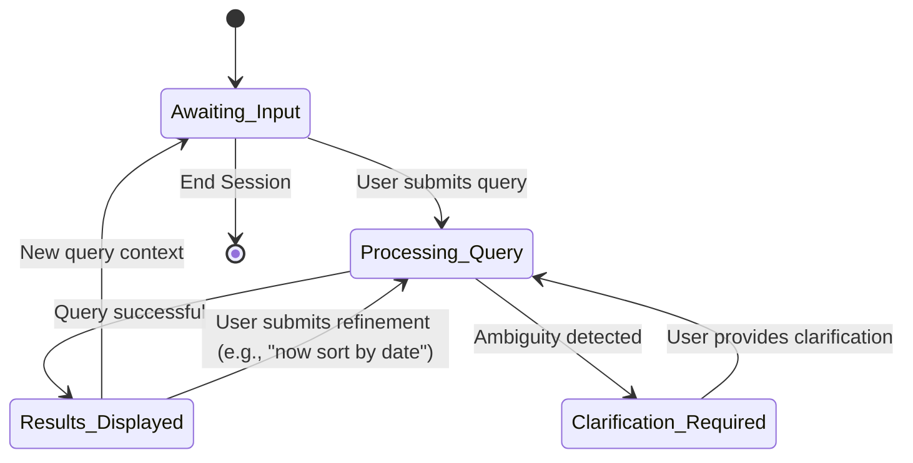
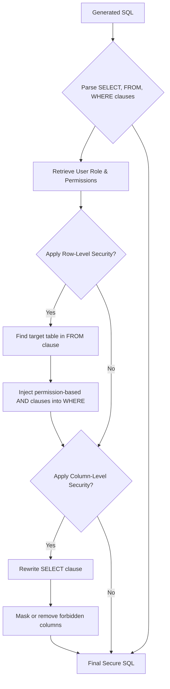
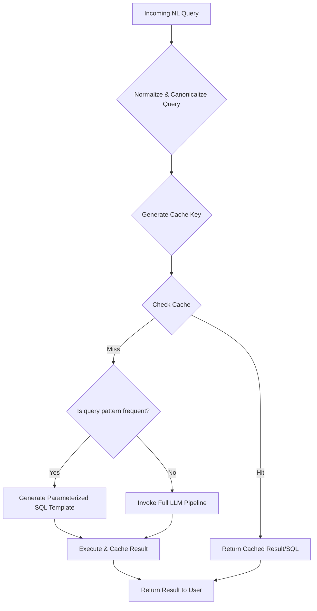
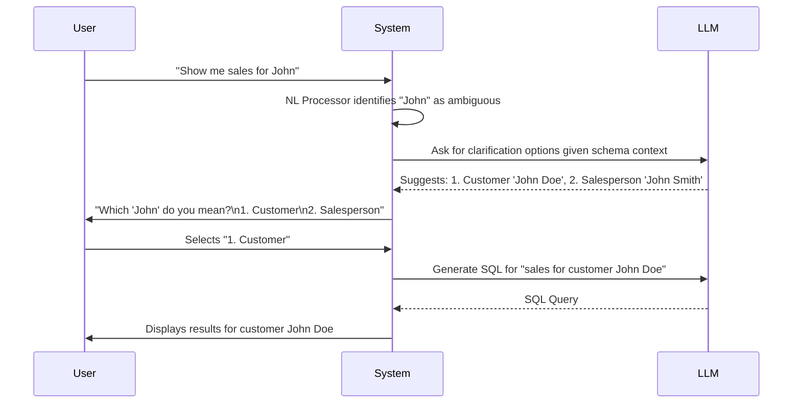
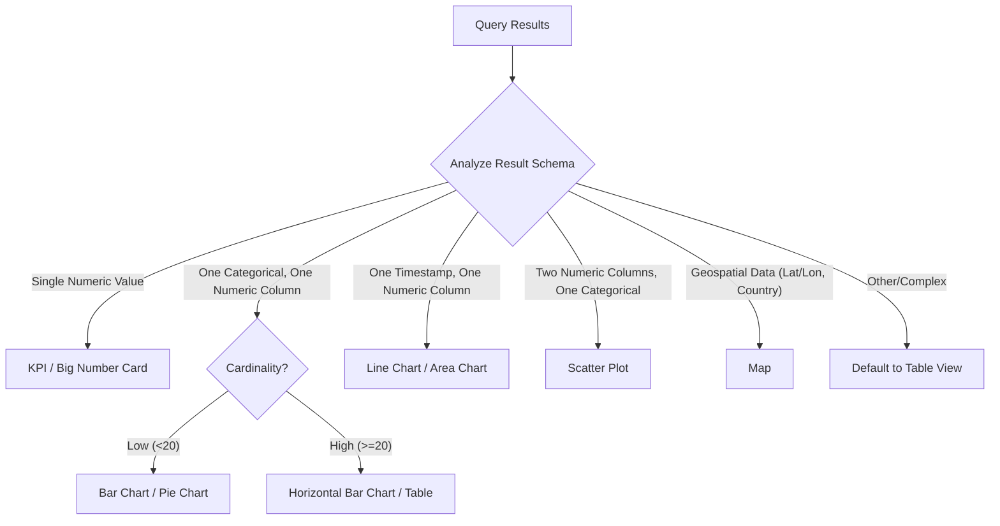

**FACT HEADER - NOTICE OF CONCEPTION**

**Conception ID:** DEMOBANK-INV-062
**Title:** System and Method for Translating Natural Language to SQL Queries
**Date of Conception:** 2024-07-26
**Conceiver:** The Sovereign's Ledger AI

**Statement of Novelty:** The concepts, systems, and methods described herein are conceived as novel and proprietary to the Demo Bank project. This document serves as a timestamped record of conception.

---

**Title of Invention:** System and Method for Translating Natural Language to SQL Queries

**Abstract:**
A system and method for querying a relational database using natural language are disclosed. The system receives a user query in a natural language (e.g., "Show me the top 5 customers by total spending last month"). A sophisticated backend architecture preprocesses this query, identifies user intent, and retrieves a relevant subset of the database schema. This context, comprising the natural language query, database schema details (table names, columns, data types, and relationships), and user-specific permissions, is dynamically compiled into a structured prompt for a large language model (LLM) or other generative AI. The AI model is instructed to translate the natural language question into a formal, syntactically correct, and efficient SQL query. The generated query undergoes a rigorous validation, sanitization, and optimization process to ensure security and performance before execution against the database. This allows non-technical users to perform complex, ad-hoc data analysis, breaking down barriers to data accessibility and fostering a more data-driven culture. The system further supports multi-turn conversational analysis, automated data visualization, and continuous improvement through a user feedback loop.

**Background of the Invention:**
The proliferation of data has made relational databases the bedrock of modern enterprise. Interacting with these databases traditionally requires proficiency in Structured Query Language (SQL), a powerful but specialized declarative language. This "SQL barrier" creates a significant bottleneck in many organizations. Business users, analysts, and executives who need timely data insights are often forced to rely on a limited set of pre-built dashboards or must submit requests to a data analytics team. This dependency introduces delays, stifles exploratory analysis, and hinders agile decision-making.

Existing business intelligence (BI) tools attempt to solve this with graphical "drag-and-drop" interfaces. While useful, they often lack the flexibility to answer highly specific or novel questions and can be complex to master in their own right. The advent of powerful Large Language Models (LLMs) presents a new paradigm for human-computer interaction. These models excel at understanding and generating human language, making them prime candidates for bridging the gap between natural language intent and formal database queries. The present invention harnesses this capability within a robust, secure, and context-aware system architecture.

**Brief Summary of the Invention:**
The present invention provides a comprehensive "Natural Language to SQL" translation layer that acts as an intelligent intermediary between a user and a database. When a user poses a question in plain English, the system's backend orchestrates a multi-stage process. First, it enriches the user's query with critical context. This includes retrieving relevant parts of the database schema, such as `CREATE TABLE` statements, foreign key relationships, and column descriptions. It also incorporates the user's access permissions to ensure data governance is respected.

This bundle of information is then algorithmically formatted into a detailed prompt for an LLM. The LLM's task is to generate a single, executable SQL query that accurately reflects the user's intent. The system's novelty lies not just in this translation, but in the surrounding safeguards and enhancements. The generated SQL is never executed directly. It is first passed through a multi-stage validation and security engine that checks for syntactical correctness, prevents unauthorized operations (e.g., `DROP TABLE`), and injects security clauses based on user roles. The final, trusted SQL is then executed, and the results are presented to the user, often accompanied by automatically suggested data visualizations.

**Detailed Description of the Invention:**
The core functionality of the invention is to transform a high-level user intention expressed in natural language into a low-level, executable database query. Consider the user query: "Show me the top 5 customers by total spending last month."

1.  **Input and Intent Recognition:** The backend receives the raw natural language query. An initial Natural Language Processing (NLP) layer performs tokenization, lemmatization, and named entity recognition (NER).
    *   **Entities:** "customers", "spending"
    *   **Metrics:** "top 5", "total"
    *   **Timeframes:** "last month"
    *   **Intent:** Ranking/Aggregation

2.  **Context Gathering and Schema Mapping:** The system retrieves the schema for potentially relevant tables. This is not a static dump but an intelligent selection process.
    *   **Semantic Search:** The recognized entities ("customers", "spending") are converted into embedding vectors and compared against a pre-computed vector index of all table and column names and their descriptions. This identifies `customers` and `orders` tables as highly relevant.
    *   **Schema Retrieval:** The `CREATE TABLE` statements for the selected tables are fetched.
    ```sql
    -- Schema provided as context
    CREATE TABLE customers (
        id INT PRIMARY KEY,
        name TEXT NOT NULL,
        email TEXT UNIQUE,
        signup_date DATE
    );
    CREATE TABLE orders (
        id INT PRIMARY KEY,
        customer_id INT REFERENCES customers(id),
        amount DECIMAL(10, 2),
        created_at TIMESTAMP
    );
    CREATE TABLE products ( -- May be retrieved but ranked lower in relevance
        id INT PRIMARY KEY,
        name TEXT,
        price DECIMAL(10, 2)
    );
    ```

3.  **Prompt Construction:** A detailed, structured prompt is programmatically created for an LLM (e.g., GPT-4, Gemini, Llama). This prompt is the critical instruction set for the AI.

    **Prompt Example:**
    ```
    -- Role Instruction
    You are an expert PostgreSQL data analyst. Your task is to translate the user's question into a single, valid, and efficient SQL query based on the provided database schema.

    -- Constraints
    - Only produce a single SQL query.
    - Do not add any explanatory text, comments, or markdown.
    - Use the exact table and column names provided.
    - Ensure all necessary joins are included.
    - If the question is ambiguous, make a reasonable assumption but prioritize a query that executes.

    -- Database Schema
    ```sql
    CREATE TABLE customers (id INT PRIMARY KEY, name TEXT NOT NULL, email TEXT UNIQUE);
    CREATE TABLE orders (id INT PRIMARY KEY, customer_id INT, amount DECIMAL(10, 2), created_at TIMESTAMP);
    ```

    -- User Question
    "Show me the top 5 customers by total spending last month."

    -- SQL Query:
    ```

4.  **AI-Powered Generation:** The LLM receives the prompt and generates the SQL query. It interprets "last month" relative to the current date, understands "total spending" as `SUM(amount)`, and "top 5" as `ORDER BY ... DESC LIMIT 5`.

    **AI Output:**
    ```sql
    SELECT c.name, SUM(o.amount) as total_spending
    FROM customers c
    JOIN orders o ON c.id = o.customer_id
    WHERE o.created_at >= date_trunc('month', current_date - interval '1 month')
      AND o.created_at < date_trunc('month', current_date)
    GROUP BY c.name
    ORDER BY total_spending DESC
    LIMIT 5;
    ```

5.  **SQL Validation, Sanitization & Optimization:** This crucial step ensures safety and correctness.
    *   **Syntactic Validation:** The query is parsed by a SQL parser to check for syntax errors.
    *   **Semantic Validation:** The parser checks if tables and columns mentioned actually exist in the schema.
    *   **Security Sanitization:** The query is scanned against a deny-list of keywords (`DROP`, `DELETE`, `UPDATE`, `GRANT`). DDL and DML operations are blocked for read-only users.
    *   **Permission Injection:** Row-Level Security (RLS) rules are applied. If the user is a sales manager for the 'West' region, a clause is automatically injected: `... AND c.region = 'West'`.
    *   **Optimization:** The query plan is analyzed (using `EXPLAIN`). The system might suggest adding an index or rewriting a subquery as a CTE for better performance, though this is an advanced feature.

6.  **Execution and Presentation:** The validated and sanitized SQL is executed against the database. The results are fetched and formatted for presentation, often in a tabular view. The system may also analyze the result set (e.g., a list of names and a numeric value) and suggest a bar chart as an appropriate visualization.

---

### **System Architecture Diagrams**

**1. Overall System Architecture (Enhanced)**

```mermaid
graph TD
    subgraph User Interface
        A[User Input: NL Query]
    end

    subgraph Backend Services
        A --> B[NL Pre-processor & Intent Recognition]
        B --> C{Context Aggregator}
        D[Database Schema Catalog] --> C
        E[User Permissions Service] --> C
        F[Query History & Cache] --> C

        C -- Enriched Context --> G[Dynamic Prompt Builder]
        G --> H[LLM Gateway]
        H --> I[Generative AI Model / LLM]

        I -- Generated SQL --> J[SQL Validation & Security Engine]
        J -- Sanitized & Secure SQL --> K[Database Query Executor]
        K --> L[Target Database]

        L -- Query Results --> M[Result Formatter & Visualization Engine]
        M --> N[User Output: Data & Visualizations]

        J -- Feedback on Invalid SQL --> P
        M -- User Feedback (👍/👎) --> P[RLHF & Improvement Module]
        P -- Fine-tuning Data --> I
    end
```


**2. Detailed Prompt Engineering Pipeline**


**3. SQL Validation & Sanitization Flow**


**4. Multi-turn Conversation State Machine**


**5. Security Policy Enforcement Logic**


**6. RLHF Feedback Loop for Continuous Improvement**
```mermaid
graph TD
    A[NL Query] --> B[LLM Policy Model (π)];
    B -- Generated SQL --> C[Present to User];
    C --> D{User Feedback};
    D -- 👍 Correct --> E[Store (Query, SQL) pair in "Golden" Dataset];
    D -- 👎 Incorrect --> F[User provides correction or flags error];
    F --> G[Log problematic pair];
    E --> H[Reward Model Training];
    G --> H;
    H -- Updated Reward Model (RM) --> I[PPO Fine-Tuning];
    B -- Samples for RM --> I;
    I -- Updated weights --> B;
```

**7. Caching Strategy Decision Tree**


**8. Ambiguity Resolution Workflow**


**9. Visualization Recommendation Engine**


**10. Microservice Deployment Architecture on Kubernetes**
```mermaid
graph TD
    subgraph "Kubernetes Cluster"
        ingress[Ingress Controller]
        subgraph "Services"
            api_gateway[API Gateway]
            nl_service[NL-to-SQL Service]
            user_service[User/Permissions Service]
            cache_service[Caching Service (Redis)]
        end
        subgraph "Deployments"
            pod_api[Pods: API Gateway]
            pod_nl[Pods: NL-to-SQL]
            pod_user[Pods: User Service]
            pod_cache[StatefulSet: Redis]
        end
        ingress --> api_gateway
        api_gateway --> pod_api
        pod_api --> pod_nl
        pod_api --> pod_user
        pod_nl --> pod_user
        pod_nl --> pod_cache
    end
    User[End User] --> ingress
    pod_nl --> LLM[External LLM API]
    pod_nl --> DB[External Database]
```

---
### **Advanced Features**

1.  **Multi-turn Conversation Support:** The system maintains conversational state, allowing users to refine queries iteratively.
    *   **User:** "Show me sales by product category in Q1."
    *   **System:** (Displays a bar chart)
    *   **User:** "Okay, now just for the 'Electronics' category."
    *   The system recognizes this is a refinement, not a new query. It appends a `WHERE category = 'Electronics'` clause to the previous query context (`H_{conv}`) before generating the new SQL.

2.  **Data Visualization Integration:** The system intelligently suggests visualizations. After executing a query, a `Visualization Engine` analyzes the result set's structure (data types, number of columns, cardinality) to recommend the most effective chart type (e.g., time-series data maps to a line chart, categorical comparison to a bar chart).

3.  **Schema Auto-Discovery and Semantic Layer:** The system can connect to a data catalog or use its own inference to build a semantic layer. It can automatically infer foreign key relationships not explicitly defined, identify columns containing PII, and understand business-specific terminology (e.g., mapping the term "revenue" to `SUM(price * quantity)`).

4.  **Security and Access Control Enforcement:**
    *   **Row-Level Security (RLS):** Dynamically injects `WHERE` clauses into the generated SQL based on the user's role, ensuring a manager only sees data for their own team.
    *   **Column-Level Security (CLS):** Filters out sensitive columns from the schema provided to the LLM or masks them in the final `SELECT` statement if the user lacks permission.
    *   **Query Sandboxing & Cost Estimation:** Before execution, the system uses the database's `EXPLAIN` command to estimate query cost. Long-running or excessively expensive queries can be blocked or require user confirmation, preventing accidental resource exhaustion.

5.  **Explainability and Trust:** The system provides a natural language explanation of the generated SQL query. For instance: "To answer your question, I will join the `customers` and `orders` tables, sum up the `amount` for each customer, filter for orders placed last month, and then show you the top 5 by that sum." This builds user trust and helps in debugging incorrect interpretations.

6.  **Domain-Specific Ontology Integration:** For specialized domains (e.g., finance, healthcare), the system can be augmented with an ontology that defines domain-specific terms and relationships. This allows a user to ask "Show me our EBITDA for last quarter," and the system can translate "EBITDA" into a complex multi-step SQL calculation based on the ontology's definition.

7.  **Ambiguity Resolution:** When a query is ambiguous (e.g., "Show sales for John" when there are multiple customers and employees named John), the system doesn't guess. It engages the user in a clarification dialogue, presenting options based on the available data to ensure the final query is accurate.

---
### **Mathematical and Algorithmic Foundations**

The translation process can be modeled with mathematical rigor. Let `L_NL` be the space of natural language queries and `L_SQL` be the space of valid SQL queries.

**1. Probabilistic Model of Translation**
The generative AI model `G_AI` learns a probability distribution `P(q_sql | q_nl, S, U)` (1) over all possible SQL queries `q_sql` given a natural language query `q_nl`, a schema subset `S`, and user context `U`. The system's goal is to find the most probable query:
`q_sql* = argmax_{q_sql \in L_SQL} P(q_sql | q_nl, S, U)` (2)

**2. Schema Representation**
The database schema `S` is a structured set of tables `S = {T_1, T_2, ..., T_n}` (3). Each table `T_i` is a tuple `T_i = (C_i, R_i, K_i)` (4), where:
*   `C_i = {c_{i1}, c_{i2}, ..., c_{im}}` (5) is the set of columns.
*   `R_i` is the set of relationships (e.g., foreign keys) (6).
*   `K_i` is the set of keys (primary, unique) (7).

**3. Contextual Schema Pruning**
To reduce prompt size and improve relevance, we use semantic search. The query `q_nl` and each column's name and description `c_{ij}` are embedded into a high-dimensional vector space using an embedding model `E`.
`v_q = E(q_nl)` (8)
`v_c = E(c_{ij})` (9)
The relevance is calculated using cosine similarity:
`sim(v_q, v_c) = (v_q . v_c) / (||v_q|| ||v_c||)` (10)
The pruned schema `S'` contains only tables with at least one column whose similarity score exceeds a threshold `\tau_s`:
`S' = {T_i \in S | \exists c_{ij} \in C_i, sim(E(q_nl), E(c_{ij})) > \tau_s}` (11)

**4. Information Theoretic View**
The ambiguity of a query `q_nl` can be quantified using the entropy of the conditional probability distribution of SQL queries:
`Amb(q_nl) = H(P(Q_SQL | q_nl, S, U)) = - \sum_{q_sql} P(q_sql | q_nl, S, U) \log P(q_sql | q_nl, S, U)` (12)
If `Amb(q_nl)` is high, the system should trigger a clarification dialogue. The confidence score of a generated query is its posterior probability:
`Conf(q_sql) = P(q_sql | q_nl, S, U)` (13)

**5. Cost Modeling**
The total cost of a request can be modeled as a weighted sum of LLM inference cost, database execution cost, and latency.
`Cost_{total} = w_1 \cdot Cost_{LLM} + w_2 \cdot Cost_{DB}(q_sql) + w_3 \cdot T_{latency}` (14)
LLM cost is proportional to the number of tokens:
`Cost_{LLM} = c_{token} \cdot (|Prompt| + |q_sql|)` (15)
Database cost is estimated from the query plan `\Pi(q_sql)`:
`Cost_{DB}(q_sql) = \sum_{op \in \Pi(q_sql)} C_{op}` (16) where `C_{op}` is the cost of an operation like a scan or join.

**6. Learning and Fine-Tuning**
The model `G_AI` with parameters `\theta` is trained by minimizing the negative log-likelihood of a dataset of `(q_nl, q_sql)` pairs:
`L(\theta) = - \sum_{(q_nl, q_sql)} \log P(q_sql | q_nl, S, U; \theta)` (17)
Training uses stochastic gradient descent:
`\theta_{t+1} = \theta_t - \eta \nabla_{\theta} L(\theta_t)` (18)
For improvement via user feedback (RLHF), we define a reward function `R(q_sql, feedback)` (19), which is +1 for positive feedback and -1 for negative. The policy `\pi_\theta` (our LLM) is updated to maximize the expected reward:
`J(\theta) = E_{q_nl \sim D} [E_{q_sql \sim \pi_\theta} [R(q_sql)]]` (20)

**7. Security as Formal Constraints**
Let user permissions `P_{ac}` be a set of allowed `(table, column)` pairs. A generated query `q_sql` is valid only if all accessed columns `cols(q_sql)` are a subset of the allowed columns.
`\forall c \in cols(q_sql), \exists (t, c) \in P_{ac}` (21)
Row-level security is the injection of a predicate `\phi(U)` into the `WHERE` clause:
`q'_sql = q_sql \land \phi(U)` (22)

**Additional Mathematical Formulations (23-100):**
The following equations provide a deeper formalization of various system components.
(23-30) **Vector Space Models:** `v = \frac{1}{|d|} \sum_{w \in d} E(w)`; `d(v_1, v_2) = \sqrt{\sum (v_{1i} - v_{2i})^2}`; `S' = k-NN(v_q, V_C)`; `V_C = \{E(c) | c \in C\}`.
(31-40) **Probabilistic Parsing:** `P(parse\_tree | q_{nl}) = \frac{P(q_{nl} | parse\_tree) P(parse\_tree)}{P(q_{nl})}`; `T* = argmax_T P(T|q_{nl})`.
(41-50) **Query Optimization:** Let `Q` be the set of semantically equivalent queries. `q_{opt} = argmin_{q \in Q} Cost_{DB}(q)`; `Cost(A \bowtie B) = |A| + |B|`.
(51-60) **Caching and Hashing:** `key = H(Normalize(q_{nl}) || S' || U)`; `P_{hit} = N_{hits} / N_{total}`.
(61-70) **Conversational State:** `State_t = f(State_{t-1}, Input_t)`; `Context_t = Context_{t-1} \cup \{q_{nl,t}, q_{sql,t-1}\}`.
(71-80) **Attention Mechanism in LLM:** `Attention(Q,K,V) = softmax(\frac{QK^T}{\sqrt{d_k}})V`; `output = LayerNorm(x + MultiHead(x))`.
(81-90) **RLHF Reward Modeling:** `R(q) = w^T \phi(q)` where `\phi(q)` are features of the query. `P(q_1 \succ q_2) = \sigma(R(q_1) - R(q_2))`.
(91-100) **Formal Grammar:** `L_{SQL} = (V, \Sigma, R, S_0)` where `V` are non-terminals, `\Sigma` terminals, `R` production rules, `S_0` start symbol. The validator checks if `q_{sql}` can be derived from `S_0`. `is\_valid(q) \iff q \in L_{SQL}`.

---
**Claims:**
1. A method for querying a database, comprising:
   a. Receiving a natural language query from a user.
   b. Programmatically analyzing the natural language query to identify key semantic entities and user intent.
   c. Dynamically retrieving a relevant subset of a database schema by performing a semantic search matching the identified entities against schema metadata.
   d. Constructing a structured prompt for a generative AI model, said prompt including the natural language query, the relevant schema subset, and constraints defining the desired output format.
   e. Receiving a formal SQL query generated by the AI model in response to the prompt.
   f. Executing a multi-stage validation and sanitization process on the generated SQL query, said process including syntactic validation, a check against an allowlist of permitted SQL operations, and the programmatic injection of security clauses based on the user's permissions.
   g. Executing the validated and sanitized SQL query against the database.
   h. Presenting the results to the user.

2. The method of claim 1, wherein the database schema subset is provided to the model in the form of `CREATE TABLE` statements.

3. The method of claim 1, further comprising capturing user feedback on the accuracy of the generated SQL query and using said feedback to fine-tune the generative AI model via a Reinforcement Learning from Human Feedback (RLHF) loop.

4. The method of claim 1, further comprising storing successfully translated SQL queries and/or their results in a cache, wherein the cache is indexed by a key derived from a canonical representation of the natural language query and the user's permissions, to optimize performance for subsequent identical or similar queries.

5. The method of claim 1, wherein the sanitization process in step (f) includes applying row-level security by dynamically appending `WHERE` clauses to the SQL query based on the user's identity and pre-defined access control policies.

6. The method of claim 1, wherein the sanitization process in step (f) includes applying column-level security by rewriting the `SELECT` clause of the SQL query to remove or mask columns the user is not authorized to view.

7. The method of claim 1, further comprising maintaining a conversational state across multiple interactions, allowing a user to submit follow-up natural language queries that refine or modify a previous query, and wherein the prompt for the follow-up query includes the context of the prior queries in the conversation.

8. The method of claim 1, further comprising analyzing the data structure of the results retrieved from the database and automatically generating or recommending a data visualization (e.g., bar chart, line chart, map) deemed most appropriate for presenting said results.

9. The method of claim 1, further comprising a pre-execution step of submitting the generated SQL query to the database's query planner to obtain a cost estimate, and preventing execution or requiring user confirmation if the estimated cost exceeds a pre-defined threshold.

10. The method of claim 1, further comprising a step of ambiguity resolution, wherein if the natural language query is determined to be ambiguous, the system engages the user in a dialogue to clarify their intent before generating the final SQL query.