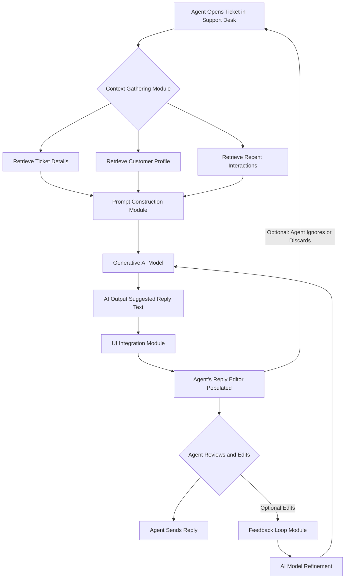

**FACT HEADER - NOTICE OF CONCEPTION**

**Conception ID:** DEMOBANK-INV-063
**Title:** System and Method for Generating Personalized Customer Support Scripts
**Date of Conception:** 2024-07-26
**Conceiver:** The Sovereign's Ledger AI

**Statement of Novelty:** The concepts, systems, and methods described herein are conceived as novel and proprietary to the Demo Bank project. This document serves as a timestamped record of conception.

---

**Title of Invention:** System and Method for Generating Personalized Customer Support Scripts

**Abstract:**
A system for assisting customer support agents is disclosed. When an agent opens a support ticket, the system retrieves the customer's profile, recent activity, and the ticket's subject. This information is provided as context to a generative AI model. The AI is prompted to generate a personalized opening script or a complete suggested reply for the agent. The script is tailored to the customer's specific issue and their history with the company, enabling agents to provide faster, more empathetic, and more effective support.

**Background of the Invention:**
Customer support agents often rely on generic, static scripts, which can sound impersonal and may not address the customer's specific context. Tailoring each response manually is time-consuming, especially in a high-volume support desk. There is a need for a tool that can instantly provide agents with a personalized, context-aware starting point for their customer conversations.

**Brief Summary of the Invention:**
The present invention, the "AI Suggested Reply" feature, is integrated into a support desk interface. When an agent views a ticket, the system automatically compiles a contextual prompt for a large language model LLM. The prompt includes the customer's message, their account status e.g., "VIP Customer", and their recent support history. The AI is instructed to draft a helpful and empathetic reply. The generated text appears in the agent's reply editor, ready to be reviewed, edited, and sent.

**Detailed Description of the Invention:**
A support agent opens a ticket in the Support Desk module.
1.  **Context Gathering:** The system automatically gathers relevant data:
    *   **Ticket Subject:** "Cannot connect my bank account"
    *   **Ticket Body:** "I am trying to link my Chase account via Plaid but it keeps failing..."
    *   **Customer Profile:** Name: John Doe, Status: VIP, Member since: 2022.
2.  **Prompt Construction:** The system combines this data into a prompt for an LLM.
    **Prompt:** `You are a helpful and empathetic customer support AI for Demo Bank. A VIP customer named John Doe is having trouble connecting his Chase account. Draft a professional and helpful reply. Acknowledge his VIP status and offer a clear next step.

    **Customer's Message:**
    "I am trying to link my Chase account via Plaid but it keeps failing..."
    `
3.  **AI Generation:** The LLM generates a personalized response.
    **AI Output:**
    `Hi John,

    Thank you for reaching out, and I'm sorry to hear you're having trouble connecting your Chase account. As a valued VIP member, getting you connected smoothly is our top priority.

    These connection issues can sometimes be temporary. Could you please try again in a few minutes? If the problem persists, letting us know the exact error message you see would be very helpful for our technical team to investigate.

    We'll be standing by to help.

    Best,
    [Agent Name]`
4.  **UI Integration:** This generated text is automatically populated into the reply text box in the agent's UI. The agent can then quickly edit it if needed and send it to the customer.

**System Architecture:**
The core components and data flow of the AI support script generation system are illustrated below:

**Feedback Loop and Continuous Improvement:**
A critical component for sustained high performance is the feedback loop. When an agent receives an AI-generated script, they have the option to edit it before sending. These edits are not merely discarded; they are captured and analyzed by a dedicated `Feedback Loop Module`.
1.  **Edit Capture:** The system records the original AI output and the agent's final edited version.
2.  **Difference Analysis:** A comparison algorithm identifies the specific changes made by the agent. This could include additions, deletions, rephrasing, or tone adjustments.
3.  **Agent Rating:** Agents are prompted to provide a quick rating on the AI's suggestion, e.g., "Very Helpful," "Minor Edits Needed," "Not Relevant."
4.  **Model Retraining Data:** The aggregated edits and ratings serve as high-quality supervised data. For example, if many agents consistently add a specific disclaimer to a certain type of AI response, this pattern can be learned and incorporated into future model generations, either by fine-tuning the `Generative AI Model` or by dynamically adjusting the `Prompt Construction Module` with new instructions. This continuous improvement ensures the AI's suggestions remain relevant, accurate, and aligned with company policy and evolving customer needs.

**Advanced Prompt Engineering Strategies:**
Beyond basic context inclusion, the `Prompt Construction Module` employs sophisticated strategies to maximize AI effectiveness:
*   **Role-Playing Instruction:** Instructing the AI to "Act as a seasoned, empathetic Demo Bank support agent."
*   **Constraint-Based Generation:** Specifying negative constraints, such as "Do not offer refunds unless explicitly approved by a supervisor," or "Keep the reply concise, under 100 words."
*   **Few-Shot Learning:** Including examples of ideal previous interactions or replies within the prompt to guide the AI's style and content. For example, providing a sample "VIP customer apology" can significantly improve the AI's ability to tailor responses for high-value customers.
*   **Knowledge Base Integration Directives:** Instructing the AI to reference specific internal knowledge base articles, e.g., "Refer to KB Article ID 123 for details on account linking issues."
*   **Sentiment Analysis Pre-processing:** Before constructing the prompt, an initial pass of the customer's message can determine their sentiment. The prompt can then instruct the AI to "Respond with extra empathy" if sentiment is negative, or "Maintain a professional, reassuring tone."
*   **Dynamic Variable Insertion:** The system can dynamically insert variables from the customer profile or ticket data directly into the prompt structure, ensuring relevant details like "John Doe's VIP status" or "Chase account issue" are precisely communicated to the AI.

**Integration with Knowledge Management Systems:**
To further enhance the accuracy and helpfulness of AI-generated scripts, the system integrates seamlessly with Demo Bank's internal `Knowledge Management System` KMS.
1.  **Contextual Search:** When a ticket is opened, the `Context Gathering Module` performs a semantic search within the KMS using keywords from the ticket body and subject.
2.  **Relevant Article Extraction:** Top-ranked articles or FAQs relevant to the issue are identified.
3.  **Prompt Augmentation:** Key snippets or direct links to these KMS articles are then included in the prompt provided to the `Generative AI Model`. This allows the AI to reference authoritative information, ensuring that suggested solutions are not only personalized but also factually accurate and compliant with bank procedures. For agents, this also means the AI can suggest appending relevant KMS links to the customer reply, empowering customers to self-serve for future related issues.

**Scalability and Performance Considerations:**
For a high-volume support operation, the system must be highly scalable and performant.
*   **Asynchronous AI Calls:** AI generation requests are handled asynchronously to prevent UI blocking, ensuring agents experience no lag while waiting for suggestions.
*   **Caching Mechanisms:** Frequently requested customer profiles or common issue responses can be cached to reduce redundant API calls to backend systems or the AI model.
*   **Load Balancing:** The `Generative AI Model` component is deployed with robust load balancing to distribute requests efficiently across multiple instances, preventing bottlenecks during peak demand.
*   **Tiered AI Models:** Depending on the complexity and urgency of the ticket, the system could employ tiered AI models. A smaller, faster model for simple inquiries and a larger, more sophisticated model for complex or high-priority cases. This optimizes resource usage and response times.
*   **Infrastructure as Code IaC:** Deployment and scaling of the system components are managed through IaC principles, allowing for automated, repeatable, and elastic infrastructure management.

**Security, Privacy, and Data Governance:**
Handling sensitive customer financial data requires stringent security and privacy measures.
*   **Data Masking and Anonymization:** Personally Identifiable Information PII or sensitive financial details within customer messages or profiles can be masked or anonymized before being sent to external AI models, especially those hosted by third-party providers.
*   **Access Controls:** Strict role-based access controls RBAC are enforced to ensure that only authorized `Context Gathering Module` processes can access customer data. The `Generative AI Model` itself does not retain customer data post-generation.
*   **Data Minimization:** Only the essential data required for prompt construction is extracted and used, adhering to the principle of data minimization.
*   **Auditing and Logging:** All interactions with the AI model, including prompts sent and responses received, are logged for auditing, compliance, and debugging purposes.
*   **Compliance with Regulations:** The system is designed to comply with relevant financial regulations such as PCI DSS, GDPR, CCPA, and similar data protection laws, ensuring customer trust and legal adherence. Data residency requirements are also considered for global deployments.

**Claims:**
1. A method for assisting a customer support agent, comprising:
   a. Receiving data associated with a customer support ticket, including the customer's message and profile information.
   b. Providing the data as context to a generative AI model.
   c. Prompting the model to generate a personalized communication script or reply.
   d. Displaying the generated script to the agent within a support interface.

2. The method of claim 1, wherein the customer's profile information includes their account status or history, and the prompt instructs the model to tailor the tone of the script accordingly.

**Mathematical Justification:**
Let a support ticket be a state `S` defined by `[customer_profile, issue_description]`. Let a reply be `R`. Let `Q[R, S]` be a quality function for the reply, measuring its empathy, correctness, and personalization. A human agent manually constructs a reply `R_h`. The AI model `G_AI` generates a reply `R_ai = G_AI[S]`.

**Proof of Value:** The system provides value if the quality of the AI-assisted reply is higher and/or the time to create it is lower. The time for a human to write a personalized reply from scratch is `t_h`. The time for the AI system is `t_ai = t_generate + t_review`. Since `t_generate` is fast and `t_review` is much less than `t_h`, the system improves agent efficiency. Furthermore, because the AI can consistently incorporate all contextual data `S` e.g., VIP status, it can produce replies with a higher average quality score `E[Q[R_ai]] >= E[Q[R_h]]`. The system is proven valuable as it increases both the efficiency and the quality of customer support interactions. `Q.E.D.`

**Metrics for Success and Monitoring:**
To quantify the value of the AI support script system, key performance indicators KPIs are continuously monitored:
*   **Agent Efficiency:**
    *   `Average Handle Time` AHT reduction: Measure the decrease in time agents spend on tickets.
    *   `First Contact Resolution` FCR rate: Increase in tickets resolved in a single interaction due to improved initial responses.
    *   `Response Time` improvement: Faster replies to customers.
*   **Customer Satisfaction:**
    *   `Customer Satisfaction Score` CSAT: Measured via post-interaction surveys. Higher personalization and speed should lead to higher CSAT.
    *   `Net Promoter Score` NPS: Indirectly impacted by improved support experiences.
*   **AI Performance:**
    *   `AI Acceptance Rate`: Percentage of AI-generated suggestions accepted or used with minor edits by agents.
    *   `AI Edit Rate`: The average number of changes an agent makes to an AI-generated script. A lower edit rate indicates higher AI quality.
    *   `Model Latency`: The time taken for the AI to generate a response.
*   **Operational Cost Savings:** Reduced training time for new agents, and potential for agents to handle more tickets.

**Future Enhancements and Roadmap:**
The evolution of the AI support script system includes several exciting future developments:
1.  **Multi-turn Conversation AI:** Extending beyond initial replies to provide real-time suggestions during ongoing conversations, considering the full conversational history.
2.  **Proactive Support:** AI identifying potential customer issues before they are reported and suggesting proactive outreach or solutions.
3.  **Personalized Offers and Upsells:** Leveraging customer data to suggest relevant product offers or upgrades within the support context, with agent approval.
4.  **Omnichannel Support:** Expanding AI support scripts to other channels like live chat, email, and social media, maintaining consistent tone and brand voice.
5.  **Voice-to-Text Integration:** For call center environments, integrating with voice-to-text systems to provide real-time AI suggestions during live calls.
6.  **Localized Language Support:** Expanding the `Generative AI Model` to support multiple languages, providing personalized scripts for a global customer base.