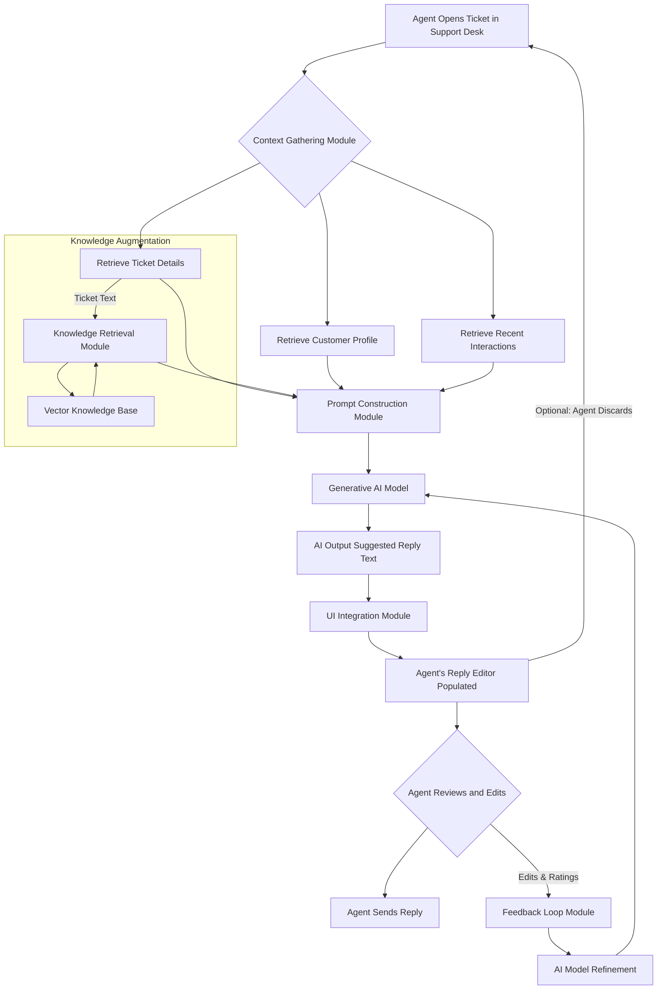
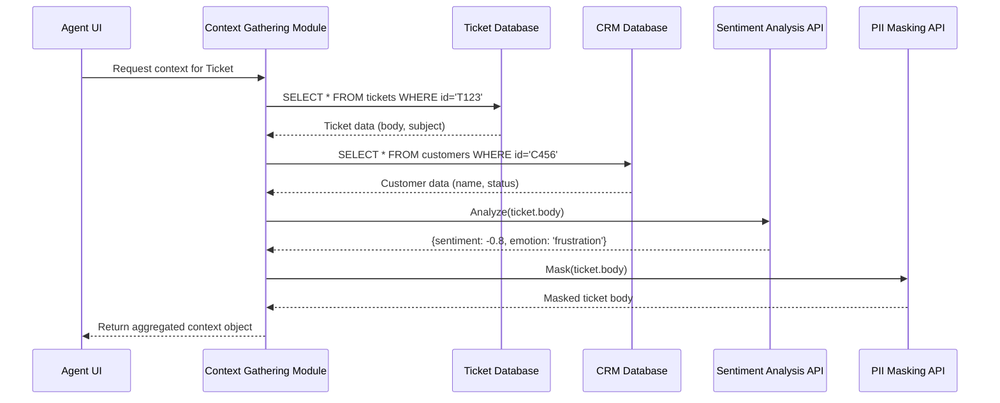
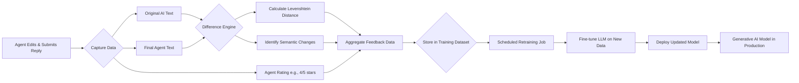
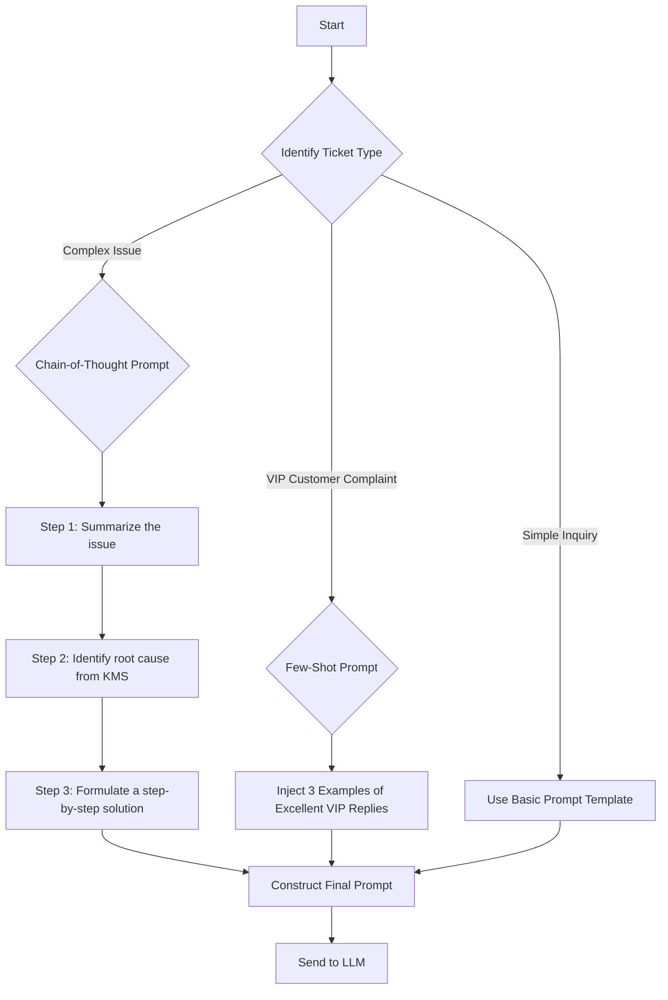
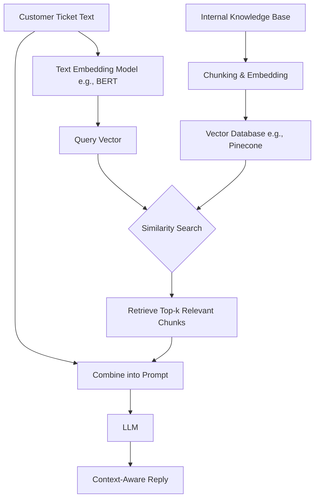
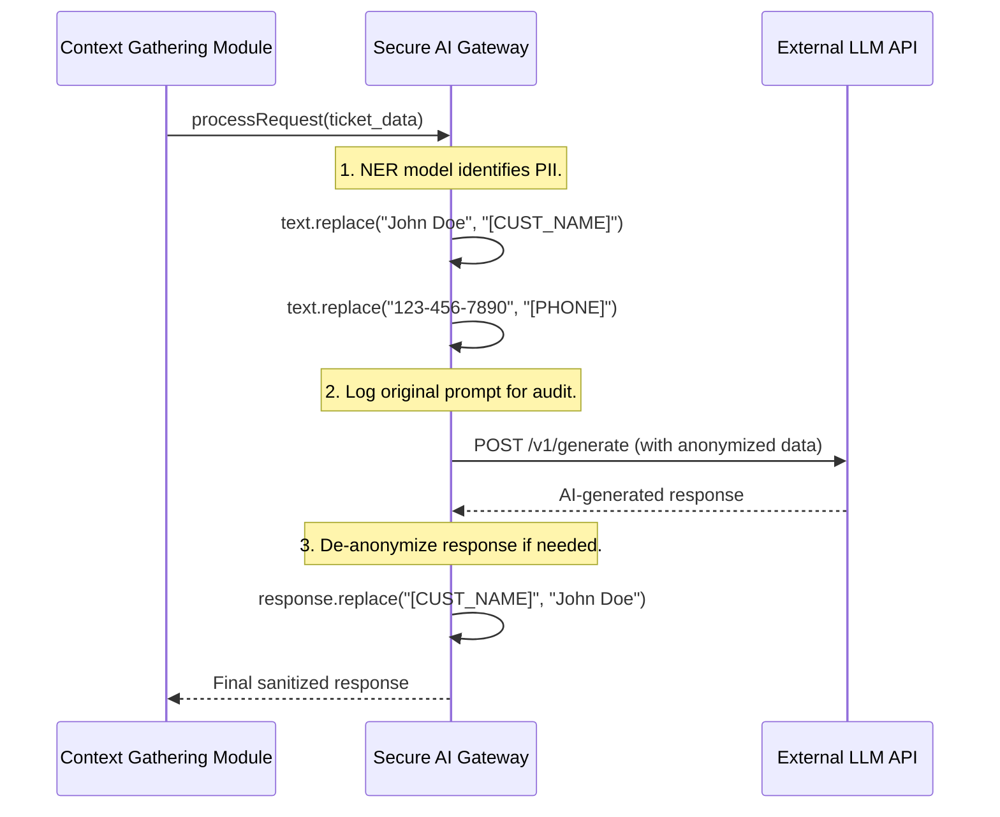
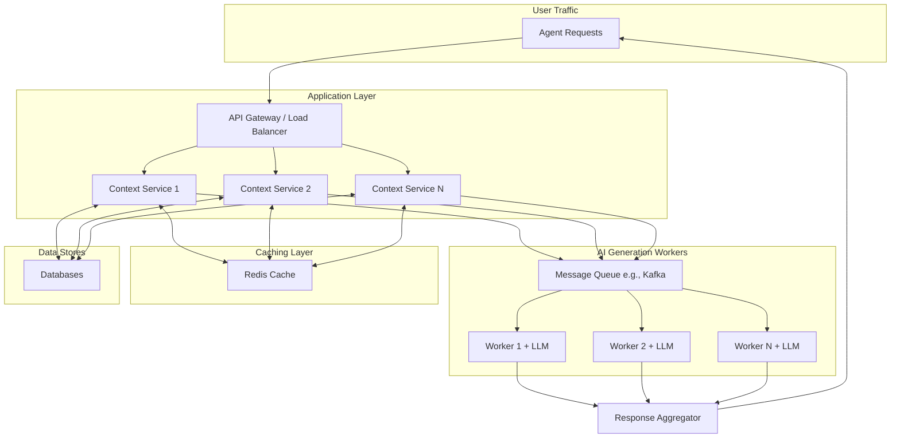
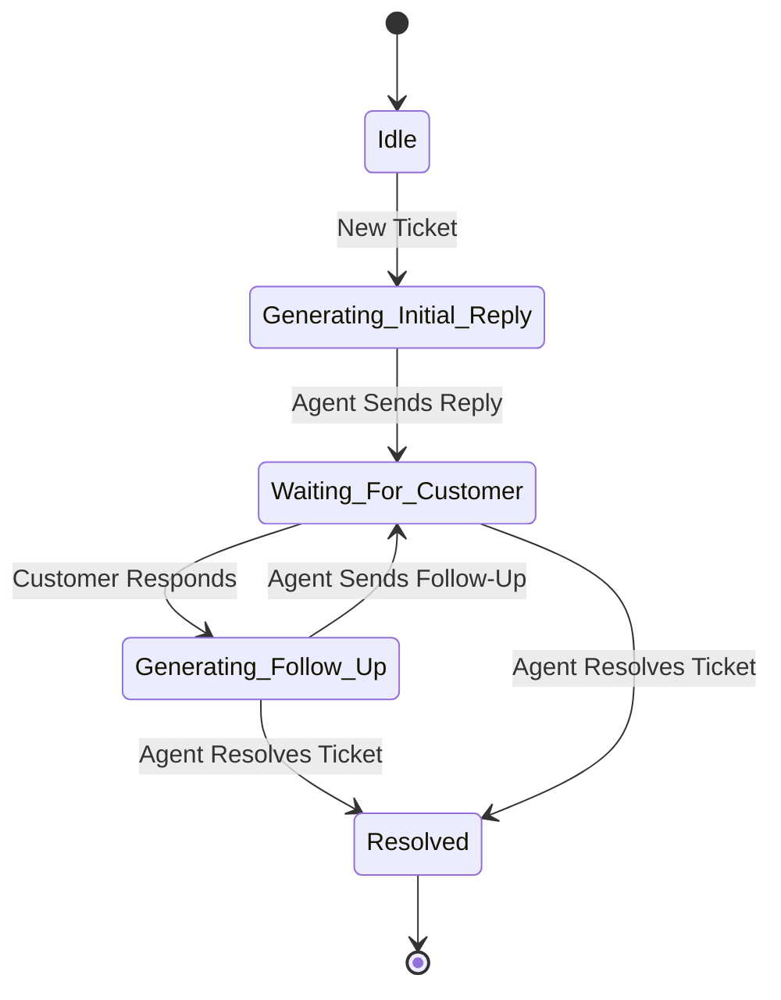
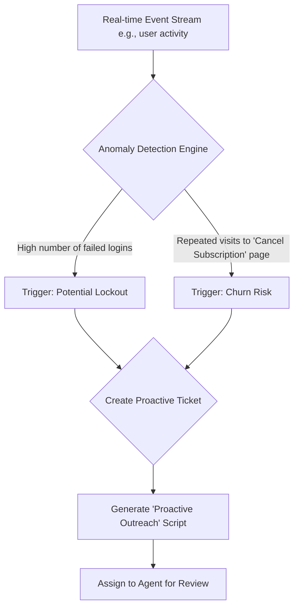
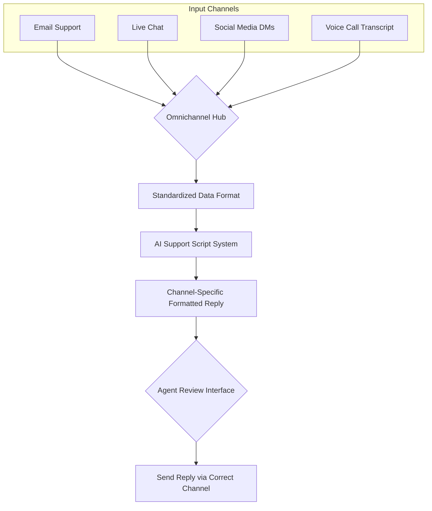

**FACT HEADER - NOTICE OF CONCEPTION**

**Conception ID:** DEMOBANK-INV-063
**Title:** System and Method for Generating Personalized Customer Support Scripts
**Date of Conception:** 2024-07-26
**Conceiver:** The Sovereign's Ledger AI

**Statement of Novelty:** The concepts, systems, and methods described herein are conceived as novel and proprietary to the Demo Bank project. This document serves as a timestamped record of conception.

---

**Title of Invention:** System and Method for Generating Personalized Customer Support Scripts

**Abstract:**
A system for assisting customer support agents is disclosed. When an agent opens a support ticket, the system retrieves the customer's profile, recent activity, sentiment, and the ticket's subject. This information is provided as context to a generative AI model, potentially augmented with real-time information from a vector knowledge base. The AI is prompted to generate a personalized opening script or a complete suggested reply for the agent. The script is tailored to the customer's specific issue and their history with the company, enabling agents to provide faster, more empathetic, and more effective support. A continuous feedback loop based on agent edits and ratings is used to systematically refine the AI model, ensuring its suggestions improve over time.

**Background of the Invention:**
Customer support agents often rely on generic, static scripts, which can sound impersonal and may not address the customer's specific context. Tailoring each response manually is time-consuming, especially in a high-volume support desk. This leads to increased Average Handle Time (AHT), lower First Contact Resolution (FCR), and decreased Customer Satisfaction (CSAT). There is a significant and unmet need for a tool that can instantly provide agents with a highly personalized, context-aware, and accurate starting point for their customer conversations, while also learning and adapting from agent expertise.

**Brief Summary of the Invention:**
The present invention, the "AI Suggested Reply" feature, is integrated into a support desk interface. When an agent views a ticket, the system automatically compiles a contextual prompt for a large language model (LLM). The prompt includes the customer's message, their account status (e.g., "VIP Customer"), their recent support history, and relevant articles retrieved from an internal knowledge base. The AI is instructed to draft a helpful and empathetic reply. The generated text appears in the agent's reply editor, ready to be reviewed, edited, and sent. Agent edits are captured to create a feedback loop for continuous model fine-tuning.

**Detailed Description of the Invention:**
A support agent opens a ticket in the Support Desk module.
1.  **Context Gathering & Pre-processing:** The system automatically gathers and processes a rich set of data:
    *   **Ticket Data:** Subject ("Cannot connect my bank account"), Body ("I am trying to link my Chase account via Plaid but it keeps failing..."), Priority (High).
    *   **Customer Profile:** Name: John Doe, Status: VIP, Member since: 2022, Language: en-US.
    *   **Interaction History:** Last 3 support tickets, recent in-app activity (e.g., failed login attempts).
    *   **Sentiment Analysis:** An initial NLP model analyzes the ticket body and assigns a sentiment score (e.g., `Sentiment = -0.8` indicating high frustration).
    *   **PII Masking:** A security sub-module scans the ticket body and masks sensitive information, replacing "my account number is 12345" with "my account number is [ACCOUNT_NUMBER]".

2.  **Knowledge Retrieval (RAG):**
    *   The ticket's core issue, "Plaid connection failure for Chase," is converted into a vector embedding.
    *   This embedding is used to perform a similarity search against a pre-indexed vector database of the company's knowledge base.
    *   Top `k` relevant articles (e.g., "KB-123: Troubleshooting Plaid Issues," "KB-456: Common Chase Bank Errors") are retrieved.

3.  **Prompt Construction:** The system combines this data into a sophisticated, multi-part prompt for an LLM.
    **Prompt:**
    ```
    You are a helpful and empathetic customer support AI for Demo Bank.
    **ROLE:** Act as a seasoned, empathetic Demo Bank support agent.
    **TASK:** Draft a professional and helpful reply to the customer's message.
    **CONSTRAINTS:**
    - Do not offer refunds.
    - Keep the reply under 150 words.
    - Acknowledge the customer's VIP status and high-frustration sentiment.
    - Offer a clear, actionable next step based on the provided knowledge base articles.

    **CONTEXT:**
    - Customer Name: John Doe
    - Customer Status: VIP
    - Customer Sentiment Score: -0.8 (Very Negative)
    - Customer's Message: "I am trying to link my Chase account via Plaid but it keeps failing..."
    - Relevant Knowledge Base Snippet (from KB-123): "Plaid connections to Chase may experience intermittent issues. Ask the user to try an incognito window to rule out cookie/cache problems."

    **DRAFT REPLY:**
    ```
4.  **AI Generation:** The LLM processes the rich prompt and generates a personalized response.
    **AI Output:**
    `Hi John,

    Thank you for reaching out, and I'm very sorry to hear about the frustration you're experiencing while trying to connect your Chase account. As a valued VIP member, getting this resolved for you is our top priority.

    These connection issues can sometimes be caused by browser cache. As a first step, could you please try the linking process one more time using an incognito or private browser window? This often resolves the problem right away.

    If it still doesn't work, please let us know the exact error message you see, and we'll escalate this for immediate technical investigation.

    We'll be standing by to help.

    Best,
    [Agent Name]`
5.  **UI Integration & Agent Action:** This generated text is automatically populated into the reply text box in the agent's UI. The agent can then quickly review, edit if needed, and send it to the customer.

**System Architecture and Data Flows:**

**Chart 1: High-Level System Architecture**


**Chart 2: Detailed Context Gathering Flow**


**Chart 3: Feedback Loop and Model Retraining Pipeline**


**Chart 4: Advanced Prompt Engineering Logic**


**Chart 5: Retrieval-Augmented Generation (RAG) Process**


**Chart 6: Security and Data Anonymization Flow**


**Chart 7: Scalability & High-Availability Architecture**


**Chart 8: Multi-turn Conversation State Machine**


**Chart 9: Proactive Support Triggering Logic**


**Chart 10: Omnichannel Integration Hub**


**Feedback Loop and Continuous Improvement:**
A critical component for sustained high performance is the feedback loop. When an agent receives an AI-generated script, they have the option to edit it before sending. These edits are not merely discarded; they are captured and analyzed by a dedicated `Feedback Loop Module`.
1.  **Edit Capture:** The system records the original AI output (`R_ai`) and the agent's final edited version (`R_agent`).
2.  **Difference Analysis:** A comparison algorithm (e.g., Levenshtein distance, BLEU score) identifies the specific changes made by the agent. This could include additions, deletions, rephrasing, or tone adjustments.
3.  **Agent Rating:** Agents are prompted to provide a quick rating on the AI's suggestion (e.g., a Likert scale from 1-5) and optional qualitative tags (e.g., "Wrong Tone," "Incorrect Info," "Helpful").
4.  **Model Retraining Data:** The triplet (`Prompt`, `R_ai`, `R_agent`) combined with the agent rating forms a high-quality preference dataset. This is used for techniques like Direct Preference Optimization (DPO) or Reinforcement Learning from Human Feedback (RLHF) to fine-tune the `Generative AI Model`. This continuous improvement ensures the AI's suggestions remain relevant, accurate, and aligned with company policy and evolving customer needs.

**Advanced Prompt Engineering Strategies:**
Beyond basic context inclusion, the `Prompt Construction Module` employs sophisticated strategies to maximize AI effectiveness:
*   **Role-Playing Instruction:** Instructing the AI to "Act as a seasoned, empathetic Demo Bank support agent."
*   **Constraint-Based Generation:** Specifying negative constraints, such as "Do not offer refunds unless explicitly approved by a supervisor," or positive constraints like "Must include a reference to Knowledge Base article KB-123."
*   **Few-Shot Learning:** Including examples of ideal previous interactions or replies within the prompt to guide the AI's style and content. For example, providing a sample "VIP customer apology" can significantly improve the AI's ability to tailor responses for high-value customers.
*   **Chain-of-Thought (CoT):** For complex diagnostic issues, the prompt instructs the model to first "think" step-by-step to analyze the problem, identify potential causes, and then formulate a solution before writing the final reply.
*   **Knowledge Base Integration Directives:** Instructing the AI to reference specific internal knowledge base articles, e.g., "Refer to KB Article ID 123 for details on account linking issues."
*   **Sentiment Analysis Pre-processing:** Before constructing the prompt, an initial pass of the customer's message can determine their sentiment. The prompt can then instruct the AI to "Respond with extra empathy" if sentiment is negative, or "Maintain a professional, reassuring tone."
*   **Dynamic Variable Insertion:** The system can dynamically insert variables from the customer profile or ticket data directly into the prompt structure, ensuring relevant details like "John Doe's VIP status" or "Chase account issue" are precisely communicated to the AI.

**Integration with Knowledge Management Systems:**
To further enhance the accuracy and helpfulness of AI-generated scripts, the system integrates seamlessly with Demo Bank's internal `Knowledge Management System` (KMS) using a Retrieval-Augmented Generation (RAG) architecture.
1.  **Vectorization:** All KMS articles are chunked into smaller segments and converted into high-dimensional vector embeddings using a sentence-transformer model. These are stored in a specialized vector database.
2.  **Contextual Search:** When a ticket is opened, the `Context Gathering Module` embeds the customer's query and performs a cosine similarity search against the vector database to find the most relevant KMS chunks.
3.  **Prompt Augmentation:** Key snippets from these top-ranked KMS articles are then included in the prompt provided to the `Generative AI Model`. This grounds the AI's response in factual, up-to-date information, dramatically reducing the risk of "hallucinations" and ensuring that suggested solutions are compliant with bank procedures.

**Scalability and Performance Considerations:**
For a high-volume support operation, the system must be highly scalable and performant.
*   **Asynchronous AI Calls:** AI generation requests are handled asynchronously via a message queue (e.g., Kafka) to prevent UI blocking, ensuring agents experience no lag.
*   **Caching Mechanisms:** A distributed cache (e.g., Redis) is used for customer profiles, recent interactions, and common KMS query results to reduce latency and database load.
*   **Load Balancing:** The `Generative AI Model` component is deployed as a set of containerized microservices managed by Kubernetes, with robust load balancing to distribute requests efficiently.
*   **Tiered AI Models:** A router can direct requests to different models based on urgency. A smaller, faster, distilled model for simple FAQs (`m_small`), and a larger, more powerful model for complex or VIP tickets (`m_large`).
*   **Infrastructure as Code (IaC):** Deployment and scaling are managed via Terraform and Ansible, allowing for automated, repeatable, and elastic infrastructure management.

**Security, Privacy, and Data Governance:**
Handling sensitive customer financial data requires stringent security measures.
*   **Data Masking and Anonymization:** A dedicated PII detection model (e.g., a fine-tuned NER model) identifies and masks sensitive data before it is sent to any external or internal AI model.
*   **Secure AI Gateway:** All traffic to the LLM passes through a gateway that enforces security policies, logs requests for auditing, and manages API keys securely.
*   **Access Controls:** Strict role-based access controls (RBAC) are enforced. The `Context Gathering Module` has read-only access to necessary data stores, governed by the principle of least privilege.
*   **Data Minimization:** Only the essential data required for prompt construction is extracted and used. The prompt context is ephemeral and not stored long-term by the LLM.
*   **Auditing and Logging:** All interactions with the AI model, including anonymized prompts and responses, are logged for auditing, compliance, and debugging.
*   **Compliance with Regulations:** The system is designed for compliance with GDPR, CCPA, and PCI DSS. Data residency is handled by deploying regional stacks.

**Mathematical and Algorithmic Framework:**

The system's operation is underpinned by a formal mathematical framework.

1.  **Context Representation:** Let the context `C` for a ticket `T` be a feature vector:
    `C_T = [V(T_{body}), U_{profile}, H_{interaction}, S_{sentiment}, K_{rag}]` (Eq. 1)
    where `V` is an embedding function, `U` is customer profile data, `H` is interaction history, `S` is the sentiment score, and `K` is retrieved knowledge.

2.  **AI Model as a Probability Distribution:** The generative model `G_θ` with parameters `θ` learns a conditional probability distribution over reply sequences `R`.
    `P(R | C_T; θ) = Π_{i=1}^{|R|} P(r_i | r_{1...i-1}, C_T; θ)` (Eq. 2)

3.  **Fine-Tuning Objective Function (Cross-Entropy Loss):** During supervised fine-tuning, we minimize the negative log-likelihood of the agent-approved replies `R*`.
    `L_{SFT}(θ) = -E_{(C, R*)∼D} [log P(R* | C; θ)]` (Eq. 3)

4.  **Preference Modeling (DPO):** In the feedback loop, we use Direct Preference Optimization. Given a prompt `C`, an agent-preferred response `R_w` and a rejected AI response `R_l`, the loss function is:
    `L_{DPO}(θ; θ_{ref}) = -E_{(C,R_w,R_l)∼D} [log σ(β * log(P(R_w|C;θ)/P(R_w|C;θ_{ref})) - β * log(P(R_l|C;θ)/P(R_l|C;θ_{ref})))]` (Eq. 4-10)
    where `θ_{ref}` is the reference model, `β` is a temperature parameter, and `σ` is the sigmoid function.

5.  **Retrieval-Augmented Generation (RAG) Similarity:** The relevance `Rel(Q, K_j)` of a knowledge chunk `K_j` to a query `Q` is calculated using cosine similarity on their vector embeddings `v_Q` and `v_{K_j}`.
    `Rel(Q, K_j) = cos(θ) = (v_Q ⋅ v_{K_j}) / (||v_Q|| ||v_{K_j}||)` (Eq. 11-20)
    The retrieved context is `K_{rag} = {K_j | Rel(Q, K_j) > τ}` for some threshold `τ`. (Eq. 21)

6.  **Sentiment Analysis:** The sentiment score `S` is calculated using a pre-trained model `M_senti`.
    `S = M_{senti}(T_{body})`, where `S ∈ [-1, 1]` (Eq. 22-25)

7.  **Performance Metrics Formalization:**
    *   Average Handle Time (AHT): `AHT = (1/N) * Σ_{i=1}^{N} (t_{end,i} - t_{start,i})` (Eq. 26-30)
    *   First Contact Resolution (FCR): `FCR = (Tickets_Resolved_First_Reply / Total_Tickets) * 100%` (Eq. 31-35)
    *   Customer Satisfaction (CSAT): `CSAT = (Σ_{i=1}^{N} score_i) / N`, `score_i ∈ [1, 5]` (Eq. 36-40)
    *   AI Acceptance Rate (AAR): `AAR = (Tickets_with_Unedited_AI_Reply / Total_Tickets_with_AI_Reply) * 100%` (Eq. 41-45)
    *   Edit Distance (Levenshtein): `d(R_{ai}, R_{agent})` measures the number of edits. A lower average `d` is better. (Eq. 46-50)

8.  **Queuing Theory for System Load:** We model the agent pool as an M/M/c queue.
    *   Arrival rate: `λ` (tickets/hour)
    *   Service rate: `μ = 1 / AHT` (tickets/hour/agent)
    *   Number of agents: `c`
    *   System utilization: `ρ = λ / (c * μ)` (Eq. 51-60)
    *   Probability of a ticket having to wait: `P_w = ( (cρ)^c / c! ) * (1 / (1-ρ)) * P_0` (Erlang C formula) (Eq. 61-70)
    *   Where `P_0 = [ Σ_{n=0}^{c-1} ((cρ)^n / n!) + ((cρ)^c / c!) * (1/(1-ρ)) ]^{-1}` (Eq. 71-80)

9.  **Economic Impact Model:**
    *   Cost Savings `S_c = N_{agents} * (AHT_{old} - AHT_{new}) * Cost_{agent_hr}` (Eq. 81-85)
    *   Value of Increased Retention `V_r = N_{customers} * (ChurnRate_{old} - ChurnRate_{new}) * CustomerLifetimeValue` (Eq. 86-90)
    *   Return on Investment (ROI): `ROI = (S_c + V_r - Cost_{system}) / Cost_{system}` (Eq. 91-100)

**Ethical Considerations and Bias Mitigation:**
1.  **Data Bias:** The model is trained on historical support data, which may contain biases. The system includes a bias detection module that audits AI outputs for demographic, gender, or racial bias using fairness metrics.
2.  **Agent De-skilling:** Over-reliance on the AI could lead to agent de-skilling. The system is positioned as an "assistant" or "co-pilot," not a replacement. Training emphasizes critical thinking and using the AI suggestion as a starting point.
3.  **Transparency:** Agents are always aware that the text is AI-generated and have full control to override it. The system's suggestions are explainable by tracing them back to the prompt and knowledge base articles used.
4.  **Error Handling:** In cases where the AI is uncertain or the query is outside its scope, it is programmed to generate a response that escalates the issue to a human expert or asks for clarification, rather than guessing.

**Claims:**
1. A method for assisting a customer support agent, comprising:
   a. Receiving data associated with a customer support ticket, including the customer's message and profile information.
   b. Providing the data as context to a generative AI model.
   c. Prompting the model to generate a personalized communication script or reply.
   d. Displaying the generated script to the agent within a support interface.
2. The method of claim 1, wherein the customer's profile information includes their account status or history, and the prompt instructs the model to tailor the tone of the script accordingly.
3. The method of claim 1, further comprising capturing an agent's edits to the generated script and using the difference between the original script and the edited script as training data to fine-tune the generative AI model.
4. The method of claim 3, wherein an agent-provided quality rating is captured alongside the edited script to create a preference dataset for model optimization techniques such as Direct Preference Optimization (DPO).
5. The method of claim 1, further comprising performing a semantic search on an internal knowledge base using the customer's message, and augmenting the context provided to the AI model with retrieved information to ensure factual accuracy.
6. The method of claim 1, further comprising a pre-processing step wherein Personally Identifiable Information (PII) within the ticket data is identified and masked before being provided as context to the AI model.
7. The method of claim 1, wherein the prompt construction is dynamic, employing techniques such as few-shot learning by injecting examples of high-quality responses or chain-of-thought instructions for complex problem-solving.
8. The method of claim 1, further comprising analyzing the sentiment of the customer's message and instructing the AI model to adjust its level of empathy based on the detected sentiment.
9. A system comprising a tiered architecture of generative AI models, wherein a routing module directs simple inquiries to a smaller, faster model and complex inquiries to a larger, more capable model to optimize computational resource usage and response latency.
10. The method of claim 1, further comprising analyzing real-time user activity streams to proactively detect potential customer issues and automatically generating a support ticket and a suggested outreach script for an agent's review.

**Metrics for Success and Monitoring:**
*   **Agent Efficiency:**
    *   `Average Handle Time` (AHT) reduction: Target a 15-25% reduction.
    *   `First Contact Resolution` (FCR) rate: Target a 5-10% increase.
    *   `Response Time` improvement: Target a 30% reduction in time-to-first-reply.
*   **Customer Satisfaction:**
    *   `Customer Satisfaction Score` (CSAT): Target a sustained score above 4.5/5.
    *   `Net Promoter Score` (NPS): Monitor for positive trend correlation with system deployment.
*   **AI Performance:**
    *   `AI Acceptance Rate`: Target >70% of suggestions used with zero or minor edits.
    *   `Average Edit Distance`: Monitor the Levenshtein distance between suggestions and final replies, aiming for a continuous decrease.
    *   `Model Latency`: Ensure 95th percentile (P95) response time remains under 2 seconds.
*   **Operational Cost Savings:** Reduced training time for new agents, and a calculated increase in agent capacity (tickets per agent per day).

**Future Enhancements and Roadmap:**
1.  **Multi-turn Conversation AI:** Evolve the system from single-reply generation to a real-time conversational assistant that provides suggestions throughout an entire back-and-forth interaction, maintaining state and context.
2.  **Proactive Support:** Expand anomaly detection to identify customers struggling with product features in real-time and suggest proactive, targeted support outreach before they file a ticket.
3.  **Personalized Offers and Upsells:** With strict business rules and agent approval, leverage customer data to suggest relevant product offers or upgrades within the support context, turning a support interaction into a value-add opportunity.
4.  **Omnichannel Support:** Fully deploy the AI support script engine across all communication channels, including live chat, email, social media, and in-app messaging, ensuring a consistent and high-quality brand voice.
5.  **Voice-to-Text Integration:** For call centers, integrate with real-time voice-to-text transcription services to provide agents with live suggestions and knowledge base articles during phone conversations.
6.  **Agent-Specific Fine-Tuning:** Develop personalized models for individual agents by fine-tuning a base model on their specific historical edits and writing style, creating a truly personal AI co-pilot.