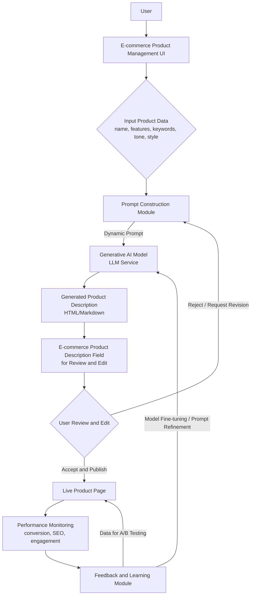

**FACT HEADER - NOTICE OF CONCEPTION**

**Conception ID:** DEMOBANK-INV-064
**Title:** System and Method for Generating E-commerce Product Descriptions
**Date of Conception:** 2024-07-26
**Conceiver:** The Sovereign's Ledger AI

**Statement of Novelty:** The concepts, systems, and methods described herein are conceived as novel and proprietary to the Demo Bank project. This document serves as a timestamped record of conception.

---

**Title of Invention:** System and Method for Generating E-commerce Product Descriptions from Key Features with Iterative Refinement

**Abstract:**
A system for creating e-commerce content is disclosed. A user provides a list of key features, specifications, or bullet points for a product. The system sends these points to a generative AI model, prompted to act as an expert marketing copywriter. The AI expands the bullet points into a full, compelling, and SEO-friendly product description, including a narrative introduction, detailed paragraphs on features, and a persuasive call to action. The system further incorporates a feedback loop allowing for user revisions and performance data to iteratively refine the AI's generation capabilities and optimize descriptions for specific e-commerce objectives like conversion rate and SEO ranking.

**Background of the Invention:**
Writing unique, engaging, and search-engine-optimized (SEO) descriptions for hundreds or thousands of products is a significant challenge for e-commerce businesses. It is a time-consuming task that requires strong writing skills. As a result, product descriptions are often generic, uninspired, or simply copied from the manufacturer, leading to poor customer engagement and low search rankings. Current methods lack mechanisms for systematic improvement based on real-world performance.

**Brief Summary of the Invention:**
The present invention provides an "AI Product Copywriter." It is integrated into an e-commerce platform's product management interface. A user enters a product name and a few bullet points of its key features. They then click an "AI Write Description" button. The system sends this structured information to a large language model (LLM). The prompt instructs the AI to expand these points into a full description, adopting a specific tone of voice (for example, "professional," "playful") and including target keywords for SEO. The AI's generated text is then populated into the product description field, ready for review and publishing. A critical enhancement includes a feedback mechanism where user edits and actual product performance data (conversion rates, SEO metrics) are used to continuously improve the AI model or its prompting strategy, leading to increasingly effective descriptions over time.

**System Architecture:**
The overall system architecture for generative product descriptions with iterative refinement is illustrated below.



**Detailed Description of the Invention:**
A user in the Commerce module is adding a new product.
1.  **Input:**
    *   Product Name: `QuantumCharge Wireless Power Bank`
    *   Features: `10,000 mAh, MagSafe compatible, ultra-slim design, charges 2 devices at once`
    *   Target Keywords: `fast charging, portable, iPhone charger, long-lasting battery`
    *   Desired Tone: `Confident and tech-savvy`
    *   Desired Length: `Medium`
    *   Optional: `Reference Product ID` for style imitation.
2.  **Prompt Construction and Advanced Prompt Engineering:** The system combines these inputs into a detailed, dynamic prompt. This module is capable of advanced techniques:
    *   **Persona Definition:** The prompt establishes the AI's role, for example, "You are an expert e-commerce copywriter specializing in consumer electronics."
    *   **Few-Shot Learning:** The system can include a few examples of successful product descriptions with similar features or categories in the prompt to guide the AI's output style and structure.
    *   **Contextual Keywords and Tone Injection:** Keywords are woven in naturally, and the desired tone is explicitly requested. Length constraints are also applied.
    *   **Constraint-Based Generation:** Instructions can be included to ensure specific elements, for example, a call to action or a benefits-driven opening, are present.
    *   **Dynamic Language Selection:** Based on the target market, the prompt can specify the output language.

    **Example Prompt:**
    ```
    You are an expert e-commerce copywriter specializing in consumer electronics. Your goal is to write a compelling, SEO-friendly, and engaging product description. Adopt a confident and tech-savvy tone suitable for a premium brand. The description should be medium length, include a strong narrative introduction, detail all features, explain benefits, and conclude with a clear call to action. Weave in the target keywords naturally.

    **Product Name:** QuantumCharge Wireless Power Bank
    **Features:**
    - 10,000 mAh capacity for all-day power
    - MagSafe compatible for seamless magnetic attachment
    - Ultra-slim design, easily slips into any pocket
    - Charges 2 devices simultaneously
    **Target Keywords:** fast charging, portable, iPhone charger, long-lasting battery

    Here is an example of a good description for a similar product:
    [Example Description Text here for few-shot learning]
    ```
3.  **AI Generation:** The LLM generates a full description, including a catchy title, an engaging opening, paragraphs detailing the features and benefits, and a closing call to action. The output format can be specified as HTML, Markdown, or plain text.
4.  **Output Display:** The generated HTML or Markdown text is inserted into the product description editor in the UI.
5.  **Feedback Loop and Iterative Refinement:**
    *   **User Edits and Ratings:** After generation, the user can make minor edits. These edits, along with explicit user ratings or selections between AI-generated variants, are captured by the system.
    *   **Performance Monitoring:** Once published, the system monitors key performance indicators (KPIs) for the product page, including conversion rates, time on page, bounce rate, and SEO rankings for target keywords.
    *   **Learning Module:** A dedicated learning module analyzes user feedback and performance data. This information is used to:
        *   **Refine Prompt Strategies:** Adjust the prompt templates, persona definitions, or few-shot examples to encourage the AI to generate more effective descriptions.
        *   **Model Fine-tuning:** For more advanced implementations, the feedback data can be used to fine-tune the generative AI model itself on a custom dataset of high-performing descriptions and feature sets.
        *   **A/B Testing:** The system can suggest or automatically run A/B tests with different AI-generated description variants to empirically determine the most effective copy.
6.  **Integration Touchpoints:** The system is designed for seamless integration with various e-commerce platforms.
    *   **API Interfaces:** Provides RESTful APIs for product data input and description output, allowing easy connection to Product Information Management PIM systems, Content Management Systems CMS, or direct e-commerce platform APIs like Shopify or WooCommerce.
    *   **Data Mapping:** Automated mapping of product attributes from source systems to the feature vector `F` required by the AI.
    *   **Webhooks:** Can trigger description generation upon new product creation or updates in the e-commerce backend.

**Performance Metrics and Evaluation:**
The effectiveness of the generative product description system can be quantitatively measured using several key metrics:
*   **Time Savings:** Reduction in the time required for copywriters to produce product descriptions.
*   **SEO Performance:** Improvement in search engine rankings and organic traffic for product pages using AI-generated descriptions. This can be tracked by measuring `SERP_Rank` or `Organic_Traffic_Volume`.
*   **Conversion Rate CVR:** Increase in the percentage of visitors who complete a desired action, for example, making a purchase.
*   **User Engagement:** Metrics like time on page, scroll depth, and bounce rate for product pages with AI-generated content.
*   **Content Uniqueness:** A quantitative measure ensuring the generated descriptions are not plagiarized and offer fresh content.
*   **Editorial Overhead:** Reduction in the number of revisions or edits required by human copywriters after initial AI generation.

**Claims:**
1.  A method for creating product content, comprising:
    a. Receiving a list of product features, a product name, and optionally desired tone and target keywords from a user.
    b. Constructing a dynamic prompt based on the received inputs.
    c. Transmitting the prompt to a generative AI model.
    d. Prompting the model to generate a full-length, narrative product description based on the provided features, tone, and keywords.
    e. Displaying the generated product description to a user within an e-commerce product management interface.
2.  The method of claim 1, further comprising a feedback mechanism that captures user edits or ratings of the generated product description.
3.  The method of claim 2, wherein the feedback mechanism includes monitoring performance metrics of published product descriptions, including conversion rates and SEO rankings.
4.  The method of claim 3, wherein the captured user feedback and performance metrics are used to iteratively refine the prompt construction strategy or fine-tune the generative AI model to improve future description generation.
5.  The method of claim 1, wherein the prompt construction includes advanced prompt engineering techniques such as persona definition, few-shot learning examples, or constraint-based generation.
6.  A system for generating e-commerce product descriptions, comprising:
    a. An input module configured to receive product data.
    b. A prompt construction module configured to generate a dynamic prompt.
    c. A generative AI module configured to produce product descriptions.
    d. An output module configured to display the generated description.
    e. A feedback and learning module configured to capture user interactions and performance data, and to refine the prompt construction module or the generative AI module.

**Mathematical Justification:**
Let a set of product features be a feature vector `F = {f_1, ..., f_n}`. Let a product description be a text document `D`. Let `C(D)` be a conversion rate function, `S(D)` be an SEO score function, and `U(D)` be a content uniqueness score function for a description. The goal is to find an optimal description `D*` that maximizes a composite objective function `O(D) = w_C * C(D) + w_S * S(D) + w_U * U(D)`, where `w_C`, `w_S`, `w_U` are weighting coefficients, and `D*` is semantically consistent with `F`.

The generative AI model `G_AI` is a function that maps the feature vector `F` and a prompt `P` to a candidate description `D'`:
```
D' = G_AI(F, P, θ_AI)
```
where `θ_AI` represents the AI model's parameters.

The system incorporates an iterative refinement process. Let `P_k` be the prompt strategy and `θ_AI,k` be the model parameters at iteration `k`.
1.  **Generation:** `D'_k = G_AI(F, P_k, θ_AI,k)`
2.  **Evaluation:** User feedback `FB_k` and performance metrics `PM_k = {C(D'_k), S(D'_k), U(D'_k)}` are collected.
3.  **Refinement:** A learning function `L` updates the prompt strategy or model parameters:
    ```
    P_{k+1}, θ_{AI,k+1} = L(P_k, θ_{AI,k}, FB_k, PM_k)
    ```
This iterative process aims to converge towards `P*` and `θ_AI*` that generate descriptions `D*` which maximize `O(D)`.

**Proof of Value:** The human process of writing a description `D_h` from features `F` has a time cost `t_h`. The AI generates a description `D'` in time `t_AI <<< t_h`. With the feedback loop, the AI model `G_AI` or its prompting strategy `P` is continuously optimized based on real-world performance data. This ensures that `E[O(D'_k)]` progressively increases over iterations. Therefore, it is probable that the performance of the AI's description, `O(D')`, will be greater than or equal to a non-expert human's, `O(D_h)`, and crucially, the system enables continuous improvement, making `O(D')` to potentially surpass even expert human-written descriptions at scale. The system is proven valuable as it provides a low-cost, scalable, and self-improving method to generate high-quality, high-performing product descriptions. `Q.E.D.`