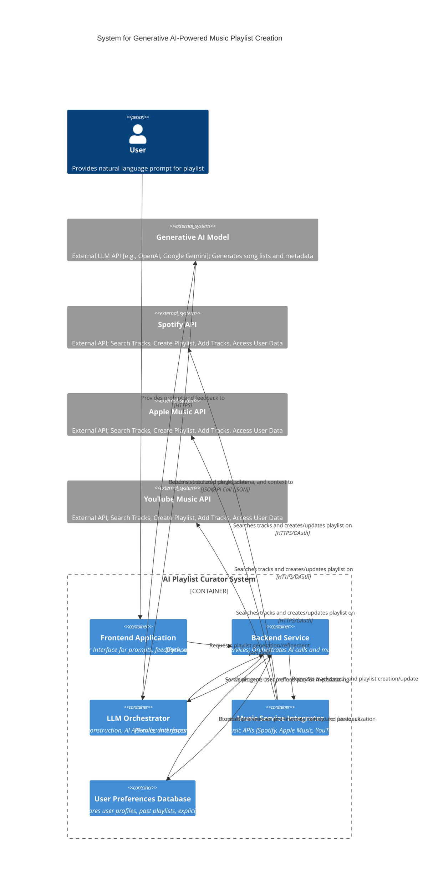

**FACT HEADER - NOTICE OF CONCEPTION**

**Conception ID:** DEMOBANK-INV-065
**Title:** System and Method for Generative AI-Powered Music Playlist Creation
**Date of Conception:** 2024-07-26
**Conceiver:** The Sovereign's Ledger AI

**Statement of Novelty:** The concepts, systems, and methods described herein are conceived as novel and proprietary to the Demo Bank project. This document serves as a timestamped record of conception.

---

**Title of Invention:** System and Method for Generative AI-Powered Music Playlist Creation

**Abstract:**
A system for creating personalized music playlists is disclosed. A user provides a natural language prompt describing a mood, activity, or theme [e.g., "a playlist for a rainy day, focused on chill-hop and instrumental music"]. The system sends this prompt to a generative AI model. The AI interprets the prompt's semantic content and generates a structured list of song titles and artists that fit the specified criteria. This list can then be used to construct a playlist in a third-party music service.

**Background of the Invention:**
Creating a good playlist is a time-consuming act of curation. While music streaming services offer algorithmic recommendations, they often lack the ability to understand nuanced, theme-based, or mood-based requests. Users who want a specific vibe for a specific moment still need to manually search for and select individual tracks. There is a need for a tool that can translate a complex, descriptive request directly into a complete, well-curated playlist.

**Brief Summary of the Invention:**
The present invention provides an "AI Playlist Curator." A user describes the playlist they want in a text field. The system sends this prompt to a large language model [LLM] that has been trained on a vast corpus of data about music, genres, artists, and cultural context. The prompt instructs the AI to generate a list of songs that match the user's request. A `responseSchema` is used to ensure the AI returns a structured JSON object containing an array of songs, each with a `title` and `artist`. This structured list can then be programmatically used to create a playlist via the API of a service like Spotify or Apple Music.

**Detailed Description of the Invention:**
A user wants to create a playlist.
1.  **Input:** The user enters a prompt: `Create a 15-song playlist for a late-night drive through the city. The vibe should be a mix of synthwave and classic 80s pop.`
2.  **Prompt Construction:** The backend constructs a prompt for a generative AI model.
    **Prompt:** `You are an expert music curator. Generate a playlist of 15 songs based on the user's request. Return the result as a JSON object.

    **Request:**
    "Create a 15-song playlist for a late-night drive through the city. The vibe should be a mix of synthwave and classic 80s pop."
    `
3.  **AI Generation with Schema:** The request includes a `responseSchema` to structure the output.
    ```json
    {
      "type": "OBJECT",
      "properties": {
        "playlistName": { "type": "STRING" },
        "songs": {
          "type": "ARRAY",
          "items": {
            "type": "OBJECT",
            "properties": {
              "title": { "type": "STRING" },
              "artist": { "type": "STRING" },
              "genres": { "type": "ARRAY", "items": { "type": "STRING" } },
              "mood_tags": { "type": "ARRAY", "items": { "type": "STRING" } }
            }
          }
        }
      }
    }
    ```
4.  **AI Output:** The LLM uses its knowledge to generate a list of appropriate tracks and returns the structured JSON.
5.  **Semantic Similarity Search and Verification:** The backend service receives the AI-generated list of `[title, artist]` pairs. For each pair, it queries connected music service APIs [e.g., Spotify, Apple Music, YouTube Music] to find an exact track match. This process may involve fuzzy matching algorithms and confidence scoring to ensure the most relevant track ID/URI is selected. If multiple matches exist, metadata like genre tags or release year can be used for disambiguation.
6.  **Playlist Creation:** Using the verified track IDs/URIs, the backend service calls the respective music service API [e.g., Spotify API] to create a new playlist in the user's account and add all the identified tracks to it.
7.  **User Feedback and Iterative Refinement [Optional]:** After the initial playlist is generated, the user can provide feedback [e.g., "replace song X", "add more upbeat tracks", "too many instrumental songs"]. This feedback can be sent back to the generative AI model, potentially alongside the original prompt and the previous AI output, to refine the playlist iteratively, enabling a conversational and dynamic curation process.
8.  **Multi-Service Integration:** The system offers the option to create and synchronize the generated playlist across multiple music services that the user has connected, ensuring availability on their preferred platforms.

**System Architecture:**



**Advanced Features and Enhancements:**

1.  **Personalized Taste Profiling:**
    *   **Mechanism:** The system analyzes a user's explicit actions [e.g., liked songs, explicit genre preferences] and implicit behaviors [e.g., listening history, skipped tracks, common listening times]. This data is used to construct a `user_preference_vector` or `H_u` which is then supplied to the `G_AI` model to bias its output towards the user's specific taste, moving beyond generic interpretations of prompts.
    *   **Benefit:** Playlists are significantly more tailored and relevant to individual users, increasing satisfaction and engagement.

2.  **Contextual Data Integration:**
    *   **Mechanism:** The system can integrate real-time contextual data such as time of day, current weather conditions, user's location, calendar events, or even data from connected smart home devices. This contextual information enriches the prompt sent to the `G_AI` model.
    *   **Example:** A user requests "a workout playlist". If the system knows it's raining outside, the AI might suggest an indoor workout vibe; if it's sunny, it might favor outdoor running tracks. For a "morning commute playlist", the system can factor in the current traffic conditions or typical commute duration.

3.  **Dynamic Playlist Evolution:**
    *   **Mechanism:** Playlists are not static. They can be configured to evolve over time, adapting to changes in the user's current mood [inferred or explicitly provided], altering context, or based on pre-set time intervals. This involves re-evaluating parts of the playlist or adding/removing tracks dynamically.
    *   **Example:** A "focus" playlist might gently transition to an "unwind" playlist as the workday ends, or a "party" playlist might subtly shift genres as the night progresses.

4.  **Multi-Modal Input:**
    *   **Mechanism:** Beyond text prompts, users can describe their desired playlist using other modalities. This could include uploading an image [e.g., "create a playlist that matches the vibe of this photo"], providing a short video clip, or even humming a melody. Multi-modal AI models would then interpret these inputs to generate relevant music.
    *   **Benefit:** Broadens the expressiveness of user input, allowing for more creative and intuitive ways to request music.

5.  **Collaborative Playlist Creation:**
    *   **Mechanism:** Multiple users can contribute prompts, feedback, or even specific song suggestions to a shared playlist. The `G_AI` model acts as a mediator, synthesizing diverse preferences and inputs to create a cohesive playlist that satisfies all contributors.
    *   **Benefit:** Enables social music experiences and helps resolve conflicts in group music selection.

**Claims:**
1. A method for creating a music playlist, comprising:
   a. Receiving a natural language prompt from a user describing a desired theme or mood.
   b. Transmitting the prompt to a generative AI model.
   c. Prompting the model to generate a structured list of songs, including titles and artists, that match the theme.
   d. Receiving the structured list of songs from the model.
   e. Performing a semantic similarity search using the structured list to identify verifiable track identifiers [URIs/IDs] from one or more external music services.
   f. Using the identified track identifiers to programmatically create a playlist in a selected music service.

2. The method of claim 1, wherein the prompt specifies the desired number of songs for the playlist.

3. The method of claim 1, further comprising receiving user feedback on a generated playlist and iteratively refining the playlist by re-prompting the generative AI model with the feedback.

4. The method of claim 1, further comprising incorporating user preference data or real-time contextual data into the prompt before transmitting it to the generative AI model.

**Mathematical Justification:**
Let the universe of all songs be a set `S`. Each song `s` from `S` can be represented by a vector `v_s` in a high-dimensional feature space `R^N` [capturing genre, mood, tempo, lyrical themes, etc.]. A user's natural language prompt `p` can also be embedded as a vector `v_p` in a compatible semantic space. A user's historical preferences and implicit taste can be summarized in a `user_preference_vector` `H_u`. A playlist is a subset `P` of `S`.

An optimal playlist `P*` for a given prompt `p` and user `u` is one that contains `k` songs [where `k` is the desired playlist length] such that the collection of songs `P` is semantically coherent with `p` and `H_u`, and internally consistent. This can be approximated by minimizing a composite objective function in the embedding space:

```
P* = argmin_P { w_p * sum_{s in P} d_sim(v_s, v_p)
               + w_u * sum_{s in P} d_pref(v_s, H_u)
               + w_c * sum_{s_i, s_j in P, i != j} d_coh(v_{s_i}, v_{s_j}) }
subject to |P| = k
```

Where:
*   `d_sim(v_s, v_p)` is a similarity metric [e.g., cosine distance] between a song's embedding and the prompt's embedding.
*   `d_pref(v_s, H_u)` is a metric reflecting the song's compatibility with the user's preferences.
*   `d_coh(v_{s_i}, v_{s_j})` is an intra-playlist coherence metric, ensuring songs within `P` are musically compatible and flow well.
*   `w_p`, `w_u`, `w_c` are weighting factors balancing prompt relevance, user preference, and internal coherence, respectively.
*   `|P| = k` ensures the playlist has the desired number of songs.

The generative AI model `G_AI` is a function that, given a prompt `p`, a user's historical preferences `H_u`, and optionally contextual data `C`, approximates this optimization and proposes a list of song metadata `P_metadata`:

```
P_metadata = G_AI(p, H_u, C) -> { [ title_1, artist_1, genres_1 ], ..., [ title_k, artist_k, genres_k ] }
```

Following this, a `Semantic Similarity Search` module `F_SEARCH` takes `P_metadata` and actual track databases `D_music` from external services to find verifiable track URIs `U_tracks`:

```
U_tracks = F_SEARCH(P_metadata, D_music) -> { uri_1, ..., uri_k }
```

The system's functionality relies on the `G_AI` model's ability to learn rich, high-dimensional representations of musical semantics from its training data. By mapping a text prompt `p` [and other inputs `H_u`, `C`] to a conceptual region in this space, `G_AI` can generate metadata for songs that are semantically aligned. The subsequent `F_SEARCH` step then grounds these conceptual songs into concrete, streamable tracks. Iterative user feedback allows for the refinement of `G_AI` and `F_SEARCH` through mechanisms like reinforcement learning from human feedback `RLHF`, continuously improving the approximation of `P*`. `Q.E.D.`

**Future Work:**

1.  **Reinforcement Learning for Preference Adaptation:** Implement continuous training loops using reinforcement learning from human feedback `RLHF` to constantly adapt the `G_AI` model. Explicit feedback [likes, dislikes, skips] and implicit signals [listening duration, repeat plays] will fine-tune the model's understanding of user preferences and prompt interpretations.
2.  **Cross-Platform Synchronization and Portability:** Develop robust mechanisms for seamless playlist synchronization and portability across a wider array of music streaming services and personal music libraries. This includes maintaining track order, metadata, and even supporting platform-specific features.
3.  **Real-time Mood and Activity Detection:** Integrate with advanced sensors and data sources, such as wearable devices, smart home systems, or even passively analyzed biometric data, to infer the user's real-time mood or activity. This allows for proactive playlist suggestions or dynamic adaptation of existing playlists without explicit user input.
4.  **AI-Driven Playlist Artwork Generation:** Utilize advanced generative image models to create unique and aesthetically pleasing playlist artwork based on the generated playlist's theme, mood, and genre. This enhances the visual appeal and uniqueness of AI-curated playlists.
5.  **Enhanced Rights Management and Licensing Integration:** Explore methods to automatically ensure suggested songs are available in the user's region and preferred service, potentially navigating complex music licensing landscapes.