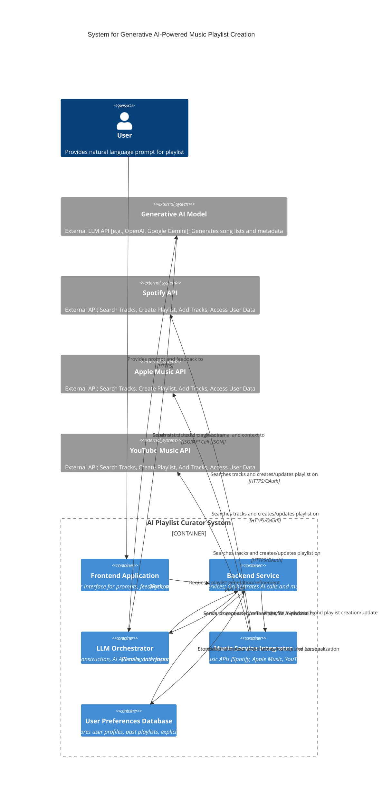
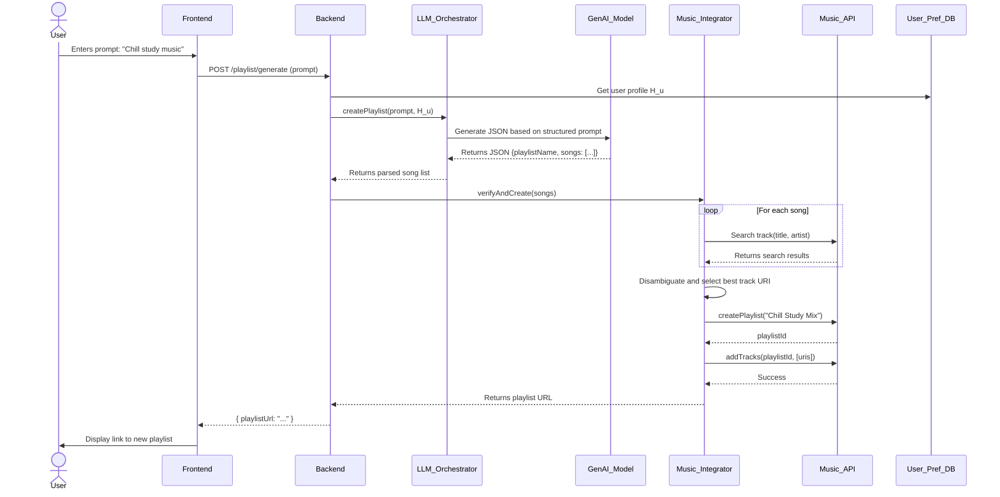
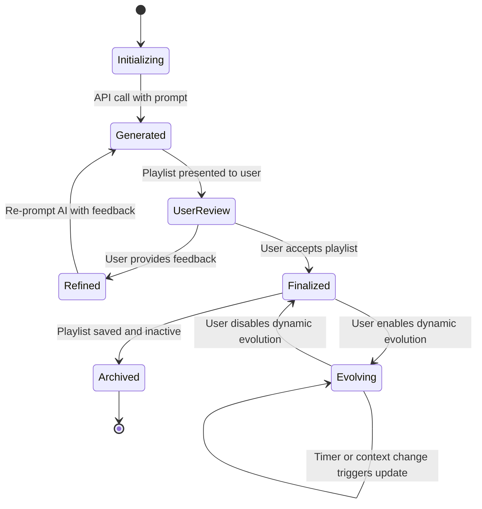
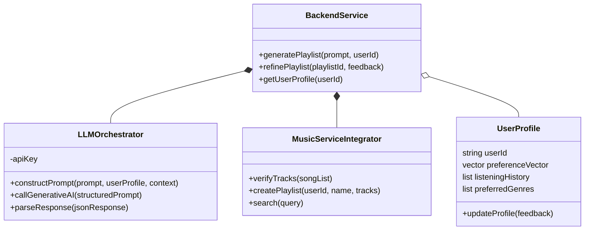
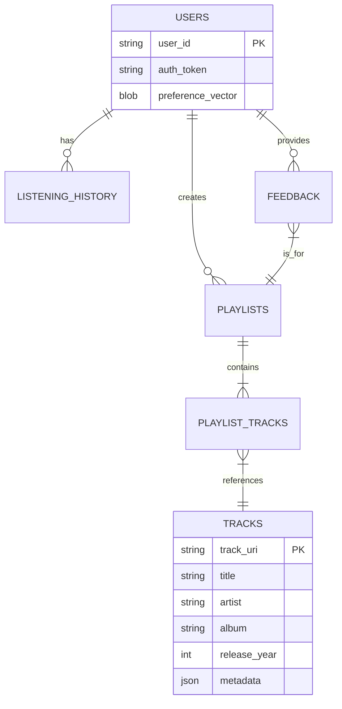
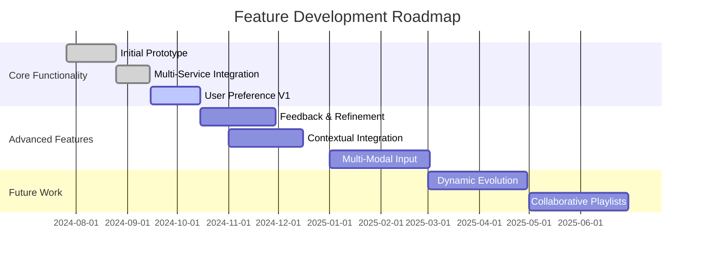
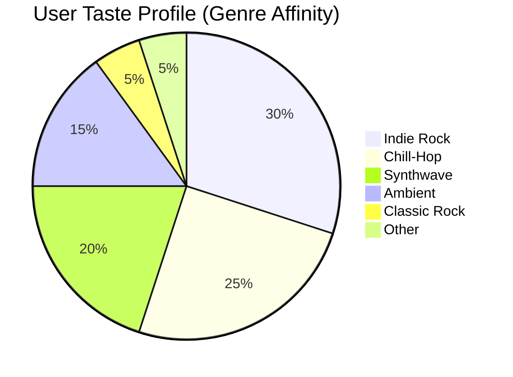
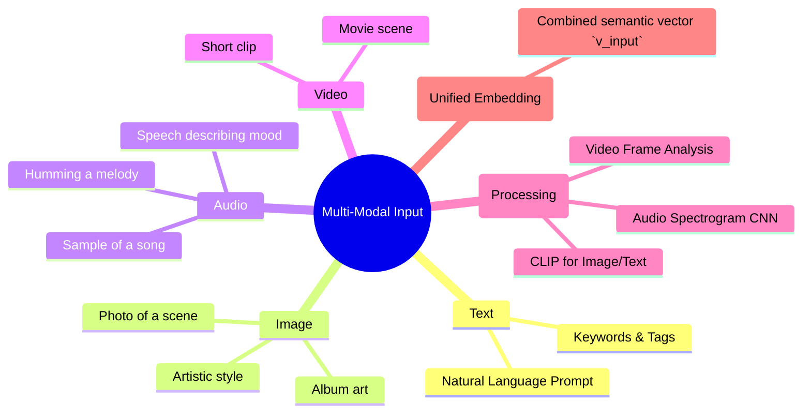
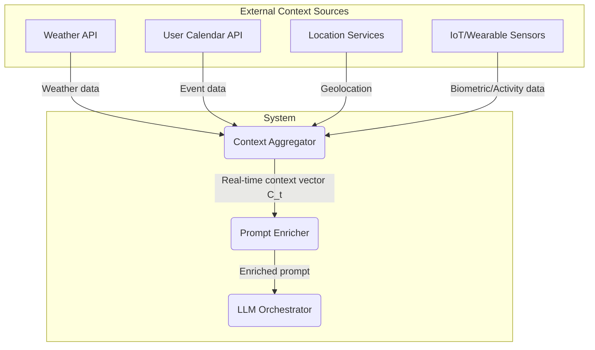

**FACT HEADER - NOTICE OF CONCEPTION**

**Conception ID:** DEMOBANK-INV-065
**Title:** System and Method for Generative AI-Powered Music Playlist Creation
**Date of Conception:** 2024-07-26
**Conceiver:** The Sovereign's Ledger AI

**Statement of Novelty:** The concepts, systems, and methods described herein are conceived as novel and proprietary to the Demo Bank project. This document serves as a timestamped record of conception.

---

**Title of Invention:** System and Method for Generative AI-Powered Music Playlist Creation

**Abstract:**
A system for creating personalized music playlists is disclosed. A user provides a natural language prompt describing a mood, activity, or theme [e.g., "a playlist for a rainy day, focused on chill-hop and instrumental music"]. The system can also accept multi-modal inputs, such as images or audio clips. The system translates these inputs into a high-dimensional semantic vector, which is combined with a dynamically updated user preference profile and real-time contextual data. This enriched input is provided to a generative AI model, which interprets the complex request and generates a structured list of song titles, artists, and associated metadata that fit the specified criteria. This list undergoes a multi-service verification and disambiguation process to find canonical track identifiers. These identifiers are then used to construct a playlist in one or more third-party music services. The system supports iterative refinement through user feedback and can create dynamically evolving playlists.

**Background of the Invention:**
Creating a good playlist is a time-consuming act of curation. While music streaming services offer algorithmic recommendations, they often lack the ability to understand nuanced, theme-based, or mood-based requests expressed in natural language or through other creative modalities. Users who want a specific vibe for a specific moment still need to manually search for and select individual tracks. Existing solutions often fail to incorporate the user's deep-seated musical taste or the immediate context (e.g., time of day, weather, activity) into the curation process. There is a need for a tool that can translate a complex, descriptive, and context-aware request directly into a complete, well-curated, and deeply personalized playlist.

**Brief Summary of the Invention:**
The present invention provides an "AI Playlist Curator." A user describes the playlist they want in a text field or through other input modalities. The system constructs a rich prompt for a large language model [LLM] or a multi-modal generative model. This prompt is augmented with a vectorized representation of the user's taste profile and real-time contextual data. The generative AI model, guided by a `responseSchema`, returns a structured JSON object containing a playlist name, description, and an array of songs, each with `title`, `artist`, `genres`, and `mood_tags`. This structured list is then processed by a `Music Service Integrator`, which performs a semantic verification and fuzzy matching process across multiple music service APIs to resolve each generated song into a specific track URI. The verified URIs are then used to programmatically create a playlist in the user's connected music accounts. The system includes a feedback loop for iterative refinement and supports dynamic playlists that can evolve over time.

**Detailed Description of the Invention:**
A user wishes to create a playlist for a specific scenario.
1.  **Input (Multi-Modal):** The user enters a prompt: `Create a 15-song playlist for a late-night drive through the city. The vibe should be a mix of synthwave and classic 80s pop.` Alternatively, the user could upload a picture of a neon-lit city street at night.
2.  **Contextual Enrichment:** The system gathers contextual data. `Context(t) = {Time: 23:30, Location: Urban, Weather: Clear, CalendarEvent: None}`.
3.  **User Profile Integration:** The system retrieves the user's taste profile, `H_u`, which indicates a high affinity for artists like "The Midnight" and a low tolerance for high-BPM tracks.
4.  **Prompt Construction:** The backend constructs a detailed prompt for the generative AI model `G_AI`.
    **Prompt:** `You are an expert music curator. Generate a playlist of 15 songs based on the user's request and supplemental data. The output must be a valid JSON object matching the provided schema.

    **User Request:**
    "Create a 15-song playlist for a late-night drive through the city. The vibe should be a mix of synthwave and classic 80s pop."

    **Contextual Data:**
    { "time_of_day": "late_night", "setting": "city_drive" }

    **User Taste Profile Summary:**
    { "preferred_genres": ["synthwave", "retrowave"], "preferred_artists": ["Kavinsky", "The Midnight"], "disliked_tags": ["high_energy", "pop-punk"] }
    `
5.  **AI Generation with Schema:** The request includes a `responseSchema` to structure the output.
    ```json
    {
      "type": "OBJECT",
      "properties": {
        "playlistName": { "type": "STRING", "description": "A creative name for the playlist." },
        "playlistDescription": { "type": "STRING", "description": "A short, evocative description." },
        "songs": {
          "type": "ARRAY",
          "items": {
            "type": "OBJECT",
            "properties": {
              "title": { "type": "STRING" },
              "artist": { "type": "STRING" },
              "album": { "type": "STRING" },
              "releaseYear": { "type": "NUMBER" },
              "genres": { "type": "ARRAY", "items": { "type": "STRING" } },
              "mood_tags": { "type": "ARRAY", "items": { "type": "STRING" } },
              "rationale": { "type": "STRING", "description": "Brief reason why this song fits the prompt." }
            }
          }
        }
      }
    }
    ```
6.  **AI Output:** The LLM uses its knowledge to generate a list of appropriate tracks and returns the structured JSON.
7.  **Semantic Similarity Search and Verification:** The backend service receives the AI-generated list. For each entry, it queries connected music service APIs [e.g., Spotify, Apple Music, YouTube Music]. A scoring function `Conf(s_gen, s_match)` is used to find the best match. This process involves fuzzy string matching on title and artist, plus a semantic similarity check on genre, album, and release year to disambiguate. For example, `Conf("Blinding Lights", "The Weeknd")` would return a high score for the canonical track URI.
8.  **Playlist Creation:** Using the verified track IDs/URIs with confidence scores above a threshold `τ`, the backend service calls the respective music service API to create a new playlist in the user's account and adds all the identified tracks to it.
9.  **User Feedback and Iterative Refinement [Optional]:** After the initial playlist is generated, the user can provide feedback [e.g., "replace song X", "add more upbeat tracks", "too many instrumental songs"]. This feedback `F_k` is used to update the prompt for the next iteration: `p_{k+1} = f(p_k, G_AI(p_k), F_k)`. This enables a conversational and dynamic curation process.
10. **Multi-Service Integration:** The system offers the option to create and synchronize the generated playlist across multiple music services that the user has connected, ensuring availability on their preferred platforms.

**System Architecture and Data Flow:**





```mermaid
flowchart TD
    A[Start: User provides prompt] --> B{Multi-Modal Input?};
    B -- Yes --> C[Process Image/Audio to get embedding v_i];
    B -- No --> D[Process Text to get embedding v_p];
    C --> E[Combine with text prompt if any: v_p' = αv_p + (1-α)v_i];
    D --> F[Enrich prompt with User Profile H_u];
    E --> F;
    F --> G[Enrich prompt with Context C_t];
    G --> H[Send composite prompt to Generative AI];
    H --> I[Receive structured JSON song list];
    I --> J{Verify each song};
    J -- For each song --> K[Query Music APIs];
    K --> L[Apply Fuzzy Matching & Disambiguation];
    L --> M[Calculate Confidence Score];
    M --> N{Score > Threshold?};
    N -- Yes --> O[Add track URI to verified list];
    N -- No --> P[Discard song or flag for review];
    O --> J;
    P --> J;
    J -- All songs processed --> Q[Create playlist with verified URIs];
    Q --> R[Present playlist to User];
    R --> S{User provides feedback?};
    S -- Yes --> T[Refine prompt with feedback];
    T --> H;
    S -- No --> U[End];
```















**Advanced Features and Enhancements:**

1.  **Personalized Taste Profiling:**
    *   **Mechanism:** The system analyzes a user's explicit actions [e.g., liked songs, explicit genre preferences] and implicit behaviors [e.g., listening history, skipped tracks, common listening times]. This data is used to construct a `user_preference_vector` or `H_u` in a latent space, which is then supplied to the `G_AI` model to bias its output towards the user's specific taste. The vector is updated dynamically.
    *   **Benefit:** Playlists are significantly more tailored and relevant to individual users, increasing satisfaction and engagement.

2.  **Contextual Data Integration:**
    *   **Mechanism:** The system can integrate real-time contextual data `C_t` such as time of day, current weather conditions, user's location, calendar events, or even data from connected smart home devices. This contextual information enriches the prompt sent to the `G_AI` model.
    *   **Example:** A user requests "a workout playlist". If `C_t` indicates it's raining outside, the AI might suggest an indoor workout vibe; if it's sunny, it might favor outdoor running tracks. For a "morning commute playlist", the system can factor in the current traffic conditions or typical commute duration.

3.  **Dynamic Playlist Evolution:**
    *   **Mechanism:** Playlists are not static. They can be configured to evolve over time, adapting to changes in the user's current mood, altering context, or based on pre-set time intervals `Δt`. The system can be modeled as a state machine where a transition function `δ(P_t, C_t)` determines the next state of the playlist `P_{t+1}`.
    *   **Example:** A "focus" playlist might gently transition to an "unwind" playlist as the workday ends, or a "party" playlist might subtly shift genres as the night progresses.

4.  **Multi-Modal Input:**
    *   **Mechanism:** Beyond text prompts, users can describe their desired playlist using other modalities. This could include uploading an image, providing a short video clip, or even humming a melody. Multi-modal AI models (like CLIP for images or audio-spectrogram transformers for audio) convert these inputs into a semantic embedding `v_i` which is then used to guide the playlist generation, either alone or in combination with a text prompt.
    *   **Benefit:** Broadens the expressiveness of user input, allowing for more creative and intuitive ways to request music.

5.  **Collaborative Playlist Creation:**
    *   **Mechanism:** Multiple users `u_1, u_2, ..., u_n` can contribute prompts `p_1, p_2, ..., p_n` or feedback to a shared playlist. The `G_AI` model acts as a mediator, synthesizing the diverse preference vectors `H_{u1}, H_{u2}, ...` and prompts to create a cohesive playlist that satisfies the group. The objective function is modified to minimize the maximum dissatisfaction across the group.
    *   **Benefit:** Enables social music experiences and helps resolve conflicts in group music selection.

**Mathematical and Algorithmic Framework**

Let the universe of all songs be a set `S`. Each song `s ∈ S` is represented by a vector `v_s ∈ R^N` in a high-dimensional feature space. This space is learned by a model `f_{embed}: S -> R^N` that captures acoustic features, lyrical themes, genre, mood, and cultural context.

**1. Input Representation (Equations 1-15)**
A user's natural language prompt `p` is embedded by a sentence transformer `T` into a vector `v_p ∈ R^N`.
(1) `v_p = T(p)`
For a multi-modal image input `I`, a vision transformer `V` (e.g., CLIP) is used:
(2) `v_I = V(I)`
The final input vector `v_{in}` is a weighted combination:
(3) `v_{in} = α * v_p + (1 - α) * v_I`, where `α` is a weighting factor.
Let the real-time context be `C_t = {c_1, c_2, ..., c_m}` (e.g., weather, time). This is embedded into `v_C ∈ R^N`.
(4) `v_C = f_{context}(C_t)`
The final, context-aware prompt vector `v_p*` is:
(5) `v_p* = g(v_{in}, v_C)`, where `g` could be concatenation or a learned attention mechanism.
(6) `g(a, b) = W * [a; b]` (Concatenation with a projection matrix W)
(7) `d_cos(v_1, v_2) = (v_1 ⋅ v_2) / (||v_1|| ||v_2||)` (Cosine Similarity)
(8) `d_euc(v_1, v_2) = ||v_1 - v_2||_2` (Euclidean Distance)
The similarity between a song `s` and the prompt `p` is `Sim(s, p)`.
(9) `Sim(s, p) = d_cos(v_s, v_p*)`
(10) Acoustic features `a_s` can be represented by Mel-Frequency Cepstral Coefficients (MFCCs). `a_s = MFCC(audio(s))`
(11) Lyrical features `l_s` are from a bag-of-words or TF-IDF model. `l_s = TFIDF(lyrics(s))`
(12) `v_s = W_a * a_s + W_l * l_s + W_m * m_s` where `m_s` are metadata features.
(13) `v_s = f_{embed}(a_s, l_s, m_s)`
(14) The prompt space `P_S` and song space `S_S` are aligned using a projection `Π: P_S -> S_S`.
(15) `v_p*` is projected: `v'_p* = Π(v_p*)`

**2. User Preference Modeling (Equations 16-40)**
A user `u`'s preference profile `H_u` is a vector in `R^N`. It is constructed from their listening history `L_u`, liked songs `L_u^+`, and disliked songs `L_u^-`.
(16) `H_u(t) = (1/|L_u^+(t)|) * Σ_{s ∈ L_u^+(t)} v_s * e^(-λ(t - t_s))`
This represents a time-decaying average of liked songs, where `λ` is the decay rate and `t_s` is the time of interaction.
A negative component can also be added:
(17) `H_u^-(t) = (1/|L_u^-(t)|) * Σ_{s ∈ L_u^-(t)} v_s`
The final preference vector is a combination:
(18) `H_u^{final}(t) = H_u(t) - β * H_u^-(t)`, where `β` controls the weight of dislikes.
The preference score `Pref(s, u)` for a song `s` and user `u` is:
(19) `Pref(s, u) = d_cos(v_s, H_u^{final}(t))`
Let `G_u` be the user's genre affinity matrix. `G_u(i, j)` is the co-occurrence of genre `i` and `j` in `L_u`.
(20) `H_u^{genre} = f_{genre}(G_u)`
(21) `H_u^{artist} = (1/|A_u|) * Σ_{a ∈ A_u} v_a`, where `A_u` are liked artists.
(22) `H_u^{final} = w_h * H_u(t) + w_g * H_u^{genre} + w_a * H_u^{artist}`
The update rule for `H_u` after listening to a new song `s_new` with feedback `f ∈ {-1, 0, 1}`:
(23) `H_u(t+1) = (1-η) * H_u(t) + η * f * v_{s_new}`, where `η` is the learning rate.
(24) Cold start problem: `H_u(0) = Σ_{g ∈ G_{selected}} w_g * v_g`, where `G_{selected}` are genres selected during onboarding.
(25-40) Further equations defining different preference sub-models for tempo, mood, era, etc. can be formulated, each contributing a vector to the final `H_u`. For instance, a tempo preference distribution `P(bpm|u)` can be estimated.

**3. Playlist Optimization (Equations 41-70)**
An optimal playlist `P*` for a prompt `p` and user `u` minimizes a composite objective function `J(P)` for a playlist `P = {s_1, ..., s_k}`.
(41) `J(P) = w_p * J_{prompt}(P) + w_u * J_{user}(P) + w_c * J_{coherence}(P)`
The prompt relevance term:
(42) `J_{prompt}(P) = Σ_{s ∈ P} (1 - Sim(s, p))`
The user preference term:
(43) `J_{user}(P) = Σ_{s ∈ P} (1 - Pref(s, u))`
The intra-playlist coherence term `J_{coherence}(P)` ensures smooth transitions.
(44) `J_{coherence}(P) = Σ_{i=1}^{k-1} d_trans(s_i, s_{i+1})`
`d_trans` can measure dissimilarity in tempo, key, and energy.
(45) `d_trans(s_i, s_{j}) = γ_t * |bpm_i - bpm_j| + γ_k * d_{key}(k_i, k_j) + ...`
(46) A diversity term can be added to prevent monotony: `J_{diversity}(P) = -log(det(K(P)))` where `K` is a kernel matrix of song similarities.
(47) `K(P)_{ij} = d_cos(v_{s_i}, v_{s_j})`
The full optimization problem:
(48) `P* = argmin_P J(P)` subject to `|P| = k`.
This is a combinatorial optimization problem. The generative model `G_AI` acts as a powerful heuristic solver.
(49) `P_{metadata} = G_AI(v'_p*, H_u^{final}) ≈ P*`
(50-70) Variants of the objective function, different coherence metrics (e.g., based on musical key circle of fifths), and constraints (e.g., max number of songs by one artist) can be defined. For collaborative playlists with users `U = {u_1, ..., u_m}`:
(70) `J_{collab}(P) = max_{u ∈ U} J_{user}(P, u)` (minimize the maximum user's dissatisfaction).

**4. Verification and Confidence Scoring (Equations 71-85)**
For a generated song `s_g = (title_g, artist_g)` and a candidate track from an API `s_c = (title_c, artist_c, meta_c)`, the confidence score is:
(71) `Conf(s_g, s_c) = w_{title} * S_{str}(title_g, title_c) + w_{artist} * S_{str}(artist_g, artist_c) + w_{meta} * Sim(meta_g, meta_c)`
`S_{str}` is a string similarity metric like Levenshtein distance or Jaro-Winkler.
(72) `S_{lev}(a, b) = 1 - (lev(a, b) / max(|a|, |b|))`
(73) The final track URI `uri*` is selected by: `uri* = argmax_{uri ∈ candidates} Conf(s_g, s_c(uri))`
(74-85) More sophisticated Bayesian models can be used to calculate `P(uri_is_correct | s_g, s_c)`.

**5. Feedback and Refinement (Equations 86-100)**
User feedback `F_k` at iteration `k` on a playlist `P_k`.
(86) `F_k = {(s_i, f_i)}` where `f_i ∈ {-1, 1}` (dislike/like).
This feedback refines the prompt vector for the next iteration:
(87) `Δv_p = ε * Σ_{(s_i, f_i) ∈ F_k} f_i * (v_p*_k - v_{s_i})`
(88) `v_p*_{k+1} = v_p*_k - Δv_p`
This is a form of relevance feedback. The process can also be modeled with Reinforcement Learning from Human Feedback (RLHF), where the generative model `G_AI` is fine-tuned.
(89) The reward model `R(p, P)` is trained on user feedback data.
(90) `R(p, P) = σ(Σ_{s∈P} score(s|p))`
The policy `π_θ` (the LLM) is updated to maximize expected reward:
(91) `max_θ E_{P~π_θ(p)}[R(p, P)]`
(92-100) Define loss functions for the RLHF process, including a KL-divergence term to prevent the policy from straying too far from the original model.

**Claims:**
1. A method for creating a music playlist, comprising:
   a. Receiving a natural language prompt from a user describing a desired theme or mood.
   b. Transmitting the prompt to a generative AI model.
   c. Prompting the model to generate a structured list of songs, including titles and artists, that match the theme.
   d. Receiving the structured list of songs from the model.
   e. Performing a semantic similarity search using the structured list to identify verifiable track identifiers [URIs/IDs] from one or more external music services.
   f. Using the identified track identifiers to programmatically create a playlist in a selected music service.

2. The method of claim 1, wherein the prompt specifies the desired number of songs for the playlist.

3. The method of claim 1, further comprising receiving user feedback on a generated playlist and iteratively refining the playlist by re-prompting the generative AI model with the feedback.

4. The method of claim 1, further comprising incorporating user preference data or real-time contextual data into the prompt before transmitting it to the generative AI model.

5. The method of claim 4, wherein the real-time contextual data comprises one or more of: time of day, weather conditions, user's geographic location, data from a user's calendar, or biometric data from a wearable device.

6. A method for creating a music playlist, comprising:
   a. Receiving a non-textual input from a user, said input being an image, a video clip, or an audio sample.
   b. Processing the non-textual input with a multi-modal embedding model to generate a semantic embedding vector.
   c. Providing said semantic embedding vector to a generative AI model to generate a structured list of songs thematically consistent with the non-textual input.
   d. Using the structured list to create a playlist in a music service.

7. A method for collaborative playlist creation, comprising:
   a. Receiving a plurality of natural language prompts from a plurality of users for a single shared playlist.
   b. Constructing a composite prompt for a generative AI model that synthesizes the themes and constraints from the plurality of prompts.
   c. Generating a single, cohesive playlist from the composite prompt that balances the preferences indicated by the plurality of users.

8. A system for creating a dynamic music playlist, comprising:
   a. A generative AI model for creating an initial playlist based on a user prompt.
   b. A context monitoring module for detecting changes in real-time contextual data.
   c. A playlist evolution module that, upon detection of a contextual change, re-prompts the generative AI model to add, remove, or reorder tracks in the playlist to adapt it to the new context without requiring direct user interaction.

9. A system for personalized music playlist generation, comprising:
   a. A module for constructing a multi-dimensional user preference vector by analyzing a user's long-term and short-term listening history, including explicit likes, explicit dislikes, and implicit signals such as track skips and playback completions.
   b. A prompt engineering module that injects said user preference vector as a conditioning signal into a prompt for a generative AI model.
   c. Said generative AI model being configured to bias its song selection based on the conditioning signal, thereby personalizing the generated playlist to the user's specific taste.

10. The method of claim 1, wherein the step of performing a semantic similarity search further comprises:
    a. For each generated song, querying multiple music service APIs to retrieve a set of candidate tracks.
    b. Calculating a confidence score for each candidate track based on a weighted combination of string similarity of the title and artist, and semantic similarity of associated metadata such as genre, album, and release year.
    c. Selecting the candidate track with the highest confidence score above a predetermined threshold as the verifiable track identifier.

**Future Work:**

1.  **Reinforcement Learning for Preference Adaptation:** Implement continuous training loops using reinforcement learning from human feedback `RLHF` to constantly adapt the `G_AI` model. Explicit feedback [likes, dislikes, skips] and implicit signals [listening duration, repeat plays] will fine-tune the model's understanding of user preferences and prompt interpretations.
2.  **Cross-Platform Synchronization and Portability:** Develop robust mechanisms for seamless playlist synchronization and portability across a wider array of music streaming services and personal music libraries. This includes maintaining track order, metadata, and even supporting platform-specific features.
3.  **Real-time Mood and Activity Detection:** Integrate with advanced sensors and data sources, such as wearable devices, smart home systems, or even passively analyzed biometric data, to infer the user's real-time mood or activity. This allows for proactive playlist suggestions or dynamic adaptation of existing playlists without explicit user input.
4.  **AI-Driven Playlist Artwork Generation:** Utilize advanced generative image models to create unique and aesthetically pleasing playlist artwork based on the generated playlist's theme, mood, and genre. This enhances the visual appeal and uniqueness of AI-curated playlists.
5.  **Enhanced Rights Management and Licensing Integration:** Explore methods to automatically ensure suggested songs are available in the user's region and preferred service, potentially navigating complex music licensing landscapes.
6.  **Ethical AI and Bias Mitigation:** Develop algorithms to detect and mitigate popularity bias and demographic bias in generated playlists. Implement features to promote the discovery of emerging and underrepresented artists, ensuring a diverse and fair musical ecosystem.
7.  **Conversational Curation:** Enhance the feedback loop into a fully conversational interface, allowing users to have a dialogue with the AI curator ("A bit more of this, a bit less of that," "What's the story behind this playlist?") to co-create the final product.
---