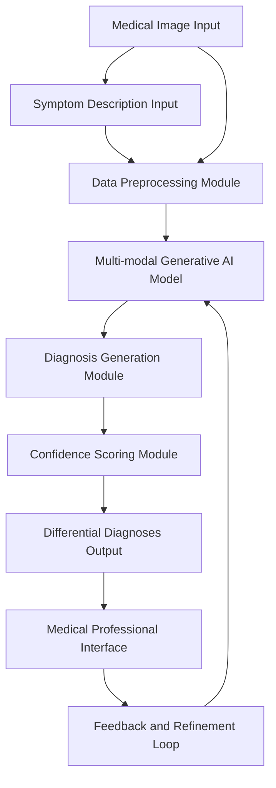

**Title of Invention:** System and Method for Assisting in Medical Diagnosis from Imaging Data

**Abstract:**
A system for assisting medical professionals is disclosed. The system receives a medical image (e.g., an X-ray, MRI) and a description of a patient's symptoms. It sends this multi-modal data to a generative AI model trained on medical data. The AI analyzes the image and text to identify potential abnormalities and suggests a list of possible differential diagnoses, along with its confidence level for each. This serves as a "second opinion" tool for radiologists and doctors.

**Detailed Description:**
A radiologist uploads a chest X-ray and types "Patient presents with a persistent cough." The system sends the image and text to a specialized medical LLM. The prompt asks the AI to analyze the data and list potential findings. The AI might respond: `{"findings": [{"condition": "Pneumonia", "confidence": 0.85, "location": "Lower left lobe"}, {"condition": "Nodule", "confidence": 0.45, "location": "Upper right lobe"}]}`.

The system is designed to integrate seamlessly into existing clinical workflows, providing rapid and accurate diagnostic support. It acts as an intelligent assistant, enhancing the efficiency and diagnostic accuracy of medical professionals.

### System Architecture

The core components of the diagnostic assistance system are outlined below:



**Description of Modules:**
*   **Medical Image Input:** Receives various medical imaging modalities, such as X-rays, MRIs, CT scans, ultrasounds, and pathological slides.
*   **Symptom Description Input:** Collects patient clinical history and symptom descriptions, typically as free-form text.
*   **Data Preprocessing Module:** Normalizes and preprocesses both image and text data. For images, this may include resizing, contrast adjustment, and noise reduction. For text, it involves tokenization, embedding, and cleaning.
*   **Multi-modal Generative AI Model:** The central AI component, trained to understand and correlate information from both visual and textual inputs. It is capable of identifying patterns indicative of various medical conditions.
*   **Diagnosis Generation Module:** Based on the AI model's analysis, this module formulates potential medical findings and diagnostic hypotheses.
*   **Confidence Scoring Module:** Assigns a probability or confidence score to each generated diagnosis, reflecting the model's certainty.
*   **Differential Diagnoses Output:** Presents a ranked list of possible conditions, their associated confidences, and relevant findings.
*   **Medical Professional Interface:** A user-friendly interface for clinicians to review AI suggestions, provide feedback, and confirm or refine diagnoses.
*   **Feedback and Refinement Loop:** Incorporates expert clinician feedback to continuously improve the AI model's performance and accuracy through reinforcement learning or fine-tuning.

### Technical Details of AI Model

The Multi-modal Generative AI Model typically comprises several integrated sub-models:

1.  **Vision Encoder:** A convolutional neural network CNN or Vision Transformer ViT that extracts features from the input medical image. For example, `f_image: Image -> R^D_image`.
2.  **Text Encoder:** A transformer-based language model LLM that processes the symptom description and generates contextual embeddings. For example, `f_text: Text -> R^D_text`.
3.  **Fusion Module:** Combines the visual and textual embeddings into a unified multi-modal representation. This can be achieved through attention mechanisms, concatenation, or cross-modal transformers. The unified representation is `z = g(f_image(image), f_text(text))`.
4.  **Generative Decoder:** A large language model or a specialized generative network that takes the fused representation `z` and generates diagnostic findings, confidence scores, and explanatory text. The output generation process can be modeled as `P(output | z)`.

The AI model is trained on vast datasets of anonymized medical images paired with their corresponding diagnostic reports and patient histories.

### Training Methodology

The AI model is trained using a multi-task learning approach to optimize for diagnostic accuracy, consistency, and interpretability. The overall loss function `L_total` can be represented as:

```
L_total = L_diagnosis + L_finding + L_confidence + L_regularization
```

Where:
*   `L_diagnosis` is a classification loss for predicting the primary diagnosis.
*   `L_finding` is a segmentation or detection loss for identifying specific abnormalities in the image or text.
*   `L_confidence` is a regression loss for predicting the confidence levels.
*   `L_regularization` is a term to prevent overfitting, such as L2 regularization or dropout.

The training process involves:
1.  **Pre-training:** Vision and Text encoders are often pre-trained on large general-purpose datasets (e.g., ImageNet, PubMed).
2.  **Fine-tuning:** The entire multi-modal model is fine-tuned on a specialized medical dataset.
3.  **Adversarial Training:** In some advanced implementations, Generative Adversarial Networks GANs might be used to improve the realism and robustness of generated explanations or counterfactuals.
4.  **Reinforcement Learning from Human Feedback RLHF:** Expert medical professionals provide feedback on AI-generated diagnoses, which is used to further fine-tune the model's responses and align them with clinical best practices.

### Evaluation and Performance

The system's performance is rigorously evaluated using standard medical AI metrics. Key metrics include:
*   **Accuracy:** Proportion of correctly identified diagnoses.
*   **Sensitivity (Recall):** Ability to correctly identify positive cases (e.g., detecting disease when present).
    `Sensitivity = TP / (TP + FN)`
*   **Specificity:** Ability to correctly identify negative cases (e.g., ruling out disease when absent).
    `Specificity = TN / (TN + FP)`
*   **Precision:** Proportion of positive identifications that were actually correct.
    `Precision = TP / (TP + FP)`
*   **F1 Score:** The harmonic mean of precision and recall.
    `F1 = 2 * (Precision * Sensitivity) / (Precision + Sensitivity)`
*   **Area Under the Receiver Operating Characteristic Curve AUC-ROC:** Measures the model's ability to discriminate between classes across various thresholds.
*   **Calibration:** How well the predicted probabilities align with actual probabilities.

These metrics are typically calculated across various disease categories and imaging modalities to ensure robust performance.

### Advantages

*   **Enhanced Diagnostic Accuracy:** Provides a statistically robust "second opinion," reducing human error and oversight.
*   **Increased Efficiency:** Expedites the diagnostic process, allowing medical professionals to focus on complex cases and patient interaction.
*   **Improved Patient Outcomes:** Earlier and more accurate diagnoses can lead to more timely and effective treatments.
*   **Accessibility:** Can make expert-level diagnostic assistance available in remote or underserved areas.
*   **Training and Education:** Serves as a valuable tool for training new radiologists and medical students by presenting differential diagnoses with explanations.
*   **Consistency:** Reduces variability in diagnosis across different practitioners.

### Use Cases

*   **Radiology Workflow:** A radiologist reviews an X-ray and uses the system to quickly generate a list of potential findings and diagnoses, cross-referencing their own assessment.
*   **Emergency Room:** An ER physician uploads a CT scan and symptom notes to rapidly obtain differential diagnoses for a critically ill patient, aiding in quick decision-making.
*   **Primary Care:** A general practitioner can use the system for initial screening of complex cases before referring to a specialist, ensuring no critical signs are missed.
*   **Medical Education:** Students and residents can use the system to test their diagnostic skills and learn from the AI's generated explanations and confidence scores.
*   **Pathology Analysis:** For digital pathology slides, the system can assist pathologists in identifying cellular abnormalities and grading diseases.

**Claims:**
1.  A method for diagnostic assistance, comprising:
    a.  Receiving a medical image and a description of symptoms.
    b.  Transmitting the image and description to a generative AI model.
    c.  Prompting the model to identify abnormalities and suggest potential diagnoses.
    d.  Displaying the suggestions, including confidence levels, to a medical professional.
2.  The method of claim 1, further comprising preprocessing the medical image, including steps such as resizing, normalization, and contrast adjustment, prior to transmission to the generative AI model.
3.  The method of claim 1, further comprising preprocessing the symptom description, including steps such as tokenization and embedding, prior to transmission to the generative AI model.
4.  The method of claim 1, wherein the generative AI model comprises a vision encoder, a text encoder, and a fusion module for combining multi-modal features.
5.  The method of claim 4, wherein the generative AI model further comprises a generative decoder configured to produce a ranked list of differential diagnoses.
6.  The method of claim 1, further comprising receiving feedback from the medical professional on the displayed suggestions and utilizing said feedback to refine the generative AI model.
7.  A system for diagnostic assistance, comprising:
    a.  An input module configured to receive a medical image and a description of symptoms.
    b.  A communication module configured to transmit the medical image and symptom description to a remote or local generative AI model.
    c.  A generative AI model configured to process the multi-modal data, identify abnormalities, and generate potential diagnoses with associated confidence levels.
    d.  An output module configured to display the generated diagnoses and confidence levels to a medical professional.
8.  The system of claim 7, further comprising a data preprocessing unit coupled to the input module and the generative AI model.
9.  The system of claim 7, wherein the generative AI model is trained using a multi-task learning approach to optimize for diagnostic accuracy, finding identification, and confidence prediction.
10. The system of claim 7, further comprising a user interface enabling medical professionals to interact with the system and provide feedback for continuous model improvement.