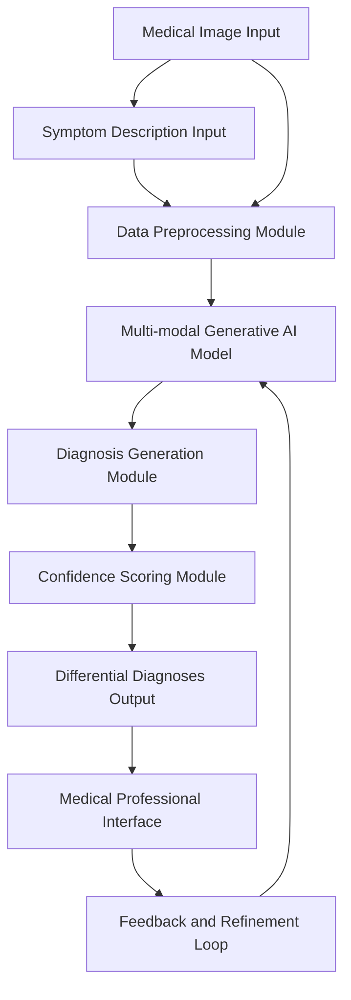
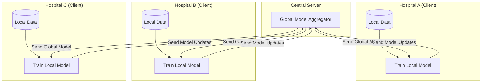

**Title of Invention:** System and Method for Assisting in Medical Diagnosis from Imaging Data

**Abstract:**
A comprehensive system and method for assisting medical professionals in diagnosis is disclosed. The system leverages a sophisticated multi-modal generative artificial intelligence model to analyze complex medical data inputs, including medical images (e.g., X-ray, MRI, CT scans) and associated clinical text, such as a patient's symptoms or electronic health records (EHR). The system receives this multi-modal data, performs rigorous preprocessing, and feeds it into the AI core. The AI, trained on vast, curated medical datasets, analyzes the image for visual biomarkers and correlates them with textual information to identify potential abnormalities. It then generates a ranked list of differential diagnoses, each accompanied by a quantifiable confidence level, localization information for visual findings, and supporting evidence cited from medical literature. This system is designed not merely as a "second opinion" tool but as an integrated diagnostic partner for radiologists, pathologists, and clinicians, aiming to enhance diagnostic accuracy, reduce cognitive load, and improve patient outcomes through rapid, data-driven insights. The architecture incorporates a continuous learning mechanism via a feedback and refinement loop, ensuring the model's knowledge and performance evolve with clinical validation.

**Detailed Description:**
The present invention provides a robust framework for AI-assisted medical diagnosis. Consider a typical clinical scenario: a radiologist at a busy hospital is tasked with interpreting a chest X-ray for a 65-year-old male patient. The radiologist uploads the DICOM image file to the system's secure portal and enters the accompanying clinical notes: "Patient presents with a persistent cough for 3 weeks, low-grade fever, and shortness of breath. History of smoking."

The system immediately initiates a multi-stage process. The image and text are sent to a specialized, HIPAA-compliant cloud-based service housing the multi-modal generative AI model. The prompt, constructed by the system's backend, might be structured as follows: `Analyze the provided chest X-ray and clinical history. Identify all potential radiological findings, their locations, and provide a differential diagnosis with confidence scores. For each diagnosis, provide a brief rationale and cite relevant features.`

Within seconds, the AI model processes the data and returns a structured JSON object, which is then rendered in a user-friendly graphical interface. The response could be:

```json
{
  "patient_id": "PID-12345",
  "analysis_timestamp": "2023-10-27T10:30:00Z",
  "findings": [
    {
      "finding_id": "F001",
      "finding_type": "Consolidation",
      "confidence": 0.92,
      "location": "Lower left lobe",
      "bounding_box": [450, 620, 150, 120],
      "description": "Opacity consistent with alveolar space filling, suggestive of pneumonia."
    },
    {
      "finding_id": "F002",
      "finding_type": "Nodule",
      "confidence": 0.55,
      "location": "Upper right lobe, apical region",
      "bounding_box": [810, 230, 25, 25],
      "description": "Small, ill-defined 2.5cm nodule. Further investigation with CT recommended to rule out malignancy, given patient history."
    }
  ],
  "differential_diagnoses": [
    {
      "condition": "Community-Acquired Pneumonia",
      "icd_10_code": "J18.9",
      "confidence": 0.88,
      "rationale": "Strongly supported by the consolidation finding in the left lower lobe combined with clinical symptoms of cough, fever, and dyspnea."
    },
    {
      "condition": "Lung Neoplasm",
      "icd_10_code": "C34.11",
      "confidence": 0.48,
      "rationale": "Suspicion raised by the apical nodule in the right upper lobe, especially considering the patient's smoking history. Confidence is moderate pending further imaging."
    },
    {
      "condition": "Tuberculosis",
      "icd_10_code": "A15.0",
      "confidence": 0.25,
      "rationale": "A less likely but possible diagnosis given the presence of an apical nodule. Clinical correlation for other TB symptoms is required."
    }
  ]
}
```

The system is designed for deep integration into existing Picture Archiving and Communication Systems (PACS) and Electronic Health Record (EHR) platforms, providing rapid and accurate diagnostic support directly within the clinician's established workflow. It acts as an intelligent assistant, enhancing the efficiency and diagnostic accuracy of medical professionals.

### System Architecture

The core components of the diagnostic assistance system are outlined below. The architecture is designed as a set of modular microservices to ensure scalability, reliability, and maintainability.



#### Microservices-Based Deployment Architecture

For robust and scalable deployment, the system is implemented using a microservices architecture, often managed by a container orchestration platform like Kubernetes.

```mermaid
graph TD
    subgraph "User-Facing Layer"
        UI[Medical Professional Interface]
    end

    subgraph "API Gateway"
        GW[API Gateway]
    end

    subgraph "Core Services"
        Ingestion[Data Ingestion Service]
        Preprocessing[Preprocessing Service]
        Inference[AI Inference Service]
        Reporting[Reporting Service]
        Feedback[Feedback Service]
    end

    subgraph "Data & Model Layer"
        DB[(Clinical Data DB)]
        Storage[Image Storage (e.g., S3/Blob)]
        MLOps[Model Registry & MLOps Pipeline]
    end

    UI --> GW
    GW --> Ingestion
    GW --> Reporting
    GW --> Feedback

    Ingestion --> Storage
    Ingestion --> DB
    Ingestion --> Preprocessing

    Preprocessing --> Inference
    Inference --> Reporting

    Feedback --> MLOps
    MLOps --> Inference

    style UI fill:#cde4ff
    style GW fill:#b0c4de
    style MLOps fill:#ffdab9
```

**Description of Modules:**
*   **Medical Image Input:** Receives various medical imaging modalities, such as X-rays, MRIs, CT scans, ultrasounds, and pathological slides. It handles standard formats like DICOM, NIfTI, and TIFF.
    *   **DICOM Parsing Equation:** The pixel intensity `P(x, y)` from a DICOM file is often calculated as:
        1.  $$ P(x, y) = \text{PixelValue}(x, y) \times \text{RescaleSlope} + \text{RescaleIntercept} $$

*   **Symptom Description Input:** Collects patient clinical history and symptom descriptions, typically as free-form text from EHRs or direct input. This module supports Natural Language Understanding (NLU) to extract structured entities.
    *   **TF-IDF for keyword extraction:**
        2.  $$ \text{tf-idf}(t, d, D) = \text{tf}(t, d) \times \text{idf}(t, D) $$
        3.  $$ \text{idf}(t, D) = \log\frac{|D|}{|\{d \in D: t \in d\}|} $$

*   **Data Preprocessing Module:** Normalizes and preprocesses both image and text data. For images, this may include DICOM windowing, resizing, noise reduction using a Gaussian filter, and intensity normalization.
    *   **Gaussian Filter Kernel (2D):**
        4.  $$ G(x, y) = \frac{1}{2\pi\sigma^2} e^{-\frac{x^2+y^2}{2\sigma^2}} $$
    *   **Z-score Normalization for images:**
        5.  $$ I_{norm} = \frac{I - \mu_I}{\sigma_I} $$
    For text, it involves tokenization, stop-word removal, stemming/lemmatization, and conversion to high-dimensional vectors (embeddings).

*   **Multi-modal Generative AI Model:** The central AI component, trained to understand and correlate information from both visual and textual inputs. It is capable of identifying patterns indicative of various medical conditions.

*   **Diagnosis Generation Module:** Based on the AI model's analysis, this module formulates potential medical findings and diagnostic hypotheses. It uses beam search decoding to generate coherent and clinically relevant text.
    *   **Beam Search Score:**
        6.  $$ S(y_1, ..., y_t) = \sum_{i=1}^t \log P(y_i | y_{<i}, \mathbf{z}) $$

*   **Confidence Scoring Module:** Assigns a probability or confidence score to each generated diagnosis, reflecting the model's certainty. This is often derived from the softmax output of the final classification layer.
    *   **Softmax Function:**
        7.  $$ \sigma(\mathbf{z})_i = \frac{e^{z_i}}{\sum_{j=1}^K e^{z_j}} \text{ for } i=1, ..., K $$

*   **Differential Diagnoses Output:** Presents a ranked list of possible conditions, their associated confidences, and relevant findings, often with visual overlays on the original image.

*   **Medical Professional Interface:** A user-friendly web-based interface for clinicians to review AI suggestions, interact with findings (e.g., zoom, pan, view overlays), provide feedback, and confirm or refine diagnoses.

*   **Feedback and Refinement Loop:** Incorporates expert clinician feedback (e.g., "This finding is correct," "This diagnosis is incorrect") to continuously improve the AI model's performance and accuracy through reinforcement learning or fine-tuning.

### Technical Details of AI Model

The Multi-modal Generative AI Model typically comprises several integrated sub-models:

1.  **Vision Encoder:** A convolutional neural network (CNN) like ResNet-152 or a Vision Transformer (ViT) that extracts a rich feature vector from the input medical image. Let `f_image: Image -> R^D_image`.
    *   **Convolution Operation:**
        8.  $$ (I * K)(i, j) = \sum_m \sum_n I(i-m, j-n) K(m, n) $$
    *   **ReLU Activation:**
        9.  $$ \text{ReLU}(x) = \max(0, x) $$
    *   **ViT Patch Embedding:**
        10. $$ \mathbf{z}_0 = [\mathbf{x}_{\text{class}}; \mathbf{x}_p^1\mathbf{E}; \mathbf{x}_p^2\mathbf{E}; \dots; \mathbf{x}_p^N\mathbf{E}] + \mathbf{E}_{\text{pos}} $$
        where `E` is a linear projection and `E_pos` are positional embeddings.

    #### Vision Transformer (ViT) Block Architecture
    ```mermaid
    graph TD
        subgraph "Transformer Encoder Block"
            direction LR
            Z_in[Input z_l-1] --> LN1[Layer Norm]
            LN1 --> MHA[Multi-Head Attention]
            Z_in --> Add1[Add]
            MHA --> Add1
            Add1 --> LN2[Layer Norm]
            LN2 --> MLP[MLP]
            Add1 --> Add2[Add]
            MLP --> Add2
            Add2 --> Z_out[Output z_l]
        end
    ```
    *   **Scaled Dot-Product Attention:**
        11. $$ \text{Attention}(Q, K, V) = \text{softmax}\left(\frac{QK^T}{\sqrt{d_k}}\right)V $$
    *   **Multi-Head Attention:**
        12. $$ \text{MultiHead}(Q, K, V) = \text{Concat}(\text{head}_1, ..., \text{head}_h)W^O $$
        13. where $$ \text{head}_i = \text{Attention}(QW_i^Q, KW_i^K, VW_i^V) $$
    *   **Layer Normalization:**
        14. $$ \text{LayerNorm}(\mathbf{x}) = \gamma \frac{\mathbf{x} - \mu}{\sqrt{\sigma^2 + \epsilon}} + \beta $$

2.  **Text Encoder:** A transformer-based language model (e.g., a variant of BERT or RoBERTa) that processes the symptom description and generates contextual embeddings. Let `f_text: Text -> R^D_text`.
    #### Text Transformer Encoder Block
    ```mermaid
    graph TD
        subgraph "Transformer Encoder Block"
            direction LR
            X_in[Input Embeddings] --> MHA[Multi-Head Self-Attention]
            MHA --> AddNorm1[Add & Norm]
            X_in --> AddNorm1
            AddNorm1 --> FFN[Feed-Forward Network]
            FFN --> AddNorm2[Add & Norm]
            AddNorm1 --> AddNorm2
            AddNorm2 --> X_out[Output Embeddings]
        end
    ```
    *   **Positional Encoding:**
        15. $$ PE_{(pos, 2i)} = \sin(pos / 10000^{2i/d_{\text{model}}}) $$
        16. $$ PE_{(pos, 2i+1)} = \cos(pos / 10000^{2i/d_{\text{model}}}) $$

3.  **Fusion Module:** Combines the visual and textual embeddings into a unified multi-modal representation. This can be achieved through attention mechanisms, concatenation, or dedicated cross-modal transformers. The unified representation is `z = g(f_image(image), f_text(text))`.

    #### Multi-modal Fusion Strategies
    ```mermaid
    graph TD
        subgraph "Early Fusion"
            I1[Image] --> C1[Concat]
            T1[Text] --> C1
            C1 --> M1[Multi-modal Encoder] --> O1[Output]
        end
        subgraph "Late Fusion"
            I2[Image] --> VE[Vision Encoder]
            T2[Text] --> TE[Text Encoder]
            VE --> C2[Fusion/Decision]
            TE --> C2
            C2 --> O2[Output]
        end
        subgraph "Hybrid (Cross-Attention) Fusion"
            I3[Image] --> VE2[Vision Encoder]
            T3[Text] --> TE2[Text Encoder]
            VE2 --> XA[Cross-Attention]
            TE2 --> XA
            XA --> M2[Multi-modal Decoder] --> O3[Output]
        end
    ```
    *   **Cross-Attention Mechanism:**
        17. $$ \text{CrossAttention}(Q_{text}, K_{img}, V_{img}) = \text{softmax}\left(\frac{Q_{text}K_{img}^T}{\sqrt{d_k}}\right)V_{img} $$

4.  **Generative Decoder:** A large language model (like GPT) or a specialized generative network that takes the fused representation `z` and generates diagnostic findings, confidence scores, and explanatory text. The output generation process is modeled as an autoregressive probability:
    *   **Autoregressive Generation:**
        18. $$ P(\text{output} | \mathbf{z}) = \prod_{t=1}^{T} P(y_t | y_{<t}, \mathbf{z}) $$

The AI model is trained on vast datasets of millions of anonymized medical images paired with their corresponding diagnostic reports and patient histories.

### Training Methodology

The AI model is trained using a multi-task learning approach to optimize for diagnostic accuracy, consistency, and interpretability. The overall loss function `L_total` is a weighted sum of several components:

$$ L_{\text{total}} = \lambda_1 L_{\text{diagnosis}} + \lambda_2 L_{\text{finding}} + \lambda_3 L_{\text{confidence}} + \lambda_4 L_{\text{regularization}} + \lambda_5 L_{\text{generation}} $$
Where:
*   `L_diagnosis` is a classification loss for predicting the primary diagnosis, typically the negative log-likelihood or cross-entropy loss.
    *   **Categorical Cross-Entropy Loss:**
        19. $$ L_{\text{diagnosis}} = -\sum_{c=1}^M y_{o,c} \log(p_{o,c}) $$
*   `L_finding` is a segmentation or detection loss for identifying specific abnormalities. For segmentation, the Dice loss is commonly used.
    *   **Dice Loss:**
        20. $$ L_{\text{finding}} = 1 - \frac{2|X \cap Y|}{|X| + |Y|} = 1 - \frac{2 \sum_i p_i g_i}{\sum_i p_i^2 + \sum_i g_i^2} $$
*   `L_confidence` is a regression loss, such as Mean Squared Error (MSE), for aligning predicted confidence levels with the model's true accuracy.
    *   **Mean Squared Error (MSE):**
        21. $$ L_{\text{confidence}} = \frac{1}{N} \sum_{i=1}^N (y_i - \hat{y}_i)^2 $$
*   `L_regularization` is a term to prevent overfitting, such as L2 regularization or dropout.
    *   **L2 Regularization:**
        22. $$ L_{\text{regularization}} = \frac{\lambda}{2m} \sum_{w} w^2 $$
*   `L_generation` is the language modeling loss for the descriptive text output.
    *   **Language Model Loss:**
        23. $$ L_{\text{generation}} = -\sum_{t=1}^T \log P(y_t | y_{<t}, \mathbf{z}) $$

The training process involves:
1.  **Pre-training:** Vision and Text encoders are pre-trained on large general-purpose datasets (e.g., ImageNet, PubMed) and then on large-scale medical data using self-supervised methods.
2.  **Fine-tuning:** The entire multi-modal model is fine-tuned on a high-quality, expert-labeled specialized medical dataset.
    *   **Adam Optimizer Update Rules:**
        24. $$ m_t = \beta_1 m_{t-1} + (1-\beta_1) g_t $$
        25. $$ v_t = \beta_2 v_{t-1} + (1-\beta_2) g_t^2 $$
        26. $$ \hat{m}_t = \frac{m_t}{1-\beta_1^t} $$
        27. $$ \hat{v}_t = \frac{v_t}{1-\beta_2^t} $$
        28. $$ \theta_{t+1} = \theta_t - \frac{\eta}{\sqrt{\hat{v}_t}+\epsilon} \hat{m}_t $$
3.  **Adversarial Training:** Generative Adversarial Networks (GANs) are used to improve the realism and robustness of generated explanations or to perform data augmentation.
    #### GAN Training Loop
    ```mermaid
    graph TD
        N[Noise Vector z] --> G[Generator]
        G --> F[Fake Data]
        R[Real Data] --> D[Discriminator]
        F --> D
        D --> P[Prediction (Real/Fake)]
        P -- Loss --> G_Update[Update Generator]
        P -- Loss --> D_Update[Update Discriminator]
    ```
    *   **GAN Minimax Objective:**
        29. $$ \min_G \max_D V(D,G) = \mathbb{E}_{\mathbf{x} \sim p_{data}(\mathbf{x})}[\log D(\mathbf{x})] + \mathbb{E}_{\mathbf{z} \sim p_z(\mathbf{z})}[\log(1 - D(G(\mathbf{z})))] $$

4.  **Reinforcement Learning from Human Feedback (RLHF):** Expert medical professionals provide feedback (e.g., ranking several generated reports for quality), which is used to train a reward model. This reward model then guides the fine-tuning of the generative model using reinforcement learning algorithms like PPO.
    #### RLHF Loop
    ```mermaid
    flowchart TD
        A[Prompt] --> B(LLM Policy π)
        B --> C{Generated Reports}
        C --> D[Human Feedback (Rankings)]
        D --> E[Train Reward Model RM(y|x)]
        A --> F(Fine-tune LLM with RL)
        F -- Generates --> G(Report y)
        G -- Scored by --> E
        E -- Reward r --> F
    ```
    *   **PPO Objective Function (Simplified):**
        30. $$ L^{CLIP}(\theta) = \hat{\mathbb{E}}_t \left[ \min(r_t(\theta) \hat{A}_t, \text{clip}(r_t(\theta), 1-\epsilon, 1+\epsilon) \hat{A}_t) \right] $$
        31. where $$ r_t(\theta) = \frac{\pi_\theta(a_t|s_t)}{\pi_{\theta_{old}}(a_t|s_t)} $$

### Evaluation and Performance

The system's performance is rigorously evaluated using a comprehensive suite of metrics. Key metrics include:
*   **Accuracy:** Proportion of correctly identified diagnoses.
    32. $$ \text{Accuracy} = \frac{TP + TN}{TP + TN + FP + FN} $$
*   **Sensitivity (Recall):** Ability to correctly identify positive cases.
    33. $$ \text{Sensitivity} = \frac{TP}{TP + FN} $$
*   **Specificity:** Ability to correctly identify negative cases.
    34. $$ \text{Specificity} = \frac{TN}{TN + FP} $$
*   **Precision (Positive Predictive Value):** Proportion of positive identifications that were correct.
    35. $$ \text{Precision} = \frac{TP}{TP + FP} $$
*   **F1 Score:** The harmonic mean of precision and recall.
    36. $$ F1 = 2 \times \frac{\text{Precision} \times \text{Sensitivity}}{\text{Precision} + \text{Sensitivity}} $$
*   **Area Under the Receiver Operating Characteristic Curve (AUC-ROC):** Measures the model's ability to discriminate between classes.
    37. $$ \text{AUC} = \int_{0}^{1} \text{TPR}(T) d(\text{FPR}(T)) $$
    #### ROC Curve Visualization
    ```mermaid
    xychart-beta
        title "Receiver Operating Characteristic (ROC) Curve"
        x-axis "False Positive Rate (1 - Specificity)" 0 --> 1
        y-axis "True Positive Rate (Sensitivity)" 0 --> 1
        line "Model A (AUC = 0.92)" [
            { x: 0.0, y: 0.0 },
            { x: 0.1, y: 0.6 },
            { x: 0.2, y: 0.8 },
            { x: 0.4, y: 0.9 },
            { x: 1.0, y: 1.0 }
        ]
        line "Random Chance (AUC = 0.5)" [
            { x: 0.0, y: 0.0 },
            { x: 1.0, y: 1.0 }
        ]
    ```
*   **Calibration:** How well the predicted probabilities align with actual probabilities. Assessed using reliability diagrams and Expected Calibration Error (ECE).
    38. $$ \text{ECE} = \sum_{m=1}^M \frac{|B_m|}{n} |\text{acc}(B_m) - \text{conf}(B_m)| $$
*   **Intersection over Union (IoU) for segmentation/localization:**
    39. $$ \text{IoU} = \frac{\text{Area of Overlap}}{\text{Area of Union}} $$
*   **Text Generation Quality:** BLEU, ROUGE, and METEOR scores to compare generated reports against reference reports.
    40. $$ \text{BLEU} = \text{BP} \cdot \exp\left(\sum_{n=1}^N w_n \log p_n\right) $$

### Data Acquisition and Curation

The foundation of this system is a large, diverse, and meticulously curated dataset. The data pipeline is a critical component of the invention.

#### Data Acquisition and Anonymization Pipeline
```mermaid
graph TD
    A[Hospital A PACS/EHR] --> B{Anonymization Engine}
    C[Hospital B PACS/EHR] --> B
    D[Public Datasets (e.g., TCIA, MIMIC-CXR)] --> B
    B -- De-identification --> E[Staging Area]
    E -- Validation & QC --> F[Structured Curation]
    F -- Annotation & Labeling (Expert Radiologists) --> G[Gold-Standard Training Set]
    G --> H[Model Training & Validation]
```
The process includes:
1.  **Data Sourcing:** Aggregating data from multiple partner hospitals and public research databases.
2.  **Anonymization:** A robust de-identification process compliant with regulations like HIPAA and GDPR is applied. This involves removing all Protected Health Information (PHI).
    41. $$ \text{Image}_{anon} = \text{ScrubMetadata}(\text{Image}_{orig}) $$
    42. $$ \text{Text}_{anon} = \text{RedactPHI}(\text{Text}_{orig}) $$
3.  **Curation and Labeling:** A team of board-certified radiologists and medical experts labels the data, providing ground truth for diagnoses, findings, segmentations, and high-quality reports.

### Deployment and Integration

The system is designed for seamless integration into clinical environments.
*   **Deployment Models:** Can be deployed on a secure cloud (AWS, Azure, GCP) or on-premise, depending on institutional requirements.
*   **API-First Design:** A RESTful API allows for easy integration with existing PACS viewers, EHR systems, and other clinical software.
*   **HL7/FHIR Compliance:** The system communicates using standard medical data exchange protocols like HL7 and FHIR to ensure interoperability.

### Security and Privacy

Protecting patient data is paramount.
*   **End-to-End Encryption:** All data is encrypted in transit and at rest.
*   **Access Control:** Role-based access control (RBAC) ensures that only authorized personnel can access data.
*   **Federated Learning:** To further enhance privacy, the system can be trained using federated learning, where the model is trained locally at each hospital without centralizing the sensitive patient data.

#### Federated Learning Architecture

*   **Federated Averaging Algorithm:**
    43. $$ w_{t+1} \leftarrow \sum_{k=1}^K \frac{n_k}{n} w_{t+1}^k $$

### Ethical Considerations and Bias Mitigation

AI in medicine must be developed and deployed responsibly.
*   **Bias Detection:** The model is continuously audited for performance disparities across demographic subgroups (age, sex, ethnicity).
*   **Fairness Metrics:** We measure metrics like Equalized Odds and Demographic Parity.
    44. $$ P(\hat{Y}=1 | A=a, Y=y) = P(\hat{Y}=1 | A=b, Y=y), \quad \forall y \in \{0,1\} \quad (\text{Equalized Odds}) $$
*   **Mitigation Strategies:** Techniques like re-sampling underrepresented groups, using adversarial de-biasing, and applying fairness constraints to the loss function are employed.
    45. $$ L_{fair} = L_{total} + \gamma L_{adversary} $$

### Advantages

*   **Enhanced Diagnostic Accuracy:** Provides a statistically robust "second opinion," reducing human error and oversight.
*   **Increased Efficiency:** Expedites the diagnostic process, allowing medical professionals to focus on complex cases and patient interaction.
*   **Improved Patient Outcomes:** Earlier and more accurate diagnoses can lead to more timely and effective treatments.
*   **Accessibility:** Can make expert-level diagnostic assistance available in remote or underserved areas.
*   **Training and Education:** Serves as a valuable tool for training new radiologists and medical students by presenting differential diagnoses with explanations.
*   **Consistency:** Reduces variability in diagnosis across different practitioners.
*   **Quantitative Analysis:** Provides objective, quantifiable data (e.g., nodule size, tumor volume changes over time) that can be difficult for the human eye to assess consistently.

### Use Cases

*   **Radiology Workflow:** A radiologist reviews an X-ray and uses the system to quickly generate a list of potential findings and diagnoses, cross-referencing their own assessment and automatically pre-populating the report.
*   **Emergency Room:** An ER physician uploads a CT scan and symptom notes to rapidly obtain differential diagnoses for a critically ill patient, aiding in quick decision-making for conditions like stroke or pulmonary embolism.
*   **Primary Care:** A general practitioner can use the system for initial screening of complex cases before referring to a specialist, ensuring no critical signs are missed on an EKG or simple X-ray.
*   **Medical Education:** Students and residents can use the system in a "sandbox" mode to test their diagnostic skills against the AI and learn from its generated explanations and confidence scores.
*   **Pathology Analysis:** For digital pathology slides, the system can assist pathologists in identifying cellular abnormalities, counting mitotic figures, and grading diseases like cancer.
*   **Oncology:** The system can track tumor progression over time by analyzing sequential scans (e.g., PET-CT), providing quantitative metrics on treatment response.

### More Math Equations
46. $$ \text{Sigmoid}(x) = \frac{1}{1 + e^{-x}} $$
47. $$ \text{Tanh}(x) = \frac{e^x - e^{-x}}{e^x + e^{-x}} $$
48. $$ \text{Max Pooling}: A_{i,j,k} = \max_{p,q \in \mathcal{W}} I_{i+p, j+q, k} $$
49. $$ \text{Average Pooling}: A_{i,j,k} = \frac{1}{|\mathcal{W}|} \sum_{p,q \in \mathcal{W}} I_{i+p, j+q, k} $$
50. $$ \text{Dropout Mask}: \mathbf{m} \sim \text{Bernoulli}(p) $$
51. $$ \text{Dropout Output}: \tilde{\mathbf{y}} = \frac{1}{1-p} \mathbf{m} \odot \mathbf{y} $$
52. $$ \text{Cosine Similarity}: \text{sim}(\mathbf{A}, \mathbf{B}) = \frac{\mathbf{A} \cdot \mathbf{B}}{\|\mathbf{A}\| \|\mathbf{B}\|} $$
53. $$ \text{Euclidean Distance}: d(\mathbf{p}, \mathbf{q}) = \sqrt{\sum_{i=1}^n (q_i - p_i)^2} $$
54. $$ \text{Batch Normalization}: \hat{x}_i = \frac{x_i - \mu_{\mathcal{B}}}{\sqrt{\sigma_{\mathcal{B}}^2 + \epsilon}} $$
55. $$ y_i = \gamma \hat{x}_i + \beta $$
56. $$ \text{Huber Loss}: L_\delta(y, f(x)) = \begin{cases} \frac{1}{2}(y-f(x))^2 & \text{for } |y-f(x)| \le \delta \\ \delta|y-f(x)| - \frac{1}{2}\delta^2 & \text{otherwise} \end{cases} $$
57. $$ \text{Kullback-Leibler (KL) Divergence}: D_{KL}(P\|Q) = \sum_{x \in \mathcal{X}} P(x) \log\left(\frac{P(x)}{Q(x)}\right) $$
58. $$ \text{Jensen-Shannon Divergence}: JSD(P\|Q) = \frac{1}{2} D_{KL}(P\|M) + \frac{1}{2} D_{KL}(Q\|M), M = \frac{1}{2}(P+Q) $$
59. $$ \text{Information Entropy}: H(X) = -\sum_{i=1}^n P(x_i) \log P(x_i) $$
60. $$ \text{Gini Impurity}: G(p) = \sum_{i=1}^J p_i (1-p_i) = 1 - \sum_{i=1}^J p_i^2 $$
61. $$ \text{Principal Component Analysis (PCA)}: \max_{\mathbf{w}} \text{Var}(\mathbf{Xw}) = \mathbf{w}^T \text{Cov}(\mathbf{X}) \mathbf{w} \text{ s.t. } \|\mathbf{w}\|=1 $$
62. $$ \text{Support Vector Machine (SVM) Objective}: \min_{\mathbf{w}, b} \frac{1}{2}\|\mathbf{w}\|^2 \text{ s.t. } y_i(\mathbf{w} \cdot \mathbf{x}_i - b) \ge 1 $$
63. $$ \text{Logistic Regression}: P(y=1|x) = \sigma(\mathbf{w}^T\mathbf{x} + b) $$
64. $$ \text{Bayes' Theorem}: P(A|B) = \frac{P(B|A)P(A)}{P(B)} $$
65. $$ \text{Naive Bayes Classifier}: \hat{y} = \arg\max_k p(C_k) \prod_{i=1}^n p(x_i|C_k) $$
66. $$ \text{Linear Regression}: \hat{y} = \mathbf{w}^T \mathbf{x} + b $$
67. $$ \text{Ridge Regression Loss}: \sum_{i=1}^n (y_i - \hat{y}_i)^2 + \alpha \sum_{j=1}^p w_j^2 $$
68. $$ \text{Lasso Regression Loss}: \sum_{i=1}^n (y_i - \hat{y}_i)^2 + \alpha \sum_{j=1}^p |w_j| $$
69. $$ \text{Momentum Update}: v_t = \gamma v_{t-1} + \eta \nabla_\theta J(\theta); \theta = \theta - v_t $$
70. $$ \text{AdaGrad Update}: \theta_{t+1, i} = \theta_{t,i} - \frac{\eta}{\sqrt{G_{t,ii} + \epsilon}} g_{t,i} $$
71. $$ \text{RMSprop Update}: E[g^2]_t = \gamma E[g^2]_{t-1} + (1-\gamma) g_t^2; \theta_{t+1} = \theta_t - \frac{\eta}{\sqrt{E[g^2]_t + \epsilon}} g_t $$
72. $$ \text{Negative Predictive Value (NPV)}: \text{NPV} = \frac{TN}{TN+FN} $$
73. $$ \text{False Discovery Rate (FDR)}: \text{FDR} = \frac{FP}{FP+TP} $$
74. $$ \text{Matthews Correlation Coefficient (MCC)}: \text{MCC} = \frac{TP \times TN - FP \times FN}{\sqrt{(TP+FP)(TP+FN)(TN+FP)(TN+FN)}} $$
75. $$ \text{Brier Score}: BS = \frac{1}{N} \sum_{t=1}^N (f_t - o_t)^2 $$
76. $$ \text{t-SNE Objective}: \min KL(P \| Q) $$
77. $$ \text{Word2Vec (Skip-gram)}: \max \frac{1}{T} \sum_{t=1}^T \sum_{-c \le j \le c, j \ne 0} \log p(w_{t+j}|w_t) $$
78. $$ p(w_O|w_I) = \frac{\exp({v'_{w_O}}^T v_{w_I})}{\sum_{w=1}^V \exp({v'_w}^T v_{w_I})} $$
79. $$ \text{Gated Recurrent Unit (GRU) Update Gate}: z_t = \sigma(W_z x_t + U_z h_{t-1} + b_z) $$
80. $$ \text{GRU Reset Gate}: r_t = \sigma(W_r x_t + U_r h_{t-1} + b_r) $$
81. $$ \text{GRU Candidate Activation}: \tilde{h}_t = \tanh(W_h x_t + U_h (r_t \odot h_{t-1}) + b_h) $$
82. $$ \text{GRU Hidden State}: h_t = (1-z_t) \odot h_{t-1} + z_t \odot \tilde{h}_t $$
83. $$ \text{Long Short-Term Memory (LSTM) Input Gate}: i_t = \sigma(W_i x_t + U_i h_{t-1} + b_i) $$
84. $$ \text{LSTM Forget Gate}: f_t = \sigma(W_f x_t + U_f h_{t-1} + b_f) $$
85. $$ \text{LSTM Output Gate}: o_t = \sigma(W_o x_t + U_o h_{t-1} + b_o) $$
86. $$ \text{LSTM Cell State}: c_t = f_t \odot c_{t-1} + i_t \odot \tanh(W_c x_t + U_c h_{t-1} + b_c) $$
87. $$ \text{LSTM Hidden State}: h_t = o_t \odot \tanh(c_t) $$
88. $$ \text{Gaussian Error Linear Unit (GELU)}: \text{GELU}(x) = x \Phi(x) \approx 0.5x(1+\tanh(\sqrt{2/\pi}(x+0.044715x^3))) $$
89. $$ \text{Focal Loss}: FL(p_t) = -\alpha_t(1-p_t)^\gamma \log(p_t) $$
90. $$ \text{Contrastive Loss}: L = \frac{1}{2N}\sum_{i=1}^N y d^2 + (1-y) \max(\text{margin}-d, 0)^2 $$
91. $$ \text{Triplet Loss}: L = \max(\|f(a)-f(p)\|^2 - \|f(a)-f(n)\|^2 + \alpha, 0) $$
92. $$ \text{Variational Autoencoder (VAE) Loss}: L(\theta, \phi; x) = \mathbb{E}_{q_\phi(z|x)}[\log p_\theta(x|z)] - D_{KL}(q_\phi(z|x) \| p(z)) $$
93. $$ \text{Wasserstein GAN Loss}: L(G, D) = \sup_{\|f\|_L \le 1} (\mathbb{E}_{x \sim P_r}[f(x)] - \mathbb{E}_{\tilde{x} \sim P_g}[f(\tilde{x})]) $$
94. $$ \text{Policy Gradient}: \nabla_\theta J(\theta) = \mathbb{E}_{\tau \sim \pi_\theta} \left[ \sum_{t=0}^T \nabla_\theta \log \pi_\theta(a_t|s_t) R(\tau) \right] $$
95. $$ \text{Advantage Function}: A(s,a) = Q(s,a) - V(s) $$
96. $$ \text{Temporal Difference (TD) Error}: \delta_t = R_{t+1} + \gamma V(S_{t+1}) - V(S_t) $$
97. $$ \text{Q-Learning Update}: Q(S_t, A_t) \leftarrow Q(S_t, A_t) + \alpha[R_{t+1} + \gamma \max_a Q(S_{t+1}, a) - Q(S_t, A_t)] $$
98. $$ \text{U-Net Skip Connection}: \text{Concat}(\text{Upsample}(x_i), \text{EncoderFeature}_{n-i}) $$
99. $$ \text{Dice Coefficient}: \text{DSC} = \frac{2|X \cap Y|}{|X|+|Y|} $$
100. $$ \text{Hausdorff Distance}: h(A, B) = \max_{a \in A} \left\{ \min_{b \in B} \{d(a,b)\} \right\} $$

**Claims:**
1.  A method for diagnostic assistance, comprising:
    a.  Receiving a medical image and a description of symptoms.
    b.  Transmitting the image and description to a generative AI model.
    c.  Prompting the model to identify abnormalities and suggest potential diagnoses.
    d.  Displaying the suggestions, including confidence levels, to a medical professional.
2.  The method of claim 1, further comprising preprocessing the medical image, including steps such as resizing, normalization, and contrast adjustment, prior to transmission to the generative AI model.
3.  The method of claim 1, further comprising preprocessing the symptom description, including steps such as tokenization and embedding, prior to transmission to the generative AI model.
4.  The method of claim 1, wherein the generative AI model comprises a vision encoder, a text encoder, and a fusion module for combining multi-modal features.
5.  The method of claim 4, wherein the generative AI model further comprises a generative decoder configured to produce a ranked list of differential diagnoses.
6.  The method of claim 1, further comprising receiving feedback from the medical professional on the displayed suggestions and utilizing said feedback to refine the generative AI model.
7.  A system for diagnostic assistance, comprising:
    a.  An input module configured to receive a medical image and a description of symptoms.
    b.  A communication module configured to transmit the medical image and symptom description to a remote or local generative AI model.
    c.  A generative AI model configured to process the multi-modal data, identify abnormalities, and generate potential diagnoses with associated confidence levels.
    d.  An output module configured to display the generated diagnoses and confidence levels to a medical professional.
8.  The system of claim 7, further comprising a data preprocessing unit coupled to the input module and the generative AI model.
9.  The system of claim 7, wherein the generative AI model is trained using a multi-task learning approach to optimize for diagnostic accuracy, finding identification, and confidence prediction.
10. The system of claim 7, further comprising a user interface enabling medical professionals to interact with the system and provide feedback for continuous model improvement.