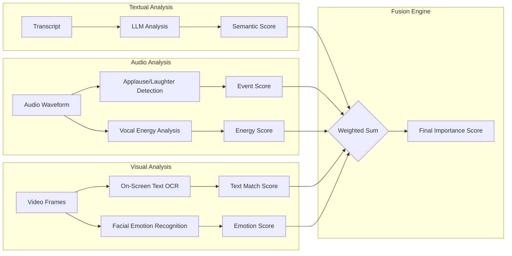
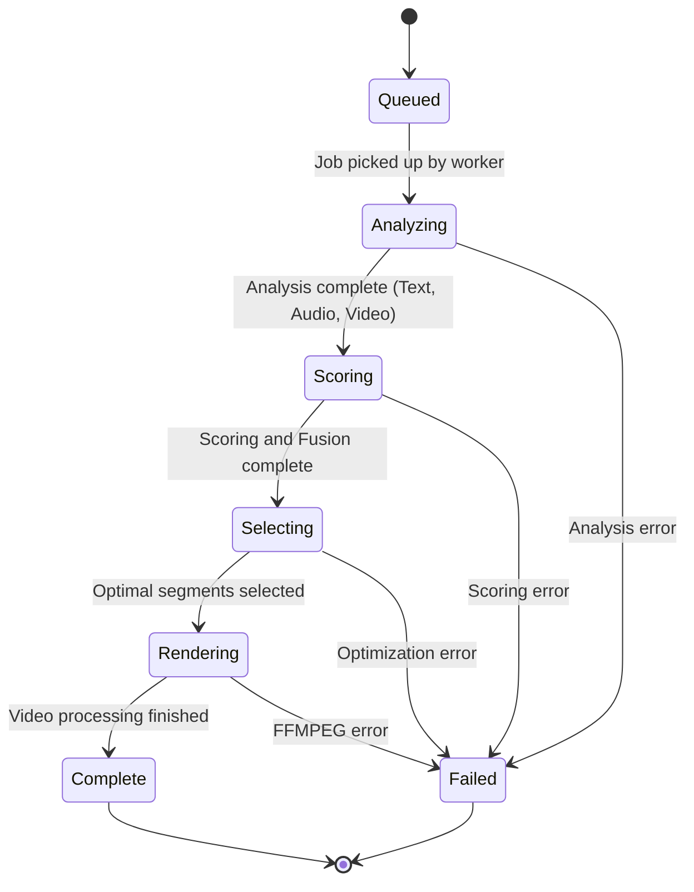
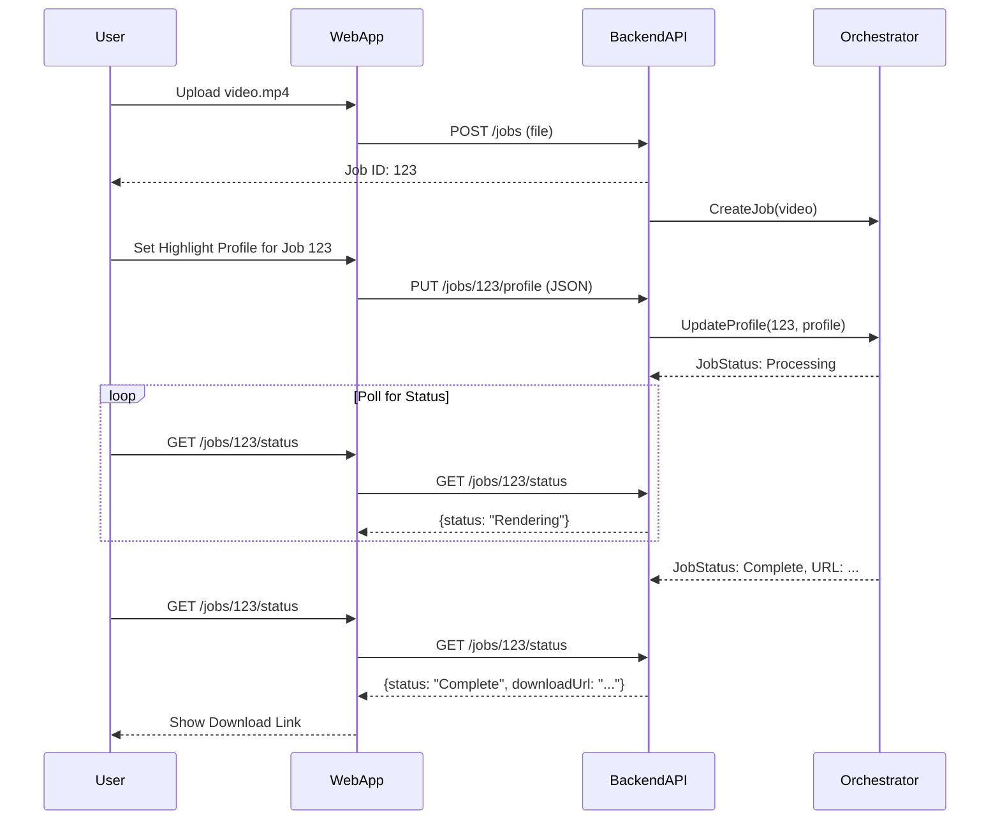
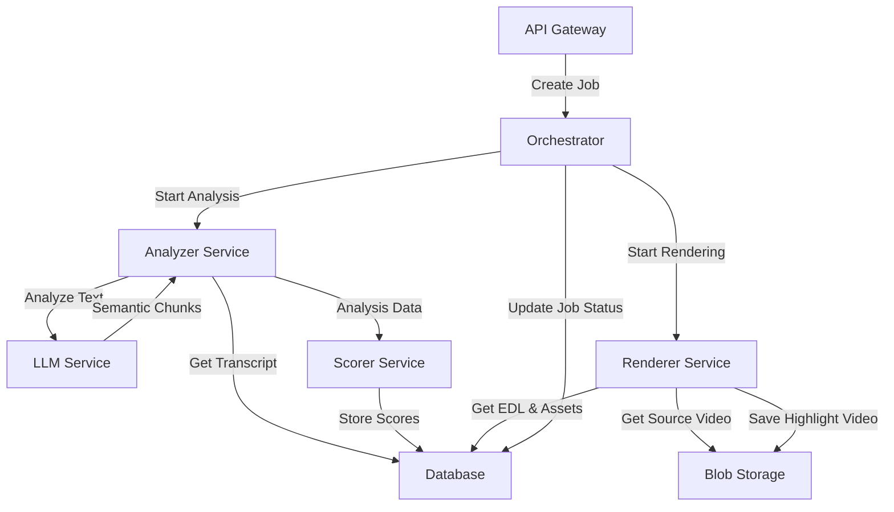
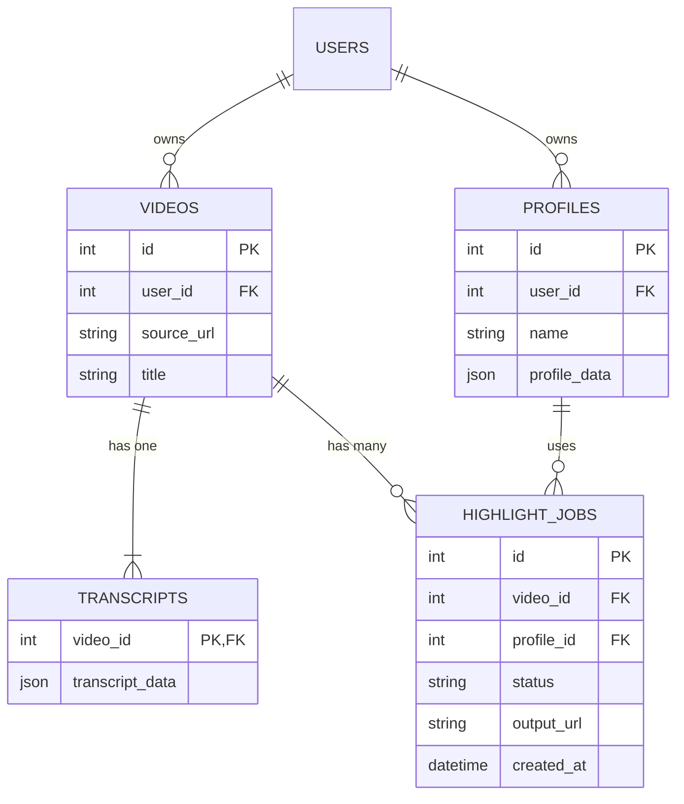

**FACT HEADER - NOTICE OF CONCEPTION**

**Conception ID:** DEMOBANK-INV-066
**Title:** System and Method for Automated Generation of Video Highlight Reels
**Date of Conception:** 2024-07-26
**Conceiver:** The Sovereign's Ledger AI

**Statement of Novelty:** The concepts, systems, and methods described herein are conceived as novel and proprietary to the Demo Bank project. This document serves as a timestamped record of conception.

---

**Title of Invention:** System and Method for Automated Generation of Video Highlight Reels from Transcripts and Multi-Modal Analysis

**Abstract:**
A comprehensive system for automated video editing and highlight generation is disclosed. The system ingests a long-form video and its corresponding time-coded transcript. It employs a multi-modal analysis pipeline, processing textual, auditory, and visual data streams in parallel. A generative AI model, guided by a dynamically constructed prompt based on a user-defined "Highlight Profile," analyzes the transcript to identify semantically significant moments. Concurrently, specialized modules analyze the audio track for emotional cues (e.g., applause, laughter, vocal excitement) and the video stream for visual cues (e.g., on-screen text, specific objects, facial expressions). A novel scoring and fusion engine combines these multi-modal signals into a unified "importance score" for every potential segment. The system then formulates and solves a constrained optimization problem to select the optimal set of segments that maximizes total importance while adhering to user-defined constraints. Finally, an advanced video processing module assembles these segments, applying dynamic transitions, synchronized background music, and contextual overlays to produce a polished, professional-grade highlight reel.

**Background of the Invention:**
The creation of highlight reels from lengthy video content—such as corporate keynotes, educational lectures, sporting events, or panel discussions—is a traditionally labor-intensive and expensive endeavor. This manual process requires a skilled human editor to meticulously review the entire source footage, a task that is both time-consuming and subjective. The cost and time commitment make it prohibitive for many organizations to generate summaries for their vast archives of video content, leaving significant value untapped.

Prior art in automated video summarization has often been limited in scope. Early systems relied on simplistic heuristics like scene change detection or basic keyword spotting in transcripts. While functional, these methods lack the contextual understanding to identify moments of true semantic or emotional importance. More recent approaches may use a single modality, such as analyzing only the transcript with a language model, but fail to capture the rich, non-verbal cues present in the audio and visual streams that are crucial for determining a moment's impact. There exists a clear and unmet need for a holistic, multi-modal, and highly customizable system that can automate the creation of high-quality video highlights with the intelligence and nuance of a human editor.

**Brief Summary of the Invention:**
The present invention, termed the "AI Highlight Generator," provides a robust, end-to-end solution for automated video summarization. A user provides a video file and its transcript. The system's core innovation lies in its multi-modal analysis and fusion engine. It processes the content through three parallel pipelines:

1.  **Semantic Analysis:** A Large Language Model (LLM) analyzes the transcript, guided by a sophisticated, dynamically generated prompt. This prompt, built from a user's `HighlightProfile`, instructs the LLM to identify moments based on keywords, topics, sentiment, and specific event types (e.g., "product reveal").
2.  **Audio Analysis:** An audio processing module analyzes the audio track to detect events like applause, laughter, spikes in vocal energy, or changes in speaker, providing a time-coded "emotional map" of the video.
3.  **Visual Analysis:** A computer vision module analyzes the video frames to detect on-screen text, logos, facial expressions (e.g., joy, surprise), and significant scene changes.

A central `HighlightScorer` module fuses the outputs from these three pipelines using a weighted scoring algorithm. This produces a continuous "importance score" over the video's timeline. The system then selects the highest-scoring segments, ensuring they meet constraints defined in the `HighlightProfile` (e.g., total duration, number of clips). Finally, an advanced `VideoProcessor` assembles the final reel, programmatically adding intros, outros, transitions, background music, and dynamic graphical overlays to create a polished final product.

**Detailed Description of the Invention:**
Consider a user wanting to create a 2-minute summary of a 90-minute university lecture on quantum computing.

1.  **Input & Profile Configuration:** The user uploads the video file and its time-coded transcript. They select a "Lecture Summary" `HighlightProfile`.

    ```json
    {
      "profileName": "Lecture Summary",
      "numHighlights": 8,
      "targetReelDurationSeconds": 120,
      "minSegmentDurationSeconds": 10,
      "maxSegmentDurationSeconds": 45,
      "keywordsToEmphasize": ["quantum entanglement", "superposition", "qubit", "in conclusion"],
      "sentimentThreshold": "neutral_or_positive",
      "eventTypesToPrioritize": ["key_definition", "example_walkthrough", "summary_statement", "audience_question"],
      "requireSpeakerChange": false,
      "generateIntroOutro": true,
      "transitionType": "crossfade",
      "overlayTemplate": "lower_third_speaker_name_topic"
    }
    ```

2.  **Dynamic Prompt Construction:** The `PromptGenerator` module constructs a detailed prompt for the LLM based on the profile.
    **Prompt Snippet:** `...You are an academic assistant creating a study guide. From the following lecture transcript, identify up to 8 key moments. Prioritize segments that define key terms like 'quantum entanglement' or 'qubit', walk through examples, or provide summary statements. Each segment should be between 10 and 45 seconds long. Return a JSON array with objects containing "startTime", "endTime", "category" ("key_definition", "example_walkthrough", etc.), and a "reason" for the selection...`

3.  **Multi-Modal Parallel Analysis:**
    *   **LLM (Semantic):** The LLM processes the transcript and returns a list of candidate segments based on the prompt.
    *   **Audio Analyzer:** This module processes the audio waveform. It detects a spike in vocal amplitude and pitch at `[00:45:10]`, indicating an emphatic point. It also identifies a distinct voice asking a question at `[01:15:22]`, tagged as `audience_question`.
    *   **Visual Analyzer:** The vision module performs OCR on the video frames. It detects a slide with the title "Quantum Entanglement Explained" at `[00:15:05]` and a code snippet on screen at `[00:55:30]`.

4.  **Highlight Scoring and Fusion:** The `HighlightScorer` receives inputs from all analyzers. It generates a continuous importance score `I(t)` for the entire video. For a candidate segment identified by the LLM, say `[00:15:02 - 00:15:35]`, it calculates a final score by fusing the inputs:
    *   *Semantic Score:* High, as LLM identified it as `key_definition` for a priority keyword.
    *   *Visual Score:* High, due to the matching on-screen text "Quantum Entanglement Explained".
    *   *Audio Score:* Neutral.
    *   The weighted average score for this segment is calculated and stored.

5.  **Optimal Segment Selection:** The system treats this as an optimization problem: select a combination of segments that maximizes the total importance score, subject to the `targetReelDurationSeconds` and `numHighlights` constraints from the profile.

6.  **Advanced Video Processing:** The `VideoProcessor` receives the final Edit Decision List (EDL).
    *   It retrieves a pre-made intro template from an `AssetLibrary`.
    *   It extracts the 8 selected video segments.
    *   It applies a 1-second `crossfade` transition between each segment.
    *   Based on metadata, it overlays a lower-third graphic with the professor's name and the segment's topic (e.g., "Superposition") at the start of relevant clips.
    *   It selects a subtle, royalty-free instrumental track from the `AssetLibrary` and syncs it, lowering the volume during spoken parts.
    *   It adds a concluding outro graphic.

7.  **Output:** The final `lecture_summary.mp4` file, a professional 2-minute highlight reel, is rendered and made available to the user.

---

### System Architecture and Data Flow Diagrams (Mermaid)

**Chart 1: High-Level C4-Style System Architecture**
```mermaid
graph TD
    subgraph User Space
        User[User]
    end

    subgraph AI Highlight Generation System
        Ingestion[Ingestion Service]
        APIs[API Gateway]
        WebApp[Web Application]
        
        subgraph Core Processing Pipeline
            Orchestrator[Job Orchestrator]
            Analyzer[Multi-Modal Analyzer]
            Scorer[Highlight Scorer & Selector]
            Processor[Video Processor & Renderer]
        end

        subgraph Data Stores
            VideoStore[Video Storage (S3)]
            DB[Metadata Database (PostgreSQL)]
            AssetStore[Asset Library (Intros, Music)]
        end

        subgraph External Services
            LLM[Generative AI Model (LLM API)]
            TranscriptSvc[Transcription Service]
        end
    end

    User --> WebApp
    WebApp --> APIs
    APIs --> Ingestion
    Ingestion --> VideoStore
    Ingestion --> TranscriptSvc
    Ingestion --> Orchestrator
    Orchestrator --> Analyzer
    Analyzer --Text--> LLM
    Analyzer --Audio/Video--> Scorer
    LLM --Semantic Data--> Scorer
    Scorer --> Orchestrator
    Orchestrator --> Processor
    Processor --> VideoStore
    Processor --> AssetStore
    DB <--> Orchestrator
    DB <--> Scorer
    DB <--> Processor
```

**Chart 2: Data Ingestion and Pre-processing Pipeline**
```mermaid
graph TD
    A[Start: User Uploads Video] --> B{Video File};
    B --> C[Store Raw Video in Blob Storage];
    B --> D[Extract Audio Stream];
    D --> E[Submit to Transcription Service];
    E --> F[Receive Time-coded Transcript (JSON)];
    F --> G[Store Transcript in Database];
    B --> H[Generate Video Metadata];
    H --> I{Frame Rate, Resolution, Duration};
    I --> J[Store Metadata in Database];
    J --> K[End: Ready for Analysis];
    G --> K;
```

**Chart 3: Dynamic Prompt Generation Logic**
```mermaid
graph TD
    A[Receive User Highlight Profile] --> B{Parse Profile};
    B --> C[Base Prompt Template: "You are an expert..."];
    B --> D["Keywords: " + profile.keywordsToEmphasize];
    B --> E["Segment Count: " + profile.numHighlights];
    B --> F["Sentiment: " + profile.sentimentThreshold];
    B --> G["Event Types: " + profile.eventTypesToPrioritize];
    C & D & E & F & G --> H[Assemble Final Prompt String];
    H --> I[Append Full Transcript];
    I --> J[Submit to LLM];
```

**Chart 4: Multi-Modal Fusion Model for Scoring**


**Chart 5: State Machine for a Video Processing Job**


**Chart 6: User Interaction Sequence Diagram**


**Chart 7: Component Interaction Diagram**


**Chart 8: Highlight Scoring Algorithm Flowchart**
```mermaid
graph TD
    Start --> A[For each time segment `s` in video]
    A --> B{Calculate Scores}
    B -- Text --> B1[S_sem = LLM_score(s) + Keyword_match(s)]
    B -- Audio --> B2[S_audio = Applause_detect(s) + Vocal_energy(s)]
    B -- Video --> B3[S_vis = OCR_match(s) + Emotion_detect(s)]
    B1 & B2 & B3 --> C[Fuse Scores: I(s) = w1*S_sem + w2*S_audio + w3*S_vis]
    C --> D[Store I(s) for segment `s`]
    A -- Next Segment --> A
    A -- All Segments Done --> E{Find Peaks in I(t)}
    E --> F[Generate Candidate Clips from Peaks]
    F --> G[Solve Optimization Problem to Select Best Clips]
    G --> H[Output Final Edit Decision List]
    H --> End
```

**Chart 9: Gantt Chart for Processing Stages**

```mermaid
gantt
    title Highlight Generation Pipeline
    dateFormat  HH:mm:ss
    axisFormat  %H:%M:%S
    
    section Pre-processing
    Video Ingestion   :done, 00:00:00, 30s
    Transcription     :done, 00:00:05, 180s
    
    section Parallel Analysis
    Semantic (LLM)    :done, 00:03:00, 120s
    Audio Analysis    :done, 00:03:00, 90s
    Visual Analysis   :done, 00:03:00, 240s

    section Finalization
    Scoring & Selection :done, 00:07:00, 20s
    Video Rendering   :done, 00:07:20, 300s
```


**Chart 10: Simplified Database Schema (ERD)**


---

### Mathematical and Algorithmic Framework

Let a video `V` be a sequence of frames `F` over a total duration `D_v`. `V = {f_t | t ∈ [0, D_v]}`.
Let the corresponding transcript `T` be a sequence of time-coded words `W`. `T = {(w_i, t_start_i, t_end_i)}`.

**1. Segment Definition**
A potential video segment `s_j` is defined by a start time `t_start` and an end time `t_end`. (1)
`s_j = (t_start_j, t_end_j)` (2)
The duration of a segment is `d(s_j) = t_end_j - t_start_j`. (3)

**2. Semantic Scoring (`S_sem`)**
The semantic score of a segment `s_j` is a function of its textual content `T(s_j)`.
`T(s_j) = {(w_i, ...) | t_start_i >= t_start_j, t_end_i <= t_end_j}` (4)

Let `K_p` be the set of emphasis keywords from the `HighlightProfile` `P`.
The Keyword Match Score `S_kw(s_j, P)` is the term frequency-inverse document frequency (TF-IDF) of profile keywords within the segment.
`S_kw(s_j, P) = Σ_{k ∈ K_p} tf(k, T(s_j)) * idf(k, T_corpus)` (5)
where `tf(k, d)` is the term frequency of `k` in document `d` (6) and `idf(k, D)` is the inverse document frequency of `k` in corpus `D`. (7)

Let `E(text)` be a function that returns the sentence embedding vector for a given text (e.g., from BERT).
Let `E_event` be the embedding for a target event type (e.g., "product reveal").
The Event Type Proximity Score `S_event(s_j, P)` is the maximum cosine similarity between the segment's text and the profile's prioritized event types.
`S_event(s_j, P) = max_{e ∈ P.eventTypes} cos_sim(E(T(s_j)), E(e))` (8)
`cos_sim(A, B) = (A · B) / (||A|| ||B||)` (9)

Let `SA(text)` be a sentiment analysis function returning a value in `[-1, 1]` (negative to positive).
The Sentiment Score `S_sent(s_j, P)` is a function of the alignment with the profile's sentiment threshold.
`S_sent(s_j, P) = 1` if `SA(T(s_j))` meets `P.sentimentThreshold`, else `0`. (10)

The total Semantic Score is a weighted sum:
`S_sem(s_j, P) = α_1 * S_kw(s_j, P) + α_2 * S_event(s_j, P) + α_3 * S_sent(s_j, P)` (11)
where `α_1 + α_2 + α_3 = 1`. (12)

For `i=13..25`, more nuanced semantic models can be defined, e.g., using topic modeling (LDA), named entity recognition (NER), and rhetorical structure theory (RST).
`S_topic(s_j) = TopicCoherence(LDA(T(s_j)))` (13)
`S_ner(s_j) = Σ_{e ∈ NER(T(s_j))} IsEntityTypePrioritized(e.type)` (14)
`S_rhetoric(s_j) = NucleusSaliency(RSTParse(T(s_j)))` (15-25)

**3. Audio Scoring (`S_audio`)**
The audio signal `A(t)` for `t ∈ [0, D_v]` is analyzed.
Let `C_applause(t)` be the output of an applause detection classifier at time `t`. (26)
Let `C_laugh(t)` be the output of a laughter detection classifier. (27)
The Audio Event Score for a segment `s_j` is the integral of these classifier outputs over the segment's duration.
`S_aud_event(s_j) = ∫_{t_start_j}^{t_end_j} (β_1 * C_applause(t) + β_2 * C_laugh(t)) dt` (28)

Let `E(t)` be the short-term energy of the audio signal at time `t`. (29)
`E(t) = Σ_{n=t-N/2}^{t+N/2} A(n)^2` (30)
Let `F0(t)` be the fundamental frequency (pitch) at time `t`. (31)
The Vocal Excitement Score `S_exc(s_j)` is the variance of energy and pitch within the segment.
`S_exc(s_j) = γ_1 * Var(E(t) for t ∈ s_j) + γ_2 * Var(F0(t) for t ∈ s_j)` (32)
`Var(X) = E[(X - μ)^2]` (33)

Let `SD(t)` be the output of a speaker diarization model, mapping time `t` to a speaker ID.
The Speaker Change Score `S_spk_chg(s_j)` is non-zero if a speaker change occurs within the segment.
`S_spk_chg(s_j) = 1` if `∃ t_1, t_2 ∈ s_j` such that `SD(t_1) ≠ SD(t_2)`, else `0`. (34)

The total Audio Score:
`S_audio(s_j, P) = δ_1 * S_aud_event(s_j) + δ_2 * S_exc(s_j) + δ_3 * S_spk_chg(s_j) * P.requireSpeakerChange` (35)
(Equations 36-50: Further refinements on audio features, e.g., Mel-frequency cepstral coefficients (MFCCs), spectral flux, zero-crossing rate.)
`MFCC_vector(t) = DCT(log(MelFilterbank(FFT(A(t)))))` (36)
`SpectralFlux(t) = || FFT(A(t)) - FFT(A(t-1)) ||_2` (37-50)

**4. Visual Scoring (`S_vis`)**
Let `OCR(f_t)` be the set of recognized text strings on frame `f_t`. (51)
The On-Screen Text Score measures the overlap between OCR'd text and profile keywords.
`S_ocr(s_j, P) = (1/d(s_j)) * ∫_{t_start_j}^{t_end_j} (max_{k ∈ K_p} Jaccard(k, OCR(f_t)))) dt` (52)
`Jaccard(A, B) = |A ∩ B| / |A ∪ B|` (53)

Let `FER(f_t)` be a facial emotion recognition function returning a vector of emotion probabilities (joy, surprise, etc.). (54)
The Emotional Resonance Score `S_emo(s_j)` is the average probability of positive emotions over the segment.
`S_emo(s_j) = (1/d(s_j)) * ∫_{t_start_j}^{t_end_j} (FER(f_t).joy + FER(f_t).surprise) dt` (55)

Let `SCD(t)` be a scene change detection function, `1` if a hard cut occurs at `t`, `0` otherwise. (56)
The Visual Dynamism Score `S_dyn(s_j)` is the density of scene changes.
`S_dyn(s_j) = (1/d(s_j)) * ∫_{t_start_j}^{t_end_j} SCD(t) dt` (57)

The total Visual Score:
`S_vis(s_j, P) = ε_1 * S_ocr(s_j, P) + ε_2 * S_emo(s_j) + ε_3 * S_dyn(s_j)` (58)
(Equations 59-70: Further visual features, e.g., object detection, motion vector analysis, aesthetic quality scores.)
`ObjectPresence(s_j, obj) = ∃ t ∈ s_j | IsPresent(obj, YOLO(f_t))` (59)
`MotionMagnitude(t) = ||MV(t)||_avg` (60-70)

**5. Total Importance Score and Optimization**
The final importance score `I(s_j)` for a segment `s_j` is the weighted fusion of the multi-modal scores.
`I(s_j) = w_sem * S_sem(s_j, P) + w_audio * S_audio(s_j, P) + w_vis * S_vis(s_j, P)` (71)
The weights `w_i` can be specified in the `HighlightProfile`. (72)

The segment selection is a 0/1 knapsack-style optimization problem.
Let `x_j ∈ {0, 1}` be a decision variable, where `x_j = 1` if segment `s_j` is selected. (73)
The objective is to maximize the total importance:
`Maximize: Σ_{j=1}^{N} x_j * I(s_j)` where N is the number of candidate segments. (74)

Subject to constraints from profile `P`:
1.  Total duration constraint: `Σ_{j=1}^{N} x_j * d(s_j) <= P.targetReelDurationSeconds` (75)
2.  Number of highlights constraint: `Σ_{j=1}^{N} x_j <= P.numHighlights` (76)
3.  Individual duration constraints: `P.minDuration <= d(s_j) <= P.maxDuration` for all `x_j = 1`. (77)

This can be solved using dynamic programming or integer linear programming. (78-85)

**6. Post-Processing Models**
Let `C = {c_1, c_2, ..., c_k}` be the selected sequence of clips.
The transition type `T(c_i, c_{i+1})` between two consecutive clips can be modeled.
`TransitionSuitability(c_i, c_{i+1}) = f(S_sem(c_i), S_sem(c_{i+1}), SCD(c_i.end), SCD(c_{i+1}.start))` (86)
If `abs(SA(T(c_i)) - SA(T(c_{i+1}))) > 0.8`, use a hard cut. Else, use crossfade. (87)

Background music selection `M(C)` is a function of the aggregated sentiment of the reel.
`AvgSent(C) = (1/k) * Σ_{i=1}^{k} SA(T(c_i))` (88)
`SelectedTrack = argmin_{m ∈ MusicLibrary} || MusicFeatures(m) - TargetFeatures(AvgSent(C)) ||_2` (89)
where `MusicFeatures` include tempo, mood, and energy. (90)

The music volume `V_m(t)` is modulated inversely to the speech volume `V_s(t)`.
`V_m(t) = V_{m,max} * (1 - normalize(V_s(t)))` (91)

Overlay generation is a rule-based system:
`ShowOverlay(c_i) = TRUE` if `S_event(c_i, P) > threshold` OR `S_ner(c_i) > threshold`. (92)
The text for the overlay is `OverlayText = argmax_{e ∈ NER(T(c_i))} Saliency(e)`. (93)
(Equations 94-100: Further modeling for render farm allocation, bitrate optimization, and quality assessment metrics like VMAF.)
`OptimalBitrate(c_i) = f(MotionMagnitude(c_i), DesiredVMAF)` (94)
`TotalRenderTime ≈ Σ_{i=1}^{k} d(c_i) * Complexity(c_i)` (95)
`Complexity(c_i) = f(resolution, num_overlays, transition_type)` (96-100)

---

**Proof of Utility:**
Manual editing requires a human to perform cognitive tasks of analysis, scoring, and selection, with a time cost `t_human`. `t_human = t_watch + t_analyze + t_edit`. (A)
`t_watch = D_v` (B)
The automated system's time cost is `t_auto = t_preproc + t_analysis + t_render`. (C)
`t_analysis = max(t_llm, t_audio, t_vis)` due to parallel processing. (D)
For a video of duration `D_v`, typically `t_llm ≈ c_1 * length(T)`, `t_audio ≈ c_2 * D_v`, `t_vis ≈ c_3 * D_v`. (E)
The constants `c_i` are small (e.g., `c_3` might be 0.1 for real-time inference).
Therefore, `t_analysis < D_v`. (F)
The rendering time `t_render` is also typically less than `D_v`. `t_render ≈ c_4 * D_highlight_reel`. (G)
Combining (A-G), we get `t_auto << t_human`. This substantial reduction in time cost enables video summarization at a scale and speed unattainable through manual methods, unlocking value from vast video archives and enabling new content workflows. The multi-modal approach also provides a more objective and comprehensive analysis than a single human editor might, leading to potentially higher quality and more relevant highlights.
Q.E.D.

---

**Claims:**
1.  A method for automated video highlight generation, comprising:
    a. Ingesting a source video and a corresponding time-coded text transcript.
    b. Performing parallel multi-modal analysis on at least three data streams derived from the source video: a textual stream (the transcript), an auditory stream, and a visual stream.
    c. Calculating a time-series of importance scores for segments of the video by applying a weighted fusion model to the outputs of the multi-modal analysis.
    d. Selecting an optimal set of video segments by solving a constrained optimization problem to maximize the cumulative importance score subject to user-defined constraints on total duration and number of segments.
    e. Assembling the selected video segments into a final highlight video.

2.  The method of claim 1, wherein the textual analysis comprises constructing a dynamic prompt for a generative AI model based on a user-defined highlight profile, said profile specifying keywords, event types, and sentiment preferences.

3.  The method of claim 1, wherein the auditory analysis comprises detecting non-speech events including at least one of applause or laughter, and analyzing prosodic features including vocal energy and pitch variance to identify moments of excitement.

4.  The method of claim 1, wherein the visual analysis comprises performing optical character recognition (OCR) to detect on-screen text and performing facial emotion recognition to identify emotional cues in speakers.

5.  The method of claim 1, further comprising a post-processing step of applying dynamic video enhancements, wherein said enhancements are chosen based on metadata associated with the selected segments, the enhancements including at least one of: selecting transition effects based on semantic similarity between adjacent segments, synchronizing a background music track whose mood matches the aggregated sentiment of the segments, or generating contextual graphic overlays based on recognized entities in the transcript.

6.  A system for automated video highlight generation, comprising:
    a. An ingestion module to receive a video file and its transcript.
    b. A multi-modal analysis engine comprising at least three parallel analyzers: a semantic text analyzer, an audio feature analyzer, and a visual feature analyzer.
    c. A highlight scoring and fusion module configured to receive time-coded feature data from the analysis engine, to apply a configurable weighted scoring model to generate a unified importance score for video segments, and to select an optimal set of segments based on said scores and a user-defined profile.
    d. A video processing and rendering module configured to extract the selected segments and assemble them into a highlight video, further configured to apply dynamic post-processing effects.
    e. A data store containing a library of assets, including intro/outro templates, music tracks, and graphic overlay templates, accessible by the video processing module.

7.  The system of claim 6, wherein the semantic text analyzer interfaces with an external large language model (LLM) and includes a prompt generator that dynamically constructs a prompt for the LLM based on a user-defined highlight profile.

8.  The method of claim 1, wherein different highlight reels, each with a distinct narrative focus (e.g., a technical summary, a marketing summary, a "bloopers" reel), are generated from the same source video by applying different user-defined highlight profiles without re-analyzing the source video's fundamental audio-visual features.

9.  The method of claim 1, wherein the constrained optimization problem is formulated as a 0/1 knapsack problem, where video segments are items, their importance scores are values, and their durations are weights, solved to find the set of segments that maximizes total value without exceeding a total weight corresponding to the target reel duration.

10. The system of claim 6, wherein the user-defined profile is a structured data object (e.g., JSON) that specifies weights for the fusion model, thereby allowing a user to control the relative influence of textual, auditory, and visual cues on the final highlight selection.