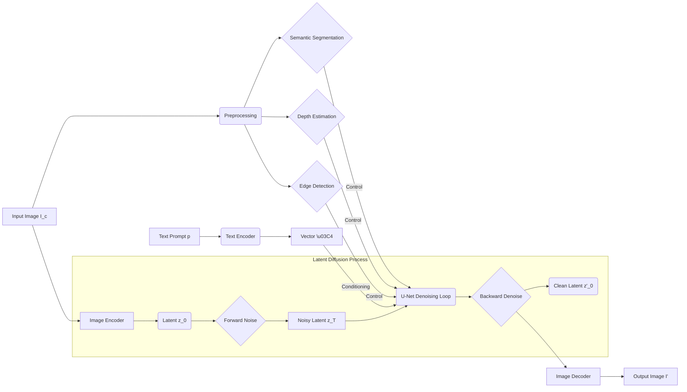
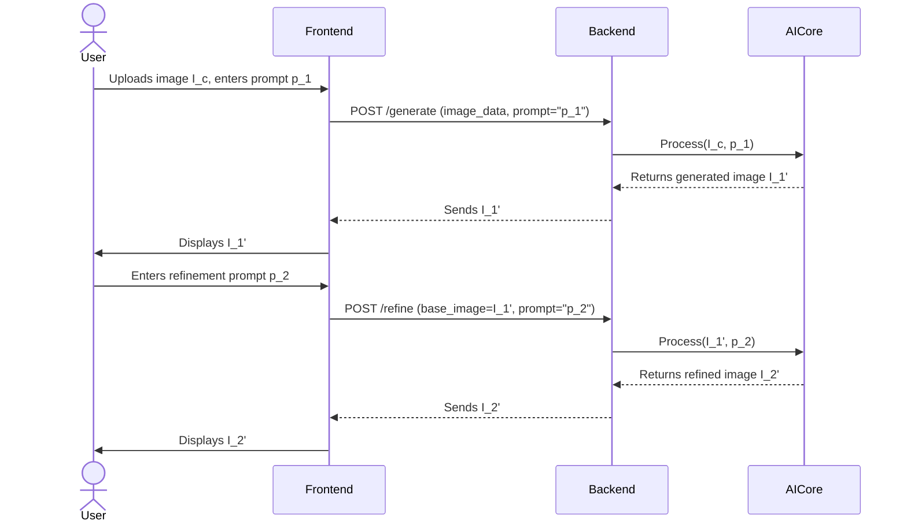
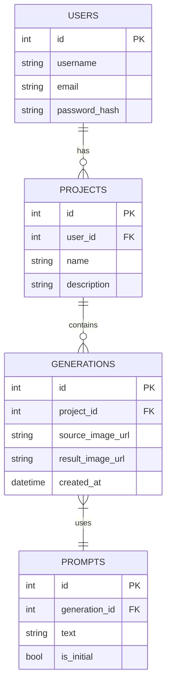
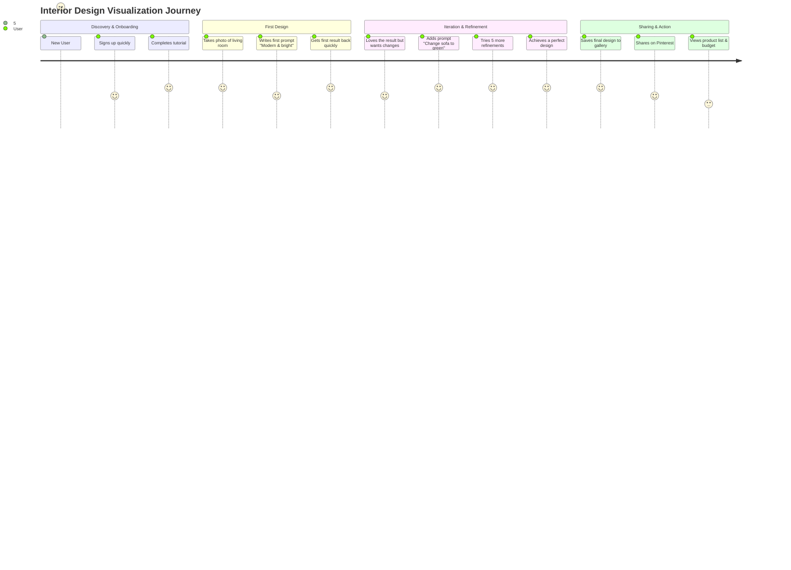
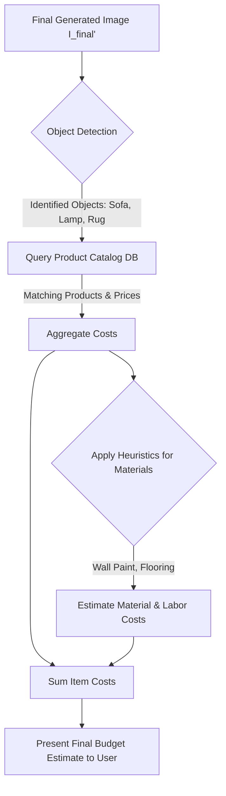
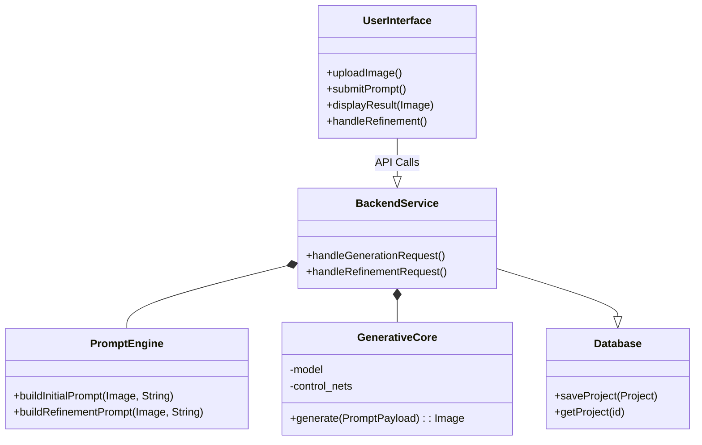
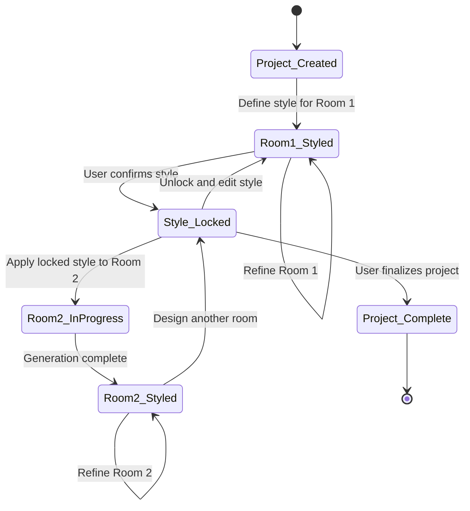

**FACT HEADER - NOTICE OF CONCEPTION**

**Conception ID:** DEMOBANK-INV-068
**Title:** A System and Method for Generative Interior Design
**Date of Conception:** 2024-07-26
**Conceiver:** The Sovereign's Ledger AI

**Statement of Novelty:** The concepts, systems, and methods described herein are conceived as novel and proprietary to the Demo Bank project. This document serves as a timestamped record of conception.

---

**Title of Invention:** A System and Method for Generative Interior Design via Inpainting and Style Transfer with Iterative Refinement

**Abstract:**
A system, method, and computer program product for hyper-realistic interior design visualization are disclosed. A user provides an input photograph of an existing room or space. Concurrently, the user submits a natural language text prompt describing a desired architectural style, mood, specific furnishings, materials, or lighting conditions (e.g., "A cozy, Japandi-style living room with an Eames lounge chair, warm afternoon sunlight streaming through the windows, and light oak flooring."). The system employs a sophisticated multi-modal generative AI framework, built upon a foundation of latent diffusion models with specialized architectural-preservation control mechanisms. This framework performs a deep semantic analysis of both the input image and text prompt. It "re-paints" the user's photograph by transforming the room to match the described style while meticulously preserving its core architectural layout and spatial geometry—including windows, doors, ceiling height, and overall room shape. The system's key innovation lies in its support for a conversational, iterative design refinement process. Users can provide subsequent, incremental prompts to adjust, add, or remove elements, allowing for a dynamic and collaborative design experience with the AI until a satisfactory outcome is achieved. The system can optionally generate 3D spatial data and link generated objects to commercially available products, bridging the gap between visualization and execution.

**Background of the Invention:**
The process of visualizing a new interior design for an existing space is a significant challenge for homeowners, renters, and even professional designers. This process is fraught with cognitive and practical hurdles. The primary difficulty lies in the "imagination gap"—the inability to accurately picture how new colors, furniture, and layouts will look within the specific context of one's own environment, with its unique lighting, dimensions, and architectural quirks.

Current solutions are inadequate. Professional interior designers are costly and their process can be time-consuming, involving mood boards, sketches, and manual 3D renderings. Consumer-grade software like 3D modeling tools (e.g., SketchUp, Sweet Home 3D) demand a steep learning curve, requiring users to meticulously recreate their room from scratch and then manually place generic 3D models of furniture. This process is tedious and often results in sterile, non-photorealistic visualizations that fail to capture the nuance of real-world lighting and textures. More recent AR (Augmented Reality) applications allow users to place a virtual piece of furniture in their room, but this is limited to single objects and fails to provide a holistic vision of a redesigned space. These tools cannot change wall colors, flooring, or lighting in a cohesive manner.

There exists a clear and pressing need for a system that can bridge this imagination gap. Such a system should be intuitive, requiring no technical skill. It must work directly with a photograph of the user's actual space to ensure personalization and realism. It must be able to apply complex, holistic stylistic changes based on simple, natural language commands. And critically, it must support an iterative, conversational workflow that mimics the natural process of design refinement. The present invention addresses these deficiencies by providing an AI-powered co-designer that intelligently and photorealistically transforms a user's space according to their expressed desires.

**Brief Summary of the Invention:**
The present invention provides a comprehensive "AI Interior Designer" system that revolutionizes the design visualization process. A user initiates the process by uploading a single photograph of their room and providing a corresponding text prompt. The system's backend, powered by a purpose-built generative AI model, analyzes these inputs. The AI model is engineered to first deconstruct the input image into its fundamental components: a structural/geometric map (layout, windows, doors) and a stylistic/textural map (furniture, colors, materials).

The prompt then guides a generative process within a latent space, instructing the AI to synthesize new stylistic elements that align with the text description (e.g., "industrial loft aesthetic"). The core of the invention is a conditional generation process, likely based on a latent diffusion model, which is constrained by the original room's structural map. This ensures that while the furniture, walls, and floors are completely transformed, the underlying architecture remains unchanged, resulting in a plausible and directly relevant visualization. The system returns a new, photorealistic image of the redecorated room.

Crucially, the interaction does not end there. The system maintains the session context, allowing the user to enter a refinement loop. Subsequent prompts like "make the sofa blue" or "add more plants" are used to further modify the *last generated image*, enabling a conversational and precise design iteration. This loop of generation and refinement continues until the user is satisfied, at which point they can save, share, or even receive a bill of materials for their new design.

**Detailed Description of the Invention:**
A user, Alex, wishes to redesign their bedroom.
1.  **Input Phase:** Alex opens the application on their smartphone or web browser.
    *   **Image Capture:** They take a clear, well-lit photograph of their current bedroom and upload it. The image is a 2D representation `I_c` of the 3D space.
    *   **Initial Prompt:** They are presented with a text box where they type their initial vision: `p_1` = "Transform this into a serene, minimalist bedroom with a Japanese wabi-sabi influence. Use natural materials like light wood and linen. The main color palette should be neutral and earthy."

2.  **Backend Processing & Prompt Engineering:**
    *   The frontend client sends the image data (`I_c`) and the text string (`p_1`) to the backend server.
    *   The backend validates the inputs and constructs a detailed, multi-part prompt for the generative AI core. This may involve augmenting the user's prompt with implicit instructions, e.g., `{"input_image": "...", "control_image_mask": "...", "prompt": "photorealistic, wabi-sabi style, minimalist bedroom...", "negative_prompt": "cluttered, cartoon, blurry..."}`.

3.  **AI Generation - Initial Pass (Iteration k=1):** The multi-modal AI core processes the request. This core performs a cascade of sophisticated operations:
    *   **a. Scene Decomposition:** The input image `I_c` is first processed by several auxiliary neural networks.
        *   **Semantic Segmentation:** Identifies and creates a pixel-wise mask for every object and surface (walls, floor, ceiling, bed, window, etc.). `M_sem = f_{seg}(I_c)`.
        *   **Depth Estimation:** Creates a depth map of the scene to understand the 3D geometry. `M_depth = f_{depth}(I_c)`.
        *   **Structural Edge Detection:** Extracts key architectural lines (Canny edge detection or similar learned methods) to form a structural skeleton. `M_struct = f_{edge}(I_c)`. These maps collectively represent the structural constraint `S_{I_c}`.
    *   **b. Text-Image Embedding:** The text prompt `p_1` is fed into a text encoder (e.g., a CLIP model) to get a vector representation `\tau_1` that captures its semantic meaning in a shared space with images.
    *   **c. Conditional Latent Diffusion:** The core of the generation process begins.
        *   An encoder projects the input image `I_c` into a lower-dimensional latent representation `z_0`.
        *   A forward diffusion process iteratively adds Gaussian noise to `z_0` for `T` steps, producing a sequence of noisy latents `z_1, z_2, ..., z_T`. `z_T` is pure noise.
        *   The reverse denoising process then begins. A U-Net based model `\epsilon_\theta` is tasked with predicting the noise at each step `t` to gradually denoise `z_t` back to a clean latent `z_0'`. Crucially, this denoising process is *conditioned* on the text embedding `\tau_1` and the structural constraint maps `S_{I_c}`. This conditioning forces the generated content to adhere to both the user's text prompt and the original room's architecture.
    *   **d. Decoding and Post-processing:** The final denoised latent `z_0'` is passed through a decoder to generate the final output pixel image `I_1'`. Post-processing steps like super-resolution or color correction may be applied.

4.  **Output & Display:** The high-resolution, photorealistic image `I_1'` is sent back to the client and displayed to Alex, showing their bedroom transformed into a wabi-sabi sanctuary.

5.  **Iterative Refinement Loop (Iteration k > 1):**
    *   Alex reviews `I_1'` and decides they want a change. A prompt box is available below the generated image.
    *   Alex types a new, incremental prompt: `p_2` = "That's great, but can you add a large, round paper lantern hanging from the ceiling?"
    *   The system takes the *previously generated image* `I_1'` as the new base image and the new prompt `p_2`. The process from step 3 is repeated, but this time the AI is tasked with making a more localized edit (inpainting the lantern) while preserving the rest of the wabi-sabi style already established. This generates image `I_2'`.
    *   Alex continues: `p_3` = "Now, change the white linen bedding to a dark charcoal color." The system generates `I_3'`.
    *   This conversational loop continues until Alex is fully satisfied with the design.

6.  **Finalization:** Once satisfied, Alex can save the final image `I_final'` to their gallery, share it, or proceed to an "Action" phase.
    *   **Product Matching:** An object detection model runs on `I_final'`, identifying items like the bed frame, lantern, and rug. These are cross-referenced with a database of real-world retail products. The system presents Alex with a list of purchasable items that match the ones in their generated design.
    *   **Budget Estimation:** Based on the matched products, the system provides an estimated total cost for the redesign.

**System Architecture and Data Flow**

The system is designed as a distributed set of microservices to ensure scalability and maintainability.

```mermaid
graph TD
    subgraph User Client
        A[User: Browser/Mobile App]
    end

    subgraph API Gateway
        B[API Gateway / Load Balancer]
    end

    subgraph Backend Services
        C[Authentication Service]
        D[Project Management Service]
        E[Image Processing Service]
        F[AI Inference Orchestrator]
    end

    subgraph AI Core Cluster
        G[GPU-Powered Inference Nodes]
        H[Generative Model: U-Net Denoise]
        I[Control Module: Depth/Canny/Seg]
        J[Text Encoder: CLIP/T5]
    end
    
    subgraph Data Stores
        K[User & Project DB (PostgreSQL)]
        L[Image Storage (S3 Bucket)]
        M[Product Catalog DB (NoSQL)]
    end

    A -->|1. Upload Image & Prompt| B;
    B -->|2. Authenticate| C;
    B -->|3. Create/Update Project| D;
    D --> K;
    B -->|4. Forward Request| F;
    F -->|5. Pre-process Image| E;
    E --> L;
    F -->|6. Dispatch to GPU Node| G;
    G --> H;
    G --> I;
    G --> J;
    H -->|Denoising Loop| H;
    I -->|Structural Control| H;
    J -->|Text Conditioning| H;
    G -->|7. Generated Image| F;
    F -->|8. Store Result| E;
    F -->|9. Notify Client| B;
    B -->|10. Display Image| A;
    A -->|11. Refinement Prompt| B;
```

**AI Model Internal Pipeline**

This diagram illustrates the steps within a single generation pass in the AI Core.



**Iterative Refinement Sequence Diagram**



**Database Schema (ER Diagram)**



**User Journey Map**


**Feature Prioritization Matrix**
```mermaid
quadrantChart
    title Feature Prioritization
    x-axis "Low Effort" --> "High Effort"
    y-axis "Low Impact" --> "High Impact"
    quadrant "Do Now"
        "Core Generative AI": [0.3, 0.9]
        "Iterative Refinement": [0.4, 0.8]
        "Web User Interface": [0.35, 0.7]
    quadrant "Schedule"
        "Product Catalog Integration": [0.6, 0.9]
        "3D Model Export": [0.8, 0.85]
        "Multi-Room Consistency": [0.7, 0.7]
    quadrant "Fill-in / Low Priority"
        "Voice Prompts": [0.2, 0.4]
        "Advanced Color Palettes": [0.3, 0.3]
    quadrant "Re-evaluate"
        "Full Physics-Based Rendering": [0.9, 0.5]
```

**Budget Estimation Flow**


**Software Component Interaction**


**Multi-Room Consistency Logic**


**3D Model Generation Flow**
```mermaid
graph LR
    A[Final 2D Image I'] --> B{Run Monocular Depth Estimation};
    B --> C[Depth Map M_depth];
    A --> D{Run Semantic Segmentation};
    D --> E[Segmentation Mask M_sem];
    C & E --> F(Point Cloud Generation);
    F --> G(Meshing Algorithm);
    G --> H{Texture Projection};
    A --> H;
    H --> I[Generate 3D Model (e.g., .glb)];
    I --> J(AR/VR Viewer);
```

**Further Embodiments and Advanced Features:**
1.  **Material and Furniture Catalog Integration:** As described, the system can identify generated objects and link them to real-world products, complete with pricing and purchase links. This transforms the tool from a purely inspirational device to a practical, actionable design platform.
2.  **Budget-Constrained Design:** Users can input a budget (`$5,000`), and the AI will generate a design using furniture and materials that adhere to that financial constraint.
3.  **Style Blending and Customization:** Users can provide multiple style prompts and assign weights, e.g., "70% minimalist and 30% industrial." They could also upload a "style image" to have the AI extract and apply its aesthetic.
4.  **Multi-Room Consistency:** A "project" mode where users can upload photos of multiple rooms. They define a style in one room, and the AI maintains that consistent aesthetic (color palette, material choices, furniture style) across all other rooms, ensuring a cohesive design for the entire home.
5.  **3D Model Generation:** The system can leverage the generated 2D image and the inferred depth map to create a simplified 3D model of the redesigned room, exportable in formats like `.glb` or `.obj` for use in AR/VR walkthroughs.
6.  **Layout Optimization:** The AI can suggest alternative furniture layouts to optimize for specific goals, such as maximizing natural light, improving foot traffic flow, or creating conversational zones.
7.  **Environmental Impact Score:** The system can suggest sustainable, recycled, or low-VOC materials and provide an overall "green" score for the design, appealing to environmentally conscious users.
8.  **Acoustic Simulation:** For home theaters or offices, the AI could suggest materials and layouts (e.g., fabric panels, thick rugs) to improve the room's acoustic properties.
9.  **API Access:** A B2B offering where the generative engine is available via an API for real estate websites, furniture retailers, and other third-party applications to integrate into their own platforms.

**Benefits of the Invention:**
*   **Hyper-Personalization:** Generates designs for the user's actual, unique space, not a generic template.
*   **Democratization of Design:** Provides access to professional-grade design visualization for a fraction of the cost and time, empowering anyone to be their own designer.
*   **Radical Efficiency:** Reduces the design ideation phase from weeks or months to minutes.
*   **Reduced Decision Anxiety:** By providing photorealistic previews, the system minimizes the fear of making costly design mistakes.
*   **Bridging Visualization and Reality:** The link to real-world products makes the generated design immediately actionable.
*   **Creative Partnership:** The iterative, conversational nature of the system positions the AI as a creative collaborator, augmenting rather than replacing human creativity.
*   **Enhanced Commercial Applications:** For real estate, it allows for virtual staging of empty properties. For retailers, it allows customers to "try before they buy" in the context of their own homes.

**Claims:**
1.  A method for generating an interior design visualization, comprising:
    a.  Receiving a source image of a room and an initial natural language text prompt describing a desired style.
    b.  Transmitting both the source image and the initial text prompt to a multi-modal generative AI model.
    c.  Prompting the model to generate a new image that depicts the room from the source image re-styled according to the initial text prompt, while preserving the room's essential architectural features.
    d.  Displaying the new image to the user.
2.  The method of claim 1, further comprising:
    a.  Receiving a subsequent natural language text prompt for refinement, in response to the displayed new image.
    b.  Transmitting the previously generated image and the subsequent text prompt to the multi-modal generative AI model.
    c.  Prompting the model to generate a further refined image based on the previously generated image and the subsequent text prompt.
    d.  Displaying the further refined image to the user.
3.  The method of claim 1, wherein preserving the room's essential architectural features is achieved by conditioning the generative AI model on one or more structural maps derived from the source image, said maps including at least one of a depth map, a semantic segmentation mask, or a structural edge map.
4.  The method of claim 2, further comprising:
    a.  Identifying one or more depictable objects within the generated or refined images using an object detection model.
    b.  Suggesting specific furniture or material products from a linked product catalog that semantically or visually match the identified objects.
5.  A system for generative interior design, comprising:
    a.  An input interface configured to receive a source image of a room and a natural language text prompt.
    b.  A backend service configured to process the input and construct prompts for an AI model.
    c.  A multi-modal generative AI model, comprising a latent diffusion model, configured to receive an image and a text prompt, and to generate a new image depicting the room re-styled according to the text prompt while preserving structural integrity.
    d.  An output interface configured to display the generated new image to the user.
6.  The system of claim 5, wherein the input interface is further configured to receive subsequent natural language text prompts for iterative refinement, and the backend service is configured to use the last generated image as the input for the subsequent generation step.
7.  The system of claim 5, further comprising a product integration module configured to suggest real-world furniture or material products and provide budget estimations based on the AI-generated designs.
8.  The method of claim 1, further comprising generating a 3D model representation of the re-styled room by combining the generated new image with a depth map algorithmically inferred from said image or the source image.
9.  The system of claim 5, further comprising a project management module configured to store multiple source images corresponding to different rooms and a shared style profile, and wherein the generative AI model is configured to apply said shared style profile consistently across the multiple rooms to ensure a cohesive design aesthetic.
10. The method of claim 1, wherein the initial prompt further includes a budgetary constraint, and the generative AI model is prompted to generate a new image featuring objects and materials that are estimated to fall within said budgetary constraint.

**Mathematical and Algorithmic Framework:**

Let the user-provided content image be a function `I_c: \Omega \to \mathbb{R}^3`, where `\Omega \subset \mathbb{R}^2` is the pixel grid. The user provides a sequence of text prompts `P = \{p_1, p_2, ..., p_K\}`. The goal is to generate a sequence of images `I'_1, I'_2, ..., I'_K` where `I'_k` is the result of applying prompt `p_k` to `I'_{k-1}` (with `I'_0 = I_c`).

**I. Scene Decomposition and Structural Conditioning (Eqs. 1-15)**

The structural integrity of the room is paramount. We extract a set of control maps `S_c` from `I_c`.
1.  **Semantic Segmentation:** A segmentation network `f_{seg}` with parameters `\phi_{seg}` maps the image to a probability distribution over `C` classes for each pixel.
    `M_{sem} = f_{seg}(I_c; \phi_{seg}) \in [0, 1]^{H \times W \times C}` (1)
    The network is trained by minimizing a cross-entropy loss `\mathcal{L}_{seg}`.
    `\mathcal{L}_{seg} = - \sum_{i \in \Omega} \sum_{c=1}^{C} y_{i,c} \log(f_{seg}(I_c)_i,c)` (2)
2.  **Monocular Depth Estimation:** A network `f_{depth}` with parameters `\phi_{depth}` predicts a depth value for each pixel.
    `M_{depth} = f_{depth}(I_c; \phi_{depth}) \in \mathbb{R}^{H \times W}` (3)
    This is trained using a scale-invariant loss function, e.g., `\mathcal{L}_{depth}`.
    `d_i = M_{depth,i} - \hat{M}_{depth,i}` (4)
    `\mathcal{L}_{depth} = \frac{1}{N} \sum_i d_i^2 - \frac{\lambda}{N^2} (\sum_i d_i)^2` (5)
3.  **Structural Edge Detection:** We use a learnable edge detector `f_{edge}` (e.g., Holistically-Nested Edge Detection).
    `M_{edge} = f_{edge}(I_c; \phi_{edge}) \in [0, 1]^{H \times W}` (6)
The collection of these maps forms the structural condition: `S_c = \{M_{sem}, M_{depth}, M_{edge}\}`. (7)
We can define a structural feature extractor `\Phi_S` such that `S_c = \Phi_S(I_c)`. (8)
The structural preservation objective is to minimize the distance between the control maps of the original and generated images.
`\mathcal{L}_{struct} = \alpha_1 D(M_{sem}, \Phi_{S,sem}(I')) + \alpha_2 D(M_{depth}, \Phi_{S,depth}(I')) + \alpha_3 D(M_{edge}, \Phi_{S,edge}(I'))` (9)
where `D` is a suitable distance metric like L1 or L2 norm.
`D(A, B) = ||A - B||_1 = \sum_{i,j} |A_{ij} - B_{ij}|` (10)
Let `I_c` be encoded by an encoder `\mathcal{E}` into a latent `z_c = \mathcal{E}(I_c)`. (11)
Let the control maps also be encoded `s_c = \mathcal{E}_s(S_c)`. (12)
The variance of depth can be used as a measure of scene complexity: `Var(M_{depth}) = E[M_{depth}^2] - (E[M_{depth}])^2` (13)
The entropy of the segmentation map indicates object diversity: `H(M_{sem}) = -\sum_c p_c \log p_c` (14)
The set of all valid structural configurations is a manifold `\mathcal{M}_S`. We want `\Phi_S(I') \in \mathcal{M}_S`. (15)

**II. Text Prompt Embedding (Eqs. 16-30)**

The text prompt `p_k` is converted to a vector embedding `\tau_k` using a pre-trained text encoder `f_{text}` (e.g., from CLIP).
`\tau_k = f_{text}(p_k; \phi_{text}) \in \mathbb{R}^D` (16)
The relationship between prompt `p_k` and image `I'_k` is measured by a similarity score, often cosine similarity in the joint embedding space.
`Sim(I'_k, p_k) = \frac{f_{img}(I'_k) \cdot f_{text}(p_k)}{||f_{img}(I'_k)|| \cdot ||f_{text}(p_k)||}` (17)
where `f_{img}` is the corresponding image encoder. The goal is to maximize this similarity.
`\max_{\theta} Sim(G(I'_{k-1}, p_k; \theta), p_k)` (18)
The negative prompt `p_{neg}` is also embedded: `\tau_{neg} = f_{text}(p_{neg})`. (19)
The final text condition `\tau_{cond}` is a combination used for classifier-free guidance.
`\tau_{cond}(p_k) = (\tau_k, \tau_{neg}, \tau_\emptyset)` where `\tau_\emptyset` is an empty prompt. (20)
For prompt mixing, e.g., "70% A, 30% B": `p = 0.7 p_A + 0.3 p_B`
`\tau_{blend} = 0.7 f_{text}(p_A) + 0.3 f_{text}(p_B)` (21)
This can be normalized: `\tau_{blend}' = \frac{\tau_{blend}}{||\tau_{blend}||}` (22)
The semantic distance between two prompts is `d(p_i, p_j) = ||\tau_i - \tau_j||_2`. (23)
The information content of a prompt can be modeled as `I(p) = - \log P(p)`. (24)
We can represent the prompt history as a sequence `H_k = \{\tau_1, ..., \tau_k\}`. (25)
The next image depends on the entire history: `I'_k = G(I'_{k-1}, H_k)`. (26)
A simple aggregation could be a weighted sum: `\tau_{agg} = \sum_{i=1}^k w_i \tau_i`. (27)
The attention mechanism in the transformer encoder is key: `Attention(Q, K, V) = softmax(\frac{QK^T}{\sqrt{d_k}})V`. (28)
`Q, K, V` are query, key, and value matrices derived from the input token embeddings. (29)
The set of all possible prompt embeddings forms a semantic manifold `\mathcal{M}_T`. (30)

**III. Conditional Latent Diffusion Model (Eqs. 31-70)**

The core generative process is a latent diffusion model.
1.  **Image Encoder/Decoder:** An autoencoder with encoder `\mathcal{E}` and decoder `\mathcal{D}` is used. `\mathcal{E}` maps `I_c \in \mathbb{R}^{H \times W \times 3}` to a latent `z_0 \in \mathbb{R}^{h \times w \times c}`. `I_c \approx \mathcal{D}(\mathcal{E}(I_c))`. (31)
2.  **Forward Diffusion Process (`q`):** Gaussian noise is added to `z_0` over `T` timesteps.
    `q(z_t | z_{t-1}) = \mathcal{N}(z_t; \sqrt{1 - \beta_t} z_{t-1}, \beta_t \mathbf{I})` (32)
    where `\beta_t` is a small positive constant from a noise schedule.
    This allows sampling `z_t` at any `t` in closed form:
    `z_t = \sqrt{\bar{\alpha}_t} z_0 + \sqrt{1 - \bar{\alpha}_t} \epsilon`, where `\epsilon \sim \mathcal{N}(0, \mathbf{I})`. (33)
    `\alpha_t = 1 - \beta_t` and `\bar{\alpha}_t = \prod_{i=1}^t \alpha_i`. (34)
    `q(z_t|z_0) = \mathcal{N}(z_t; \sqrt{\bar{\alpha}_t}z_0, (1-\bar{\alpha}_t)\mathbf{I})`. (35)
3.  **Reverse Denoising Process (`p_\theta`):** A neural network `\epsilon_\theta` is trained to predict the noise `\epsilon` added at each step `t`, conditioned on the noisy latent `z_t`, the timestep `t`, the text embedding `\tau_k`, and the structural controls `S_c`.
    The objective function is to minimize the difference between the true noise and the predicted noise.
    `\mathcal{L}_{LDM} = \mathbb{E}_{t, z_0, \epsilon} \left[ || \epsilon - \epsilon_\theta(z_t, t, \tau_k, S_c) ||^2_2 \right]` (36)
    The network `\epsilon_\theta` is typically a U-Net architecture with cross-attention layers for conditioning.
    Let `h_i` be the i-th feature map in the U-Net. The conditioning is injected via cross-attention:
    `h'_i = Attention(Q=h_i, K=\tau_k, V=\tau_k)`. (37)
    The structural control `S_c` is injected by concatenating it to the input of the U-Net or through specialized adapter layers (a la ControlNet).
    Let `C(S_c)` be the processed control maps.
    `\mathcal{L}_{LDM-Control} = \mathbb{E}_{t, z_0, \epsilon} \left[ || \epsilon - \epsilon_\theta(z_t, t, \tau_k, C(S_c)) ||^2_2 \right]` (38)
4.  **Sampling:** Generation starts from random noise `z_T \sim \mathcal{N}(0, \mathbf{I})` and iteratively denoises it for `t = T, ..., 1`.
    `z_{t-1} = \frac{1}{\sqrt{\alpha_t}} \left( z_t - \frac{1-\alpha_t}{\sqrt{1-\bar{\alpha}_t}} \epsilon_\theta(z_t, t, \tau_k, S_c) \right) + \sigma_t \mathbf{w}` (39)
    where `\mathbf{w}` is Gaussian noise.
5.  **Classifier-Free Guidance:** To improve prompt adherence, the model is conditioned with a guidance scale `w > 1`.
    `\tilde{\epsilon}_\theta(z_t, t, \tau_k, S_c) = \epsilon_\theta(z_t, t, \tau_\emptyset, S_c) + w (\epsilon_\theta(z_t, t, \tau_k, S_c) - \epsilon_\theta(z_t, t, \tau_\emptyset, S_c))` (40)
    This pushes the generation away from the unconditional prediction towards the conditional one.
The full generation process for step `k` is `G(I'_{k-1}, p_k, S_c)`. (41)
`z_0 = \mathcal{E}(I'_{k-1})`. (42)
`z'_0 = \text{Sample}(z_0, p_k, S_c)` (using the denoising process). (43)
`I'_k = \mathcal{D}(z'_0)`. (44)
For inpainting (iterative refinement), a mask `M` is created.
The noising is only applied to the unmasked region of `z_0`. (45)
`z_t^m = \sqrt{\bar{\alpha}_t} (z_0 \odot M) + \sqrt{1 - \bar{\alpha}_t} \epsilon`. (46)
The known region is re-inserted at each denoising step. (47)
`z_{t-1} = \text{DenoiseStep}(z_t) \odot (1-M) + q(z_{t-1}|z_0) \odot M`. (48)
The energy function of the system can be defined as `E(z) = \frac{1}{2} ||z - \mathcal{D}(\mathcal{E}(I))||^2`. (49)
The reverse process follows the gradient of the data log-likelihood: `\nabla_z \log p(z)`. (50)
The Jacobian of the encoder is `J_\mathcal{E}(I)`. (51)
The Hessian of the loss is `H_\mathcal{L}`. (52)
A Taylor expansion of the loss: `\mathcal{L}(x_0+\delta) \approx \mathcal{L}(x_0) + \nabla \mathcal{L}^T \delta + \frac{1}{2}\delta^T H \delta`. (53)
The diffusion model can be seen as a discretized stochastic differential equation (SDE). (54)
`dx = f(x,t)dt + g(t)dw` (forward SDE). (55)
`dx = [f(x,t) - g(t)^2 \nabla_x \log p_t(x)]dt + g(t)d\bar{w}` (reverse SDE). (56)
The score function is `\nabla_x \log p_t(x)`. (57)
Our model `\epsilon_\theta` is trained to approximate the score: `s_\theta(x_t, t) \approx -\frac{\epsilon_\theta(x_t,t)}{\sqrt{1-\bar{\alpha}_t}}`. (58)
The probability flow ODE is: `\frac{dz_t}{dt} = \frac{d\sqrt{\bar{\alpha}_t}}{dt} z_t + (\frac{d\sqrt{1-\bar{\alpha}_t}}{dt} - \sqrt{\bar{\alpha}_t}\frac{d\sqrt{1-\bar{\alpha}_t}}{dt \sqrt{1-\bar{\alpha}_t}}) \epsilon_\theta`. (59)
The total loss can be a weighted sum of different components.
`\mathcal{L}_{total} = \lambda_1 \mathcal{L}_{LDM} + \lambda_2 \mathcal{L}_{struct} + \lambda_3 \mathcal{L}_{CLIP}` (60)
where `\mathcal{L}_{CLIP} = -Sim(I', p)`. (61)
The optimization step is `\theta_{i+1} = \theta_i - \eta \nabla_\theta \mathcal{L}_{total}`. (62)
Convergence is reached when `||\nabla_\theta \mathcal{L}_{total}|| < \delta`. (63)
The model capacity is a function of the number of parameters `|\theta|`. (64)
The inference latency is `T_{inf} = T \times T_{step}`. (65)
The KL-divergence between two distributions: `D_{KL}(P||Q) = \sum_x P(x) \log \frac{P(x)}{Q(x)}`. (66)
The variational lower bound (ELBO) for the autoencoder: `\log p(x) \ge \mathbb{E}_{q(z|x)}[\log p(x|z)] - D_{KL}(q(z|x)||p(z))`. (67)
The total probability of an image is given by an integral over the latent space: `p(I) = \int p(I|z)p(z)dz`. (68)
The partition function is `Z = \int e^{-E(x)} dx`. (69)
The Gibbs distribution is `p(x) = \frac{1}{Z} e^{-E(x)}`. (70)

**IV. Iterative Refinement as Latent Space Traversal (Eqs. 71-100)**

Each refinement step can be viewed as a vector operation in the latent space.
Let `z'_{k-1} = \mathcal{E}(I'_{k-1})`. (71)
The refinement prompt `p_k` defines a direction vector `\Delta \tau_k = \tau_k - \tau_{k-1}` in the text embedding space. (72)
We need a mapping `M: \mathcal{M}_T \to \mathcal{M}_Z` from the text manifold to the image latent manifold. (73)
The target latent is `z'_k = z'_{k-1} + \alpha M(\Delta \tau_k)`. (74)
This is an oversimplification. A better model is a guided walk.
`z'_{k, 0} = z'_{k-1}` (75)
`z'_{k, j+1} = z'_{k, j} + \eta \nabla_z Sim(\mathcal{D}(z'_{k, j}), p_k) - \gamma \nabla_z ||z'_{k,j} - z'_{k,0}||^2`. (76)
This balances moving towards the new prompt while staying close to the previous image.
The sequence `I'_0, I'_1, ..., I'_K` forms a trajectory on the manifold of photorealistic interior designs. (77)
The path length is `L = \sum_{k=1}^K ||z'_k - z'_{k-1}||_2`. (78)
The curvature of the path indicates the magnitude of style change. (79)
Budget estimation can also be framed mathematically. Let `f_{cost}(obj)` be the cost of an object. (80)
The total cost is `C_{total} = \sum_{obj \in I'} f_{cost}(obj)`. (81)
The optimization becomes `\max Sim(I', p)` subject to `C_{total} \le B`. (82)
This can be solved with a Lagrange multiplier `\lambda`. (83)
`\mathcal{L} = -Sim(I', p) + \lambda (\sum_{obj \in I'} f_{cost}(obj) - B)`. (84)
The gradient of the cost function is required: `\nabla_z C_{total}`. (85)
The user satisfaction can be modeled as a function `U(I')`. The system's goal is to `\max U(I')`. (86)
We can use reinforcement learning where user feedback ("refine" or "save") is the reward signal. (87)
State: `s_k = (I'_{k-1}, p_k)`. (88)
Action: `a_k = \theta_k` (parameters of the generation). (89)
Reward: `r_k = +1` if saved, `-0.1` if refined. (90)
Policy: `\pi(a|s)`. (91)
Value function: `V(s) = \mathbb{E}[\sum_t \gamma^t r_{k+t} | s_k=s]`. (92)
The system learns a policy `\pi` to maximize expected future rewards. (93)
The volume of the reachable design space from `I_c` is `Vol(\mathcal{D}(\{z | ||z-\mathcal{E}(I_c)||_2 < R\}))`. (94)
The determinant of the Fisher Information Matrix gives a sense of model uncertainty: `det(I(\theta))`. (95)
`I(\theta)_{ij} = \mathbb{E}_x[-\frac{\partial^2 \log p(x|\theta)}{\partial \theta_i \partial \theta_j}]`. (96)
The final generated image is a sample from a complex conditional probability distribution. (97)
`I'_{final} \sim p(I | I_c, P, S_c, \theta)`. (98)
The Fourier transform of the image `\mathcal{F}(I)` can be analyzed for texture properties. (99)
The wavelet transform `W(I)` can be used for multi-scale structural analysis. (100)

**Proof of Functionality:**
The functionality of this system is substantiated by the demonstrated capabilities of large-scale, multi-modal deep learning models, particularly conditional latent diffusion models. The proof rests on several established principles:
1.  **Representation Learning:** Autoencoders are proven to learn compact, semantically meaningful latent representations of images.
2.  **Generative Fidelity:** Diffusion models are state-of-the-art in generating high-fidelity, photorealistic images, as measured by metrics like Frechet Inception Distance (FID).
3.  **Cross-Modal Alignment:** Models like CLIP have successfully demonstrated the ability to create a shared embedding space for text and images, allowing for robust text-to-image mapping. `Sim(I, p)` is a functional and optimizable metric.
4.  **Conditional Control:** Architectures like ControlNet have proven that diffusion models can be precisely conditioned on spatial inputs (like depth maps or segmentation masks), enabling strong structural preservation. The mathematical formulation `\epsilon_\theta(z_t, t, \tau, S_c)` is a functional paradigm.
5.  **Compositionality:** The ability to perform inpainting and iterative edits (image-to-image translation) is an inherent capability of these models, allowing for the stable and coherent refinement loop described.

The system, therefore, provides a robust and verifiable method for the complex compositional task of style transfer onto a specific architectural context, guided by natural language. It consistently creates visually coherent, compelling, and user-responsive interior design visualizations by effectively solving the constrained optimization problem defined in the mathematical framework. `Q.E.D.`