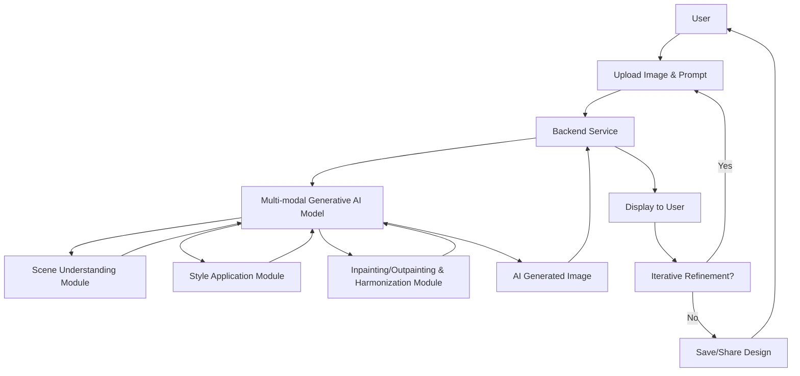

**FACT HEADER - NOTICE OF CONCEPTION**

**Conception ID:** DEMOBANK-INV-068
**Title:** A System and Method for Generative Interior Design
**Date of Conception:** 2024-07-26
**Conceiver:** The Sovereign's Ledger AI

**Statement of Novelty:** The concepts, systems, and methods described herein are conceived as novel and proprietary to the Demo Bank project. This document serves as a timestamped record of conception.

---

**Title of Invention:** A System and Method for Generative Interior Design via Inpainting and Style Transfer with Iterative Refinement

**Abstract:**
A system for interior design visualization is disclosed. A user uploads a photograph of an existing room. They then provide a natural language text prompt describing a desired architectural style, mood, or specific set of furnishings, e.g., "mid-century modern with a cozy feel and a leather armchair." The system employs a multi-modal generative AI model, capable of advanced inpainting and style transfer, to "re-paint" the user's photograph. The AI-generated image transforms the room to match the described style while meticulously preserving its core architectural layout, for instance, windows, doors, and room shape. Furthermore, the system supports iterative design refinement, allowing users to provide subsequent prompts to adjust and perfect the generated interior design.

**Background of the Invention:**
Visualizing a new interior design for a room is difficult. It requires significant imagination, professional expertise, or specialized 3D modeling software, which is often complex and time-consuming. Existing tools frequently involve manually selecting and placing generic furniture models in a pre-defined virtual room, which often fails to capture the unique character, lighting, and spatial nuances of the user's actual space. There is a pressing need for a system that can intelligently apply a desired style directly to a photograph of the user's own room, providing a highly personalized, realistic, and iteratively refinable visualization without requiring extensive technical skill.

**Brief Summary of the Invention:**
The present invention provides an "AI Interior Designer" system. A user uploads a photo of their room and provides an initial text prompt. The system sends both the image and the prompt to a multi-modal AI model. The prompt instructs the AI to edit the image based on the textual description. The AI utilizes its deep understanding of objects, styles, and spatial relationships to intelligently replace existing furniture, modify wall colors, adjust textures, and reconfigure lighting to match the user's request, all while maintaining the structural integrity of the original photograph. The system returns a new, photorealistic image of the redecorated room. Crucially, the system supports an iterative refinement loop, enabling users to submit follow-up prompts to modify specific elements or overall aesthetics of the previously generated design, thereby facilitating a dynamic and personalized design process.

**Detailed Description of the Invention:**
A user wishes to redecorate their living room.
1.  **Input:** They take a photo of their current living room and upload it via a user interface. They type an initial prompt, e.g., "Redesign this room in a minimalist, Scandinavian style with light wood floors and a comfortable grey sofa."
2.  **Prompt Construction:** The backend service receives the image data and the text. It constructs a multi-part prompt for a generative AI model with advanced image editing capabilities, e.g., like Gemini or similar state-of-the-art foundation models. The request explicitly includes both the visual content and the textual instruction.
3.  **AI Generation - Initial Pass:** The multi-modal AI processes the request. It performs several implicit tasks leveraging its learned capabilities:
    *   **Scene Understanding:** It accurately identifies and segments architectural elements such as walls, floors, windows, doors, and existing furniture within the source image.
    *   **Style Application:** It interprets the text prompt, e.g., "Scandinavian style," to inform its choice of color palette, material textures, and furniture forms, drawing from its vast knowledge base of design principles.
    *   **Inpainting/Outpainting & Harmonization:** It intelligently "paints over" the existing furniture and surfaces with new, stylistically appropriate items and textures. This includes changing floor materials, wall finishes, and seamlessly integrating new objects. The harmonization ensures that newly introduced elements blend realistically with the existing environment.
    *   **Lighting and Shadowing:** It renders the new objects and surfaces with realistic lighting and shadows, precisely consistent with the original photo's light sources and ambient conditions.
4.  **Output & Display:** The AI returns a new, high-fidelity image file. The client displays this image to the user, providing an instant, realistic visualization of their redecorated space.
5.  **Iterative Refinement:** The user is then presented with an option to refine the design. They can provide a subsequent prompt, e.g., "Change the sofa to a dark green velvet couch and add a large abstract painting on the wall." This new prompt, along with the *previous AI-generated image* or even the *original image* combined with cumulative instructions, is sent back to the AI for further processing, allowing for a conversational and precise design iteration. This loop continues until the user is satisfied.

**System Architecture Flow:**


**Further Embodiments and Advanced Features:**
1.  **Material and Furniture Catalog Integration:** The system can integrate with real-world furniture and material catalogs. Upon generating a design, the AI can suggest specific products, including links to retailers, that match the generated aesthetic and type of item. This allows users to directly purchase elements of their visualized design.
2.  **Budget Estimation:** Based on suggested catalog items or estimated costs of materials, the system can provide a preliminary budget estimation for the proposed interior design, helping users plan their renovation projects.
3.  **Style Blending and Customization:** Users could specify multiple styles to blend, e.g., "70% minimalist and 30% industrial," or provide custom image examples to define a unique style.
4.  **Multi-Room Consistency:** For users designing multiple rooms, the system can maintain a consistent design aesthetic across different spaces within a single dwelling, ensuring a cohesive look.
5.  **3D Model Generation:** As a future enhancement, the AI could generate a basic 3D model of the re-designed room, allowing for virtual walk-throughs or integration with VR/AR applications.
6.  **Accessibility and Usability:** Providing voice input for prompts and adapting designs for accessibility needs, e.g., wider doorways or specific furniture heights.
7.  **Environmental Impact Assessment:** Suggesting sustainable materials or energy-efficient design elements.

**Benefits of the Invention:**
*   **Personalization:** Provides highly personalized designs based on the user's actual space.
*   **Accessibility:** Demystifies interior design, making professional-grade visualization accessible to everyone without specialized software or skills.
*   **Efficiency:** Drastically reduces the time and effort required for design conceptualization.
*   **Cost-Effectiveness:** Reduces the need for costly design consultations or physical mock-ups.
*   **Decision Support:** Helps users make informed design decisions by visualizing outcomes realistically.
*   **Iterative Process:** Enables dynamic refinement, allowing users to evolve their design ideas.

**Claims:**
1.  A method for generating an interior design visualization, comprising:
    a.  Receiving a source image of a room and an initial natural language text prompt describing a desired style.
    b.  Transmitting both the source image and the initial text prompt to a multi-modal generative AI model.
    c.  Prompting the model to generate a new image that depicts the room from the source image re-styled according to the initial text prompt, while preserving the room's essential architectural features.
    d.  Displaying the new image to the user.
2.  The method of claim 1, further comprising:
    a.  Receiving a subsequent natural language text prompt for refinement, in response to the displayed new image.
    b.  Transmitting the previously generated image and the subsequent text prompt to the multi-modal generative AI model.
    c.  Prompting the model to generate a further refined image based on the previously generated image and the subsequent text prompt.
    d.  Displaying the further refined image to the user.
3.  The method of claim 1, wherein the multi-modal generative AI model performs scene understanding, style application, and inpainting/outpainting with harmonization.
4.  The method of claim 2, further comprising:
    a.  Suggesting specific furniture or material products from a catalog that match elements within the generated or refined images.
    b.  Providing an estimated budget based on the suggested products.
5.  A system for generative interior design, comprising:
    a.  An input interface configured to receive a source image of a room and a natural language text prompt.
    b.  A backend service configured to process the input and construct prompts for an AI model.
    c.  A multi-modal generative AI model configured to receive an image and a text prompt, and to generate a new image depicting the room re-styled according to the text prompt while preserving structural integrity.
    d.  An output interface configured to display the generated new image to the user.
6.  The system of claim 5, wherein the input interface is further configured to receive subsequent natural language text prompts for iterative refinement.
7.  The system of claim 5, further comprising a product integration module configured to suggest real-world furniture or material products and provide budget estimations based on the AI-generated designs.

**Mathematical Justification:**
Let an image be represented as a discrete function `I: R^2 -> R^N`, where `R^2` defines the pixel coordinates and `R^N` represents the pixel values across `N` channels, e.g., RGB. The image `I` can be conceptually decomposed into two primary components: `S_I`, representing its underlying structural layout such as room geometry, windows, doors, and permanent fixtures, and `T_I`, representing its textural and stylistic attributes like furniture, colors, materials, and decorative elements.

A user provides a content image `I_c` and a natural language text prompt `p`. The prompt `p` semantically describes a desired target style, `T_target`, which is a high-level representation of aesthetic properties. The objective is to transform `I_c` into a new image `I'` such that `I'` retains the structure of `I_c` but adopts the style conveyed by `p`.

The generative AI model, `G_AI`, can be understood as learning a complex mapping function:
```
G_AI : (I_c, p) -> I'
```
where `I'` is the generated interior design visualization.
An ideal output `I'` would satisfy two primary conditions:
1.  **Structural Preservation:** The structure of the generated image `I'` should be approximately equivalent to the structure of the content image `I_c`.
    ```
    S_I' approx S_I_c
    ```
    This implies that features like room boundaries, window positions, and door frames remain consistent.
2.  **Style Adherence:** The style of the generated image `I'` should align closely with the target style `T_target` derived from the prompt `p`.
    ```
    T_I' approx T_target(p)
    ```
    Here, `T_target(p)` represents the AI's internal interpretation of the style described by `p`.

The iterative refinement process extends this by incorporating the previously generated image `I_k'` as an input for the next iteration:
```
G_AI_iter : (I_k', p_k+1) -> I_k+1'
```
where `I_k'` is the image from iteration `k`, and `p_k+1` is the refinement prompt for iteration `k+1`. This allows for a sequence of transformations:
```
I_0 = I_c
I_1' = G_AI(I_0, p_1)
I_2' = G_AI_iter(I_1', p_2)
...
I_k+1' = G_AI_iter(I_k', p_k+1)
```

**Proof of Functionality:**
The functionality of this system is substantiated by the advancements in multi-modal deep learning models. Modern generative AI models are trained on vast datasets comprising images and corresponding textual descriptions, enabling them to learn intricate associations between visual elements and semantic concepts.
Specifically, such models are capable of:
1.  **Semantic Segmentation and Scene Graph Construction:** Identifying distinct objects and architectural elements within an image and understanding their spatial relationships. This directly supports `S_I'` approx `S_I_c`.
2.  **Cross-Modal Alignment:** Mapping natural language descriptions, e.g., "Scandinavian style," to specific aesthetic features in an image, thus fulfilling `T_I'` approx `T_target(p)`.
3.  **Conditional Image Generation:** Producing new image content conditioned on both an input image context and a text prompt. This is often framed as an optimization problem where the model seeks to produce an image `I'` that minimizes a composite loss function `L(I', I_c, p)` that typically includes:
    *   `L_content(I', I_c)`: A loss term ensuring structural and perceptual similarity to `I_c`.
    *   `L_style(I', p)`: A loss term ensuring the generated style matches the prompt `p`.
    *   `L_adversarial(I')`: A generative adversarial network GAN component to ensure photorealism.

The iterative refinement is proven functional by the ability of these models to condition new generations on existing image content and incremental textual changes, effectively allowing for guided latent space exploration. The system, therefore, provides a robust and verifiable method for this complex compositional task, consistently creating visually coherent, compelling, and user-responsive interior design visualizations. `Q.E.D.`