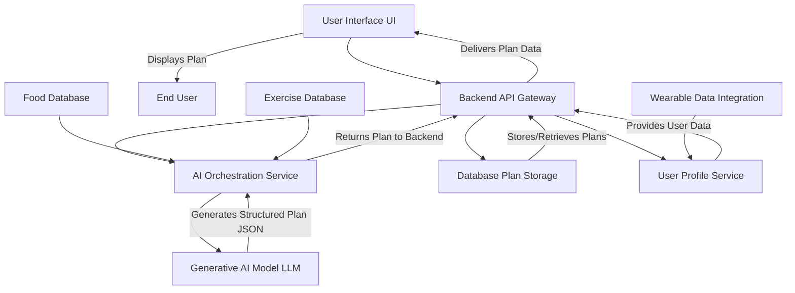
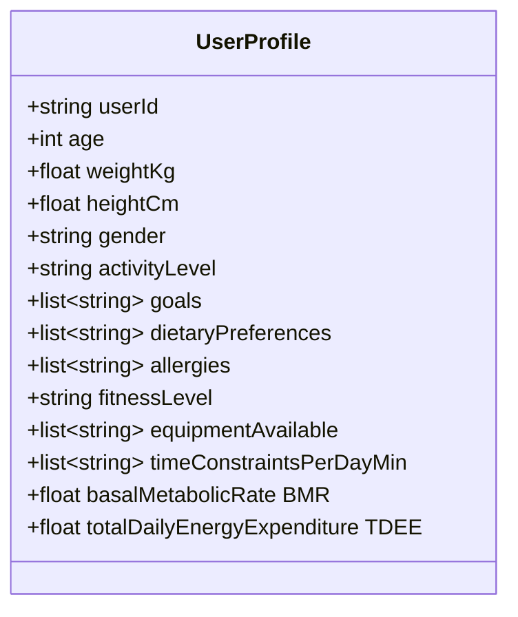
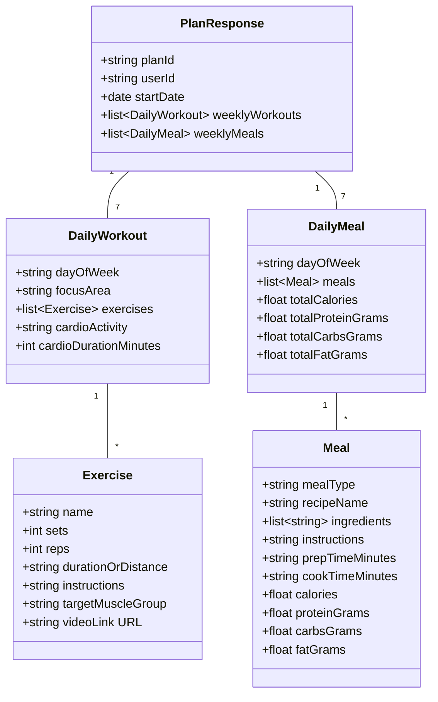

**Title of Invention:** System and Method for Generating Personalized Fitness and Nutrition Plans

**Abstract:**
A system for generating health plans is disclosed. A user provides their personal metrics (age, weight, height), goals (e.g., "lose 10 pounds," "run a 5k"), and dietary preferences. This information is sent to a generative AI model prompted to act as a certified personal trainer and nutritionist. The AI generates a comprehensive, personalized weekly workout schedule and a daily meal plan tailored to the user's specific profile and goals.

**Detailed Description:**

A user fills out a profile form via a frontend application. The backend sends this data to an LLM with a detailed prompt and a `responseSchema` to structure the workout and meal plan output. The AI generates a week-long schedule with specific exercises and a daily meal plan with recipes. This structured JSON is then rendered in a user-friendly calendar view.

### 1. System Architecture

The system comprises several interconnected components designed to facilitate the generation and delivery of personalized fitness and nutrition plans.



**Components:**

*   **User Interface [UI]:** A web or mobile application that allows users to input their personal data, goals, and preferences. It also serves as the display layer for the generated plans.
*   **Backend API Gateway:** Acts as the central entry point for all client requests. It handles authentication, routing, and orchestrates communication between various microservices.
*   **User Profile Service:** Manages user registration, profile creation, and stores all user-specific information `UserProfile`. This includes personal metrics, goals, and preferences. It can also integrate with external data sources like wearable devices.
*   **AI Orchestration Service:** Responsible for constructing the prompt for the `Generative AI Model LLM`, including user data and the `responseSchema`. It sends the prompt, processes the AI response, validates its structure, and forwards it to the `Backend API Gateway`.
*   **Generative AI Model [LLM]:** The core intelligence of the system. It receives the detailed prompt and generates the personalized `WorkoutPlan` and `MealPlan` in a structured JSON format.
*   **Database Plan Storage:** Stores the generated fitness and nutrition plans associated with each user. This allows for retrieval, modification, and historical tracking.
*   **Wearable Data Integration:** A module that can ingest data from external wearable devices [e.g., smartwatches, fitness trackers] to enrich user profiles with real-time activity levels, heart rate, sleep patterns, etc.
*   **Food Database and Exercise Database:** External or internal data sources that provide detailed information about various foods [nutritional content, recipes] and exercises [instructions, muscle groups, difficulty]. These can be utilized by the AI or the `AI Orchestration Service` to ensure plan accuracy and variety.

### 2. User Profile and Input

The system gathers comprehensive data from the user to ensure highly personalized plans.



**Key User Inputs:**

*   `userId`: Unique identifier for the user.
*   `age`: User's age in years.
*   `weightKg`: User's current weight in kilograms.
*   `heightCm`: User's height in centimeters.
*   `gender`: User's gender.
*   `activityLevel`: User's general activity level [e.g., sedentary, lightly active, moderately active, very active, extra active].
*   `goals`: Specific fitness and nutrition objectives [e.g., "lose 10 pounds in 8 weeks," "build muscle," "improve endurance for a 5k," "maintain current weight," "improve overall health"].
*   `dietaryPreferences`: [e.g., "vegetarian," "vegan," "keto," "paleo," "low-carb," "gluten-free," "dairy-free"].
*   `allergies`: Any food allergies [e.g., "peanuts," "shellfish," "lactose"].
*   `fitnessLevel`: Self-assessed or system-derived fitness level [e.g., "beginner," "intermediate," "advanced"].
*   `equipmentAvailable`: List of fitness equipment the user has access to [e.g., "full gym," "resistance bands," "bodyweight only," "dumbbells"].
*   `timeConstraintsPerDayMin`: Average time user can dedicate to workouts per day in minutes.
*   `BMR` and `TDEE`: Calculated based on user metrics and activity level. These values are crucial for calorie planning.

### 3. AI Prompt Engineering and Response Schema

The `AI Orchestration Service` crafts a detailed prompt for the `Generative AI Model LLM`. This prompt includes the user's `UserProfile` data, specific instructions for the AI's role, and a JSON `responseSchema` to ensure structured output.

**Example Prompt Structure:**

```
"You are an expert certified personal trainer and nutritionist. Your goal is to create a personalized 7-day fitness and nutrition plan for the user, strictly adhering to their profile and goals.
User Profile:
```json
<UserProfile data>
```
User Goals: <List of goals>
Dietary Preferences: <List of dietary preferences>
Allergies: <List of allergies>
Fitness Level: <Fitness level>
Available Equipment: <List of equipment>
Time per workout: <Time constraints>

Generate a comprehensive 7-day plan, including a daily workout schedule and a daily meal plan. Ensure workouts are progressive, appropriate for their fitness level and available equipment. Meal plans must meet caloric and macronutrient targets for their goals, considering preferences and allergies. Provide recipes for each meal.

Output Format (MUST be valid JSON):
```json
<responseSchema>
```
"
```

**AI Response Schema [JSON]:**



### 4. Plan Generation Logic and Personalization Factors

The `Generative AI Model LLM` uses the `UserProfile` data and its training to create tailored plans.

*   **Caloric Targets:** Based on the user's `TDEE` and `goals`, the AI calculates a caloric surplus for muscle gain, deficit for weight loss, or maintenance calories.
    `C_target = TDEE + C_adjustment`
    Where `C_adjustment` is positive for gain, negative for loss, and zero for maintenance.

*   **Macronutrient Distribution:** The AI adjusts protein, carbohydrate, and fat ratios to align with `goals` [e.g., higher protein for muscle building, lower carbs for keto diets].
    `P_grams = C_target * P_ratio / 4`
    `C_grams = C_target * C_ratio / 4`
    `F_grams = C_target * F_ratio / 9`
    Where `P_ratio + C_ratio + F_ratio = 1`.

*   **Workout Progression:** For beginners, the AI suggests foundational exercises with lower intensity. For advanced users, it includes more complex movements, progressive overload principles, and varied training styles.
*   **Exercise Selection:** Matches `equipmentAvailable` and `fitnessLevel`. Includes warm-ups and cool-downs.
*   **Dietary Adherence:** Strictly follows `dietaryPreferences` and `allergies`, ensuring all meal suggestions are safe and enjoyable for the user.
*   **Recipe Generation:** Provides clear, step-by-step instructions and ingredient lists for each meal, leveraging knowledge from the `Food Database`.
*   **Dynamic Adaptation [Future Feature]:** The system could adapt plans based on user feedback [e.g., "workout too hard," "did not like recipe"] or `Wearable Data` [e.g., missed workouts, higher activity than predicted]. This creates a feedback loop for continuous improvement.

### 5. Plan Rendering and User Experience

Upon receiving the structured JSON plan, the `Backend API Gateway` stores it in the `Database Plan Storage` and sends it to the `User Interface`. The `UI` then visualizes the plan in an intuitive calendar format, allowing users to view daily workouts and meal breakdowns. Each exercise and recipe could include detailed instructions, images, or video links.

### 6. Scalability and Performance

To handle a large user base, the system employs a microservices architecture, allowing individual components to scale independently. Load balancers distribute requests, and caching mechanisms reduce latency. The `Generative AI Model LLM` interaction might use asynchronous processing to avoid blocking the user experience.

**Claims:**

1.  A method for health planning, comprising:
    a.  Receiving a user's personal metrics, goals, and dietary preferences via a `User Interface`.
    b.  Storing said user's information in a `User Profile Service`.
    c.  Transmitting said information to an `AI Orchestration Service`.
    d.  Prompting a `Generative AI Model LLM` with the user's information and a predefined `responseSchema` for structured output.
    e.  Receiving from the `Generative AI Model LLM` a structured `WorkoutPlan` and `MealPlan` in JSON format.
    f.  Storing the generated `WorkoutPlan` and `MealPlan` in a `Database Plan Storage`.
    g.  Displaying the structured plan to the user via the `User Interface` in a calendar view.

2.  A system for personalized health plan generation, comprising:
    a.  A `User Interface` for data input and plan display.
    b.  A `Backend API Gateway` for orchestrating requests.
    c.  A `User Profile Service` for managing user data.
    d.  An `AI Orchestration Service` for prompt generation and response handling.
    e.  A `Generative AI Model LLM` configured to act as a personal trainer and nutritionist.
    f.  A `Database Plan Storage` for persistent storage of generated plans.

3.  The method of claim 1, further comprising:
    a.  Calculating the user's `TDEE` based on personal metrics and activity level.
    b.  Adjusting caloric and macronutrient targets in the `MealPlan` according to the user's `goals`.

4.  The system of claim 2, further comprising:
    a.  An integration module for receiving and incorporating data from `Wearable Devices` into the `User Profile`.

5.  A computer-readable medium storing instructions that, when executed by a processor, perform the steps of claim 1.

**Potential Enhancements:**

*   **Gamification and Progress Tracking:** Integrate features like streaks, badges, and visual progress charts to motivate users. Allow users to log completed workouts and meals, adjusting future plans based on adherence and performance.
*   **Community and Social Features:** Enable users to share their progress, join groups, or engage with certified trainers through the platform.
*   **Integration with Smart Kitchen Appliances/Grocery Services:** Automatically generate shopping lists from meal plans or integrate with smart kitchen devices for guided cooking.
*   **Real-time Biometric Feedback:** Incorporate continuous health monitoring from advanced wearables to dynamically adjust workout intensity or dietary needs throughout the day.
*   **A/B Testing of AI Prompts:** Continuously optimize the `AI Orchestration Service` by A/B testing different prompt structures and `responseSchema` variations to improve plan quality and AI performance.