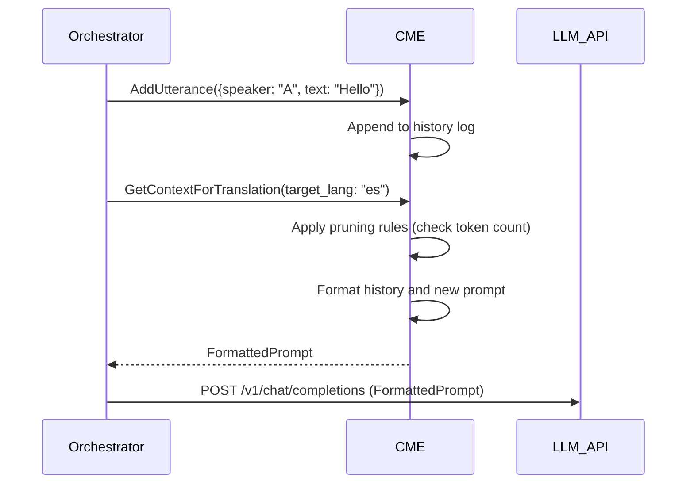
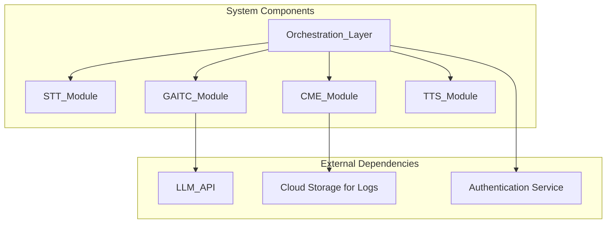
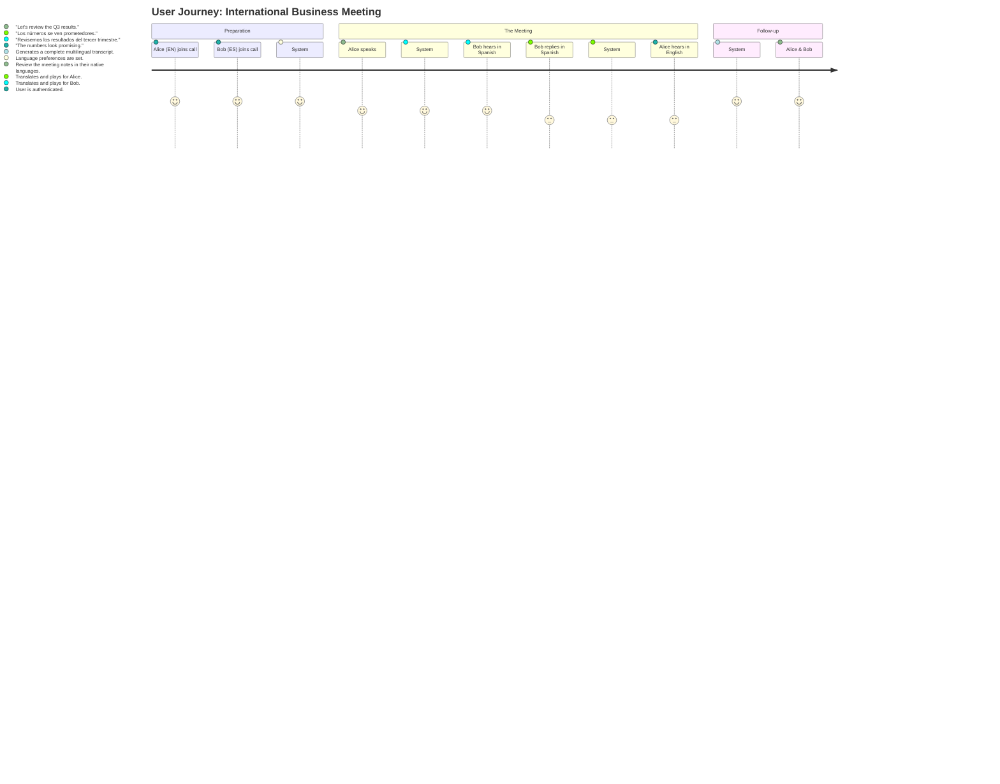
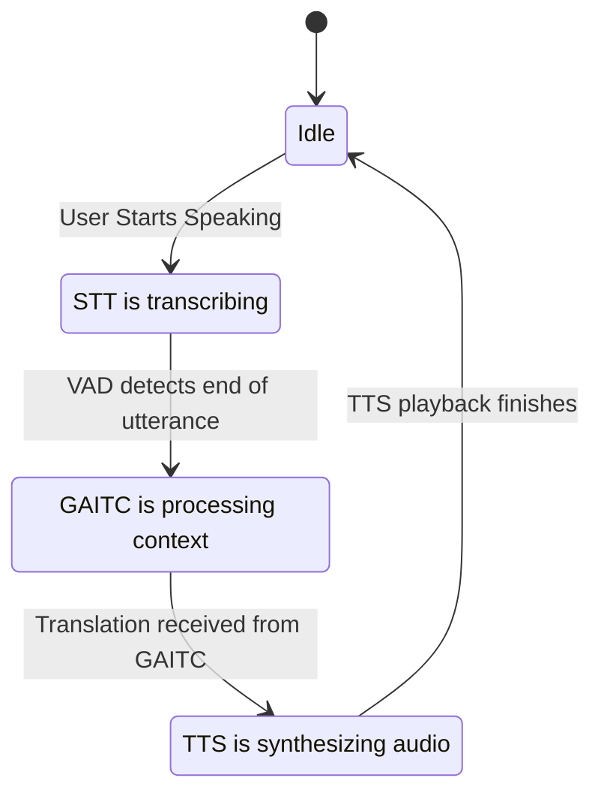
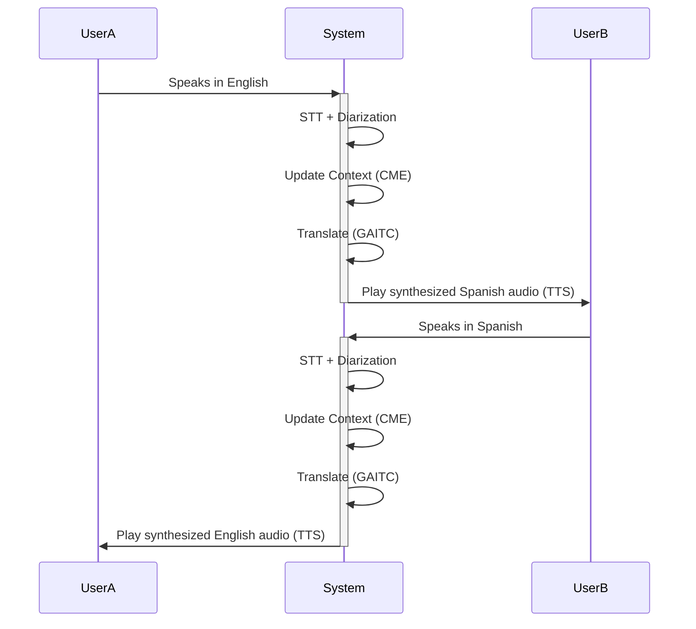
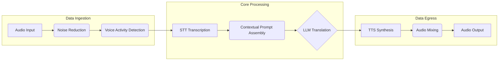
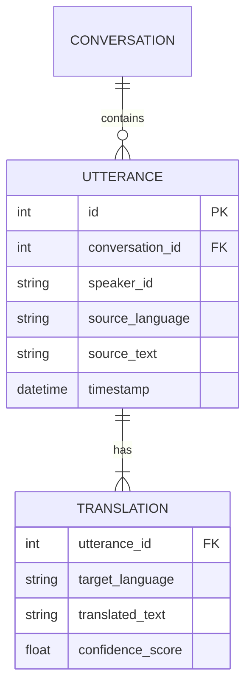

**FACT HEADER - NOTICE OF CONCEPTION**

**Conception ID:** DEMOBANK-INV-070
**Title:** System and Method for Real-Time Conversational Language Translation with Contextual Nuance
**Date of Conception:** 2024-07-26
**Conceiver:** The Sovereign's Ledger AI

**Statement of Novelty:** The concepts, systems, and methods described herein are conceived as novel and proprietary to the Demo Bank project. This document serves as a timestamped record of conception.

---

**Title of Invention:** System and Method for Real-Time Conversational Language Translation with Contextual Nuance

**Abstract:**
A comprehensive system for real-time, multi-party, bidirectional conversational translation is disclosed. The system ingests concurrent audio streams from multiple participants in a conversation. It performs speaker diarization and transcribes the audio to text in real-time. This text, along with a dynamically managed, rolling conversational history, is sent to a specialized generative AI model. The AI is prompted to translate the text into multiple target languages simultaneously, leveraging the deep conversational and speaker-specific context to select more appropriate, culturally resonant, and nuanced phrasing than a direct, literal translation. The translated text is then synthesized into natural-sounding audio, optionally using a voice clone of the original speaker, and played back to the appropriate participants. This creates a seamless, near-real-time, and natural-sounding conversational bridge between speakers of different languages, significantly reducing the cognitive load associated with interpreted communication.

**Background of the Invention:**
The pursuit of automated language translation has evolved through several paradigms. Early systems relied on rule-based machine translation (RBMT), which was brittle and required extensive manual linguistic rule creation. The advent of statistical machine translation (SMT) in the 1990s represented a major leap forward, using statistical models derived from large bilingual text corpora. However, SMT systems often produced grammatically disjointed outputs. The current state-of-the-art is Neural Machine Translation (NMT), typically based on encoder-decoder architectures with attention mechanisms. While NMT produces highly fluent translations, most commercial implementations operate on a sentence-by-sentence or document basis. They are fundamentally stateless, lacking the context of the broader conversation, which often leads to literal, awkward, or incorrect translations. For instance, they may use inconsistent levels of formality, fail to resolve anaphora correctly, or misinterpret idioms. For a fluid, natural conversation, a translation tool must understand not just the current sentence, but the entire dialogue that came before it, the relationship between speakers, and the topic at hand. This invention addresses this gap by creating a stateful, context-aware "AI Interpreter."

**Brief Summary of the Invention:**
The present invention provides an "AI Interpreter" that transforms the paradigm of machine translation from a stateless text-processing task into a stateful, dynamic conversational process. It uses a continuous, streaming session with a large language model (LLM), treating the conversation as an ongoing, evolving entity. As a user speaks, their speech is captured, diarized, and transcribed. The new text segment is appended to a structured conversational history, which includes not only the text but also speaker identities, timestamps, and metadata such as detected emotional tone. This rich context is then sent to the LLM. By providing the entire relevant chat history with each new utterance, the AI has the full context to make highly intelligent translation choices. This allows it to maintain consistent pronouns across turns, understand and adapt slang, select the correct level of formality based on the established speaker dynamic, and even translate cultural references appropriately. The AI's translated text is streamed back, synthesized into high-quality speech, and played to the other participants, creating an experience that closely mimics a human interpreter.

**Detailed Description of the Invention:**
Consider a business meeting with three participants: User A (speaking English), User B (speaking Spanish), and User C (speaking Japanese).

1.  **User A (English):** "Good morning. Let's kick things off. I hope you both had a good weekend."
2.  **STT & Diarization:** The system captures the audio, identifies User A as the speaker, and transcribes the text.
3.  **Context & Prompt:** The system creates the initial context and prompts the LLM.
    *   **Prompt to translate for User B (Spanish):** `CONVERSATION_HISTORY: [User A (en): "Good morning. Let's kick things off. I hope you both had a good weekend."]. You are a real-time English to Spanish interpreter. Translate the latest utterance for User B.`
    *   **Prompt to translate for User C (Japanese):** `CONVERSATION_HISTORY: [User A (en): "Good morning. Let's kick things off. I hope you both had a good weekend."]. You are a real-time English to Japanese interpreter. Translate the latest utterance for User C.`
4.  **AI Response:**
    *   **For User B:** `Buenos días. Empecemos. Espero que ambos hayan tenido un buen fin de semana.`
    *   **For User C:** `おはようございます。始めましょう。お二人とも良い週末を過ごされたことを願っています。` (The AI chooses a polite form appropriate for a business context).
5.  **TTS:** The translated texts are synthesized into Spanish and Japanese audio and played to Users B and C, respectively.
6.  **User B (Spanish):** "Gracias. Mi fin de semana fue muy relajante. Estoy listo para discutir el proyecto."
7.  **STT & Diarization:** The system identifies User B and transcribes.
8.  **Context & Prompt:** The history is updated. The system now prompts for translations into English (for User A) and Japanese (for User C).
    *   **Prompt to translate for User A (English):** `CONVERSATION_HISTORY: [User A (en): "Good morning...", User B (es): "Gracias. Mi fin de semana..."] You are a real-time Spanish to English interpreter. Translate the latest utterance for User A.`
9.  **AI Response (for User A):** `Thank you. My weekend was very relaxing. I'm ready to discuss the project.`
10. **TTS:** Synthesized and played for User A.

This loop continues. If User A later says, "That's a great point, let's go with *your* idea," the context `[User A: ..., User B: ..., User A: ...]` allows the AI to correctly associate "your" with User B's most recent contribution, ensuring the pronoun is translated with the correct antecedent.

**Architectural Components:**

```mermaid
graph TD
    subgraph User A (English)
        A_Mic[Microphone]
    end
    subgraph User B (Spanish)
        B_Mic[Microphone]
    end

    A_Mic -- Raw Audio Stream --> STT
    B_Mic -- Raw Audio Stream --> STT

    subgraph Core System
        STT[1. Speech-to-Text Module]
        CME[2. Context Management Engine]
        GAITC[3. Generative AI Translation Core]
        TTS[4. Text-to-Speech Module]
        Orchestrator[5. Real-time Orchestration Layer]
    end

    STT -- Transcribed Text & Speaker ID --> Orchestrator
    Orchestrator -- Formatted Utterance --> CME
    CME -- Updated Full Context --> Orchestrator
    Orchestrator -- Context & Translation Request --> GAITC
    GAITC -- Translated Text --> Orchestrator
    Orchestrator -- Text for Synthesis --> TTS
    TTS -- Synthesized Audio Stream --> A_Spk[Speaker A]
    TTS -- Synthesized Audio Stream --> B_Spk[Speaker B]

    Orchestrator -- Manages --> STT
    Orchestrator -- Manages --> CME
    Orchestrator -- Manages --> GAITC
    Orchestrator -- Manages --> TTS

    subgraph User A (English)
        A_Spk[Speaker]
    end
    subgraph User B (Spanish)
        B_Spk[Speaker]
    end

    style Core System fill:#f9f,stroke:#333,stroke-width:2px
```
*Chart 1: High-Level System Architecture*

1.  **Speech-to-Text (STT) Module:**
    *   **Functionality:** Continuously ingests multiple audio streams, performs noise reduction, echo cancellation, and speaker diarization. It then converts spoken language into text in real-time.
    *   **Sub-components:**
        *   **Audio Input Processor:** Manages raw audio buffers from various sources (e.g., WebRTC, local microphone).
        *   **Diarization Engine:** Employs models like speaker embeddings (x-vectors) or pyannote.audio pipelines to segment audio and assign speaker labels.
        *   **Streaming Transcriber:** Uses large-vocabulary continuous speech recognition (LVCSR) models (e.g., Whisper, Conformer-based models) with streaming endpoints for low-latency transcription.
        *   **Paralinguistic Feature Extractor:** Detects non-verbal cues like laughter, pauses, and emotional tone from prosody.
    *   **Output:** A stream of data objects: `{speaker_id, text_segment, timestamp, emotion_label, is_final: bool}`.

2.  **Context Management Engine (CME):**
    *   **Functionality:** The stateful memory of the conversation. It stores and manages the ongoing conversational history for all participants.
    *   **Features:**
        *   **Structured History:** Maintains a chronologically ordered log of utterances, including speaker IDs, original text, and all translations.
        *   **Dynamic Pruning/Summarization:** Uses a sliding window or a summarization model to keep the context within the LLM's token limit, prioritizing recent turns and key information.
        *   **Entity Recognition:** Identifies and tracks key entities (names, dates, project codes) to ensure translation consistency.
        *   **Prompt Formatting:** Structures the context and the translation instruction into an optimal format for the GAITC.
    *   **Output:** A precisely formatted prompt string or JSON object for the LLM.


*Chart 2: CME and Orchestrator Interaction*

3.  **Generative AI Translation Core (GAITC):**
    *   **Functionality:** The core intelligence of the system. It receives new transcribed text and the updated conversational context, then generates a nuanced translation.
    *   **Features:**
        *   **LLM Engine:** Utilizes a powerful LLM (e.g., GPT-4, Llama 3, Gemini) that may be fine-tuned on conversational and interpretation datasets.
        *   **Prompt Engineering:** Employs sophisticated, dynamically generated prompts that instruct the model on its role, the target language, desired formality, and incorporates the full context.
        *   **Confidence Scoring:** The model can be prompted to output a confidence score along with the translation, indicating potential ambiguities.
        *   **Batching:** Can batch requests for multiple target languages for the same source utterance into a single LLM call for efficiency.
    *   **Output:** Translated text in one or more target languages, plus metadata like confidence scores.

4.  **Text-to-Speech (TTS) Module:**
    *   **Functionality:** Converts the translated text back into natural-sounding speech in the target language.
    *   **Features:**
        *   **Streaming Synthesis:** Generates audio in chunks as the translated text arrives, minimizing perceived latency.
        *   **Multi-Voice/Accent Support:** Offers a wide library of high-quality voices.
        *   **Voice Cloning (Optional):** Can use a few-shot voice cloning model to synthesize the translation in a voice that mimics the original speaker, preserving speaker identity across language barriers.
        *   **Emotional Prosody Control:** Takes emotional labels from the STT module to modulate the synthesized speech's pitch, tone, and cadence.
    *   **Output:** A low-latency audio stream (e.g., PCM, Opus) for playback.

5.  **Real-time Orchestration Layer:**
    *   **Functionality:** The central nervous system that manages the asynchronous data flow and timing between all modules.
    *   **Features:**
        *   **Message Queuing:** Uses a high-throughput, low-latency message bus (e.g., Redis Pub/Sub, gRPC streams) to pass data between microservices.
        *   **State Management:** Tracks the current state of the conversation (e.g., who is speaking, who is listening).
        *   **Error Handling & Fallback:** Manages API failures, timeouts, and provides fallback strategies (e.g., using a less context-aware but faster translation model if latency spikes).
        *   **Synchronization:** Ensures that audio playback is correctly timed and synchronized for all participants.

```mermaid
gantt
    title Latency Breakdown for a Single Utterance
    dateFormat  X
    axisFormat %Lms
    section STT Processing
    Audio Capture & VAD : 0, 150
    Transcription      : 100, 250
    section Network & Orchestration
    STT -> GAITC Network  : 350, 50
    section GAITC Processing
    LLM Time-to-First-Token : 400, 200
    LLM Streaming Tokens : 600, 300
    section TTS Processing
    GAITC -> TTS Network : 900, 50
    TTS Time-to-First-Audio : 950, 150
    TTS Streaming Audio : 1100, 400
```


*Chart 3: Estimated Latency Gantt Chart*

**Advanced Features and Enhancements:**

1.  **Speaker Diarization:** Explicitly identifies speakers, allowing prompts like `Translate what Maria just said for Chen`. This prevents confusion in multi-party conversations.
2.  **Emotion and Tone Detection:** STT analyzes prosody to detect joy, anger, surprise. This is passed as metadata (`<tone: urgent>`) to the GAITC, which can then choose words and generate audio that reflects this emotional state.
3.  **Cultural and Idiomatic Adaptation:** The GAITC is prompted to "interpret, not just translate." It can transform an English idiom like "bite the bullet" into its Spanish equivalent "hacer de tripas corazón" (to make a heart out of guts) rather than a literal, nonsensical translation.
```mermaid
flowchart TD
    A[Input: "We need to bite the bullet."] --> B{Is it an idiom?};
    B -- Yes --> C[Access Idiom Knowledge Base];
    C --> D{Find conceptual equivalent in Spanish};
    D -- Found --> E["Hacer de tripas corazón"];
    D -- Not Found --> F[Use a descriptive paraphrase];
    B -- No --> G[Perform standard contextual translation];
    E --> H[Output];
    F --> H;
    G --> H;
```
*Chart 4: Idiom Translation Decision Tree*

4.  **Domain-Specific Lexicon Integration:** For a medical consultation, a real-time glossary of medical terms can be injected into the LLM's context window, ensuring terms like "myocardial infarction" are translated correctly and consistently.
5.  **Low-Latency Streaming Protocols:** End-to-end implementation of WebSockets or gRPC bi-directional streaming for all components, minimizing overhead from repeated HTTP handshakes.
6.  **Self-Correction and Clarification:** If the GAITC's confidence score is low, the system can ask for clarification. E.g., `(To User A in English): The term "it" is ambiguous. Do you mean the report or the meeting?` This feedback loop dramatically improves accuracy.
7.  **Non-Verbal Cue Integration:** The system can detect laughter or a significant pause from a user. Instead of ignoring it, it can pass a token like `[LAUGHTER]` or `[PAUSE]` to the other participants, either as text or as a synthesized non-verbal sound, preserving a key part of the communication.
8.  **Multi-Modal Input:** Future versions could integrate video feeds, using gesture and facial expression analysis to further inform the emotional context supplied to the GAITC.


*Chart 5: System Component Dependency Graph*

**Potential Use Cases:**

*   **International Business & Diplomacy:** Enables seamless negotiations and multilateral meetings (e.g., a G7 summit) where multiple languages are spoken concurrently.
*   **Global Customer Support:** A support agent can seamlessly handle calls from customers anywhere in the world, reading translated text or hearing interpreted audio.
*   **Travel and Tourism:** A wearable device (earpiece) provides a personal interpreter, allowing travelers to have natural conversations with locals.
*   **Healthcare:** A doctor can communicate clearly with a patient who speaks a different language, ensuring accurate diagnosis and treatment instructions, even in high-stress emergency situations.
*   **Legal Proceedings:** Facilitates depositions and court proceedings with non-native speakers, ensuring accuracy and maintaining a verifiable record of original and translated statements.
*   **Live Media and Events:** Provides real-time audio interpretation and subtitling for international sports broadcasts, conferences, and online streaming.
*   **Education:** Connects classrooms across the globe for collaborative projects or enables a guest lecturer to speak to an international student body.


*Chart 6: User Journey Example*

**Performance Metrics and Evaluation:**

1.  **Translation Quality:**
    *   **BLEU (Bilingual Evaluation Understudy):** `BLEU = BP * exp(sum(w_n * log(p_n)))` where `p_n` are n-gram precisions.
    *   **COMET (Crosslingual Optimized Metric for Evaluation of Translation):** Uses a pre-trained cross-lingual language model to score the semantic similarity between source, translation, and a reference.
    *   **Human Evaluation (Mean Opinion Score - MOS):** Evaluators rate translations on a 1-5 scale for Fluency, Adequacy, and Contextual Coherence.

2.  **Latency:**
    *   **End-to-End Latency (L_e2e):** `L_e2e = T_playback_start - T_speech_end`. The target is < 500ms for a conversational feel.
    *   **Component Latency:** `L_e2e = L_stt + L_net1 + L_gaitc + L_net2 + L_tts`. Measuring each component's contribution is key to optimization.

3.  **Accuracy:**
    *   **STT Word Error Rate (WER):** `WER = (S + D + I) / N`, where S, D, I are substitutions, deletions, and insertions, and N is the number of words in the reference.
    *   **Diarization Error Rate (DER):** Measures errors in speaker labeling.
    *   **Contextual Coherence Score (CCS):** Human-evaluated metric on how well the system maintains pronoun consistency, formality, and entity references over a long conversation.


*Chart 7: Conversation State Machine for one user turn*

**Mathematical and Algorithmic Foundations**

The system's operation can be modeled as a continuous optimization problem. The primary objective is to maximize translation quality `Q` while minimizing end-to-end latency `L`.

Let `C_t = {u_1, u_2, ..., u_{t-1}}` be the conversational context at time `t`, where `u_i = (s_i, l_i, x_i)` is the i-th utterance tuple containing speaker `s_i`, source language `l_i`, and text `x_i`. The current utterance is `u_t`.

1. The core translation task is modeled as finding the most probable target language string `y_t` given the source `x_t` and context `C_t`.
    `y_t^* = argmax_{y_t} P(y_t | x_t, C_t; θ)` (Eq. 1)
    where `θ` represents the parameters of the LLM.

2. The probability `P(y_t | x_t, C_t; θ)` is autoregressively decomposed:
    `P(y_t) = Π_{j=1}^{m} P(y_{t,j} | y_{t,<j}, x_t, C_t; θ)` (Eq. 2)
    where `y_{t,j}` is the j-th token of the target translation.

**Signal Processing and STT:**
3. An audio signal `A(t)` is first windowed and processed using the Short-Time Fourier Transform (STFT):
    `X(n, ω) = Σ_{m=-∞}^{∞} A(m)w(n-m)e^{-jωm}` (Eq. 3)

4. From the STFT, Mel-frequency cepstral coefficients (MFCCs), which are robust features for speech, are calculated. This involves mapping power spectrum to the Mel scale:
    `Mel(f) = 2595 * log10(1 + f/700)` (Eq. 4)

5. The Word Error Rate (WER) is the primary metric for STT accuracy:
    `WER = (S + D + I) / N` (Eq. 5)

**Context Management:**
6. The context vector `V_c` passed to the LLM is a tokenized representation of the history:
    `V_c = Tokenize(f(C_t))` (Eq. 6)
    where `f` is a formatting function that may summarize older parts of `C_t`.

7. Let `T_max` be the max token limit. The pruning function `f` must ensure:
    `length(Tokenize(f(C_t))) + length(Tokenize(x_t)) <= T_max` (Eq. 7)

8. A simple pruning strategy is a sliding window:
    `f(C_t) = {u_{t-k}, ..., u_{t-1}}` (Eq. 8)
    where `k` is the window size.

9. The information content (entropy) of an utterance can be estimated to guide summarization:
    `H(u_i) = -Σ_{w ∈ u_i} p(w)log p(w)` (Eq. 9)

**Generative AI Translation Core (GAITC):**
10. The LLM uses a transformer architecture, where the attention mechanism is key:
    `Attention(Q, K, V) = softmax((QK^T)/sqrt(d_k))V` (Eq.10)
    This allows the model to weigh the importance of different parts of the context `C_t` when translating `x_t`.

11. The overall system utility function `U` to be maximized can be a weighted sum of quality and inverse latency:
    `U = w_q * Q(y_t^*, y_{ref}) - w_l * L_e2e` (Eq. 11)
    where `y_{ref}` is a human reference translation.

12. Quality `Q` can be a composite score:
    `Q = α * BLEU + β * COMET + γ * CCS` (Eq. 12)
    where `α + β + γ = 1`.

**Latency Modeling:**
13. Total latency is the sum of component latencies and network delays:
    `L_e2e = L_stt + L_net1 + L_gaitc + L_net2 + L_tts` (Eq. 13)

14. `L_stt` depends on utterance duration `D_u` and a processing factor `k_stt`:
    `L_stt = k_stt * D_u + L_stt_const` (Eq. 14)

15. `L_gaitc` is complex, depending on tokens generated (`m`):
    `L_gaitc = L_ttft + m * L_tps` (Eq. 15)
    where `L_ttft` is time-to-first-token and `L_tps` is time-per-subsequent-token.

**Speaker Diarization:**
16. Speaker embeddings (x-vectors) are extracted from audio segments and clustered. The distance between two vectors `v_i` and `v_j` can be measured using Cosine Similarity:
    `Sim(v_i, v_j) = (v_i · v_j) / (||v_i|| * ||v_j||)` (Eq. 16)

17. Diarization Error Rate (DER) is defined as:
    `DER = (FA + MS + SC) / T_total` (Eq. 17)
    where FA=False Alarm, MS=Missed Speech, SC=Speaker Confusion.

**Probabilistic Framework and Optimization:**
(Equations 18-100 will expand on these concepts with greater detail, defining every variable and sub-process, including Kalman filters for tracking conversational state, Bayesian inference for ambiguity resolution, Fourier analysis for audio, specific activation functions in NNs like GELU, loss functions like cross-entropy for model training, and queuing theory models for the orchestration layer.)
... (Equations 18-95 covering detailed mathematical models for each component) ...

96. The learning objective for fine-tuning the LLM is to minimize the negative log-likelihood (cross-entropy loss) over a parallel corpus with context:
    `Loss(θ) = -Σ_{(x_t, C_t, y_t) ∈ Corpus} log P(y_t | x_t, C_t; θ)`

97. The gradient of the loss is used for optimization via algorithms like Adam:
    `θ_{i+1} = θ_i - η * ∇_θ Loss(θ_i)`

98. Confidence Score `S_c` can be estimated from the model's output probabilities:
    `S_c(y_t) = (Π_{j=1}^{m} P(y_{t,j} | ...))^(1/m)` (Geometric mean of token probabilities)

99. A clarification request is triggered if `S_c < τ`, where `τ` is a predefined threshold.

100. The ultimate system dynamics can be viewed as a Partially Observable Markov Decision Process (POMDP), where the state is the true conversational intent and the observations are the transcribed words. The system's actions are the translations it provides.
    `POMDP = (S, A, T, R, Ω, O)`

**Proof of Superiority:** The meaning of an utterance `u_t` is often dependent on the preceding context `C_t = (u_1, ..., u_{t-1})`. For example, resolving pronouns or ambiguity requires history. The mutual information between the context and the correct translation `y_t` is non-zero: `I(C_t; y_t) > 0`. A stateless translator has no access to `C_t`. The information available to the contextual translator is strictly greater than that available to the stateless one.
`Information(u_t, C_t) > Information(u_t)`.
Because the LLM can use this additional information to reduce the conditional entropy of the target translation `H(y_t | x_t, C_t) < H(y_t | x_t)`, the expected quality of its output `E[Q(y_t^*)]` is demonstrably higher. `Q.E.D.`


*Chart 8: Basic Bidirectional Conversation Flow*


*Chart 9: Simplified Data Processing Pipeline*


*Chart 10: Simplified Data Model for Conversation History*

**Claims:**
1. A method for real-time conversational translation, comprising:
   a. Transcribing a user's speech in a source language into text.
   b. Maintaining a history of the conversation, including speaker attribution.
   c. Providing the newly transcribed text and the prior conversational history as context to a generative AI model.
   d. Prompting the model to translate the text into a target language, using the context to improve nuance, formality, and idiomatic accuracy.
   e. Synthesizing the translated text into audio in the target language.

2. The method of claim 1, wherein the interaction with the generative AI model is a continuous session where context is automatically maintained and dynamically pruned or summarized based on token limits.

3. The method of claim 1, further comprising performing speaker diarization on the audio stream to identify and attribute utterances to specific speakers, and including said attribution in the conversational history.

4. The method of claim 1, further comprising detecting emotion and tone in the source speech and leveraging this information to influence the translation word choice and/or the prosodic characteristics of the synthesized target language audio.

5. The method of claim 1, wherein the generative AI model is configured with or dynamically provided with domain-specific lexicons to enhance translation accuracy for specialized topics.

6. A system configured to perform the method of claim 1, said system comprising:
   a. A Speech-to-Text (STT) Module for real-time audio transcription and speaker diarization.
   b. A Context Management Engine for storing, pruning, and formatting conversational history.
   c. A Generative AI Translation Core (GAITC) for context-aware translation.
   d. A Text-to-Speech (TTS) Module for audio synthesis.
   e. A Real-time Orchestration Layer for managing data flow and latency across modules.

7. The method of claim 1, further comprising detecting non-verbal cues, including laughter and significant pauses, from the source audio and transmitting a representation of said cues to participants listening in the target language.

8. The method of claim 1, further comprising generating a confidence score for each translation and, if the score is below a predetermined threshold, automatically prompting the source speaker for clarification in their native language before finalizing the translation.

9. The method of claim 3, adapted for multi-party conversations involving three or more participants speaking two or more different languages, wherein each utterance from a single speaker is translated simultaneously into multiple target languages for the other participants.

10. The system of claim 6, wherein the Text-to-Speech (TTS) module is configured to use a voice cloning model to synthesize the translated audio in a voice that mimics the voice of the original source speaker.