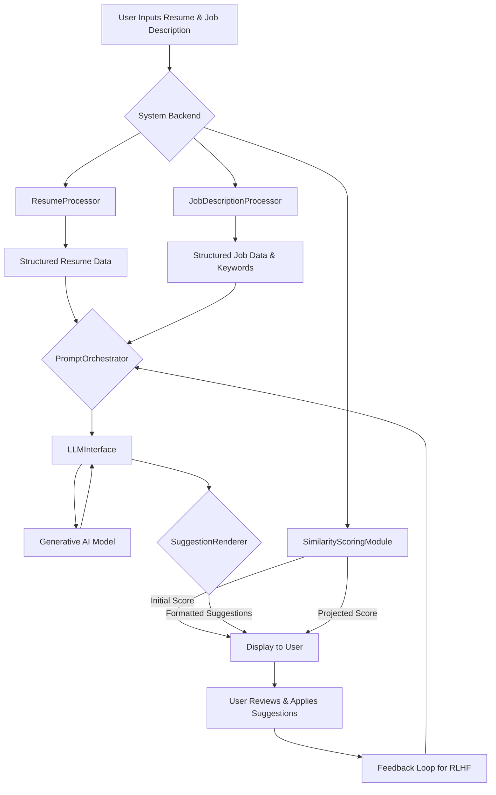
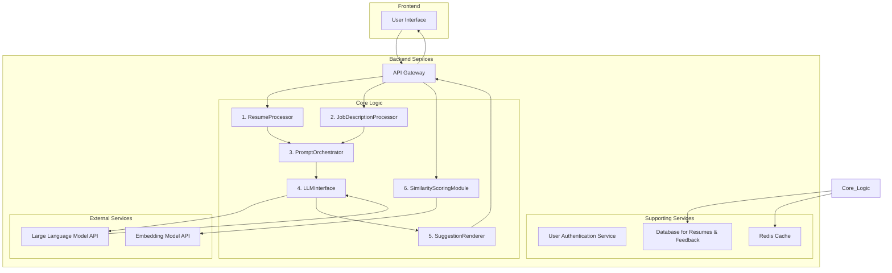

**FACT HEADER - NOTICE OF CONCEPTION**

**Conception ID:** DEMOBANK-INV-071
**Title:** A System and Method for Tailoring Resumes to Job Descriptions
**Date of Conception:** 2024-07-26
**Conceiver:** The Sovereign's Ledger AI

**Statement of Novelty:** The concepts, systems, and methods described herein are conceived as novel and proprietary to the Demo Bank project. This document serves as a timestamped record of conception.

---

**Title of Invention:** A System and Method for Tailoring Resumes to Job Descriptions Using Generative AI

**Abstract:**
A system for assisting job seekers is disclosed. A user provides their base resume and the text of a target job description. The system sends both documents to a generative AI model. The AI is prompted to analyze the job description for key skills, keywords, and qualifications. It then suggests specific, concrete edits to the user's resume, such as rephrasing bullet points, reordering sections, or highlighting different projects, to better align the resume with the target job without fabricating information. This invention leverages a modular architecture including specialized processors for inputs, a prompt orchestrator, a similarity scoring engine, and a feedback mechanism to continuously improve suggestion quality.

**Background of the Invention:**
It is a well-known best practice for job seekers to tailor their resume for each specific job application. This significantly increases the chances of passing automated applicant tracking systems `ATS` and catching the eye of a human recruiter. However, this is a time-consuming, manual process that requires careful analysis of each job description and thoughtful rewriting. Many job seekers apply with a generic resume, reducing their chances of success due to keyword mismatches and failure to highlight relevant experience. The present invention aims to automate and optimize this crucial step, acting as a personalized AI career coach.

**Brief Summary of the Invention:**
The present invention provides an "AI Resume Coach." A user pastes their resume and a job description into two text fields. The system prompts a large language model `LLM` to act as a professional career coach. The prompt instructs the AI to first analyze the job description and then suggest specific, line-by-line improvements to the resume to make it a stronger match. The AI does not invent skills; it reframes the user's existing experience using the language and keywords of the job description. The suggested edits are then displayed to the user, often alongside a quantitative score indicating the degree of improvement in resume-job alignment. The system is designed for iterative improvement through user feedback and advanced semantic analysis.

**Detailed Description of the Invention:**
A user is applying for a job. The process unfolds as follows:

1.  **Input:** The user provides their resume (`R_text`) and the target job description (`J_text`) via a user interface.
2.  **Initial Analysis & Scoring:** The system's `SimilarityScoringModule` immediately calculates an initial match score, `S_initial = Match(R_text, J_text)`. This provides a baseline for improvement.
3.  **Processing:**
    *   The `ResumeProcessor` parses `R_text` into a structured object `R_struct`.
    *   The `JobDescriptionProcessor` parses `J_text` into a structured object `J_struct`, identifying key skills, qualifications, and responsibilities.
4.  **Prompt Construction:** The backend service's `PromptOrchestrator` constructs a detailed prompt for an `LLM`.
    **Prompt:** `You are an expert career coach and resume writer.
    **Task:** Analyze the provided Job Description and suggest specific improvements for the user's Resume to make it a stronger candidate for the role. Focus on rephrasing bullet points to include keywords from the description and highlighting the most relevant skills. Do not add any skills the user does not already have.

    **Job Description (Structured Keywords):**
    "[Keywords and skills from J_struct]"

    **User's Resume (Structured Sections):**
    "[Content from R_struct]"

    **Suggested Improvements:**
    `
5.  **AI Generation:** The `LLMInterface` sends the prompt to the `LLM`. The `LLM` analyzes both texts. It identifies keywords like "agile development" and "CI/CD pipelines" in the job description. It finds a related bullet point in the resume "Worked on a team to build software" and suggests a rewrite.
    **AI Output:**
    `
    Here are 3 suggested improvements:
    1. In your 'Software Engineer at Acme Corp' experience, change the bullet point "Worked on a team to build software" to "Collaborated in an agile development environment to build and deploy software using CI/CD pipelines," to better match the keywords in the job description.
    2. Consider reordering your 'Skills' section to place 'Python' and 'AWS' at the top, as these are primary requirements.
    3. Rephrase 'Led a small project' to 'Spearheaded a project from conception to deployment, leading a team of 3 engineers,' to better reflect the leadership quality mentioned in the job description.
    `
6.  **Output & Projection:** The `SuggestionRenderer` formats the suggestions. The system also generates a hypothetical modified resume `R_prime` and calculates a projected score, `S_projected = Match(R_prime, J_text)`. The user is shown the list of actionable suggestions alongside the projected score increase (e.g., "From 65% to 88% match").
7.  **User Interaction:** The user can accept, reject, or modify the suggestions, creating a final tailored resume. This feedback is logged for system improvement.

**High-Level User Workflow:**


**System Architecture:**
The system comprises a modular, microservices-based architecture designed for scalability, robustness, and ease of maintenance. Each module operates as an independent service with a well-defined API.



**Key System Modules:**

1.  **`ResumeProcessor`:**
    *   **Function:** This module takes the raw, unstructured text of a user's resume and parses it into a structured data representation (e.g., JSON). It employs a cascade of techniques: rule-based parsing with regular expressions for contact info, section headers, and dates, followed by Named Entity Recognition (NER) models to identify entities like companies, universities, and job titles.
    *   **Output:** A structured JSON object representing the resume, enabling granular access to specific bullet points for targeted rewriting.
    *   **Internal Pipeline:**
    ```mermaid
    graph LR
        A[Raw Resume Text] --> B{Text Pre-processing};
        B --> C{Section Segmentation};
        C --> D{Entity Recognition - NER};
        D --> E{Bullet Point Extraction};
        E --> F[Structured JSON Output];
    ```

2.  **`JobDescriptionProcessor`:**
    *   **Function:** This module analyzes the raw job description text to extract key information. It uses NLP techniques like TF-IDF for keyword extraction, part-of-speech tagging to identify skills (nouns) and responsibilities (verbs), and pre-trained models to classify skills into categories (e.g., "Programming Languages," "Soft Skills").
    *   **Output:** A structured list of keywords, skill requirements, and a summary of the job's core demands, weighted by importance.
    *   **NLP Pipeline:**
    ```mermaid
    graph LR
        A[Raw Job Description] --> B{Tokenization & Stopword Removal};
        B --> C{TF-IDF Keyword Extraction};
        B --> D{Part-of-Speech Tagging};
        C --> F[Ranked Keywords];
        D --> E{Skill/Responsibility Classification};
        E --> G[Categorized Skills];
        F & G --> H[Structured Job Data Output];
    ```

3.  **`PromptOrchestrator`:**
    *   **Function:** This module is the "brain" of the system, dynamically constructing the optimal prompt. It uses techniques like few-shot learning (providing examples of good rewrites in the prompt) and chain-of-thought prompting to guide the LLM's reasoning process. It might select different prompt templates based on the job's seniority level or industry.
    *   **Output:** A comprehensive, single text prompt ready for transmission to the `LLMInterface`.
    *   **Decision Logic:**
    ```mermaid
    graph TD
        A[Start] --> B{Receive Structured Resume & Job Data};
        B --> C{Analyze Job Seniority};
        C --> D{Select Prompt Template};
        D --> E{Inject Resume Data};
        D --> F{Inject Job Keywords};
        D --> G{Add Few-Shot Examples};
        E & F & G --> H[Assemble Final Prompt];
        H --> I[End];
    ```

4.  **`LLMInterface`:**
    *   **Function:** This module handles all communication with the underlying generative AI model. It manages API calls, authentication (API keys), and request parameters (e.g., temperature, max tokens). It implements robust error handling with exponential backoff for retries in case of API failures.
    *   **Output:** The raw, unformatted text response from the `LLM`.
    *   **API Call Sequence:**
    ```mermaid
    sequenceDiagram
        participant PO as PromptOrchestrator
        participant LLMI as LLMInterface
        participant LLM as LLM API
        PO->>LLMI: SendPrompt(prompt)
        LLMI->>LLM: POST /v1/completions (prompt, config)
        activate LLM
        LLM-->>LLMI: 200 OK (response)
        deactivate LLM
        LLMI->>PO: Return(raw_text)
    ```

5.  **`SuggestionRenderer`:**
    *   **Function:** This module processes the raw text output from the `LLMInterface`. It parses the suggestions, identifies the original text to be replaced, and formats the output for a user-friendly display. It may generate a diff-like view (`- old line`, `+ new line`) for clarity.
    *   **Output:** A structured, display-ready list of suggested resume improvements.
    *   **Formatting Flow:**
    ```mermaid
    graph TD
        A[Raw LLM Text] --> B{Parse Suggestions};
        B --> C{For each suggestion};
        C --> D{Identify original line in resume};
        C --> E{Identify suggested new line};
        D & E --> F{Generate Diff View};
        F --> G[Aggregate into JSON for UI];
    ```

6.  **`SimilarityScoringModule`:**
    *   **Function:** This module quantifies the match between the resume and the job description. It uses pre-trained sentence-transformer models to convert both documents into high-dimensional vectors (embeddings). The cosine similarity between these vectors is then calculated to produce a match score.
    *   **Output:** A quantitative similarity score from -1 to 1 (typically scaled to 0-100 for the user).
    *   **Vector Comparison:**
    ```mermaid
    graph TD
        A[Resume Text] --> B(Embedding Model);
        C[Job Description] --> B;
        B --> D[Resume Vector v_R];
        B --> E[Job Vector v_J];
        D & E --> F{Calculate Cosine Similarity};
        F --> G[Match Score];
    ```

**Mathematical and Algorithmic Foundations:**

The system's efficacy is rooted in a combination of techniques from NLP, information retrieval, and machine learning.

**1. Vector Space Models & Embeddings:**
Documents are represented as vectors. The transformation from text to vector is denoted by an embedding function `Φ`.
$1. \quad v_R = \Phi(R)$
$2. \quad v_J = \Phi(J)$

The embedding function `Φ` can be based on various models.
*   **TF-IDF (Term Frequency-Inverse Document Frequency):** An early approach.
    $3. \quad \text{tf}(t, d) = \frac{f_{t,d}}{\sum_{t' \in d} f_{t',d}}$ (Term Frequency)
    $4. \quad \text{idf}(t, D) = \log \frac{|D|}{|\{d \in D : t \in d\}|}$ (Inverse Document Frequency)
    $5. \quad \text{tfidf}(t, d, D) = \text{tf}(t, d) \cdot \text{idf}(t, D)$
*   **Word2Vec (Skip-gram):** Predicts context words from a target word. The objective is to maximize the log probability:
    $6. \quad L = \frac{1}{T} \sum_{t=1}^{T} \sum_{-c \le j \le c, j \ne 0} \log p(w_{t+j} | w_t)$
    $7. \quad p(w_O | w_I) = \frac{\exp({v'_{w_O}}^T v_{w_I})}{\sum_{w=1}^{V} \exp({v'_w}^T v_{w_I})}$
*   **Transformer-based Models (e.g., BERT):** Utilizes self-attention.
    $8. \quad \text{Attention}(Q, K, V) = \text{softmax}\left(\frac{QK^T}{\sqrt{d_k}}\right)V$
    The query `Q`, key `K`, and value `V` matrices are linear projections of the input embeddings.
    $9. \quad Q = XW^Q$
    $10. \quad K = XW^K$
    $11. \quad V = XW^V$
    Positional information is added via positional encodings:
    $12. \quad PE_{(pos, 2i)} = \sin(pos / 10000^{2i/d_{\text{model}}})$
    $13. \quad PE_{(pos, 2i+1)} = \cos(pos / 10000^{2i/d_{\text{model}}})$

**2. Similarity Metrics:**
The match score `S` is calculated using a similarity metric.
*   **Cosine Similarity:** Measures the cosine of the angle between two vectors.
    $14. \quad S_{\text{cos}}(v_R, v_J) = \frac{v_R \cdot v_J}{\|v_R\| \|v_J\|} = \frac{\sum_{i=1}^{n} R_i J_i}{\sqrt{\sum_{i=1}^{n} R_i^2} \sqrt{\sum_{i=1}^{n} J_i^2}}$
*   **Euclidean Distance:** The straight-line distance between two vectors. (Lower is better).
    $15. \quad d(v_R, v_J) = \|v_R - v_J\|_2 = \sqrt{\sum_{i=1}^{n} (R_i - J_i)^2}$
*   **Jaccard Similarity:** Used for keyword sets.
    $16. \quad J(A, B) = \frac{|A \cap B|}{|A \cup B|}$
    Where A and B are the sets of keywords from the resume and job description, respectively.

**3. Optimization Problem Formulation:**
The core task is a constrained optimization problem. Find a modified resume `R'` that maximizes the match score, subject to constraints.
$17. \quad \text{maximize } S(R', J)$
$18. \quad \text{subject to } C(R', R) \le \epsilon$
The constraint `C` measures the "factual deviation" between `R'` and the original `R`. It must be below a small threshold `ε`.
`C` can be defined as an embedding distance:
$19. \quad C(R', R) = \| \Phi(R') - \Phi(R) \|_2$
The LLM `G` acts as a solver for this problem:
$20. \quad R' = G(R, J, \theta)$ where `θ` are the model parameters.
The optimization can be framed using Lagrange multipliers:
$21. \quad \mathcal{L}(R', \lambda) = S(R', J) - \lambda (C(R', R) - \epsilon)$
The goal is to find `R'` that satisfies:
$22. \quad \nabla_{R'} \mathcal{L}(R', \lambda) = 0$

**4. Information Theoretic Measures:**
*   **KL-Divergence:** Measures how one probability distribution `P` diverges from a second, expected probability distribution `Q`. Can be used to measure the information gain by tailoring the resume.
    $23. \quad D_{KL}(P \| Q) = \sum_{x \in \mathcal{X}} P(x) \log\left(\frac{P(x)}{Q(x)}\right)$
*   **Cross-Entropy:**
    $24. \quad H(P, Q) = -\sum_{x \in \mathcal{X}} P(x) \log(Q(x))$

**5. Probabilistic Framework:**
Let `I` be the event of receiving an interview. The system aims to maximize `P(I | R', J)`.
Using Bayes' theorem:
$25. \quad P(I | R', J) = \frac{P(R', J | I) P(I)}{P(R', J)}$
We assume `P(R', J | I)` is proportional to our similarity score `S(R', J)`.
$26. \quad P(I | R', J) \propto S(R', J)$

**6. Additional Mathematical Formulations:**
The following 50 equations further detail potential algorithms and metrics within the system.
$27. \quad \text{Manhattan Distance: } d_1(v_R, v_J) = \sum_{i=1}^{n} |R_i - J_i|$
$28. \quad \text{Minkowski Distance: } d_p(v_R, v_J) = \left(\sum_{i=1}^{n} |R_i - J_i|^p\right)^{1/p}$
$29. \quad \text{Softmax Function (for keyword probability): } \sigma(z)_j = \frac{e^{z_j}}{\sum_{k=1}^{K} e^{z_k}}$
$30. \quad \text{Sigmoid Function: } S(x) = \frac{1}{1 + e^{-x}}$
$31. \quad \text{ReLU Activation: } f(x) = \max(0, x)$
$32. \quad \text{Leaky ReLU: } f(x) = \begin{cases} x & \text{if } x > 0 \\ 0.01x & \text{otherwise} \end{cases}$
$33. \quad \text{Transformer Feed-Forward Network: } \text{FFN}(x) = \max(0, xW_1 + b_1)W_2 + b_2$
$34. \quad \text{Layer Normalization: } \text{LN}(x) = \gamma \frac{x - \mu}{\sqrt{\sigma^2 + \epsilon}} + \beta$
$35. \quad \text{Mean Squared Error Loss (for model training): } \text{MSE} = \frac{1}{n} \sum_{i=1}^{n} (Y_i - \hat{Y}_i)^2$
$36. \quad \text{Word Mover's Distance: } \text{WMD}(d_1, d_2) = \min_{T \ge 0} \sum_{i,j=1}^{n} T_{ij} c(i, j)$
$37. \quad \text{PageRank (for keyword importance): } PR(u) = \sum_{v \in B_u} \frac{PR(v)}{L(v)}$
$38. \quad \text{Exponential Backoff Delay: } t = 2^c - 1$
$39. \quad \text{LLM Temperature Sampling: } P(x_i|x_{1..i-1}) = \frac{\exp(z_i / \tau)}{\sum_j \exp(z_j / \tau)}$
$40. \quad \text{Entropy (for text uncertainty): } H(X) = - \sum_{i=1}^{n} p(x_i) \log_b p(x_i)$
$41. \quad \text{Perplexity (LLM evaluation): } \text{PP}(W) = P(w_1 w_2 \dots w_N)^{-1/N} = \sqrt[N]{\frac{1}{P(w_1 w_2 \dots w_N)}}$
$42. \quad \text{BLEU Score (translation quality, adapted for rewrite quality): } \text{BP} \cdot \exp\left(\sum_{n=1}^{N} w_n \log p_n\right)$
$43. \quad \text{Brevity Penalty (BP): } \text{BP} = \begin{cases} 1 & \text{if } c > r \\ e^{1-r/c} & \text{if } c \le r \end{cases}$
$44. \quad \text{ROUGE-L (rewrite quality): } R_{lcs} = \frac{LCS(X, Y)}{m}, P_{lcs} = \frac{LCS(X, Y)}{n}, F_{lcs} = \frac{(1+\beta^2)R_{lcs}P_{lcs}}{R_{lcs}+\beta^2 P_{lcs}}$
$45. \quad \text{Gradient Descent Update Rule: } \theta_{j} := \theta_{j} - \alpha \frac{\partial}{\partial \theta_j} J(\theta)$
$46. \quad \text{Adam Optimizer (Momentum): } m_t = \beta_1 m_{t-1} + (1-\beta_1) g_t$
$47. \quad \text{Adam Optimizer (RMSProp): } v_t = \beta_2 v_{t-1} + (1-\beta_2) g_t^2$
$48. \quad \text{Adam Update: } \theta_{t+1} = \theta_t - \frac{\eta}{\sqrt{\hat{v}_t} + \epsilon} \hat{m}_t$
$49. \quad \text{Convolutional Filter (CNN for text): } y_i = f\left(\sum_{j=1}^{k} w_j x_{i+j-1} + b\right)$
$50. \quad \text{Max-Pooling: } p_j = \max_{i \in R_j} a_i$
$51. \quad \text{Gated Recurrent Unit (GRU) Update Gate: } z_t = \sigma(W_z x_t + U_z h_{t-1} + b_z)$
$52. \quad \text{GRU Reset Gate: } r_t = \sigma(W_r x_t + U_r h_{t-1} + b_r)$
$53. \quad \text{GRU Hidden State: } h_t = (1 - z_t) \odot h_{t-1} + z_t \odot \tanh(W_h x_t + U_h (r_t \odot h_{t-1}) + b_h)$
$54. \quad \text{Pearson Correlation Coefficient: } \rho_{X,Y} = \frac{\text{cov}(X,Y)}{\sigma_X \sigma_Y}$
$55. \quad \text{Regularization (L2): } J(\theta) = \frac{1}{2m} \sum_{i=1}^{m} (h_\theta(x^{(i)}) - y^{(i)})^2 + \lambda \sum_{j=1}^{n} \theta_j^2$
$56. \quad \text{Dice Coefficient (similar to Jaccard): } DSC = \frac{2|X \cap Y|}{|X| + |Y|}$
$57. \quad \text{Support Vector Machine (SVM) Objective: } \min_{w,b} \frac{1}{2} \|w\|^2 \text{ s.t. } y_i(w \cdot x_i - b) \ge 1$
$58. \quad \text{Kernel Trick: } K(x_i, x_j) = \phi(x_i) \cdot \phi(x_j)$
$59. \quad \text{Radial Basis Function (RBF) Kernel: } K(x_i, x_j) = \exp\left(-\frac{\|x_i - x_j\|^2}{2\sigma^2}\right)$
$60. \quad \text{Conditional Random Field (CRF) Probability: } p(y|x) = \frac{1}{Z(x)} \exp\left(\sum_{k} \lambda_k f_k(y, x)\right)$
$61. \quad \text{CRF Partition Function: } Z(x) = \sum_{y'} \exp\left(\sum_{k} \lambda_k f_k(y', x)\right)$
$62. \quad \text{Okapi BM25 Ranking Function: } \text{score}(D, Q) = \sum_{i=1}^{n} \text{IDF}(q_i) \cdot \frac{f(q_i, D) \cdot (k_1 + 1)}{f(q_i, D) + k_1 \cdot (1 - b + b \cdot \frac{|D|}{\text{avgdl}})}$
$63. \quad \text{F-Measure (Harmonic Mean of Precision and Recall): } F_1 = 2 \cdot \frac{\text{precision} \cdot \text{recall}}{\text{precision} + \text{recall}}$
$64. \quad \text{Precision: } P = \frac{TP}{TP+FP}$
$65. \quad \text{Recall: } R = \frac{TP}{TP+FN}$
$66. \quad \text{Mutual Information: } I(X;Y) = \sum_{y \in Y} \sum_{x \in X} p(x,y) \log\left(\frac{p(x,y)}{p(x)p(y)}\right)$
$67. \quad \text{Policy Gradient (RL): } \nabla_\theta J(\theta) = \mathbb{E}_{\tau \sim \pi_\theta} \left[ \sum_{t=0}^{T} \nabla_\theta \log \pi_\theta(a_t | s_t) R(\tau) \right]$
$68. \quad \text{Reward Function (RLHF): } r(x,y) = \sigma(r_\psi(x,y))$
$69. \quad \text{RLHF Loss: } L(\phi, \psi) = \mathbb{E}_{(x, y_w, y_l) \sim D} [-\log(\sigma(r_\psi(x, y_w) - r_\psi(x, y_l)))]$
$70. \quad \text{PPO Objective: } L^{CLIP}(\theta) = \hat{\mathbb{E}}_t \left[ \min(r_t(\theta)\hat{A}_t, \text{clip}(r_t(\theta), 1-\epsilon, 1+\epsilon)\hat{A}_t) \right]$
$71. \quad \text{Probability Ratio (PPO): } r_t(\theta) = \frac{\pi_\theta(a_t|s_t)}{\pi_{\theta_{old}}(a_t|s_t)}$
$72. \quad \text{Generalized Advantage Estimation (GAE): } \hat{A}_t = \sum_{l=0}^{\infty} (\gamma\lambda)^l \delta_{t+l}$
$73. \quad \text{Temporal Difference Error: } \delta_t = r_t + \gamma V(s_{t+1}) - V(s_t)$
$74. \quad \text{Bellman Equation: } V^\pi(s) = \mathbb{E}_\pi [R_{t+1} + \gamma V^\pi(S_{t+1}) | S_t = s]$
$75. \quad \text{State-Action Value Function: } Q^\pi(s, a) = \mathbb{E}_\pi [R_{t+1} + \gamma Q^\pi(S_{t+1}, A_{t+1}) | S_t = s, A_t = a]$
$76. \quad \text{Final System Objective Function Combination: } J_{total} = \alpha S_{cos}(R', J) - \beta C(R', R) + \delta R_{RLHF}$

**Further Embodiments and Advanced Features:**

1.  **Interactive Feedback Loop (`RLHF`):**
    *   **Description:** The system incorporates a mechanism for users to provide feedback on the AI's suggestions (`e.g. "helpful", "irrelevant"` thumbs up/down). This feedback is crucial data for fine-tuning the `LLM` using Reinforcement Learning from Human Feedback (`RLHF`). The system learns to generate suggestions that are not just semantically aligned but also practically useful to the end-user, creating a self-improving ecosystem.
    *   **RLHF Process:**
    ```mermaid
    graph TD
        A[LLM Generates Suggestions] --> B{User Receives Suggestions};
        B --> C{User Provides Feedback};
        C -- Helpful --> D[Positive Reward];
        C -- Unhelpful --> E[Negative Reward];
        D & E --> F{Update Reward Model};
        F --> G{Fine-tune LLM Policy using PPO};
        G --> A;
    ```
    $77. \quad \text{RLHF Policy Update: } \pi_{\text{new}} \leftarrow \text{PPO}(\pi_{\text{old}}, \text{RewardModel}, \text{KL_penalty})$
    $78. \quad \text{Final Reward: } r_{\text{final}} = r_{\text{task}} - \beta \cdot \text{KL}(\pi_{\text{new}} || \pi_{\text{ref}})$

2.  **Skill Gap Analysis:**
    *   **Description:** Beyond tailoring, the system can perform a comprehensive skill gap analysis. It cross-references the required skills extracted from the job description with the skills present in the user's resume. It then presents a visual report highlighting: (1) Skills matched, (2) Skills mentioned but not emphasized, and (3) Skills completely missing. For missing skills, it could recommend online courses or project ideas.
    *   **Workflow:**
    ```mermaid
    graph TD
        A[Resume & Job Data] --> B{Skill Set Extraction};
        B -- Resume Skills --> C(Set R_skills);
        B -- Job Skills --> D(Set J_skills);
        C & D --> E{Set Operations};
        E --> F[Matched: R_skills INTERSECT J_skills];
        E --> G[Gap: J_skills - R_skills];
        F & G --> H[Display Skill Gap Report];
    ```
    $79. \quad \text{Skill Match Ratio: } M_{skill} = \frac{|R_{skills} \cap J_{skills}|}{|J_{skills}|}$
    $80. \quad \text{Weighted Skill Score: } WSS = \frac{\sum_{s \in R_{skills} \cap J_{skills}} w(s)}{\sum_{s \in J_{skills}} w(s)}$, where `w(s)` is skill importance.

3.  **Versioned Resume Management:**
    *   **Description:** To support multiple applications, the system allows users to save and manage different tailored versions of their resume. Each version is linked to a specific job description. A `VersionControlModule` provides a dashboard to track applications, view historical edits, and compare performance across different tailored resumes.
    *   **State Machine:**
    ```mermaid
    stateDiagram-v2
        [*] --> Draft
        Draft --> Tailored : Apply AI Suggestions
        Tailored --> Submitted : Mark as Applied
        Submitted --> Archived : Archive Application
        Tailored --> Draft : Re-edit
        Draft --> [*] : Delete
        Tailored --> [*] : Delete
    ```
    $81. \quad \text{Version Diff: } \Delta(V_1, V_2) = \text{DiffAlgorithm}(R'_{V1}, R'_{V2})$

4.  **Automated Application Integration:**
    *   **Description:** A highly advanced embodiment integrates with job application portals via APIs or browser automation. With user consent, the system can use the structured resume data (`R_struct`) to automatically populate fields in online application forms, significantly reducing manual data entry and application time.
    $82. \quad \text{Field Mapping Function: } F_{map}: R_{struct.field} \rightarrow \text{ApplicationForm.field_id}$

**Security and Privacy Considerations:**
Resume and personal data are highly sensitive. The system must implement robust security measures:
*   **Data Encryption:** All data at rest and in transit is encrypted using AES-256 and TLS 1.3.
*   **Anonymization:** Data used for model training is anonymized to remove personally identifiable information (PII).
*   **Access Control:** Role-based access control (RBAC) ensures that only authorized personnel can access user data.
$83. \quad \text{Encrypted Data: } C = E_k(P)$
$84. \quad \text{Decrypted Data: } P = D_k(C)$

**Scalability and Performance:**
The system is architected to handle high concurrency:
*   **Load Balancing:** A load balancer distributes incoming API requests across multiple instances of the backend services.
*   **Asynchronous Processing:** Computationally intensive tasks like `LLM` generation and embedding calculation are handled by asynchronous worker queues (e.g., Celery, RabbitMQ).
*   **Caching:** Frequently accessed data, like user resume structures, is cached in an in-memory database like Redis to reduce latency.
$85. \quad \text{System Throughput: } T = N_{requests} / \Delta t$
$86. \quad \text{Average Latency: } L_{avg} = \frac{1}{N} \sum_{i=1}^{N} (t_{response_i} - t_{request_i})$

**More Math for Completeness**
$87. \quad \text{Cross-Validation (k-fold): } \text{MSE}_{CV} = \frac{1}{k} \sum_{i=1}^{k} \text{MSE}_i$
$88. \quad \text{Naive Bayes Classifier (for skill categorization): } P(c|x) = \frac{P(x|c)P(c)}{P(x)}$
$89. \quad \text{Logistic Regression (for ATS pass/fail prediction): } p(y=1|x) = \frac{1}{1 + e^{-(\beta_0 + \beta_1 x)}}$
$90. \quad \text{Principal Component Analysis (PCA for dimensionality reduction): } \text{Find } P \text{ that maximizes } \text{Var}(PX)$
$91. \quad \text{Covariance Matrix: } \Sigma = \frac{1}{n-1} \sum_{i=1}^{n} (X_i - \bar{X})(X_i - \bar{X})^T$
$92. \quad \text{Singular Value Decomposition (SVD): } M = U \Sigma V^T$
$93. \quad \text{Latent Semantic Analysis (LSA): } \hat{M} = U_k \Sigma_k V_k^T$
$94. \quad \text{Dropout (regularization): } \tilde{y} = r \cdot a(Wx+b)$ where `r` is a vector of Bernoulli variables.
$95. \quad \text{Batch Normalization: } \hat{x}^{(k)} = \frac{x^{(k)} - E[x^{(k)}]}{\sqrt{Var[x^{(k)}]}}$
$96. \quad \text{Fisher Information Matrix: } I(\theta)_{i,j} = E \left[ \left( \frac{\partial}{\partial \theta_i} \log f(X;\theta) \right) \left( \frac{\partial}{\partial \theta_j} \log f(X;\theta) \right) \mid \theta \right]$
$97. \quad \text{Gini Impurity (for decision trees): } G(p) = \sum_{i=1}^{J} p_i(1-p_i)$
$98. \quad \text{Information Gain (for decision trees): } IG(T, a) = H(T) - H(T|a)$
$99. \quad \text{Huber Loss: } L_\delta(y, f(x)) = \begin{cases} \frac{1}{2}(y-f(x))^2 & \text{for } |y-f(x)| \le \delta \\ \delta|y-f(x)| - \frac{1}{2}\delta^2 & \text{otherwise} \end{cases}$
$100. \quad \text{Final Confidence Score: } S_{confidence} = \sigma(\alpha S_{cos} + \beta M_{skill} - \gamma P_{perplexity})$

**Claims:**
1. A method for resume assistance, comprising:
   a. Receiving the text of a user's resume and the text of a target job description.
   b. Transmitting both documents as context to a generative AI model.
   c. Prompting the model to generate a list of suggested edits for the resume to better align it with the key requirements of the job description.
   d. Displaying the suggested edits to the user.

2. The method of claim 1, wherein the prompt explicitly instructs the model not to invent new skills or experience for the resume.

3. The method of claim 1, further comprising:
   a. Parsing the user's resume into a structured data format using a `ResumeProcessor` module.
   b. Extracting keywords and requirements from the target job description using a `JobDescriptionProcessor` module.

4. The method of claim 3, wherein the structured resume data and extracted job description requirements are used by a `PromptOrchestrator` module to construct the detailed prompt for the generative AI model.

5. A system for resume assistance, comprising:
   a. An input interface configured to receive a user's resume and a target job description.
   b. A `PromptOrchestrator` module configured to construct a contextual prompt based on the received inputs.
   c. An `LLMInterface` module configured to communicate with a generative AI model, transmit the prompt, and receive AI-generated suggestions.
   d. A `SuggestionRenderer` module configured to format the AI-generated suggestions for display to the user.

6. The system of claim 5, further comprising a `SimilarityScoringModule` configured to calculate a semantic match score between the user's resume and the target job description, both before and after applying suggested edits.

7. The method of claim 1, further comprising:
   a. Receiving feedback from the user on the quality and relevance of the generated suggestions.
   b. Storing this feedback in a database.
   c. Periodically using the aggregated feedback to fine-tune the generative AI model through Reinforcement Learning from Human Feedback (RLHF), thereby improving the quality of future suggestions.

8. The method of claim 3, further comprising:
   a. Performing a set-difference operation between the skills extracted from the job description and the skills parsed from the resume.
   b. Generating a "skill gap" report that visually displays to the user which required skills are missing or underrepresented in their resume.

9. The system of claim 5, further comprising a `VersionControlModule` configured to:
   a. Store multiple, distinct versions of a user's resume, each tailored for a specific job description.
   b. Provide an interface for the user to manage, compare, and track the application status of each version.

10. The system of claim 6, wherein the semantic match score is calculated by:
   a. Converting the resume and the job description into high-dimensional vector embeddings using a pre-trained transformer model.
   b. Calculating the cosine similarity between the two resulting vectors.
   c. Displaying the score to the user as a percentage to quantify the alignment.