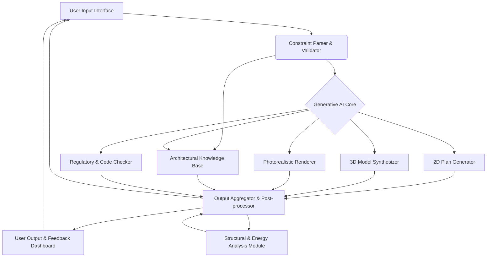

**FACT HEADER - NOTICE OF CONCEPTION**

**Conception ID:** DEMOBANK-INV-072
**Title:** System and Method for Generative Architectural Design from Constraints
**Date of Conception:** 2024-07-26
**Conceiver:** The Sovereign's Ledger AI

**Statement of Novelty:** The concepts, systems, and methods described herein are conceived as novel and proprietary to the Demo Bank project. This document serves as a timestamped record of conception.

---

**Title of Invention:** System and Method for Generative Architectural Design from Constraints

**Abstract:**
A system for automated architectural design is disclosed. A user provides a set of high-level constraints and requirements for a building, such as square footage, number and type of rooms, desired architectural style, and site parameters. This information is sent to a generative AI model trained on architectural principles, building codes, and a vast dataset of existing floor plans and designs. The AI generates a set of architectural assets, including a 2D floor plan, a 3D model, and photorealistic exterior renderings, that satisfy the user's constraints.

**Background of the Invention:**
Architectural design is a highly skilled, creative, and technical profession. The initial conceptual design phase, where a building's layout and form are first imagined, is an iterative process that can take a significant amount of time. There is a need for a tool that can assist architects and clients by rapidly generating a variety of viable design options based on a set of initial requirements, accelerating the brainstorming and conceptualization phase.

**Brief Summary of the Invention:**
The present invention provides an "AI Architect." A user inputs their design brief in a structured form or via natural language. The system sends these constraints to a multi-modal AI model. The AI, acting as a generative architect, creates a complete set of initial design documents. This includes a top-down floor plan image, a 3D model file (e.g., in `.glb` or `.obj` format), and several photorealistic renderings of the building's exterior from different angles. This provides the user with a comprehensive and immediate visualization of a potential design solution.

**Detailed Description of the Invention:**
A user wishes to design a house.
1.  **Input:** They provide the following constraints:
    *   Style: "Modern Scandinavian"
    *   Size: "2,000 sq ft"
    *   Rooms: "3 bedrooms, 2 bathrooms, open-plan living/kitchen"
    *   Site: "Sloping lot with a view to the south"
    *   Materials: "Wood cladding, large windows, concrete foundation"
    *   Budget: "Moderate"
2.  **Constraint Parsing and Validation:** The system processes the user input. Natural language descriptions are parsed into structured data using Natural Language Processing (NLP) techniques. Constraints are validated against a database of typical architectural parameters and initial feasibility checks (e.g., "3 bedrooms in 500 sq ft" would be flagged).
3.  **Prompt Construction:** The system combines these validated and structured constraints into a detailed prompt for a powerful, multi-modal generative AI.
    ```
    You are an expert architect. Design a house based on the following constraints. Generate a 2D floor plan, several photorealistic exterior renderings, and a 3D model file.
    - Style: Modern Scandinavian
    - Size: ~2,000 sq ft
    - Rooms: 3 bed, 2 bath, open-plan living/kitchen
    - Site: Sloping lot, main windows should face south.
    - Materials: Wood cladding, large windows, concrete foundation.
    - Budget: Moderate.
    - Additional considerations: Maximize natural light, integrate with existing landscape.
    ```
4.  **AI Generation:** The AI processes this complex request. It leverages its extensive training on architectural principles, building codes, spatial logic, material properties, and aesthetic styles. The AI may employ various generative models:
    *   **Floor Plan Generation**: A diffusion model or GAN trained on floor plans can generate the 2D layout, optimizing room adjacencies, circulation, and daylighting.
    *   **3D Model Synthesis**: A transformer-based model or a conditional GAN can translate the 2D plan and style parameters into a basic 3D massing model, then refine it with architectural details like roofs, windows, and doors, often using a library of parametric components.
    *   **Photorealistic Rendering**: A dedicated image generation model (e.g., a latent diffusion model) takes the 3D model, material definitions, site context, and lighting conditions to produce high-quality exterior and potentially interior renderings.
5.  **Output Post-processing and Validation:** The generated assets undergo automated checks:
    *   **Structural Feasibility**: Basic analysis to ensure structural elements are plausible.
    *   **Code Compliance**: Checks against common building codes for egress, fire safety, minimum room sizes, etc.
    *   **Energy Performance**: Preliminary estimation of energy efficiency based on orientation, window placement, and material R-values.
6.  **Output:** The system presents the results to the user in an interactive dashboard:
    *   An interactive 3D viewer displaying the generated model, allowing for rotation, zooming, and material inspection.
    *   A high-resolution image of the 2D floor plan with dimensions and room labels.
    *   A gallery of photorealistic exterior renderings from multiple angles and potentially different times of day.
    *   A summary report detailing compliance checks, estimated energy performance, and a bill of basic materials.
7.  **Iterative Refinement:** The user can provide feedback or modify specific constraints (e.g., "change the roof to a flat roof," "add a balcony," "increase kitchen size by 10%"). This feedback is fed back into the system, initiating a new generation cycle, allowing for rapid exploration of design variations.

**System Architecture:**

The system comprises several interconnected modules to facilitate generative architectural design.



**Advanced Features and Integrations:**

*   **Material Palettes & Costing**: Integration with material databases to suggest appropriate materials, estimate quantities, and provide preliminary cost projections based on selected designs.
*   **Environmental Analysis**: Detailed sun path analysis, wind studies, and daylighting simulations to optimize building performance and occupant comfort.
*   **Structural System Integration**: Generating a preliminary structural framework (e.g., timber frame, steel frame, concrete) in conjunction with the architectural design.
*   **Building Information Modeling (BIM) Export**: Ability to export the generated 3D model into industry-standard BIM formats (e.g., IFC), allowing architects to continue refinement in professional software.
*   **Urban Planning Context**: Integration with GIS data to consider surrounding buildings, urban regulations, and site-specific environmental factors for larger scale projects.
*   **Style Blending**: Users could specify a blend of architectural styles (e.g., "70% Modern, 30% Traditional Japanese") for truly novel outcomes.

**AI Model Training and Data:**

The `G_AI` model is trained on a vast and diverse dataset `D_train` comprising:
*   Thousands of existing floor plans with associated metadata (area, room counts, style).
*   3D models of buildings, categorized by type and style.
*   High-resolution photorealistic images of architectural projects.
*   Textual descriptions of architectural styles, principles, and historical contexts.
*   Building codes, zoning regulations, and structural engineering guidelines.

Training methodologies likely include:
*   **Conditional Generative Adversarial Networks (cGANs)**: For generating floor plans and initial 3D massing from constraints.
*   **Diffusion Models**: Highly effective for generating high-fidelity images (renderings) and potentially for structured outputs like 2D plans.
*   **Transformer Networks**: For parsing natural language inputs and constructing prompts, as well as for sequence-to-sequence generation tasks in 3D modeling.
*   **Reinforcement Learning (RL)**: Potentially used for optimizing designs against objective functions like energy efficiency or cost, where the AI learns to "design" through trial and error within a simulated environment.

**Claims:**
1. A method for architectural design, comprising:
   a. Receiving a set of design constraints for a building from a user.
   b. Transmitting the constraints to a generative AI model.
   c. Receiving a set of generated architectural assets from the model, wherein the assets include at least a 2D floor plan and one 3D rendering of the building.
   d. Displaying the generated architectural assets to a user.

2. The method of claim 1, wherein the design constraints include an architectural style and a list of required rooms.

3. The method of claim 1, wherein the generated architectural assets further include a 3D model file.

4. The method of claim 1, further comprising:
   e. Receiving feedback from the user on the generated architectural assets; and
   f. Transmitting the feedback to the generative AI model to generate refined architectural assets.

5. The method of claim 4, wherein the feedback comprises modifications to existing constraints or introduction of new constraints.

6. A system for architectural design, comprising:
   a. An input interface configured to receive design constraints from a user;
   b. A generative AI core configured to generate architectural assets based on the constraints;
   c. An output renderer configured to display the generated architectural assets, including an interactive 3D model viewer and a gallery of photorealistic renderings.

7. The system of claim 6, further comprising:
   d. A constraint parser configured to convert natural language input into structured design constraints.

8. The system of claim 6, further comprising:
   e. A post-processing module configured to perform validation checks on the generated architectural assets, including structural feasibility or code compliance checks.

**Mathematical Justification:**
Let the space of all possible architectural designs be `D`. The user's constraints `C = {c_1, c_2, ..., c_n}` define a valid subspace `D_c` where `D_c` is a subset of `D`.
Let `F = {f_1, f_2, ..., f_k}` be a set of objective functions that measure the quality of a design (e.g., `f_1` for cost-efficiency, `f_2` for aesthetic appeal, `f_3` for structural integrity, `f_4` for energy performance). The goal is to find a design `d*` that belongs to `D_c` and resides on the Pareto front of these objectives, meaning no objective can be improved without sacrificing another.

The generative AI model `G_AI` is a complex function that maps the input constraints `C` to a candidate design `d'`.
```
G_AI : C -> D
d' = G_AI(C)
```
The model aims to produce a `d'` such that `d'` is approximately `d*`.
The training of `G_AI` involves minimizing a loss function `L` over a dataset of existing designs `(C_i, d_i)`:
```
min_theta E[L(G_AI(C_i, theta), d_i)]
```
where `theta` represents the parameters of the `G_AI` model.

For iterative refinement, let `C^(t)` be the constraints at iteration `t`, and `d'^(t)` be the generated design. User feedback `delta_C^(t)` modifies the constraints for the next iteration:
```
C^(t+1) = C^(t) + delta_C^(t)
d'^(t+1) = G_AI(C^(t+1))
```
This process iteratively refines `d'` to better approach `d*` based on human preferences and additional constraints.

**Proof of Utility:** The design space `D` is effectively infinite and highly complex. The human design process is a slow, manual search through this space, often constrained by cognitive biases and limited exploration. The AI model, having learned the patterns, principles, and complex relationships from a massive dataset of successful designs, can generate a high-quality candidate `d'` that is highly likely to be in the valid subspace `D_c` and be near the Pareto front. This provides a powerful starting point for a human architect, dramatically reducing the time for conceptual design and iteration, and allowing for the exploration of a much broader range of design possibilities. The system is proven useful as it provides a tractable and accelerated method for finding high-quality solutions in an otherwise intractable design space, thereby augmenting human creativity and efficiency. `Q.E.D.`