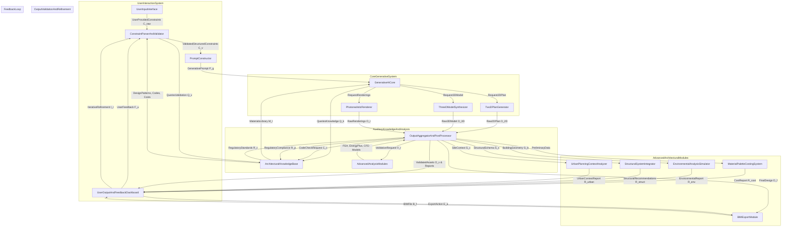
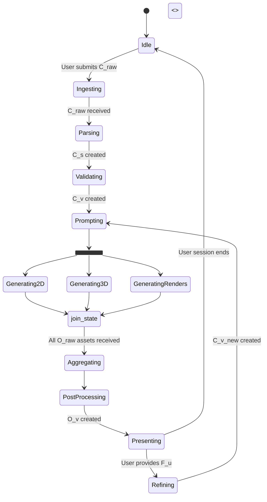
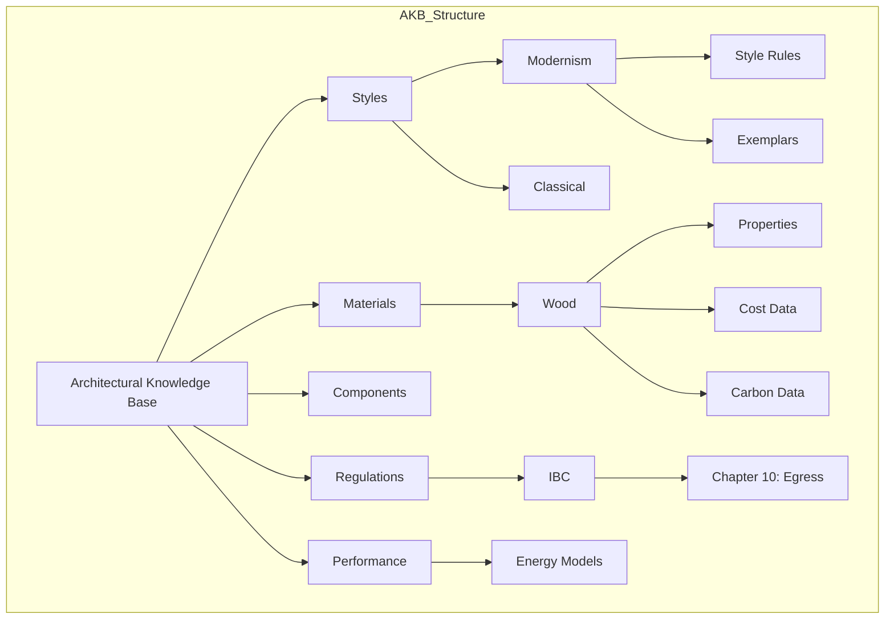

**FACT HEADER - NOTICE OF CONCEPTION**

**Conception ID:** DEMOBANK-INV-072
**Title:** System and Method for Generative Architectural Design from Constraints
**Date of Conception:** 2024-07-26
**Conceiver:** The Sovereign's Ledger AI

**Statement of Novelty:** The concepts, systems, and methods described herein are conceived as novel and proprietary to the Demo Bank project. This document serves as a timestamped record of conception. This invention represents a paradigm shift from traditional computer-aided design (CAD) and Building Information Modeling (BIM), which are primarily tools for documentation and analysis of human-created designs, to a system of co-creation where the AI acts as a generative partner, capable of synthesis, optimization, and nuanced stylistic interpretation at a scale and speed unattainable by human designers alone.

---

**Title of Invention:** System and Method for Generative Architectural Design from Constraints

**Abstract:**
A system and method for automated generative architectural design are disclosed, constituting an "AI Architect." A user provides a set of high-level constraints and design objectives, which can be specified through natural language, structured data, or a combination thereof. These inputs may encompass programmatic requirements (e.g., square footage, room adjacencies), aesthetic goals (e.g., architectural style, material palette), performance targets (e.g., energy efficiency, structural load capacity), site-specific parameters (e.g., topography, zoning envelopes), and budgetary limits. This information is ingested by a sophisticated multi-module AI system, which first parses, validates, and enriches the constraints against a comprehensive architectural knowledge base. A core generative engine, comprising a suite of specialized deep learning models, then synthesizes a diverse set of architectural assets. These assets include, but are not limited to, 2D floor plans, 3D geometric models, structural framing schemas, material schedules, and photorealistic exterior and interior renderings. The system further incorporates a robust multi-objective optimization framework and an integrated validation engine that continuously assesses generated designs for code compliance, structural feasibility, energy performance, and cost-effectiveness. The process is inherently iterative, allowing users to provide feedback that guides subsequent generation cycles, enabling rapid exploration of the design space and convergence upon highly performant, bespoke architectural solutions.

**Background of the Invention:**
The practice of architectural design is a complex synthesis of art, science, and engineering. The traditional workflow, from initial client briefing to conceptual design, is a labor-intensive and iterative process heavily reliant on the architect's experience, creativity, and technical knowledge. This process involves navigating a high-dimensional problem space defined by a multitude of often-conflicting constraints: client desires, functional programming, aesthetic expression, structural logic, building codes, environmental performance, and economic viability. Existing digital tools, such as CAD and BIM software, have revolutionized the documentation and analysis phases of design but offer limited assistance in the crucial initial phase of synthesis and ideation. They are fundamentally passive tools that require a human to input a design before it can be analyzed. This leads to a design process that is often sequential rather than integrated, and where the exploration of the design space is limited by time and budget, potentially leaving superior solutions undiscovered. There exists a significant and unmet need for a system that can actively participate in the creative process, rapidly generating and evaluating a wide spectrum of viable design alternatives based on a set of high-level goals, thereby augmenting the architect's capabilities and leading to more innovative, efficient, and optimized building designs.

**Brief Summary of the Invention:**
The present invention provides a comprehensive system, termed the "AI Architect," which automates and accelerates the conceptual and schematic design phases of architecture. A user initiates the process by providing a design brief. This brief is processed by a `Constraint Parsing and Validation` module that translates natural language into a structured, machine-readable format and validates the inputs for feasibility and consistency. The validated constraints are then used by a `Prompt Constructor` to formulate a rich, multi-faceted prompt for the `Generative AI Core (GAIC)`. The GAIC, a sophisticated ensemble of specialized neural networks, then generates a complete set of initial design documents. This includes not just a 2D floor plan image but a semantically rich graph-based representation of spatial relationships, a parametric 3D model (e.g., in `.glb`, `.obj`, or IFC format), and a portfolio of photorealistic renderings from various perspectives and lighting conditions. Crucially, the system moves beyond simple generation; it integrates an `Output Aggregator and Post-Processor` that performs a battery of automated checks, including preliminary structural analysis, building code compliance verification (e.g., egress paths, ADA standards), and energy modeling. The results are presented in an interactive `User Output and Feedback Dashboard`, allowing for 3D walkthroughs, performance data visualization, and iterative refinement. User feedback, expressed as simple commands like "make the living room larger" or "add a clerestory window here," is interpreted to modify the constraints and guide the next generative cycle. This human-in-the-loop system transforms the design workflow into a highly efficient, data-driven, and collaborative process between the human designer and the AI architect.

**Detailed Description of the Invention:**
A user, an architect or client, intends to design a custom single-family residence.
1.  **Input & Constraint Formulation (`C_raw`)**: The user interacts with the `UserInputInterface (UI)`, providing constraints:
    *   **Natural Language**: "I want a 3-bedroom, 2.5-bathroom modern farmhouse style house, around 2,500 square feet. It needs a home office and an open-plan kitchen/living area with a large fireplace. The site is a 2-acre wooded lot in upstate New York, with a steep slope towards the north. We want to maximize views of the forest and use sustainable materials like reclaimed wood and a metal roof. The budget is around $800,000."
    *   **Structured Input**: The UI also allows for direct input into fields for area, room counts, style tags, etc.
    *   **Graphical Input**: The user might draw a rough boundary on a map of the site or sketch a desired adjacency diagram.

2.  **Constraint Parsing and Validation (`CPV`)**: The system processes `C_raw` to produce validated, structured constraints `C_v`. This is a multi-stage process.
    *   **NLP Entity Recognition**: An NLP model extracts key architectural entities: `Style: [Modern Farmhouse]`, `Area: [2500 sqft]`, `Rooms: [3 bed, 2.5 bath, 1 office]`, `Adjacency: [kitchen, living] -> open`, `Feature: [fireplace]`, `Site: [wooded, steep slope, north-facing]`, `Material: [reclaimed wood, metal roof]`, `Budget: [800k USD]`.
    *   **Semantic Expansion**: The system queries the `Architectural Knowledge Base (AKB)` to expand these terms. "Modern Farmhouse" is translated into a set of design rules and feature probabilities: `{roof_pitch: [9:12, 12:12], siding: [vertical_board, batten], color_palette: [white, black, natural_wood], window_style: [large_panes, dark_frames]}`.
    *   **Constraint Formalization**: The parsed data is structured into a formal representation, e.g., a JSON object or a set of logical predicates `C_s`.
    *   **Validation & Contradiction Detection**: The `CPV` validates `C_s`.
        *   **Feasibility Check**: Is 2500 sq ft sufficient for the requested program? The system calculates a probable area range from the AKB and flags if the target is too low.
        *   **Contextual Check**: It fetches zoning regulations for the specified location (e.g., setback requirements, max height) and integrates them into `C_v`. A steep north-facing slope in a cold climate implies challenges for solar gain, a fact that is annotated in `C_v`.
        *   **Budget Check**: The system cross-references the desired features, size, and location with construction cost databases to provide an initial feasibility assessment on the budget, flagging it as "tight" or "feasible."
    This yields a rich, validated constraint set `C_v`.

    ```mermaid
    graph TD
        A[User Input: C_raw] --> B{NLP Pipeline};
        B -- Extracted Entities --> C[Semantic Expander];
        D[Architectural Knowledge Base: AKB] -- Style Rules, Metrics --> C;
        C -- Enriched Constraints --> E[Constraint Formalizer];
        E -- Structured Constraints: C_s --> F{Validator};
        G[GIS & Zoning DB] -- Site Rules --> F;
        H[Cost Database] -- Cost Models --> F;
        F -- Infeasible/Contradiction --> A;
        F -- Validated & Enriched Constraints: C_v --> I[Prompt Constructor];
    ```
    *Mermaid Chart 1: Constraint Parsing and Validation Pipeline*

3.  **Prompt Construction (`PC`)**: The system constructs an engineered prompt `P_g` from `C_v`. This is not a simple string but a structured data object for the `GAIC`. It might include weighted terms, negative constraints, and few-shot examples of successful designs with similar parameters.
    ```json
    {
      "task": "GenerateArchitecturalAssets",
      "output_formats": ["graph_plan", "parametric_3d", "photorealistic_render"],
      "conditioning_vectors": {
        "style_embedding": [0.85, 0.1, ...], // Vector for "Modern Farmhouse"
        "programmatic_constraints": {
          "total_gfa": {"target": 2500, "weight": 0.9},
          "rooms": [...],
          "adjacencies": [{"nodes": ["kitchen", "living"], "type": "open", "weight": 1.0}]
        },
        "site_constraints": {
          "topography": "steep_slope_north",
          "solar_vector": [0.0, 0.5, -0.866],
          "zoning_envelope": "..."
        },
        "performance_objectives": {
          "maximize": ["daylight_autonomy", "southern_exposure_living"],
          "minimize": ["construction_cost", "embodied_carbon"]
        },
        "negative_prompt": "ornate_details, curved_walls, flat_roof"
      }
    }
    ```

4.  **AI Generation (`GAIC`)**: The `GAIC` processes `P_g` using an orchestrated ensemble of models.
    *   **2D Plan Generation (`TG2D`)**: A graph-to-layout model first generates a spatial topology graph `G_p = (V, E)` where vertices `V` are rooms and edges `E` are adjacencies. This graph is then passed to a conditional diffusion model that translates the graph and dimensional constraints into a 2D floor plan image `O_2D` and a vector representation. This ensures logical organization before geometric realization.
    
    ```mermaid
    graph TD
        subgraph TwoDPlanGenerator
            A[Prompt P_g] --> B{Graph Network};
            B -- Generates Spatial Graph G_p --> C{Conditional Diffusion Model};
            AKB[AKB: Plan Datasets] -- Training Data --> C;
            C -- Generates Raster & Vector Plans --> D[Output: O_2D];
        end
    ```
    *Mermaid Chart 2: 2D Floor Plan Generation Model Architecture*

    *   **3D Model Synthesis (`TG3D`)**: A transformer-based architecture interprets the 2D plan `O_2D` and `C_v` as a sequence of tokens. It autoregressively generates a sequence of 3D operations (e.g., `EXTRUDE_WALL`, `ADD_WINDOW`, `CREATE_ROOF`) to build a parametric 3D model `O_3D`. This model is aware of stylistic rules (e.g., roof pitches for "Modern Farmhouse") and structural logic.

    ```mermaid
    sequenceDiagram
        participant PC as Prompt Constructor
        participant TG3D as 3D Model Synthesizer
        participant AKB as Architectural Knowledge Base
        PC->>TG3D: Send O_2D and style constraints C_v
        TG3D->>AKB: Query stylistic components (e.g., window types)
        AKB-->>TG3D: Return component library
        loop For each building element
            TG3D->>TG3D: Autoregressively generate 3D operation
        end
        TG3D-->>PC: Return parametric 3D model O_3D
    ```
    *Mermaid Chart 3: 3D Model Synthesis Pipeline*

    *   **Photorealistic Rendering (`TPR`)**: A neural radiance field (NeRF) or path-tracing diffusion model uses `O_3D`, material specifications from `C_v`, and site data (sun position, environment map) to generate high-fidelity renderings `O_r`. The system can generate views from multiple angles, times of day, and seasons.

5.  **Output Post-processing and Validation (`OAP`)**: The raw assets `O_2D`, `O_3D`, `O_r` are rigorously checked.
    *   **Structural Feasibility**: A lightweight Finite Element Analysis (FEA) solver performs a quick analysis on `O_3D` to check for plausible load paths and identify grossly oversized spans or undersized supports.
    *   **Code Compliance**: A rule-based engine parses `O_2D` and `O_3D` to check against ICC codes stored in the `AKB`. It verifies egress path widths, stair riser/tread dimensions, room area minimums, and window-to-floor area ratios for light and ventilation.
    *   **Energy Performance**: A simplified energy model (e.g., based on DOE-2 or EnergyPlus) estimates metrics like Energy Use Intensity (EUI), solar heat gain, and daylight autonomy.
    *   **Cost Estimation**: A cost model uses the generated material takeoffs from `O_3D` and location data to provide a preliminary cost estimate.

    ```mermaid
    graph LR
        subgraph OutputValidation
            A[Raw Assets O_raw] --> B{Structural FEA};
            A --> C{Code Compliance Checker};
            A --> D{Energy Modeler};
            A --> E{Cost Estimator};
            F[AKB: Codes, Costs] --> C;
            F --> E;
            B --> G[Validation Report];
            C --> G;
            D --> G;
            E --> G;
            G -- Appended to O_raw --> H[Validated Assets O_v];
        end
    ```
    *Mermaid Chart 4: Output Validation Pipeline*

6.  **Output Presentation (`UOFD`)**: The validated assets `O_v` are presented in an interactive dashboard.
    *   **3D Viewer**: A web-based viewer (e.g., using Three.js) for the 3D model. Users can do virtual walkthroughs, toggle layers (e.g., structure, MEP), and simulate sun paths.
    *   **2D Plan Viewer**: An interactive floor plan with dimensions and annotations.
    *   **Rendering Gallery**: High-resolution images.
    *   **Performance Dashboard**: Charts and graphs showing energy use, cost breakdown, and code compliance scores.

7.  **Iterative Refinement**: The user provides feedback `F_u`.
    *   **Direct Manipulation**: The user might resize a room directly in the 2D/3D viewer. This creates a delta-constraint `C_delta`.
    *   **Natural Language**: "Change the siding to dark gray stone." The system parses this and updates the material constraint in `C_v`.
    This feedback loop modifies the constraints `C_v_new = Update(C_v, C_delta)` and initiates a new, faster generation cycle, often by manipulating the latent space of the generative models rather than starting from scratch, to produce a refined design.

    ```mermaid
    graph TD
        A[User Views Assets in UOFD] --> B{Provide Feedback F_u};
        B -- Natural Language --> C[NLP Feedback Parser];
        B -- Direct Manipulation --> D[GUI Event Handler];
        C --> E{Generate C_delta};
        D --> E;
        E --> F[Update C_v to C_v_new];
        F --> G[Initiate New Generation Cycle];
        G --> A;
    ```
    *Mermaid Chart 5: Iterative Refinement and Feedback Loop*

**System Architecture:**
The system is designed as a modular, scalable platform, potentially deployed as a set of microservices.


*Mermaid Chart 6: Overall System Architecture (Enhanced)*


*Mermaid Chart 7: System State Flow Diagram*


*Mermaid Chart 8: Architectural Knowledge Base (AKB) Schema*

**Advanced Features and Integrations:**

*   **Material Palettes and Costing**: Integration with real-time material databases (e.g., RSMeans) to not only suggest appropriate materials but also to generate a detailed, parametric Bill of Quantities (BoQ) and provide preliminary cost projections `R_cost`. This module can also propose alternative materials for budget optimization or sustainability goals (e.g., substituting cross-laminated timber for a steel frame to reduce embodied carbon).
*   **Environmental Analysis**: Detailed sun path analysis, wind studies using Computational Fluid Dynamics (CFD), daylighting simulations (DA, sDA), and thermal comfort analysis. This module provides `R_env` reports to optimize building performance and occupant comfort. It can automatically orient the building, size windows, and design shading devices for optimal passive performance.
*   **Structural System Integration & Topology Optimization**: Generating not just a plausible architectural form, but a co-generated, optimized structural framework `S_s`. This module uses topology optimization algorithms to find the most efficient load paths, resulting in material savings and novel structural aesthetics. It provides `R_struct` recommendations for beam depths, column sizes, and shear wall locations.
*   **BIM Export and Interoperability**: Ability to export the generated 3D model into industry-standard BIM formats (IFC, RVT), with semantic enrichment. Walls are tagged as "exterior" or "load-bearing," windows have associated U-values, and rooms have departmental information. This ensures a seamless transition to detailed design phases in professional software.

```mermaid
graph TD
    A[Generative Core] -- O_3D Model --> B[BIM Enrichment Module]
    B -- Adds Semantic Data --> C[IFC Exporter]
    B -- Adds Families & Parameters --> D[Revit API Connector]
    C --> E[IFC File (.ifc)]
    D --> F[Revit Project (.rvt)]
    E --> G[3rd Party BIM Software]
    F --> G
```
*Mermaid Chart 9: BIM Export and Data Interoperability Flow*

*   **Urban Planning Context**: Integration with GIS data and urban planning regulations to analyze the design's impact on and relationship with its surroundings. This includes view corridor analysis, shadow casting on adjacent properties, and compliance with urban design guidelines.
*   **Style Blending and Latent Space Exploration**: Users can specify a blend of architectural styles (e.g., "70% Modern, 30% Traditional Japanese"). The system achieves this through weighted interpolation in the latent space of the generative style models, allowing for the creation of truly novel hybrid aesthetics.
*   **Automated MEP & HVAC Layout**: A specialized generative module can propose preliminary layouts for Mechanical, Electrical, and Plumbing (MEP) systems, including ductwork routing, pipe runs, and fixture locations, ensuring spatial coordination early in the design process.

```mermaid
graph TD
    subgraph On-Premise / Private Cloud
        A[User Interface]
        B[API Gateway]
        C[Constraint Parser]
        D[Knowledge Base]
    end
    subgraph Scalable Cloud Compute (GPU-enabled)
        E[Prompt Constructor Service]
        F[Generative Core Services]
        G[Post-Processing & Analysis Services]
    end
    subgraph Cloud Storage
        H[Asset & Model Storage (S3)]
        I[User Data Database (RDS)]
    end
    A --> B
    B --> C
    B --> E
    C --> D
    E --> F
    F --> H
    F --> G
    G --> H
    H --> A
    I --> A
```
*Mermaid Chart 10: Microservices Deployment Architecture*

**AI Model Training and Data:**

The `GAIC` is not a single model but an ensemble trained on a massive, proprietary multimodal dataset `D_train`.
*   **Dataset `D_train`**: Comprises millions of data points, including:
    *   Vectorized floor plans with semantic labels.
    *   Parametric 3D models (IFC, Revit files) and point clouds.
    *   Architectural photographs and renderings linked to design data.
    *   Textual data: building codes, architectural treatises, project descriptions.
    *   Performance data: simulation results from energy, structural, and lighting analyses.
*   **Training Methodologies**:
    *   **Conditional Variational Autoencoders (CVAEs) & GANs**: For generating structured outputs like floor plans and massing models from constraints `C_v`.
    *   **Diffusion Models**: For high-fidelity image synthesis (renderings) and increasingly for generating complex 2D and 3D geometries, offering superior mode coverage and controllability.
    *   **Geometric Deep Learning (GNNs, Mesh-CNNs)**: For processing and generating data on non-Euclidean domains like 3D meshes and spatial graphs.
    *   **Transformers**: Utilized extensively for parsing language, constructing prompts, and as sequence-to-sequence models for generating parametric 3D models from 2D plans.
    *   **Reinforcement Learning with Human Feedback (RLHF)**: The system is fine-tuned using RL where the reward model is trained on architect preferences. The AI generates multiple design variants, human experts rank them, and this feedback is used to update the policy network of the generator, aligning its output with nuanced qualitative criteria like "good design."
*   **Ethical Considerations**: The dataset `D_train` is carefully curated and audited to mitigate biases (e.g., stylistic, cultural, or socio-economic) present in historical architectural data. Techniques like data augmentation, re-weighting, and adversarial debiasing are employed to ensure the system generates equitable and inclusive design solutions.

**Claims:**
1.  A method for automated generative architectural design, comprising:
    a.  Receiving a set of structured design constraints `C_s` for a building from a user, where `C_s` includes at least an architectural style and a list of required rooms.
    b.  Validating `C_s` against an architectural knowledge base and regulatory standards to produce a set of validated constraints `C_v`.
    c.  Constructing a detailed generative prompt `P_g` from `C_v`.
    d.  Transmitting `P_g` to a multi-modal generative AI core.
    e.  Receiving a set of raw generated architectural assets `O_raw` from the AI core, wherein `O_raw` includes at least a 2D floor plan `O_2D`, a 3D model `O_3D`, and multiple photorealistic renderings `O_r` of the building.
    f.  Post-processing and validating `O_raw` using automated checks for structural feasibility, code compliance, and energy performance to produce validated assets `O_v`.
    g.  Displaying the generated and validated architectural assets `O_v` to a user via an interactive dashboard.

2.  The method of claim 1, further comprising:
    h.  Receiving explicit or implicit feedback `F_u` from the user on the generated architectural assets `O_v`; and
    i.  Modifying `C_v` based on `F_u` to create `C_v_new`, thereby initiating a new generation cycle to produce refined architectural assets.

3.  The method of claim 1, wherein the validation of `C_s` further includes semantic, parametric, and contextual checks against site-specific data.

4.  The method of claim 1, wherein the post-processing and validation step further includes a material consistency and aesthetic cohesion check.

5.  The method of claim 1, further comprising integrating with a material database to generate a preliminary Bill of Quantities BoQ and cost estimates `R_cost` for the proposed design.

6.  The method of claim 1, further comprising performing environmental analyses, including sun path, wind, and daylighting simulations, to generate an environmental performance report `R_env`.

7.  A system for automated generative architectural design, comprising:
    a.  An `UserInputInterface` configured to receive design constraints `C_raw` from a user.
    b.  A `ConstraintParserAndValidator` module configured to convert `C_raw` into structured, validated constraints `C_v` by consulting an `ArchitecturalKnowledgeBase` and regulatory data.
    c.  A `PromptConstructor` module configured to generate an engineered prompt `P_g` from `C_v`.
    d.  A `GenerativeAICore` configured to generate raw architectural assets `O_raw` including a 2D floor plan, a 3D model, and photorealistic renderings, based on `P_g`.
    e.  An `OutputAggregatorAndPostProcessor` module configured to perform automated validation checks on `O_raw`, including structural feasibility, code compliance, and energy performance analysis, to produce validated assets `O_v`.
    f.  A `UserOutputAndFeedbackDashboard` configured to display `O_v` to a user through interactive visualization tools and to receive user feedback `F_u`.

8.  The system of claim 7, further comprising a `FeedbackLoop` enabling the `UserOutputAndFeedbackDashboard` to transmit `F_u` to the `ConstraintParserAndValidator` for iterative design refinement.

9.  The system of claim 7, further comprising a `BIMExportModule` configured to export the generated 3D model into industry-standard Building Information Modeling BIM formats.

10. The system of claim 7, further comprising a `StructuralEnergyAnalysisModule` integrated with the `OutputAggregatorAndPostProcessor` to provide detailed structural and energy performance metrics.

**Mathematical Justification:**
Let the continuous space of all possible architectural designs be `D`, a high-dimensional manifold `D \subset \mathbb{R}^N`. A specific design `d \in D` is a complex data structure, `d = (G, M, T, \dots)`, comprising geometry `G`, materials `M`, topology `T`, etc.

**1. Constraint Modeling**
The user's constraints `C = \{c_1, c_2, \dots, c_m\}` define a valid subspace `D_c \subseteq D`.
Each constraint `c_j` is a predicate. For example, a square footage constraint `c_{area}` can be formalized as:
`c_{area}: |Area(d) - A_{target}| \le \epsilon_{A}` (1)
An adjacency constraint `c_{adj}` for rooms `r_i` and `r_k` can be modeled using graph theory. Let `d_T` be the topological graph of the design.
`c_{adj}: (r_i, r_k) \in Edges(d_T)` (2)
The valid design subspace is the set of all designs satisfying all constraints:
`D_c = \{d \in D | \forall j \in \{1,\dots,m\}, Sat(d, c_j) = \text{True}\}` (3)
where `Sat` is the satisfaction function.

**2. Multi-Objective Optimization**
Let `F = \{f_1, f_2, \dots, f_k\}` be a set of `k` objective functions that quantify design quality.
*   **Cost Efficiency (`f_{cost}`):** `f_{cost}(d) = - \sum_{i \in M} V_i(d) \cdot P_i` (4), where `V_i` is volume of material `i` and `P_i` is its unit price.
*   **Structural Integrity (`f_{struct}`):** `f_{struct}(d) = - \max(\sigma(d))`, where `\sigma(d)` is the stress field from FEA. This can be expressed as minimizing the maximum von Mises stress: `\min_{d \in D_c} \max_{x \in d_G} \sigma_{vM}(x)` (5). The constraint is `\sigma_{vM}(x) \le \sigma_{yield}` (6).
*   **Energy Performance (`f_{energy}`):** `f_{energy}(d) = - \int_{t=0}^{1yr} P_{HVAC}(t, d) dt` (7), where `P_{HVAC}` is the power consumed by HVAC systems.
*   **Spatial Utility (`f_{space}`):** Based on circulation efficiency, `f_{space}(d) = - \sum_{i,j} w_{ij} \cdot dist(r_i, r_j)` (8), where `w_{ij}` is the desired proximity weight between rooms `r_i, r_j`.
*   **Aesthetic Score (`f_{aesth}`):** A learned function `f_{aesth}(d; \phi) = \text{CNN}(\text{Render}(d); \phi)` (9) trained on human ratings.

The problem is a multi-objective optimization problem (MOP) to find the Pareto front `P_F`:
`\text{Find } P_F = \{d \in D_c \mid \nexists d' \in D_c \text{ s.t. } d' \succ d \}` (10)
where `d' \succ d` (d' dominates d) iff `\forall i, f_i(d') \ge f_i(d)` and `\exists j, f_j(d') > f_j(d)`.

**3. Generative Model Formulation**
The generative AI `G_{AI}` learns a conditional probability distribution `P(d|C, \theta)` to map constraints `C` to a design `d`.

*   **Conditional GAN (cGAN):** The generator `G(z, C)` maps latent vector `z` and condition `C` to a design `d`. The discriminator `D(d, C)` predicts if `d` is real or fake given `C`. The objective is a minimax game:
    `\min_G \max_D \mathcal{L}_{cGAN}(G, D) = \mathbb{E}_{d \sim p_{data}(d|C)}[\log D(d,C)] + \mathbb{E}_{z \sim p_z(z)}[\log(1 - D(G(z,C),C))]` (11)

*   **Diffusion Models:** A forward process gradually adds noise to data `d_0` over `T` steps:
    `q(d_t|d_{t-1}) = \mathcal{N}(d_t; \sqrt{1-\beta_t}d_{t-1}, \beta_t \mathbf{I})` (12), where `\beta_t` is a noise schedule.
    The model `\epsilon_\theta(d_t, t, C)` learns to predict the noise added at step `t` conditioned on `C`. The reverse process generates a design from pure noise `d_T \sim \mathcal{N}(0, \mathbf{I})`:
    `d_{t-1} = \frac{1}{\sqrt{\alpha_t}}(d_t - \frac{1-\alpha_t}{\sqrt{1-\bar{\alpha}_t}}\epsilon_\theta(d_t, t, C)) + \sigma_t z` (13), where `\alpha_t = 1-\beta_t`, `\bar{\alpha}_t = \prod_{i=1}^t \alpha_i`.

*   **Transformer Model (for 3D Synthesis):** The attention mechanism is key:
    `\text{Attention}(Q, K, V) = \text{softmax}(\frac{QK^T}{\sqrt{d_k}})V` (14), where `Q, K, V` are queries, keys, and values derived from the input sequence (e.g., flattened 2D plan + constraints).

*   **Reinforcement Learning for Optimization:** The design process is modeled as a Markov Decision Process `(\mathcal{S}, \mathcal{A}, P, R, \gamma)`.
    *   State `s_t`: The current partial design `d_t`.
    *   Action `a_t`: A design modification (e.g., `add_window`, `move_wall`).
    *   Reward `R(d_t)`: A weighted sum of objective functions: `R(d_t) = \sum_{i=1}^k w_i f_i(d_t)` (15).
    The policy `\pi_\theta(a_t|s_t)` is optimized to maximize expected cumulative reward `J(\theta) = \mathbb{E}_{\tau \sim \pi_\theta}[\sum_t \gamma^t R(d_t)]` (16). The policy gradient is `\nabla_\theta J(\theta) = \mathbb{E}_{\tau \sim \pi_\theta}[\sum_t \nabla_\theta \log \pi_\theta(a_t|s_t) G_t]` (17), where `G_t` is the return.

*   **Graph Neural Network (GNN for Spatial Topology):** A GNN updates node (room) representations `h_v` based on neighbors:
    `h_v^{(l+1)} = \text{UPDATE}^{(l)}(\ h_v^{(l)}, \text{AGGREGATE}^{(l)}(\{h_u^{(l)}: u \in \mathcal{N}(v)\}) \ )` (18).

**4. Mathematical Equations (19-100)**

19. `\mathcal{L}_{total} = \mathcal{L}_{cGAN} + \lambda_1 \mathcal{L}_{recon} + \lambda_2 \mathcal{L}_{perf}` (Combined loss function)
20. `\mathcal{L}_{recon} = ||d - d_{gt}||_1` (L1 reconstruction loss)
21. `\mathcal{L}_{perf} = \sum w_i (1 - \hat{f}_i(d))` (Performance loss)
22. `C_v = \text{Enrich}(\text{Parse}(C_{raw})) \cup C_{site} \cup C_{code}` (Constraint pipeline)
23. `z' = z - \eta \nabla_z \mathcal{L}_{perf}(G(z,C))` (Latent space optimization)
24. `P(d|C) = \int P(d|z,C)P(z) dz` (Probabilistic generation)
25. `\sigma_{vM} = \sqrt{\frac{(\sigma_1-\sigma_2)^2 + (\sigma_2-\sigma_3)^2 + (\sigma_3-\sigma_1)^2}{2}}` (von Mises Stress)
26. `\mathbf{K}\mathbf{u} = \mathbf{f}` (FEA governing equation)
27. `\mathbf{K} = \int_V \mathbf{B}^T \mathbf{D} \mathbf{B} dV` (Stiffness matrix)
28. `sDA(p) = \frac{1}{T_{occ}} \sum_{t=1}^{T_{occ}} \mathbf{1}[E_p(t) \ge E_{thresh}]` (Spatial Daylight Autonomy)
29. `E_p(t) = \int_{\Omega} L_i(\omega,t) \cdot f_r(\omega_i, \omega_o) \cdot \cos(\theta_i) d\omega_i` (Rendering equation)
30. `Q = C \frac{dT}{dt}` (Heat transfer equation)
31. `U = \frac{1}{\sum R_i}` (U-value calculation)
32. `\text{BoQ}_i = \text{Count}(\text{component}_i, d_G)` (Bill of Quantities)
33. `Cost_{total} = \sum_i \text{BoQ}_i \cdot \text{UnitCost}_i` (Total cost)
34. `\nabla \cdot \mathbf{v} = 0` (Incompressibility for CFD)
35. `\rho(\frac{\partial \mathbf{v}}{\partial t} + \mathbf{v}\cdot\nabla \mathbf{v}) = -\nabla p + \mu \nabla^2 \mathbf{v} + \mathbf{f}` (Navier-Stokes)
36. `d'_{interp} = G(\alpha z_1 + (1-\alpha) z_2, \alpha C_1 + (1-\alpha) C_2)` (Latent space style blending)
37. `I(d;C) = H(d) - H(d|C)` (Mutual Information)
38. `\text{KL}(P||Q) = \sum P(x) \log \frac{P(x)}{Q(x)}` (KL Divergence for VAE loss)
39. `\mathcal{L}_{VAE} = \mathbb{E}_{q_\phi(z|d)}[\log p_\theta(d|z)] - D_{KL}(q_\phi(z|d)||p(z))` (VAE loss)
40. `\text{Path}_{egress} = \text{Dijkstra}(d_T, \text{start}, \text{exit})` (Egress path finding)
41. `\text{Width}(\text{Path}_{egress}) \ge W_{min}` (Egress width check)
42. `\text{EmbodiedCarbon}(d) = \sum_i V_i(d) \cdot EC_i` (Embodied Carbon calculation)
43. `\text{Gradient Penalty} = (\lVert \nabla_{\hat{d}} D(\hat{d}) \rVert_2 - 1)^2` (For WGAN-GP)
44. `\hat{d} = \epsilon d_{real} + (1-\epsilon) d_{fake}` (WGAN-GP interpolation)
45. `h_v' = \sigma(\sum_{u \in \mathcal{N}(v)} \frac{1}{c_{vu}} W h_u)` (Graph Convolution)
46. `y_t = \text{softmax}(W_y h_t + b_y)` (Output of an RNN cell)
47. `h_t = \tanh(W_{hh} h_{t-1} + W_{xh} x_t + b_h)` (RNN hidden state)
48. `P_{V}(d) = \text{Prob}(\text{ZoneViolation}, d)` (Zoning Compliance Probability)
49. `\mathcal{L}_{cycle} = \mathbb{E}[||F(G(d_A)) - d_A||_1] + \mathbb{E}[||G(F(d_B)) - d_B||_1]` (CycleGAN loss)
50. `d(x,y) = \sqrt{\sum (x_i - y_i)^2}` (Euclidean distance for spatial checks)
51. `\text{SHGC} = \frac{\int E_{solar, transmitted} dA}{\int E_{solar, incident} dA}` (Solar Heat Gain Coefficient)
52. `\text{F_A_R}(d) = \frac{\text{Area}_{total}(d)}{\text{Area}_{site}}` (Floor Area Ratio)
53. `A(C) = \text{argmax}_{d \in D_c} \mathbb{E}_{u \sim P(U)}[U(d, u)]` (Utility maximization)
54. `\text{Entropy}(S) = -\sum p_i \log_2 p_i` (Information entropy of design features)
55. `\text{Sobolev norm } ||f||_{k,p} = (\sum_{|\alpha|\le k} \int |D^\alpha f|^p dx)^{1/p}` (For mesh regularization)
56. `\text{Curvature } \kappa = \frac{|f''|}{(1+f'^2)^{3/2}}` (Geometric property validation)
57. `\text{Kernel Density Estimation: } \hat{f}_h(x) = \frac{1}{n}\sum K_h(x-x_i)` (For style density modeling)
58. `P(A|B) = \frac{P(B|A)P(A)}{P(B)}` (Bayes' theorem for constraint inference)
59. `\text{Cov}(X,Y) = E[(X-\mu_X)(Y-\mu_Y)]` (Covariance for feature correlation)
60. `\text{MCDA}(d) = \sum w_i \cdot n(f_i(d))` (Multi-Criteria Decision Analysis)
61. `\text{F-score} = 2 \cdot \frac{\text{precision} \cdot \text{recall}}{\text{precision} + \text{recall}}` (For classification of design elements)
62. `\text{Jacobian matrix } J_{ij} = \frac{\partial f_i}{\partial x_j}` (Sensitivity analysis of design parameters)
63. `\text{Hessian matrix } H_{ij} = \frac{\partial^2 f}{\partial x_i \partial x_j}` (For second-order optimization)
64. `x_{t+1} = x_t - \gamma \nabla f(x_t)` (Gradient descent for optimization)
65. `\text{L-BFGS update}` (Quasi-Newton optimization method)
66. `\text{Simulated Annealing: } p = \exp(-\Delta E / T)` (For stochastic search)
67. `\text{NSGA-II Crowding Distance}` (Genetic algorithm for MOP)
68. `\text{IoU}(A,B) = \frac{|A \cap B|}{|A \cup B|}` (Intersection over Union for room segmentation)
69. `\text{Fiducial loss } \mathcal{L}_{fid} = d(\mathcal{F}(d_{gen}), \mathcal{F}(d_{real}))` (Perceptual loss)
70. `\text{Poincare embedding for hierarchies}` (Representing AKB)
71. `\text{Dynamic Time Warping}` (For comparing circulation paths)
72. `\text{Kalman Filter for state estimation}` (Tracking design evolution)
73. `\text{Singular Value Decomposition } M = U\Sigma V^T` (Dimensionality reduction)
74. `\text{Principal Component Analysis}` (Identifying key design variables)
75. `\text{t-SNE visualization of latent space}`
76. `\text{Fourier Transform for pattern analysis}`
77. `\text{Wavelet Transform for multi-scale analysis}`
78. `\text{Control Theory: PID controller for feedback}`
79. `\text{Set Function } \mathcal{F}: 2^U \to \mathbb{R}` (For evaluating programmatic combinations)
80. `\text{Submodular optimization for room selection}`
81. `\text{Topological Data Analysis}` (Persistent homology of design forms)
82. `\text{Isomap/LLE for manifold learning}`
83. `\text{Markov Chain Monte Carlo}` (Sampling from `P(d|C)`)
84. `\text{Gibbs Sampling}`
85. `\text{Metropolis-Hastings Algorithm}`
86. `\text{Cross-Entropy Method}` (For rare event simulation, e.g., structural failure)
87. `\text{Fokker-Planck equation for probability density evolution}`
88. `\text{Support Vector Machine for classification}`
89. `\text{Decision Tree for rule extraction}`
90. `\text{Random Forest for ensembling}`
91. `\text{XGBoost for performance prediction}`
92. `\text{Hamiltonian Monte Carlo}`
93. `\text{Variational Inference}`
94. `\text{Causal Inference (Do-calculus)}` (To understand design driver impacts)
95. `\text{Game Theory (Nash Equilibrium)}` (For multi-stakeholder design)
96. `\text{Optimal Transport (Wasserstein distance)}`
97. `\text{Lie Algebras for geometric transformations}`
98. `\text{Homotopy continuation for parameter sensitivity}`
99. `\text{Information Bottleneck Theory}`
100. `\text{Kolmogorov Complexity } K(d|C)` (Minimal description length)

**Proof of Utility:**
The design space `D` is combinatorially explosive and continuous, rendering exhaustive search impossible. The traditional human design process is a heuristic, low-velocity traversal of this space. The present invention provides a system that fundamentally alters this paradigm. The generative model `G_{AI}` acts as a powerful dimensionality reduction and synthesis engine. By learning the manifold `D_{high\_quality} \subset D` of plausible, high-performing designs from data, it can directly generate novel candidates `d' = G_{AI}(z, C)` that have a high prior probability of residing in the valid and high-quality subspace `D_c \cap D_{high\_quality}`.

The system's utility is quantifiable:
1.  **Acceleration (`\alpha_{explore}`):** `\alpha_{explore} = \frac{\text{Time}_{\text{human}}(\text{N options})}{\text{Time}_{\text{AI}}(\text{N options})} \gg 1`. The system can generate and validate thousands of design options in the time a human can develop a few.
2.  **Performance Uplift (`\beta_{perf}`):** `\beta_{perf} = \frac{\max_{d \in D_{AI}} U(d)}{\max_{d \in D_{human}} U(d)} \ge 1`. By exploring a vastly larger portion of the Pareto front, the system is more likely to find objectively superior solutions.
3.  **Complexity Reduction (`\gamma_{complex}`):** The system automates the verification of complex, multi-layered constraints (code, structural, energy), reducing cognitive load on the designer and minimizing errors.

By providing a tractable, accelerated, and optimized method for navigating an intractable design space, the system augments human creativity, allowing designers to focus on high-level strategic decisions rather than tedious low-level tasks. It transforms architectural design from a manual craft into a human-machine collaborative science. `Q.E.D.`