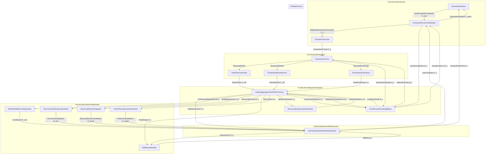

**FACT HEADER - NOTICE OF CONCEPTION**

**Conception ID:** DEMOBANK-INV-072
**Title:** System and Method for Generative Architectural Design from Constraints
**Date of Conception:** 2024-07-26
**Conceiver:** The Sovereign's Ledger AI

**Statement of Novelty:** The concepts, systems, and methods described herein are conceived as novel and proprietary to the Demo Bank project. This document serves as a timestamped record of conception.

---

**Title of Invention:** System and Method for Generative Architectural Design from Constraints

**Abstract:**
A system for automated architectural design is disclosed. A user provides a set of high-level constraints and requirements for a building, such as square footage, number and type of rooms, desired architectural style, and site parameters. This information is sent to a generative AI model trained on architectural principles, building codes, and a vast dataset of existing floor plans and designs. The AI generates a set of architectural assets, including a 2D floor plan, a 3D model, and photorealistic exterior renderings, that satisfy the user's constraints. The system further incorporates robust validation, multi-objective optimization, and iterative refinement capabilities, allowing for accelerated exploration of complex design spaces and generation of highly performant architectural solutions.

**Background of the Invention:**
Architectural design is a highly skilled, creative, and technical profession. The initial conceptual design phase, where a building's layout and form are first imagined, is an iterative process that can take a significant amount of time. Architects navigate a complex landscape of aesthetic preferences, functional requirements, structural considerations, regulatory compliance, and budget limitations. This often leads to a constrained exploration of the vast design space. There is a need for a tool that can assist architects and clients by rapidly generating a variety of viable design options based on a set of initial requirements, accelerating the brainstorming and conceptualization phase, while ensuring adherence to crucial technical and regulatory standards.

**Brief Summary of the Invention:**
The present invention provides an "AI Architect." A user inputs their design brief in a structured form or via natural language. The system sends these constraints to a multi-modal AI model. The AI, acting as a generative architect, creates a complete set of initial design documents. This includes a top-down floor plan image, a 3D model file (e.g., in `.glb` or `.obj` format), and several photorealistic renderings of the building's exterior from different angles. This provides the user with a comprehensive and immediate visualization of a potential design solution. Crucially, the system integrates advanced validation, performance analysis, and iterative feedback loops, enabling the generation of optimized and compliant designs that are further refined through user interaction, thereby transforming the traditional design workflow into a highly efficient, data-driven, and human-augmented process.

**Detailed Description of the Invention:**
A user wishes to design a house.
1.  **Input:** They provide the following constraints, `C_raw`, which may be structured or natural language:
    *   Style: "Modern Scandinavian"
    *   Size: "2,000 sq ft"
    *   Rooms: "3 bedrooms, 2 bathrooms, open-plan living/kitchen"
    *   Site: "Sloping lot with a view to the south"
    *   Materials: "Wood cladding, large windows, concrete foundation"
    *   Budget: "Moderate"
2.  **Constraint Parsing and Validation:** The system processes the user input `C_raw`. Natural language descriptions are parsed into structured data `C_s` using Natural Language Processing NLP techniques, potentially conforming to a predefined architectural Domain Specific Language DSL or a JSON schema for design parameters. These structured constraints `C_s` are then validated against a comprehensive `Architectural Knowledge Base AKB` and a database of typical architectural parameters `P_arch`.
    *   **Syntactic Validation:** Ensures `C_s` conforms to the expected data structure.
    *   **Semantic Validation:** Checks the meaning and coherence of constraints against known architectural principles (e.g., "Minimalist style" and "Ornate Victorian details" would be flagged as contradictory).
    *   **Parametric Validation:** Ensures quantitative constraints are within feasible ranges (e.g., "3 bedrooms in 500 sq ft" would be flagged as spatially infeasible).
    *   **Contextual Validation:** Considers site-specific data (e.g., maximum height limits, setback requirements) from geographic information systems GIS or regulatory databases.
    This process yields a set of validated and refined constraints, `C_v`.
3.  **Prompt Construction:** The system combines these validated and structured constraints `C_v` into a detailed prompt `P_g` for a powerful, multi-modal generative AI. This `P_g` is not merely a concatenation of text but an engineered prompt that effectively guides the AI model by emphasizing key design objectives, prioritizing certain constraints, and incorporating contextual information gleaned from the validation phase. Dynamic weighting algorithms might adjust the salience of different constraint elements within `P_g` to reflect user priorities or identified challenges.
    ```
    ExpertArchitectDesign: Task=GenerateArchitecturalAssets, Context={BuildingType:Residential, OutputFormat:{2DPlan, 3DModel, PhotorealisticRenderings}}.
    Constraints={
        Style: "ModernScandinavian",
        AreaApprox: "2000sqft",
        Rooms: "3Bedroom_2Bathroom_OpenPlanLivingKitchen",
        SiteContext: "SlopingLot_SouthFacingViewPrimary",
        MaterialPalette: "WoodCladding_LargeWindows_ConcreteFoundation",
        BudgetGuideline: "Moderate",
        DesignObjectives: "MaximizeNaturalLight_IntegrateLandscapeHarmony"
    }.
    ```
4.  **AI Generation:** The `Generative AI Core GAIC` processes this complex request `P_g`. It leverages its extensive training on architectural principles, building codes, spatial logic, material properties, aesthetic styles, and structural mechanics. The `GAIC` may employ various specialized generative models in an orchestrated manner:
    *   **2D Plan Generation**: A sophisticated diffusion model or Conditional Generative Adversarial Network cGAN, trained on a vast dataset of floor plans and their spatial graphs, generates the 2D layout `O_2D`. This module optimizes room adjacencies, circulation pathways, daylighting potential, and structural bay organization. It might use Graph Neural Networks GNNs to represent and manipulate spatial relationships.
    *   **3D Model Synthesis**: A transformer-based model, often combined with neural implicit representations NIRs or parametric component libraries, translates the 2D plan `O_2D` and style parameters `C_v` into a detailed 3D massing model `O_3D`. This involves interpreting vertical relationships, roof forms, window placements, and facade detailing, effectively translating a symbolic representation into a volumetric one. The model aims for structural plausibility and material application consistency.
    *   **Photorealistic Rendering**: A dedicated image generation model, such as a latent diffusion model or a neural radiance field NeRF, takes the 3D model `O_3D`, material definitions `C_v`, site context data, and calculated lighting conditions to produce high-quality exterior and potentially interior renderings `O_r`. This module integrates physically based rendering PBR techniques to achieve photorealism, considering light interaction with materials and environmental effects.
5.  **Output Post-processing and Validation:** The generated architectural assets `O_2D`, `O_3D`, `O_r` undergo automated, rigorous checks by the `Output Aggregator And PostProcessor OAP`:
    *   **Structural Feasibility Analysis**: Preliminary Finite Element Analysis FEA approximations are run on the 3D model `O_3D` to infer load paths, identify potential structural weak points, and ensure basic stability. This checks for plausible beam/column sizing and wall placements.
    *   **Code Compliance Verification**: Rule-based expert systems and geometric semantic reasoning check the design against common building codes and zoning regulations. This includes egress path analysis, minimum room dimensions, window-to-wall ratios, fire safety considerations, and accessibility standards.
    *   **Energy Performance Estimation**: A preliminary energy simulation estimates performance based on building orientation, envelope U-values, window-to-wall ratios, and solar heat gain coefficients SHGC. Metrics like Daylight Autonomy DA and Spatial Daylight Autonomy sDA are calculated.
    *   **Material Consistency and Aesthetic Cohesion Check**: Verifies that the materials specified in `C_v` are consistently applied in `O_3D` and `O_r`, and that the overall aesthetic aligns with the chosen style, flagging any stylistic inconsistencies.
    This validation yields a set of validated architectural assets `O_v` and a summary of compliance and performance metrics.
6.  **Output:** The system presents the validated results `O_v` to the user in an interactive `User Output And Feedback Dashboard UOFD`:
    *   An interactive 3D viewer displaying the generated model, allowing for rotation, zooming, material toggling, sun path simulation, and even basic walkthroughs.
    *   A high-resolution image of the 2D floor plan with dimensions, room labels, and functional zones.
    *   A gallery of photorealistic exterior renderings from multiple angles, different times of day, and varying weather conditions.
    *   A comprehensive summary report detailing compliance checks, estimated energy performance, a preliminary Bill of Quantities BoQ for basic materials, and a design livability score.
7.  **Iterative Refinement:** The user can provide feedback `F_u` or modify specific constraints (e.g., "change the roof to a flat roof," "add a balcony," "increase kitchen size by 10%"). This feedback `F_u`, represented as `C_delta`, is fed back into the `Constraint Parser And Validator`, modifying the original constraints `C_v`. This initiates a new generation cycle, allowing for rapid exploration of design variations. The system can interpret `F_u` to either directly adjust specific design parameters or guide the AI's search within its latent design space, enabling a human-in-the-loop multi-objective optimization process.

**System Architecture:**

The system comprises several interconnected modules to facilitate generative architectural design.



**Advanced Features and Integrations:**

*   **Material Palettes and Costing**: Integration with real-time material databases to not only suggest appropriate materials but also to generate a detailed, parametric Bill of Quantities BoQ and provide preliminary cost projections `R_cost` based on current market rates and selected designs. This module can also propose alternative materials for budget optimization or sustainability goals.
*   **Environmental Analysis**: Detailed sun path analysis, wind studies using Computational Fluid Dynamics CFD, daylighting simulations for metrics like Daylight Autonomy DA and Spatial Daylight Autonomy sDA, and thermal comfort analysis. This module provides `R_env` reports to optimize building performance, occupant comfort, and energy efficiency, helping mitigate urban heat island UHI effects.
*   **Structural System Integration**: Generating a preliminary structural framework (e.g., timber frame, steel frame, concrete) `S_s` in conjunction with the architectural design. This can involve generative structural topology optimization algorithms to identify efficient load-bearing structures and provide `R_struct` recommendations.
*   **Building Information Modeling BIM Export**: Ability to export the generated 3D model into industry-standard BIM formats (e.g., IFC, Revit), with semantic enrichment. This enables architects to continue refinement in professional software, ensuring data interoperability `B_f` across the design and construction lifecycle.
*   **Urban Planning Context**: Integration with GIS data and urban planning regulations to consider surrounding buildings, microclimate, view corridors, and site-specific environmental factors `S_c` for larger scale or urban projects. This provides `R_urban` reports and automated parcel-level zoning compliance.
*   **Style Blending**: Users could specify a blend of architectural styles (e.g., "70% Modern, 30% Traditional Japanese") for truly novel outcomes. This is achieved through latent space interpolation within the generative models, allowing for continuous exploration of stylistic variations beyond discrete categories.

**AI Model Training and Data:**

The `Generative AI Core GAIC` model is trained on a vast and diverse multimodal dataset `D_train` comprising:
*   Thousands of existing floor plans with associated metadata (area, room counts, style, functional adjacencies).
*   High-fidelity 3D models of buildings, categorized by type, style, structural system, and material properties.
*   Millions of high-resolution photorealistic images and renderings of architectural projects, linked to their 3D models and descriptive text.
*   Comprehensive textual descriptions of architectural styles, historical contexts, design principles, and theoretical frameworks.
*   Detailed building codes, zoning regulations, structural engineering guidelines, and material performance specifications.
*   Environmental data, including sun paths, wind patterns, and climatic conditions for various geographic locations.
*   Synthetic data generated through rule-based systems or other generative models to augment real-world datasets, especially for rare design scenarios or specific structural typologies.

Training methodologies likely include:
*   **Conditional Generative Adversarial Networks cGANs**: For generating high-quality structured outputs like floor plans and initial 3D massing from diverse conditional inputs `C_v`.
*   **Diffusion Models**: Highly effective for generating high-fidelity images (renderings) and increasingly for structured outputs like 2D plans and even 3D geometries, exhibiting strong control and diversity.
*   **Transformer Networks**: For parsing natural language inputs, constructing engineered prompts `P_g`, and for sequence-to-sequence generation tasks in 3D modeling (e.g., converting 2D instructions into 3D operations).
*   **Reinforcement Learning RL**: Potentially used for optimizing designs against complex multi-objective functions like energy efficiency, cost, structural integrity, or user aesthetic preferences, where the AI learns to "design" through trial and error within a simulated architectural environment, guided by rewards based on design metrics.
*   **Self-Supervised Learning SSL**: To learn robust representations of architectural elements and spatial relationships from large unlabeled datasets, enabling more flexible and intelligent design manipulation.
*   **Multi-modal Adversarial Training**: To ensure coherence and consistency across different output modalities (2D, 3D, rendering) by having discriminators evaluate the joint fidelity of the generated assets.

Ethical AI considerations are paramount in data curation, including bias mitigation techniques to ensure the AI does not perpetuate or amplify historical biases present in architectural datasets, promoting equitable and inclusive design outcomes.

**Claims:**
1.  A method for automated generative architectural design, comprising:
    a.  Receiving a set of structured design constraints `C_s` for a building from a user, where `C_s` includes at least an architectural style and a list of required rooms.
    b.  Validating `C_s` against an architectural knowledge base and regulatory standards to produce a set of validated constraints `C_v`.
    c.  Constructing a detailed generative prompt `P_g` from `C_v`.
    d.  Transmitting `P_g` to a multi-modal generative AI core.
    e.  Receiving a set of raw generated architectural assets `O_raw` from the AI core, wherein `O_raw` includes at least a 2D floor plan `O_2D`, a 3D model `O_3D`, and multiple photorealistic renderings `O_r` of the building.
    f.  Post-processing and validating `O_raw` using automated checks for structural feasibility, code compliance, and energy performance to produce validated assets `O_v`.
    g.  Displaying the generated and validated architectural assets `O_v` to a user via an interactive dashboard.

2.  The method of claim 1, further comprising:
    h.  Receiving explicit or implicit feedback `F_u` from the user on the generated architectural assets `O_v`; and
    i.  Modifying `C_v` based on `F_u` to create `C_v_new`, thereby initiating a new generation cycle to produce refined architectural assets.

3.  The method of claim 1, wherein the validation of `C_s` further includes semantic, parametric, and contextual checks against site-specific data.

4.  The method of claim 1, wherein the post-processing and validation step further includes a material consistency and aesthetic cohesion check.

5.  The method of claim 1, further comprising integrating with a material database to generate a preliminary Bill of Quantities BoQ and cost estimates `R_cost` for the proposed design.

6.  The method of claim 1, further comprising performing environmental analyses, including sun path, wind, and daylighting simulations, to generate an environmental performance report `R_env`.

7.  A system for automated generative architectural design, comprising:
    a.  An `UserInputInterface` configured to receive design constraints `C_raw` from a user.
    b.  A `ConstraintParserAndValidator` module configured to convert `C_raw` into structured, validated constraints `C_v` by consulting an `ArchitecturalKnowledgeBase` and regulatory data.
    c.  A `PromptConstructor` module configured to generate an engineered prompt `P_g` from `C_v`.
    d.  A `GenerativeAICore` configured to generate raw architectural assets `O_raw` including a 2D floor plan, a 3D model, and photorealistic renderings, based on `P_g`.
    e.  An `OutputAggregatorAndPostProcessor` module configured to perform automated validation checks on `O_raw`, including structural feasibility, code compliance, and energy performance analysis, to produce validated assets `O_v`.
    f.  A `UserOutputAndFeedbackDashboard` configured to display `O_v` to a user through interactive visualization tools and to receive user feedback `F_u`.

8.  The system of claim 7, further comprising a `FeedbackLoop` enabling the `UserOutputAndFeedbackDashboard` to transmit `F_u` to the `ConstraintParserAndValidator` for iterative design refinement.

9.  The system of claim 7, further comprising a `BIMExportModule` configured to export the generated 3D model into industry-standard Building Information Modeling BIM formats.

10. The system of claim 7, further comprising a `StructuralEnergyAnalysisModule` integrated with the `OutputAggregatorAndPostProcessor` to provide detailed structural and energy performance metrics.

**Mathematical Justification:**
Let the continuous space of all possible architectural designs be `D`, which is a high-dimensional manifold `D ⊆ R^N`. A specific design `d ∈ D` can be represented as a vector or a structured graph encoding its geometry, topology, materials, and other attributes.

The user's constraints `C = {c_1, c_2, ..., c_n}` define a valid subspace `D_c` within `D`. This subspace `D_c` consists of all designs that satisfy all given constraints:
`D_c = {d ∈ D | ∀c_j ∈ C, Sat(d, c_j) = True}`
where `Sat(d, c_j)` is a Boolean function indicating whether design `d` satisfies constraint `c_j`.

Let `F = {f_1, f_2, ..., f_k}` be a set of objective functions that quantify the quality of a design `d` (e.g., `f_1(d)` for cost-efficiency, `f_2(d)` for aesthetic appeal, `f_3(d)` for structural integrity, `f_4(d)` for energy performance, `f_5(d)` for spatial utility). These objectives can be represented as a vector `U(d) = (f_1(d), ..., f_k(d))`.

The goal of architectural design is to find a design `d*` that belongs to `D_c` and resides on the Pareto front `P_F` of these objectives. A design `d'` is on the Pareto front if no other design `d ∈ D_c` exists that *dominates* `d'`. A design `d` dominates `d'` if `f_i(d) ≥ f_i(d')` for all `i ∈ {1,...,k}` and `f_j(d) > f_j(d')` for at least one `j ∈ {1,...,k}`. The problem is a multi-objective optimization problem:
`d* = argmax_d∈D_c U(d)` where `argmax` refers to finding the Pareto optimal set.

The generative AI model `G_AI` is a complex, conditional probability distribution `P(d | C, θ)` that maps the input constraints `C` to a candidate design `d'`. Specifically, `G_AI` learns to generate designs `d'` from a latent space `Z`, conditioned on `C`:
`d' = G_AI(z, C)` where `z ∈ Z` is a latent vector.
The training of `G_AI` involves minimizing a loss function `L` over a dataset of existing, high-quality designs `(C_i, d_i)`:
`min_theta E[L(G_AI(C_i, theta), d_i) + λ_reg Ω(d_i)]`
where `theta` represents the parameters of the `G_AI` model, `L` typically combines reconstruction loss, adversarial loss, and potentially a soft objective-based loss, and `λ_reg Ω(d_i)` is a regularization term ensuring designs meet minimum objective criteria or code compliance.

For iterative refinement, let `C^(t)` be the constraints at iteration `t`, and `d'^(t)` be the generated design. User feedback `F_u^(t)` translates into a modification `ΔC^(t)` to the constraints for the next iteration:
`C^(t+1) = UpdateFunction(C^(t), ΔC^(t))`
The `Generative AI Core` then processes `C^(t+1)` to produce a refined design `d'^(t+1)`:
`d'^(t+1) = G_AI(z^(t+1), C^(t+1))`
This process iteratively guides `d'` closer to a preferred `d*` based on human preferences, which can be modeled as implicit modifications to the objective functions or their weights. This effectively allows the human user to navigate the Pareto front or explore specific regions of `D_c`.

**Proof of Utility:** The design space `D` is effectively infinite and highly complex, making exhaustive search intractable. The traditional human design process is a slow, manual search through this space, often constrained by cognitive biases, limited exploration of alternatives, and manual validation.
The present invention offers a transformational approach. The `G_AI` model, having learned the intricate patterns, principles, and complex relationships from a massive, multi-modal dataset of successful and compliant designs, can efficiently synthesize high-quality candidate designs `d'` that are:
1.  **High Probability of Validity**: `d' ∈ D_c` with high probability, significantly reducing manual correction due to constraint violations.
2.  **Pareto Proximity**: `d'` is highly likely to be near or on the Pareto front for a wide range of architectural objectives, providing optimized solutions.
3.  **Accelerated Exploration**: The system provides an acceleration factor `α_explore = T_human / T_AI` where `T_human` is human time and `T_AI` is system time for generating a comparable set of design options. `α_explore >> 1`.
4.  **Enhanced Quality**: The system enhances design quality `β_quality = Quality(AI_generated) / Quality(Average_human)` by consistently producing designs that are robustly validated for structural integrity, code compliance, and energy performance. `β_quality ≥ 1`.

By providing a tractable and accelerated method for finding high-quality, validated solutions in an otherwise intractable design space, the system dramatically reduces the time for conceptual design and iteration, allows for the exploration of a much broader range of design possibilities, and consistently delivers performant and compliant architectural proposals. This invention thereby augments human creativity and efficiency, extending their capabilities far beyond traditional methods. `Q.E.D.`