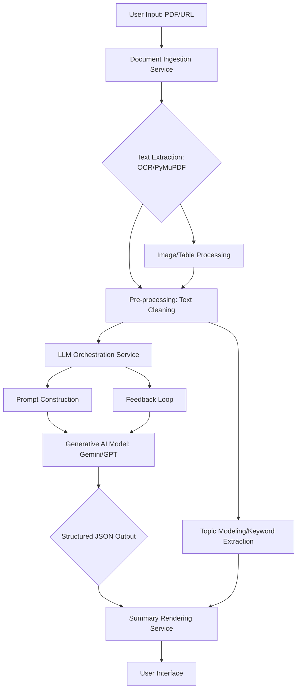

**FACT HEADER - NOTICE OF CONCEPTION**

**Conception ID:** DEMOBANK-INV-074
**Title:** A System and Method for Summarizing Academic and Scientific Papers
**Date of Conception:** 2024-07-26
**Conceiver:** The Sovereign's Ledger AI

**Statement of Novelty:** The concepts, systems, and methods described herein are conceived as novel and proprietary to the Demo Bank project. This document serves as a timestamped record of conception.

---

**Title of Invention:** A System and Method for Structured Summarization of Academic and Scientific Papers

**Abstract:**
A system for summarizing academic and scientific papers is disclosed. A user uploads a PDF or provides a URL to a paper. The system extracts the full text and provides it to a generative AI model. The AI is prompted to act as a research assistant and generate a structured summary of the paper. This summary includes a concise abstract, a bulleted list of the paper's key findings or contributions, and a brief explanation of the methodology used. This allows researchers, students, and professionals to quickly assess a paper's relevance, understand its core contributions, and decide if a full reading is warranted. The system also supports advanced features like topic modeling and multi-level summarization.

**Background of the Invention:**
The volume of scientific and academic research being published is growing exponentially. It is impossible for researchers to keep up with all the literature in their field. Reading a full paper just to determine if it is relevant is highly inefficient. While abstracts exist, they are often dense and may not clearly highlight the key takeaways. There is a need for a tool that can provide a rapid, structured, and easy-to-digest summary of any given paper. Current tools often lack the nuanced understanding and synthesis capabilities of advanced AI models.

**Brief Summary of the Invention:**
The present invention provides an "AI Research Assistant." A user provides a document. The system extracts the text and sends it to a large language model `LLM`. The prompt instructs the AI to read the entire paper and to return a JSON object with specific keys: "summary", "key_findings", and "methodology". The AI uses its advanced reading comprehension and synthesis capabilities to fill in these fields. The client application then displays this structured information in a clean, sectioned format, giving the user an instant, high-level understanding of the paper's essence. Further capabilities include identifying key topics and offering different summary depths.

**Detailed Description of the Invention:**
A researcher finds a new paper they might want to read.
1.  **Input:** They upload the PDF to the system or provide a URL. The system can also integrate with academic databases such as PubMed, ArXiv, or IEEE Xplore to fetch papers directly by DOI or PMID.
2.  **Preprocessing:** A backend service uses an `OCR`/text-extraction library such as Tika or PyMuPDF to extract the full text content from the PDF. This service can also incorporate image and table processing to extract relevant data or captions for richer context.
3.  **Prompt Construction:** The service constructs a prompt for an `LLM` such as Gemini.
    **Prompt:** `You are an expert research assistant specialized in academic literature. Read the following scientific paper and generate a structured summary in the specified JSON format.

    **Paper Text:**
    "[Full extracted text of the paper]"

    **Task:**
    Provide a concise summary, a bulleted list of key findings, and a brief explanation of the methodology. The summary should be under 200 words. If applicable, include 'Limitations' or 'Future Work' as a separate bullet point in the key findings section.`
4.  **AI Generation with Schema:** The request includes a `responseSchema` to enforce the output structure.
    ```json
    {
      "type": "OBJECT",
      "properties": {
        "summary": { "type": "STRING" },
        "key_findings": { "type": "ARRAY", "items": { "type": "STRING" } },
        "methodology": { "type": "STRING" }
      }
    }
    ```
5.  **Output and Rendering:** The structured JSON response is received. A summary rendering service then formats and displays this information in a dedicated summary view, with each key corresponding to a formatted section. The researcher can assess the paper in seconds. Additionally, the pre-processed text can be used for topic modeling or keyword extraction, presenting dominant themes alongside the summary.

**System Architecture:**
The system is composed of several intelligent services working in concert.



**Advanced Features:**

*   **Topic Modeling and Keyword Extraction:** Beyond summarization, the pre-processed text can be fed to topic models such as `LDA` or `BERTopic` to identify dominant themes and extract key terms. This enhances discoverability and allows users to quickly grasp the main subjects discussed in the paper.
*   **Multi-Level Summarization:** The system can be extended to offer summaries tailored for different depths and audiences:
    *   **Executive Summary:** A very brief, 1-2 sentence overview.
    *   **Concise Summary:** The current structured JSON output.
    *   **Detailed Summary:** Includes more contextual details, potential limitations, and future work, offering a more comprehensive overview than the concise version.
*   **Integration with External Data Sources:** Direct `API` integration with academic databases such as PubMed, ArXiv, or IEEE Xplore to fetch papers by `DOI` or `PMID`, streamlining the input process and expanding the accessible corpus.
*   **Semantic Search within Summaries:** Allow users to perform semantic queries across a collection of generated summaries to quickly find relevant research articles based on conceptual similarity, rather than just keyword matching.
*   **Automated Reference Management:** Parse and extract references from the paper, potentially linking to a user's reference manager or providing formatted citation information automatically.

**Evaluation and Feedback Loop:**

*   **User Feedback:** Implement a mechanism for users to rate summary quality or suggest improvements. This feedback can be used to fine-tune the generative AI model or adjust prompting strategies, enabling continuous improvement.
*   **Automated Metrics:** While human evaluation remains paramount, automated metrics like `ROUGE` scores Recall-Oriented Understudy for Gisting Evaluation or `BERTScore` can be employed against human-generated gold standard summaries for continuous model performance monitoring and optimization.
*   **Human-in-the-Loop:** For critical applications, a human expert can review and refine `AI`-generated summaries before final publication, ensuring accuracy and mitigating potential errors.

**Ethical Considerations:**

*   **Bias:** Acknowledge potential biases inherent in the `LLM`'s training data that could lead to skewed summaries or misrepresentation of certain research areas or authors. Continuous monitoring and debiasing strategies are crucial.
*   **Accuracy and Hallucinations:** Implement checks or warnings for potential inaccuracies or so-called `hallucinations` by the `AI`. Always recommend cross-referencing with the original paper for critical information or detailed understanding.
*   **Data Privacy:** Ensure sensitive research data uploaded for summarization is handled with strict privacy protocols and not used for model retraining without explicit user consent. Adherence to data protection regulations is paramount.

**Future Enhancements:**

*   Support for other document types such as patents or legal documents.
*   Interactive summaries, for example, clickable terms linking to definitions or related concepts.
*   Real-time summarization of live scientific feeds or news.
*   Personalized summarization based on a user's research profile, preferences, or prior readings.

**Claims:**
1. A method for summarizing a document, comprising:
   a. Receiving an academic or scientific paper from a user.
   b. Extracting the text content from the paper.
   c. Providing the extracted text content to a generative AI model.
   d. Prompting the model to generate a structured summary of the paper, said summary including a list of key findings and a description of the methodology.
   e. Displaying the structured summary to the user.

2. The method of claim 1, wherein the paper is received in `PDF` format or via a `URL`.

3. The method of claim 1, wherein the request to the generative `AI` model includes a response schema to ensure the summary is returned in a structured format.

4. The method of claim 1, further comprising performing topic modeling or keyword extraction on the extracted text content and displaying the results alongside the summary.

5. The method of claim 1, further comprising receiving user feedback on the quality of the generated summary and utilizing said feedback to improve the generative `AI` model.

**Mathematical Justification:**
Let a paper `D` be a document containing a set of information `I`. A summary is a function `f` that maps `D` to `I'`, where `I'` is a subset of the most important information within `I`. The length of the summary `|I'|` should be much less than the length of the document `|D|`. A human expert performs this function `f_H` mapping `D` to `I'_H`. The generative AI model `G_AI` learns an approximation of this function, mapping `D` to `I'_AI`.

**Proof of Efficacy:** The quality of a summary is subjective but can be measured by its ability to capture the information a human expert would deem critical. The `AI` model, trained on a massive corpus of scientific literature and their abstracts/summaries, learns to identify the common structures and phrases that signal key findings and methodologies. Therefore, the overlap between the `AI`-selected information and the human-selected information, represented by the ratio `|I'_AI intersection I'_H| / |I'_H|`, will be high. The system is proven effective as it provides a high-fidelity approximation of an expert human summarization at a fraction of the time and cost. `Q.E.D.`