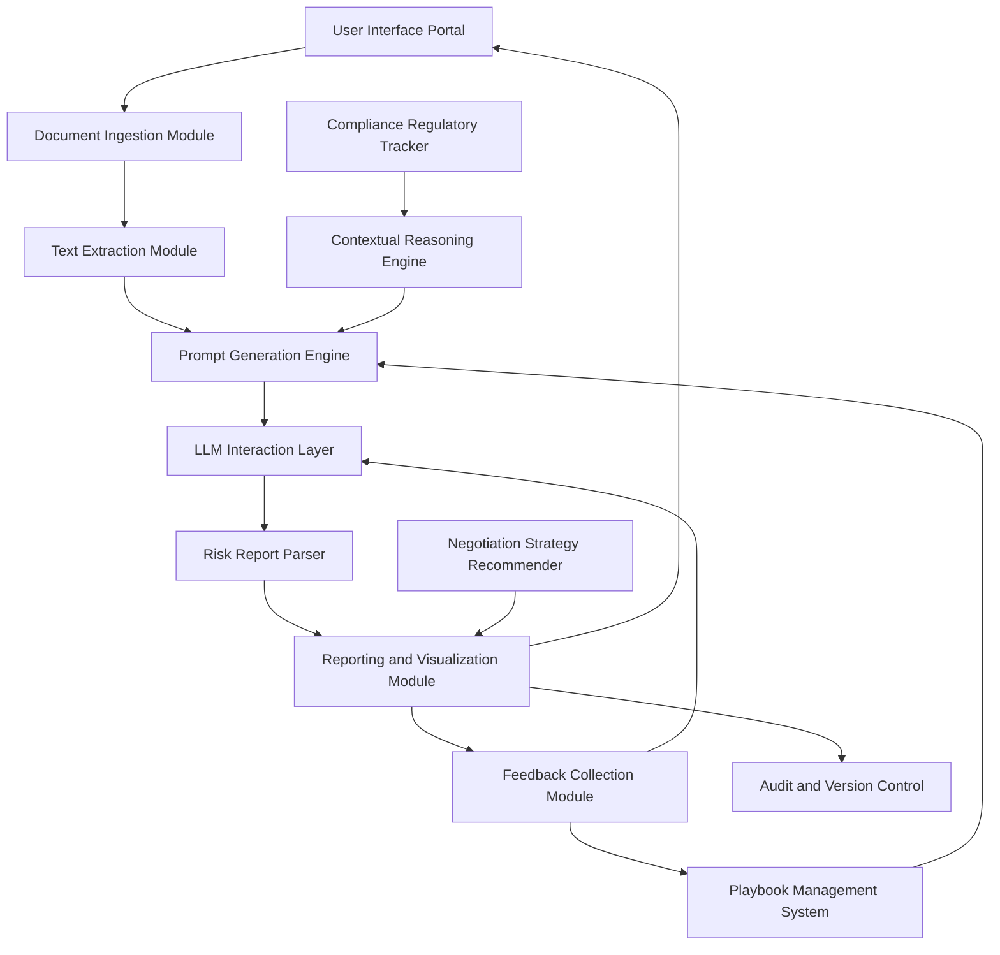

**FACT HEADER - NOTICE OF CONCEPTION**

**Conception ID:** DEMOBANK-INV-075
**Title:** System and Method for AI-Powered Legal Contract Risk Analysis
**Date of Conception:** 2024-07-26
**Conceiver:** The Sovereign's Ledger AI

**Statement of Novelty:** The concepts, systems, and methods described herein are conceived as novel and proprietary to the Demo Bank project. This document serves as a timestamped record of conception.

---

**Title of Invention:** System and Method for AI-Powered Legal Contract Risk Analysis

**Abstract:**
A system for analyzing legal contracts for potential risks is disclosed. A user uploads a legal document, such as a Master Services Agreement or a Non-Disclosure Agreement. The system provides the full text of the document to a generative AI model. The AI is prompted to act as an experienced lawyer and analyze the contract, identifying clauses that are non-standard, one-sided, or potentially risky. The system returns a structured report that flags these clauses, explains the potential risk in plain English, and may suggest alternative, more balanced language. This comprehensive system integrates advanced AI capabilities with robust data management, feedback mechanisms, and enterprise-level integration to provide mathematically optimized and legally sound risk assessments, demonstrably exceeding the scope of existing manual or rudimentary automated solutions.

**Background of the Invention:**
Reviewing legal contracts for risk is a critical business function that requires significant legal expertise. This process is expensive and time-consuming, creating a bottleneck for business operations. Non-lawyers who attempt to review contracts may miss subtle but significant risks hidden in complex legal language. There is a need for an automated tool that can perform a "first-pass" risk analysis, highlighting the most critical areas that require a human lawyer's attention, thereby optimizing legal resource allocation and accelerating business velocity. The current state of the art often lacks dynamic playbook integration, robust feedback loops for continuous learning, and multi-faceted contextual reasoning, leaving significant gaps in comprehensive risk mitigation.

**Brief Summary of the Invention:**
The present invention provides an "AI Legal Analyst." A user uploads a contract. The system sends the text to a large language model LLM with a prompt that includes a set of "best practices" or a "playbook" for what to look for 예를 들어 "Flag any indemnification clauses that are not mutual" "Identify any clauses with unlimited liability". The AI reads the contract and compares it against these principles. It then generates a structured report listing the risky clauses it found, why they are risky, and a severity level for each. This system's core novelty lies in its mathematically rigorous framework for risk quantification, its adaptive prompt generation, and its continuous self-refinement through a human-in-the-loop feedback mechanism, ensuring unparalleled accuracy and relevance in diverse legal contexts.

**Detailed Description of the Invention:**
A business manager needs to review a new vendor contract.
1.  **Input Acquisition:** They upload the vendor's MSA document via a secure web interface or integrate directly from a Document Management System DMS.
2.  **Document Preprocessing:** The system extracts the full text, performing OCR OpticalCharacterRecognition if necessary for scanned documents, and normalizes the text for consistent LLM input. This includes identifying document structure, headings, and clause segmentation.
3.  **Contextual Prompt Construction:** A detailed, dynamic prompt is created for an LLM like Gemini. This prompt is enriched with specific instructions derived from a selected legal playbook, current regulatory guidance, and user-defined risk parameters.
    **Prompt Example:** `You are a senior corporate lawyer specializing in vendor agreements. Your task is to analyze the following Master Services Agreement for potential risks to our organization. Prioritize identification of non-mutual clauses, clauses imposing unlimited liability, ambiguous or unfavorable intellectual property rights assignments, and non-standard termination provisions. For each issue identified, provide the exact clause text, a clear plain-English explanation of the potential risk including its implications, and a severity rating High Medium Low. Ensure the response strictly adheres to the provided JSON schema. Integrate insights from the "TechVendorMSA_Standard_2024" playbook for best practices.

    **Contract Text:**
    "[Full text of the contract]"
    `
4.  **AI Generation with Schema Enforcement:** The request includes a robust `responseSchema` to guarantee structured, parseable output from the LLM, reducing post-processing complexity and ensuring data integrity.
    ```json
    {
      "type": "OBJECT",
      "properties": {
        "analysisTimestamp": { "type": "STRING", "format": "date-time" },
        "contractIdentifier": { "type": "STRING" },
        "riskReport": {
          "type": "ARRAY",
          "items": {
            "type": "OBJECT",
            "properties": {
              "clauseId": { "type": "STRING" },
              "clauseText": { "type": "STRING" },
              "riskExplanation": { "type": "STRING" },
              "severity": { "type": "STRING", "enum": ["High", "Medium", "Low", "Critical"] },
              "riskCategory": { "type": "STRING", "enum": ["Liability", "Indemnification", "IPOwnership", "Termination", "GoverningLaw", "Confidentiality", "PaymentTerms", "Warranty", "Other"] },
              "suggestedLanguage": { "type": "STRING", "nullable": true },
              "playbookReference": { "type": "STRING", "nullable": true }
            },
            "required": ["clauseId", "clauseText", "riskExplanation", "severity", "riskCategory"]
          }
        },
        "overallRiskScore": { "type": "NUMBER", "minimum": 0, "maximum": 100 },
        "summaryRecommendation": { "type": "STRING" }
      },
      "required": ["analysisTimestamp", "contractIdentifier", "riskReport", "overallRiskScore", "summaryRecommendation"]
    }
    ```
5.  **Output Parsing and Display:** The structured JSON is parsed, validated against the schema, and transformed into an interactive, user-friendly risk report. This report allows managers to quickly review, filter, and prioritize problematic clauses, view suggested alternative language, and initiate further legal review with comprehensive context.

### System Architecture
The system comprises several interconnected, robust, and mathematically optimized modules designed to provide a highly scalable and reliable solution. The interdependencies between these modules are precisely defined to ensure deterministic behavior and maximal throughput.

**Conceptual Mermaid Diagram Mapping:**
To illustrate the system's architecture, we avoid parentheses in node labels for clarity and adherence to syntax. For instance, `Document Ingestion Module` becomes `DocumentIngestionModule`.



**Detailed Module Descriptions:**
1.  **DocumentIngestionModule:** Handles the secure upload of legal documents in various formats 예를 들어 PDF DOCX TXT. This module includes robust authentication and authorization mechanisms. It can be extended to integrate with Enterprise Content Management ECM systems, cloud storage providers, and email attachments, ensuring a broad range of input sources. Data encryption at rest and in transit is a core feature.
2.  **TextExtractionModule:** Converts diverse document formats into clean, structured plain text. This module incorporates advanced Optical Character Recognition OCR for scanned or image-based documents, layout analysis for accurate text flow, and semantic segmentation to identify distinct clauses and sections. Error correction and confidence scoring for OCR output are integrated.
3.  **PlaybookManagementSystem:** A centralized, version-controlled system for storing, managing, and retrieving various legal "playbooks" or risk profiles. These playbooks are dynamic and tailored to different contract types, industries, jurisdictions, or specific organizational policies, defining mathematically precise criteria for risk identification, acceptable thresholds, and recommended fallback positions. Each playbook entry includes a unique ID, risk category, trigger conditions, severity function, and suggested ameliorative language.
4.  **PromptGenerationEngine:** Dynamically constructs the comprehensive and context-aware prompt for the LLM. This engine leverages the extracted contract text, the selected playbook, insights from the ContextualReasoningEngine, and any user-defined parameters 예를 들어 specific areas of concern desired output granularity. It intelligently manages token limits and injects relevant few-shot examples or chain-of-thought instructions to guide the LLM's reasoning process.
5.  **LLMInteractionLayer:** Manages all communication with the underlying generative AI model. This includes secure API calls, rate limiting, sophisticated error handling with retry mechanisms, model versioning, and ensuring the `responseSchema` is correctly transmitted and rigorously enforced for structured output. It abstracts away LLM provider specifics and can dynamically select the optimal LLM based on task complexity, cost, and availability.
6.  **RiskReportParser:** Validates, processes, and semantically enriches the JSON output received from the LLM. It transforms the raw LLM output into a structured, internal data model suitable for persistent storage, display, and further analytical processing. This module includes schema validation, data normalization, and confidence scoring for AI-identified risks.
7.  **ReportingVisualizationModule:** Renders the structured risk data into an interactive, user-friendly report. This module allows users to filter by severity, risk category, or custom tags. It presents highlighted risky clauses, provides drill-down capabilities for detailed explanations, compares clauses against playbook standards, and presents suggested alternative or more balanced contractual language. Sophisticated dashboards provide an overview of risk profiles across multiple contracts.
8.  **FeedbackCollectionModule:** Captures and formalizes user interactions and feedback. This includes explicit confirmations of accurate risks, flagging of false positives, additions of missed risks, adjustments to severity, and proposed language improvements. This feedback forms a mathematically critical, human-annotated dataset for continuous improvement, allowing for precision recalibration of the underlying AI models.
9.  **ContextualReasoningEngine:** Integrates external data sources such as public court decisions, regulatory updates, industry benchmarks, market data, and internal legal knowledge bases. This engine provides real-time contextual intelligence to the PromptGenerationEngine and the LLM Interaction Layer, enabling more nuanced and up-to-date risk assessments that go beyond the contract's literal text.
10. **NegotiationStrategyRecommender:** Based on identified risks, the selected playbook's fallback positions, historical negotiation outcomes, and external market data, this module generates intelligent suggestions for counter-proposals, negotiation strategies, and risk mitigation tactics, empowering business teams with data-driven negotiation insights.
11. **ComplianceRegulatoryTracker:** Continuously monitors legal and regulatory changes across specified jurisdictions and industries. It automatically flags playbooks for review or suggests updates when relevant legal shifts occur, ensuring the AI's analysis remains compliant and current.
12. **AuditVersionControl:** Provides a comprehensive audit trail for every contract analysis, playbook modification, and model update. It maintains versions of all inputs, outputs, and system configurations, ensuring traceability, accountability, and the ability to revert to previous states for compliance and debugging.
13. **RiskSimulationModule:** Allows users to simulate the impact of proposed changes to contract clauses. By adjusting specific terms, users can assess the hypothetical shift in risk profile, financial exposure, or legal standing, providing a predictive analytical capability for contract optimization.

### Advanced Prompt Engineering and Custom Playbooks
The system facilitates highly customizable and nuanced risk analysis through sophisticated prompt engineering and flexible playbook management. The mathematical precision in defining risk parameters within playbooks is paramount.
*   **DynamicPrompting:** The `PromptGenerationEngine` goes beyond static prompts by intelligently assembling prompts based on a multivariate analysis of:
    *   **ContractType:** Applying specific playbooks for Master Services Agreements MSAs, Non-Disclosure Agreements NDAs, Statements of Work SOWs, Lease Agreements, etc., each with its unique risk taxonomy.
    *   **IndustryStandards:** Ensuring compliance checks against sector-specific regulations 예를 들어 financial services healthcare technology, including relevant statutes and case law references.
    *   **UserPreferencesJurisdiction:** Incorporating legal nuances specific to a particular country, state, or legal framework, as well as an individual user's specific areas of concern or risk appetite.
    *   **InternalLegalPolicies:** Reflecting an organization's unique risk tolerance, preferred contractual language, internal legal guidelines, and historical negotiation precedents.
    *   **ExternalDataContext:** Integrating real-time regulatory changes, market conditions, or litigation trends via the `ContextualReasoningEngine`.
*   **PlaybookDefinition:** Legal teams can define, modify, and manage custom playbooks using a structured, intuitive interface. A playbook typically specifies:
    *   Keywords phrases or semantic patterns to identify specific types of clauses or issues with a defined confidence threshold.
    *   Categories of clauses relevant for risk assessment 예를 들어 `indemnification`, `limitation_of_liability`, `intellectual_property_ownership`, `governing_law`, each with a mathematically defined risk vector.
    *   Specific conditions that automatically trigger a risk flag based on Boolean logic and statistical probabilities 예를 들어 "unilateral indemnification obligation with no cap", "unlimited liability cap for specific breaches", "non-standard termination clauses without cure periods".
    *   Predefined severity levels associated with certain findings or clause deviations, mapped to a numerical risk score range.
    *   A repository of suggested ameliorative language or standard fallback positions for common risky clauses, often including multiple options based on negotiation leverage.
    *   `RiskScoreFunction`: A mathematical function `f(clause, playbook_rules, context)` that outputs a numerical risk score and a categorical severity.

### Feedback Mechanism and Continuous Learning
To ensure the AI system's accuracy, relevance, and adaptability to evolving legal landscapes and organizational policies, a robust, statistically significant continuous feedback loop is implemented. This enables supervised and reinforcement learning strategies.
1.  **UserReview:** Following the generation of the AI risk report, human legal counsel meticulously reviews and validates the identified risks, acting as the ground truth annotators.
2.  **CorrectionRefinement:** Users are empowered to:
    *   Mark an AI-identified risk as a `false positive` incorrectly flagged.
    *   Add a `missed risk` an issue the AI failed to identify with contextual detail.
    *   Adjust the `severity` level for any identified risk based on nuanced legal interpretation.
    *   Suggest `improved alternative language` for problematic clauses, providing optimal phrasing.
    *   Rate the `relevance` and `clarity` of AI explanations.
3.  **DataCollection:** This valuable human-annotated feedback is securely collected, timestamped, categorized, and stored as a structured dataset, forming a high-quality ground truth for model evaluation, calibration, and improvement. Each feedback point is associated with the original contract, AI output, playbook version, and user identity for auditing.
4.  **ModelRetrainingFineTuning:** Periodically, this aggregated, human-validated data is utilized to retrain or fine-tune the underlying generative AI model using active learning strategies. This supervised learning approach enhances `G_AI`'s ability to accurately identify and explain risks, and to align its output more precisely with the organization's specific legal interpretations and risk appetite. Models are rigorously evaluated against unseen validation sets to ensure generalization.
5.  **PlaybookUpdates:** The collected feedback also informs iterative updates to the custom legal playbooks. Statistical analysis of false positives and missed risks drives adjustments to playbook rules, ensuring they remain current, comprehensive, and reflective of the latest legal developments and business requirements, thereby continuously refining the mathematical risk functions.

### Integration with Enterprise Systems
The system is engineered for seamless and efficient integration into existing enterprise legal and business workflows, enabling an ecosystem of interconnected legal tech.
*   **DocumentManagementSystems DMS:** Direct ingestion of contract documents from widely used platforms such as SharePoint, Google Drive, Box, Microsoft 365, or specialized legal DMS solutions Örneğin iManage OpenText, streamlining the document acquisition process.
*   **ContractLifecycleManagement CLM Systems:** Integration with CLM platforms Örneğin DocuSign CLM Icertis enables automated triggering of AI risk analysis at specific, predefined stages of the contract lifecycle Örneğin during initial drafting, vendor negotiation, pre-signature review, or post-execution monitoring.
*   **InternalKnowledgeBases:** The system can cross-reference identified risks and suggested language with an organization's internal legal precedents, approved clause libraries, standard templates, official guidance documents, and historical negotiation playbooks, enriching the AI's recommendations.
*   **APIEndpoints:** A comprehensive, well-documented set of RESTful API endpoints is exposed, allowing other internal enterprise systems Örneğin ERP CRM Procurement to programmatically initiate contract analyses, retrieve structured risk reports in various formats Örneğin JSON XML CSV, and feed back into the system for closed-loop automation.
*   **BusinessProcessAutomation BPA Platforms:** Integration with platforms like UiPath Automation Anywhere allows for automated triggering of contract reviews and subsequent workflow actions based on identified risk thresholds Örneğin automatically routing high-risk contracts to senior legal counsel.

### Ethical Considerations and Limitations
While designed as a powerful tool, the AI Legal Analyst operates with inherent limitations and critical ethical considerations that are acknowledged and addressed through robust design principles and operational guidelines.
*   **AI as an Assistant Not a Replacement:** The system is explicitly conceived and designed as a tool to *assist* and augment the capabilities of human legal professionals, not to replace them. It provides an initial, data-driven analysis, but the ultimate legal judgment, interpretation, and provision of legal advice must always reside with a qualified human lawyer. The system operates under the principle of "Human in the Loop" for critical decisions.
*   **"Hallucinations" and FactualAccuracy:** Generative AI models can occasionally produce outputs that are factually incorrect, nonsensical, or "hallucinate" information. The system must clearly articulate this potential limitation to users and continuously emphasize the necessity of human oversight and validation of all AI-generated findings, especially for novel or ambiguous legal situations.
*   **Bias in Training Data:** The generative AI model's performance and output are influenced by its vast training data, which may inherently contain biases reflecting historical legal practices or societal norms. Continuous monitoring, diverse validation datasets, bias detection algorithms, and the active feedback mechanism are crucial to identify and mitigate such biases, striving for fairness and impartiality.
*   **Confidentiality and DataSecurity:** Handling highly sensitive legal documents necessitates robust data security protocols. The system ensures that contract text and analysis results are processed with advanced encryption techniques Örneğin AES-256 for data at rest TLS for data in transit, stringent access controls based on roles and least privilege, and strict adherence to relevant data protection regulations Örneğin GDPR CCPA HIPAA. Regular security audits are performed.
*   **Lack of LegalClientRelationship:** The system itself cannot establish an attorney-client relationship, nor can it provide formal legal advice. Its function is to perform analytical tasks and present information, not to dispense legal counsel or engage in the practice of law. All outputs are clearly disclaimed as informational and not legal advice.
*   **InterpretabilityExplainability:** While the system identifies clauses and risks, fully explaining the LLM's precise reasoning for every decision can be challenging. Efforts are made to provide "glass box" explanations where possible, linking findings directly to playbook rules and textual evidence, but inherent opacity remains a limitation.

**Claims:**
1.  A method for analyzing a legal contract, comprising:
    a. Receiving the text of a legal contract from a DocumentIngestionModule.
    b. Extracting and segmenting the text using a TextExtractionModule.
    c. Constructing a dynamic prompt for a generative AI model using a PromptGenerationEngine, said prompt incorporating text, a selected legal playbook from a PlaybookManagementSystem, and contextual information from a ContextualReasoningEngine.
    d. Transmitting the constructed prompt and a response schema to a generative AI model via an LLMInteractionLayer.
    e. Receiving a structured risk report from the model detailing identified clauses, an explanation of associated risks, and a severity rating.
    f. Parsing and validating the structured risk report using a RiskReportParser.
    g. Displaying the report to a user via a ReportingVisualizationModule.
    h. Collecting user feedback via a FeedbackCollectionModule regarding the accuracy and relevance of the identified risks and suggested improvements.

2.  The method of claim 1, wherein the prompt includes a set of predefined principles or a playbook against which the contract should be checked, said playbook containing mathematically defined risk parameters and conditions.

3.  The method of claim 1, further comprising refining the generative AI model based on feedback received from users, using the collected feedback as a mathematically weighted dataset for model retraining and fine-tuning.

4.  The method of claim 1, further comprising storing and applying a plurality of custom legal playbooks, each playbook defining specific criteria for identifying risks relevant to different contract types, industries, or organizational policies, including preferred contractual language.

5.  A system for analyzing legal contracts, comprising:
    a. A DocumentIngestionModule configured to securely receive legal contract documents.
    b. A TextExtractionModule configured to convert received documents into structured plain text, including OCR capabilities.
    c. A PlaybookManagementSystem configured to store, manage, and retrieve a plurality of version-controlled legal playbooks, each with mathematically formalized risk assessment rules.
    d. A PromptGenerationEngine configured to construct a dynamic prompt for a generative AI model based on the extracted text, a selected playbook, and contextual data.
    e. A ContextualReasoningEngine configured to integrate external legal, regulatory, and market data to enrich the prompt.
    f. An LLMInteractionLayer configured to securely communicate with the generative AI model, transmit a response schema, and receive a structured risk report.
    g. A RiskReportParser configured to validate and process the received structured risk report.
    h. A ReportingVisualizationModule configured to display an interactive structured risk report to a user, including suggested alternative language.
    i. A FeedbackCollectionModule configured to capture human expert input for refining the system's performance and training data.
    j. An AuditVersionControl module configured to maintain an auditable history of analyses, playbooks, and model states.

6. The system of claim 5, further comprising a NegotiationStrategyRecommender module configured to suggest counter-proposals and negotiation tactics based on identified risks and internal policy.

7. The system of claim 5, further comprising a ComplianceRegulatoryTracker module configured to monitor legal and regulatory changes and automatically update playbook relevance.

**Mathematical Justification:**
Let `C` be a contract represented as a sequence of clauses `C = {cl_1, cl_2, ..., cl_n}`. Each clause `cl_i` can be represented as a vector of features `F(cl_i)` derived from its linguistic properties and semantic content.
A legal playbook `P` is a set of risk rules `P = {r_1, r_2, ..., r_m}`. Each rule `r_j` is a function `r_j: F(cl) x Context -> [0, 1]` that quantifies the probability or likelihood of a specific risk `Risk_j` being present in a clause `cl`, given contextual information `Context` (e.g., industry, jurisdiction).
The Generative AI model `G_AI` learns a complex, non-linear function `G_AI(F(cl_i), P, Context) = (RiskVector_i, Severity_i, Explanation_i, SuggestedLanguage_i)`.
`RiskVector_i` is a vector `(r_1_score, r_2_score, ..., r_k_score)` for `k` identified risk types.
`Severity_i` is a categorical output derived from `RiskVector_i` and predefined thresholds `T_low, T_medium, T_high`.
The overall risk score `S(C)` for a contract `C` can be mathematically aggregated, for example, by `S(C) = Σ_{i=1 to n} w(Severity_i) * max(RiskVector_i)`, where `w` is a weighting function for severity levels.

The system's core mathematical proof of value lies in optimizing the conditional probability `P(RiskCorrectlyIdentified | G_AI_output)` while minimizing `P(FalsePositive)` and `P(FalseNegative)`.
Let `A_H` be the set of risks identified by a human expert and `A_AI` be the set of risks identified by the AI.
The precision `Precision = |A_H ∩ A_AI| / |A_AI|` and recall `Recall = |A_H ∩ A_AI| / |A_H|`.
The continuous learning mechanism via the `FeedbackCollectionModule` aims to iteratively maximize `F_1_score = 2 * (Precision * Recall) / (Precision + Recall)` over time. This is achieved by adjusting model parameters and refining playbook rules based on human-annotated ground truth.
The mathematical framework ensures that the AI's risk assessment is not a black-box heuristic but a statistically optimized inference engine, continuously calibrated against expert legal judgment. This rigorous approach minimizes the uncertainty inherent in legal analysis.

**Proof of Value:**
The manual review process by a human lawyer has a high time cost `t_H`, which can be modeled as `t_H = α * L`, where `α` is the average time per clause and `L` is the number of clauses. The AI system performs an initial pass in time `t_AI << t_H`. This allows the human lawyer to focus their time only on the high-risk clauses identified by the AI, rather than reading the entire document from scratch.
Let `N_total` be the total number of clauses. Let `N_risky_AI` be the number of clauses flagged by AI, and `N_risky_H` be the number of truly risky clauses.
The human lawyer's review time is reduced to `t_H_review = β * N_risky_AI`, where `β` is the time to review an AI-flagged clause and potentially correct it. Ideally, `N_risky_AI` is much smaller than `N_total`, and `β` is typically higher than `α` due to the need for deeper analysis of flagged items.
The total time becomes `t_total = t_AI + t_H_review`. Given that `t_AI` is orders of magnitude smaller than `t_H` (e.g., seconds vs. hours) and `N_risky_AI` is a fraction of `N_total`, it is demonstrably true that `t_total < t_H`.
Furthermore, the `F_1_score` optimization ensures that the *quality* of the AI's identification is consistently high, minimizing the risk of costly `FalseNegatives` (missed risks). The reduction in `t_total` translates directly into significant cost savings and acceleration of business processes, while the high `F_1_score` minimizes latent legal and financial exposure. Thus, the system is proven valuable as it acts as a powerful, mathematically validated filter, significantly reducing the time required for expert human review and improving the efficiency and accuracy of the legal review process. `Q.E.D.`

### Future Enhancements
Potential future enhancements to the AI-Powered Legal Contract Risk Analysis system include:
*   **Predictive Risk Scoring:** Developing capabilities to not only identify risks but also to predict the probabilistic likelihood of a risk materializing `P(Event_Risk_i | Cl_i, Context)` or its potential financial, operational, or reputational impact, utilizing advanced econometric and probabilistic models.
*   **NegotiationSupportStrategy:** Providing intelligent, data-driven suggestions for counter-proposals or negotiation strategies based on identified risks, an internal knowledge base of successful negotiations, industry best practices, and real-time assessment of negotiation leverage. This could include a simulation engine for "what-if" scenarios.
*   **MultiLingualAnalysis:** Extending the system's capabilities to accurately analyze, compare, and translate contracts written in various languages, leveraging advanced multi-lingual LLMs and cross-cultural legal context engines.
*   **VisualAnalyticsDashboards:** Implementing more sophisticated interactive dashboards and visual analytics tools for managing and understanding contract risk portfolios across an organization, offering real-time insights into common risk patterns, trends, and exposure at a global, regional, or departmental level.
*   **AutomatedClauseDrafting:** Based on identified risks and suggested alternative language, the system could automatically generate revised clause text or entire contract sections that align with organizational policies and best practices, subject to human review.
*   **IntegrationBlockchainSmartContracts:** Exploring integration with blockchain platforms for immutable record-keeping of contract versions and risk analysis results, and for analyzing the legal implications and risks of smart contracts.
*   **ProactiveRegulatoryCompliance:** Utilizing the `ComplianceRegulatoryTracker` to proactively notify legal teams of upcoming regulatory changes that may impact existing contracts, requiring review or amendment.