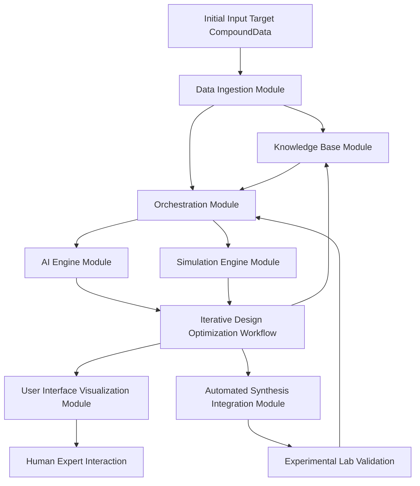
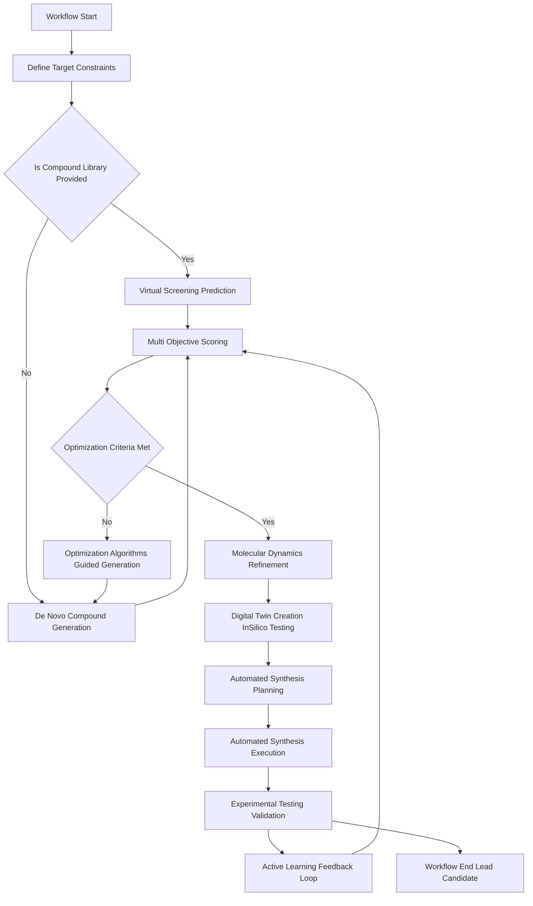
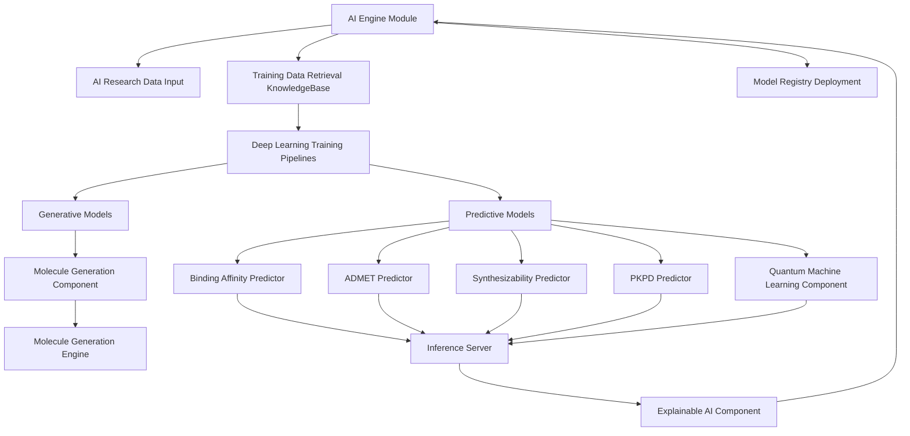
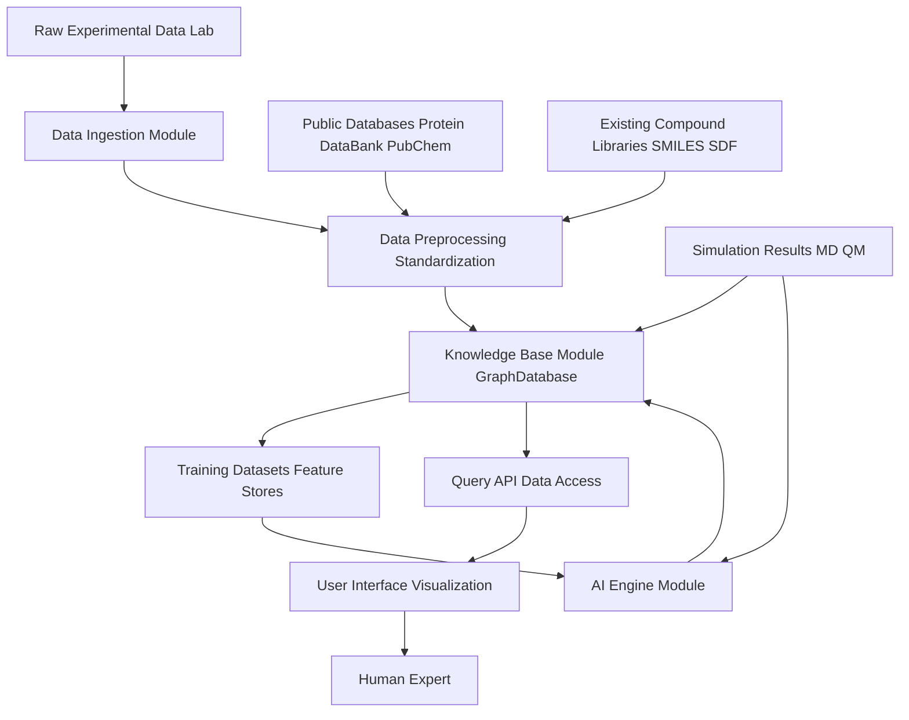

**Title of Invention:** System and Method for AI-Assisted Drug Discovery Simulation

**Abstract:**
A system for accelerating drug discovery is disclosed. The system receives a target protein structure and a library of chemical compounds. A generative AI model, trained on biochemical principles, predicts the binding affinity of each compound to the target protein. The system ranks the compounds by their predicted effectiveness and identifies the most promising candidates for further laboratory testing, significantly reducing the time and cost of initial screening. The system further incorporates iterative design, multi-objective optimization, and molecular dynamics simulations, enabling the generation and refinement of novel drug candidates with optimized therapeutic properties and reduced toxicity. The system also integrates advanced capabilities such as quantum machine learning QML for enhanced property prediction, explainable AI XAI for transparency, and automated synthesis planning to streamline the entire discovery pipeline.

**Detailed Description:**
This invention proposes a sophisticated system for AI-assisted drug discovery simulation, moving beyond simple binding affinity prediction to a comprehensive, iterative design-test-optimize cycle. The core of the system leverages advanced generative AI and predictive models to accelerate the identification and optimization of novel drug candidates.

**1. AI Core and Model Architectures:**
The system employs a suite of specialized AI models tailored for various stages of drug discovery:
*   **Target Protein Representation:** Uses deep learning models such as Graph Neural Networks GNNs, 3D Convolutional Neural Networks CNNs, or Transformer models to interpret complex protein structures, potentially derived from experimental data X-ray crystallography, cryo-EM or computational prediction AlphaFold, RoseTTAFold.
    *   Input: Protein sequence or 3D coordinate data.
    *   Output: Embeddings representing structural features and potential binding pockets.
*   **Compound Representation:** Molecules are represented using various descriptors, including SMILES strings, molecular graphs, or 3D conformations. GNNs, specifically Message Passing Neural Networks MPNNs or Graph Attention Networks GATs, are particularly effective for processing molecular graph data to capture complex chemical bonds and atomic properties.
    *   Input: SMILES string, SDF, or PDB data.
    *   Output: Molecular embeddings capturing chemical features.
*   **Generative Models:** These models are designed to propose novel molecular structures.
    *   **De Novo Molecule Generation:** Diffusion models e.g., Denoising Diffusion Probabilistic Models DDPM or Variational Autoencoders VAEs are employed to design novel chemical compounds from scratch. These models are typically conditioned on desired physicochemical properties, target binding pocket characteristics, and structural motifs identified from successful binders. For example, a diffusion model `G_gen` could generate a new molecule `M_new` given a target `T` and desired properties `P`:
        ```
        M_new ~ G_gen(T, P)
        ```
    *   **Fragment-Based Generation:** AI models can also propose novel linkers or modifications to known active fragments, optimizing substructures for specific interactions.
    *   **Conditional Generation:** Models can generate compounds specified by a particular condition (e.g., "generate compounds similar to aspirin but with improved solubility").
*   **Predictive Models:** These models evaluate the properties of existing or newly generated compounds.
    *   **Binding Affinity Prediction:** Specialized GNNs or deep learning models, often incorporating attention mechanisms, predict binding affinities e.g., K_d, K_i, IC_50 for a given compound-protein pair. The prompt `Predict the binding affinity for these compounds to the target protein [protein data]` would internally map to a function `f_bind(compound, protein) -> score`.
    *   **ADMET Prediction:** Models predict Absorption, Distribution, Metabolism, Excretion, and Toxicity properties using multi-task learning or ensemble methods. These are crucial for drugability assessment. For instance, a model `f_ADMET` predicts a vector of properties:
        ```
        ADMET_props = f_ADMET(compound)
        ```
    *   **Synthesizability Prediction:** Models estimate the ease, cost, and feasibility of synthesizing a proposed compound, guiding the design towards chemically viable molecules. This often involves predicting synthetic routes.
    *   **Pharmacokinetics Pharmacodynamics PKPD Prediction:** Models predict drug concentration profiles over time in biological systems (PK) and the resulting biological effects (PD), providing insights into dosage and efficacy.
    *   **Quantum Machine Learning QML Integration:** For highly accurate predictions of specific molecular properties e.g., electronic structure, reaction barriers, QML models can be integrated, leveraging quantum mechanical principles to enhance predictive power beyond classical force fields.
*   **Molecular Dynamics MD Simulation Integration:** While MD is traditionally computational chemistry, AI can accelerate force field parametrization, predict stable conformations, identify key interaction points, or even surrogate portions of MD trajectories, significantly reducing simulation time and computational cost.
*   **Explainable AI XAI Component:** Integrated XAI modules provide insights into why a particular prediction was made or why a molecule was generated. This includes saliency maps for protein-ligand interactions, feature importance for ADMET predictions, or mechanistic insights from generative models, fostering trust and guiding human experts.

**2. Iterative Design and Optimization Workflow:**
The system operates through an iterative loop, enabling rapid exploration of chemical space and multi-objective optimization:

*   **Initial Input:** The system receives a target protein structure and an optional initial library of chemical compounds or chemical fragments.
*   **Design Space Exploration:** Based on the target, the system defines a chemical search space and constraints for desired properties.
*   **Virtual Screening Prediction:**
    *   For existing compounds, the predictive models evaluate binding affinity and other properties.
    *   The system can also be prompted with a query for a novel compound: `Generate compounds that bind to [protein data] with high affinity and low toxicity.`
*   **De Novo Compound Generation:** Based on the target profile, feedback from previous iterations, and specified design constraints, generative AI models propose novel chemical structures.
*   **Synthetic Route Planning:** For newly generated compounds, AI models predict feasible synthetic pathways and estimate synthesis complexity and cost, ensuring the compounds are not merely theoretical but practically achievable.
*   **Multi-Objective Scoring:** Each generated or screened compound is evaluated against a composite score that balances multiple desired properties, such as high binding affinity, favorable ADMET profile, high synthesizability, and desired PKPD characteristics. This score `S` might be a weighted sum or a more complex utility function:
    ```
    S(M, T) = w_1 * f_bind(M, T) - w_2 * f_toxicity(M) + w_3 * f_synthesizability(M) + w_4 * f_PKPD(M, T)
    ```
    where `w_i` are weighting coefficients determined based on therapeutic priorities.
*   **Optimization Algorithms:** Reinforcement Learning RL agents, often using algorithms like Proximal Policy Optimization PPO or Deep Q-Networks DQN, or advanced evolutionary algorithms can guide the generative process. These agents learn to propose compounds that maximize the multi-objective score over successive iterations. The RL agent's reward function is directly derived from `S(M, T)`. Bayesian Optimization can also be employed for efficient exploration of the chemical space.
*   **Molecular Dynamics Refinement:** For top-ranked candidates, short-to-medium duration MD simulations can be initiated to confirm binding stability, identify key interaction points, refine binding poses, and assess flexibility, providing more robust data than static predictions. This can be coupled with enhanced sampling techniques.
*   **Digital Twin Creation:** For lead candidates, a digital twin representing the target biological system or even a patient model can be created *in silico* to simulate interactions and predict *in vivo* behavior before costly *in vitro* or *in vivo* experiments.
*   **Active Learning and Feedback Loop:** The system is designed to incorporate experimental feedback. Lab results e.g., actual IC_50 values, toxicity data, clinical trial outcomes from synthesized and tested compounds are fed back into the AI models to refine their predictive and generative capabilities, creating a continuous improvement cycle. This active learning component significantly enhances the model's accuracy and generalizability over time.

**3. System Architecture:**
The system typically comprises the following interconnected modules:
*   **Data Ingestion Module:** Handles input of protein structures PDB, CIF, FASTA, compound libraries SMILES, SDF, Mol2, CDX, and experimental data such as IC_50, K_d values, and ADMET assay results. It includes data validation, cleansing, and standardization components.
*   **AI Engine Module:** Hosts the generative and predictive AI models, including model inference servers, distributed training pipelines, and a model registry for version control and deployment. It manages GPU/CPU resources for model execution.
*   **Simulation Engine Module:** Manages molecular dynamics simulations, quantum mechanics QM calculations, molecular mechanics MM calculations, and other physics-based simulations, often leveraging high-performance computing HPC clusters.
*   **Knowledge Base Module:** A comprehensive database storing protein structures, known ligands, biochemical pathways, drug-target interaction networks, training datasets, and all simulation/prediction results. This acts as a collective memory for the AI, often implemented using graph databases to represent complex relationships.
*   **Orchestration Module:** Coordinates the workflow, manages job scheduling, handles data flow between different modules, and monitors system performance. It ensures efficient resource utilization and reliable execution of iterative loops, potentially using principles from workflow management systems.
*   **User Interface Visualization Module:** Provides interactive tools for defining targets, monitoring simulations, visualizing molecular structures, protein-ligand interaction networks, binding pockets, ADMET profiles, and ranked compound lists. This module may incorporate virtual reality VR or augmented reality AR capabilities for immersive molecular exploration.
*   **Automated Synthesis Integration Module:** This module interfaces with robotic synthesis platforms or laboratory automation systems. It translates predicted synthetic routes into executable laboratory protocols and monitors the synthesis process, enabling closed-loop autonomous drug discovery.

**4. Applications and Advantages:**
This system dramatically accelerates hit identification and lead optimization phases of drug discovery by:
*   **Reducing Time and Cost:** Minimizing the need for exhaustive experimental screening and optimizing early-stage development.
*   **Exploring Novel Chemical Space:** Generating compounds that might not be easily conceived by human intuition, leading to truly innovative drug candidates.
*   **Optimizing Multiple Properties Simultaneously:** Designing compounds with a balanced profile of efficacy, safety, synthesizability, and PKPD, reducing late-stage failures.
*   **Personalized Medicine:** Adapting the design process for specific patient profiles, genetic variations, or disease variants, enabling highly targeted therapies.
*   **Enhanced Transparency:** XAI components provide crucial insights, increasing trust and guiding human intervention.
*   **Accelerated Development:** Integration with automated synthesis allows for rapid iteration from *in silico* design to *in vitro* testing.

**5. Mathematical Foundations and Rigor:**
The efficacy and reliability of this AI-assisted drug discovery system are underpinned by robust mathematical frameworks.

*   **Compound and Protein Representation:**
    Molecules and proteins are represented as graphs. A molecule `M` is a graph `G_M = (V_M, E_M)` where `V_M` are atoms and `E_M` are bonds. Each `v ∈ V_M` has a feature vector `x_v` (e.g., atom type, charge) and each `e ∈ E_M` has a feature vector `x_e` (e.g., bond type). Protein `T` is similarly `G_T = (V_T, E_T)`.
    Graph Neural Networks GNNs learn embeddings `h_M` and `h_T` by iteratively aggregating information from neighbors:
    ```
    h_v^(l+1) = AGGREGATE(h_v^(l), {MESSAGE(h_v^(l), h_u^(l), x_uv) for u ∈ N(v)})
    ```
    where `N(v)` are neighbors of `v`, `h_v^(l)` is the embedding of node `v` at layer `l`, and `x_uv` are edge features.

*   **Generative Models e.g., Diffusion Models:**
    For de novo generation, diffusion models learn to reverse a gradual noisy process. A forward diffusion process `q` adds Gaussian noise `ϵ` to data `x_0` over `K` steps:
    ```
    q(x_k | x_{k-1}) = N(x_k ; sqrt(1 - β_k) x_{k-1}, β_k I)
    ```
    where `β_k` are variance schedule parameters. The model learns a reverse process `p_θ` to denoise `x_k` back to `x_{k-1}`:
    ```
    p_θ(x_{k-1} | x_k) = N(x_{k-1} ; μ_θ(x_k, k), Σ_θ(x_k, k))
    ```
    The objective is to minimize the variational lower bound of `log p(x_0)`. The model `ϵ_θ(x_k, k)` predicts the noise added at step `k`, which guides the reverse sampling. This allows for controlled generation conditioned on target properties `P` by modifying `μ_θ` based on `P`.

*   **Binding Affinity Prediction:**
    The binding affinity prediction function `f_bind(M, T)` is a deep learning model that takes the embedded representations of compound `h_M` and target `h_T` as input and outputs a scalar score `s_bind ∈ R`.
    ```
    s_bind = f_bind(h_M, h_T)
    ```
    This function is typically optimized by minimizing a loss function `L_bind` (e.g., Mean Squared Error MSE) between predicted scores and experimental values `y_exp`:
    ```
    L_bind = (1/N) Σ_{i=1}^N (f_bind(h_M_i, h_T_i) - y_exp_i)^2
    ```

*   **Multi-Objective Optimization:**
    The objective is to find a molecule `M*` that maximizes a composite utility function `U(M, T)` which incorporates multiple desired properties:
    ```
    M* = argmax_M U(M, T)
    ```
    A common form for `U(M, T)` is a weighted linear combination of normalized scores:
    ```
    U(M, T) = Σ_{j=1}^k w_j * S_j(M, T)
    ```
    where `S_j(M, T)` is the normalized score for property `j` (e.g., binding affinity, toxicity, synthesizability, PKPD), and `w_j` are positive weighting coefficients, `Σ w_j = 1`. Each `S_j` is derived from a predictive model `f_j`.
    For instance, `S_toxicity(M)` could be `1 - f_toxicity(M)` to convert toxicity (lower is better) into a maximization objective.

*   **Reinforcement Learning RL for Optimization:**
    The generative process can be framed as an RL problem where an agent learns a policy `π(M | M_prev, T)` to generate new molecules `M` based on previous states `M_prev` and target `T`. The reward function `R(M, T)` for generating a molecule `M` is directly derived from the multi-objective score:
    ```
    R(M, T) = U(M, T)
    ```
    The RL agent aims to maximize the expected cumulative reward. Algorithms like PPO optimize the policy by finding a balance between exploitation (generating high-reward molecules) and exploration (discovering new high-reward regions of chemical space). The policy is typically parameterized by a neural network `π_θ`.

*   **Active Learning:**
    The active learning loop aims to improve model `f` by strategically selecting `x_new` for experimental validation. This is often achieved by minimizing uncertainty `U(f, x)` or maximizing expected information gain.
    ```
    x_new = argmax_x (U(f, x) * Value(x))
    ```
    Where `U(f, x)` could be model uncertainty (e.g., variance in ensemble predictions) or proximity to a decision boundary, and `Value(x)` estimates the impact of `x` on model improvement.

These mathematical foundations ensure that the system's decisions are not arbitrary but are based on quantifiable relationships and optimization principles, offering a robust and verifiable approach to drug discovery.

**6. High-Level System Diagram**



**7. Iterative Design Optimization Workflow Diagram**



**8. AI Engine Detail Diagram**



**9. Data Flow and Knowledge Management Diagram**



**Claims:**
1.  A method for AI-assisted drug discovery, comprising:
    a. Receiving a target protein structure and a chemical entity data set.
    b. Employing a suite of AI models, including generative AI models and predictive AI models, to process said chemical entity data set and said target protein structure.
    c. Using said predictive AI models to evaluate at least binding affinity, ADMET Absorption Distribution Metabolism Excretion Toxicity properties, and synthesizability for each chemical entity.
    d. Calculating a multi-objective score for each chemical entity based on said evaluated properties.
    e. Ranking said chemical entities based on said multi-objective score.
    f. Displaying said ranked list of candidate chemical entities.
2.  The method of claim 1, further comprising employing generative AI models, including diffusion models or variational autoencoders VAEs, to design novel chemical entities constrained by said target protein structure and desired physicochemical properties.
3.  The method of claim 2, further comprising optimizing the generation of novel chemical entities using reinforcement learning RL agents or evolutionary algorithms guided by said multi-objective score.
4.  The method of claim 1, further comprising predicting Pharmacokinetics Pharmacodynamics PKPD properties for each chemical entity using specialized AI models.
5.  The method of claim 1, further comprising integrating Quantum Machine Learning QML models for enhanced prediction of specific molecular properties of said chemical entities.
6.  The method of claim 1, further comprising performing molecular dynamics MD simulations on top-ranked candidate chemical entities to refine binding poses and assess stability.
7.  The method of claim 6, further comprising creating a digital twin of a biological system for in silico testing of lead candidate chemical entities.
8.  The method of claim 1, further comprising incorporating experimental feedback data from laboratory testing into said AI models to refine predictive and generative capabilities through an active learning feedback loop.
9.  The method of claim 1, further comprising employing Explainable AI XAI components to provide interpretability for said AI model predictions and generative decisions.
10. The method of claim 1, further comprising automatically planning synthetic routes for novel chemical entities and integrating with automated synthesis execution systems.
11. A system for AI-assisted drug discovery, comprising:
    a. A data ingestion module configured to receive target protein structures, compound data, and experimental feedback.
    b. An AI engine module hosting generative AI models for novel compound design, and predictive AI models for binding affinity, ADMET, synthesizability, and PKPD prediction.
    c. A simulation engine module configured to perform molecular dynamics, quantum mechanics, and molecular mechanics simulations.
    d. A knowledge base module for storing protein structures, compound libraries, simulation results, and training datasets, structured as a graph database.
    e. An orchestration module to manage the iterative design and optimization workflow, including resource allocation and job scheduling.
    f. A user interface module for displaying ranked compounds, molecular visualizations, and interpretability insights from Explainable AI.
    g. An automated synthesis integration module configured to translate predicted synthetic routes into laboratory protocols and interact with robotic synthesis platforms.
12. The system of claim 11, wherein the AI engine module includes Quantum Machine Learning QML components for advanced molecular property prediction.
13. The system of claim 11, wherein the AI engine module employs reinforcement learning RL agents for guiding generative model optimization based on a multi-objective reward function.
14. The system of claim 11, further comprising a digital twin creation component within the simulation engine module for in silico biological system modeling.