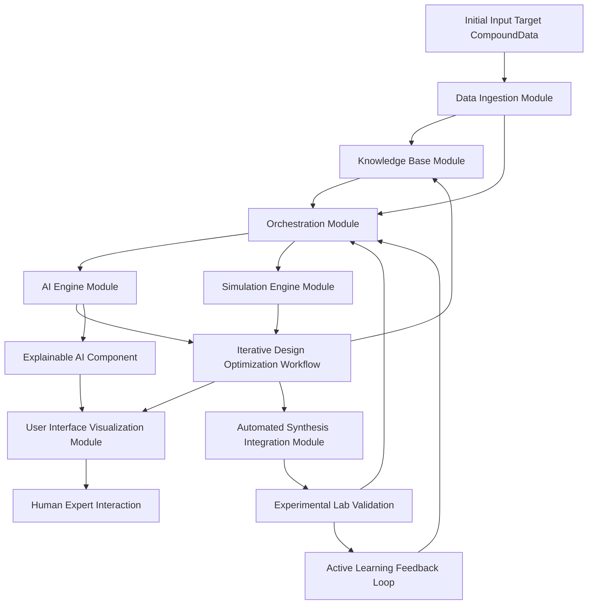
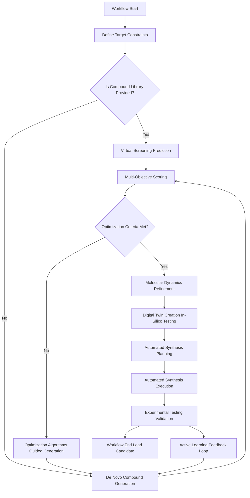
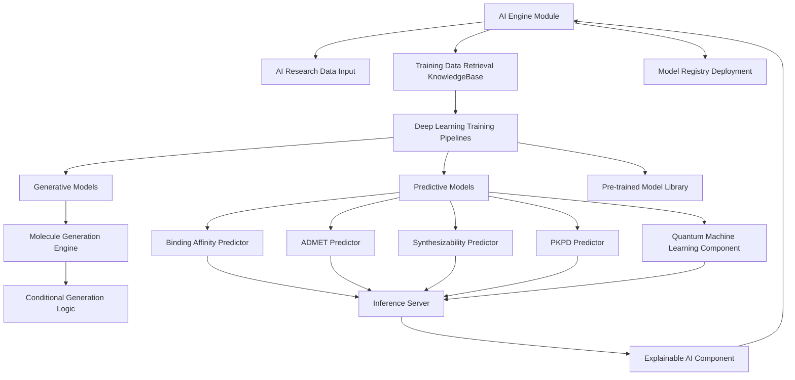
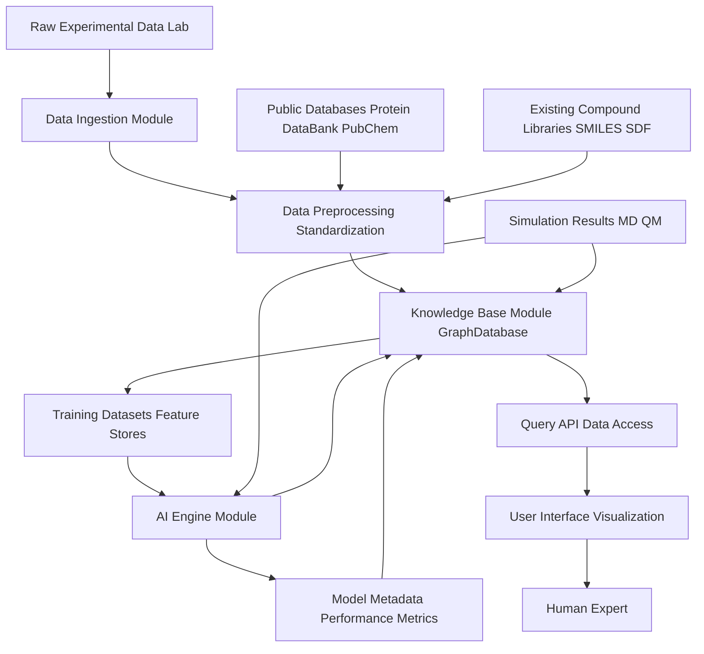
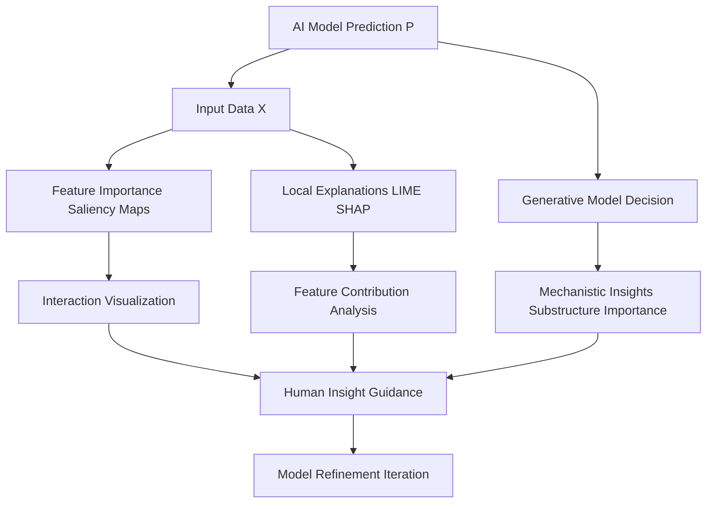
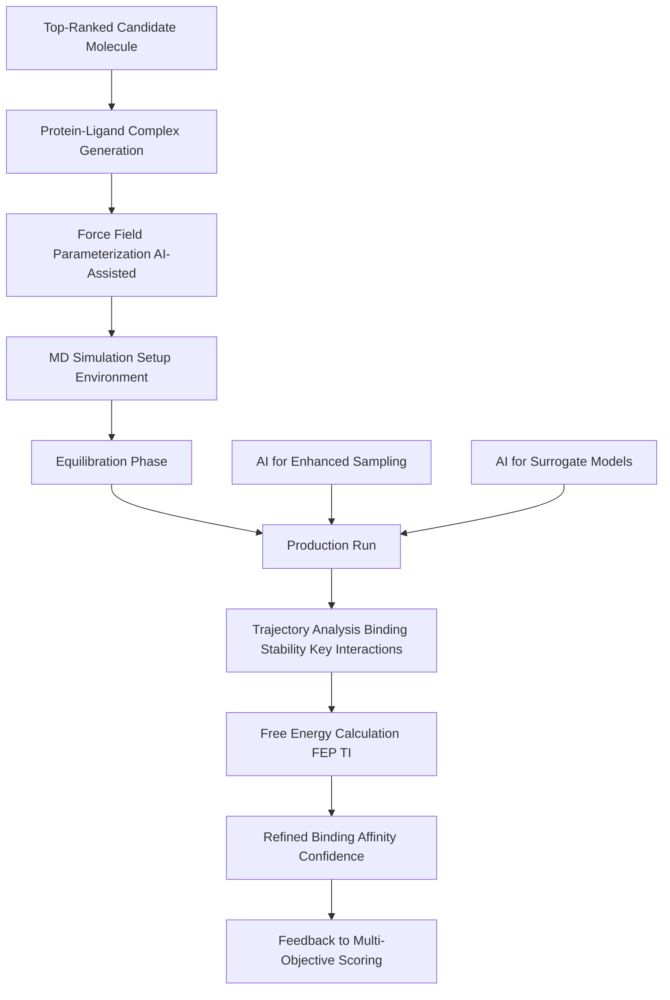
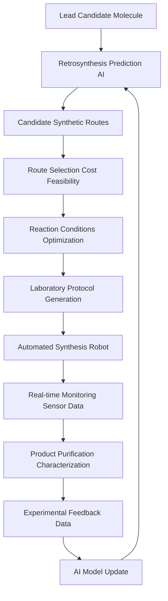

**Title of Invention:** System and Method for AI-Assisted Drug Discovery Simulation

**Abstract:**
A system for accelerating drug discovery is disclosed. The system receives a target protein structure and a library of chemical compounds. A generative AI model, trained on biochemical principles, predicts the binding affinity of each compound to the target protein. The system ranks the compounds by their predicted effectiveness and identifies the most promising candidates for further laboratory testing, significantly reducing the time and cost of initial screening. The system further incorporates iterative design, multi-objective optimization, and molecular dynamics simulations, enabling the generation and refinement of novel drug candidates with optimized therapeutic properties and reduced toxicity. The system also integrates advanced capabilities such as quantum machine learning QML for enhanced property prediction, explainable AI XAI for transparency, automated synthesis planning, and digital twin technology for *in silico* biological system modeling, to streamline the entire discovery pipeline from target identification to lead optimization.

**Detailed Description:**
This invention proposes a sophisticated system for AI-assisted drug discovery simulation, moving beyond simple binding affinity prediction to a comprehensive, iterative design-test-optimize cycle. The core of the system leverages advanced generative AI and predictive models to accelerate the identification and optimization of novel drug candidates.

**1. AI Core and Model Architectures:**
The system employs a suite of specialized AI models tailored for various stages of drug discovery, forming an intricate neural network ensemble.

*   **Target Protein Representation:** Uses deep learning models such as Graph Neural Networks GNNs, 3D Convolutional Neural Networks CNNs, or Transformer models to interpret complex protein structures, potentially derived from experimental data X-ray crystallography, cryo-EM or computational prediction AlphaFold, RoseTTAFold.
    *   Input: Protein sequence, 3D coordinate data PDB, or contact maps.
    *   Output: Embeddings `h_T` representing structural features, potential binding pockets, and functional motifs.
    *   Example GNN layer for protein node `v`:
        ```
        h_v^(l+1) = ReLU(W_self^(l) h_v^(l) + SUM_{u ∈ N(v)} (W_neighbor^(l) h_u^(l) + W_edge^(l) x_uv))
        ```
        where `W` are learnable weight matrices, `N(v)` are neighbors of `v`, and `x_uv` are edge features.
    *   For sequence-based representations, attention mechanisms in Transformers `Att(Q, K, V) = softmax(QK^T / sqrt(d_k))V` are used to capture long-range dependencies, where `Q, K, V` are query, key, and value matrices derived from residue embeddings.

*   **Compound Representation:** Molecules are represented using various descriptors, including SMILES strings, molecular graphs, or 3D conformations. GNNs, specifically Message Passing Neural Networks MPNNs or Graph Attention Networks GATs, are particularly effective for processing molecular graph data to capture complex chemical bonds and atomic properties.
    *   Input: SMILES string, SDF, Mol2, or PDB data.
    *   Output: Molecular embeddings `h_M` capturing chemical and structural features.
    *   MPNN message passing update for atom `i`:
        ```
        m_i^(t+1) = SUM_{j ∈ N(i)} MSG_t(h_i^(t), h_j^(t), x_ij)
        h_i^(t+1) = UPD_t(h_i^(t), m_i^(t+1))
        ```
        where `MSG` is the message function and `UPD` is the update function, typically neural networks.
    *   Graph attention mechanism for atom `i` and neighbor `j`:
        ```
        e_ij = LeakyReLU(a^T [W h_i || W h_j])
        α_ij = exp(e_ij) / SUM_{k ∈ N(i)} exp(e_ik)
        h_i' = ReLU(SUM_{j ∈ N(i)} α_ij W h_j)
        ```
        where `a` is a learnable weight vector and `||` denotes concatenation.

*   **Generative Models:** These models are designed to propose novel molecular structures.
    *   **De Novo Molecule Generation:** Diffusion models e.g., Denoising Diffusion Probabilistic Models DDPM or Variational Autoencoders VAEs are employed to design novel chemical compounds from scratch. These models are typically conditioned on desired physicochemical properties, target binding pocket characteristics, and structural motifs identified from successful binders. For example, a diffusion model `G_gen` could generate a new molecule `M_new` given a target `T` and desired properties `P`:
        ```
        M_new ~ G_gen(T, P)
        ```
        *   **Diffusion Model Objective:** The training objective minimizes `L_DM = E_{x_0, k ~ [1, K]} [||ε - ε_θ(sqrt(alpha_bar_k)x_0 + sqrt(1 - alpha_bar_k)ε, k)||^2]`, where `ε` is the true noise, `ε_θ` is the predicted noise by the neural network, `alpha_bar_k = product_{s=1}^k (1 - β_s)`.
        *   **VAEs:** An encoder `E(M)` maps a molecule `M` to a latent distribution `z ~ N(μ(M), σ(M)I)`, and a decoder `D(z)` reconstructs `M'`. The objective is `L_VAE = E_{z ~ E(M)} [log D(M|z)] - KL(N(μ(M), σ(M)I) || N(0, I))`. Novel molecules are sampled from `D(z)` where `z` is sampled from `N(0, I)` or a learned conditional distribution.
    *   **Fragment-Based Generation:** AI models can also propose novel linkers or modifications to known active fragments, optimizing substructures for specific interactions. This often involves graph completion or graph editing networks.
    *   **Conditional Generation:** Models can generate compounds specified by a particular condition (e.g., "generate compounds similar to aspirin but with improved solubility"). This is achieved by incorporating condition embeddings `c` into the generative model: `M_new ~ G_gen(z, c)`.

*   **Predictive Models:** These models evaluate the properties of existing or newly generated compounds.
    *   **Binding Affinity Prediction:** Specialized GNNs or deep learning models, often incorporating attention mechanisms, predict binding affinities e.g., K_d, K_i, IC_50 for a given compound-protein pair. The prompt `Predict the binding affinity for these compounds to the target protein [protein data]` would internally map to a function `f_bind(compound, protein) -> score`.
        ```
        s_bind = f_bind(h_M, h_T) = MLP(h_M || h_T)
        L_bind = (1/N) Σ_{i=1}^N (f_bind(h_M_i, h_T_i) - y_exp_i)^2 + λ ||θ||^2
        ```
        where `MLP` is a multi-layer perceptron, `h_M || h_T` is concatenation, `y_exp` is experimental affinity, and `λ ||θ||^2` is L2 regularization.
    *   **ADMET Prediction:** Models predict Absorption, Distribution, Metabolism, Excretion, and Toxicity properties using multi-task learning or ensemble methods. These are crucial for drugability assessment. For instance, a model `f_ADMET` predicts a vector of properties:
        ```
        ADMET_props = f_ADMET(compound) = [f_absorption(M), f_distribution(M), ..., f_toxicity(M)]
        ```
        For classification tasks (e.g., toxic/non-toxic), binary cross-entropy loss `L_BCE = - (y log(p) + (1-y) log(1-p))` is used.
    *   **Synthesizability Prediction:** Models estimate the ease, cost, and feasibility of synthesizing a proposed compound, guiding the design towards chemically viable molecules. This often involves predicting synthetic routes (retrosynthesis) using transformer-based sequence-to-sequence models or graph neural networks operating on reaction graphs.
        *   Synthesizability score `S_synth(M)` can be modeled as `S_synth(M) = 1 / (1 + C_path(M))`, where `C_path(M)` is the predicted cost or complexity of the optimal synthetic route. `C_path(M)` is typically found by searching a retrosynthesis graph using algorithms like A*.
    *   **Pharmacokinetics Pharmacodynamics PKPD Prediction:** Models predict drug concentration profiles over time in biological systems (PK) and the resulting biological effects (PD), providing insights into dosage and efficacy. These often involve solving systems of ordinary differential equations ODEs.
        *   Example PK model (one-compartment): `dC/dt = -k_el * C`, where `C` is concentration, `t` is time, `k_el` is elimination rate. More complex models involve multiple compartments:
            ```
            dC_central/dt = (Input_rate - k_el * C_central - k_12 * C_central + k_21 * C_peripheral) / V_central
            dC_peripheral/dt = (k_12 * C_central - k_21 * C_peripheral) / V_peripheral
            ```
    *   **Quantum Machine Learning QML Integration:** For highly accurate predictions of specific molecular properties e.g., electronic structure, reaction barriers, QML models can be integrated, leveraging quantum mechanical principles to enhance predictive power beyond classical force fields.
        *   QML can predict energies, dipole moments, and reaction rates by approximating solutions to the Schrödinger equation `HΨ = EΨ`, where `H` is the Hamiltonian operator.
        *   Variational Quantum Eigensolver VQE algorithms can be used to find ground state energies `E = min <Ψ(θ)|H|Ψ(θ)>`, where `Ψ(θ)` is a parameterized quantum state.
        *   Property prediction `f_QML(M)` might involve calculating descriptors from electronic wavefunctions or density functional theory (DFT) `E[Ï ] = T[Ï ] + J[Ï ] + E_xc[Ï ] + V_ext[Ï ]`.

*   **Molecular Dynamics MD Simulation Integration:** While MD is traditionally computational chemistry, AI can accelerate force field parametrization, predict stable conformations, identify key interaction points, or even surrogate portions of MD trajectories, significantly reducing simulation time and computational cost.
    *   AI can learn potential energy surfaces `V(r)` from quantum chemistry calculations, replacing empirical force fields: `F(r) = -∇V(r)`.
    *   The equations of motion for N atoms are integrated numerically: `m_i * d^2r_i/dt^2 = F_i = -∇_ri V(r)`.
    *   Enhanced sampling techniques like metadynamics can be guided by AI to explore conformational space more efficiently, identifying relevant collective variables `s = f(r)`.

*   **Explainable AI XAI Component:** Integrated XAI modules provide insights into why a particular prediction was made or why a molecule was generated. This includes saliency maps for protein-ligand interactions, feature importance for ADMET predictions, or mechanistic insights from generative models, fostering trust and guiding human experts.
    *   **Gradient-based methods:** Saliency map `S_i = |∂Output / ∂Input_i|` shows importance of input features.
    *   **SHAP (SHapley Additive exPlanations):** `φ_j = ∑_{S ⊆ \{1,...,M\}\{j\}} (|S|!(M-|S|-1)! / M!) * [f_x(S U \{j\}) - f_x(S)]` calculates the contribution of each feature `j` to the prediction, where `f_x(S)` is the prediction with only features in `S` present.
    *   **LIME (Local Interpretable Model-agnostic Explanations):** Approximates the complex model locally with an interpretable linear model `g(z') = w_g * z'` based on perturbations `z'` of input `x`.

**2. Iterative Design and Optimization Workflow:**
The system operates through an iterative loop, enabling rapid exploration of chemical space and multi-objective optimization.

*   **Initial Input:** The system receives a target protein structure `T` and an optional initial library of chemical compounds or chemical fragments.
*   **Design Space Exploration:** Based on the target, the system defines a chemical search space `C_space` and constraints for desired properties `P_des`. This involves filtering using Lipinski's Rule of Five, QED scores, and other drug-likeness metrics.
    *   `C_space = {M | M satisfies P_des and drug_likeness(M) > θ_dl}`.
*   **Virtual Screening Prediction:**
    *   For existing compounds `M_i`, the predictive models evaluate binding affinity and other properties `p_j(M_i, T)`.
    *   The system can also be prompted with a query for a novel compound: `Generate compounds that bind to [protein data] with high affinity and low toxicity.`
*   **De Novo Compound Generation:** Based on the target profile, feedback from previous iterations, and specified design constraints, generative AI models propose novel chemical structures `M_new`.
    *   The generation process `G(z | T, P_des)` aims to sample from `p(M | T, P_des)`.
*   **Synthetic Route Planning:** For newly generated compounds `M_new`, AI models predict feasible synthetic pathways and estimate synthesis complexity and cost `C_synth(M_new)`, ensuring the compounds are not merely theoretical but practically achievable. This uses retrosynthesis algorithms to decompose a target molecule into simpler precursors.
    *   The problem is often formulated as finding a shortest path in a reaction network graph, where nodes are molecules and edges are reactions. Cost functions for edges include yield, reagent cost, reaction complexity.
*   **Multi-Objective Scoring:** Each generated or screened compound is evaluated against a composite score `U(M, T)` that balances multiple desired properties, such as high binding affinity, favorable ADMET profile, high synthesizability, and desired PKPD characteristics. This score `U` might be a weighted sum or a more complex utility function incorporating Pareto optimality.
    ```
    U(M, T) = w_1 * S_bind(M, T) + w_2 * S_ADMET(M) + w_3 * S_synthesizability(M) + w_4 * S_PKPD(M, T) - w_5 * S_undesirable(M)
    ```
    where `S_j` are normalized scores (e.g., `S_bind = (f_bind - min) / (max - min)`), `w_j` are weighting coefficients (`Σ w_j = 1`) determined based on therapeutic priorities.
    *   Alternatively, Pareto dominance can be used, where `M_1` dominates `M_2` if `f_j(M_1) ≥ f_j(M_2)` for all objectives `j`, and `f_k(M_1) > f_k(M_2)` for at least one objective `k`.
*   **Optimization Algorithms:** Reinforcement Learning RL agents, often using algorithms like Proximal Policy Optimization PPO or Deep Q-Networks DQN, or advanced evolutionary algorithms can guide the generative process. These agents learn to propose compounds that maximize the multi-objective score over successive iterations. The RL agent's reward function `R(M, T)` is directly derived from `U(M, T)`. Bayesian Optimization can also be employed for efficient exploration of the chemical space.
    *   **RL Policy Gradient:** `∇_θ J(θ) ≈ E_{π_θ} [∇_θ log π_θ(M|s) * R(M,T)]`.
    *   **PPO Objective:** `L_PPO(θ) = E_t [min(r_t(θ) A_t, clip(r_t(θ), 1-ε, 1+ε) A_t)]`, where `r_t(θ)` is the ratio of new to old policies, `A_t` is the advantage estimate.
    *   **Bayesian Optimization:** Iteratively selects the next molecule `M_{t+1} = argmax_M Acquisition_fn(M | D_t)`, where `D_t` is observed data, `Acquisition_fn` balances exploration and exploitation (e.g., Expected Improvement `EI(M) = E[max(0, f(M) - f_best)]`). Gaussian Processes are often used to model `f(M)`.
*   **Molecular Dynamics Refinement:** For top-ranked candidates, short-to-medium duration MD simulations can be initiated to confirm binding stability, identify key interaction points, refine binding poses, and assess flexibility, providing more robust data than static predictions. This can be coupled with enhanced sampling techniques.
    *   Free energy calculations using methods like Free Energy Perturbation FEP `ΔG = -kT ln <exp(-ΔU/kT)>_0` or Thermodynamic Integration TI `ΔG = ∫_0^1 <dU/dλ>_λ dλ` provide more accurate binding affinities.
*   **Digital Twin Creation:** For lead candidates, a digital twin representing the target biological system or even a patient model can be created *in silico* to simulate interactions and predict *in vivo* behavior before costly *in vitro* or *in vivo* experiments. These models integrate multi-scale biological data and pharmacometric models.
    *   The digital twin `DT(S)` for a biological system `S` can be represented as a set of interconnected differential equations and agent-based models: `dS_i/dt = f_i(S_1, ..., S_N, M_drug)`.
*   **Active Learning and Feedback Loop:** The system is designed to incorporate experimental feedback. Lab results e.g., actual IC_50 values, toxicity data, clinical trial outcomes from synthesized and tested compounds are fed back into the AI models to refine their predictive and generative capabilities, creating a continuous improvement cycle. This active learning component significantly enhances the model's accuracy and generalizability over time.
    *   Selection of samples `x_new` for experimental validation is based on uncertainty sampling `x_new = argmax_x Uncertainty(f, x)` (e.g., predictive entropy for classification `H(p) = -Σ_c p(c) log p(c)`) or expected model change `x_new = argmax_x E_y[||θ' - θ||^2]`.

**3. System Architecture:**
The system typically comprises the following interconnected modules, leveraging a microservices architecture for scalability and modularity.

*   **Data Ingestion Module:** Handles input of protein structures PDB, CIF, FASTA, compound libraries SMILES, SDF, Mol2, CDX, and experimental data such as IC_50, K_d values, and ADMET assay results. It includes data validation, cleansing, and standardization components (e.g., using RDKit for cheminformatics, Biopython for bioinformatics).
    *   Input data integrity check: `Σ_{i=1}^N I(data_i is valid) / N > ε_valid`.
*   **AI Engine Module:** Hosts the generative and predictive AI models, including model inference servers (e.g., NVIDIA Triton Inference Server), distributed training pipelines (e.g., Kubeflow, Ray), and a model registry for version control and deployment (e.g., MLflow). It manages GPU/CPU resources for model execution and integrates with high-performance computing (HPC) environments.
    *   Model performance metric: `F1_score = 2 * (Precision * Recall) / (Precision + Recall)` for classification; `RMSE = sqrt((1/N) Σ (y_pred - y_true)^2)` for regression.
*   **Simulation Engine Module:** Manages molecular dynamics simulations (e.g., GROMACS, OpenMM), quantum mechanics QM calculations (e.g., ORCA, Psi4), molecular mechanics MM calculations, and other physics-based simulations, often leveraging high-performance computing HPC clusters. It orchestrates job submission and result parsing.
    *   Computational cost `C_MD ∠propto N^2` for non-bonded interactions, where `N` is number of atoms. For QM, `C_QM ∠propto N^3` to `N^7`.
*   **Knowledge Base Module:** A comprehensive database storing protein structures, known ligands, biochemical pathways, drug-target interaction networks, training datasets, and all simulation/prediction results. This acts as a collective memory for the AI, often implemented using graph databases (e.g., Neo4j) to represent complex relationships (e.g., `(Molecule)-[:BINDS_TO]->(Protein)`).
    *   Graph database query complexity: `O(V+E)` for graph traversal.
*   **Orchestration Module:** Coordinates the workflow, manages job scheduling, handles data flow between different modules, and monitors system performance. It ensures efficient resource utilization and reliable execution of iterative loops, potentially using principles from workflow management systems (e.g., Apache Airflow, Prefect).
    *   Resource utilization metric: `CPU_util = (SUM active_cores) / (total_cores)`.
*   **User Interface Visualization Module:** Provides interactive tools for defining targets, monitoring simulations, visualizing molecular structures, protein-ligand interaction networks, binding pockets, ADMET profiles, and ranked compound lists. This module may incorporate virtual reality VR or augmented reality AR capabilities for immersive molecular exploration and interaction.
    *   Visualization rendering performance: `FPS = 1 / (avg_frame_time)`.
*   **Automated Synthesis Integration Module:** This module interfaces with robotic synthesis platforms or laboratory automation systems. It translates predicted synthetic routes into executable laboratory protocols and monitors the synthesis process, enabling closed-loop autonomous drug discovery.
    *   Yield prediction accuracy `|Y_pred - Y_actual| / Y_actual`.

**4. Applications and Advantages:**
This system dramatically accelerates hit identification and lead optimization phases of drug discovery by:
*   **Reducing Time and Cost:** Minimizing the need for exhaustive experimental screening and optimizing early-stage development, leading to `T_discovery = (1 - α_AI) * T_traditional`.
*   **Exploring Novel Chemical Space:** Generating compounds that might not be easily conceived by human intuition, leading to truly innovative drug candidates and increasing the probability of finding a `M*` with `U(M*, T) > θ_target`.
*   **Optimizing Multiple Properties Simultaneously:** Designing compounds with a balanced profile of efficacy, safety, synthesizability, and PKPD, reducing late-stage failures and maximizing `U(M, T)`.
*   **Personalized Medicine:** Adapting the design process for specific patient profiles, genetic variations, or disease variants, enabling highly targeted therapies by conditioning `G_gen` on patient-specific data `P_patient`.
*   **Enhanced Transparency:** XAI components provide crucial insights, increasing trust and guiding human intervention by providing `interpretability_score(prediction)`.
*   **Accelerated Development:** Integration with automated synthesis allows for rapid iteration from *in silico* design to *in vitro* testing, reducing `Cycle_time = T_design + T_synthesis + T_test`.
*   **Risk Mitigation:** Early identification of potential liabilities (e.g., toxicity, poor PK) through *in silico* predictions reduces the risk of costly failures in later development stages.

**5. Mathematical Foundations and Rigor:**
The efficacy and reliability of this AI-assisted drug discovery system are underpinned by robust mathematical frameworks drawn from machine learning, quantum mechanics, and statistical physics.

*   **Compound and Protein Representation:**
    A molecule `M` is a graph `G_M = (V_M, E_M)` where `V_M` are atoms and `E_M` are bonds. Each atom `v ∈ V_M` has a feature vector `x_v ∈ R^(d_atom)` (e.g., atom type, charge, hybridization). Each bond `e ∈ E_M` has a feature vector `x_e ∈ R^(d_bond)` (e.g., bond type, stereochemistry). Protein `T` is similarly `G_T = (V_T, E_T)`.
    Graph Neural Networks GNNs learn embeddings `h_M` and `h_T` by iteratively aggregating information.
    *   **Message Passing (MPNNs):**
        For a node `v` and its neighbors `u ∈ N(v)`:
        `m_{vu}^{(k)} = f_{msg}^{(k)}(h_v^{(k-1)}, h_u^{(k-1)}, x_{vu})`
        `h_v^{(k)} = f_{update}^{(k)}(h_v^{(k-1)}, \sum_{u \in N(v)} m_{vu}^{(k)})`
        Where `f_{msg}` and `f_{update}` are typically neural networks. The final graph embedding is often obtained by a global pooling operation: `h_G = f_{pool}({h_v | v ∈ V_G})`.
    *   **Graph Convolutional Networks (GCNs):**
        `H^{(k+1)} = σ(\tilde{D}^{-1/2} \tilde{A} \tilde{D}^{-1/2} H^{(k)} W^{(k)})`
        where `H^{(k)}` is the matrix of node features at layer `k`, `\tilde{A} = A + I` is the adjacency matrix with self-loops, `\tilde{D}` is its degree matrix, `W^{(k)}` are learnable weights, and `σ` is an activation function.

*   **Generative Models - Diffusion Models:**
    *   **Forward Process:** `q(x_k | x_{k-1}) = N(x_k ; \sqrt{1 - β_k} x_{k-1}, β_k I)`.
    *   **Direct Sampling:** `q(x_k | x_0) = N(x_k ; \sqrt{\bar{\alpha}_k} x_0, (1 - \bar{\alpha}_k) I)` where `\bar{\alpha}_k = \prod_{s=1}^k (1 - β_s)`.
    *   **Reverse Process (Learned):** `p_θ(x_{k-1} | x_k) = N(x_{k-1} ; \mu_θ(x_k, k), \Sigma_θ(x_k, k))`.
    *   The mean `\mu_θ` is typically reparameterized using the predicted noise `\epsilon_θ`:
        `\mu_θ(x_k, k) = (1 / \sqrt{1 - β_k}) (x_k - β_k / \sqrt{1 - \bar{\alpha}_k} \epsilon_θ(x_k, k))`
    *   The loss function is a simplified variant of the ELBO (Evidence Lower Bound):
        `L_k = E_{x_0, \epsilon} [||\epsilon - \epsilon_θ(\sqrt{\bar{\alpha}_k} x_0 + \sqrt{1 - \bar{\alpha}_k} \epsilon, k)||^2]`

*   **Generative Models - Variational Autoencoders (VAEs):**
    *   **Loss Function:** `L_VAE = -E_{z \sim q(z|x)}[\log p(x|z)] + D_{KL}(q(z|x) || p(z))`
        where `q(z|x)` is the encoder (recognition model), `p(x|z)` is the decoder (generative model), and `p(z)` is the prior distribution (usually `N(0, I)`).
    *   **Reparameterization Trick:** For `z = \mu + \sigma \odot \epsilon` where `\epsilon ~ N(0, I)`.
    *   `D_{KL}(N(\mu, \sigma^2) || N(0, I)) = 0.5 * \sum_j (exp(\log(\sigma_j^2)) + \mu_j^2 - 1 - \log(\sigma_j^2))`

*   **Binding Affinity Prediction:**
    The binding affinity `s_bind` for a compound `M` and target `T` is predicted by a function `f_bind(h_M, h_T)`.
    *   `s_bind = W_2 ReLU(W_1 [h_M || h_T] + b_1) + b_2` (a simple MLP example).
    *   **Loss Function (MSE):** `L_bind = (1/N) \sum_{i=1}^N (f_bind(M_i, T_i) - y_{exp,i})^2`.
    *   **Docking Score:** Empirical scoring functions `score = \sum_i w_i f_i(complex)` where `f_i` are interaction terms (e.g., H-bonds, hydrophobic, electrostatic).

*   **Multi-Objective Optimization:**
    The utility function `U(M, T)` combines `k` normalized objectives `S_j(M, T)`:
    `U(M, T) = \sum_{j=1}^k w_j S_j(M, T)` with `\sum w_j = 1, w_j \ge 0`.
    *   **Normalized Score:** `S_j(M, T) = (f_j(M, T) - f_j^{min}) / (f_j^{max} - f_j^{min})`.
    *   **Pareto Front:** A set of non-dominated solutions `M` such that no other solution `M'` exists where `M'` is better in all objectives than `M` and strictly better in at least one objective. Formally, `M_1` dominates `M_2` if `\forall j: S_j(M_1) \ge S_j(M_2)` and `\exists k: S_k(M_1) > S_k(M_2)`.

*   **Reinforcement Learning (RL) for Optimization:**
    *   **State Space (S):** Molecules (represented by graph embeddings).
    *   **Action Space (A):** Chemical transformations (add atom/bond, delete atom/bond, substitute).
    *   **Reward Function:** `R(M_t) = U(M_t, T)`.
    *   **Q-function (Bellman Equation):** `Q^{\pi}(s, a) = E_{\pi} [R(s, a) + \gamma Q^{\pi}(s', a')]`
    *   **Value Function:** `V^{\pi}(s) = E_a [Q^{\pi}(s, a)]`.
    *   **Advantage Function:** `A^{\pi}(s, a) = Q^{\pi}(s, a) - V^{\pi}(s)`.
    *   **Policy Gradient:** `\nabla J(\theta) = E_{s,a \sim \pi_{\theta}}[\nabla \log \pi_{\theta}(a|s) A^{\pi_{\theta}}(s, a)]`.

*   **Active Learning:**
    *   **Uncertainty Sampling (Entropy):** Select `x* = argmax_x -\sum_c p(y=c|x) \log p(y=c|x)`.
    *   **Margin Sampling:** Select `x* = argmin_x (p(y_1|x) - p(y_2|x))`, where `y_1, y_2` are top two most probable classes.
    *   **Query-by-Committee (QBC):** Select `x*` where committee members `f_1, ..., f_C` maximally disagree. E.g., `x* = argmax_x E_{f \in C} [D(p(y|x; f) || p(y|x; C))]`, where `p(y|x; C)` is the committee's average prediction.

*   **Pharmacokinetics (PK) Modeling:**
    *   **One-compartment IV bolus:** `C(t) = (Dose/V_d) * e^{-k_el * t}`.
    *   **Apparent volume of distribution:** `V_d = Dose / C_0`.
    *   **Clearance:** `CL = k_el * V_d`.
    *   **Two-compartment model (simplified):**
        `dC_1/dt = -(k_10 + k_12)C_1 + k_21 C_2`
        `dC_2/dt = k_12 C_1 - k_21 C_2`
        where `C_1, C_2` are concentrations in central and peripheral compartments, `k_ij` are rate constants.

*   **Quantum Machine Learning (QML) Concepts:**
    *   **Hamiltonian:** `H = T + V = \sum_i (-ħ^2/2m_i) \nabla_i^2 + \sum_{i<j} V_{ij}(r_i, r_j)`.
    *   **Schrödinger Equation (Time-Independent):** `HΨ = EΨ`.
    *   **Electronic Energy (Born-Oppenheimer):** `E_e(R) = min_Ψ <Ψ|H_e(R)|Ψ>`.
    *   **Density Functional Theory (DFT) Kohn-Sham Equations:** Effective single-electron equations `[-ħ^2/2m \nabla^2 + V_{ext}(r) + V_H(r) + V_{xc}(r)] \phi_i(r) = \epsilon_i \phi_i(r)`.
    *   `V_H(r) = e^2 \int |\rho(r')|^2 / |r-r'| dr'` (Hartree potential).
    *   `\rho(r) = \sum_i |\phi_i(r)|^2` (electron density).
    *   **Expectation Value of Operator A:** `<A> = <Ψ|A|Ψ> = \int Ψ* A Ψ dτ`.

These mathematical foundations ensure that the system's decisions are not arbitrary but are based on quantifiable relationships and optimization principles, offering a robust and verifiable approach to drug discovery.

**6. High-Level System Diagram**



**7. Iterative Design Optimization Workflow Diagram**



**8. AI Engine Detail Diagram**



**9. Data Flow and Knowledge Management Diagram**



**10. Generative Model Workflow (Diffusion Model Example)**

```mermaid
graph TD
    Start[Latent Noise Vector z] --> A[Reverse Diffusion Step K]
    A --> B[Predict Noise E_theta(x_k, k)]
    B --> C[Denoise to x_k-1]
    C --> D{k > 0?}
    D -- Yes --> A
    D -- No --> End[Generated Molecule x_0]
    Condition[Target Protein + Desired Properties] --> B
    End --> Validate[Evaluate with Predictive Models]
    Validate --> Feedback[Refine Generation]
```

**11. Predictive Model Architecture (GNN for Binding Affinity)**

```mermaid
graph TD
    A[Input Protein Graph G_P] --> B[Protein GNN Encoder]
    C[Input Molecule Graph G_M] --> D[Molecule GNN Encoder]
    B --> E[Protein Embedding h_P]
    D --> F[Molecule Embedding h_M]
    E --> G[Concatenation h_P || h_M]
    F --> G
    G --> H[Interaction Layer Attention]
    H --> I[Deep Neural Network MLP]
    I --> J[Output Binding Affinity Score]
    J --> L[Loss Calculation MSE]
    L --> K[Model Optimization Backprop]
```

**12. Explainable AI (XAI) Workflow**



**13. Molecular Dynamics Integration Workflow**



**14. Multi-Objective Optimization Landscape**

```mermaid
graph TD
    Start[Chemical Search Space] --> A[Molecule M]
    A --> B[Predict Binding Affinity f_bind]
    A --> C[Predict ADMET f_ADMET]
    A --> D[Predict Synthesizability f_synth]
    A --> E[Predict PKPD f_PKPD]
    B --> F[Normalize Score S_bind]
    C --> G[Normalize Score S_ADMET]
    D --> H[Normalize Score S_synth]
    E --> I[Normalize Score S_PKPD]
    F --> J[Combine Weighted Scores U(M,T)]
    G --> J
    H --> J
    I --> J
    J --> K[Evaluate M against Optimization Goal]
    K --> L{Pareto Optimal or Threshold Met?}
    L -- No --> M[Iterative Generation RL BO]
    M --> A
    L -- Yes --> End[Lead Candidate Set]
```

**15. Automated Synthesis Planning and Execution**



**Claims:**
1.  A system for AI-assisted drug discovery, comprising:
    a. A **Data Ingestion Module** configured to receive diverse data types including target protein structures, chemical entity libraries, and experimental assay results.
    b. An **AI Engine Module** hosting a suite of specialized deep learning models, including:
        i. **Generative AI Models** (e.g., diffusion models, VAEs) for *de novo* design of novel chemical entities, optionally conditioned on target properties.
        ii. **Predictive AI Models** for evaluating properties such as binding affinity, ADMET (Absorption, Distribution, Metabolism, Excretion, Toxicity), synthesizability, and PKPD (Pharmacokinetics/Pharmacodynamics).
        iii. **Quantum Machine Learning QML Components** integrated for high-fidelity prediction of specific molecular properties based on quantum mechanical principles.
    c. A **Simulation Engine Module** capable of executing classical molecular dynamics MD simulations, quantum mechanics QM calculations, and other physics-based simulations for molecular refinement.
    d. A **Knowledge Base Module** implemented as a graph database, storing and managing protein structures, compound libraries, reaction networks, training datasets, and all generated simulation/prediction results.
    e. An **Orchestration Module** to manage the iterative design-test-optimize workflow, encompassing job scheduling, data flow, and resource allocation across computational modules.
    f. A **User Interface Visualization Module** providing interactive tools for molecular visualization, target definition, workflow monitoring, and interpretability insights from explainable AI.
    g. An **Automated Synthesis Integration Module** configured to translate AI-predicted synthetic routes into executable laboratory protocols and interface with robotic synthesis platforms.

2.  The system of claim 1, wherein the AI Engine Module further includes **Explainable AI XAI Components** to provide interpretability for model predictions and generative decisions, utilizing methods such as saliency maps, SHAP, or LIME.

3.  The system of claim 1, wherein the Generative AI Models are guided by **Reinforcement Learning RL Agents** or **Bayesian Optimization algorithms** to iteratively propose novel chemical entities that maximize a multi-objective utility function.

4.  The system of claim 1, further comprising a **Digital Twin Creation Component** within the Simulation Engine Module, configured to generate *in silico* models of biological systems or patient profiles for predicting *in vivo* drug behavior and interactions.

5.  The system of claim 1, which incorporates an **Active Learning Feedback Loop** to continuously update and refine the generative and predictive capabilities of the AI models by integrating new experimental data from laboratory validation.

6.  A method for accelerating drug discovery using an AI-assisted system, comprising:
    a. Representing a target protein and chemical entities as graph structures and generating deep learning embeddings `h_T` and `h_M`.
    b. Iteratively generating novel chemical entities `M_new` using a generative AI model, conditioned on `h_T` and desired properties `P_des`.
    c. Predicting multiple properties for each generated or screened chemical entity `M`, including binding affinity `f_bind(M,T)`, ADMET profile `f_ADMET(M)`, and synthesizability `f_synthesizability(M)`.
    d. Calculating a **multi-objective utility score** `U(M,T)` for each `M` by aggregating normalized and weighted predicted properties, `U(M, T) = \sum w_j S_j(M,T)`.
    e. Optimizing the generation process by feeding `U(M,T)` as a reward signal to a reinforcement learning agent or an acquisition function for Bayesian Optimization.
    f. Performing molecular dynamics MD simulations on top-ranked candidates to refine binding poses, assess stability, and compute free energies.
    g. Planning feasible synthetic routes for lead candidates using AI-driven retrosynthesis and executing synthesis via automated laboratory platforms.
    h. Integrating experimental validation data into an active learning loop to continuously improve the AI models.

7.  The method of claim 6, wherein the generation of novel chemical entities employs diffusion models, utilizing a learned reverse process `p_θ(x_{k-1} | x_k)` to denoise a latent noise vector `z` into a molecular structure `x_0`, conditioned on `P_des`.

8.  The method of claim 6, further comprising predicting Pharmacokinetics Pharmacodynamics PKPD properties using compartmental models or deep learning architectures to simulate drug concentration profiles and biological effects over time.

9.  The method of claim 6, further comprising utilizing Quantum Machine Learning (QML) models to perform high-accuracy predictions of specific molecular properties such as electronic structure, reaction barriers, or quantum-mechanical descriptors that inform the multi-objective score.

10. The method of claim 6, further comprising providing human-interpretable explanations for predicted property scores and generative decisions through an Explainable AI (XAI) component, enhancing trust and guiding expert analysis.

11. The system of claim 1, wherein the AI Engine Module is architected using a microservices framework, enabling distributed training pipelines and scalable inference services.

12. The system of claim 1, wherein the Knowledge Base Module leverages a graph database to store and query complex relationships between proteins, ligands, diseases, and biochemical pathways, supporting advanced graph traversal for knowledge retrieval.

13. The method of claim 6, wherein the multi-objective optimization explicitly identifies a Pareto front of non-dominated candidate molecules, offering a diverse set of optimal trade-offs across various properties.

14. The method of claim 6, wherein the active learning feedback loop prioritizes experimental validation of compounds exhibiting high model uncertainty or high predicted impact on model improvement.

15. The system of claim 1, where the Automated Synthesis Integration Module dynamically adjusts synthesis parameters based on real-time feedback from *in-situ* sensors during the automated execution.