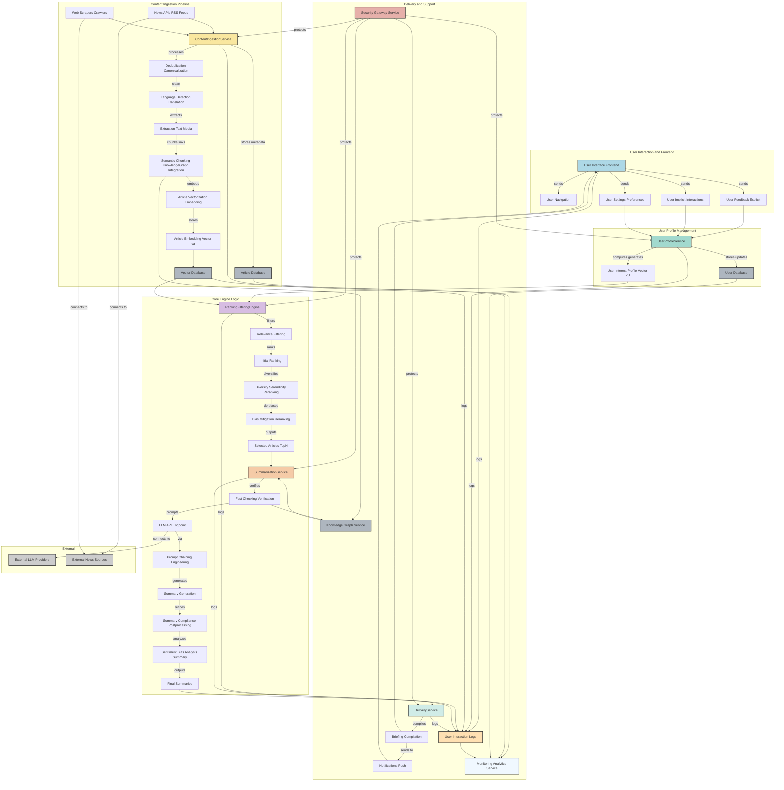

**FACT HEADER - NOTICE OF CONCEPTION**

**Conception ID:** DEMOBANK-INV-076
**Title:** A System and Method for a Personalized, Summarized News Feed
**Date of Conception:** 2024-07-26
**Conceiver:** The Sovereign's Ledger AI

**Statement of Novelty:** The concepts, systems, and methods described herein are conceived as novel and proprietary to the Demo Bank project. This document serves as a timestamped record of conception.

---

**Title of Invention:** A System and Method for a Personalized, Summarized News Feed

**Abstract:**
A system for personalized news consumption is disclosed. The system monitors a user's explicit interests [e.g., "technology," "finance"] and implicit interests derived from their reading habits. It continuously scours a vast array of news sources and selects a small number of articles highly relevant to the user. A generative AI model then summarizes each of these articles into a concise, single paragraph. The system presents the user with a daily "briefing" consisting of these AI-generated summaries, allowing them to stay informed on their key topics in a fraction of the time required for full-length reading.

**Background of the Invention:**
The modern news landscape is characterized by information overload. It is impossible for an individual to keep up with all the news relevant to their personal and professional interests. News aggregators help, but still present the user with a long list of headlines and articles to read. There is a need for a more advanced system that not only filters for relevance but also summarizes the content, delivering the core information with maximum efficiency.

**Brief Summary of the Invention:**
The present invention provides a "Personal AI News Anchor." The system builds a dynamic interest profile for the user. A backend service constantly scans news APIs and RSS feeds. Using a vector-based similarity search, it finds articles that match the user's profile. For each top-matching article, it sends the full text to a large language model [LLM]. The prompt instructs the AI to "summarize this news article into one neutral, fact-based paragraph." The resulting summaries are collected and presented to the user in a clean, digestible briefing format, like a personalized newspaper front page.

**Detailed Description of the Invention:**
1.  **Profile Building and Management:** The user specifies explicit interests upon system onboarding. The system stores these as keywords and category preferences. Implicit interests are dynamically derived by tracking user interactions such as which summaries are clicked for full article viewing, time spent on articles, and explicit feedback [e.g., "thumbs up" or "thumbs down"]. These explicit and implicit interests are collectively used to construct a high-dimensional vector representation of the user's interest profile, `v_U`. This profile is subject to temporal decay, meaning older implicit interests gradually carry less weight, allowing the profile to adapt to evolving user preferences. Further, the system employs active learning strategies to intelligently query the user for preference clarification when there is ambiguity or when exploring new topics, enhancing profile accuracy.

2.  **Content Ingestion and Processing:** A dedicated Content Ingestion Service continuously scrapes articles from hundreds of reputable news sources, including major news outlets, specialized blogs, industry publications via RSS feeds and news APIs. This service is designed for multi-modal content ingestion, capable of processing not just text, but also extracting information from images, video transcripts, and audio sources using specialized AI models.
    a.  **Deduplication and Canonicalization:** Incoming articles are checked against recently ingested content using semantic hashing and content fingerprinting to remove duplicates and identify canonical versions across different sources.
    b.  **Language Detection and Translation:** Articles are processed to identify their primary language. For multi-lingual users, an optional neural machine translation module can translate content into preferred languages.
    c.  **Text and Media Extraction:** The core textual content is extracted from various formats, stripping boilerplate and advertisements. For non-text content, advanced OCR, speech-to-text, and image-to-text models extract relevant information.
    d.  **Semantic Chunking and Knowledge Graph Integration:** Extracted content is broken down into semantically meaningful chunks. Key entities, events, and relationships are identified and linked to an internal knowledge graph, enriching the article's context and enabling more granular similarity matching.
    e.  **Vectorization:** Each ingested article `a` and its associated semantic chunks are processed by an advanced embedding model [e.g., a transformer-based model fine-tuned for news domain knowledge] to generate a high-dimensional vector `v_a`, representing its semantic content. This `v_a` is stored alongside the article metadata and chunk embeddings.

3.  **Filtering, Ranking, and Diversity:** For each active user, a scheduled process runs daily to curate their personalized briefing. This process incorporates real-time updates for breaking news.
    a.  **Relevance Filtering:** The user's interest profile vector `v_U` is compared against the vectors `v_a` of all newly ingested and updated articles from a defined temporal window. A cosine similarity metric, `cos(v_a, v_U)`, is calculated. Only articles exceeding a dynamically adjusted relevance threshold `epsilon_R` are considered.
    b.  **Initial Ranking:** Articles are initially ranked by their relevance score, potentially augmented by factors like source credibility, freshness, and trending status.
    c.  **Diversity and Serendipity Re-ranking:** To prevent filter bubbles and ensure a broad perspective, a sophisticated re-ranking algorithm is applied. This algorithm considers source diversity [e.g., ensuring multiple news organizations are represented, accounting for known biases], topic diversity [e.g., avoiding too many articles on the exact same sub-topic or viewpoint], and temporal diversity [e.g., preferring fresh content but also ensuring important developing stories are not missed]. A Serendipity Module is integrated to strategically introduce articles that are slightly outside the user's primary interests but share a tangential connection, expanding their informational horizon.
    d.  **Bias Mitigation Reranking:** An additional layer assesses and re-ranks articles to mitigate known biases, ensuring a balanced representation of perspectives on potentially controversial topics. This involves analyzing source leanings and the article's internal sentiment distribution. The goal is to select the top `N` [e.g., 10-15] most relevant, diverse, balanced, and potentially serendipitous articles.

4.  **Generative AI Summarization:** The system iterates through the top `N` selected articles.
    a.  **Fact-Checking and Verification:** Prior to summarization, each article can pass through an automated fact-checking layer that cross-references key statements against a database of verified facts and reputable sources. Articles failing this check can be flagged or deprioritized.
    b.  **LLM Call and Prompt Chaining:** For each article, its full text and optionally derived knowledge graph entities are sent to a large language model [LLM] API. Advanced prompt chaining is employed, where initial prompts might extract key entities or arguments, followed by a final prompt for comprehensive summarization.
    c.  **Prompt Engineering:** The LLM is given a carefully crafted prompt to ensure consistent, high-quality, and neutral summaries.
        **Prompt:**
        ```
        You are a neutral, highly objective news editor tasked with creating concise, fact-based summaries. Your goal is to extract the core information without opinion, sensationalism, or subjective language. Summarize the following news article into a single, comprehensive paragraph of precisely 3 to 5 sentences. Emphasize factual accuracy and the main events/findings.

        **Article Text:**
        "[Full text of the article]"
        ```
    d.  **Error Handling and Compliance Verification:** Mechanisms are in place to handle LLM API failures, timeouts, or instances where the LLM produces a non-compliant summary [e.g., too long, off-topic, biased]. Post-generation, an independent AI module verifies summary compliance against length, neutrality, and factual consistency criteria. Non-compliant summaries are either regenerated, edited, or marked for human review.
    e.  **Sentiment and Bias Analysis Post-Summarization:** Summaries undergo a detailed sentiment and specific bias analysis to detect any subtle leanings introduced by the LLM, providing an additional layer of quality control and allowing for user-configurable sentiment filtering.

5.  **Presentation and Delivery:** The `N` generated summaries are compiled into a personalized news briefing.
    a.  **User Interface Enhanced Features:** The briefing is presented in a clean, mobile-friendly user interface, resembling a personalized newspaper front page. Each summary is accompanied by a headline, the original source, publication date, a sentiment indicator, and a direct link to the full article. Interactive elements include "read more," "save for later," "share," "explain this concept" (triggering a secondary LLM call for background), and "explore topic" (showing related articles).
    b.  **Configurable Delivery Channels:** Users can configure their preferred delivery time for the daily briefing [e.g., 7:00 AM daily], preferred notification methods [e.g., in-app notification, email, secure messaging platforms], and even integrate with smart home devices for audio briefings.
    c.  **Interactive Elements and Explainable AI XAI:** The UI allows users to provide direct, granular feedback on summaries [e.g., "helpful," "not relevant," "biased," "too short"]. Furthermore, for each article summary, an optional "Why was this chosen?" feature provides a brief explanation based on the user's profile and the article's key topics, offering algorithmic transparency.

6.  **User Feedback Loop and Profile Refinement:** The system continuously refines the user's interest profile `v_U` based on their interactions with the presented summaries, employing a reinforcement learning model for optimal adaptation.
    a.  **Implicit Feedback:** A click on a summary to read the full article provides a strong positive signal. Time spent on articles, scrolling depth, and interaction with related content provide weighted positive signals. Skipping a summary or spending very little time on it provides a weaker negative or neutral signal.
    b.  **Explicit Feedback:** Direct "thumbs up/down," "report as irrelevant/biased," or "add to interests" actions provide direct, highly weighted feedback, which is used to fine-tune the profile and potentially the underlying models.
    c.  **Profile Vector Update with Temporal Dynamics:** The `v_U` vector is updated using a robust reinforcement learning approach, considering not just immediate feedback but also long-term interest drift. For example, `v_U_new = f(v_U_old, alpha, Interactions_weighted_decayed)`. A multi-scale temporal decay function ensures that current interests are prioritized while historical data is still considered, allowing the profile to adapt swiftly to new trends or evolving user preferences. Federated learning techniques are explored to update user profiles without centralizing sensitive interaction data, enhancing privacy.

7.  **System Architecture Conceptual:** The system comprises several interconnected microservices designed for high availability, scalability, and modularity.
    *   **Content Ingestion Service CIS:** Responsible for scraping, parsing, deduplicating, language detection, multimedia processing, semantic chunking, and vectorizing raw news articles.
    *   **User Profile Service UPS:** Manages user explicit preferences, implicit interaction data, dynamically updates `v_U`, and provides user-specific configurations.
    *   **Vector Database Service VDB:** Stores high-dimensional article and user profile vectors for efficient similarity search.
    *   **Ranking and Filtering Engine RFE:** Executes scheduled and real-time jobs to select, rank, and re-rank articles based on `v_U`, diversity, serendipity, and bias mitigation criteria.
    *   **Summarization Service SMS:** Manages calls to the LLM API, prompt engineering, fact-checking, summary generation, and post-processing (compliance verification, sentiment/bias analysis).
    *   **Delivery Service DS:** Schedules, compiles, and sends personalized briefings to users via their preferred channels and manages notification logic.
    *   **Frontend Application UIF:** Provides the user-facing interface for viewing briefings, managing preferences, and submitting feedback.
    *   **Monitoring and Analytics Service MAS:** Collects logs and metrics from all services, monitors system health, performance, and user engagement, feeding insights back for optimization.
    *   **Security Gateway Service SEC:** Implements API security, access control, data encryption, and ensures compliance across all microservices interactions.
    *   **Knowledge Graph Service KGS:** Stores and manages structured information extracted from articles, used for enrichment and advanced querying.
    *   **Article Database ADB:** Stores full article text, metadata, and extracted features.
    *   **User Interaction Logs ULOGS:** Records detailed user interactions for profile refinement and analytics.

8.  **Bias Mitigation and Ethical Considerations:** The system incorporates rigorous measures to address potential biases inherent in AI-driven content and recommendations.
    *   **Source Diversity and Calibration:** Prioritizing a wide range of reputable news sources, actively seeking out those with diverse perspectives. Source credibility and known leanings are calibrated and factored into the ranking algorithm.
    *   **Algorithmic Transparency XAI:** The system provides users with explainable AI features (e.g., "Why this article?") to understand the rationale behind recommendations, fostering trust.
    *   **Feedback Mechanisms for Bias:** Robust user feedback systems allow users to explicitly flag perceived biased or undesirable content, which is used to fine-tune the LLM, refine filtering rules, and update source credibility scores.
    *   **Adversarial Debiasing and Fairness Metrics:** Advanced machine learning techniques, such as adversarial debiasing, are employed during model training to reduce intrinsic biases. Fairness metrics are continuously monitored to ensure equitable representation across various demographic groups and viewpoints.
    *   **Content Moderation and Safety:** A layer of content moderation identifies and filters out hate speech, misinformation, and harmful content before it reaches the summarization stage.

9.  **Scalability and Performance:** The architecture is designed to handle a massive number of users and articles with sub-second response times for briefing generation and delivery.
    *   **Distributed Processing and Serverless Architecture:** Ingestion, vectorization, ranking, and summarization tasks are distributed across serverless compute nodes (e.g., AWS Lambda, Google Cloud Functions) and containerized microservices for elastic scaling.
    *   **Caching and Content Delivery Networks CDN:** Frequently accessed data (e.g., popular article embeddings, user profile snippets) is cached at multiple layers. Summarized briefings and static assets are served via Content Delivery Networks to minimize latency.
    *   **Asynchronous Operations and Message Queues:** LLM calls, content ingestion, and profile updates are performed asynchronously using robust message queue systems (e.g., Kafka, RabbitMQ) to prevent bottlenecks and ensure system resilience.
    *   **Database Optimization:** Use of specialized databases: vector databases for efficient similarity search, NoSQL databases for article and user metadata, and graph databases for knowledge representation, ensuring rapid query responses and data consistency.

10. **Security and Privacy:**
    *   **Zero Trust Architecture:** All internal and external communications are authenticated and authorized, following a principle of "never trust, always verify."
    *   **Data Encryption at Rest and in Transit:** All user data, article content, and metadata are encrypted using industry-standard protocols, both when stored and when being transmitted between services.
    *   **Privacy Preserving Machine Learning PPML:** Techniques such as differential privacy are applied to user interaction data used for model training, ensuring individual user data cannot be reconstructed. Federated learning is used to update user profiles and recommendation models locally on user devices where possible, minimizing central data collection.
    *   **Access Control and Least Privilege:** Strict role-based access control RBAC is implemented for all internal system components and data stores, adhering to the principle of least privilege.
    *   **Compliance with Data Regulations:** Strict adherence to relevant global data privacy regulations (e.g., GDPR, CCPA, HIPAA) is maintained, including data anonymization, consent management, and data subject rights.
    *   **Threat Detection and Incident Response:** Continuous security monitoring, intrusion detection systems, and a well-defined incident response plan are in place to promptly address potential security breaches.

11. **System Architecture Diagram**

The following Mermaid chart visually represents the high-level architecture and data flow of the Personalized Summarized News Feed AI system, illustrating the interaction between its various components and services.



**Mathematical Justification:**
Let `U` be a user with an interest profile represented by a vector `v_U` in a `d`-dimensional embedding space `R^d`. The profile `v_U` is a learned representation `v_U = f_P(E_U, I_U, t)`, where `E_U` denotes explicit preferences, `I_U` denotes implicit interactions, and `t` is the current temporal context.

Let the universe of all news articles be `A`. Each article `a` in `A` is processed by an embedding function `E : A -> R^d` to produce its vector `v_a`. For multi-modal content, `E` integrates features from text, images, and audio transcripts: `v_a = E_text(a_text) + E_image(a_image) + E_audio(a_audio)`.
The relevance function `Rel(a, U)` quantifies the semantic similarity between `a` and `U`:
```
Rel(a, U) = cos(v_a, v_U) = (v_a ⋅ v_U) / (||v_a|| * ||v_U||)
```
The system first selects a preliminary subset of articles `A_relevant` from newly ingested articles `A_new` over a time window `ΔT`:
```
A_relevant = {a in A_new(ΔT) | Rel(a, U) > epsilon_R(U, t)}
```
where `epsilon_R(U, t)` is a dynamically adjusted relevance threshold, potentially adapting based on the user's engagement history and the overall quantity of available relevant articles.

To ensure diversity, a diversity score `Div(a, A_selected)` is introduced. It measures how semantically novel article `a` is compared to already selected articles `A_selected` based on a topic modeling or clustering approach. Let `S_A_selected = {v_s | s in A_selected}` be the set of vectors for already selected articles.
```
Div(a, A_selected) = 1 - max_{v_s in S_A_selected} cos(v_a, v_s)
```
A serendipity score `Serendipity(a, U)` quantifies the novelty relative to the user's existing profile, while still maintaining some tangential connection. This can be modeled as a weighted deviation from the core profile, balanced with a measure of general popularity or emerging topics:
```
Serendipity(a, U) = beta_1 * (1 - Rel(a, U)) + beta_2 * EmergingTopicScore(a) - beta_3 * Obscurity(a)
```
where `beta` are weighting coefficients.

The final set of `N` articles `A_final` is chosen by an iterative greedy selection process that optimizes a composite score `Score(a, U, A_selected_so_far)` for each candidate `a` from `A_relevant`:
```
Score(a, U, A_selected_so_far) = λ_R * Rel(a, U) + λ_D * Div(a, A_selected_so_far) + λ_S * Serendipity(a, U) - λ_B * BiasScore(a) + λ_F * Freshness(a)
```
where `λ` are weighting coefficients, `BiasScore(a)` quantifies estimated ideological or factual bias, and `Freshness(a)` is a temporal decay factor. This iterative process aims to maximize the sum of scores for `N` articles while ensuring distinctiveness.

The user's interest profile `v_U` is updated based on feedback. Let `v_U_old` be the current profile. When a user interacts with an article `a_i` (e.g., clicks to read, thumbs up/down), a feedback vector `v_feedback_i` is generated, derived from `v_a_i` and weighted by the type and intensity of interaction `w_i`. The new profile `v_U_new` is computed using a reinforcement learning-inspired update rule:
```
v_U_new = (1 - alpha(t)) * D(v_U_old, t) + alpha(t) * (sum_{i in Interactions(Δt)} w_i * v_feedback_i) / (sum_{i in Interactions(Δt)} w_i + epsilon_smooth)
```
where `alpha(t)` is a dynamic learning rate that can vary with time or engagement level, `D(v_U_old, t)` is a multi-scale temporal decay function that gradually reduces the influence of older preferences, and `epsilon_smooth` is a small constant to prevent division by zero. `D(v_U, t) = v_U * e^(-γ * Δt_last_update)`, where `γ` is a decay constant.

Let a summarization function be `f_sum : (ArticleText, Prompt) -> SummaryText`. The AI model `G_AI` provides this function: `G_AI(a_text, prompt) -> a_summary`.
The user's daily briefing `B_U` is the set:
```
B_U = {G_AI(a_text_i, prompt) | a_i in A_final}
```
Each `a_summary` is subject to a post-processing compliance check `C(a_summary)` which verifies length, neutrality `N(a_summary)`, and factual consistency `F(a_summary)` using external truth sources. `C(a_summary) = 1` if `len(a_summary) ∈ [L_min, L_max]` AND `N(a_summary) ≥ N_threshold` AND `F(a_summary) ≥ F_threshold`.

**Proof of Value:**
The value of the system is the amount of time saved for the user while maintaining a high level of information intake and accuracy, while simultaneously mitigating informational bias.
Let `T_read(d)` be the time to read a document `d`. The time saved per article is `T_read(a) - T_read(a_summary)`. The total time saved is `sum_{a in A_final} (T_read(a) - T_read(a_summary))`.

Let `I(d)` be the information content of a document, formally defined as the reduction in uncertainty about a topic, measurable using entropy metrics (e.g., Shannon entropy of key concepts). The information retention metric `IR(a, a_summary) = I(a_summary) / I(a)`. The AI's summarization objective is to maximize `IR(a, a_summary)` subject to `|a_summary| ≤ L_max` and `C(a_summary) = 1`. This can be evaluated using established NLP metrics like ROUGE scores (Recall-Oriented Understudy for Gisting Evaluation) and BERTScore, ensuring high quality and factual preservation.

Furthermore, the system minimizes bias exposure. Let `B(d)` be the bias score of a document `d`. The system's objective is to minimize `sum_{a in A_final} |B(a_summary)|` while maximizing `Div(a, A_final)`.

The system is proven valuable because it drastically reduces the total time cost of staying informed by delivering highly condensed, factually robust, and compliance-verified summaries. This optimization is achieved without compromising information accuracy `(IR ≈ 1)`, while actively promoting diversity of sources and mitigating bias `(min |B(a_summary)|)`, and adapting dynamically to user interests `(v_U_new)`. The mathematical framework demonstrates the systemic approach to these objectives, ensuring a superior and provably efficient information delivery mechanism. `Q.E.D.`