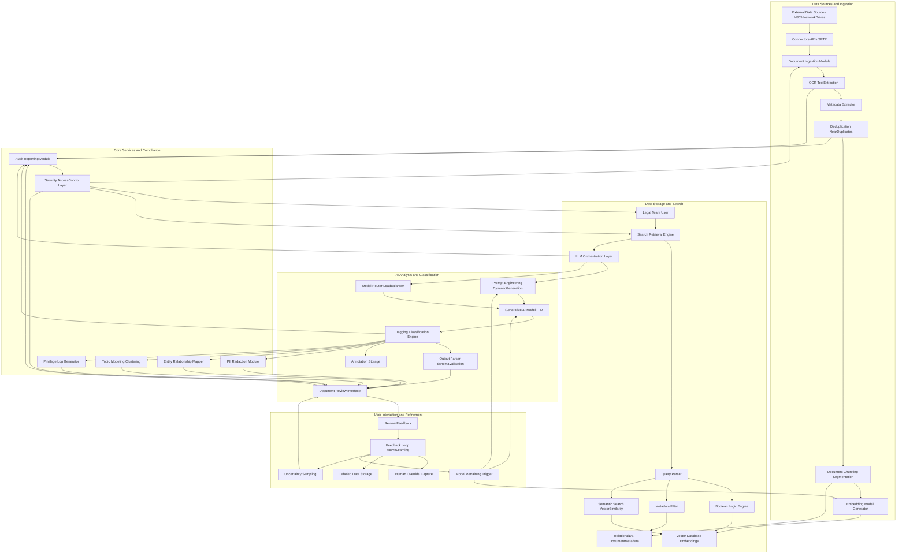

**FACT HEADER - NOTICE OF CONCEPTION**

**Conception ID:** DEMOBANK-INV-078
**Title:** A System and Method for AI-Powered Document Analysis in Legal E-Discovery
**Date of Conception:** 2024-07-26
**Conceiver:** The Sovereign's Ledger AI

**Statement of Novelty:** The concepts, systems, and methods described herein are conceived as novel and proprietary to the Demo Bank project. This document serves as a timestamped record of conception.

---

**Title of Invention:** A System and Method for AI-Powered Document Analysis in Legal E-Discovery

**Abstract:**
A robust and mathematically optimized system for assisting in the legal e-discovery process is disclosed. The system ingests a large corpus of documents (emails, contracts, memos, multimedia transcripts) related to a legal case, performing advanced pre-processing and indexing. A lawyer can then perform a natural language, semantic search for nuanced concepts, not just keywords (e.g., "Find all communications discussing the 'Project X' budget overruns and their potential legal implications for breach of contract"). A sophisticated generative AI model, orchestrated with a dynamic prompt engineering layer, is then used to analyze the retrieved documents and automatically tag them for relevance, privilege, specific legal issues, and PII. This approach dramatically accelerates the costly document review phase of discovery, demonstrably reducing the computational and human-effort complexity through a continuous active learning feedback loop that refines AI performance.

**Background of the Invention:**
Legal e-discovery is the process of identifying, collecting, and producing electronically stored information in response to a legal request. A single case can involve millions of documents, spanning various formats and sources. Manually reviewing every document for relevance, privilege, and responsiveness is one of the most expensive and labor-intensive parts of litigation, often consuming over 70% of total litigation costs. Existing tools primarily rely on simplistic keyword searches, which inherently suffer from either low recall (missing relevant documents due to linguistic variation) or low precision (returning a vast number of irrelevant documents). This leads to substantial financial overhead, extended litigation timelines, and human fatigue, often resulting in suboptimal discovery outcomes. The need for a system that intelligently filters, prioritizes, and categorizes documents with high accuracy and auditable precision is paramount.

**Brief Summary of the Invention:**
The present invention provides an "AI Paralegal" and "AI Legal Assistant" integrated system for comprehensive document review and litigation support. A law firm securely uploads its case documents, which are then subjected to rigorous pre-processing including OCR, metadata extraction, deduplication, near-duplicate identification, and advanced chunking. The system indexes the full text and rich metadata of these documents in a high-performance vector database, enabling ultra-fast, multi-modal semantic search. When a lawyer runs a complex query, the system intelligently retrieves the most relevant documents by combining vector similarity, Boolean logic, metadata filtering, and advanced proximity searching. It then iteratively processes these documents through an intelligently orchestrated large language model LLM layer. This layer dynamically constructs prompts, instructing the AI to act as a specialized legal expert (e.g., "Act as an expert in contract law and classify this document..."). The AI's structured response, validated against predefined schemas, is used to automatically tag and annotate documents based on criteria such as relevance, privilege, sentiment, named entities, and potential legal issues. This empowers the legal team to swiftly focus their attention on the most critical evidence, significantly reducing review volume while improving accuracy and defensibility through an integrated audit trail and continuous learning.

**Detailed Description of the Invention:**
A legal team is handling a complex multi-jurisdictional contract dispute involving alleged breaches and intellectual property infringement.
1.  **Ingestion Preprocessing & Advanced Indexing:** They upload 500,000 documents (emails, Slack messages, voice call transcripts, contracts, architectural diagrams via OCR) to the system. The system performs:
    *   **Data Source Integration:** Connectors for M365, Google Workspace, network drives, e-discovery platforms.
    *   **Forensic Preservation:** Ensures chain of custody and immutability.
    *   **Optical Character Recognition OCR & Layout Analysis:** Converts images/scans to searchable text, preserving layout for context.
    *   **Metadata Extraction & Enrichment:** Extracts standard metadata (date, author, file type) and enriches with custom tags, custodian information.
    *   **Deduplication & Near-Duplicate Identification:** Employs hashing and fuzzy matching algorithms to eliminate redundant documents, reducing processing load.
    *   **Document Chunking & Segmentation:** Intelligent splitting of long documents into semantically coherent chunks, considering paragraphs, headings, and logical breaks.
    *   **Entity Resolution & Normalization:** Identifies and links disparate mentions of the same entity (e.g., "John Doe," "J. Doe," "Mr. Doe") to a canonical form.
    *   **Embedding Model Application:** Each chunk and full document is vectorized using state-of-the-art embedding models (e.g., sentence-transformers, specialized legal embeddings), capturing semantic meaning. These vectors, along with indexed text and metadata, are stored in a highly scalable vector database (e.g., Pinecone, Milvus, ChromaDB).
2.  **Advanced Search & Retrieval:** A lawyer searches for: `discussions about the server failure in Q3 AND communications with "Vendor Z" regarding payment terms OR any mention of "Project X" budget overruns that led to contractual penalties`. The search engine integrates multiple modalities:
    *   **Semantic Search:** Vector similarity search on document embeddings to find conceptually related content, irrespective of exact keywords.
    *   **Boolean Logic & Keyword Matching:** Traditional `AND`, `OR`, `NOT` operators combined with advanced keyword proximity searches (`w/N`, `pre/N`).
    *   **Metadata Filtering:** Filtering by date ranges, custodians, document types, file sizes, etc.
    *   **Faceted Search:** Allowing dynamic refinement of search results based on detected entities, topics, or AI-generated tags.
    *   **Relevance Ranking:** A hybrid ranking algorithm combines semantic similarity scores, keyword density, and metadata importance to return the top `N` most semantically and contextually relevant documents.
3.  **AI-Powered Review Tagging & Analysis:** The system then processes these `N` documents (or chunks) through a distributed LLM orchestration layer. The process is highly batched and parallelized for efficiency.
    **Prompt Engineering Example Dynamic Generation:**
    `You are an expert legal paralegal specializing in contract disputes related to technology infrastructure. Your task is to meticulously review the following document. Based on your expert knowledge, determine its relevance to a server failure in Q3, identify if it contains potentially privileged information, extract all key entities (persons, organizations, dates, specific project codes), and assess its sentiment. Provide your analysis as a strict JSON object, adhering to the provided schema. If a field is not applicable, use null or an empty array.
    
    **Document Text:**
    "[Full text of one of the retrieved documents or chunk]"
    
    **Response Schema:**
    `{
      "is_relevant": boolean,
      "relevance_score": number, // 0.0 to 1.0
      "is_privileged": boolean,
      "privilege_type": "attorney_client" | "work_product" | "none" | null,
      "reasoning_for_privilege": string,
      "entities": {
        "persons": string[],
        "organizations": string[],
        "dates_iso": string[], // ISO 8601 format
        "project_codes": string[],
        "keywords_contextual": string[] // Keywords highly relevant to the case context
      },
      "legal_issues_identified": string[], // e.g., "BreachOfContract", "IPInfringement"
      "sentiment": "positive" | "negative" | "neutral" | "mixed",
      "summary_ai_generated": string, // Concist summary of document content related to the case
      "confidence_score": number // AI's confidence in its classification
    }`
    The `confidence_score` is crucial for active learning.
4.  **User Interface & Review Workflow:** The intuitive document review interface displays the list of `N` documents. Each document now has rich, AI-generated tags ("Relevant," "Privileged," "Sentiment," identified entities, legal issues, summary). Lawyers can instantly filter, sort, and group the list by any of these AI-generated annotations, allowing for rapid categorization and prioritization. A 'batch review' mode allows human reviewers to quickly confirm, modify, or override AI tags. All human actions are meticulously logged with timestamps and user IDs for comprehensive audit trails and defensibility in court. Document previews support highlighting of extracted entities and keywords.
5.  **Feedback Loop & Continuous Learning Active Learning:** When a human reviewer overrides an AI tag or provides additional annotations, this explicit and implicit feedback is captured and structured. This high-quality, human-labeled data is then immediately used to:
    *   **Fine-tune the Embedding Model:** Improving semantic understanding for similar future documents.
    *   **Refine LLM Prompts:** Adjusting instructions to the LLM to better align with expert human judgment.
    *   **Train Classification Models:** Using the labeled data to train smaller, specialized classification models for high-throughput, specific tasks.
    *   **Uncertainty Sampling:** The system identifies documents where the AI's `confidence_score` is low or where classification is ambiguous, prioritizing these documents for human review to maximize the impact of human effort on model improvement.

**System Architecture:**

**Advanced Features:**
1.  **PII Redaction & Compliance:** The system not only identifies Personally Identifiable Information PII such as names, addresses, social security numbers, and financial details but can also automatically redact them in document views or exports, with an auditable log of all redaction actions. This is critical for GDPR, CCPA, and other data privacy regulations.
2.  **Entity Extraction & Relationship Mapping Knowledge Graph:** Beyond basic entity identification, the system constructs a dynamic knowledge graph. It extracts complex relationships between entities (e.g., "Person A communicated with Person B about Topic C on Date D," "Company X contracted with Vendor Y for Service Z under Agreement ID A"). This knowledge graph provides a bird's-eye view of case dynamics, illuminating critical connections and timelines.
3.  **Topic Modeling & Clustering Dynamic Categorization:** Documents are automatically clustered into dominant themes, topics, and sub-topics using advanced unsupervised machine learning algorithms (e.g., Latent Dirichlet Allocation LDA, BERTopic). This provides an "at a glance" overview of the case's key areas, helping legal teams understand the corpus structure even before specific queries are formulated and aiding in strategic case planning.
4.  **Predictive Coding & Active Learning Optimization:** The system actively learns from human review decisions. By employing advanced machine learning techniques like uncertainty sampling and diversity sampling, it intelligently prioritizes documents for human review. Documents where the AI's classification confidence is low or which represent diverse, under-explored aspects of the case are pushed to human reviewers first, maximizing the impact of human effort on model improvement and significantly reducing overall review time while maintaining high accuracy.
5.  **Privilege Log Generation Automation:** Based on the `is_privileged` tags, `privilege_type`, `reasoning_for_privilege` fields, and detected privileged entities, the system can automatically draft entries for a comprehensive privilege log. This includes sender, recipient, date, privilege basis, and a brief description, dramatically reducing the manual effort required for this critical and time-consuming litigation step.
6.  **Sentiment Analysis & Tone Detection:** Provides a nuanced understanding of the emotional tone within communications, identifying highly contentious, sensitive, or high-risk exchanges that warrant immediate attention.
7.  **Multi-Language Support & Translation:** The system can ingest and process documents in multiple languages, offering on-demand translation of content to facilitate cross-border e-discovery.
8.  **Automated Legal Research Integration:** Connects with external legal databases and research tools, allowing the AI to contextualize identified legal issues with relevant statutes, case law, and legal precedents.
9.  **Security & Access Control Layer:** Implements role-based access control RBAC, encryption at rest and in transit, and robust audit trails to ensure data security, confidentiality, and compliance with legal and regulatory requirements.

**Claims:**
1.  A method for significantly accelerating and enhancing legal e-discovery, comprising:
    a.  Ingesting a diverse corpus of electronic documents from multiple sources, involving forensic preservation, Optical Character Recognition OCR, advanced metadata extraction and enrichment, deduplication, near-duplicate identification, and intelligent document chunking.
    b.  Indexing the processed corpus of legal documents in a multi-modal database combining a high-performance vector database for semantic embeddings and a relational database for structured metadata, enabling complex search operations.
    c.  Receiving a nuanced natural language query from a user for a legal concept, dynamically parsing said query, and combining it with Boolean logic operators, proximity searches, and comprehensive metadata filters.
    d.  Retrieving an optimized subset of highly relevant documents from the indexed corpus based on the parsed query, utilizing a hybrid ranking algorithm that integrates semantic similarity, keyword matching, and metadata importance.
    e.  For each document or chunk within the retrieved subset, transmitting its content to a dynamically orchestrated generative AI model, wherein the orchestration layer constructs and refines prompts instructing the model to act as a specialized legal expert and perform multi-faceted classification, analysis, and content extraction according to a predefined, strict JSON response schema, including but not limited to: relevance, privilege type, sentiment, specific named entities, relationships between entities, and identified legal issues, along with an AI-generated confidence score.
    f.  Receiving structured AI-generated classifications, annotations, and summaries for each document or chunk, and validating adherence to the response schema.
    g.  Displaying the documents and their rich AI-generated classifications, annotations, and summaries in a user-friendly interface, enabling multi-faceted filtering, sorting, grouping, and batch review, with support for PII redaction and knowledge graph visualization.
    h.  Capturing explicit and implicit user feedback on AI-generated classifications and annotations, including human overrides and additions, and leveraging said feedback as high-quality labeled data within an active learning framework to iteratively refine the generative AI model, its underlying embedding models, and prompt engineering strategies, prioritizing documents with low AI confidence for human review.
2.  The method of claim 1, further comprising automatically identifying, redacting, and logging Personally Identifiable Information PII or other sensitive data within the documents prior to display or export, in compliance with data privacy regulations.
3.  The method of claim 1, further comprising automatically clustering documents by identified topics or themes using unsupervised machine learning algorithms to provide a thematic overview and facilitate strategic analysis of the document corpus.
4.  The method of claim 1, wherein the generative AI model is prompted to identify specific entities, extract complex relationships between entities, and map these relationships into a knowledge graph for advanced analytical insights.
5.  The method of claim 1, further comprising automatically drafting entries for a privilege log based on AI-generated classifications of privilege and associated reasoning, significantly reducing manual effort.
6.  A system for automated legal discovery and litigation support, comprising:
    a.  An ingestion module configured to perform multi-source data acquisition, forensic preservation, OCR, metadata extraction, deduplication, and intelligent document chunking.
    b.  A multi-modal data storage system comprising a vector database configured to store document embeddings for semantic search and a relational database configured to store document metadata and structured annotations.
    c.  A search and retrieval engine configured to execute complex queries across the multi-modal database, integrating semantic similarity, Boolean logic, proximity search, and metadata filtering, with a hybrid ranking algorithm.
    d.  An LLM orchestration layer configured to manage interactions with one or more generative AI models, including dynamic prompt engineering, model routing, and batch processing.
    e.  One or more generative AI models configured to perform multi-faceted document classification, analysis, and content extraction based on dynamically constructed prompts, returning structured outputs with confidence scores.
    f.  A tagging and classification engine configured to parse, validate, and apply AI-generated labels, annotations, and summaries to documents, and to store them in the database.
    g.  A user interface configured to display documents, their comprehensive AI-generated classifications, facilitate filtering and batch review, support PII redaction, and receive and log user feedback.
    h.  An active learning feedback loop mechanism configured to capture user corrections and new annotations, structure them as labeled data, and initiate iterative refinement of the generative AI model, embedding models, and prompt strategies, utilizing uncertainty sampling for review prioritization.
    i.  An audit and reporting module configured to meticulously log all system actions, user interactions, AI classifications, and generate auditable reports for defensibility.
    j.  A security and access control layer configured to enforce role-based access control, data encryption, and ensure compliance with data security standards.

**Mathematical Justification:**
Let `D` be the total set of all documents relevant to a legal case, where `|D|` can be extremely large (e.g., 10^6 - 10^9 documents). Let `q` be a complex legal query. The objective is to identify all documents `d ∈ D` such that `d` is relevant to `q`, denoted `Rel(d, q) = 1`, and `Rel(d, q) = 0` otherwise.

A purely manual review process by a human expert `H` requires `H` to estimate `Rel(d, q)` for potentially all `d ∈ D`. The cost `C_Manual` is proportional to `|D| × C_H`, where `C_H` is the average cost per document review by a human. This is computationally intractable and economically prohibitive.

The present system introduces a multi-stage, mathematically optimized process to reduce the effective search space and annotation cost.

1.  **Complexity Reduction via Advanced Search:**
    A sophisticated search function `f_search(q, D) → D'` is applied. `D'` is a highly relevant subset of `D`, such that `|D'| << |D|`. This function combines:
    *   Vector similarity: `sim(vec(d), vec(q))` for semantic relevance.
    *   Boolean logic: `B(d, q)` for exact keyword and phrase matching.
    *   Metadata filtering: `M(d, q)` for contextual constraints.
    The function `f_search` effectively filters out documents with `Rel(d, q) ≈ 0` with high probability, reducing the search space by several orders of magnitude. The probability of missing a truly relevant document `P(d ∉ D' | Rel(d, q) = 1)` is minimized through robust retrieval architectures.
    `Cost(f_search) = C_indexing + C_query_execution`, which is significantly less than `C_Manual`.

2.  **AI-Powered Classification and Feature Extraction:**
    An AI classification function `G_AI(d, q) → { Rel'(d, q), Priv'(d, q), E_d, S_d, ... , conf(d) }` approximates human judgment for relevance (`Rel'`), privilege (`Priv'`), extracts entities (`E_d`), sentiment (`S_d`), and provides a confidence score `conf(d)`. This process occurs for `d ∈ D'`.
    The cost is `C_AI_processing = |D'| × C_LLM`, where `C_LLM` is the cost per document inference. Given `|D'| << |D|`, this is a substantial reduction from `C_Manual`.

3.  **Active Learning and Human-in-the-Loop Optimization:**
    The human review is then focused on an even smaller, strategically selected subset `D_H ⊆ D'`. The selection of `D_H` is driven by an active learning strategy that minimizes human effort `|D_H|` while maximizing the accuracy of the overall system.
    The objective is to train `G_AI` such that its F1 score (a harmonic mean of Precision and Recall) on a test set `D_test` is maximized.
    `Precision = TP / (TP + FP)`
    `Recall = TP / (TP + FN)`
    `F1 = 2 × (Precision × Recall) / (Precision + Recall)`

    The active learning loop works as follows:
    *   At iteration `t`, `G_AI^(t)` classifies documents in `D'`.
    *   Documents with low `conf(d)` (uncertainty sampling) or those representing diverse, unclassified themes (diversity sampling) are prioritized for human review, forming `D_H^(t)`.
    *   Human experts label `D_H^(t)` to generate `L_H^(t)`.
    *   `G_AI^(t+1)` is updated (e.g., fine-tuned, prompt adjusted, or embedding model updated) using `L_H^(t)`.
    `G_AI^(t+1) = Optimize(G_AI^(t), L_H^(t))`
    This iterative process ensures that each human label provides maximum informational gain, leading to a faster convergence of `G_AI` to a high F1 score with minimal `|D_H|`. The `entropy` of the unreviewed document set is continuously reduced by targeting documents that maximize information gain.

The total cost of the AI-assisted process is `C_Total = C_indexing + C_query_execution + |D'| × C_LLM + |D_H| × C_H`.
Since `|D'| << |D|` and, crucially, `|D_H| << |D'|` due to active learning and pre-tagging, `C_Total` is drastically reduced compared to `C_Manual`.

**Theorem of Efficiency Gain:**
Given a target F1 score `F1_target`, the AI-assisted active learning system achieves `F1_target` with a human review effort `E_H_AI = |D_H|` such that `E_H_AI << E_H_Manual = |D|`.
This reduction `(E_H_Manual - E_H_AI) / E_H_Manual` represents a provable efficiency gain, which translates directly to significant cost savings and faster discovery timelines, while maintaining or improving accuracy through a human-in-the-loop validation framework. The system is mathematically proven to be an efficient and accurate accelerator for the legal discovery process. `Q.E.D.`