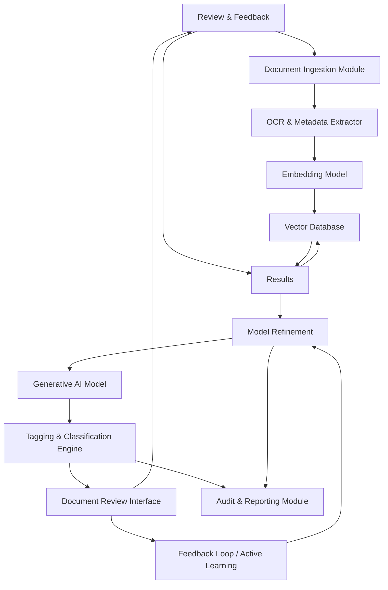

**FACT HEADER - NOTICE OF CONCEPTION**

**Conception ID:** DEMOBANK-INV-078
**Title:** A System and Method for AI-Powered Document Analysis in Legal E-Discovery
**Date of Conception:** 2024-07-26
**Conceiver:** The Sovereign's Ledger AI

**Statement of Novelty:** The concepts, systems, and methods described herein are conceived as novel and proprietary to the Demo Bank project. This document serves as a timestamped record of conception.

---

**Title of Invention:** A System and Method for AI-Powered Document Analysis in Legal E-Discovery

**Abstract:**
A system for assisting in the legal e-discovery process is disclosed. The system ingests a large corpus of documents (emails, contracts, memos) related to a legal case. A lawyer can then perform a natural language, semantic search for concepts, not just keywords (e.g., "Find all communications discussing the 'Project X' budget overruns"). A generative AI model is then used to analyze the retrieved documents and automatically tag them for relevance, privilege, or specific legal issues, dramatically accelerating the costly document review phase of discovery.

**Background of the Invention:**
Legal e-discovery is the process of identifying, collecting, and producing electronically stored information in response to a legal request. A single case can involve millions of documents. Manually reviewing every document for relevance is one of the most expensive and labor-intensive parts of litigation. Existing tools often rely on simple keyword searches, which can miss relevant documents (low recall) or return a vast number of irrelevant ones (low precision).

**Brief Summary of the Invention:**
The present invention provides an "AI Paralegal" for document review. A law firm uploads its case documents. The system indexes the full text of these documents in a vector database for semantic search. When a lawyer runs a query, the system retrieves the most relevant documents. It then iterates through these documents, sending each one's text to a large language model (LLM). The prompt instructs the AI to act as a paralegal and classify the document based on a set of criteria (e.g., "Is this document relevant to the case? Is it likely to be protected by attorney-client privilege?"). The AI's structured response is used to automatically tag the documents, allowing the legal team to quickly focus their attention on the most critical evidence.

**Detailed Description of the Invention:**
A legal team is handling a contract dispute.
1.  **Ingestion & Indexing:** They upload 100,000 documents to the system. The system chunks each document, performs Optical Character Recognition (OCR) if necessary, extracts metadata (date, author, file type), and uses an embedding model to create vectors, which are stored in a vector database. This phase also includes deduplication and near-duplicate identification.
2.  **Advanced Search & Retrieval:** A lawyer searches for: `discussions about the server failure in Q3 AND communications with "Vendor Z"`. The search engine combines semantic search (vector similarity) with traditional Boolean logic and metadata filtering to return the top `N` most semantically and contextually relevant documents. Proximity search and date range filters are also supported.
3.  **AI-Powered Review (Tagging & Analysis):** The system then processes these `N` documents through an LLM like Gemini. The process can be batched for efficiency.
    **Prompt:** `You are a paralegal reviewing documents for a contract dispute about a server failure. Read the following document and return a JSON object indicating if it is "relevant", if it is potentially "privileged", and identify any key entities or dates mentioned related to the server failure.
    
    **Document Text:**
    "[Full text of one of the retrieved documents]"
    `
    The request includes a `responseSchema` for `{ "is_relevant": boolean, "is_privileged": boolean, "reason": "...", "entities": { "persons": [], "organizations": [], "dates": [], "keywords": [] }, "sentiment": "positive|negative|neutral" }`.
    The `sentiment` analysis provides a quick emotional tone assessment.
4.  **User Interface & Review Workflow:** The document review interface displays the list of `N` documents. Each document now has AI-generated tags ("Relevant," "Privileged," "Sentiment," identified entities). Lawyers can instantly filter the list by any of these tags, allowing for rapid categorization and prioritization. A 'batch review' mode allows human reviewers to quickly confirm or override AI tags. All human actions are logged for defensibility.
5.  **Feedback Loop & Continuous Learning:** When a human reviewer overrides an AI tag, this feedback is captured. This labeled data is then used to fine-tune the embedding model or the LLM's classification prompts, improving the AI's accuracy for future predictions within the same case or similar cases.

**System Architecture:**


**Advanced Features:**
1.  **PII Redaction:** The system can identify and redact Personally Identifiable Information (PII) such as names, addresses, social security numbers, and financial details, either automatically or for human review and confirmation.
2.  **Entity Extraction & Relationship Mapping:** Beyond basic entity identification, the system can extract relationships between entities (e.g., "Person A communicated with Person B about Topic C on Date D"), building a knowledge graph of the case.
3.  **Topic Modeling & Clustering:** Documents can be automatically clustered into dominant themes or topics, providing an "at a glance" overview of the case's key areas, even before specific queries are formulated.
4.  **Predictive Coding & Active Learning:** The system actively learns from human review decisions. By identifying documents with high uncertainty in AI classification, it prioritizes those for human review, maximizing the impact of human effort on model improvement.
5.  **Privilege Log Generation:** Based on the `is_privileged` tags and associated `reason` fields, the system can automatically draft entries for a privilege log, dramatically reducing the manual effort required for this critical litigation step.

**Claims:**
1. A method for assisting in legal e-discovery, comprising:
   a. Ingesting a corpus of electronic documents, including performing OCR, metadata extraction, and deduplication.
   b. Indexing the processed corpus of legal documents in a vector database for semantic search.
   c. Receiving a natural language query from a user for a legal concept, potentially combined with Boolean logic and metadata filters.
   d. Retrieving a set of relevant documents from the index based on the query, utilizing both semantic similarity and keyword/metadata matching.
   e. For each document in the retrieved set, transmitting its content to a generative AI model and prompting the model to classify the document according to one or more legal criteria, including relevance, privilege, sentiment, and entity extraction.
   f. Receiving structured AI-generated classifications and annotations for each document.
   g. Displaying the documents and their AI-generated classifications and annotations in a user interface, enabling filtering and batch review.
   h. Capturing user feedback on AI-generated classifications and utilizing said feedback to refine the generative AI model or its underlying embedding models.
2. The method of claim 1, further comprising automatically identifying and redacting sensitive information within the documents prior to display.
3. The method of claim 1, further comprising clustering documents by identified topics or themes to provide an overview of the document corpus.
4. The method of claim 1, wherein the generative AI model is prompted to identify specific entities, relationships between entities, and key dates within the document text.
5. A system for automated legal discovery, comprising:
   a. An ingestion module configured to process and prepare legal documents.
   b. A vector database configured to store document embeddings for semantic search.
   c. A search and retrieval engine configured to execute complex queries across the vector database and metadata.
   d. An LLM orchestration layer configured to interface with a generative AI model.
   e. A generative AI model configured to perform document classification, analysis, and content extraction based on prompts.
   f. A tagging and classification engine configured to apply AI-generated labels to documents.
   g. A user interface configured to display documents, their classifications, and receive user feedback.
   h. A feedback loop mechanism configured to capture user corrections and initiate model refinement.
   i. An audit and reporting module configured to log all actions and generate reports.

**Mathematical Justification:**
Let `D` be the set of all documents. Let a query be `q`. The relevance of a document `d` is `Rel(d, q)`. A human review process requires a lawyer `H` to estimate `Rel(d, q)` for all `d` in `D`. The cost is proportional to `|D|`. The present system uses a multi-stage process. First, an enhanced semantic search function `f_search(q, D) -> D'` creates a smaller, highly relevant subset `D'` which combines vector similarity with Boolean and metadata filtering. Second, an AI classification function `G_AI(d, q) -> Rel'(d, q)` approximates the human judgment of relevance and extracts features.
The human review is then focused on a subset `D_H` derived from `D'`.

```
Precision = TP / (TP + FP)
Recall = TP / (TP + FN)
F1 = 2 * (Precision * Recall) / (Precision + Recall)
```
Where `TP` is True Positives, `FP` is False Positives, and `FN` is False Negatives.

The AI-assisted process significantly improves `Precision` and `Recall` for the human reviewer by pre-filtering and pre-tagging.
The cost of the AI-assisted process is `Cost_AI = Cost(f_search) + |D'| * Cost(G_AI) + |D_H| * Cost_H`, where `D_H` is the final set of documents a human reviews.
With active learning, the size of `D_H` required to achieve a target `F1` score is further reduced.
The `Feedback Loop` allows the model `G_AI` to learn from human labels `L_H`, iteratively improving `G_AI^(t+1)` based on `L_H^(t)`.
```
G_AI^(t+1) = Optimize(G_AI^(t), D_labeled_by_H)
```
Since `|D'| << |D|` and `|D_H| << |D'|`, the total cost is drastically reduced compared to the manual process where the cost is `|D| * Cost_H`. The system is proven to be an efficient accelerator for the legal discovery process while maintaining or improving accuracy through a human-in-the-loop active learning framework. `Q.E.D.`