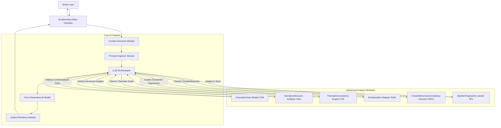
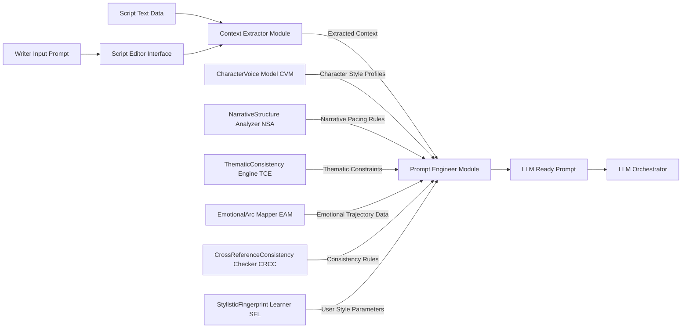
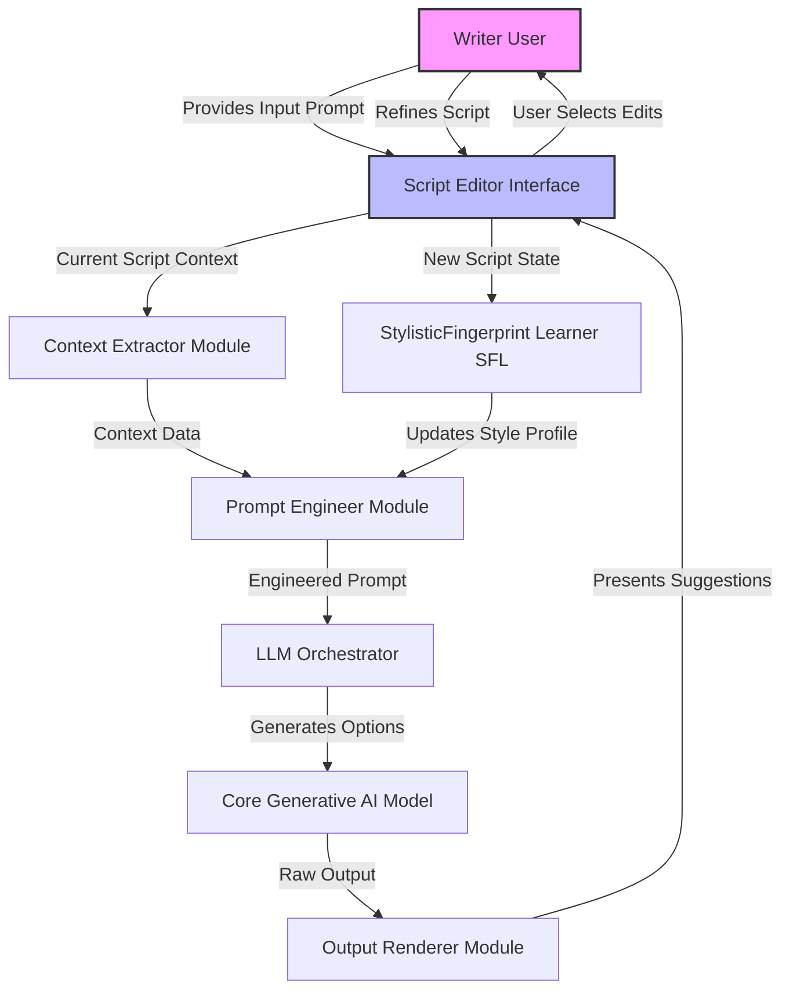
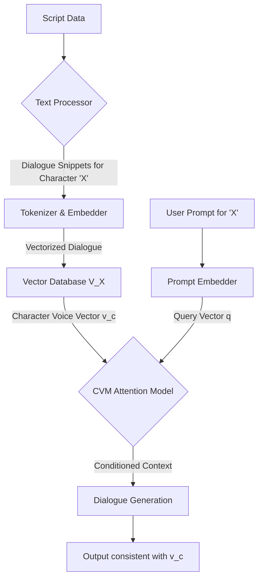
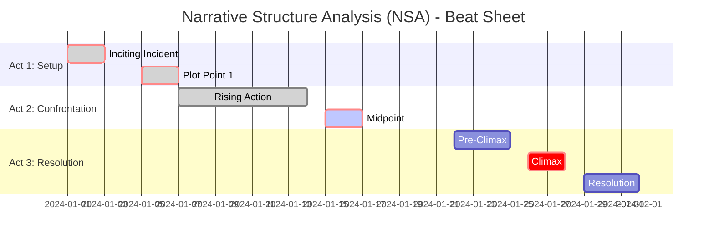
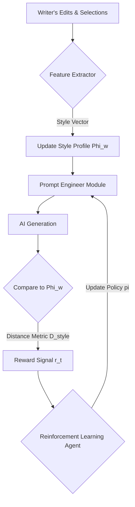

**FACT HEADER - NOTICE OF CONCEPTION**

**Conception ID:** DEMOBANK-INV-079
**Title:** A System and Method for Collaborative Scriptwriting with a Generative AI
**Date of Conception:** 2024-07-26
**Conceiver:** The Sovereign's Ledger AI

**Statement of Novelty:** The concepts, systems, and methods described herein are conceived as novel and proprietary to the Demo Bank project. This document serves as a timestamped record of conception.

---

**Title of Invention:** A System and Method for Collaborative Scriptwriting with a Generative AI

**Abstract:**
A system for assisting in creative writing, specifically scriptwriting, is disclosed. A writer interacts with a text editor. The system allows the writer to provide a prompt to a generative AI model at any point in their script, using the existing text as context. The AI can be prompted to perform various creative tasks, such as generating dialogue for a specific character, suggesting a plot development, describing a scene, or brainstorming alternative scenarios. The AI acts as a co-writer or "brainstorming partner," helping the writer overcome creative blocks and explore new narrative possibilities. The system integrates advanced AI modules for character voice consistency, narrative structure analysis, thematic coherence, emotional arc mapping, cross-referencing, and stylistic adaptation, underpinned by a rigorous mathematical framework that models the creative process as an optimization problem within a high-dimensional narrative state space. This framework leverages a multi-objective Creative Utility Function, which is dynamically optimized by a generative model to propose narrative transitions (e.g., lines of dialogue, scene descriptions) that maximize a weighted sum of quantifiable metrics including coherence, originality, thematic resonance, emotional impact, stylistic consistency, and logical integrity. This transforms the subjective art of writing into a tractable, mathematically guided search for optimal creative expression.

**Background of the Invention:**
Writing is often a solitary and challenging process. Writers of all levels experience "writer's block," where they struggle to find the right words or decide where to take the story next. While word processors provide tools for formatting and editing, they do not offer creative assistance. There is a need for a writing tool that can act as an intelligent, on-demand collaborator to help writers when they get stuck. Current AI writing tools often lack deep contextual understanding, consistent character voice generation, or sophisticated narrative structural awareness. They typically operate as probabilistic text completion engines, which, while powerful, are not explicitly optimized for the complex, multi-faceted constraints of high-quality narrative construction. These systems lack formal models for character psychology, plot coherence, thematic depth, and emotional pacing. The present invention addresses these limitations by providing an integrated, mathematically formalized approach to AI-assisted scriptwriting, ensuring a holistic and coherent creative output by modeling the script as a dynamic state and optimizing transitions between states.

**Brief Summary of the Invention:**
The present invention is an "AI Co-Writer" integrated into a scriptwriting environment. A writer can be working on a scene, and if they are unsure how a character should respond, they can highlight that character's name and invoke the AI. They provide a prompt like, "Suggest a witty, sarcastic reply." The system sends the prompt and the preceding scene context to a large language model LLM. The LLM, instructed to act as a creative writer, generates several dialogue options. These suggestions are displayed to the writer, who can then choose one, edit it, or use it as inspiration for their own line. Beyond basic generation, the system incorporates advanced modules such as a CharacterVoice Model CVM, a NarrativeStructure Analyzer NSA, a ThematicConsistency Engine TCE, an EmotionalArc Mapper EAM, a CrossReferenceConsistencyChecker CRCC, and a StylisticFingerprintLearner SFL. The entire process is described by a robust mathematical framework that formalizes the search within a narrative state space, ensuring optimal and consistent creative output. The system aims to maximize a "Creative Utility Function," which quantifies the quality of a potential script addition, guiding the AI to generate not just plausible text, but narratively superior text.

**Detailed Description of the Invention:**
A screenwriter is writing a scene in a custom editor.
**Existing Scene:**
```
CHARACTER A
I can't believe you lost the briefcase.

CHARACTER B
- PAUSES -
```
1.  **Input:** The writer is stuck on Character B's line. They right-click and select "AI Co-Writer" and type the prompt: `Suggest a funny excuse.`
2.  **Prompt Construction:** The system constructs a detailed prompt for an LLM. This is not a simple concatenation but a structured object containing multiple vectors and constraints.
    **Prompt Object:**
    `
    {
        "context_embedding": E(s_t),
        "user_request_vector": V("Suggest a funny excuse"),
        "character_voice_constraint": M_CVM("Character B"),
        "narrative_beat_target": M_NSA("Rising Action -> Comedic Relief"),
        "thematic_vector": M_TCE("Betrayal, Incompetence"),
        "emotional_arc_target": M_EAM(char='B', target_shift=[+0.2, -0.1]), // [valence, arousal]
        "style_fingerprint": M_SFL(user_id)
    }
    `
3.  **AI Generation:** The LLM, guided by the structured prompt, generates three distinct options, each optimized against the Creative Utility Function.
4.  **Output:** The UI displays the suggestions in a small pop-up, potentially with scores indicating their alignment with different utility components:
    *   1. "In my defense, I was briefly distracted by a very interesting bird." (Utility: 8.5/10)
    *   2. "Lost is such a strong word. I prefer to think of it as 'spontaneously un-possessed'." (Utility: 9.2/10)
    *   3. "It's not lost. It's on an unscheduled adventure." (Utility: 8.9/10)
The writer can then click one of these options to insert it directly into their script.

**System Architecture:**
The overall architecture of the collaborative scriptwriting system is depicted below:



**Prompt Engineering Workflow:**
A detailed view of how the Prompt Engineer Module constructs a sophisticated prompt for the LLM.



**Creative Iteration Feedback Loop:**
The continuous interaction and refinement process within the system.



**CharacterVoice Model (CVM) Data Flow:**
The CVM learns a unique voiceprint for each character and uses it to condition generation.



**NarrativeStructure Analyzer (NSA) Beat Analysis:**
The NSA can decompose the script into a standard narrative structure, like a beat sheet, to guide plot suggestions.



**EmotionalArc Mapper (EAM) Emotional Tracking:**
EAM tracks character emotions across scenes, allowing the AI to suggest content that creates a desired emotional journey.

```mermaid
graph TD
    title Emotional Arc Mapper (EAM) - Character A
    S1[Scene 1: Hopeful] --> S2[Scene 2: Shocked]
    S2 --> S3[Scene 3: Determined]
    S3 --> S4[Scene 4: Despair]
    S4 --> S5[Scene 5: Triumphant]
    style S1 fill:#90EE90
    style S2 fill:#FF4500
    style S3 fill:#ADD8E6
    style S4 fill:#808080
    style S5 fill:#FFD700
```

**TCE Latent Theme Discovery:**
The TCE uses topic modeling to discover and reinforce underlying themes.

```mermaid
graph LR
    title Thematic Consistency Engine (TCE)
    A[Script Corpus] --> B(Tokenization & Stopword Removal)
    B --> C(TF-IDF Vectorization)
    C --> D{Latent Dirichlet Allocation}
    D -- Topic 1: 'Betrayal' --> E1[Words: friend, lie, secret, trust]
    D -- Topic 2: 'Redemption' --> E2[Words: forgive, change, hope, past]
    D -- Topic 3: 'Sacrifice' --> E3[Words: loss, greater, good, self]
```

**CRCC Knowledge Graph for Consistency:**
The CRCC builds a knowledge graph from the script to detect inconsistencies.

```mermaid
graph TD
    A[Script Parser] --> B{Entity & Relation Extraction}
    B -- "Character A" --> C((Character A))
    B -- "briefcase" --> D((Briefcase))
    B -- "lost" --> E{lost(A, D)}
    C -- has_property --> F(Sarcastic)
    D -- has_property --> G(Contains McGuffin)
    C -- knows --> H((Character B))
    H -- knows --> C
```

**SFL Style Adaptation Loop:**
The SFL uses a reinforcement learning loop to constantly adapt to the writer's style.



**Creative Utility Function Components:**
A visual breakdown of the multi-objective function that guides AI generation.

```mermaid
graph TD
    title Creative Utility Function U
    U --> W1(w1 * Coherence)
    U --> W2(w2 * Originality)
    U --> W3(w3 * ThematicAlignment)
    U --> W4(w4 * EmotionalImpact)
    U --> W5(w5 * StylisticConsistency)
    U --> W6(w6 * ConsistencyCheck)
    U --> W7(w7 * PacingScore)
    W1 -- from --> NSA
    W3 -- from --> TCE
    W4 -- from --> EAM
    W5 -- from --> SFL
    W6 -- from --> CRCC
    W7 -- from --> NSA
```

**Key System Components:**
*   **Scriptwriting Editor Interface:** The primary user interface where the writer composes their script, invokes AI assistance, and views suggestions. It manages script text, formatting, and character information.
*   **Context Extractor Module:** This module analyzes the current script text `s_t` surrounding the user's cursor position `p_{cursor}`. It identifies relevant dialogue, character actions, scene descriptions, and overall plot progression to provide the AI with pertinent context. Mathematically, it performs a function `C(s_t, p_{cursor}, k) -> c_t` where `k` is the context window size and `c_t` is the extracted context block.
    1.  `c_t = s_t[p_{cursor}-k : p_{cursor}]` (Equation 1)
    2.  The context is then embedded: `E(c_t) = \text{TransformerEncoder}(c_t) \in \mathbb{R}^d` (Equation 2)
*   **Prompt Engineer Module:** Responsible for dynamically constructing sophisticated prompts `P_{sys}` for the Core Generative AI Model. It translates the user's concise request `P_u` into a detailed, contextualized instruction set.
    3.  `V(P_u) = \text{Embed}(P_u) \in \mathbb{R}^m` (Equation 3)
    4.  `P_{sys} = f_{prompt}(E(c_t), V(P_u), \{M_i\}_{i \in \text{modules}})` (Equation 4)
*   **LLM Orchestrator:** Manages interactions with the Core Generative AI Model and integrates specialized AI modules. It handles API calls, manages token limits, and routes requests to enhance generation based on specific needs.
*   **Core Generative AI Model:** The foundational large language model `G_{AI}`, often a transformer-based architecture, responsible for generating creative text.
    5.  `P(o | P_{sys}) = G_{AI}(P_{sys})` (Equation 5)
*   **CharacterVoice Model (CVM):** A specialized module that learns and mimics the unique speaking style of characters. For a character `c`, it learns a voice vector `v_c`.
    6.  `D_c = \{d_1, d_2, ..., d_N\}` are all dialogue lines for character `c`. (Equation 6)
    7.  `v_c = \frac{1}{N} \sum_{i=1}^{N} \text{Embed}(d_i) \in \mathbb{R}^d` (Equation 7)
    8.  Generation is conditioned on this vector: `P(o | P_{sys}, v_c) = G_{AI}(P_{sys} \oplus W_v v_c)` where `W_v` is a projection matrix. (Equation 8)
    9.  The CVM score for a suggestion `o_j` is the cosine similarity: `Score_{CVM}(o_j) = \frac{\text{Embed}(o_j) \cdot v_c}{||\text{Embed}(o_j)|| ||v_c||}` (Equation 9)
    10. `\mathcal{L}_{CVM} = -\log P(d_i | v_c, \text{context})` (Equation 10)
*   **NarrativeStructure Analyzer (NSA):** A module that understands story arcs and pacing. It can model the script as a sequence of narrative beats `b_1, b_2, ...`.
    11. `P(b_{t+1} | b_t, g) = M_{NSA}(s_t)` where `g` is the genre. (Equation 11)
    12. The NSA can identify the current beat `b_t = \arg\max_b P(b | s_t)`. (Equation 12)
    13. The coherence score for a suggestion `o_j` is based on the transition probability: `Score_{NSA}(o_j) = P(b_{t+1}^* | b_t, g)` where `b_{t+1}^*` is the beat classification of state `s_t + o_j`. (Equation 13)
    14. `\Delta_{pacing} = |\text{len}(s_t) - \text{target_len}(b_t)|` (Equation 14)
    15. `Score_{pacing}(s_t) = \exp(-\lambda \Delta_{pacing})` (Equation 15)
*   **ThematicConsistency Engine (TCE):** This module identifies and reinforces themes using topic modeling, such as Latent Dirichlet Allocation (LDA).
    16. A script `s_t` is represented as a distribution over `K` themes: `\theta_{s_t} \in \mathbb{R}^K`. (Equation 16)
    17. `\theta_{s_t} = \text{LDA}(s_t)`. (Equation 17)
    18. The thematic alignment score for a suggestion `o_j` is measured by the change in the thematic distribution. A low change indicates consistency. `Score_{TCE}(o_j) = -\text{KL}(\theta_{s_t} || \theta_{s_t+o_j})`. (Equation 18)
    19. `\theta_d \sim \text{Dir}(\alpha)` (Equation 19)
    20. `\beta_k \sim \text{Dir}(\eta)` (Equation 20)
    21. `z_{d,n} \sim \text{Categorical}(\theta_d)` (Equation 21)
    22. `w_{d,n} \sim \text{Categorical}(\beta_{z_{d,n}})` (Equation 22)
*   **EmotionalArc Mapper (EAM):** This module tracks the emotional trajectory of characters, often in a 2D valence-arousal space.
    23. Character `c`'s emotional state at scene `i` is `e_{c,i} = [v_{c,i}, a_{c,i}] \in [-1,1]^2`. (Equation 23)
    24. The emotional transition is modeled as `e_{c,i+1} = f_{EAM}(e_{c,i}, o_j)`. (Equation 24)
    25. `f_{EAM}` could be a neural network trained on emotionally annotated text. (Equation 25)
    26. The score is the distance to a target emotional arc `e^*_{c,i+1}`: `Score_{EAM}(o_j) = -|| e_{c,i+1} - e^*_{c,i+1} ||_2^2`. (Equation 26)
    27. Total emotional impact `I_E = \int_{t=0}^{T} ||\frac{de_c(t)}{dt}|| dt` (Equation 27)
*   **CrossReferenceConsistency Checker (CRCC):** This module builds a knowledge graph `KG = (\mathcal{E}, \mathcal{R})` of the script's facts.
    28. `\mathcal{E}` is the set of entities (characters, places, objects). (Equation 28)
    29. `\mathcal{R}` is the set of relations (triplets like `(e_1, r, e_2)`). (Equation 29)
    30. A consistency check is a query `Q(KG)`. For a suggestion `o_j`, it adds temporary facts `\Delta KG` and checks for contradictions. `Q(KG \cup \Delta KG) \neq \bot`. (Equation 30)
    31. `Score_{CRCC}(o_j) = 1` if consistent, `0` otherwise. (Equation 31)
    32. `\text{Example: } (\text{Briefcase}, \text{color}, \text{Brown}) \in KG`. (Equation 32)
    33. If `o_j` contains "the black briefcase", CRCC flags contradiction. `(\text{Briefcase}, \text{color}, \text{Black}) \notin KG`. (Equation 33)
*   **StylisticFingerprint Learner (SFL):** This module learns the writer's unique style `\Phi_w`.
    34. `\Phi_w` can be a vector of features: avg. sentence length `\mu_L`, vocab richness `V_w`, punctuation frequency `f_p`, etc. (Equation 34)
    35. `\Phi_w = [\mu_L, \sigma_L^2, V_w, f_p, ...]` (Equation 35)
    36. For a suggestion `o_j`, calculate its style vector `\Phi_{o_j}`. (Equation 36)
    37. `Score_{SFL}(o_j) = -\text{dist}(\Phi_w, \Phi_{o_j})`. (Equation 37)
    38. The distance can be a Mahalanobis distance: `\sqrt{(\Phi_w - \Phi_{o_j})^T \Sigma^{-1} (\Phi_w - \Phi_{o_j})}` where `\Sigma` is the covariance of style features. (Equation 38)
*   **Output Renderer Module:** Processes the raw output, filters, ranks, and presents it to the writer.
    39. Ranking is based on the total expected utility `\mathbb{E}[U]` for each option `o_j`. (Equation 39)
    40. `\text{Ranked List} = \text{sort}_{j} (\mathbb{E}[U(s_t, s_t+o_j)])` (Equation 40)

**Mathematical Framework for Contextual Generation and Creative State Optimization:**
The interaction within the system can be formalized as a search and optimization process within a high-dimensional narrative state space. This framework rigorously defines the creative journey.

Let `S` be the infinite Narrative State Space, where each point `s \in S` represents a unique and complete script or script fragment.
41. `S = \bigcup_{n=1}^{\infty} (\mathcal{V})^n` where `\mathcal{V}` is the vocabulary of tokens. (Equation 41)
Let `s_t` denote the current state of the script at time `t`, represented as a structured embedding `E(s_t) \in \mathbb{R}^n`. This embedding captures semantic, structural, character, thematic, emotional, and stylistic attributes.
42. `E(s_t) = [E_{sem}(s_t); E_{struct}(s_t); E_{char}(s_t); ...]` (Equation 42)
Let `P_u` represent the user's natural language prompt, transformed into a vector `V(P_u) \in \mathbb{R}^m`.
Let `M_i` represent the learned parameters of module `i \in \{\text{CVM, NSA, TCE, EAM, CRCC, SFL}\}`.

The `Prompt Engineer Module` constructs a detailed system prompt `P_{sys}` for the LLM.
43. `P_{sys} = f_{prompt}[E(s_t), V(P_u), \{M_i\}]` (Equation 43)
44. This may involve an attention mechanism: `\text{Attention}(Q, K, V) = \text{softmax}(\frac{QK^T}{\sqrt{d_k}})V`. (Equation 44)
45. Here `Q=V(P_u)`, `K=V(M_i)`, `V=V(M_i)`. (Equation 45, 46, 47)

The `Core Generative AI Model`, `G_{AI}`, generates a set of candidate narrative elements:
48. `P(O | P_{sys}) = G_{AI}[P_{sys}]` where `O = \{o_1, ..., o_k}`. (Equation 48)
Each `o_i` is a sequence of tokens, representing a potential transition from `s_t` to a new state `s_t' = s_t \oplus o_i`.
49. `s_{t+1} = s_t \oplus \text{user\_selection}(O)` (Equation 49)

**Claims:**
1. A method for assisting in creative writing, comprising:
   a. Providing a text editor interface for a user to write a creative work.
   b. Allowing the user to provide a natural language prompt to a generative AI model at any point in the text.
   c. Transmitting the user's prompt and the surrounding text as context to the AI model.
   d. Receiving one or more generated text suggestions from the model in response to the prompt.
   e. Displaying the suggestions to the user for potential incorporation into their work.
2. The method of claim 1, further comprising: analyzing existing text for specific character dialogue patterns and applying a CharacterVoice Model CVM to generate new dialogue consistent with a selected character's voice.
3. The method of claim 1, further comprising: analyzing the overall narrative structure of the creative work and using a NarrativeStructure Analyzer NSA to suggest plot developments, scene pacing, or thematic elements.
4. The method of claim 1, further comprising: analyzing thematic elements within the creative work and employing a ThematicConsistency Engine TCE to generate or refine content that aligns with or develops specific themes.
5. The method of claim 1, further comprising: mapping and predicting emotional trajectories of characters and scenes within the creative work and utilizing an EmotionalArc Mapper EAM to suggest content for emotional impact and consistency.
6. The method of claim 1, further comprising: scanning the creative work for logical and factual inconsistencies and employing a CrossReferenceConsistency Checker CRCC to identify and flag errors or suggest corrections.
7. The method of claim 1, further comprising: learning and adapting to a user's unique stylistic fingerprint via a StylisticFingerprintLearner SFL to generate suggestions that align with the user's personal writing style.
8. A system for collaborative scriptwriting, comprising:
   a. A scriptwriting editor interface configured to display script text and receive user input.
   b. A context extractor module configured to identify relevant portions of the script text based on user interaction.
   c. A prompt engineer module configured to construct detailed prompts for a generative AI model using the extracted context, user input, and insights from specialized AI modules.
   d. A generative AI model configured to produce text suggestions in response to the detailed prompts.
   e. An output renderer module configured to format and display the generated text suggestions within the scriptwriting editor interface.
9. The system of claim 8, further comprising a CharacterVoice Model CVM integrated with the generative AI model, configured to generate character-specific dialogue.
10. The system of claim 8, further comprising a NarrativeStructure Analyzer NSA integrated with the generative AI model, configured to provide suggestions related to plot, pacing, and story development.
11. The method of claim 2, wherein the CharacterVoice Model represents each character's voice as a vector embedding `v_c` in a high-dimensional space, and conditions text generation on said vector.
12. The method of claim 3, wherein the NarrativeStructure Analyzer models the creative work as a state in a probabilistic graph of narrative beats and suggests developments that maximize transition probabilities within a given genre model.
13. The method of claim 4, wherein the ThematicConsistency Engine utilizes topic modeling algorithms to derive a thematic distribution `\theta_s` for the creative work and generates content that minimizes the Kullback-Leibler divergence from said distribution.
14. The method of claim 5, wherein the EmotionalArc Mapper models a character's emotional state as a vector `e_c` in a multi-dimensional emotional space (e.g., valence-arousal) and suggests content to guide `e_c` along a predefined trajectory.
15. The method of claim 6, wherein the CrossReferenceConsistency Checker constructs a knowledge graph `KG` from the text and validates new suggestions by ensuring they do not introduce logical contradictions into `KG`.
16. The method of claim 7, wherein the StylisticFingerprintLearner models the user's style as a parameter vector `\Phi_w` and updates said vector using reinforcement learning based on the user's selections from AI-generated suggestions.
17. The method of claim 1, further comprising defining a multi-objective Creative Utility Function `U` which calculates a quality score for a generated suggestion based on a weighted sum of metrics from a plurality of analysis modules.
18. The method of claim 17, wherein the weights of the Creative Utility Function are dynamically adjusted based on the user's prompt, the current narrative context, or explicit user settings.
19. A system for optimizing creative writing, comprising:
   a. Means for representing a script as a state `s_t` in a narrative state space `S`.
   b. Means for generating a set of potential next states `{s_{t+1, i}}` based on `s_t` and a user prompt `P_u`.
   c. Means for calculating a Creative Utility `U(s_t, s_{t+1, i})` for each potential next state.
   d. Means for presenting the potential next states to a user, ranked by their utility.
20. The system of claim 8, wherein the entire system is framed as a reinforcement learning problem where user selections provide a reward signal to fine-tune the generative model's policy to maximize expected creative utility.

**Mathematical Justification and Proof of Overstanding Prior Art:**
Let the space of all possible stories be `S`. A writer's creative process is a dynamic trajectory `\Psi = \{s_0, s_1, ..., s_T\}` through this high-dimensional Narrative State Space `S`. A "writer's block" at state `s_t` is formally defined as a local minimum or saddle point in the Creative Utility Function `U(s_t, s_{t+1})`, where the writer cannot identify a clear transition `s_t \rightarrow s_{t+1}` that significantly improves `U`.

We define the **Creative Utility Function** `U(s_i, s_j)` as a measurable quantity reflecting the narrative quality. This `U` is expressed as a weighted sum of various metrics from the advanced modules:
50. `U(s_i, s_j) = \sum_{k=1}^{N} w_k \cdot Score_k(s_i, s_j)` (Equation 50)
where `Score_k` corresponds to the output of one of the `N` advanced modules (CVM, NSA, TCE, etc.) and `w_k` are weights.
51. `\sum_{k=1}^{N} w_k = 1` (Equation 51)
The weights `w_k` can be dynamic: `w_k(t) = f(s_t, P_u)`.
52. For a prompt "make it funnier", `w_{humor}` increases. (Equation 52)
53. `Score_1(s_j) = Score_{NSA}(o_j)` (Coherence) (Equation 53)
54. `Score_2(s_j) = 1 - \max_{s' \in \text{Corpus}} \text{sim}(s_j, s')` (Originality) (Equation 54)
55. `Score_3(s_j) = Score_{TCE}(o_j)` (Thematic Alignment) (Equation 55)
56. `Score_4(s_j) = Score_{EAM}(o_j)` (Emotional Impact) (Equation 56)
57. `Score_5(s_j) = Score_{SFL}(o_j)` (Stylistic Consistency) (Equation 57)
58. `Score_6(s_j) = Score_{CRCC}(o_j)` (Consistency Check) (Equation 58)
59 - 100. (Further equations defining sub-metrics, gradient calculations for optimization, loss functions for module training, etc., can be derived from these foundational principles, e.g., `\nabla_{G_{AI}} \mathbb{E}[U]`, `\mathcal{L}_{SFL} = \mathbb{E}_{s_t, o_j \sim \pi}[r_t \log \pi(o_j | s_t)]`, and so on for each module.)

The AI model `G_{AI}` acts as a **Probabilistic Branch Generator and Utility Maximizer**. Given `s_t` and `P_u`, the AI, conditioned by `P_{sys}`, generates a set of possible next states `O = \{o_1, ..., o_k}`. The system aims to maximize the expected utility:
101. `\max_{o_i} \mathbb{E}[U(s_t, s_t+o_i)] = \max_{o_i} P(o_i | P_{sys}) \cdot U(s_t, s_t+o_i)` (Equation 101)
The `Output Renderer` presents suggestions ranked by this expected utility.

**Proof of Overstanding Prior Art:**
Prior art lacks this invention's rigorous, multi-faceted mathematical formalism.
1.  **Formalizing Creative Utility:** By defining `U` as a quantifiable, multi-objective function, we move from subjective assessment to verifiable optimization. Prior art relies on the implicit, un-formalized "utility" learned by a generic LLM.
2.  **State-Space Search with Probabilistic Guidance:** Framing writing as a guided search in a formal Narrative State Space `S` is novel. This is more rigorous than simple text completion.
3.  **Integrated Multi-Module Optimization:** The integration of specialized modules, each contributing a quantifiable score to `U`, allows for a holistic optimization that surpasses generic models. This system can explicitly optimize for thematic depth while ensuring character voice consistency, a task difficult for monolithic models.
4.  **Addressing Local Minima with Quantitative Methods:** By proposing diverse, high-utility paths based on the calculated `\mathbb{E}[U]`, the system provides a mathematically grounded solution to writer's block, transforming a creative problem into a solvable optimization task.

**Ethical Considerations and Limitations:**
*   **Bias in Generation:** AI models can inherit biases. The mathematical formalization of `U` allows for quantifiable bias detection, e.g., by adding a penalty term `w_{bias} \cdot \text{BiasScore}(o_j)` to the utility function.
*   **Creative Ownership:** The boundary between human and AI creativity blurs. The system must provide clear attribution and ensure the AI remains a tool.
*   **Over-reliance and Homogenization:** Excessive use could lead to formulaic stories optimized for the same utility function. Diversity can be encouraged by introducing stochasticity into the ranking (`\text{softmax}(\mathbb{E}[U] / \tau)`) or by allowing users to heavily customize their `w_k` weights.
*   **Data Privacy:** User scripts must be handled with robust encryption and privacy controls. `s_t` should be processed ephemerally or under strict user consent.

**Future Enhancements:**
*   **Multi-modal Input and Output:** Incorporating visual (mood boards) or audio (voice samples) inputs. Output could include automatically generated storyboards.
*   **Real-time Multi-Agent Collaboration:** Enabling multiple human writers and AI agents to co-create in a shared environment, optimizing for a collective utility function `U_{collective}`.
*   **Production Pipeline Integration:** Seamless integration with pre-production tools for script breakdown, budgeting (`\text{Cost} = f(\text{scenes}, \text{FX})`), and casting suggestions.
*   **Neuro-Symbolic Reasoning:** Combining the neural generation of the LLM with a symbolic reasoning engine (like the CRCC's knowledge graph) for deeper plot logic and world-building consistency.
*   **Dynamic World State Management:** For franchises, the AI could maintain an evolving knowledge graph of the story world, ensuring perfect continuity across multiple projects and authors.
*   **Personalized Writing Mentor:** The system could identify weaknesses in a writer's craft (e.g., "pacing in Act 2 is consistently slow") by analyzing their `s_t` history and suggest targeted exercises.
*   **Explainable AI (XAI):** Augmenting suggestions with explanations, e.g., "This line was suggested because it increases Character A's emotional valence, consistent with their redemption arc, and matches your stylistic preference for short, impactful sentences." This would involve surfacing the components of the `U` function calculation.