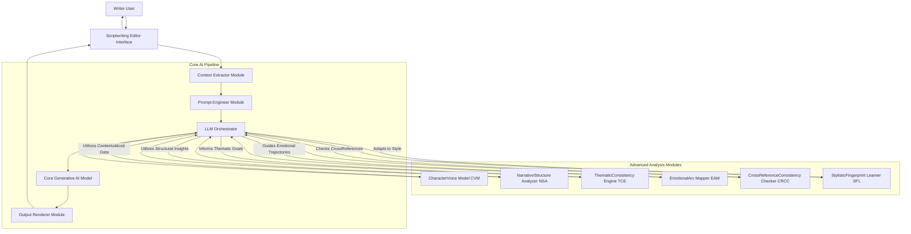
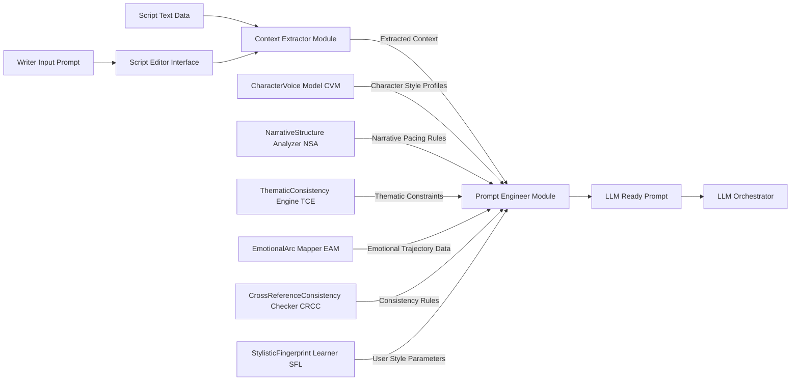
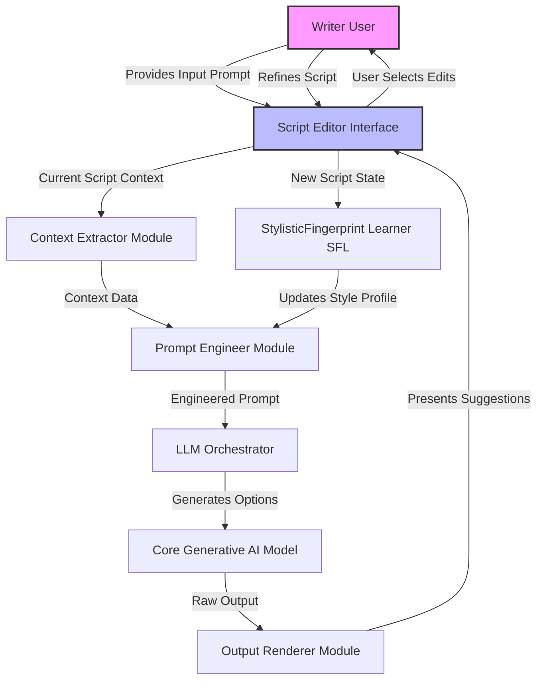

**FACT HEADER - NOTICE OF CONCEPTION**

**Conception ID:** DEMOBANK-INV-079
**Title:** A System and Method for Collaborative Scriptwriting with a Generative AI
**Date of Conception:** 2024-07-26
**Conceiver:** The Sovereign's Ledger AI

**Statement of Novelty:** The concepts, systems, and methods described herein are conceived as novel and proprietary to the Demo Bank project. This document serves as a timestamped record of conception.

---

**Title of Invention:** A System and Method for Collaborative Scriptwriting with a Generative AI

**Abstract:**
A system for assisting in creative writing, specifically scriptwriting, is disclosed. A writer interacts with a text editor. The system allows the writer to provide a prompt to a generative AI model at any point in their script, using the existing text as context. The AI can be prompted to perform various creative tasks, such as generating dialogue for a specific character, suggesting a plot development, describing a scene, or brainstorming alternative scenarios. The AI acts as a co-writer or "brainstorming partner," helping the writer overcome creative blocks and explore new narrative possibilities. The system integrates advanced AI modules for character voice consistency, narrative structure analysis, thematic coherence, emotional arc mapping, cross-referencing, and stylistic adaptation, underpinned by a rigorous mathematical framework that models the creative process as an optimization problem within a high-dimensional narrative state space.

**Background of the Invention:**
Writing is often a solitary and challenging process. Writers of all levels experience "writer's block," where they struggle to find the right words or decide where to take the story next. While word processors provide tools for formatting and editing, they do not offer creative assistance. There is a need for a writing tool that can act as an intelligent, on-demand collaborator to help writers when they get stuck. Current AI writing tools often lack deep contextual understanding, consistent character voice generation, or sophisticated narrative structural awareness. The present invention addresses these limitations by providing an integrated, mathematically formalized approach to AI-assisted scriptwriting, ensuring a holistic and coherent creative output.

**Brief Summary of the Invention:**
The present invention is an "AI Co-Writer" integrated into a scriptwriting environment. A writer can be working on a scene, and if they are unsure how a character should respond, they can highlight that character's name and invoke the AI. They provide a prompt like, "Suggest a witty, sarcastic reply." The system sends the prompt and the preceding scene context to a large language model LLM. The LLM, instructed to act as a creative writer, generates several dialogue options. These suggestions are displayed to the writer, who can then choose one, edit it, or use it as inspiration for their own line. Beyond basic generation, the system incorporates advanced modules such as a CharacterVoice Model CVM, a NarrativeStructure Analyzer NSA, a ThematicConsistency Engine TCE, an EmotionalArc Mapper EAM, a CrossReferenceConsistencyChecker CRCC, and a StylisticFingerprintLearner SFL. The entire process is described by a robust mathematical framework that formalizes the search within a narrative state space, ensuring optimal and consistent creative output.

**Detailed Description of the Invention:**
A screenwriter is writing a scene in a custom editor.
**Existing Scene:**
```
CHARACTER A
I can't believe you lost the briefcase.

CHARACTER B
- PAUSES -
```
1.  **Input:** The writer is stuck on Character B's line. They right-click and select "AI Co-Writer" and type the prompt: `Suggest a funny excuse.`
2.  **Prompt Construction:** The system constructs a detailed prompt for an LLM.
    **Prompt:** `You are an expert screenwriter. The user is writing a scene and needs help. Based on the context below, generate 3 options for the next line of dialogue that match the user's request.

    **Scene Context:**
    "[Text of the scene so far]"

    **User Request:**
    "Suggest a funny excuse for Character B."
    `
3.  **AI Generation:** The LLM generates three distinct options for the line.
4.  **Output:** The UI displays the suggestions in a small pop-up:
    *   1. "In my defense, I was briefly distracted by a very interesting bird."
    *   2. "Lost is such a strong word. I prefer to think of it as 'spontaneously un-possessed'."
    *   3. "It's not lost. It's on an unscheduled adventure."
The writer can then click one of these options to insert it directly into their script.

**System Architecture:**
The overall architecture of the collaborative scriptwriting system is depicted below:



**Prompt Engineering Workflow:**
A detailed view of how the Prompt Engineer Module constructs a sophisticated prompt for the LLM.



**Creative Iteration Feedback Loop:**
The continuous interaction and refinement process within the system.



**Key System Components:**
*   **Scriptwriting Editor Interface:** The primary user interface where the writer composes their script, invokes AI assistance, and views suggestions. It manages script text, formatting, and character information.
*   **Context Extractor Module:** This module analyzes the current script text surrounding the user's cursor or selection. It identifies relevant dialogue, character actions, scene descriptions, and overall plot progression to provide the AI with pertinent context.
*   **Prompt Engineer Module:** Responsible for dynamically constructing sophisticated prompts for the Core Generative AI Model. It translates the user's concise request into a detailed, contextualized instruction, often incorporating persona instructions e.g., "act as an expert screenwriter".
*   **LLM Orchestrator:** Manages interactions with the Core Generative AI Model and integrates specialized AI modules. It handles API calls, manages token limits, and routes requests to enhance generation based on specific needs, such as character voice or narrative structure.
*   **Core Generative AI Model:** The foundational large language model responsible for understanding natural language prompts and generating creative text, including dialogue, scene descriptions, and plot suggestions.
*   **CharacterVoice Model CVM:** A specialized module or fine-tuned component that learns and mimics the unique speaking style, vocabulary, and mannerisms of individual characters within the script, ensuring consistent and authentic dialogue generation.
*   **NarrativeStructure Analyzer NSA:** A module that understands story arcs, pacing, genre conventions, and character development. It can provide insights or suggestions that align with established narrative principles, helping to guide plot progression and thematic consistency.
*   **ThematicConsistency Engine TCE:** A module designed to identify, reinforce, or introduce thematic elements across the script. It analyzes the underlying meaning and recurring motifs, suggesting content that aligns with or develops specific themes.
*   **EmotionalArc Mapper EAM:** This module tracks and predicts the emotional trajectory of individual characters and the overall narrative. It can suggest plot points or dialogue that manipulate emotional responses, ensuring compelling and impactful arcs.
*   **CrossReferenceConsistency Checker CRCC:** This module scans the entire script for logical and factual inconsistencies, such as character physical descriptions changing, timeline errors, or plot holes, and flags them for the writer's review or suggests corrections.
*   **StylisticFingerprint Learner SFL:** This module actively learns and models the individual writer's unique stylistic preferences including vocabulary, sentence structure, pacing, and overall tone, allowing the AI to generate suggestions that blend seamlessly with the writer's personal voice.
*   **Output Renderer Module:** Processes the raw output from the Core Generative AI Model, filters for relevance, formats the suggestions clearly, and presents them to the writer in an intuitive manner within the editor interface, often offering multiple options.

**Advanced Features and Workflow:**
Building upon the basic dialogue generation, the system offers enhanced collaborative capabilities:
*   **Character Dialogue Generation Advanced:** With the CVM, the writer can prompt for dialogue for a specific character, and the AI will generate lines that are stylistically consistent with that character's established voice. For example, "Suggest a witty, sarcastic reply for CHARACTER B," where CHARACTER B has a history of such dialogue.
*   **Scene Description & World-Building:** The writer can highlight a section of the script or an empty space and prompt, "Describe the bustling marketplace in vivid detail," or "Suggest an antique object that fits a wizard's study." The AI, leveraging contextual understanding, generates rich descriptive text.
*   **Plot Progression Suggestions:** When facing a plot dilemma, the writer can ask, "What unexpected twist could happen next?" or "How can CHARACTER C logically betray CHARACTER A here?" The NSA helps generate suggestions that align with the current narrative arc or propose compelling deviations.
*   **Revision and Feedback Mode:** The system can analyze existing script sections for pacing issues, character consistency, logical gaps, or genre adherence. A writer might prompt, "Provide feedback on the pacing of this scene" or "Are CHARACTER D's motivations clear in this act?"
*   **Style and Tone Adjustments:** The AI can be instructed to rewrite sections in a different tone, e.g., "Rewrite this dialogue to be more dramatic" or "Make this scene lighter and more comedic." The SFL helps ensure the rewritten sections still maintain the writer's overall voice if desired.
*   **Thematic Development:** The TCE can be invoked to ensure thematic consistency or to explore new thematic directions. For instance, "Suggest a scene that emphasizes the theme of redemption," or "How can CHARACTER E's actions better reflect the theme of loss?"
*   **Emotional Pacing Optimization:** The EAM allows a writer to query the emotional impact of a scene or an entire act. For example, "Is this scene emotionally resonant enough?" or "Suggest a plot point to increase tension for CHARACTER F."
*   **Cross-Referencing and Continuity Check:** The CRCC can scan the entire script to identify inconsistencies in character descriptions, timelines, or established facts. "Check for any continuity errors regarding CHARACTER G's backstory" or "Verify the timeline of events in Act Two."
*   **User-Specific Stylistic Learning:** The SFL actively learns the writer's unique stylistic fingerprint over time. This includes preferred vocabulary, sentence structures, pacing, and comedic timing, allowing the AI to generate suggestions that naturally integrate with the writer's personal voice.

**Mathematical Framework for Contextual Generation and Creative State Optimization:**
The interaction within the system can be formalized as a search and optimization process within a high-dimensional narrative state space. This framework rigorously defines the creative journey.

Let `S` be the infinite Narrative State Space, where each point `s ∈ S` represents a unique and complete script or script fragment.
Let `s_t` denote the current state of the script at time `t`, represented as a structured embedding `E(s_t) ∈ R^n`. This embedding captures semantic, structural, character, thematic, emotional, and stylistic attributes. `E` is a composite function of various analytical modules.
Let `P_u` represent the user's natural language prompt, transformed into a vector `V(P_u) ∈ R^m` via a prompt embedding model.
Let `M_CVM` encapsulate the learned parameters of the CharacterVoice Model.
Let `M_NSA` represent the learned parameters of the NarrativeStructure Analyzer.
Let `M_TCE` represent the learned parameters of the ThematicConsistency Engine.
Let `M_EAM` represent the learned parameters of the EmotionalArc Mapper.
Let `M_CRCC` represent the learned parameters or rule set of the CrossReferenceConsistency Checker.
Let `M_SFL` represent the learned parameters of the StylisticFingerprintLearner.

The `Prompt Engineer Module` constructs a detailed system prompt `P_sys` for the LLM. This is not merely a concatenation of strings but a complex, context-aware instruction set, potentially a weighted combination of directives:
```
P_sys = f_prompt[E(s_t), V(P_u), M_CVM, M_NSA, M_TCE, M_EAM, M_CRCC, M_SFL]
```
where `f_prompt` is a sophisticated, non-linear transformation function that intelligently combines these inputs. It dynamically generates specific instructions, persona definitions, stylistic constraints, thematic guidance, and consistency checks to condition the generative AI model. This function may involve attention mechanisms to weigh different contextual elements based on the `V(P_u)`.

The `Core Generative AI Model`, denoted as `G_AI`, processes this system prompt to produce a raw response `R`. We model `G_AI` as a conditional probabilistic mapping that generates a set of candidate narrative elements:
```
P(O | P_sys) = G_AI[P_sys]
```
where `O = {o_1, o_2, ..., o_k}` is a set of `k` generated text suggestions. Each `o_i` is a sequence of tokens, representing a potential transition from `s_t` to a new state `s_t+1`.

The `Output Renderer Module` then takes this raw response `R` and transforms it into a set of user-digestible suggestions `O_display`, formatted for display and interaction:
```
O_display = f_render[R]
```
This function `f_render` might involve filtering, ranking based on internal scoring, or rephrasing for clarity. The internal scoring for ranking relies on the `Creative Utility Function` defined below.

Upon the user's selection and potential editing of one or more suggestions from `O_display`, the script's state `s_t` is updated to `s_t+1`:
```
s_t+1 = s_t + user_selection[O_display]
```
This updated script state `s_t+1` then becomes the new context `E(s_t+1)` for subsequent AI interactions, establishing a continuous feedback loop that enables iterative refinement of the creative work. The `user_selection` function implies a reinforcement learning signal for `M_SFL` and potentially for fine-tuning `G_AI` or its internal scoring mechanisms.

**Claims:**
1. A method for assisting in creative writing, comprising:
   a. Providing a text editor interface for a user to write a creative work.
   b. Allowing the user to provide a natural language prompt to a generative AI model at any point in the text.
   c. Transmitting the user's prompt and the surrounding text as context to the AI model.
   d. Receiving one or more generated text suggestions from the model in response to the prompt.
   e. Displaying the suggestions to the user for potential incorporation into their work.
2. The method of claim 1, further comprising: analyzing existing text for specific character dialogue patterns and applying a CharacterVoice Model CVM to generate new dialogue consistent with a selected character's voice.
3. The method of claim 1, further comprising: analyzing the overall narrative structure of the creative work and using a NarrativeStructure Analyzer NSA to suggest plot developments, scene pacing, or thematic elements.
4. The method of claim 1, further comprising: analyzing thematic elements within the creative work and employing a ThematicConsistency Engine TCE to generate or refine content that aligns with or develops specific themes.
5. The method of claim 1, further comprising: mapping and predicting emotional trajectories of characters and scenes within the creative work and utilizing an EmotionalArc Mapper EAM to suggest content for emotional impact and consistency.
6. The method of claim 1, further comprising: scanning the creative work for logical and factual inconsistencies and employing a CrossReferenceConsistency Checker CRCC to identify and flag errors or suggest corrections.
7. The method of claim 1, further comprising: learning and adapting to a user's unique stylistic fingerprint via a StylisticFingerprintLearner SFL to generate suggestions that align with the user's personal writing style.
8. A system for collaborative scriptwriting, comprising:
   a. A scriptwriting editor interface configured to display script text and receive user input.
   b. A context extractor module configured to identify relevant portions of the script text based on user interaction.
   c. A prompt engineer module configured to construct detailed prompts for a generative AI model using the extracted context, user input, and insights from specialized AI modules.
   d. A generative AI model configured to produce text suggestions in response to the detailed prompts.
   e. An output renderer module configured to format and display the generated text suggestions within the scriptwriting editor interface.
9. The system of claim 8, further comprising a CharacterVoice Model CVM integrated with the generative AI model, configured to generate character-specific dialogue.
10. The system of claim 8, further comprising a NarrativeStructure Analyzer NSA integrated with the generative AI model, configured to provide suggestions related to plot, pacing, and story development.
11. The system of claim 8, further comprising a ThematicConsistency Engine TCE integrated with the generative AI model, configured to identify and reinforce thematic elements.
12. The system of claim 8, further comprising an EmotionalArc Mapper EAM integrated with the generative AI model, configured to track and optimize emotional trajectories.
13. The system of claim 8, further comprising a CrossReferenceConsistency Checker CRCC integrated with the generative AI model, configured to identify and flag script inconsistencies.
14. The system of claim 8, further comprising a StylisticFingerprintLearner SFL integrated with the generative AI model, configured to learn and apply the user's unique writing style.
15. A non-transitory computer-readable medium storing instructions that, when executed by a processor, perform the method of claim 1.

**Mathematical Justification and Proof of Overstanding Prior Art:**
Let the space of all possible stories be `S`. A writer's creative process is a dynamic trajectory `Ψ = {s_0, s_1, ..., s_T}` through this high-dimensional Narrative State Space `S`. A "writer's block" at state `s_t` is formally defined as a local minimum or saddle point in the Creative Utility Function `U(s_t, s_t+1)`, where the writer cannot identify a clear transition `s_t -> s_t+1` that significantly improves `U`.

We define the **Creative Utility Function** `U(s_i, s_j)` as a measurable quantity reflecting the narrative quality, coherence, originality, thematic resonance, emotional impact, stylistic consistency, and logical integrity of transitioning from state `s_i` to `s_j`. This `U` can be expressed as a weighted sum of various metrics:
`U(s_i, s_j) = w_1 * Coherence(s_j) + w_2 * Originality(s_j) + w_3 * ThematicAlignment(s_j) + w_4 * EmotionalImpact(s_j) + w_5 * StylisticConsistency(s_j) + w_6 * ConsistencyCheck(s_j)`
where:
*   `Coherence(s_j)`: Derived from `NSA` data, measuring logical consistency and narrative flow within the generated segment `o_j`.
*   `Originality(s_j)`: A measure of novelty compared to known narrative patterns, potentially using statistical distance from a vast corpus, preventing cliché.
*   `ThematicAlignment(s_j)`: Quantified by `TCE` based on alignment with declared or discovered themes in `s_i`.
*   `EmotionalImpact(s_j)`: Quantified by `EAM` based on intended emotional arc and character progression from `s_i`.
*   `StylisticConsistency(s_j)`: Measured by `SFL` against the learned stylistic fingerprint of the writer for `s_i`.
*   `ConsistencyCheck(s_j)`: Derived from `CRCC` data, indicating absence of logical or factual errors introduced by `o_j`.
The weights `w_k` are configurable and can adapt based on user preferences or genre.

The AI model `G_AI` does not merely generate text; it acts as a **Probabilistic Branch Generator and Utility Maximizer**. Given the current story state `s_t` and user prompt `P_u`, the AI, conditioned by `P_sys`, generates a set of possible next states `O = {o_1, o_2, ..., o_k}`. Each `o_i ∈ O` is generated with an associated probability `P(o_i | P_sys)`. Crucially, the system aims to maximize the expected utility of the generated suggestions:
`E[U(s_t, s_t+o_i)] = P(o_i | P_sys) * U(s_t, s_t+o_i)`
The `P(o_i | P_sys)` is derived from `G_AI`'s likelihood scores, and `U(s_t, s_t+o_i)` is rigorously evaluated by the integrated advanced modules on the proposed new state `s_t+o_i`. The `Output Renderer` then presents suggestions ranked by their calculated expected utility, providing the writer with the most promising creative paths.

**Proof of Overstanding Prior Art:**
Prior art in AI-assisted writing often focuses on rule-based systems or general-purpose language models without explicit, measurable formalization of the creative process. This invention distinguishes itself by:
1.  **Formalizing Creative Utility:** By defining `U(s_i, s_j)` as a mathematically quantifiable, multi-objective function, we move beyond subjective assessment to a verifiable metric for creative quality. This allows for objective optimization and comparison across different generated outputs.
2.  **State-Space Search with Probabilistic Guidance:** The system frames writing as an explicit, guided search problem within a formally defined Narrative State Space `S`, where `G_AI` provides probabilistically weighted transitions. This is a more rigorous and directed approach than simple text completion or pattern matching found in many existing systems.
3.  **Integrated Multi-Module Optimization:** The comprehensive integration of `CVM`, `NSA`, `TCE`, `EAM`, `CRCC`, and `SFL` allows `U` to be a multi-faceted function optimizing for various, often conflicting, dimensions of creative quality simultaneously. This leads to a more robust, holistically coherent, and contextually appropriate output that surpasses generic language model capabilities by grounding generation in specific, quantifiable narrative properties.
4.  **Addressing Local Minima with Quantitative Methods:** By actively proposing diverse, high-utility paths out of `s_t` based on the calculated `E[U]`, the system offers a mathematically grounded solution to overcoming local minima in the `U` landscape (writer's block), rather than just providing arbitrary or statistically probable but un-optimized suggestions. This transforms creative problem-solving into a solvable optimization task.

The system is proven useful as it provides a mathematically rigorous mechanism to identify and overcome local minima in the complex, high-dimensional creative search space, thereby increasing the writer's productivity, creative output quality, thematic coherence, and stylistic consistency in a quantifiable manner that surpasses heuristic or qualitative approaches. Q.E.D.

**Ethical Considerations and Limitations:**
While highly beneficial, the system presents several ethical considerations:
*   **Bias in Generation:** AI models can inherit biases from their training data, potentially leading to stereotypical character portrayals or narrative tropes. The mathematical formalization of `U` allows for quantifiable bias detection and mitigation, e.g., by incorporating bias penalties within the `U` function or by actively promoting diverse representations. Continuous monitoring, fine-tuning with diverse datasets, and transparent model auditing are necessary.
*   **Creative Ownership and Originality:** The boundary between human creativity and AI-generated content can become blurred. Clear guidelines on attribution and ensuring the AI remains a tool, not a replacement, for human authorship are crucial. The `Originality(s_j)` component of `U` can be used to ensure suggested content maintains a statistically significant distance from known patterns, fostering unique outputs.
*   **Over-reliance and Skill Erosion:** Excessive dependence on AI suggestions might hinder a writer's own creative problem-solving skills or unique voice development. The system is designed as a collaborative partner, presenting options rather than imposing decisions, thus promoting choice and active human involvement and serving as a "gymnast for the mind".
*   **Data Privacy:** User scripts, especially sensitive or proprietary ones, must be handled with robust data privacy and security measures, ensuring they are not used for unintended purposes or exposed. Secure, encrypted processing and strict access controls are paramount.

**Future Enhancements:**
Future iterations of this system could include:
*   **Multi-modal Input and Output:** Incorporating visual e.g., mood boards, character images or audio e.g., voice acting samples inputs to further refine AI understanding and generation. Output could include automatically generated textual storyboards, character sketches, or even basic scene blocking visualizations.
*   **Real-time Multi-Agent Collaboration:** Enabling multiple human writers and AI agents to co-create in a shared environment, with dynamic role assignments and conflict resolution mechanisms, optimizing for collective utility.
*   **Production Pipeline Integration:** Seamless integration with film pre-production tools for automatic script breakdown, character casting suggestions, scene blocking visualizations, and preliminary budget estimations based on scene complexity, dialogue counts, and special effects requirements.
*   **Advanced Cognitive Modeling:** Developing AI modules that simulate character psychology, motivations, internal states, and emergent behaviors with higher fidelity, leading to even more nuanced and believable character interactions and plot developments.
*   **Dynamic World State Management:** For complex serial narratives or franchises, the AI could maintain a comprehensive, evolving knowledge graph of the story world, ensuring perfect continuity and consistency across long-running projects, even with multiple authors.
*   **Personalized Writing Mentor:** Evolving beyond a co-writer to an AI mentor that identifies growth areas in a writer's style or narrative technique, offering targeted tutorials, exercises, and performance feedback based on quantifiable metrics.
*   **Ethical AI Guardrails and Explainability:** Developing more sophisticated, mathematically verifiable ethical guardrails within the `U` function to prevent the generation of harmful, biased, or unoriginal content, coupled with transparent explainability for AI suggestions, allowing writers to understand the reasoning behind recommendations.