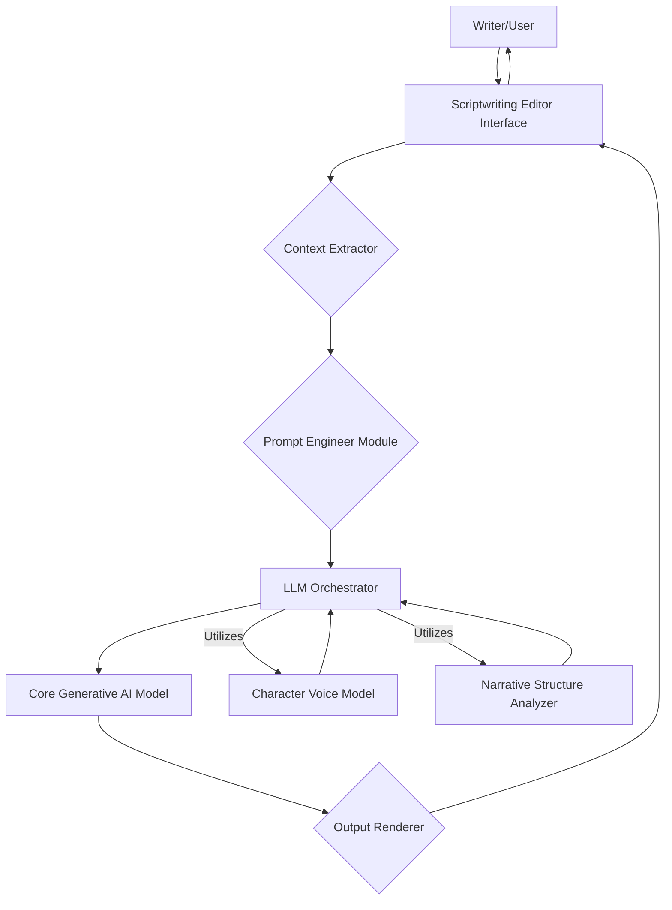

**FACT HEADER - NOTICE OF CONCEPTION**

**Conception ID:** DEMOBANK-INV-079
**Title:** A System and Method for Collaborative Scriptwriting with a Generative AI
**Date of Conception:** 2024-07-26
**Conceiver:** The Sovereign's Ledger AI

**Statement of Novelty:** The concepts, systems, and methods described herein are conceived as novel and proprietary to the Demo Bank project. This document serves as a timestamped record of conception.

---

**Title of Invention:** A System and Method for Collaborative Scriptwriting with a Generative AI

**Abstract:**
A system for assisting in creative writing, specifically scriptwriting, is disclosed. A writer interacts with a text editor. The system allows the writer to provide a prompt to a generative AI model at any point in their script, using the existing text as context. The AI can be prompted to perform various creative tasks, such as generating dialogue for a specific character, suggesting a plot development, describing a scene, or brainstorming alternative scenarios. The AI acts as a co-writer or "brainstorming partner," helping the writer overcome creative blocks and explore new narrative possibilities.

**Background of the Invention:**
Writing is often a solitary and challenging process. Writers of all levels experience "writer's block," where they struggle to find the right words or decide where to take the story next. While word processors provide tools for formatting and editing, they do not offer creative assistance. There is a need for a writing tool that can act as an intelligent, on-demand collaborator to help writers when they get stuck.

**Brief Summary of the Invention:**
The present invention is an "AI Co-Writer" integrated into a scriptwriting environment. A writer can be working on a scene, and if they are unsure how a character should respond, they can highlight that character's name and invoke the AI. They provide a prompt like, "Suggest a witty, sarcastic reply." The system sends the prompt and the preceding scene context to a large language model (LLM). The LLM, instructed to act as a creative writer, generates several dialogue options. These suggestions are displayed to the writer, who can then choose one, edit it, or use it as inspiration for their own line.

**Detailed Description of the Invention:**
A screenwriter is writing a scene in a custom editor.
**Existing Scene:**
```
CHARACTER A
I can't believe you lost the briefcase.

CHARACTER B
- PAUSES -
```
1.  **Input:** The writer is stuck on Character B's line. They right-click and select "AI Co-Writer" and type the prompt: `Suggest a funny excuse.`
2.  **Prompt Construction:** The system constructs a detailed prompt for an LLM.
    **Prompt:** `You are an expert screenwriter. The user is writing a scene and needs help. Based on the context below, generate 3 options for the next line of dialogue that match the user's request.

    **Scene Context:**
    "[Text of the scene so far]"

    **User Request:**
    "Suggest a funny excuse for Character B."
    `
3.  **AI Generation:** The LLM generates three distinct options for the line.
4.  **Output:** The UI displays the suggestions in a small pop-up:
    *   1. "In my defense, I was briefly distracted by a very interesting bird."
    *   2. "Lost is such a strong word. I prefer to think of it as 'spontaneously un-possessed'."
    *   3. "It's not lost. It's on an unscheduled adventure."
The writer can then click one of these options to insert it directly into their script.

**System Architecture:**
The overall architecture of the collaborative scriptwriting system is depicted below:



**Key System Components:**
*   **Scriptwriting Editor Interface:** The primary user interface where the writer composes their script, invokes AI assistance, and views suggestions. It manages script text, formatting, and character information.
*   **Context Extractor:** This module analyzes the current script text surrounding the user's cursor or selection. It identifies relevant dialogue, character actions, scene descriptions, and overall plot progression to provide the AI with pertinent context.
*   **Prompt Engineer Module:** Responsible for dynamically constructing sophisticated prompts for the Core Generative AI Model. It translates the user's concise request into a detailed, contextualized instruction, often incorporating persona instructions (e.g., "act as an expert screenwriter").
*   **LLM Orchestrator:** Manages interactions with the Core Generative AI Model and integrates specialized AI modules. It handles API calls, manages token limits, and routes requests to enhance generation based on specific needs, such as character voice or narrative structure.
*   **Core Generative AI Model:** The foundational large language model responsible for understanding natural language prompts and generating creative text, including dialogue, scene descriptions, and plot suggestions.
*   **Character Voice Model [CVM]:** A specialized module or fine-tuned component that learns and mimics the unique speaking style, vocabulary, and mannerisms of individual characters within the script, ensuring consistent and authentic dialogue generation.
*   **Narrative Structure Analyzer [NSA]:** A module that understands story arcs, pacing, genre conventions, and character development. It can provide insights or suggestions that align with established narrative principles, helping to guide plot progression and thematic consistency.
*   **Output Renderer:** Processes the raw output from the Core Generative AI Model, filters for relevance, formats the suggestions clearly, and presents them to the writer in an intuitive manner within the editor interface, often offering multiple options.

**Advanced Features and Workflow:**
Building upon the basic dialogue generation, the system can offer enhanced collaborative capabilities:
*   **Character Dialogue Generation [Advanced]:** With the CVM, the writer can prompt for dialogue for a specific character, and the AI will generate lines that are stylistically consistent with that character's established voice. For example, "Suggest a witty, sarcastic reply for CHARACTER B," where CHARACTER B has a history of such dialogue.
*   **Scene Description & World-Building:** The writer can highlight a section of the script or an empty space and prompt, "Describe the bustling marketplace in vivid detail," or "Suggest an antique object that fits a wizard's study." The AI, leveraging contextual understanding, generates rich descriptive text.
*   **Plot Progression Suggestions:** When facing a plot dilemma, the writer can ask, "What unexpected twist could happen next?" or "How can CHARACTER C logically betray CHARACTER A here?" The NSA helps generate suggestions that align with the current narrative arc or propose compelling deviations.
*   **Revision and Feedback Mode:** The system can analyze existing script sections for pacing issues, character consistency, logical gaps, or genre adherence. A writer might prompt, "Provide feedback on the pacing of this scene" or "Are CHARACTER D's motivations clear in this act?"
*   **Style and Tone Adjustments:** The AI can be instructed to rewrite sections in a different tone, e.g., "Rewrite this dialogue to be more dramatic" or "Make this scene lighter and more comedic."

**Mathematical Framework for Contextual Generation:**
The interaction within the system can be formalized as follows:

Let `C_t` denote the current context extracted from the script at time `t`.
Let `P_u` represent the user's natural language prompt.
Let `M_char` encapsulate the state or learned parameters of the Character Voice Model.
Let `M_narrative` represent the state or learned parameters of the Narrative Structure Analyzer.

The `Prompt Engineer Module` constructs a detailed system prompt `P_sys` for the LLM:
```
P_sys = f_prompt[C_t, P_u, M_char, M_narrative]
```
where `f_prompt` is a function that intelligently combines these inputs, potentially adding specific instructions, persona definitions, and examples to guide the generative AI.

The `Core Generative AI Model`, denoted as `G_AI`, processes this system prompt to produce a raw response `R`:
```
R = G_AI[P_sys]
```

The `Output Renderer` then takes this raw response `R` and transforms it into a set of user-digestible suggestions `O`, formatted for display in the editor:
```
O = f_render[R]
```

Upon the user's selection and potential editing of one or more suggestions from `O`, the script's state `s_t` is updated to `s_t+1`:
```
s_t+1 = s_t + user_selection[O]
```
This updated script state `s_t+1` then becomes the new context `C_t+1` for subsequent AI interactions, establishing a continuous feedback loop that enables iterative refinement of the creative work.

**Claims:**
1. A method for assisting in creative writing, comprising:
   a. Providing a text editor interface for a user to write a creative work.
   b. Allowing the user to provide a natural language prompt to a generative AI model at any point in the text.
   c. Transmitting the user's prompt and the surrounding text as context to the AI model.
   d. Receiving one or more generated text suggestions from the model in response to the prompt.
   e. Displaying the suggestions to the user for potential incorporation into their work.
2. The method of claim 1, further comprising: analyzing existing text for specific character dialogue patterns and applying a Character Voice Model to generate new dialogue consistent with a selected character's voice.
3. The method of claim 1, further comprising: analyzing the overall narrative structure of the creative work and using a Narrative Structure Analyzer to suggest plot developments, scene pacing, or thematic elements.
4. A system for collaborative scriptwriting, comprising:
   a. A scriptwriting editor interface configured to display script text and receive user input.
   b. A context extractor module configured to identify relevant portions of the script text based on user interaction.
   c. A prompt engineer module configured to construct detailed prompts for a generative AI model using the extracted context and user input.
   d. A generative AI model configured to produce text suggestions in response to the detailed prompts.
   e. An output renderer module configured to format and display the generated text suggestions within the scriptwriting editor interface.
5. The system of claim 4, further comprising a Character Voice Model integrated with the generative AI model, configured to generate character-specific dialogue.
6. The system of claim 4, further comprising a Narrative Structure Analyzer integrated with the generative AI model, configured to provide suggestions related to plot, pacing, and story development.

**Mathematical Justification:**
Let the space of all possible stories be S. A writer's process is a path-finding search through this space. A "writer's block" is a state where the writer cannot determine the next optimal step in the path. The AI model `G_AI` acts as a branch generator. Given the current story state `s_t`, the AI generates a set of possible next states: `G_AI(s_t) -> {s'_t+1, s''_t+1, ...}`.

**Proof of Utility:** The AI, trained on a vast corpus of human literature, has learned the statistical patterns of narrative structure, character development, and dialogue. When the writer is unable to find a path forward, the AI can propose a set of high-probability, creatively plausible next steps. This provides the writer with new avenues to explore, effectively "unblocking" their creative process. The system is proven useful as it provides a mechanism to overcome local minima in the creative search space, thereby increasing the writer's productivity and creative output. Q.E.D.

**Ethical Considerations and Limitations:**
While highly beneficial, the system presents several ethical considerations:
*   **Bias in Generation:** AI models can inherit biases from their training data, potentially leading to stereotypical character portrayals or narrative tropes. Continuous monitoring and fine-tuning are necessary to mitigate this.
*   **Creative Ownership and Originality:** The boundary between human creativity and AI-generated content can become blurred. Clear guidelines on attribution and ensuring the AI remains a tool, not a replacement, for human authorship are crucial.
*   **Over-reliance and Skill Erosion:** Excessive dependence on AI suggestions might hinder a writer's own creative problem-solving skills or unique voice development. The system is designed as a collaborative partner, not an autonomous creator.
*   **Data Privacy:** User scripts, especially sensitive or proprietary ones, must be handled with robust data privacy and security measures, ensuring they are not used for unintended purposes or exposed.

**Future Enhancements:**
Future iterations of this system could include:
*   **Multi-modal Input:** Incorporating visual (e.g., mood boards, character images) or audio (e.g., voice acting samples) inputs to further refine AI understanding and generation.
*   **Production Integration:** Seamless integration with film pre-production tools for automatic script breakdown, character casting suggestions, or scene blocking visualizations.
*   **Personalized Writing Style Learning:** The AI could adapt to and learn the individual writer's unique voice, preferences, and common stylistic choices, becoming an even more tailored co-writer.
*   **Dynamic Character Arcs:** AI modules capable of tracking and suggesting character development across an entire script, ensuring arcs are coherent, compelling, and consistent.
*   **Interactive Storyboarding:** Generating rough textual storyboards or visual descriptions based on scene details, aiding in visualization.