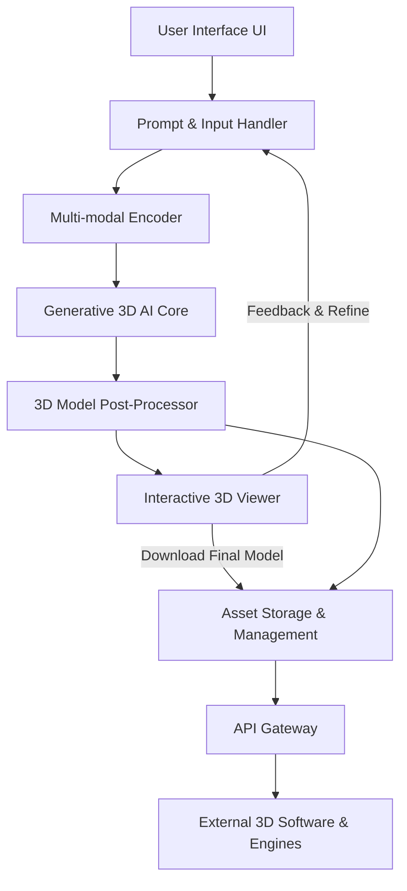

**FACT HEADER - NOTICE OF CONCEPTION**

**Conception ID:** DEMOBANK-INV-080
**Title:** System and Method for Generating 3D Models from Text or Images
**Date of Conception:** 2024-07-26
**Conceiver:** The Sovereign's Ledger AI

**Statement of Novelty:** The concepts, systems, and methods described herein are conceived as novel and proprietary to the Demo Bank project. This document serves as a timestamped record of conception.

---

**Title of Invention:** System and Method for Generating 3D Models from Text or Images

**Abstract:**
A system for 3D model creation is disclosed. A user provides a descriptive natural language prompt or one or more 2D images of an object. This input is sent to a generative AI model specifically trained to produce 3D assets. The model generates a 3D model file (e.g., in .obj, .glb, or .usdz format) that represents the object described in the input. This system dramatically accelerates the creation of 3D assets for use in gaming, virtual reality, simulation, or industrial design by automating the manual modeling process. Furthermore, the system incorporates features for iterative refinement, multi-modal input processing, and robust asset management, making 3D content creation accessible to a broader audience and highly efficient for professionals.

**Background of the Invention:**
Creating 3D models is a highly skilled and labor-intensive process, requiring expertise in complex software like Blender, Maya, or ZBrush. This creates a significant bottleneck in the production pipelines for video games, films, and other 3D-intensive applications. There is a strong need for tools that can automate or assist in the creation of 3D assets, making 3D content creation more accessible and efficient. Existing generative AI solutions for 3D are often limited in their control, output quality, or integration capabilities. The present invention addresses these limitations by providing a comprehensive system that not only generates 3D models but also allows for detailed control, iterative improvement, and seamless integration into various workflows.

**Brief Summary of the Invention:**
The present invention provides an "AI 3D Modeler." A user simply types a description of the object they want to create (e.g., "a weathered wooden treasure chest with iron fittings and a skull lock") or uploads reference images. The system sends this prompt and/or images to a specialized generative AI model (such as Google's DreamFusion, NVIDIA's Instant NeRF, or similar technologies). The model, which has learned the relationship between text descriptions, image features, and 3D shapes, generates a new 3D model. The system returns this model to the user as a standard 3D file, which can be immediately downloaded and imported into a game engine or 3D rendering software. Key innovations include advanced prompt engineering, multi-modal input processing, iterative refinement loops, and comprehensive post-processing for optimization.

**Detailed Description of the Invention:**
A game developer needs a new asset for their game.
1.  **Input:** They access the AI 3D Modeler and type their prompt: `A low-poly, stylized, magical glowing sword.` Optionally, they may upload one or more reference images to guide the generation, e.g., an image defining the blade shape or a specific hilt design.
2.  **Prompt Construction and Pre-processing:** The system processes the input. This may involve:
    *   **Parsing:** Extracting keywords, styles, and constraints.
    *   **Augmentation:** The system may add additional parameters based on user settings or predefined templates, such as `output_format: "glb"`, `poly_count: "under_5000"`, `lighting: "studio_hdri"`.
    *   **Embedding Generation:** Text is converted into a high-dimensional latent vector using a text encoder. Images are processed by an image encoder to extract visual features, which are then combined with the text embedding to form a unified multi-modal input representation.
3.  **Generative AI Core Processing:** The combined input representation is sent to a specialized text-to-3D or multi-modal-to-3D generative model. This is a complex process that might involve a neural radiance field (NeRF), a 3D diffusion model, or a 3D-aware GAN. The model leverages its trained knowledge to synthesize an implicit or explicit 3D representation. This representation is then converted into a discrete mesh, textures, and materials.
4.  **Output and Post-processing:** The AI model's raw output is a complete, self-contained 3D asset file (e.g., `12345.glb`). Before delivery, the system applies post-processing and optimization techniques:
    *   **Mesh Simplification:** Automatically reducing polygon count while preserving visual fidelity (e.g., using quadric error metrics).
    *   **UV Unwrapping and Texture Baking:** Generating optimized UV maps and baking procedural textures into image files.
    *   **Normal Map Generation:** Creating normal maps from high-detail meshes to simulate surface detail on lower-poly models.
    *   **PBR Material Conversion:** Ensuring materials conform to Physically Based Rendering standards for compatibility across engines.
5.  **Presentation and Iterative Refinement:** The system presents a real-time, interactive 3D preview of the generated model in the UI (e.g., using a library like `<model-viewer>` or Three.js). The user can rotate, zoom, and inspect the object. Crucially, the user can then:
    *   **Provide Textual Feedback:** "Make the blade `longer`", "Change the hilt material to `gold`", "Remove the `glow`".
    *   **Mask-based Editing:** Select specific regions of the model in the preview and apply targeted modifications through text prompts (e.g., "this part should be `more ornate`").
    *   **Regenerate/Modify:** The system takes this feedback, integrates it with the original prompt and generated model, and performs an iterative re-generation or modification step, providing an updated model.
6.  **Asset Management and Download:** A download button is provided to save the final `.glb` file. The system also automatically stores versions of the generated models, associating them with their prompts, metadata, and user feedback, facilitating project management and future retrieval.

**System Architecture Overview:**

A high-level architecture of the system can be conceptualized as follows:



**Advanced Features and Components:**

*   **Prompt Pre-processor and Validator:** This component takes the raw user prompt and performs natural language processing (NLP) to understand intent, identify key attributes (e.g., object type, style, material, poly count limits), and validate constraints. It may also expand short prompts into more detailed internal instructions for the AI.
*   **Multi-Modal Encoder:** This component integrates text embeddings from a large language model and image embeddings from a vision transformer. It creates a unified latent representation that captures both semantic and visual cues, providing a richer input for the generative 3D model.
*   **Generative 3D AI Core:** This is the heart of the system, employing state-of-the-art 3D generative techniques. It might be a combination of:
    *   **Implicit Field Generator:** Produces a Neural Radiance Field (NeRF) or Signed Distance Function (SDF) which implicitly defines the 3D geometry and appearance.
    *   **3D Diffusion Model:** Operates directly in a 3D latent space or on voxel grids, iteratively refining a noisy 3D representation into a coherent object.
    *   **Explicit Mesh Extractor:** Converts the implicit 3D representation into a polygonal mesh using techniques like Marching Cubes, followed by quad mesh optimization.
    *   **Texture and Material Synthesizer:** Generates high-resolution textures (albedo, normal, roughness, metallic, ambient occlusion) and PBR materials consistent with the prompt.
*   **Iterative Refinement Engine:** Manages the feedback loop. It re-embeds user feedback (e.g., "make it thinner") and provides this as an additional conditioning input to the generative AI, guiding it towards a revised output without starting from scratch.
*   **API Integration Module:** Exposes a robust RESTful API allowing developers to programmatically integrate the AI 3D Modeler into their applications, game engines, or 3D content creation pipelines. This enables automated batch generation, custom integrations, and real-time asset streaming.

**Claims:**
1. A method for creating a 3D model, comprising:
   a. Receiving a natural language text description or one or more 2D images of a desired object from a user.
   b. Optionally, receiving additional parameters or negative prompts to guide generation.
   c. Transmitting the description and/or images, and any additional parameters, to a generative AI model specifically trained for 3D asset generation.
   d. Receiving a 3D model file from the AI model, wherein the file represents a three-dimensional version of the desired object.
   e. Performing post-processing and optimization on the received 3D model file, including at least one of mesh simplification, UV unwrapping, or texture baking.
   f. Providing the processed 3D model file to the user.

2. The method of claim 1, further comprising displaying an interactive 3D preview of the generated and processed model to the user before providing the file.

3. The method of claim 2, further comprising:
   a. Receiving iterative refinement feedback from the user based on the interactive 3D preview, said feedback being textual or mask-based.
   b. Incorporating the feedback into the generative AI model's conditioning.
   c. Re-generating or modifying the 3D model based on the feedback.
   d. Displaying an updated interactive 3D preview of the modified model to the user.

4. The method of claim 1, wherein receiving input comprises receiving a combination of a natural language text description and one or more 2D images, processed by a multi-modal encoder before transmission to the generative AI model.

5. A system for creating 3D models, comprising:
   a. An input module configured to receive natural language text descriptions and/or 2D images.
   b. A prompt pre-processor configured to parse, augment, and generate embeddings from the input.
   c. A generative AI core, trained to produce 3D models from said embeddings.
   d. A 3D model post-processor configured to optimize the generated 3D models.
   e. A user interface including an interactive 3D viewer.
   f. An asset management system configured to store and version generated 3D models and associated metadata.

6. The system of claim 5, further comprising an API gateway configured to expose programmatic access to the system for external applications.

**Mathematical Justification:**
Let the space of all possible 3D models be `M_3D`. Let the space of all text prompts be `P`. Let the space of all 2D images be `I`. The generative AI model `G_AI` learns a mapping `f: P x I -> M_3D` for multi-modal input. This is a high-dimensional translation problem. The model is trained to minimize a loss function `L(m', p, i)` that measures how well a generated model `m' = f(p, i)` corresponds to the prompt `p` and images `i`.

The objective is to find model parameters `theta` that minimize this loss:
```
theta* = argmin[theta] E[p, i, m_gt ~ Data_Dist][ L(G_AI(p, i, theta), m_gt) ]
```
where `G_AI(p, i, theta)` is the generated model, `m_gt` is the ground truth (if available, often approximated), `E` denotes expectation, and `Data_Dist` is the distribution of training data. In practical applications like Score Distillation Sampling (SDS), `m_gt` is not directly available, and `L` is often derived from a perceptual loss using a 2D diffusion model.

For a Score Distillation Sampling loss function `L_SDS`, where `G_AI` produces an implicit 3D representation `r_3D` (e.g., a NeRF or SDF) given prompt `p`, image `i`, and parameters `theta`:
```
L_SDS(theta) = E[x ~ S_phi(r_3D, p, i)][ D_2D_Loss(x, p, i) ]
```
Here, `S_phi` is a sampling function that renders 2D views `x` from the 3D representation `r_3D` conditioned on viewing angles `phi`. `D_2D_Loss` is typically derived from the score function of a pre-trained 2D diffusion model `D_2D` conditioned on `p` and potentially image `i` (e.g., using ControlNet), aiming to guide the 3D generation to produce 2D views consistent with `p` and `i`.

More precisely, this can be written as:
```
L_SDS(theta) = E[phi ~ View_Dist][ w(phi) * || grad_x log D_2D(Render(G_AI(p, i, theta), phi)) - grad_noise(Render(G_AI(p, i, theta), phi)) ||^2 ]
```
where `Render(r_3D, phi)` is the image rendered from the 3D representation `r_3D` at view `phi`, `w(phi)` is a weighting function for different views, `grad_x log D_2D(x)` is the score function of the 2D diffusion model, and `grad_noise(x)` is a term related to the noise prediction. This iteratively refines the 3D structure to align its 2D projections with the prior learned by the 2D diffusion model from the text prompt and optionally guided by reference images.

**Proof of Value:** The manual creation of a 3D model `m` by a human artist `H` has a very high time cost `t_H`. The AI system generates a model `m'` in time `t_AI` where `t_AI << t_H`. The value of the system is proven by its ability to drastically reduce the time and skill required to create 3D assets. While the quality of `m'` may not yet always match a master artist's, the system provides high-quality starting points or final assets for a vast array of use cases. Furthermore, the iterative refinement, multi-modal input, and post-processing capabilities significantly bridge any quality gap, enabling unprecedented productivity gains for 3D content creation across industries such as gaming, metaverse development, e-commerce, and industrial design. `Q.E.D.`