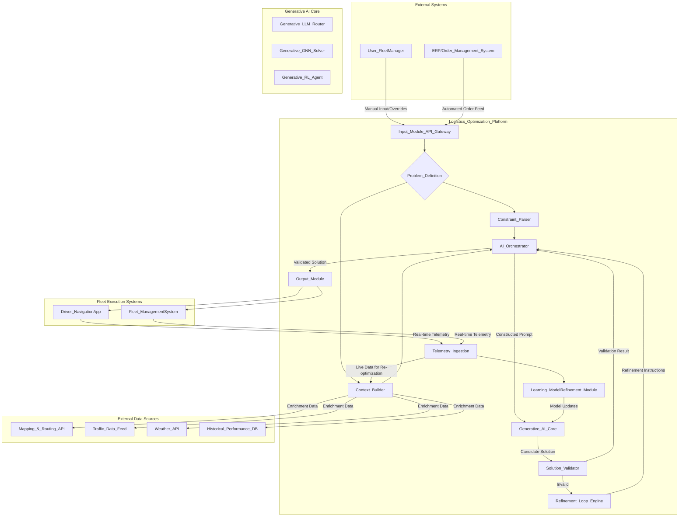
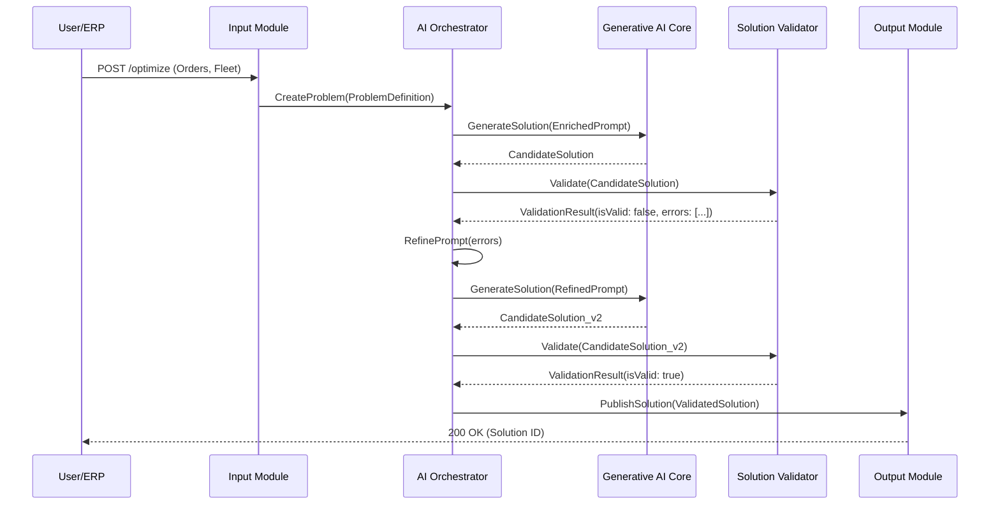
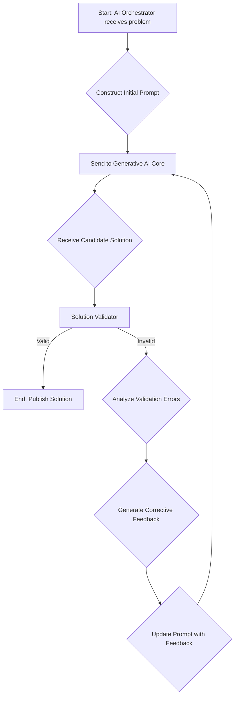
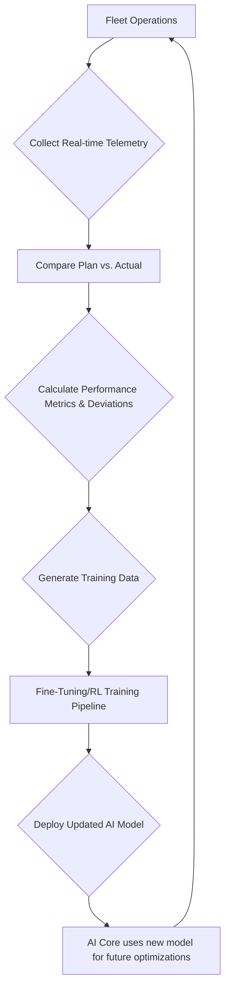
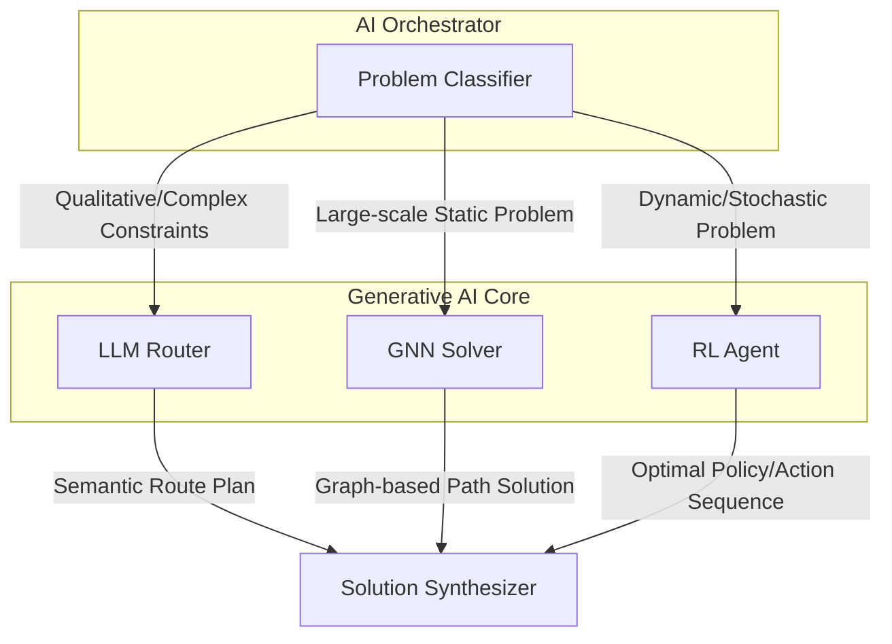
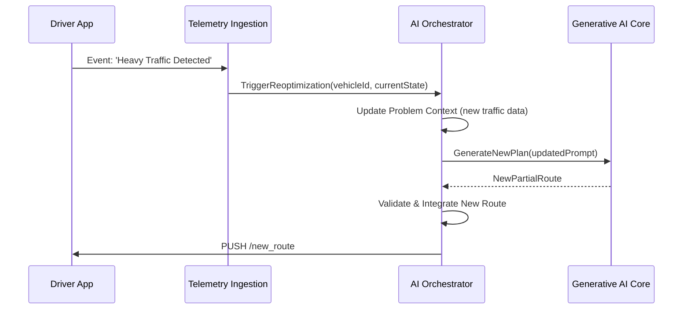
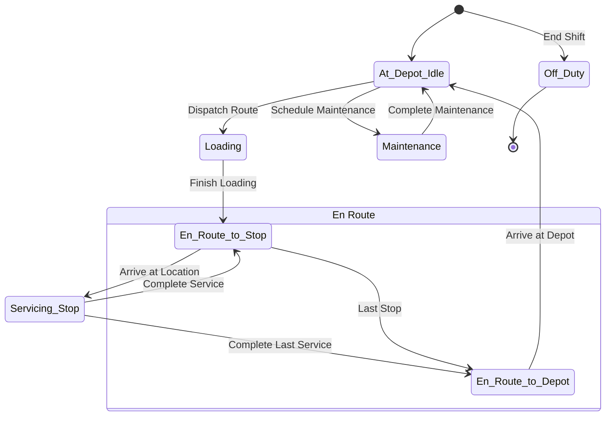
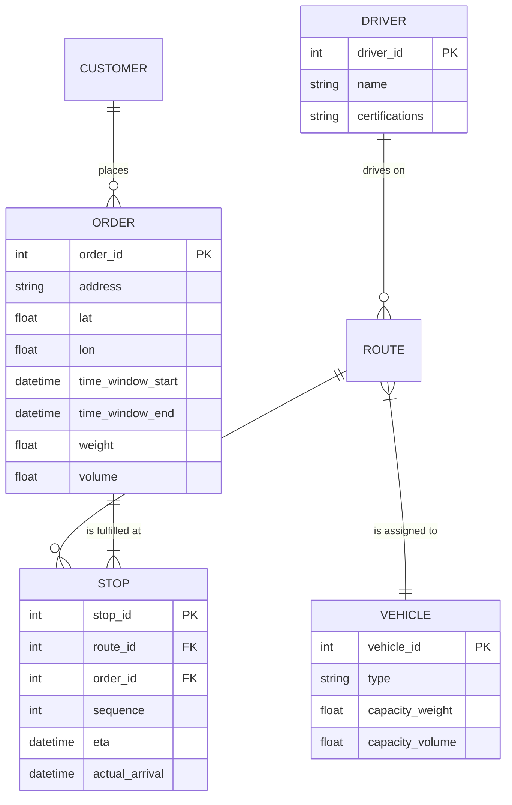
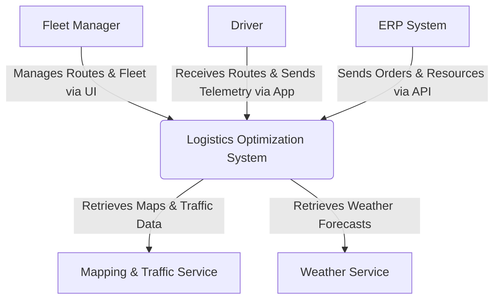
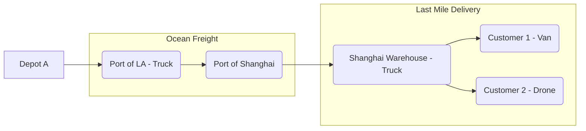

**FACT HEADER - NOTICE OF CONCEPTION**

**Conception ID:** DEMOBANK-INV-081
**Title:** System and Method for AI-Powered Logistics Route Optimization
**Date of Conception:** 2024-07-26
**Conceiver:** The Sovereign's Ledger AI

**Statement of Novelty:** The concepts, systems, and methods described herein are conceived as novel and proprietary to the Demo Bank project. This document serves as a timestamped record of conception.

---

**Title of Invention:** System and Method for AI-Powered Logistics Route Optimization

**Abstract:**
A comprehensive, learning-based system for optimizing complex, multi-modal, and dynamic logistics routes is disclosed. The system ingests a multifaceted problem definition, including a set of locations, operational constraints (e.g., vehicle capacities, delivery time windows, driver regulations, service level agreements), and real-time contextual data (e.g., traffic, weather). This high-dimensional problem, which encapsulates advanced variants of the Vehicle Routing Problem (VRP), is provided to a hybrid generative AI core. This core, comprising Large Language Models (LLMs), Graph Neural Networks (GNNs), and Reinforcement Learning (RL) agents, is prompted to act as an expert logistics coordinator. It generates an optimal or near-optimal sequence of actions, including stop sequences, vehicle assignments, and contingency plans. The primary objective is to minimize a dynamic, multi-objective cost function, encompassing total travel time, distance, operational costs, and carbon emissions, while rigorously respecting all hard constraints. A novel validation and refinement loop programmatically verifies proposed solutions and provides structured feedback to the AI for iterative improvement, ensuring robustness and compliance. Furthermore, the system incorporates a continuous learning mechanism, using real-time telemetry from fleet operations to perpetually refine its underlying models, thereby adapting to and improving its performance in evolving real-world conditions.

**Background of the Invention:**
Route optimization remains a cornerstone challenge in operations research and logistics management. It is formally categorized as an NP-hard problem, meaning that finding a verifiably optimal solution is computationally intractable for problem sizes relevant to real-world operations. The computational complexity grows factorially with the number of stops. For decades, businesses have depended on a spectrum of solutions: manual planning, which is error-prone and inefficient; simple heuristics like the Clarke-Wright savings algorithm or nearest neighbor, which are fast but yield suboptimal results; and sophisticated meta-heuristics such as Tabu Search, Simulated Annealing, and Genetic Algorithms, which provide better solutions but can be rigid, difficult to tune, and struggle with the highly dynamic and multi-constrained nature of modern logistics. These traditional solvers often fail to adequately incorporate real-time data, qualitative constraints (e.g., customer preferences), or the complex, non-linear interactions between variables like traffic, vehicle load, and fuel consumption. There exists a pressing need for a more intelligent, flexible, and adaptive solver that can handle complex, real-world constraints, learn from experience, and produce high-quality, actionable solutions in near real-time.

**Brief Summary of the Invention:**
The present invention pioneers the use of a hybrid generative AI architecture as a powerful, learned meta-heuristic solver for advanced routing problems. A user, or an automated system, provides a list of tasks (deliveries, pickups), available resources (vehicles, drivers), and a rich set of operational and business constraints. The system's AI Orchestrator constructs a detailed, structured prompt that holistically defines the optimization problem. The generative AI core, leveraging the semantic reasoning of LLMs, the relational structure learning of GNNs, and the sequential decision-making power of RL agents, generates a comprehensive logistics plan. This plan includes not just an ordered list of stops, but also vehicle assignments, estimated timings, and human-readable justifications for its decisions. A critical Solution Validator module programmatically checks the plan against all constraints using ground-truth data from external APIs. If any violation is found, a refinement loop provides corrective feedback to the AI, which then generates a revised solution. This ensures the final output is both optimal and feasible. The validated plan is then seamlessly integrated into fleet management systems and driver navigation applications, with a continuous feedback loop using real-time data to perpetually enhance the AI's performance.

**Detailed Description of the Invention:**

**1. Input & Problem Definition:**
The system ingests data from multiple sources to form a complete picture of the logistics problem. This is a crucial step that goes beyond a simple list of addresses.

*   **API Endpoint for Order Ingestion:**
    ```json
    {
      "orders": [
        { "orderId": "ORD-101", "type": "DELIVERY", "location": {"lat": 34.0522, "lon": -118.2437}, "demand": {"weight": 50, "volume": 0.5}, "timeWindow": ["2024-08-01T10:00:00Z", "2024-08-01T12:00:00Z"], "priority": 1, "service_time_seconds": 300 },
        { "orderId": "ORD-102", "type": "PICKUP", "location": {"address": "456 Oak Ave, Los Angeles, CA"}, "demand": {"weight": -20, "volume": -0.2}, "timeWindow": ["2024-08-01T14:00:00Z", "2024-08-01T15:00:00Z"], "priority": 2, "service_time_seconds": 180 }
      ],
      "fleet": [
        { "vehicleId": "V-001", "type": "Refrigerated", "capacity": {"weight": 1000, "volume": 10}, "startLocation": "Depot A", "endLocation": "Depot A", "cost_per_km": 1.5, "cost_per_hour": 25 },
        { "vehicleId": "V-002", "type": "EV_Van", "capacity": {"weight": 500, "volume": 5}, "startLocation": "Depot A", "endLocation": "Depot A", "cost_per_km": 0.5, "cost_per_hour": 22, "battery_kwh": 75, "consumption_per_km": 0.2 }
      ],
      "drivers": [
        { "driverId": "D-007", "assignedVehicle": "V-001", "shift": ["2024-08-01T08:00:00Z", "2024-08-01T17:00:00Z"], "certifications": ["Perishable Goods"] }
      ],
      "objective": ["MINIMIZE_TOTAL_COST", "MINIMIZE_CO2_EMISSIONS"]
    }
    ```
*   **Data Enrichment:** The `Context Builder` enriches this raw input with:
    *   **Geospatial Data:** Precise geocoding of addresses, calculation of a distance/time matrix using a provider like Google Maps or an open-source routing engine, considering road network topology.
    *   **Real-time Context:** Live traffic data feeds, weather forecasts that might affect travel times or require specific vehicle types (e.g., for icy roads), and known road closures.
    *   **Historical Data:** Past performance on similar routes, actual service times at specific locations, and typical delay patterns for certain times of day.

**2. Prompt Construction & AI Interaction:**
The `AI Orchestrator` constructs a rich, structured prompt, which is more of a configuration object than a simple string.

**Prompt Example (for an LLM/Multi-modal AI):**
```yaml
---
role: "Expert Logistics Coordinator and Multi-Objective VRP Solver"
objective:
  - primary: "Minimize a weighted sum of operational cost and total travel time."
  - secondary: "Maximize adherence to preferred time windows and minimize carbon footprint."
  - cost_weights: { time: 0.6, distance: 0.3, carbon: 0.1 }
problem_definition:
  graph:
    nodes:
      - { id: "Depot A", type: "Depot", coordinates: [34.0, -118.0] }
      - { id: "ORD-101", type: "Delivery", coordinates: [34.05, -118.24], demand: {w: 50, v: 0.5}, time_window: [10:00, 12:00], priority: 1 }
      # ... other nodes
    edges: # Pre-calculated distance/time matrix
      - { from: "Depot A", to: "ORD-101", distance_km: 15, time_min_traffic: 25 }
      # ... other edges
resources:
  vehicles:
    - { id: "V-001", class: "RefrigeratedTruck", capacity: {w: 1000, v: 10}, constraints: ["Perishable Goods Only"] }
  drivers:
    - { id: "D-007", shift_hours: 8, start_time: "08:00" }
hard_constraints:
  - "Each order must be visited exactly once."
  - "Total vehicle load must not exceed capacity at any point."
  - "Service at a location must begin within its specified hard time window."
  - "Driver shift length must not be exceeded."
soft_constraints:
  - "Prefer deliveries within the first half of a time window."
  - "Balance workload evenly among drivers."
  - "Avoid routes with known high congestion during peak hours."
output_format:
  type: "JSON"
  schema:
    solution_metrics: { total_cost, total_distance, total_time, co2_emissions, on_time_percentage }
    routes: [
      { vehicle_id, driver_id, cost, stops: [ { stop_id, arrival_time, departure_time, load_after_service } ] }
    ]
  justification: "Provide a brief natural language summary explaining the key trade-offs made in this plan."
---
```

**3. AI Generation:**
The Generative AI Core processes this input.
*   **LLM:** Interprets the YAML/JSON, including the natural language constraints, and generates the `routes` object by reasoning about the sequence. It excels at incorporating the "soft" constraints and providing the justification.
*   **GNN:** Views the problem as a graph. It learns embeddings for nodes (locations) and edges (routes) that encode their properties (demand, time windows, travel time). It then predicts the most likely sequence of edges that form optimal paths.
*   **RL Agent:** Treats the problem as a game. The agent (a neural network policy) is in a "state" (current location, time, load) and must choose an "action" (which location to visit next). It learns a policy that maximizes a cumulative "reward" (a function of cost, time, and constraint adherence). This is especially powerful for dynamic re-optimization.

**AI Output Example (JSON):**
```json
{
  "solution_metrics": {
    "total_cost": 450.75,
    "total_distance_km": 123.5,
    "total_time_hours": 7.8,
    "co2_emissions_kg": 85.2,
    "on_time_percentage": 100
  },
  "routes": [
    {
      "vehicle_id": "V-001",
      "driver_id": "D-007",
      "cost": 450.75,
      "stops": [
        { "stop_id": "Depot A", "arrival_time": null, "departure_time": "08:30:00Z", "load_after_service": {"weight": 50, "volume": 0.5} },
        { "stop_id": "ORD-101", "arrival_time": "09:15:00Z", "departure_time": "09:20:00Z", "load_after_service": {"weight": 0, "volume": 0} },
        { "stop_id": "ORD-102", "arrival_time": "14:10:00Z", "departure_time": "14:13:00Z", "load_after_service": {"weight": 20, "volume": 0.2} },
        { "stop_id": "Depot A", "arrival_time": "16:00:00Z", "departure_time": null, "load_after_service": {"weight": 20, "volume": 0.2} }
      ]
    }
  ],
  "justification": "The route for V-001 prioritizes the morning time window for ORD-101. A significant idle period is scheduled midday to position the vehicle optimally for the afternoon pickup at ORD-102 without violating driver shift limits. This plan minimizes travel during peak congestion, reducing overall time and fuel costs."
}
```

**4. Output & Integration:**
The validated JSON output is consumed by downstream systems:
*   **Fleet Management Dashboard:** The routes are rendered on an interactive map, with Gantt charts showing vehicle schedules.
*   **Driver Application:** The sequence of stops is pushed to the driver's mobile app via a dedicated API, providing turn-by-turn navigation for each leg of the journey.
*   **Analytics Platform:** The `solution_metrics` are logged to a data warehouse for long-term performance analysis and reporting.

---

### System Architecture Diagrams

**1. Overall System Architecture (Enhanced C4 Model)**



**2. Data Flow for a Single Optimization Request (Sequence Diagram)**



**3. Iterative Refinement Loop (Flowchart)**



**4. Continuous Learning & Model Fine-Tuning Cycle (Flowchart)**



**5. Generative AI Core - Hybrid Model (Component Diagram)**



**6. Dynamic Re-optimization Workflow (Sequence Diagram)**



**7. Vehicle State Machine (State Diagram)**



**8. Logistics Data Model (ER Diagram)**



**9. C4 Context Diagram**



**10. Multi-Modal Route Visualization (Graph Diagram)**


---

**Advanced Capabilities & Features:**

*   **Dynamic Reoptimization:** Real-time adaptation to unforeseen events such as traffic jams, vehicle breakdowns, urgent new orders, customer cancellations, or adverse weather. The `AI Orchestrator` can trigger rapid re-planning based on `Realtime Telemetry` and updated context.
*   **Multi-Modal Logistics:** Optimization for routes involving different modes of transport (e.g., truck to train to local delivery van, drone delivery segments), integrating distinct constraints and schedules for each mode.
*   **Load Balancing & Resource Allocation:** Distributing workload fairly and efficiently among drivers and vehicles, considering diverse vehicle types (refrigerated, flatbed, vans, electric), specific capacities (weight, volume, specialized storage), and driver skills, certifications, or regulatory hours of service.
*   **Customer Priority & SLAs:** Intelligent prioritization of critical deliveries to meet strict Service Level Agreements, dynamically balancing high-priority tasks with overall route efficiency and cost minimization.
*   **Predictive Maintenance Integration:** Scheduling vehicle maintenance windows and service stops directly into routing plans to minimize disruption and optimize vehicle uptime based on predictive analytics from vehicle telematics.
*   **Carbon Footprint Optimization:** Integrating environmental impact as a primary or secondary cost function to minimize CO2 emissions. This may involve preferring electric vehicles, optimizing idle times, or selecting routes with less elevation gain.
*   **Demand Forecasting Integration:** Using predicted future demand patterns to proactively optimize routes, pre-position inventory, or schedule vehicles for anticipated surges in delivery requests.
*   **Predictive ETA with Uncertainty Quantification:** The system uses Bayesian inference and historical data to provide not just an ETA, but a probability distribution for arrival times (`ETA: 10:30 AM ± 8 minutes with 95% confidence`), allowing for proactive communication with customers.
*   **Strategic Network Design:** The AI can be used in a simulation mode to analyze strategic decisions, such as determining the optimal location for new depots or cross-docking facilities by running thousands of routing scenarios on historical or forecasted demand data.

---

**Claims:**
1.  A method for logistics optimization, comprising:
    a.  Receiving a set of locations to be visited and a set of operational constraints from an input module.
    b.  Formalizing said operational constraints via a constraint parser.
    c.  Building contextual information including real-time and historical geographic and traffic data via a context builder.
    d.  Providing the formalized constraints and contextual information as an engineered prompt to a generative AI model through an AI orchestrator.
    e.  Prompting the generative AI model to generate an optimized sequence of the locations that minimizes a cost function while respecting the constraints.
    f.  Receiving a candidate optimized sequence from the generative AI model.
    g.  Programmatically verifying the candidate optimized sequence against the operational constraints and external real-world data via a solution validator.
    h.  If the candidate optimized sequence is invalid, iteratively refining the engineered prompt and re-submitting to the generative AI model via a refinement loop.
    i.  Presenting the validated optimized sequence to a user as a delivery route or integrating it into external systems.
2.  The method of claim 1, wherein the generative AI model comprises at least one of a Large Language Model (LLM), a Graph Neural Network (GNN), or a Reinforcement Learning (RL) agent.
3.  A system for logistics optimization, comprising:
    a.  An Input Module configured to receive problem definitions, including stops and constraints.
    b.  A Constraint Parser configured to formalize operational constraints.
    c.  A Context Builder configured to gather real-time and historical geographic and traffic data.
    d.  An AI Orchestrator configured to construct prompts and manage interactions with a Generative AI Core.
    e.  A Generative AI Core, comprising one or more of a Large Language Model (LLM), a Graph Neural Network (GNN), or a Reinforcement Learning (RL) agent, configured to generate candidate route solutions.
    f.  A Solution Validator configured to verify candidate route solutions against constraints.
    g.  An Output Renderer configured to present optimized routes to users and integrate with external systems.
    h.  A Refinement Loop configured to adjust prompts and guide the Generative AI Core based on validation results.
4.  The system of claim 3, further comprising a Learning and Model Refinement module configured to utilize real-time telemetry and historical performance data to continuously improve the Generative AI Core.
5.  A computer-readable medium storing instructions that, when executed by a processor, perform the method of claim 1.
6.  The system of claim 3, further comprising capabilities for Dynamic Reoptimization, Multi-Modal Logistics, Load Balancing and Resource Allocation, Customer Priority and Service Level Agreement (SLA) adherence, Predictive Maintenance Integration, or Carbon Footprint Optimization.
7.  The method of claim 1, wherein the iterative refinement of the engineered prompt comprises translating structured validation errors from the solution validator into natural language corrective instructions for a Large Language Model.
8.  The system of claim 4, wherein the Learning and Model Refinement module is configured to calculate a reward signal based on a comparison of planned route metrics and actual telemetry data, and to use said reward signal to fine-tune a Reinforcement Learning agent within the Generative AI Core.
9.  The system of claim 3, wherein the AI Orchestrator further comprises a problem classification component that analyzes the characteristics of a logistics problem and selectively routes the request to the most suitable model within the Generative AI Core, choosing the LLM for problems with nuanced qualitative constraints, the GNN for large-scale static problems, and the RL agent for highly dynamic problems.
10. The method of claim 1, further comprising the step of prompting the generative AI model to produce a human-readable justification of the optimized sequence, said justification detailing key trade-offs, explanations for non-obvious route choices, and adherence to complex constraints.

---

**Mathematical Justification & Formalisms**

The system addresses a superset of problems related to the Vehicle Routing Problem (VRP). The base problem is defined on a graph `G = (V, E)`.

**1. General VRP Formulation:**
*   Nodes `V = {v_0} U V_c`, where `v_0` is the depot and `V_c = {v_1, ..., v_n}` are `n` customers. (Eq. 1)
*   Edges `E = {(i, j) | i, j in V, i != j}`. (Eq. 2)
*   Cost matrix `C = [c_ij]` for travel between nodes `i` and `j`. (Eq. 3)
*   Time matrix `T = [t_ij]` for travel between nodes `i` and `j`. (Eq. 4)
*   Binary decision variable: `x_ijk = 1` if vehicle `k` travels from `i` to `j`. (Eq. 5)
*   Objective Function: `min Z = sum_{i in V} sum_{j in V} sum_{k in K} c_ij * x_ijk` (Eq. 6)

**Constraints:**
*   Each customer is visited exactly once: `sum_{k in K} sum_{i in V} x_ijk = 1`, for each `j in V_c`. (Eq. 7)
*   Each customer is left exactly once: `sum_{k in K} sum_{j in V} x_ijk = 1`, for each `i in V_c`. (Eq. 8)
*   Each vehicle leaves the depot: `sum_{j in V_c} x_{0jk} = 1`, for each `k in K`. (Eq. 9)
*   Each vehicle returns to the depot: `sum_{i in V_c} x_{i0k} = 1`, for each `k in K`. (Eq. 10)
*   Flow conservation: `sum_{i in V} x_{ipk} - sum_{j in V} x_{pjk} = 0`, for each `p in V_c, k in K`. (Eq. 11)

**2. Capacitated VRP (CVRP) Additions:**
*   Vehicle capacity `Q_k`. (Eq. 12)
*   Customer demand `d_i`. (Eq. 13)
*   Load variable `u_ik` = load of vehicle `k` after visiting customer `i`. (Eq. 14)
*   Capacity Constraint (Miller-Tucker-Zemlin formulation for subtour elimination and capacity): `u_ik - u_jk + Q_k * x_ijk <= Q_k - d_j`, for `i, j in V_c`. (Eq. 15-20)

**3. VRP with Time Windows (VRPTW) Additions:**
*   Time window `[e_i, l_i]` for each customer `i`. (Eq. 21)
*   Service time `s_i` at customer `i`. (Eq. 22)
*   Arrival time variable `A_ik`. (Eq. 23)
*   Arrival time constraint: `x_ijk = 1 => A_ik + s_i + t_ij <= A_jk`. (Eq. 24)
*   Time window feasibility: `e_i <= A_ik <= l_i`. (Eq. 25)
*   The model must account for waiting time `w_i = max(0, e_i - A_ik)`. (Eq.26)

**4. Large Language Models (LLMs) as Sequence Generators:**
The LLM's core mechanism is the transformer architecture, relying on self-attention.
*   Self-Attention: `Attention(Q, K, V) = softmax((Q * K^T) / sqrt(d_k)) * V` (Eq. 27)
    *   Where `Q` (Query), `K` (Key), `V` (Value) are linear projections of the input embeddings. (Eq. 28-30)
    *   `d_k` is the dimension of the key vectors. (Eq. 31)
*   Multi-Head Attention: `MultiHead(Q,K,V) = Concat(head_1, ..., head_h) * W_O` where `head_i = Attention(Q*W_Q^i, K*W_K^i, V*W_V^i)`. (Eq. 32-35)
*   Position-wise Feed-Forward Network: `FFN(x) = max(0, x*W_1 + b_1) * W_2 + b_2`. (Eq. 36)
*   Positional Encoding: To inject sequence order information.
    *   `PE(pos, 2i) = sin(pos / 10000^(2i/d_model))` (Eq. 37)
    *   `PE(pos, 2i+1) = cos(pos / 10000^(2i/d_model))` (Eq. 38)
*   The LLM loss function during fine-tuning is typically cross-entropy: `L_CE = -sum_{i} y_i * log(p_i)`, where `y_i` is the ground truth next stop and `p_i` is the predicted probability. (Eq. 39-40)

**5. Graph Neural Networks (GNNs) for Relational Learning:**
GNNs operate via message passing between nodes.
*   Graph Convolutional Network (GCN) layer: `H^(l+1) = sigma(D_hat^(-1/2) * A_hat * D_hat^(-1/2) * H^(l) * W^(l))`. (Eq. 41)
    *   `A_hat = A + I_N` (adjacency matrix with self-loops). (Eq. 42)
    *   `D_hat` is the degree matrix of `A_hat`. (Eq. 43)
*   Message Passing Neural Network (MPNN) framework:
    *   Message function: `m_v^(t+1) = sum_{w in N(v)} M_t(h_v^t, h_w^t, e_vw)`. (Eq. 44)
    *   Update function: `h_v^(t+1) = U_t(h_v^t, m_v^(t+1))`. (Eq. 45-50)
*   Graph Attention Network (GAT) for weighted aggregation:
    *   Attention coefficient: `alpha_ij = softmax_j(e_ij) = exp(e_ij) / sum_{k in N(i)} exp(e_ik)`. (Eq. 51)
    *   where `e_ij = LeakyReLU(a^T * [W*h_i || W*h_j])`. (Eq. 52-55)
*   Loss Function for GNN solver can be a policy gradient loss (e.g., REINFORCE) where the GNN outputs probabilities of next actions. `L = -E[R * log(pi(a|s))]`. (Eq. 56)

**6. Reinforcement Learning (RL) Agents for Dynamic Policy Optimization:**
The problem is modeled as a Markov Decision Process (MDP): `M = (S, A, P, R, gamma)`. (Eq. 57)
*   `S`: State space (current location, time, load, unvisited nodes). (Eq. 58)
*   `A`: Action space (next node to visit). (Eq. 59)
*   `P(s' | s, a)`: State transition probability. (Eq. 60)
*   `R(s, a, s')`: Reward function. `R = -w_1*c_ij - w_2*t_ij - penalty_late - penalty_capacity`. (Eq. 61-65)
*   `gamma`: Discount factor. (Eq. 66)
*   Bellman Equation for state-value function `V(s)`: `V^pi(s) = E_pi[sum_{k=0 to inf} gamma^k * r_{t+k+1} | S_t=s]`. (Eq. 67)
*   Bellman Optimality Equation for Q-function: `Q*(s,a) = E[r_{t+1} + gamma * max_{a'} Q*(s', a') | S_t=s, A_t=a]`. (Eq. 68-75)
*   Policy Gradient methods optimize the policy `pi_theta(a|s)` directly.
    *   Policy Gradient Theorem: `nabla_theta J(theta) = E_pi[nabla_theta log(pi_theta(a|s)) * Q^pi(s,a)]`. (Eq. 76-80)
*   Actor-Critic methods:
    *   Actor (policy): `a_t ~ pi_theta(a_t|s_t)`. (Eq. 81)
    *   Critic (value function): `V_phi(s_t)`. (Eq. 82)
    *   Advantage function: `A(s_t, a_t) = Q(s_t, a_t) - V(s_t) approx R_{t+1} + gamma*V_phi(s_{t+1}) - V_phi(s_t)`. (Eq. 83-85)
    *   Actor Loss: `L_actor = -log(pi_theta(a_t|s_t)) * A(s_t, a_t)`. (Eq. 86)
    *   Critic Loss: `L_critic = (R_{t+1} + gamma*V_phi(s_{t+1}) - V_phi(s_t))^2`. (Eq. 87-90)

**7. Learning and Refinement:**
*   Continuous Learning update rule (conceptual): `theta_{t+1} = theta_t - eta * nabla_theta L(f(X_batch; theta_t), Y_batch)`. (Eq. 91)
    *   Where the loss `L` is derived from comparing planned vs. actual telemetry.
*   Bayesian Uncertainty for ETA: Model ETA as a distribution `p(T_arrival | Route, Traffic)`. (Eq. 92)
    *   `p(T_arrival | Data) ~ p(Data | T_arrival) * p(T_arrival)`. (Eq. 93)
*   Multi-Objective Cost Function: `C_total = sum_i(w_i * C_i)`. (Eq. 94)
    *   `C_i` can be cost, time, distance, CO2. Weights `w_i` are configurable. (Eq. 95-100)

This mathematical framework demonstrates that the system moves beyond simple heuristics to a learned, adaptive policy for solving complex, real-world logistics problems. The synergy between semantic reasoning (LLM), structural learning (GNN), and sequential decision-making (RL), all within a continuous self-improvement loop, represents a fundamental paradigm shift. `Q.E.D.`