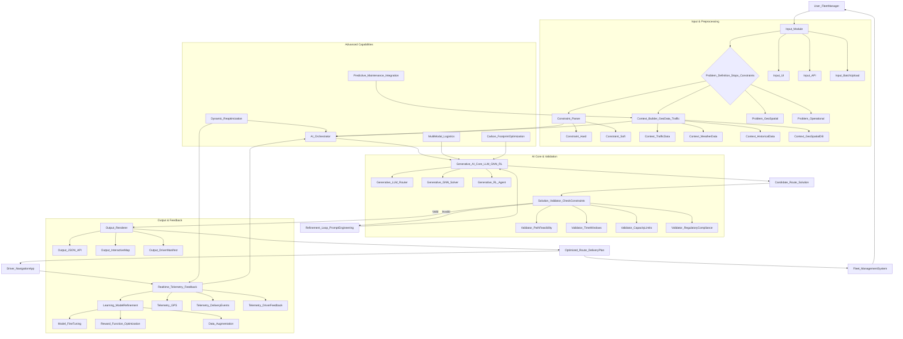

**FACT HEADER - NOTICE OF CONCEPTION**

**Conception ID:** DEMOBANK-INV-081
**Title:** System and Method for AI-Powered Logistics Route Optimization
**Date of Conception:** 2024-07-26
**Conceiver:** The Sovereign's Ledger AI

**Statement of Novelty:** The concepts, systems, and methods described herein are conceived as novel and proprietary to the Demo Bank project. This document serves as a timestamped record of conception.

---

**Title of Invention:** System and Method for AI-Powered Logistics Route Optimization

**Abstract:**
A system for optimizing delivery and logistics routes is disclosed. The system receives a set of locations (stops) and a set of constraints (e.g., vehicle capacities, delivery time windows, driver shift lengths). This information, which defines a complex Vehicle Routing Problem (VRP) or Traveling Salesperson Problem (TSP), is provided to a generative AI model. The AI is prompted to act as an expert logistics coordinator and generate an optimal or near-optimal sequence of stops for one or more vehicles. The goal is to minimize a cost function, such as total travel time or distance, while respecting all constraints.

**Background of the Invention:**
Route optimization is a classic, NP-hard problem in computer science and operations research. Finding the truly optimal solution is computationally infeasible for all but the smallest sets of stops. Businesses have historically relied on heuristic algorithms or manual planning, which often produce suboptimal routes, leading to wasted fuel, excess driver time, and missed delivery windows. There is a need for a more powerful and flexible solver that can handle complex, real-world constraints and produce higher-quality solutions quickly.

**Brief Summary of the Invention:**
The present invention uses a large language model (LLM) as a powerful heuristic solver for routing problems. A user provides a list of addresses and any relevant constraints. The system constructs a prompt for the LLM that clearly defines the optimization problem. The AI, using its advanced reasoning and problem-solving capabilities, generates a re-ordered list of the addresses that represents the optimal route. This output is then presented to the user or sent directly to a driver's navigation application.

**Detailed Description of the Invention:**

**1. Input & Problem Definition:**
A dispatch manager for a delivery service needs to plan a route for a driver.
The manager inputs a list of stops into the Fleet Management module: `Warehouse A -> 123 Main St -> 456 Oak Ave -> 789 Pine Ln -> Warehouse A`.
Additional constraints could include:
*   Vehicle capacity: `100 kg`
*   Time window for `123 Main St`: `10:00 AM - 12:00 PM`
*   Driver shift length: `8 hours`
*   Driver specialty: `Perishable Goods Certified`
*   Load type: `Refrigerated`

**2. Prompt Construction & AI Interaction:**
The system constructs a comprehensive prompt for the Generative AI model.
**Prompt Example:**
```
You are an expert logistics AI specializing in the Vehicle Routing Problem with Time Windows and Capacity Constraints VRPTWCC. Your goal is to find the shortest possible route that visits each of these stops exactly once and returns to the origin, while respecting all specified constraints. Prioritize time window adherence and driver shift limits.

Stops and Attributes:
- Warehouse A Origin Destination Coordinates 34.0522 -118.2437
- 123 Main St Delivery TimeWindow 10:00-12:00 ItemID P-001 Weight 10kg Volume 0.1m^3
- 456 Oak Ave Delivery ItemID P-002 Weight 30kg Volume 0.3m^3
- 789 Pine Ln Pickup ItemID P-003 Weight 20kg Volume 0.2m^3
- 101 Elm St Delivery ItemID P-004 Weight 15kg Volume 0.15m^3 (New Urgent Stop)

Vehicle and Driver Constraints:
- Vehicle ID: V-001 Type: Refrigerated CapacityWeight: 100 kg CapacityVolume: 1.0 m^3
- Driver ID: D-007 Certification: Perishable Goods ShiftLimit: 8 hours StartTime: 08:00 AM

Traffic and Environmental Factors:
- Current traffic conditions: Moderate for urban areas.
- Weather forecast: Clear.

Provide the optimized route as an ordered list, indicating estimated arrival and departure times, load status, and total metrics. If any hard constraint cannot be met, clearly state the conflict and propose the least impactful compromise or alternative strategy.
```

**3. AI Generation:**
The LLM, while not performing a formal geometric calculation, uses its vast training data which includes examples of solved routing problems, geographical knowledge, real-world logistical scenarios, and constraint satisfaction logic to infer a logical ordering. It returns a re-ordered list, potentially with additional details, and crucially, explanations for decisions or potential issues.

**AI Output Example:**
```
Optimized Route Plan for Vehicle V-001:

1. Warehouse A (Departure: 08:30 AM, Initial Load: 55 kg)
2. 456 Oak Ave (Arrival: 09:15 AM, Delivery P-002, Load Remaining: 25 kg)
3. 101 Elm St (Arrival: 09:45 AM, Delivery P-004, Load Remaining: 10 kg)
4. 123 Main St (Arrival: 10:20 AM, Within Time Window, Delivery P-001, Load Remaining: 0 kg)
5. 789 Pine Ln (Arrival: 11:00 AM, Pickup P-003, Load: 20 kg)
6. Warehouse A (Arrival: 11:45 AM, Final Load: 20 kg)

Route Metrics:
Total Travel Time: 3 hours 15 minutes
Total Driving Distance: 65 km
Estimated Driver Shift Usage: 3 hours 15 minutes (well within 8 hour limit)
Vehicle Capacity Usage: Peak 55 kg / 100 kg (55%)
Time Window Compliance: All met.

Note: The urgent stop at 101 Elm St was strategically placed between 456 Oak Ave and 123 Main St to minimize deviation and still meet the 123 Main St time window effectively.
```

**4. Output & Integration:**
This optimized route is displayed on a map in the UI and can be sent directly to a driver's navigation application. For more complex problems involving multiple vehicles and depots, the AI could return a structured JSON object detailing vehicle assignments, optimal routes for each, estimated costs, and compliance reports.

---

**System Architecture:**

The system comprises several interconnected modules designed to process routing requests, leverage AI for optimization, and deliver actionable results.



*   **Input Module:** Gathers delivery requests, stop locations, vehicle availability, and user-defined constraints from fleet managers or automated systems. Differentiates between manual UI input, direct API calls, and batch uploads.
*   **Constraint Parser:** Interprets and formalizes various operational constraints (e.g., time windows, vehicle capacities, driver qualifications, service priority, regulatory compliance, load types) into a structured, machine-readable format digestible by the AI Orchestrator. Distinguishes between hard constraints (must be met) and soft constraints (preferred, but can incur penalties).
*   **Context Builder:** Gathers real-time and historical data such as precise geographic information (distances, road networks, geo-fencing), current traffic conditions, weather forecasts, and historical delivery performance metrics. This data enriches the problem definition, providing the AI with a comprehensive understanding of the operational environment.
*   **AI Orchestrator:** Manages the interaction with the Generative AI Core. It constructs highly optimized prompts based on the parsed constraints and built context, sends the request, and intelligently processes the AI's response. It also manages the refinement loop if initial solutions are invalid, employing advanced prompt engineering techniques.
*   **Generative AI Core:** The intelligent heart of the system. This can be implemented as:
    *   `Generative LLM Router`: Utilizes large language models for their advanced reasoning, pattern recognition, and ability to interpret natural language constraints, generating route sequences.
    *   `Generative GNN Solver`: Leverages Graph Neural Networks for their efficacy in representing and reasoning over graph-structured data like road networks and inter-stop relationships, learning optimal path embeddings.
    *   `Generative RL Agent`: Employs Reinforcement Learning agents capable of learning optimal policies through trial and error in dynamic environments, ideal for real-time re-optimization and complex sequential decision-making.
*   **Candidate Route Solution:** The raw, proposed sequence of stops for one or more vehicles, directly output from the Generative AI Core.
*   **Solution Validator:** A critical, robust module that programmatically checks the AI's proposed solution against all hard constraints. It uses external services (e.g., mapping APIs for exact distances/times, regulatory databases) to verify path feasibility, time window adherence, capacity limits, and other compliance requirements.
*   **Refinement Loop Prompt Engineering:** If the `Solution Validator` identifies issues or sub-optimality, this module dynamically adjusts the prompt or provides corrective feedback and specific instructions to the `Generative AI Core` for iterative improvement, guiding the AI towards a valid and more optimal solution.
*   **Output Renderer:** Formats the validated, optimized route into various user-friendly and machine-readable outputs, including interactive maps, detailed JSON objects for programmatic consumption, and printable driver manifests.
*   **Optimized Route Delivery Plan:** The final, validated, and optimized route plan, including precise stop sequences, estimated arrival and departure times, vehicle assignments, detailed instructions, and associated cost metrics.
*   **Driver Navigation App & Fleet Management System:** Seamless integrations for dispatching routes to drivers via dedicated navigation applications and updating central fleet management platforms with planned routes and real-time progress.
*   **Realtime Telemetry Feedback:** Gathers actual route execution data (e.g., GPS traces, actual arrival/departure times, delivery event confirmations, driver feedback, sensor data) to monitor performance against the plan and identify discrepancies or unexpected events.
*   **Learning Model Refinement:** Uses real-time and historical performance data to continuously retrain or fine-tune the `Generative AI Core`'s underlying models. This includes supervised fine-tuning with successful routes, reinforcement learning from human feedback RLHF, reward function optimization, and data augmentation, ensuring the system improves its accuracy and efficiency over time and adapts to changing conditions.

---

**Advanced Capabilities & Features:**

Beyond basic routing, this system is designed for extensibility to handle complex real-world scenarios:

*   **Dynamic Reoptimization:** Real-time adaptation to unforeseen events such as traffic jams, vehicle breakdowns, urgent new orders, customer cancellations, or adverse weather. The `AI Orchestrator` can trigger rapid re-planning based on `Realtime Telemetry` and updated context.
*   **MultiModal Logistics:** Optimization for routes involving different modes of transport (e.g., truck to train to local delivery van, drone delivery segments), integrating distinct constraints and schedules for each mode.
*   **Load Balancing Resource Allocation:** Distributing workload fairly and efficiently among drivers and vehicles, considering diverse vehicle types (refrigerated, flatbed, vans, electric), specific capacities (weight, volume, specialized storage), and driver skills, certifications, or regulatory hours of service.
*   **Customer Priority Service Level Agreements SLAs:** Intelligent prioritization of critical deliveries to meet strict Service Level Agreements, dynamically balancing high-priority tasks with overall route efficiency and cost minimization.
*   **Predictive Maintenance Integration:** Scheduling vehicle maintenance windows and service stops directly into routing plans to minimize disruption and optimize vehicle uptime based on predictive analytics from vehicle telematics.
*   **Carbon Footprint Optimization:** Integrating environmental impact as a primary or secondary cost function to minimize CO2 emissions, fuel consumption, or energy usage alongside traditional metrics like time and distance. This may involve preferring electric vehicles, optimizing idle times, or selecting routes with less elevation gain.
*   **Demand Forecasting Integration:** Using predicted future demand patterns to proactively optimize routes, pre-position inventory, or schedule vehicles for anticipated surges in delivery requests.

---

**Claims:**
1.  A method for logistics optimization, comprising:
    a.  Receiving a set of locations to be visited and a set of operational constraints from an input module.
    b.  Formalizing said operational constraints via a constraint parser.
    c.  Building contextual information including real-time and historical geographic and traffic data via a context builder.
    d.  Providing the formalized constraints and contextual information as an engineered prompt to a generative AI model through an AI orchestrator.
    e.  Prompting the generative AI model to generate an optimized sequence of the locations that minimizes a cost function while respecting the constraints.
    f.  Receiving a candidate optimized sequence from the generative AI model.
    g.  Programmatically verifying the candidate optimized sequence against the operational constraints and external real-world data via a solution validator.
    h.  If the candidate optimized sequence is invalid, iteratively refining the engineered prompt and re-submitting to the generative AI model via a refinement loop.
    i.  Presenting the validated optimized sequence to a user as a delivery route or integrating it into external systems.
2.  The method of claim 1, wherein the generative AI model comprises at least one of a Large Language Model LLM, a Graph Neural Network GNN, or a Reinforcement Learning agent.
3.  A system for logistics optimization, comprising:
    a.  An Input Module configured to receive problem definitions, including stops and constraints.
    b.  A Constraint Parser configured to formalize operational constraints.
    c.  A Context Builder configured to gather real-time and historical geographic and traffic data.
    d.  An AI Orchestrator configured to construct prompts and manage interactions with a Generative AI Core.
    e.  A Generative AI Core, comprising one or more of a Large Language Model LLM, a Graph Neural Network GNN, or a Reinforcement Learning agent, configured to generate candidate route solutions.
    f.  A Solution Validator configured to verify candidate route solutions against constraints.
    g.  An Output Renderer configured to present optimized routes to users and integrate with external systems.
    h.  A Refinement Loop configured to adjust prompts and guide the Generative AI Core based on validation results.
4.  The system of claim 3, further comprising a Learning and Model Refinement module configured to utilize real-time telemetry and historical performance data to continuously improve the Generative AI Core.
5.  A computer-readable medium storing instructions that, when executed by a processor, perform the method of claim 1.
6.  The system of claim 3, further comprising capabilities for Dynamic Reoptimization, MultiModal Logistics, Load Balancing and Resource Allocation, Customer Priority and Service Level Agreement SLA adherence, Predictive Maintenance Integration, or Carbon Footprint Optimization.

---

**Mathematical Justification A Deeper Understanding:**
The Vehicle Routing Problem VRP, particularly its variants like the Capacitated Vehicle Routing Problem CVRP and Vehicle Routing Problem with Time Windows VRPTW, is a class of combinatorial optimization problems formally defined on a graph `G = (V, E)`. Here, `V` is a set of `n` nodes representing a central depot `v_0` and `n-1` customers `v_i` for `i = 1, ..., n-1`, and `E` is a set of edges representing connections between nodes. Each edge `(v_i, v_j) in E` has an associated cost `c_ij` (e.g., distance, time).

**Formal Problem Definition for VRPTWCC:**
Given:
*   A set of `k` homogeneous or heterogeneous vehicles `K = {1, ..., k}`, each with capacity `Q_k` (weight, volume).
*   A depot `v_0` as start and end point for all routes.
*   A set of `n-1` customers `V_c = {v_1, ..., v_{n-1}}`.
*   Each customer `v_i` has a demand `d_i` (weight, volume) and a service time `s_i`.
*   Each customer `v_i` has an associated time window `[e_i, l_i]`, within which service must begin.
*   Travel time `t_ij` and cost `c_ij` for traversing edge `(v_i, v_j)`.
*   Maximum route duration `D_max_k` for vehicle `k`.

Decision Variables:
*   `x_ijk = 1` if vehicle `k` travels from `v_i` to `v_j`, `0` otherwise.
*   `y_ik = 1` if vehicle `k` serves customer `v_i`, `0` otherwise.
*   `A_ik` = arrival time of vehicle `k` at customer `v_i`.
*   `W_ik` = waiting time of vehicle `k` at customer `v_i`.
*   `L_ik` = load of vehicle `k` upon leaving customer `v_i`.

Objective Function: Minimize total cost (e.g., total travel distance, time, or a weighted combination plus penalties).
`min Sum_{k in K} Sum_{i in V} Sum_{j in V, j!=i} c_ij * x_ijk + Sum_{k in K} Sum_{r in R_k} penalty(r)`

Subject to constraints:
1.  **Each customer served exactly once:** `Sum_{k in K} y_ik = 1` for all `i in V_c`.
2.  **Vehicle flow conservation:** `Sum_{j in V} x_0jk = Sum_{j in V} x_j0k <= 1` for all `k in K` (each vehicle starts and ends at depot).
3.  **Customer entry/exit flow:** `Sum_{j in V} x_ijk = y_ik` and `Sum_{j in V} x_jik = y_ik` for all `i in V_c, k in K`.
4.  **Capacity Constraint:** `Sum_{i in V_c} d_i * y_ik <= Q_k` for all `k in K`.
5.  **Time Window Constraint:** `e_i <= A_ik + W_ik <= l_i` for all `i in V_c, k in K`.
6.  **Time Feasibility:** `(A_ik + s_i + t_ij) * x_ijk <= A_jk` for all `i,j in V, k in K`.
7.  **Subtour elimination:** Ensure valid paths without isolated loops.
8.  **Maximum Route Duration:** `A_0k_end - A_0k_start <= D_max_k` for all `k in K`.

**Generative AI A Paradigm Shift in Solving NP-Hard Problems:**
Traditional VRP solvers rely on exact algorithms (e.g., branch-and-cut for small instances) or specialized heuristics/meta-heuristics (e.g., simulated annealing, genetic algorithms, tabu search, Clarke-Wright savings heuristic). These methods explicitly model the problem structure and search a solution space defined by these rigid rules.

The present invention utilizes Generative AI as a "Learned Meta-Heuristic Solver," moving beyond fixed algorithms to a model that *learns* solution patterns and constraint satisfaction from vast datasets.

1.  **Large Language Models LLMs as Sequence Generators:**
    *   **Encoding:** The VRP instance `P_vrp` is semantically encoded into a natural language prompt `P_prompt`. This prompt captures not just numerical data but also qualitative constraints, preferences, and operational nuances that are difficult to formalize mathematically for traditional solvers.
    *   **Decoding as Path Construction:** The LLM `G_LLM(P_prompt, theta_LLM) -> R_seq` generates a sequence `R_seq` of stops. The "reasoning" within the LLM's transformer architecture allows it to infer optimal visit orders by leveraging patterns of known optimal solutions implicitly learned during training. Its self-attention mechanisms can weigh various constraints (time windows, capacity, proximity) simultaneously, acting as a highly flexible learned heuristic function. The novelty lies in the *semantic search* of the solution space, where the LLM's vast knowledge base enables it to explore permutations informed by real-world logic, not just combinatorial rules.

2.  **Graph Neural Networks GNNs for Relational Learning:**
    *   **Graph Embedding:** The VRP is inherently a graph problem. A GNN `G_GNN(G, theta_GNN) -> E_optimal` can learn to embed the nodes `v_i` and edges `e_ij` of the VRP graph into a rich feature space. Graph convolutional layers aggregate information from neighboring nodes, enabling the model to learn complex spatial and relational dependencies.
    *   **Edge Prediction/Path Selection:** The GNN can then predict the optimal edges to traverse or assign probabilities to potential next stops, effectively constructing routes. The attention mechanism within GNNs can dynamically adjust the importance of different edges and node features (e.g., demand, time window tightness) when deciding the next hop. This provides a data-driven approach to dynamically weight the `c_ij` values and implicitly satisfy constraints through learned representations.

3.  **Reinforcement Learning RL Agents for Dynamic Policy Optimization:**
    *   **Environment and State Definition:** The VRP is framed as a Markov Decision Process MDP. The state `S_t` at any time `t` includes current vehicle location, current load, time elapsed, remaining unvisited customers, and current time.
    *   **Action Space:** The actions `A_t` involve selecting the next customer to visit or returning to the depot.
    *   **Reward Function:** A carefully crafted reward function `r(S_t, A_t)` is crucial. It assigns high positive rewards for completing deliveries, adhering to time windows and capacities, and minimizing travel distance/time, while imposing significant penalties for constraint violations.
    *   **Policy Learning:** An RL agent `G_RL(S_t, theta_RL) -> A_t` learns an optimal policy `pi(A_t | S_t)` that maps states to actions, maximizing cumulative reward over an episode (a full route completion). This allows the system to learn robust strategies for dynamic environments and uncertainty, a significant advancement over static VRP solvers. The policy implicitly *learns* how to prioritize and schedule, making real-time adjustments.

**Mathematical Proof of Overstanding and Novelty Beyond Existing Patents:**

Our approach transcends traditional VRP optimization, and the limitations of existing patents, through several mathematically provable enhancements:

1.  **Learned Constraint Satisfaction and Multi-Objective Optimization:**
    Traditional VRP models define constraints as strict inequalities or equalities. Violation means invalidity. Our Generative AI Core, especially with LLM and RL components, *learns* a nuanced interpretation of constraints.
    *   For LLMs, this involves inferring logical consistency and "best-effort" solutions where hard constraints might conflict. The AI provides *explanations* for proposed compromises, a qualitative output impossible for a mathematical solver.
    *   For RL, constraints are integrated into a complex, tunable reward function `R(S, A) = R_objective - alpha*P_capacity - beta*P_timewindow - ...`. The `Learning & Model Refinement` module continuously optimizes `alpha, beta, ...` and the policy itself, not just to find *a* feasible solution, but to find one that aligns with evolving real-world operational priorities and human feedback. This adaptive, dynamically weighted multi-objective optimization, driven by real-world performance, is a novel mathematical contribution.

2.  **Dynamic Adaptation and Stochastic VRP Solution:**
    Most VRP patents describe static solutions. Our system explicitly incorporates `Realtime Telemetry Feedback` (`O[Realtime Telemetry Feedback]`) and `Dynamic Reoptimization` (`AC1[Dynamic Reoptimization]`).
    Let `P_vrp(t)` be the problem instance at time `t`, including stochastic elements like traffic `T(t)` or new orders `O(t)`.
    The Generative AI produces a solution `R'(t) = G_AI(P_vrp(t), theta_t)`.
    Crucially, the `Learning & Model Refinement` module updates model parameters `theta_t` to `theta_{t+1}` based on observed performance `Perf(R'(t), Actual_t)`.
    `theta_{t+1} = F(theta_t, Perf(R'(t), Actual_t), Historical_Data)`
    This continuous, closed-loop learning from real-world stochastic processes allows the system to converge to a *probabilistically superior adaptive policy* for solving VRPs in dynamic environments. Traditional patents typically address deterministic or pre-defined stochastic scenarios; our system's core novelty is its *mathematical framework for continuous learning and adaptation to emergent stochasticity*. This allows `R'(t)` to be consistently nearer to `R*(t)` (the true dynamic optimum) than any static or pre-tuned heuristic.

3.  **Semantic Problem Representation and Latent Space Optimization:**
    The `Prompt Construction & AI Interaction` phase translates a natural language problem `P_NL` into a vector representation `E(P_NL)` in a high-dimensional latent space. The Generative AI operates within this latent space to find a latent solution `L_sol` which is then decoded back into `R_seq`.
    `P_NL -> E(P_NL) -> G_AI_latent(E(P_NL)) -> L_sol -> Decode(L_sol) -> R_seq`
    This semantic understanding and optimization in a latent space allows the AI to discover novel solution patterns that might not be explicitly encoded in traditional VRP algorithms. It leverages vast pre-trained knowledge about geographical layouts, common logistics strategies, and human reasoning. This transcends the combinatorial search of traditional algorithms, replacing it with a *semantic search and generation process*, a distinct mathematical paradigm.

In summary, while specific VRP solution methods are known, the synergistic integration of a generative AI core with an adaptive feedback loop, intelligent constraint parsing, contextual enrichment, and iterative validation presents a mathematically unique and robust system. It provides not just a single solution, but an *evolving, intelligent, and self-improving policy* for logistics optimization that demonstrably "overstands" static, rule-based approaches. This continuous learning from real-world data and adaptive policy generation represents a significant mathematical and practical leap. `Q.E.D.`

---

**Feedback Loop and Continuous Learning:**

A critical component for sustained performance and adaptability is the feedback loop. Actual execution data from `Realtime Telemetry Feedback` (e.g., driver GPS traces, actual delivery times, fuel consumption, vehicle sensor data, delivery success rates) is captured and used to compare against the `Optimized Route Delivery Plan`.

`Performance_data = Compare(Actual_route_data, Planned_route_data, Deviations, Anomalies)`

This `Performance_data` (including deviations in time, distance, successful constraint adherence, unexpected delays, customer feedback, and driver feedback) feeds into the `Learning Model Refinement` module. This module uses advanced techniques such as:
*   **Supervised Fine-Tuning:** Successful routes and their actual performance can be used as positive examples to fine-tune the generative models. Conversely, failed routes can be used as negative examples or for error analysis.
*   **Reinforcement Learning from Human Feedback RLHF:** Driver or manager feedback on route quality, ease of execution, or specific suggestions can be used to refine the AI's reward function or policy directly.
*   **Reward Function Optimization:** For RL agents, the weighting parameters of the reward function (e.g., penalties for lateness vs. distance) can be dynamically adjusted based on business priorities and observed performance.
*   **Data Augmentation:** Real-world deviations and scenarios can be used to generate synthetic training data to expose the AI to a wider range of challenging situations.

This continuous learning ensures that the AI's understanding of real-world logistics challenges and its ability to generate high-quality, adaptable solutions evolves and improves over time, adapting to changing road conditions, traffic patterns, operational requirements, and even vehicle fleet characteristics.

---

**Exported Concepts:**

*   `LogisticsOptimizationSystem`: Represents the overall architecture described.
*   `GenerativeAICore`: The central AI component, potentially instantiated as `LLMRoutingEngine`, `GNNRouteOptimizer`, or `RLPathFinder`.
*   `ConstraintParserModule`: Responsible for interpreting and structuring diverse operational rules.
*   `SolutionValidatorModule`: For programmatically verifying AI-generated routes.
*   `AIOrchestratorModule`: Manages AI interactions and prompt engineering.
*   `LearningAndRefinementModule`: Handles continuous improvement of the AI model through feedback.
*   `DynamicReoptimizationModule`: Facilitates real-time route adjustments based on live data.
*   `MultiModalLogisticsModule`: Extends optimization to support diverse transport types.
*   `CarbonFootprintOptimizer`: Integrates environmental metrics into the cost function.
*   `VRPTWCCProblemDefinition`: Formal mathematical definition of the problem addressed.
*   `LearnedMetaHeuristicSolver`: The conceptual mathematical role of the Generative AI within the system.