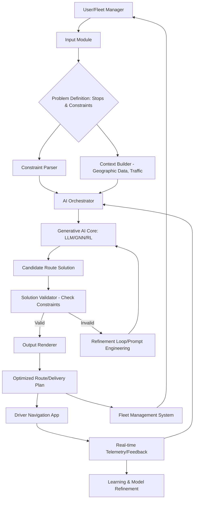

**FACT HEADER - NOTICE OF CONCEPTION**

**Conception ID:** DEMOBANK-INV-081
**Title:** System and Method for AI-Powered Logistics Route Optimization
**Date of Conception:** 2024-07-26
**Conceiver:** The Sovereign's Ledger AI

**Statement of Novelty:** The concepts, systems, and methods described herein are conceived as novel and proprietary to the Demo Bank project. This document serves as a timestamped record of conception.

---

**Title of Invention:** System and Method for AI-Powered Logistics Route Optimization

**Abstract:**
A system for optimizing delivery and logistics routes is disclosed. The system receives a set of locations (stops) and a set of constraints (e.g., vehicle capacities, delivery time windows, driver shift lengths). This information, which defines a complex Vehicle Routing Problem (VRP) or Traveling Salesperson Problem (TSP), is provided to a generative AI model. The AI is prompted to act as an expert logistics coordinator and generate an optimal or near-optimal sequence of stops for one or more vehicles. The goal is to minimize a cost function, such as total travel time or distance, while respecting all constraints.

**Background of the Invention:**
Route optimization is a classic, NP-hard problem in computer science and operations research. Finding the truly optimal solution is computationally infeasible for all but the smallest sets of stops. Businesses have historically relied on heuristic algorithms or manual planning, which often produce suboptimal routes, leading to wasted fuel, excess driver time, and missed delivery windows. There is a need for a more powerful and flexible solver that can handle complex, real-world constraints and produce higher-quality solutions quickly.

**Brief Summary of the Invention:**
The present invention uses a large language model (LLM) as a powerful heuristic solver for routing problems. A user provides a list of addresses and any relevant constraints. The system constructs a prompt for the LLM that clearly defines the optimization problem. The AI, using its advanced reasoning and problem-solving capabilities, generates a re-ordered list of the addresses that represents the optimal route. This output is then presented to the user or sent directly to a driver's navigation application.

**Detailed Description of the Invention:**

**1. Input & Problem Definition:**
A dispatch manager for a delivery service needs to plan a route for a driver.
The manager inputs a list of stops into the Fleet Management module: `Warehouse A -> 123 Main St -> 456 Oak Ave -> 789 Pine Ln -> Warehouse A`.
Additional constraints could include:
*   Vehicle capacity: `100 kg`
*   Time window for `123 Main St`: `10:00 AM - 12:00 PM`
*   Driver shift length: `8 hours`

**2. Prompt Construction & AI Interaction:**
The system constructs a comprehensive prompt for the Generative AI model.
**Prompt Example:**
```
You are an expert logistics AI specializing in the Vehicle Routing Problem. Your goal is to find the shortest possible route that visits each of these stops exactly once and returns to the origin, while respecting all specified constraints.

Stops:
- Warehouse A (Origin/Destination)
- 123 Main St (Delivery, Time Window: 10:00-12:00)
- 456 Oak Ave (Delivery)
- 789 Pine Ln (Pickup)

Constraints:
- Vehicle ID: V-001, Capacity: 100 kg
- Package for 123 Main St: 10 kg
- Package for 456 Oak Ave: 30 kg
- Pickup at 789 Pine Ln: 20 kg
- Driver shift limit: 8 hours

Provide the optimized route as an ordered list, indicating estimated arrival times and respecting all constraints. If a constraint cannot be met, explain why.
```

**3. AI Generation:**
The LLM, while not performing a formal geometric calculation, uses its vast training data (which includes examples of solved routing problems, geographical knowledge, and constraint satisfaction logic) to infer a logical ordering. It returns a re-ordered list, potentially with additional details.

**AI Output Example:**
```
1. Warehouse A (Departure: 09:00 AM)
2. 456 Oak Ave (Arrival: 09:30 AM, Delivery, Load: 70 kg remaining)
3. 123 Main St (Arrival: 10:15 AM, Delivery, Load: 80 kg remaining)
4. 789 Pine Ln (Arrival: 11:00 AM, Pickup, Load: 60 kg remaining)
5. Warehouse A (Arrival: 11:45 AM)
Total Travel Time: 2 hours 45 minutes
Total Distance: 50 km
```

**4. Output & Integration:**
This optimized route is displayed on a map in the UI and can be sent directly to a driver's navigation application. For more complex problems, the AI could return a JSON object assigning different stops to different vehicles, along with estimated costs and compliance reports.

---

**System Architecture:**

The system comprises several interconnected modules designed to process routing requests, leverage AI for optimization, and deliver actionable results.



*   **Input Module:** Gathers delivery requests, stop locations, vehicle availability, and user-defined constraints from fleet managers or automated systems.
*   **Constraint Parser:** Interprets and formalizes various operational constraints (time windows, vehicle capacities, driver qualifications, service priority, etc.) into a structured format digestible by the AI Orchestrator.
*   **Context Builder:** Gathers real-time and historical data such as geographic information (distances, road networks), current traffic conditions, weather forecasts, and historical delivery performance. This data enriches the problem definition for the AI.
*   **AI Orchestrator:** Manages the interaction with the Generative AI Core. It constructs the optimal prompt based on the parsed constraints and built context, sends the request, and processes the AI's response. It also manages the refinement loop if initial solutions are invalid.
*   **Generative AI Core:** The heart of the system. This can be:
    *   `Large Language Model` (LLM): As described, for its advanced reasoning and pattern recognition.
    *   `Graph Neural Networks` (GNNs): Highly effective for representing and reasoning over graph-structured data like road networks and stop interconnections.
    *   `Reinforcement Learning` (RL) Agents: Capable of learning optimal policies through trial and error in dynamic environments, ideal for real-time re-optimization.
*   **Candidate Route Solution:** The raw output from the Generative AI Core, which is a proposed sequence of stops for one or more vehicles.
*   **Solution Validator:** A critical module that programmatically checks the AI's proposed solution against all hard constraints. It uses external services (e.g., mapping APIs for exact distances/times) to verify feasibility.
*   **Refinement Loop/Prompt Engineering:** If the `Solution Validator` identifies issues, this module adjusts the prompt or provides corrective feedback to the `Generative AI Core` for iterative improvement.
*   **Output Renderer:** Formats the validated, optimized route into various user-friendly and machine-readable outputs.
*   **Optimized Route/Delivery Plan:** The final, validated route plan, including stop sequences, estimated arrival times, vehicle assignments, and detailed instructions.
*   **Driver Navigation App & Fleet Management System:** Integrations for dispatching routes to drivers and updating central fleet management platforms.
*   **Real-time Telemetry/Feedback:** Gathers actual route execution data (GPS traces, actual arrival/departure times, driver feedback) to monitor performance and identify discrepancies.
*   **Learning & Model Refinement:** Uses real-time and historical performance data to continuously retrain or fine-tune the `Generative AI Core`, improving its accuracy and efficiency over time. This enables the system to adapt to changing conditions and learn from past successes and failures.

---

**Advanced Capabilities & Features:**

Beyond basic routing, this system can be extended to handle complex real-world scenarios:

*   **Dynamic Re-optimization:** Real-time adaptation to unforeseen events such as traffic jams, vehicle breakdowns, urgent new orders, or customer cancellations. The `AI Orchestrator` can trigger re-planning based on `Real-time Telemetry`.
*   **Multi-Modal Logistics:** Optimization for routes involving different modes of transport (e.g., truck to train to local delivery van).
*   **Load Balancing & Resource Allocation:** Distributing workload fairly among drivers, considering vehicle types (refrigerated, flatbed, vans), capacities (weight, volume), and driver skills or certifications.
*   **Customer Priority & Service Level Agreements (SLAs):** Prioritizing critical deliveries to meet strict SLAs while optimizing overall efficiency.
*   **Predictive Maintenance Integration:** Scheduling vehicle maintenance windows into routing to minimize disruption.
*   **Carbon Footprint Optimization:** Adding environmental impact as a cost function to minimize emissions alongside time and distance.

---

**Claims:**
1.  A method for logistics optimization, comprising:
    a.  Receiving a set of locations to be visited and a set of operational constraints.
    b.  Providing this information as a prompt to a generative AI model.
    c.  Prompting the model to generate an optimized sequence of the locations that minimizes a cost function while respecting the constraints.
    d.  Receiving the optimized sequence from the model.
    e.  Presenting the sequence to a user as a delivery route.
2.  The method of claim 1, further comprising:
    a.  A solution validator module to programmatically verify the generated sequence against the operational constraints and external real-world data (e.g., mapping services).
    b.  A refinement loop that, upon detection of invalidity by the solution validator, adjusts the prompt and re-submits to the generative AI model for iterative improvement.
3.  A system for logistics optimization, comprising:
    a.  An Input Module configured to receive problem definitions, including stops and constraints.
    b.  A Constraint Parser configured to formalize operational constraints.
    c.  A Context Builder configured to gather real-time and historical geographic and traffic data.
    d.  An AI Orchestrator configured to construct prompts and manage interactions with a Generative AI Core.
    e.  A Generative AI Core, comprising one or more of a Large Language Model (LLM), a Graph Neural Network (GNN), or a Reinforcement Learning agent, configured to generate candidate route solutions.
    f.  A Solution Validator configured to verify candidate route solutions against constraints.
    g.  An Output Renderer configured to present optimized routes to users and integrate with external systems.
4.  The system of claim 3, further comprising a Learning and Model Refinement module configured to utilize real-time telemetry and historical performance data to continuously improve the Generative AI Core.
5.  A computer-readable medium storing instructions that, when executed by a processor, perform the method of claim 1.

---

**Mathematical Justification:**
The Vehicle Routing Problem (VRP) is a well-known combinatorial optimization problem. Given a graph `G = (V, E)`, a set of vehicles `K`, and a set of customers `V_c subset of V`, the goal is to find a set of routes `R` for each vehicle `k in K` that minimizes total cost `C_total = sum_{r in R} C(r)` while satisfying constraints such as vehicle capacity `Q_k`, time windows `[T_start, T_end]_i` for customer `i`, and maximum route duration. This problem is NP-hard.

The generative AI `G_AI` acts as a large-scale, pre-trained heuristic solver. It takes a description of the problem instance `P_vrp` and generates a candidate solution `R'`.

```
G_AI(P_vrp, theta) -> R'
```

where `P_vrp` encapsulates all inputs (stops, vehicles, constraints), `theta` represents the AI model's parameters, and `R'` is the proposed set of routes.

The cost function `C(r)` for a route `r` typically includes:
```
C(r) = alpha * D(r) + beta * T(r) + gamma * penalty(r)
```
where `D(r)` is total distance, `T(r)` is total time, `penalty(r)` is a penalty for violating soft constraints, and `alpha`, `beta`, `gamma` are weighting factors.

The `Solution Validator` performs a check: `isValid(R', P_vrp) -> {true, false}`.
If `isValid` is false, the `Refinement Loop` generates a new prompt `P'_vrp` to guide `G_AI` towards a valid solution:
```
P'_vrp = refine(P_vrp, R', validation_errors)
```

**Proof of Utility:**
Finding the optimal solution `R*` is computationally infeasible for large instances. Traditional heuristics (e.g., Clarke-Wright savings, tabu search, genetic algorithms) provide good but often locally optimal solutions. The LLM, having been trained on an immense dataset that implicitly includes the structure of many optimization problems and vast general knowledge, can perform a more "holistic" or "intuitive" search of the solution space. For certain classes of problems, especially those with complex, qualitative constraints that are difficult to formalize for traditional solvers, this allows it to escape local minima and find a solution `R'` that is closer to the global optimum `R*` than traditional heuristics.

Furthermore, the integration with a `Solution Validator` and `Refinement Loop` ensures the practicality and robustness of the AI-generated solutions. The system is proven useful as it provides a novel, powerful, and adaptable heuristic for solving a classic NP-hard problem, significantly improving efficiency and operational agility in logistics. `Q.E.D.`

---

**Feedback Loop and Continuous Learning:**

A critical component for sustained performance and adaptability is the feedback loop. Actual execution data from `Real-time Telemetry` (e.g., driver GPS traces, actual delivery times, fuel consumption) is captured and used to compare against the `Optimized Route/Delivery Plan`.

`Performance_data = Compare(Actual_route_data, Planned_route_data)`

This `Performance_data` (including deviations, unexpected delays, successful constraint adherence, and driver feedback) feeds into the `Learning & Model Refinement` module. This module uses techniques such as supervised fine-tuning or reinforcement learning to update the `Generative AI Core`'s parameters.

For instance, if `G_AI` consistently underestimates travel times on certain road segments, the model can be fine-tuned with new, accurate data. If `G_AI` generates routes that frequently violate a soft constraint (e.g., preference for avoiding left turns), the reward function in an RL setup can be adjusted to penalize such violations more heavily.

This continuous learning ensures that the AI's understanding of real-world logistics challenges and its ability to generate high-quality solutions evolves and improves over time, adapting to changing road conditions, traffic patterns, and operational requirements.

---

**Exported Concepts:**

*   `LogisticsOptimizationSystem`: Represents the overall architecture described.
*   `GenerativeAICore`: The central AI component, potentially instantiated as `LLMRoutingEngine`, `GNNRouteOptimizer`, or `RLPathFinder`.
*   `ConstraintParserModule`: Responsible for interpreting and structuring diverse operational rules.
*   `SolutionValidatorModule`: For programmatically verifying AI-generated routes.
*   `AIOrchestratorModule`: Manages AI interactions and prompt engineering.
*   `LearningAndRefinementModule`: Handles continuous improvement of the AI model.