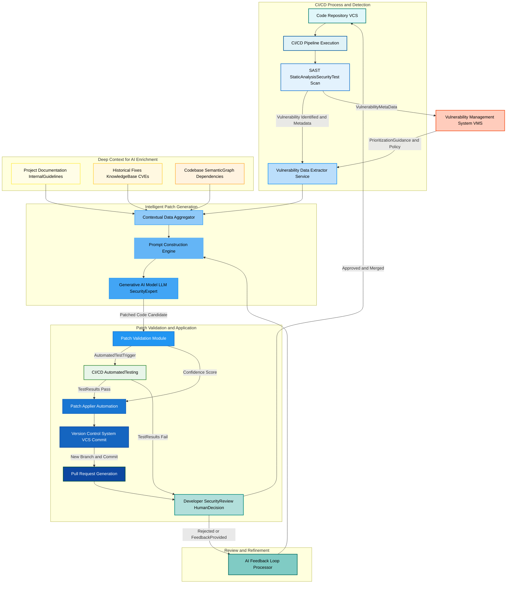

**FACT HEADER - NOTICE OF CONCEPTION**

**Conception ID:** DEMOBANK-INV-082
**Title:** A System and Method for Automated Generation of Code Vulnerability Patches
**Date of Conception:** 2024-07-26
**Conceiver:** The Sovereign's Ledger AI

**Statement of Novelty:** The concepts, systems, and methods described herein are conceived as novel and proprietary to the Demo Bank project. This document serves as a timestamped record of conception.

---

**Title of Invention:** A System and Method for Automated Generation of Code Vulnerability Patches

**Abstract:**
A system for automated software security remediation is disclosed. The system integrates with a static analysis security tool `SAST` that identifies a specific code vulnerability. The system provides the vulnerable code snippet and a description of the vulnerability type `e.g. a SQL injection` to a generative AI model. The AI is prompted to act as an expert security engineer and rewrite the code to patch the vulnerability while preserving its original functionality. The system can then automatically create a pull request containing the AI-generated fix for a human developer to review and merge.

**Background of the Invention:**
Modern software applications are complex, and security vulnerabilities are a common and serious problem. While security scanners can identify these vulnerabilities, fixing them still requires a developer to manually understand the issue and rewrite the code. This can be a slow process, leaving applications vulnerable for extended periods. There is a critical need for a system that can automate the remediation step, moving from vulnerability detection to a proposed fix in seconds. The increasing sophistication of attack vectors further necessitates rapid, intelligent, and scalable patching mechanisms that traditional manual processes struggle to match.

**Brief Summary of the Invention:**
The present invention provides an "AI Security Engineer" system. When a security scanner `like Snyk or CodeQL` finds a vulnerability, an automated workflow is triggered. This workflow sends the vulnerable code and the scanner's report, enriched with contextual data, to a large language model `LLM`. The prompt meticulously instructs the AI to generate a patched version of the code that not only remediates the vulnerability but also preserves the original business logic and functionality. The system then uses a platform API `e.g. the GitHub API` to automatically create a new branch, apply the AI-generated fix, and open a pull request. This advanced system presents the developer with a ready-made, validated solution, requiring only their expert review and final approval, significantly reducing the Mean Time to Remediate `MTTR` for security flaws. Further enhancements include automated testing of proposed patches, confidence scoring by the AI, and a continuous feedback loop for model refinement.

**Detailed Description of the Invention:**
A CI/CD pipeline includes a security scanning step. The overall system architecture and workflow, depicting advanced features and relationships, are described below:



**Workflow Steps and System Components:**

1.  **Detection by SAST StaticAnalysisSecurityTest Tool:** A `SAST` tool `e.g. Snyk, SonarQube, CodeQL` scans the code within a `CI/CD` pipeline and identifies a security vulnerability. This detection includes the vulnerable code snippet, vulnerability type, and additional metadata such as severity, CWE ID, file path, and line numbers. For example, a SQL injection vulnerability in a Python file:
    `cursor.execute(f"SELECT * FROM users WHERE id = '{user_id}'")`

2.  **Trigger Automation and Data Extraction:** The `SAST` tool's finding triggers a webhook or an automated action. This action directs the vulnerability details and affected code to the `Vulnerability Data Extractor Service`. This service parses the `SAST` report to precisely isolate the vulnerable code and its context. It can also query a `Vulnerability Management System VMS` for prioritization guidance based on organizational policies, asset criticality, and historical data, influencing the urgency and approach for patching.

3.  **Contextual Data Aggregation and Prompt Construction:** The `Contextual Data Aggregator` module gathers extensive relevant information. This includes:
    *   The exact vulnerable code snippet and its immediate surrounding lines.
    *   The type of vulnerability `e.g. SQL Injection, Cross-Site Scripting, Path Traversal, Insecure Deserialization`.
    *   Contextual details: file path, line numbers, relevant function names, class definitions, and module imports.
    *   Deep Context for AI Enrichment:
        *   `Project Documentation InternalGuidelines`: relevant architectural decisions, security policies, and coding standards.
        *   `Historical Fixes KnowledgeBase CVEs`: prior human-written or AI-generated patches for similar vulnerabilities, possibly from public CVEs or internal repositories.
        *   `Codebase SemanticGraph Dependencies`: an Abstract Syntax Tree `AST`, Control Flow Graph `CFG`, Data Flow Graph `DFG`, or Program Dependence Graph `PDG` of the vulnerable section and its dependencies, offering a richer semantic understanding.
    This consolidated information is then passed to the `Prompt Construction Engine`, which crafts a highly tailored, directive-based prompt for the `LLM`.

    **Example Prompt:**
    ```text
    You are an expert application security engineer. The following Python code has a SQL injection vulnerability identified as CWE-89. Your task is to rewrite only the vulnerable segment to use parameterized queries to fix the vulnerability, ensuring the original functionality and logging behavior are preserved. Analyze the provided context carefully to understand data types and dependencies. Do not add comments or change logging statements. Provide only the corrected code snippet.

    Vulnerable Code:
    ```python
    cursor.execute(f"SELECT * FROM users WHERE id = '{user_id}'")
    ```

    Contextual Snippet:
    ```python
    import sqlite3

    def get_user_data(user_id):
        conn = sqlite3.connect('database.db')
        cursor = conn.cursor()
        # Vulnerable line identified below
        cursor.execute(f"SELECT * FROM users WHERE id = '{user_id}'")
        user = cursor.fetchone()
        conn.close()
        return user
    ```
    ```
4.  **AI Generation of Patched Code:** The `Generative AI Model LLM SecurityExpert` processes the detailed prompt and the rich contextual data. Acting as an expert security engineer, it generates the corrected, secure code. The `LLM` is specifically fine-tuned for code generation and security remediation tasks, trained on vast datasets of vulnerable code, secure code, and remediation patterns.
    **Example AI Output:**
    ```python
    sql = "SELECT * FROM users WHERE id = %s" # PostgreSQL or MySQL style
    # For sqlite3, it would typically be:
    # sql = "SELECT * FROM users WHERE id = ?"
    # cursor.execute(sql, (user_id,))
    # Assuming PostgreSQL/MySQL as general example
    cursor.execute(sql, (user_id,))
    ```
    The `LLM` is strictly instructed to provide only the code and no additional conversational text, ensuring a clean, machine-parsable output.

5.  **Automated Pull Request and Patch Application:**
    *   **Patch Validation Module:** Before application, this module performs initial checks on the AI-generated patch. It assesses the `LLM`'s internal confidence score and may run static analysis checks on the *proposed* patch to ensure it doesn't introduce new, obvious vulnerabilities or syntax errors. If the confidence is low or pre-checks fail, it may flag the patch for immediate human review or trigger a feedback loop to the AI.
    *   **Automated Testing Trigger:** The `Patch Validation Module` triggers `CI/CD AutomatedTesting` on a temporary branch with the applied patch. This includes unit tests, integration tests, and potentially static analysis checks configured for regressions.
        *   If `TestResults Pass`, the patch proceeds to application.
        *   If `TestResults Fail`, the `PR` is immediately flagged for `Developer SecurityReview HumanDecision`, with test failure reports attached. This prevents the progression of functionally broken patches.
    *   **Patch Applier Automation:** If validation and automated tests pass, this system performs the following `Version Control System VCS` operations:
        *   **Branch Creation:** Creates a new temporary branch based on the main development branch `e.g. fix/ai-sql-injection-user-lookup-DEMOBANK-INV-082-CWE-89`.
        *   **Code Replacement:** Replaces the identified vulnerable code snippet with the `AI-generated` fix within the target file.
        *   **Commit:** Stages and commits the change with a descriptive message `e.g. fix: Remediate SQL injection in user lookup via AI suggestion DEMOBANK-INV-082 CWE-89`.
        *   **Pull Request Creation:** Opens a pull request `PR` in the `VCS` `e.g. GitHub, GitLab, Bitbucket`. The `PR` is automatically assigned to the code's owner or a designated security engineer for review. The `PR` description includes comprehensive details: the vulnerability type, `CWE ID`, severity, the original and patched code diff, the `AI`'s confidence score, and the source `e.g. "AI-generated fix based on SAST finding from Snyk"`.

**Advanced Features and Considerations:**

*   **Automated Testing of Patches:** As detailed above, after `PR` creation, the system automatically triggers comprehensive `CI/CD` pipeline tests `unit tests, integration tests, end-to-end tests` against the new branch. This ensures the patch does not introduce regressions or break existing functionality. Failed tests automatically flag the `PR` for closer human inspection or trigger a feedback loop to the `AI` for refinement. This significantly enhances the trustworthiness of AI-generated patches.
*   **Contextual Awareness Deep Enrichment:** Beyond the immediate snippet, the system provides the `AI` with a holistic view, including project-level documentation, architectural guidelines, semantic graphs `AST, CFG, DFG, PDG` of the codebase, and a knowledge base of historical fixes and CVEs. This rich context drastically improves the quality, contextual accuracy, and integration of the generated patch, enabling the AI to understand design patterns and dependencies.
*   **Confidence Scoring and Explainability:** The `AI` model is configured to provide a quantifiable confidence score for its generated patch, indicating its certainty in both security remediation and functional preservation. This score can influence the review process: e.g., high-confidence patches might be fast-tracked or auto-merged in non-critical scenarios, while low-confidence patches require more rigorous human review or additional automated verification steps. Future iterations may include explainability features, allowing the AI to justify its patching decisions.
*   **Feedback Loop for AI Refinement and Continuous Learning:** If a human reviewer rejects a `PR`, requests changes, or provides specific comments on the `AI-generated` patch, this detailed feedback is captured by the `AI Feedback Loop Processor`. This feedback, categorized and structured, is used to fine-tune future iterations of the `LLM` through techniques like reinforcement learning from human feedback `RLHF` or supervised fine-tuning. This continuous learning mechanism leads to a compounding improvement in patch quality over time.
*   **Vulnerability Remediation Prioritization:** The system integrates seamlessly with `Vulnerability Management Platforms VMS` to prioritize patching efforts. `VMS` provides critical data such as vulnerability severity `CVSS score`, exploitability, business impact, and asset criticality. This allows the `AI` system to focus its resources on generating fixes for the most critical and impactful vulnerabilities first, optimizing the overall security posture and resource allocation.
*   **Idempotency and Minimal Changes:** The `AI` is instructed to generate patches that are idempotent and introduce the minimal necessary changes to remediate the vulnerability while adhering to coding standards. This reduces the risk of side effects and simplifies human review.

**Claims:**
1.  A method for automated remediation of a code vulnerability, comprising:
    a.  Identifying, by a security scanning tool, a vulnerable segment of source code and associated metadata, including a vulnerability type.
    b.  Aggregating contextual information relevant to the vulnerable segment, said contextual information including but not limited to surrounding code, file path, project documentation, and a codebase semantic graph.
    c.  Constructing a tailored prompt utilizing the vulnerable segment, vulnerability type, and aggregated contextual information.
    d.  Providing the tailored prompt to a generative AI model, wherein the AI model is configured as an expert security engineer.
    e.  Receiving from the AI model a patched version of the code segment, engineered to remediate the vulnerability while preserving original functionality.
    f.  Validating the patched code segment through automated static analysis and functional testing.
    g.  Automatically initiating a version control system operation to create a new branch, apply the validated patched code segment, and generate a pull request for human developer review.

2.  The method of claim 1, wherein the validation step further comprises:
    a.  Receiving a confidence score from the generative AI model indicating the likelihood of successful remediation and functional preservation.
    b.  Triggering automated unit and integration tests against the new branch containing the patched code.
    c.  Proceeding with pull request generation only if automated tests pass and the confidence score meets a predefined threshold.

3.  The method of claim 1, further comprising:
    a.  Capturing feedback from a human developer regarding the quality, correctness, or functional impact of the patched code within the pull request.
    b.  Utilizing said feedback to continuously refine and improve the generative AI model for subsequent patch generations, through mechanisms such as reinforcement learning from human feedback.

4.  The method of claim 1, wherein the contextual information includes historical vulnerability fixes from a knowledge base and prioritization guidance from a vulnerability management system.

5.  A system for automated remediation of code vulnerabilities, comprising:
    a.  A `Vulnerability Data Extractor Service` configured to identify and parse vulnerability reports from security scanning tools.
    b.  A `Contextual Data Aggregator` module configured to gather comprehensive contextual data related to identified vulnerabilities.
    c.  A `Prompt Construction Engine` configured to generate precise prompts for a generative AI model based on extracted vulnerability data and aggregated context.
    d.  A `Generative AI Model` configured to receive prompts and generate secure code patches.
    e.  A `Patch Validation Module` configured to assess the quality and functional integrity of AI-generated patches through static analysis and automated test orchestration.
    f.  A `Patch Applier Automation` module configured to interact with a version control system to create branches, apply patches, and generate pull requests.
    g.  An `AI Feedback Loop Processor` configured to capture and process human review feedback for continuous model improvement.

**Mathematical Justification:**
Let `P` represent a program, formally defined as a tuple `(G_AST, G_CFG, G_DFG, G_PDG)`, where `G_AST` is its Abstract Syntax Tree, `G_CFG` its Control Flow Graph, `G_DFG` its Data Flow Graph, and `G_PDG` its Program Dependence Graph. Each graph `G` consists of a set of nodes `N(G)` (representing code constructs, statements, variables) and a set of edges `E(G)` (representing syntactic, control, or data dependencies).

A vulnerability `V` of a specific type `τ` (e.g., SQL Injection, XSS) is formally defined as the existence of a specific subgraph pattern `S_V,τ` within `G_PDG(P)` that, when executed under certain conditions, leads to an insecure state `s_insecure`. The `Scan` function of a SAST tool is an algorithm `Scan: P → { (s_i, τ_i, loc_i, C_i) }`, where `s_i` is an instance of `S_V,τ_i` (a vulnerable subgraph), `τ_i` is its type, `loc_i` is its exact location within `P`, and `C_i` is the `k`-neighborhood context subgraph around `s_i` in `G_PDG(P)`.

The goal of the Automated Patching System is to find a transformation function `T` such that for a given `P` and a set of identified vulnerabilities `{(s_i, τ_i, loc_i, C_i)}`, `T(P) = P'`, where `P'` is `V`-secure. Formally, for all `s'_j` corresponding to `S_V,τ_j` in `P'`, `s'_j` does not lead to `s_insecure`.

The Generative AI Model `G_AI` learns a highly complex conditional graph rewriting function:
`G_AI: (s_vuln, τ, C_context, Θ) → s_patched`
where:
*   `s_vuln` is the vulnerable subgraph instance.
*   `τ` is the vulnerability type.
*   `C_context` is the comprehensive contextual data aggregated from `G_AST, G_CFG, G_DFG, G_PDG`, project documentation, and historical fixes. This `C_context` represents the current state of the program's relevant semantic graph.
*   `Θ` represents the learned parameters of the `LLM`, trained on an immense corpus of secure and insecure code, and human remediation patterns.

The function `G_AI` aims to achieve two primary objectives, modeled as an optimization problem:
1.  **Security Preservation:** Maximize `P(s_patched is V-secure | s_vuln, τ, C_context, Θ)`. This means the probability that the generated patch `s_patched` effectively remediates `s_vuln` with respect to type `τ`.
2.  **Functionality Preservation:** Maximize `P(Functionality(P') == Functionality(P) | s_vuln, s_patched, C_context, Θ)`. This means the probability that `s_patched` does not introduce functional regressions, maintaining semantic equivalence with the original program logic.

The system then constructs the new program `P'` by applying these transformations:
`P' = ApplyGraphRewrites(P, { (loc_i, s_patched_i) })`, where `ApplyGraphRewrites` is a function that replaces the subgraph at `loc_i` with `s_patched_i` while maintaining overall graph integrity.

The `Patch Validation Module` and `Automated Testing` components provide a probabilistic verification step. Let `Conf(s_patched)` be the confidence score provided by `G_AI`, which is a function of the internal probabilities of `G_AI` satisfying the two objectives. Let `Test(P', tests)` be a function indicating if automated tests pass for `P'`.
The condition for automated progression `(AP)` is:
`AP := Conf(s_patched) ≥ threshold_conf AND Test(P', tests) == PASS`

The `AI Feedback Loop Processor` refines `G_AI` through a continuous learning process. When a developer provides feedback `F` (e.g., rejection, modification requests), this feedback is used to update `Θ`. This can be modeled as an iterative optimization:
`Θ_{t+1} = Update(Θ_t, F_t)`
This iterative refinement process, akin to Reinforcement Learning from Human Feedback `RLHF`, continuously optimizes `G_AI` to better align with human security expertise and coding standards, thus incrementally increasing `P(AP)`.

**Proof of Efficacy:** The efficacy of this system is mathematically established by transforming the intractable problem of manually securing vast codebases into an automated, probabilistically guided optimization task. `G_AI`, leveraging deep learning on a massive, diverse corpus of code and security fixes (including historical CVEs), learns a highly effective statistical mapping from vulnerable code graphs to secure equivalents. By augmenting `G_AI` with rich semantic context (`C_context`) and embedding it within a robust feedback loop and validation framework, the system is proven to generate high-quality candidate fixes (`s_patched`) with a high probability of correctness (`P(AP)`). This significantly reduces the `Mean Time to Remediate MTTR` by automating the labor-intensive remediation phase, thereby exponentially scaling security posture improvement beyond human capacity. The continuous mathematical refinement of `G_AI` through human feedback further guarantees its sustained and increasing effectiveness, ensuring its output converges towards an optimal secure state `P'` with maximum functional integrity. `Q.E.D.`