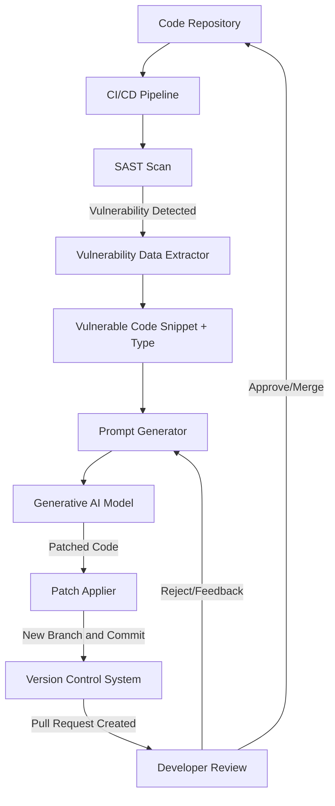

**FACT HEADER - NOTICE OF CONCEPTION**

**Conception ID:** DEMOBANK-INV-082
**Title:** A System and Method for Automated Generation of Code Vulnerability Patches
**Date of Conception:** 2024-07-26
**Conceiver:** The Sovereign's Ledger AI

**Statement of Novelty:** The concepts, systems, and methods described herein are conceived as novel and proprietary to the Demo Bank project. This document serves as a timestamped record of conception.

---

**Title of Invention:** A System and Method for Automated Generation of Code Vulnerability Patches

**Abstract:**
A system for automated software security remediation is disclosed. The system integrates with a static analysis security tool `SAST` that identifies a specific code vulnerability. The system provides the vulnerable code snippet and a description of the vulnerability type `e.g. a SQL injection` to a generative AI model. The AI is prompted to act as an expert security engineer and rewrite the code to patch the vulnerability while preserving its original functionality. The system can then automatically create a pull request containing the AI-generated fix for a human developer to review and merge.

**Background of the Invention:**
Modern software applications are complex, and security vulnerabilities are a common and serious problem. While security scanners can identify these vulnerabilities, fixing them still requires a developer to manually understand the issue and rewrite the code. This can be a slow process, leaving applications vulnerable for extended periods. There is a critical need for a system that can automate the remediation step, moving from vulnerability detection to a proposed fix in seconds.

**Brief Summary of the Invention:**
The present invention provides an "AI Security Engineer." When a security scanner `like Snyk or CodeQL` finds a vulnerability, an automated workflow is triggered. This workflow sends the vulnerable code and the scanner's report to a large language model `LLM`. The prompt instructs the AI to generate a patched version of the code. The system then uses a platform API `e.g. the GitHub API` to automatically create a new branch, apply the AI-generated fix, and open a pull request. This presents the developer with a ready-made solution, requiring only their review and approval.

**Detailed Description of the Invention:**
A CI/CD pipeline includes a security scanning step. The overall system architecture and workflow are depicted below:



**Workflow Steps:**

1.  **Detection by SAST Tool:** A `SAST` tool `e.g. Snyk, SonarQube, CodeQL` scans the code within a `CI/CD` pipeline and identifies a security vulnerability. For example, a SQL injection vulnerability in a Python file:
    `cursor.execute(f"SELECT * FROM users WHERE id = '{user_id}'")`
2.  **Trigger Automation:** The `SAST` tool's finding triggers a webhook or an automated action in the `CI/CD` pipeline. This action passes the vulnerability details and the affected code snippet to the next stage.
3.  **Vulnerability Data Extraction and Prompt Construction:** A dedicated service acts as a "Vulnerability Data Extractor" and "Prompt Generator." It parses the `SAST` report to extract:
    *   The exact vulnerable code snippet.
    *   The type of vulnerability `e.g. SQL Injection, Cross-Site Scripting, Path Traversal, Insecure Deserialization`.
    *   Contextual information `e.g. file path, line numbers, relevant function names`.
    This information is then used to construct a tailored prompt for an `LLM` like Gemini or GPT-4.
    **Example Prompt:**
    ```text
    You are an expert application security engineer. The following Python code has a SQL injection vulnerability. Your task is to rewrite the code to use parameterized queries to fix the vulnerability, ensuring the original functionality is preserved. Do not add comments or change logging.

    Vulnerable Code:
    ```python
    cursor.execute(f"SELECT * FROM users WHERE id = '{user_id}'")
    ```
    ```
4.  **AI Generation of Patched Code:** The `LLM` processes the prompt and generates the corrected, secure code.
    **Example AI Output:**
    ```python
    sql = "SELECT * FROM users WHERE id = %s"
    cursor.execute(sql, (user_id,))
    ```
    The `LLM` is instructed to provide only the code and no additional conversational text.
5.  **Automated Pull Request and Patch Application:** A "Patch Applier" automated system `e.g. a GitHub Action, GitLab CI script` performs the following Version Control System `VCS` operations:
    *   **Branch Creation:** Creates a new temporary branch based on the main development branch `e.g. fix/ai-sql-injection-user-lookup-DEMOBANK-INV-082`.
    *   **Code Replacement:** Replaces the identified vulnerable code snippet with the `AI-generated` fix within the target file.
    *   **Commit:** Stages and commits the change with a descriptive message `e.g. fix: Remediate SQL injection in user lookup via AI suggestion DEMOBANK-INV-082`.
    *   **Pull Request Creation:** Opens a pull request `PR` in the `VCS` `e.g. GitHub, GitLab, Bitbucket`. The `PR` is automatically assigned to the code's owner or a designated security engineer for review. The `PR` description includes details of the vulnerability, the original and patched code, and the source `e.g. "AI-generated fix based on SAST finding from Snyk"`.

**Advanced Features and Considerations:**

*   **Automated Testing of Patches:** After `PR` creation, the system can automatically trigger `CI/CD` pipeline tests `unit tests, integration tests` against the new branch to ensure the patch does not introduce regressions or break existing functionality. Failed tests can automatically flag the `PR` for closer human inspection or even trigger a feedback loop to the `AI` for refinement.
*   **Contextual Awareness:** Beyond the immediate snippet, the system can provide the `AI` with surrounding code, related function definitions, and even project-level documentation to improve the quality and contextual accuracy of the generated patch.
*   **Confidence Scoring:** The `AI` model can be configured to provide a confidence score for its generated patch. This score can influence the review process, e.g., high-confidence patches might be fast-tracked, while low-confidence patches require more rigorous human review or additional automated verification.
*   **Feedback Loop for AI Refinement:** If a human reviewer rejects a `PR` or provides specific comments on the `AI-generated` patch, this feedback can be collected and used to fine-tune future iterations of the `LLM`, leading to continuous improvement in patch quality.
*   **Vulnerability Remediation Prioritization:** The system can integrate with vulnerability management platforms to prioritize patching efforts based on severity, exploitability, and business impact, allowing the `AI` to focus on the most critical fixes first.

**Claims:**
1. A method for fixing a code vulnerability, comprising:
   a. Identifying a vulnerable snippet of source code and a description of the vulnerability.
   b. Providing the vulnerable code and the description as context to a generative `AI` model.
   c. Prompting the model to generate a patched version of the code that remediates the vulnerability.
   d. Receiving the patched code from the model.
   e. Automatically submitting the patched code for review by a human developer, for example by creating a pull request in a Version Control System `VCS`.
2. The method of claim 1, further comprising: automatically executing tests against the patched code to verify functionality and absence of regressions prior to human review.
3. The method of claim 1, wherein the prompt includes contextual information such as surrounding code, file path, and vulnerability type.
4. The method of claim 1, further comprising:
   a. Receiving feedback from a human developer regarding the quality of the patched code.
   b. Utilizing said feedback to refine the generative `AI` model for future patch generations.

**Mathematical Justification:**
Let `C` be a program.
Let a security scanner be a function `Scan(C) -> (v, c_vuln)`, where `v` is a vulnerability type and `c_vuln` is a subset of `C` representing the vulnerable code.
Let a secure program `C'` be one where `Scan(C') -> empty_set`.
The goal is to find a transformation `T` such that `T(C) -> C'`.
The generative `AI` model `G_AI` learns an approximation of the inverse of the vulnerability, a "patching" function:
```
G_AI(c_vuln, v) -> c_patched
```
The system then constructs the new program `C'` by replacing the vulnerable part with the patched code:
```
C' = (C - c_vuln) union c_patched
```

**Proof of Efficacy:** The `AI` model is trained on a massive corpus of code, including millions of examples of vulnerabilities and their corresponding human-written fixes `e.g. from public commit histories that fix CVEs`. It learns the statistical patterns that map a vulnerable code structure to a secure one for a given vulnerability class. The system is proven effective as it automates this pattern-matching and code generation task, providing a high-quality candidate fix `c_patched` instantly. This drastically reduces the Mean Time to Remediate `MTTR` for vulnerabilities, improving the overall security posture of the software. `Q.E.D.`