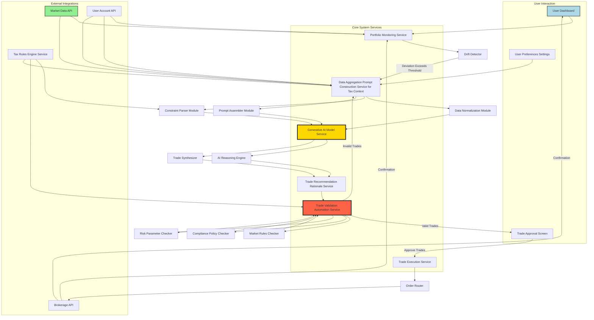
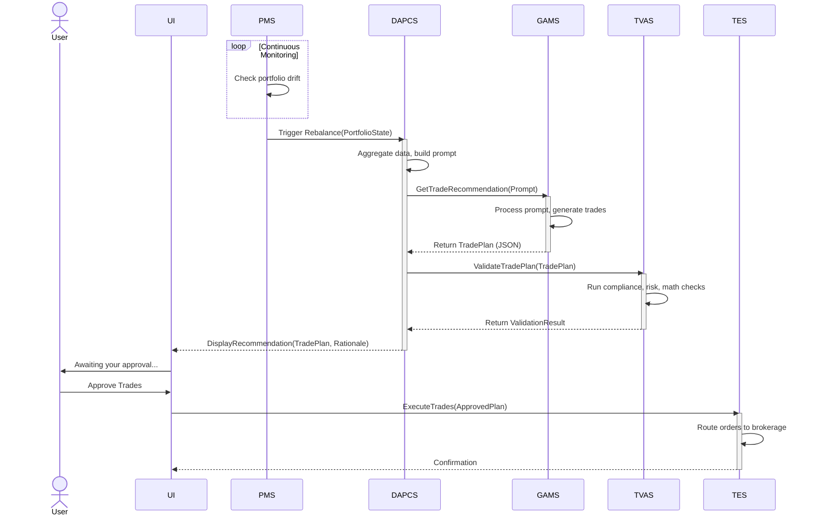
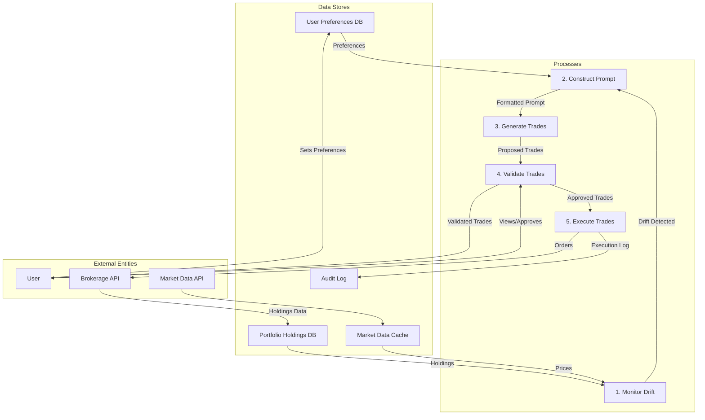
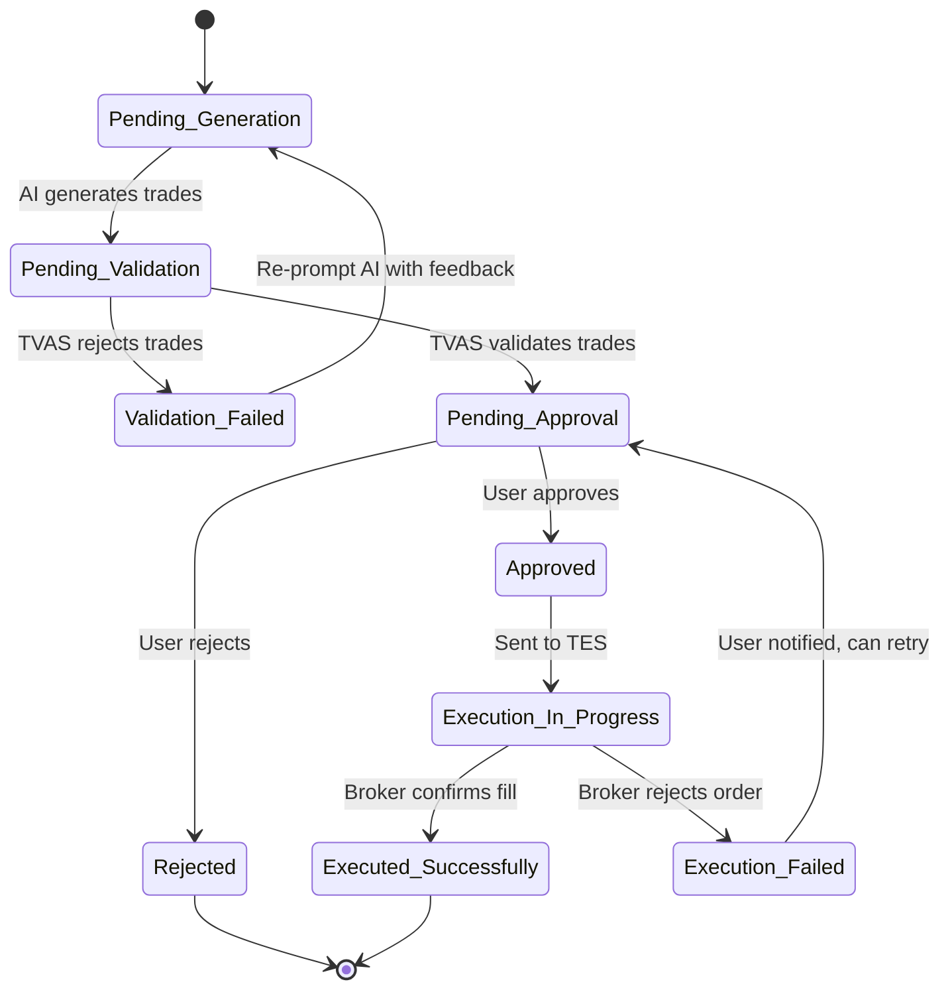
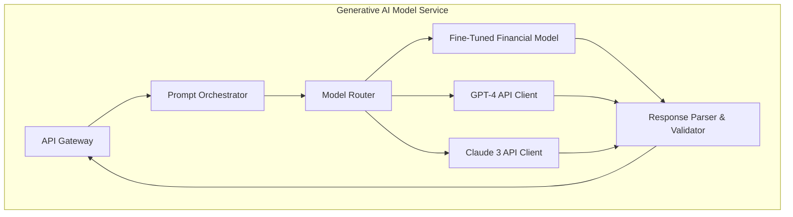
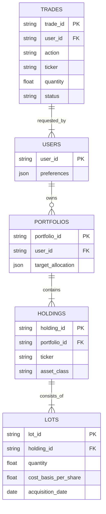
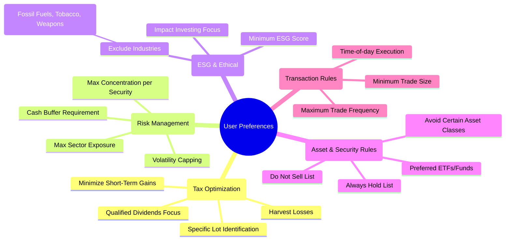
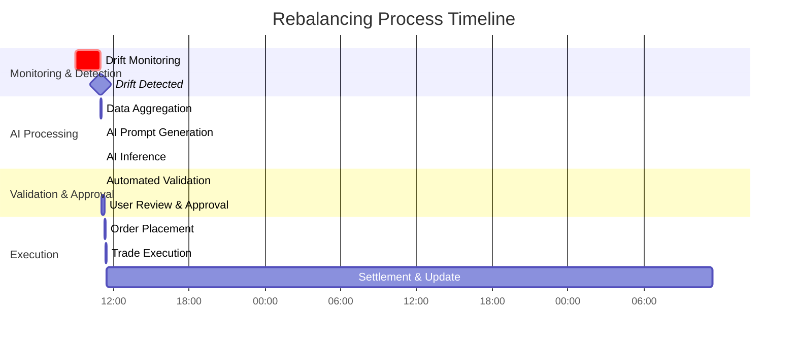

**FACT HEADER - NOTICE OF CONCEPTION**

**Conception ID:** DEMOBANK-INV-083
**Title:** System and Method for AI-Driven Investment Portfolio Rebalancing with Multi-Objective Optimization and Explainability
**Date of Conception:** 2024-07-26
**Conceiver:** The Sovereign's Ledger AI

**Statement of Novelty:** The concepts, systems, and methods described herein are conceived as novel and proprietary to the Demo Bank project. This document serves as a timestamped record of conception. The invention's novelty lies in the synergistic combination of a generative AI's contextual reasoning for complex, qualitative constraint satisfaction with a rigorous mathematical framework and a deterministic validation layer, creating a highly personalized, transparent, and safe automated portfolio management system.

---

**Title of Invention:** System and Method for AI-Driven Investment Portfolio Rebalancing

**Abstract:**
A system for managing and rebalancing investment portfolios is disclosed. The system receives a user's target asset allocation (e.g., 60% stocks, 40% bonds) and continuously monitors the portfolio's current allocation, which drifts over time due to market movements. When the drift exceeds a dynamically calculated, user-defined threshold, a generative Artificial Intelligence (AI) model is prompted to create a specific, actionable set of trades (buy and sell orders) required to bring the portfolio back into alignment with its target. The AI is specifically prompted to optimize these trades for a multitude of concurrent constraints, such as minimizing transaction costs, deferring tax consequences, adhering to Environmental, Social, and Governance (ESG) criteria, and maintaining liquidity. The AI generates not only the trades but also a detailed, human-readable rationale for its decisions, which is then subjected to a rigorous, automated validation service before being presented to the user for final approval. This creates a hybrid intelligence system that leverages the AI's nuanced understanding with deterministic safety checks.

**Background of the Invention:**
Portfolio rebalancing is a critical discipline for managing investment risk and adhering to a long-term financial strategy. The fundamental principle is to periodically reset a portfolio's asset allocation to its original target proportions. However, the execution of this process is fraught with complexity. Manually calculating the precise trades needed is tedious, error-prone, and often fails to account for second-order effects. Making tax-efficient decisions, such as selecting specific tax lots to sell to minimize capital gains (tax-lot accounting) or harvesting losses, adds a significant layer of complexity that is beyond the capabilities of most individual investors.

Existing automated solutions, such as "robo-advisors," automate this process but typically rely on rigid, pre-programmed algorithms. Their logic is often a "black box," offering little to no explanation for their trading decisions. Furthermore, these systems struggle to incorporate complex, qualitative, or conflicting user preferences, such as "prioritize ESG investments but not at the expense of significant diversification" or "avoid selling any assets acquired in the last 13 months unless absolutely necessary." There is a significant and unmet need for an intelligent, transparent, and highly customizable tool that can generate a clear, explained, and optimized set of rebalancing trades on demand, adaptable to dynamic market conditions and personalized user objectives.

**Brief Summary of the Invention:**
The present invention provides an AI Rebalancing Advisor, a system that acts as a sophisticated co-pilot for portfolio management. When a user's portfolio drifts from its target allocation, the system is triggered. It aggregates the user's current holdings, their target allocation, real-time market data, and a rich set of user-defined constraints and preferences (e.g., "avoid selling lots with short-term capital gains," "prioritize holdings with high ESG scores," "maintain a $5,000 cash buffer").

This comprehensive dataset is then compiled into a structured prompt for a large language model (LLM) or other generative AI. The prompt instructs the AI to act as an expert portfolio manager and generate an optimal list of specific trades to achieve the rebalancing goal while satisfying all provided constraints. The AI's advanced reasoning capabilities allow it to handle complex, non-linear, and qualitative constraints that would be computationally prohibitive or impossible to program into a traditional algorithm. The output is a clear list of buy/sell orders, often accompanied by a detailed rationale explaining *why* certain trades were chosen over others. This output is then passed through a critical validation layer to ensure mathematical correctness, regulatory compliance, and adherence to risk guardrails before being presented to the user for a final, one-click approval.

**Detailed Description of the Invention:**
The rebalancing process is a multi-stage workflow, initiated when a user's portfolio deviates from its target allocation beyond a configurable, dynamic threshold.

1.  **Input Collection:**
    *   **Target Allocation:** A user-defined desired asset distribution. E.g., `{"US Stocks": 0.40, "International Stocks": 0.20, "Bonds": 0.35, "Real Estate": 0.05, "Cash": 0.00}`.
    *   **Current Allocation:** The real-time, market-value-based distribution of assets, calculated continuously. E.g., `{"US Stocks": 0.46, "International Stocks": 0.21, "Bonds": 0.30, "Real Estate": 0.03, "Cash": 0.00}`.
    *   **Total Portfolio Value:** The current aggregated market value of all holdings. E.g., `$500,000`.
    *   **Detailed Holdings Data (Tax-Lot Level):** A comprehensive list of individual securities, broken down by acquisition lot for precise tax calculation.
        ```json
        [
          {"ticker": "VTI", "asset_class": "US Stocks", "lots": [
            {"lot_id": "L1", "quantity": 100, "acquisition_date": "2020-05-10", "cost_basis_per_share": 150.00, "lot_type": "long-term"},
            {"lot_id": "L2", "quantity": 50, "acquisition_date": "2024-03-15", "cost_basis_per_share": 240.00, "lot_type": "short-term"}
          ], "current_price": 250.00, "value_usd": 37500},
          {"ticker": "BND", "asset_class": "Bonds", "lots": [
            {"lot_id": "L3", "quantity": 1000, "acquisition_date": "2021-01-20", "cost_basis_per_share": 90.00, "lot_type": "long-term"}
          ], "current_price": 92.11, "value_usd": 92110}
        ]
        ```
    *   **User-Defined Constraints/Preferences:** A rich set of instructions that guide the AI's trade generation:
        *   **Tax Optimization:** `minimize_short_term_gains`, `harvest_losses_up_to_3000_usd`, `prioritize_qualified_dividends`.
        *   **Liquidity:** `maintain_cash_balance_of_5000_usd`, `max_daily_trade_volume_pct_20`.
        *   **Ethical/ESG Criteria:** `esg_minimum_score_AA`, `exclude_fossil_fuels_tobacco`.
        *   **Asset Preferences:** `prefer_etfs_over_mutual_funds`, `do_not_sell_ticker_AAPL`, `concentrate_up_to_10_pct_in_ticker_NVDA`.
        *   **Transaction Costs:** `minimize_total_commissions`, `avoid_trades_below_1000_usd`.

2.  **Rebalancing Threshold Logic:**
    The system continuously monitors the allocation drift. A rebalancing event is triggered if the deviation of any asset class `i` exceeds a tolerance `\tau_i`.
    (1) `|w_{current, i} - w_{target, i}| > \tau_i`
    The threshold `\tau_i` is dynamic, calculated as a function of market volatility `\sigma_{market}`, transaction costs `C_{txn}`, and user risk tolerance `R_{user}`.
    (2) `\tau_i = f(\sigma_{market}, C_{txn}, R_{user}) = \tau_{base} + k_1 \cdot \sigma_{market} - k_2 \cdot R_{user}`
    This prevents excessive trading (whipsawing) in volatile markets.

3.  **Prompt Construction:** The `Data Aggregation & Prompt Construction Service (DAPCS)` dynamically generates a detailed, structured prompt for the LLM. This includes context, instructions, constraints, and a required output schema.
    **Example Advanced Prompt:**
    ```
    You are 'OptiFolio', an expert fiduciary financial advisor and portfolio manager AI. Your task is to rebalance the following investment portfolio to its target allocation with surgical precision, adhering to all constraints.

    **Primary Goal:** Align the portfolio with the target allocation.
    **Secondary Goals (in order of priority):**
    1.  Strictly avoid realizing any short-term capital gains if a long-term gain or any loss-making lot is available in the same asset.
    2.  If possible, harvest up to $3000 in capital losses.
    3.  Minimize total transaction costs.
    4.  Ensure all new purchases have an ESG score of 'A' or higher.

    **Portfolio State:**
    - Target Allocation: {"Stocks": 0.60, "Bonds": 0.40}
    - Current Allocation: {"Stocks": 0.65, "Bonds": 0.35}
    - Total Portfolio Value: $100,000 USD
    - Market Data: Assume current prices are as provided.
    - User Preferences: {"tax_loss_harvesting_enabled": true, "esg_minimum": "A"}

    **Current Holdings (JSON):**
    [
      {"ticker": "SPY", "asset_class": "Stocks", "current_price": 450.00, "esg_score": "AA", "lots": [
        {"lot_id": "L1", "quantity": 100, "cost_basis_per_share": 400.00, "type": "long-term"},
        {"lot_id": "L2", "quantity": 44.44, "cost_basis_per_share": 460.00, "type": "long-term"}
      ]},
      {"ticker": "BND", "asset_class": "Bonds", "current_price": 90.00, "esg_score": "A", "lots": [
        {"lot_id": "L3", "quantity": 388.89, "cost_basis_per_share": 92.00, "type": "long-term"}
      ]}
    ]

    **Required Output (Strict JSON format):**
    Respond with a JSON object. Do not include any text before or after the JSON object.
    {
      "trades": [
        { "action": "SELL", "ticker": "SPY", "quantity": 11.11, "lot_id": "L2", "rationale": "Selling from lot L2 to realize a capital loss of ~$111, contributing to the tax loss harvesting goal while reducing overweight stock allocation." },
        { "action": "BUY", "ticker": "AGG", "quantity": 55.55, "rationale": "Buying AGG, a highly-rated ESG bond ETF, to increase bond allocation to the 40% target." }
      ],
      "summary_rationale": "Rebalancing requires selling $5000 in stocks and buying $5000 in bonds. The plan specifically sells the SPY lot with an unrealized loss to achieve tax-loss harvesting. The purchase focuses on AGG due to its high ESG rating, aligning with user preferences."
    }
    ```

4.  **AI Generation:** The generative AI model (e.g., a fine-tuned GPT-4, Claude 3, or a domain-specific financial model) processes the prompt. Its reasoning engine performs a complex, implicit optimization:
    *   It calculates the required value shift between asset classes: `$100,000 * (0.65 - 0.60) = $5,000`.
    *   It analyzes available lots to sell, prioritizing the `SPY L2` lot to harvest a loss.
    *   It selects a suitable instrument to buy (`AGG`) that fits the asset class (`Bonds`) and meets the ESG constraint.
    *   It generates the `rationale` strings by tracing its decision-making path.

5.  **Trade Validation and Output:**
    The AI's JSON output is parsed and passed to the `Trade Validation Automation Service (TVAS)`. This service is a non-negotiable, deterministic guardrail. It checks:
    *   **Mathematical Correctness:** Do the trades actually move the portfolio closer to the target?
    *   **Compliance:** Does any trade violate wash-sale rules (e.g., selling SPY for a loss and buying a substantially identical asset within 30 days)? Adherence to FINRA/SEC regulations.
    *   **Risk Parameters:** Does any trade exceed concentration limits? Is there sufficient cash for buys?
    *   **Feasibility:** Is the asset liquid enough? Are the quantities valid (e.g., whole shares if fractional are not allowed)?
    If valid, the proposed trades and rationale are displayed on the UI for user approval. If invalid, an error is logged, and the system can optionally re-prompt the AI with feedback (e.g., "The previous suggestion violated the wash-sale rule, please generate a new plan avoiding ticker IVV for 30 days.").

**System Architecture and Process Flows:**

The system is architected as a set of interacting microservices, ensuring scalability and resilience. Ten diagrams below illustrate various aspects of its design.

**1. Overall System Architecture**


**2. Sequence Diagram: Rebalancing Request Flow**


**3. Data Flow Diagram (DFD)**


**4. State Diagram: Trade Recommendation Lifecycle**


**5. Component Diagram: Generative AI Model Service (GAMS)**


**6. C4 Model: Container Diagram**
```mermaid
graph TD
    subgraph "User's Browser"
        WebApp[Single Page Application]
    end
    subgraph "Cloud Infrastructure (AWS/GCP/Azure)"
        APIGateway[API Gateway]
        subgraph "Kubernetes Cluster"
            PMS[Portfolio Monitoring Svc]
            DAPCS[Prompt Construction Svc]
            GAMS[Generative AI Svc]
            TVAS[Trade Validation Svc]
            TES[Trade Execution Svc]
        end
        subgraph "Databases"
            PortfolioDB[(Portfolio DB)]
            UserDB[(User Prefs DB)]
            AuditDB[(Audit Log DB)]
        end
        MessageQueue[Message Queue (Kafka)]
    end
    subgraph "Third-Party Services"
        MarketAPI[Market Data API]
        BrokerageAPI[Brokerage API]
        LLM_API[LLM Provider API]
    end

    WebApp --> APIGateway
    APIGateway --> PMS
    APIGateway --> DAPCS
    APIGateway --> TES
    PMS -- publishes --> MessageQueue
    DAPCS -- consumes --> MessageQueue
    DAPCS --> GAMS
    DAPCS --> TVAS
    GAMS --> LLM_API
    TES --> BrokerageAPI
    PMS --> MarketAPI
    PMS -- reads --> PortfolioDB
    DAPCS -- reads --> UserDB
    TES -- writes --> AuditDB
```

**7. ER Diagram: Core Data Models**


**8. Flowchart: Dynamic Threshold Calculation**
```mermaid
graph TD
    A[Start] --> B{Get Market Volatility (VIX)};
    B --> C{Get User Risk Profile};
    C --> D{Get Transaction Cost Estimate};
    D --> E[Calculate Base Threshold `τ_base`];
    E --> F[Adjust for Volatility: `τ_v = τ_base + k1*VIX`];
    F --> G[Adjust for Risk Profile: `τ_final = τ_v - k2*RiskScore`];
    G --> H{Is `|w_curr - w_targ| > τ_final`?};
    H -- Yes --> I[Trigger Rebalance];
    H -- No --> J[Continue Monitoring];
    I --> J;
    J --> A;
```

**9. Mind Map: User Preference Categories**


**10. Gantt Chart: End-to-End Rebalancing Process**


**Claims:**
1.  A method for rebalancing an investment portfolio, comprising:
    a.  Comparing a portfolio's current asset allocation to a target allocation to determine a deviation.
    b.  If said deviation exceeds a predefined threshold, programmatically constructing a detailed prompt for a generative AI model, said prompt containing the current portfolio state, the target allocation, and a set of user-defined constraints.
    c.  Submitting said prompt to the generative AI model to generate a specific set of trade orders intended to move the portfolio towards the target allocation while adhering to said constraints.
    d.  Receiving from the AI model a structured data output containing said trade orders and a human-readable rationale explaining the logic behind the orders.
    e.  Passing said structured data output through an automated `TradeValidationService` to deterministically verify that the generated trades adhere to a predefined set of rules including regulatory compliance, risk parameters, and mathematical correctness.
    f.  Presenting the validated trade orders and the AI-generated rationale to a user for final review and approval.

2.  The method of claim 1, wherein the prompt includes additional constraints selected from the group consisting of: minimizing tax consequences, adhering to Environmental, Social, and Governance (ESG) preferences, managing liquidity, excluding specific securities from transactions, and prioritizing specific tax lots for selling.

3.  The method of claim 1, wherein the threshold for rebalancing is dynamic, its value being programmatically adjusted based on factors including market volatility, time since last rebalance, estimated transaction costs, or user-specific risk tolerance settings.

4.  The method of claim 1, wherein the `TradeValidationService` includes a check for potential wash sale rule violations, preventing the system from presenting trades that would result in disallowed tax losses.

5.  A system for rebalancing an investment portfolio, comprising:
    a.  A data aggregation service for collecting portfolio holdings, user preferences, and real-time market data.
    b.  A portfolio monitoring service that calculates allocation drift.
    c.  A prompt construction service that assembles a detailed prompt for a generative AI upon detection of a significant drift.
    d.  An interface to a generative AI model configured to process said prompt and return a structured trade plan.
    e.  A trade validation service that programmatically checks the AI-generated trade plan against market rules, compliance policies, and risk limits.
    f.  A user interface for displaying the validated trade plan and its associated rationale for user approval.

6.  The system of claim 5, wherein the generative AI model is fine-tuned on a corpus of financial data, trading regulations, and successful rebalancing examples to improve the relevance and accuracy of its outputs.

7.  The method of claim 1, further comprising rebalancing across a plurality of user accounts simultaneously, wherein the generative AI is prompted to optimize trades at a household level to maximize aggregate tax efficiency and achieve a unified target allocation.

8.  The method of claim 1, wherein if the `TradeValidationService` rejects a generated trade plan, the system automatically constructs a new prompt for the generative AI, said new prompt including feedback on why the previous plan was invalid, thereby enabling a corrective re-generation loop.

9.  The method of claim 1, wherein the user-defined constraints are specified in natural language and are parsed by the system to inform the construction of the prompt for the generative AI model.

10. The system of claim 5, further comprising an immutable audit log service that records every stage of the rebalancing process, including the exact prompt sent to the AI, the AI's raw output, the results of the validation service, and the user's final action, ensuring full traceability and compliance.

**Mathematical Justification:**
Let a portfolio `P` consist of `n` assets.
(3) The portfolio value is `V = \sum_{i=1}^{n} q_i p_i`, where `q_i` is the quantity of asset `i` and `p_i` is its price.
(4) The weight of asset `i` is `w_i = (q_i p_i) / V`.
(5) The portfolio's expected return is `E[R_p] = \sum_{i=1}^{n} w_i E[R_i]`.
(6) Portfolio variance is `\sigma_p^2 = \mathbf{w}^T \mathbf{\Sigma} \mathbf{w}`, where `\mathbf{w}` is the weight vector and `\mathbf{\Sigma}` is the covariance matrix.
(7) `\sigma_p = \sqrt{\mathbf{w}^T \mathbf{\Sigma} \mathbf{w}}`.
(8-17) Risk-adjusted return metrics:
Sharpe Ratio: `S_p = (E[R_p] - R_f) / \sigma_p`.
Sortino Ratio: `S'_p = (E[R_p] - R_f) / \sigma_d`, where `\sigma_d` is downside deviation.
Treynor Ratio: `T_p = (E[R_p] - R_f) / \beta_p`.
Value at Risk (VaR): `VaR_\alpha(P) = -inf\{x | F_L(x) > \alpha\}`.
Conditional VaR (CVaR): `CVaR_\alpha(P) = E[-L | -L > VaR_\alpha(P)]`.
Information Ratio: `IR = (E[R_p] - E[R_b]) / \sigma(R_p - R_b)`.
Maximum Drawdown: `MDD = max_{t \in (0,T)} (max_{\tau \in (0,t)} V(\tau) - V(t))`.
Calmar Ratio: `CR = E[R_p] / MDD`.
Omega Ratio: `\Omega(\theta) = (\int_{\theta}^{\infty} (1-F(r))dr) / (\int_{-\infty}^{\theta} F(r)dr)`.
Ulcer Index: `UI = \sqrt{\frac{1}{T}\sum_{t=1}^T (\frac{V_t - \max_{i \le t} V_i}{\max_{i \le t} V_i})^2}`.

(18-27) Drift Measurement:
Let `\mathbf{w}_t` be the target weight vector and `\mathbf{w}_c` be the current weight vector.
Absolute Drift `D_A = \sum_i |w_{c,i} - w_{t,i}|`.
Relative Drift `D_R = \sum_i |(w_{c,i} - w_{t,i}) / w_{t,i}|`.
Tracking Error `TE = \sigma(R_p - R_b) = \sqrt{E[(R_p - R_b)^2]}`.
Sum of Squared Errors `SSE = \sum_i (w_{c,i} - w_{t,i})^2`.
Maximum Deviation `D_{max} = max_i(|w_{c,i} - w_{t,i}|)`.
Herfindahl Index for concentration: `H = \sum_{i=1}^n w_i^2`.
Drift in H: `\Delta H = H_c - H_t`.
Allocation Misfit Metric `M = (\mathbf{w}_c - \mathbf{w}_t)^T \mathbf{\Sigma} (\mathbf{w}_c - \mathbf{w}_t)`.
Corridor Breach Count `N_{breach} = \sum_i \mathbb{I}(|w_{c,i} - w_{t,i}| > \tau_i)`.
Time-Weighted Drift `D_{TW} = \int_0^T D_A(t) e^{-rt} dt`.

(28-37) Transaction Cost Modeling:
Let `\Delta q_i` be the quantity of asset `i` traded.
Fixed Cost `C_{fix} = \sum_i c_i \cdot \mathbb{I}(\Delta q_i \ne 0)`.
Variable Cost `C_{var} = \sum_i s_i |\Delta q_i p_i|`, where `s_i` is spread/commission rate.
Market Impact Cost `C_{imp} = \sum_i k_i (\Delta q_i)^2`, a quadratic model.
Total Cost `C_{total} = C_{fix} + C_{var} + C_{imp}`.
Bid-Ask Spread Cost: `C_{spread} = \sum_{buy} q_i (p_{ask,i} - p_{mid,i}) + \sum_{sell} q_i (p_{mid,i} - p_{bid,i})`.
Slippage Model: `p_{exec} = p_{arrival} + \psi(\frac{\Delta q}{ADV}, \sigma)`.
Cost as % of Trade Value: `C_{\%} = C_{total} / \sum_i |\Delta q_i p_i|`.
Certainty Equivalent Cost: `CE_{cost} = E[C_{total}] + \lambda Var(C_{total})`.
Implementation Shortfall: `IS = (p_{decision} - p_{exec}) \cdot \Delta q`.
Turnover Rate: `Turnover = \frac{\sum_i \min(|\Delta q_{buy,i} p_i|, |\Delta q_{sell,i} p_i|)}{V}`.

(38-47) Tax Impact Modeling:
For a sale of lot `j` of asset `i`:
Capital Gain `G_{i,j} = q_{i,j} (p_{sale,i} - p_{cost,i,j})`.
Tax Liability `T_{i,j} = G_{i,j} \cdot \tau_{rate}`, where `\tau_{rate}` is short-term or long-term rate.
Short-Term Gain `G_{ST} = \sum_{i,j \in ST} \max(0, G_{i,j})`.
Long-Term Gain `G_{LT} = \sum_{i,j \in LT} \max(0, G_{i,j})`.
Short-Term Loss `L_{ST} = \sum_{i,j \in ST} \min(0, G_{i,j})`.
Long-Term Loss `L_{LT} = \sum_{i,j \in LT} \min(0, G_{i,j})`.
Net Capital Gain: `G_{net} = (G_{ST} + L_{ST}) + (G_{LT} + L_{LT})`.
Total Tax Impact: `T_{total} = \tau_{ST} \cdot \max(0, G_{ST}+L_{ST}) + \tau_{LT} \cdot \max(0, G_{LT}+L_{LT})`.
Tax Alpha: `\alpha_{tax} = R_{pretax} - R_{posttax}`.
Loss Harvesting Potential `P_{harvest} = |\sum_{i,j \text{ with } G_{i,j}<0} G_{i,j}|`.

(48-100) The Multi-Objective Optimization Problem:
The AI is implicitly solving for `\mathbf{\Delta q} = (\Delta q_1, ..., \Delta q_n)` that minimizes a loss function `\mathcal{L}`.
`\mathcal{L}(\mathbf{\Delta q}) = \lambda_D D(\mathbf{w}', \mathbf{w}_t) + \lambda_C C(\mathbf{\Delta q}) + \lambda_T T(\mathbf{\Delta q}) - \lambda_E E(\mathbf{w}')`
where:
(48) `\lambda_D, \lambda_C, \lambda_T, \lambda_E` are weights derived from user preferences.
(49) `D(\mathbf{w}', \mathbf{w}_t)` is a drift metric, e.g., `\sum_i (w'_i - w_{t,i})^2`.
(50) `C(\mathbf{\Delta q})` is the total transaction cost function.
(51) `T(\mathbf{\Delta q})` is the total tax impact function.
(52) `E(\mathbf{w}')` is an ESG score function, e.g., `\sum_i w'_i \cdot ESG\_score_i`.

Subject to constraints:
(53) Budget: `\sum_i \Delta q_i p_i - C(\mathbf{\Delta q}) = K_{injected}`. For pure rebalance, `K=0`.
(54) No Short Selling: `q_i + \Delta q_i \ge 0`.
(55) Concentration Limit: `w'_k \le w_{max}` for any asset `k`.
(56) Liquidity: `|\Delta q_i p_i| \le \gamma \cdot ADV_i`, where `ADV` is average daily volume.
(57) Wash Sale Rule: `\mathbb{I}(G_{i,j}<0) \cdot \mathbb{I}(\text{buy } i \text{ in } [-30, 30] \text{ days}) = 0`.
(58-100) Numerous other constraints (e.g., integer share quantities, sector limits, do-not-sell lists) can be represented as additional linear or integer constraints, forming a complex Mixed-Integer Non-Linear Programming (MINLP) problem.

**The Generative AI as a Heuristic Solver:**
The problem defined by equations (48-57) is computationally intractable to solve analytically in real-time, especially with qualitative constraints ("prioritize," "avoid if possible"). The Generative AI model `G_{AI}` functions as a powerful heuristic solver.
`G_{AI}(\text{Portfolio State}, \text{Constraints}_{NL}) \rightarrow \{\mathbf{\Delta q}_{optimal}, \text{Rationale}\}`.
The AI does not explicitly calculate gradients or solve matrices. Instead, through its training, it learns a mapping from the high-dimensional input space of portfolio states and natural language constraints to a high-quality solution space. It implicitly weighs the `\lambda` parameters based on the semantic instructions in the prompt. The rationale generation is a form of emergent explainability, where the model verbalizes the most salient features and constraints that influenced its output path through its internal state space. The final `TVAS` step ensures that this heuristic solution is always contained within the feasible region defined by the hard, non-negotiable mathematical constraints (Eq. 53-57). `Q.E.D.`