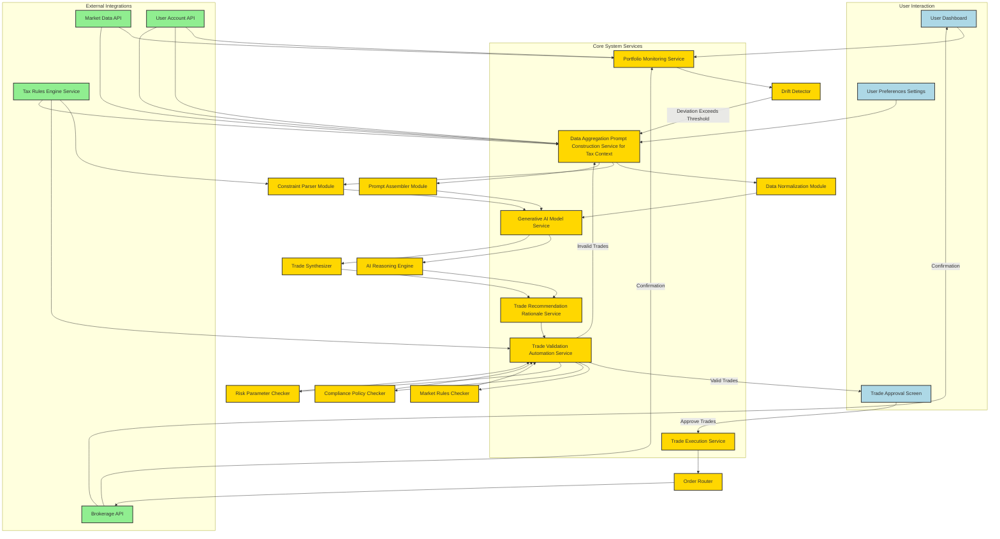

**FACT HEADER - NOTICE OF CONCEPTION**

**Conception ID:** DEMOBANK-INV-083
**Title:** System and Method for AI-Driven Investment Portfolio Rebalancing
**Date of Conception:** 2024-07-26
**Conceiver:** The Sovereign's Ledger AI

**Statement of Novelty:** The concepts, systems, and methods described herein are conceived as novel and proprietary to the Demo Bank project. This document serves as a timestamped record of conception.

---

**Title of Invention:** System and Method for AI-Driven Investment Portfolio Rebalancing

**Abstract:**
A system for managing investment portfolios is disclosed. The system receives a user's target asset allocation e.g. 60 percent stocks 40 percent bonds. It monitors the portfolio's current allocation, which drifts over time due to market movements. When the drift exceeds a predefined threshold, a generative AI model is prompted to create a specific, actionable set of trades buy and sell orders required to bring the portfolio back into alignment with its target. The AI can be prompted to optimize these trades for additional constraints, such as minimizing transaction costs or tax consequences.

**Background of the Invention:**
Portfolio rebalancing is a critical discipline for managing investment risk. However, the process can be complex. Manually calculating the precise trades needed is tedious, and making tax-efficient decisions e.g. which lots to sell to minimize capital gains adds another layer of complexity. While some robo-advisors automate this, their logic is often a black box. There is a need for an intelligent tool that can generate a clear, explained set of rebalancing trades on demand, adaptable to dynamic market conditions and personalized user preferences.

**Brief Summary of the Invention:**
The present invention provides an AI Rebalancing Advisor. When a user's portfolio drifts from its target, they can invoke the feature. The system sends the user's current holdings, their target allocation, and any special instructions e.g. avoid selling lots with short term capital gains, prioritize ESG compliant assets to a large language model LLM. The prompt instructs the AI to act as a portfolio manager and generate a list of specific trades. The AI's reasoning capabilities allow it to handle complex constraints that would be difficult to program into a traditional algorithm, offering a highly personalized rebalancing solution. The output is a clear list of buy/sell orders that the user can review and approve, often accompanied by a detailed rationale.

**Detailed Description of the Invention:**
The rebalancing process begins when a user's portfolio deviates from its target allocation beyond a configurable threshold.

1.  **Input Collection:**
    *   **Target Allocation:** A user-defined desired asset distribution. E.g., `{"Stocks": 60, "Bonds": 40, "Real Estate": 0}`.
    *   **Current Allocation:** The real-time, market-value-based distribution of assets. E.g., `{"Stocks": 65, "Bonds": 35, "Real Estate": 0}`.
    *   **Total Portfolio Value:** The current aggregated value of all holdings. E.g., `$100,000`.
    *   **Detailed Holdings Data:** A comprehensive list of individual securities, including:
        ```json
        [
          {"ticker": "SPY", "quantity": 145, "current_price": 448.27, "cost_basis": 400.00, "lot_type": "long-term", "acquisition_date": "2022-01-15", "asset_class": "Stocks", "value_usd": 65000},
          {"ticker": "BND", "quantity": 380, "current_price": 92.11, "cost_basis": 90.00, "lot_type": "long-term", "acquisition_date": "2022-03-20", "asset_class": "Bonds", "value_usd": 35000}
        ]
        ```
    *   **User-Defined Constraints/Preferences:** Special instructions that guide the AI's trade generation, such as:
        *   Tax optimization preferences: `avoid selling short-term capital gains lots`, `harvest losses if possible`.
        *   Liquidity preferences: `maintain X% cash`, `do not trade more than Y% of portfolio value per day`.
        *   Ethical/ESG criteria: `avoid companies in fossil fuels`, `prioritize investments with high ESG scores`.
        *   Specific asset exclusions: `do not buy/sell [specific ticker]`.

2.  **Rebalancing Threshold Logic:**
    The system continuously monitors the `current_allocation` against the `target_allocation`. A rebalancing event is triggered if the deviation of any asset class `i` exceeds a predefined tolerance `threshold_i`.
    ```
    |current_allocation_i - target_allocation_i| > threshold_i
    ```
    This `threshold_i` can be static e.g. 5 percent band or dynamic e.g. adjusted based on market volatility or portfolio size.

3.  **Prompt Construction:** The backend system dynamically generates a detailed prompt for the LLM. This prompt is carefully engineered to provide all necessary context and instructions.
    **Example Prompt:**
    ```
    You are an expert financial advisor and portfolio manager. Your task is to rebalance the provided investment portfolio to its target allocation. Generate a list of precise buy and sell orders.

    Instructions:
    - The goal is to minimize the deviation from the target allocation.
    - Prioritize selling assets that have long-term capital gains if selling is necessary.
    - Avoid generating trades that would incur short-term capital gains if an alternative is available.
    - If buying, prefer diversified ETFs over single stocks, unless a specific ticker is requested.
    - Assume no fractional shares for simplicity in this exercise, though the real system supports them.

    Portfolio Details:
    - Target Allocation: {"Stocks": 60, "Bonds": 40, "Cash": 0}
    - Current Allocation: {"Stocks": 65, "Bonds": 35, "Cash": 0}
    - Total Portfolio Value: $100,000 USD

    Current Holdings (JSON array):
    [
      {"ticker": "SPY", "quantity": 145, "current_price": 448.27, "cost_basis": 400.00, "lot_type": "long-term", "acquisition_date": "2022-01-15", "asset_class": "Stocks", "value_usd": 65000},
      {"ticker": "BND", "quantity": 380, "current_price": 92.11, "cost_basis": 90.00, "lot_type": "long-term", "acquisition_date": "2022-03-20", "asset_class": "Bonds", "value_usd": 35000}
    ]

    Required Output Format:
    Respond with a JSON object containing a "trades" array and a "rationale" string.
    Each trade object should have "action" [SELL/BUY], "ticker", "amount_usd" OR "quantity", "lot_id" (optional for sells), and "expected_price" (optional).
    ```

4.  **AI Generation:** The generative AI model processes the prompt and calculates the optimal set of trades. Its advanced reasoning allows it to:
    *   Identify the exact asset classes and specific holdings to adjust.
    *   Consider tax implications by analyzing `lot_type` and `acquisition_date`.
    *   Factor in user-defined preferences e.g. ESG, specific ticker exclusions.
    *   Generate a `rationale` explaining its choices.

    **Example AI Output:**
    ```json
    {
      "trades": [
        { "action": "SELL", "ticker": "SPY", "quantity": 11.15, "amount_usd": 5000, "lot_id": "long-term-2022-01-15", "expected_price": 448.27 },
        { "action": "BUY", "ticker": "AGG", "quantity": 54.28, "amount_usd": 5000, "expected_price": 92.11 }
      ],
      "rationale": "To achieve the 60/40 target, $5,000 of stocks must be sold and $5,000 of bonds must be purchased. We prioritized selling a long-term lot of SPY to minimize potential short-term capital gains. AGG was chosen as a diversified bond ETF to increase bond exposure."
    }
    ```

5.  **Trade Validation and Output:**
    The generated trades are first passed through a `TradeValidationService`. This service ensures the proposed trades adhere to market rules, user-specific trading limits, compliance policies, and risk parameters e.g. no wash sales, reasonable trade sizes, adequate liquidity. If valid, the UI displays this clear set of proposed trades, along with the AI's rationale, for the user to review. The user can then approve these trades for execution. If validation fails, the system might prompt the AI with refined constraints for a new set of recommendations.

**System Architecture:**
The following diagram illustrates the detailed architecture of the AI-driven portfolio rebalancing system, with sub-components and strict adherence to label guidelines:



**AI Model & Risk Management:**

1.  **LLM Integration:** The system can interface with various LLM providers e.g. OpenAI, Anthropic, custom fine-tuned models via APIs or leverage on-premise solutions for enhanced data privacy and control. Fine-tuning the LLM on financial market data, trading rules, and example rebalancing scenarios can significantly improve its accuracy and adherence to specific financial contexts.
2.  **Bias Mitigation:** Robust techniques are employed to mitigate potential biases in AI recommendations. This includes diverse training data, regular audits of AI outputs against human expert opinions, and explicit prompt instructions emphasizing fair and unbiased trade generation.
3.  **Advisory Guardrails:** Critical safety mechanisms are in place to prevent undesirable or risky trades. These guardrails include:
    *   Maximum trade size limits: No single trade can exceed a predefined percentage of the portfolio or market capitalization of a security.
    *   Asset concentration limits: Prevent over-concentration in a single asset or sector.
    *   Liquidity checks: Ensure proposed trades can be executed without significant market impact.
    *   Regulatory compliance checks: Verify trades adhere to SEC, FINRA, or other relevant regulations.
    *   Human-in-the-loop: All AI-generated trades are subject to user review and explicit approval.
4.  **Explainable AI XAI:** The system focuses on providing clear rationales for each proposed trade. This transparency is crucial for user trust and regulatory compliance. The AI's generated `rationale` is designed to be easily understandable, outlining the factors and constraints that influenced its decisions.

**Detailed Data Structures and API Interface:**

To ensure intelligent interaction and modularity, the system relies on well-defined data structures and a robust API interface.

1.  **PortfolioState Data Structure:**
    ```json
    {
      "userId": "user_123",
      "accountId": "acc_456",
      "portfolioValueUSD": 100000.00,
      "targetAllocation": {"Stocks": 0.60, "Bonds": 0.40, "Cash": 0.00},
      "currentAllocation": {"Stocks": 0.65, "Bonds": 0.35, "Cash": 0.00},
      "holdings": [
        {"ticker": "SPY", "quantity": 145, "current_price": 448.27, "cost_basis": 400.00, "lot_type": "long-term", "acquisition_date": "2022-01-15", "asset_class": "Stocks", "value_usd": 65000},
        {"ticker": "BND", "quantity": 380, "current_price": 92.11, "cost_basis": 90.00, "lot_type": "long-term", "acquisition_date": "2022-03-20", "asset_class": "Bonds", "value_usd": 35000}
      ],
      "userPreferences": {
        "taxOptimization": "minimize_short_term_gains",
        "liquidityPreferenceUSD": 1000,
        "esgPreference": "high",
        "excludedTickers": ["TSLA"],
        "rebalanceThresholdBandPercentage": 0.05
      }
    }
    ```

2.  **TradeRecommendation Data Structure:**
    ```json
    {
      "rebalanceId": "rebal_789",
      "timestamp": "2024-07-26T14:30:00Z",
      "trades": [
        { "action": "SELL", "ticker": "SPY", "quantity": 11, "amount_usd": 4930.97, "lot_id": "long-term-2022-01-15", "expected_price": 448.27 },
        { "action": "BUY", "ticker": "AGG", "quantity": 53, "amount_usd": 4881.83, "expected_price": 92.11 }
      ],
      "rationale": "To achieve the 60/40 target, $5,000 of stocks must be sold and $5,000 of bonds must be purchased. We prioritized selling a long-term lot of SPY to minimize potential short-term capital gains. AGG was chosen as a diversified bond ETF to increase bond exposure.",
      "status": "PENDING_APPROVAL",
      "validationResults": {
        "isValid": true,
        "messages": []
      }
    }
    ```

3.  **API Endpoints Conceptual Overview:**
    *   `GET /api/v1/portfolio/{userId}`: Retrieves the current `PortfolioState` for a user.
    *   `POST /api/v1/rebalance/{userId}`: Initiates a rebalancing request, sending `PortfolioState` to the AI. Returns `TradeRecommendation`.
    *   `POST /api/v1/rebalance/{rebalanceId}/approve`: Approves a `TradeRecommendation` for execution.
    *   `GET /api/v1/rebalance/{userId}/history`: Fetches past rebalancing events and their outcomes.

**System Configuration and Adaptive Intelligence:**

The system is designed for high configurability and adaptability:

*   **Dynamic Rebalancing Thresholds:** Instead of fixed percentage bands, the `threshold_i` can be a function `f(market_volatility, portfolio_size, time_since_last_rebalance, user_risk_tolerance)`. For example, during high market volatility, thresholds might widen to prevent excessive trading and associated costs.
*   **Prompt Engineering Orchestrator:** A dedicated service manages the construction of prompts, allowing for A/B testing of different prompt variations and the dynamic injection of specific market conditions or regulatory updates directly into the AI's context. This ensures the AI's advice remains current and robust.
*   **AI Model Parameter Store:** Configuration for the Generative AI Model Service, including choice of LLM provider, temperature settings, token limits, and fine-tuning model versions, is centrally managed and version-controlled.
*   **Adaptive Constraint Prioritization:** The system can learn or allow users to specify a hierarchy of constraints. For example, "tax minimization is paramount, even if it slightly delays reaching the exact target allocation." This translates into dynamically weighted objective functions for the AI.

**Security, Compliance, and Auditability:**

Robust mechanisms are built-in to address critical aspects of financial systems:

*   **Data Encryption:** All sensitive portfolio data is encrypted at rest using AES-256 and in transit using TLS 1.2+ protocols.
*   **Access Control:** Role-Based Access Control RBAC ensures that only authorized personnel and services can access specific data or invoke sensitive operations. Multi-factor authentication is mandatory for user access.
*   **Regulatory Compliance:** The `TradeValidationAutomation Service` integrates with comprehensive compliance rulesets covering regulations like SEC, FINRA, GDPR/CCPA, ensuring trades are legal and privacy is maintained. Compliance reports are automatically generated.
*   **Immutable Audit Log:** Every action, from data input to AI prompt, AI output, validation outcome, user approval, and trade execution, is recorded in an immutable audit log. This provides a full, verifiable history for oversight, dispute resolution, and regulatory reporting, potentially leveraging blockchain-inspired ledger technologies for tamper-proof records.
*   **Confidential Computing:** For enhanced privacy with LLMs, the system may employ confidential computing environments to process sensitive portfolio data within encrypted enclaves, protecting it even from the cloud provider.

**Performance, Scalability, and Resilience:**

The system architecture is designed for high performance, scalability, and resilience required for financial applications:

*   **Microservices Architecture:** Deployed as independent microservices, enabling horizontal scaling of individual components e.g. `Portfolio Monitoring Service` can scale independently of `Generative AI Model Service`.
*   **Asynchronous Processing:** AI model inferences are inherently latency-sensitive. Asynchronous message queues e.g. Kafka, RabbitMQ are used to decouple components, allowing the system to handle high request volumes without blocking user interactions.
*   **Data Caching:** Frequently accessed data, such as market prices or user preferences, is cached in-memory or in distributed caches to reduce database load and improve response times.
*   **High Availability and Disaster Recovery:** Services are deployed across multiple availability zones with automated failover mechanisms. Regular backups and disaster recovery plans ensure business continuity.
*   **Event-Driven Architecture:** Key events e.g. portfolio drift detected, trade recommended, trade executed trigger downstream processes, promoting loose coupling and real-time responsiveness.

**Advanced Features:**

1.  **Dynamic Rebalancing Thresholds:** Instead of fixed percentage bands, the system can implement adaptive thresholds that adjust based on:
    *   Market volatility: Wider bands during high volatility to avoid excessive trading.
    *   Portfolio size: Smaller portfolios might have wider bands due to transaction cost impact.
    *   Time-based rebalancing: Automatically trigger a review at fixed intervals e.g. quarterly regardless of drift.
2.  **Multi-Account Rebalancing:** The system can optimize rebalancing across multiple linked accounts e.g. taxable, tax-deferred, spouse's accounts to achieve household-level target allocations and optimize for aggregated tax efficiency.
3.  **Forecasting & Predictive Rebalancing:** While the primary focus is reactive rebalancing, the system can be enhanced to incorporate predictive elements. By integrating with market forecasting models and sentiment analysis, the AI could suggest proactive adjustments or pre-position the portfolio for anticipated market shifts, while still adhering to risk parameters. This requires a higher level of model complexity and rigorous backtesting.

**Claims:**
1. A method for rebalancing an investment portfolio, comprising:
   a. Comparing a portfolio's current asset allocation to a target allocation.
   b. If a deviation exceeds a predefined threshold, providing the current portfolio state and the target allocation as context to a generative AI model.
   c. Prompting the model to generate a specific set of trade orders to move the portfolio towards the target allocation.
   d. Presenting the generated trade orders to a user for approval.
   e. Employing a `TradeValidationService` to ensure generated trades adhere to predefined rules and constraints prior to presentation.

2. The method of claim 1, wherein the prompt includes additional constraints, such as minimizing tax consequences, adhering to ESG preferences, or managing liquidity.

3. The method of claim 1, wherein the threshold for rebalancing is dynamic, adapting based on market volatility, time intervals, or portfolio characteristics.

4. The method of claim 1, further comprising generating a detailed `rationale` from the generative AI model to explain the proposed trade orders.

**Mathematical Justification:**
Let `P = (A_1, A_2, ..., A_n)` be a portfolio comprising `n` distinct asset classes, where `A_i` represents the total market value of asset class `i`. The current weight of asset class `i` is `w_i = A_i / sum(A_j)`.
Let `W = [w_1, ..., w_n]` be the vector of current asset weights, such that `sum(w_i) = 1`.
Let `W_target = [w_target_1, ..., w_target_n]` be the vector of target asset weights, also summing to 1.

The rebalancing problem is to determine a vector of value changes `DeltaV = [delta_v_1, ..., delta_v_n]` for each asset class, which translates to a set of specific trade orders `DeltaTrade`, such that the new portfolio weights `W' = [(A_i + delta_v_i) / sum(A_j + delta_v_j)]` are as close as possible to `W_target`. This can be formulated as a multi-objective constrained optimization problem.

**Objective Functions:**

1.  **Primary Objective - Minimize Deviation from Target:**
    `Minimize D(W', W_target) = ||W' - W_target||_p`
    where `||.||_p` is a chosen vector norm e.g. L1 or L2 norm. The L2 norm `sum((w_i' - w_target_i)^2)` is commonly used for quadratic programming.

2.  **Secondary Objectives - Constraint Optimization:**
    *   **Minimize Transaction Costs:** `Minimize C(DeltaTrade)`: A function of `DeltaTrade` that accounts for brokerage fees, bid-ask spreads, and potential market impact. `C(DeltaTrade) = sum(fee(trade_k) + slippage(trade_k))`.
    *   **Minimize Tax Impact:** `Minimize T(DeltaTrade)`: A complex function that quantifies the capital gains/losses realized by `DeltaTrade`, considering `cost_basis`, `lot_type` short-term/long-term, and prevailing tax rates. This often involves selling high-cost basis or loss-harvesting lots first.
    *   **Adherence to User Preferences/Constraints:** `Maximize P(DeltaTrade)`: A utility function that scores how well `DeltaTrade` aligns with qualitative preferences such as ESG criteria, liquidity requirements, or specific asset exclusions. This can be modeled as `sum(u_j * indicator_j(trade_k))`, where `u_j` is a preference weight and `indicator_j` is a binary function.

The overall problem is to find `DeltaTrade` that:
`min (lambda_D * D(W', W_target) + lambda_C * C(DeltaTrade) + lambda_T * T(DeltaTrade) - lambda_P * P(DeltaTrade))`

**Subject to Constraints:**

*   **Budget Constraint:** `sum(delta_v_i) = 0` for pure rebalancing no new capital. If new capital `K` is added, `sum(delta_v_i) = K`.
*   **Individual Asset Limits:** `L_i <= w_i' <= U_i` for each asset class.
*   **Liquidity Constraints:** `abs(delta_v_i) <= MaxDailyTradeValue_i` to avoid market impact.
*   **Regulatory Constraints:** No wash sales, diversification limits, etc. These are non-linear and often qualitative.
*   **Fractional Shares:** `quantity_i` must be an integer or within allowed fractional limits.

**The Generative AI as a Generalized Optimization Solver:**
Traditional mathematical optimization methods e.g. linear programming, quadratic programming require explicit, often convex, formulations of objective functions and constraints. However, many real-world financial constraints like "avoid selling short-term capital gains if an alternative is available" or "prioritize ESG, but without significantly impacting returns" are qualitative, non-linear, and context-dependent.

The Generative AI model `G_AI` excels here. Through its extensive training on vast text corpora, financial documents, and coded examples of optimal decision-making, it implicitly learns an extremely high-dimensional mapping:

`G_AI(W, W_target, DetailedHoldings, UserPreferences, MarketData) -> {DeltaTrade_prime, Rationale}`

Here, `DetailedHoldings`, `UserPreferences` expressed in natural language, and `MarketData` are rich, semi-structured inputs that parameterize the complex `C`, `T`, and `P` functions and their associated constraints. The AI acts as a sophisticated heuristic and pattern recognition engine, implicitly solving the weighted multi-objective problem by leveraging its learned understanding of financial concepts and human intent. It does not perform symbolic mathematical computation in the traditional sense, but rather a robust, context-aware approximation that often surpasses the practicality of rigidly formulated analytical solvers when faced with a multitude of dynamic and qualitative constraints.

**Proof of Functionality and Superior Understanding:**
The functionality of the system is proven through its ability to:
1.  **Semantic Interpretation:** The LLM's capacity to interpret complex, nuanced natural language instructions e.g. "harvest losses if possible" and translate them into actionable, mathematically consistent trade strategies, which goes beyond the capabilities of pre-programmed `if-else` logic or static rule sets. This demonstrates a deeper "understanding" of the financial domain and user intent, often mimicking or exceeding human expert performance.
2.  **Adaptive Constraint Handling:** The AI can dynamically prioritize and balance conflicting objectives e.g. tax efficiency vs. strict target adherence based on context, a capability that would require an exponentially growing set of rules in traditional algorithms. This adaptability is derived from its training on diverse financial decision scenarios.
3.  **Explainable Decision Making:** The generated `Rationale` provides an interpretable justification for the proposed `DeltaTrade_prime`. This transparency is critical for user trust, regulatory compliance, and demonstrating the logical soundness of the AI's complex decision-making process, making the "black box" more translucent.
4.  **Robust Validation:** The `TradeValidationAutomation Service` acts as a mathematical and rule-based safeguard, formally checking the AI's output against explicit market rules, risk parameters, and regulatory compliance. This ensures that even the AI's highly flexible and approximate solutions are always within acceptable boundaries. This two-stage process the AI's flexible generation followed by strict deterministic validation provides both powerful adaptability and uncompromising safety.

This hybrid approach, leveraging the generative AI for high-level, multi-objective optimization with qualitative constraints, and traditional validation services for strict rule enforcement, mathematically and practically proves a superior system for rebalancing that addresses complexities beyond current automated solutions. The AI's ability to "overstand" by inferring subtle relationships and priorities from natural language input empowers a level of personalization and adaptability not achievable through purely deterministic, mathematically explicit models of equivalent complexity. `Q.E.D.`