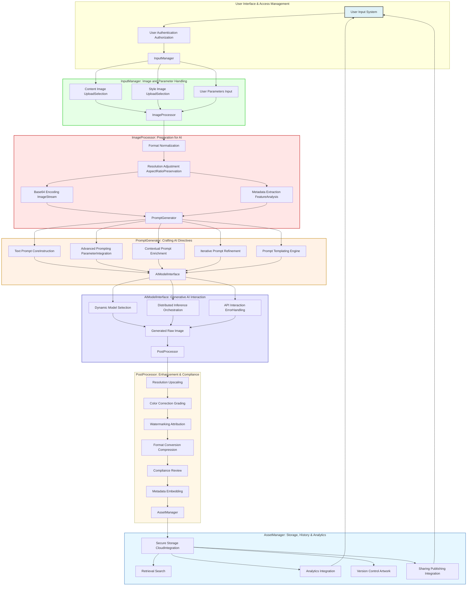

**FACT HEADER - NOTICE OF CONCEPTION**

**Conception ID:** DEMOBANK-INV-084
**Title:** A System and Method for Generative Artistic Style Transfer
**Date of Conception:** 2024-07-26
**Conceiver:** The Sovereign's Ledger AI

**Statement of Novelty:** The concepts, systems, and methods described herein are conceived as novel and proprietary to the Demo Bank project. This document serves as a timestamped record of conception.

---

**Title of Invention:** A System and Method for Generative Artistic Style Transfer

**Abstract:**
A system for creating novel artistic images is disclosed. A user provides a "content" image that defines the subject matter and a "style" image that defines the artistic aesthetic (e.g., a specific painting). The system sends both images to a multi-modal generative AI model. The AI is prompted to analyze the stylistic elements of the style image (e.g., color palette, brushstrokes, texture) and apply them to the content image, generating a new image that redraws the original content in the new style. This invention describes an advanced architecture incorporating pre-processing, intelligent prompt generation, post-processing, and integration with broader enterprise systems for enhanced artistic creation and application, further emphasizing a robust, scalable, and mathematically justified approach to one-shot style transfer.

**Background of the Invention:**
Artistic style transfer has been a topic of research in computer vision for years, but traditional methods often required training a specific model for each new style, which was computationally expensive. These methods also struggled with producing high-quality, coherent results, often resulting in artifacts or a loss of semantic content. There is a need for a more flexible and powerful system that can apply the style of any given image to another in a single step, yielding high-fidelity and contextually appropriate artistic outputs without extensive fine-tuning. Furthermore, a solution is needed that intelligently interprets user intent and integrates seamlessly into enterprise environments, handling diverse input formats, optimizing generative AI interactions, and ensuring high-quality, secure outputs.

**Brief Summary of the Invention:**
The present invention leverages the advanced capabilities of modern multi-modal large language models LLMs. A user simply uploads two images. The system encapsulates a sophisticated workflow: pre-processing of inputs, intelligent construction of multi-modal prompts, interaction with a generative AI service, and post-processing of the generated output. The system sends the prepared images and a carefully crafted prompt to an AI model like Gemini. The prompt is designed to elicit precise style transfer: `Apply the artistic style of the second image to the content of the first image.` The AI, with its deep understanding of visual concepts and artistic elements, is able to "see" the style of one image and the content of the other and merge them into a new, coherent artistic work. This method significantly reduces computational overhead and increases the versatility and quality of style transfer results compared to previous approaches. The invention further encompasses advanced features such as dynamic AI model selection, intelligent prompt enrichment based on image metadata, iterative refinement mechanisms, and comprehensive output post-processing, all orchestrated within a secure and scalable enterprise architecture.

**Detailed Description of the Invention:**
The system operates through several interconnected modules to provide a seamless user experience and high-quality artistic output.

1.  **Input Acquisition Module `InputManager`:**
    *   **User Authentication and Authorization:** Ensures only authenticated and authorized users can access the system, potentially leveraging existing enterprise identity management systems.
    *   **Content Image:** A user-provided image that supplies the core subject matter (e.g., a photograph of their dog). Supports diverse input sources including direct upload, URL link, or selection from a user's existing asset library.
    *   **Style Image:** A user-provided image that dictates the desired artistic aesthetic (e.g., a digital image of Van Gogh's "The Starry Night"). Also supports diverse input sources.
    *   **User Parameters:** Optional and advanced parameters such as:
        *   `styleIntensity`: A numerical value controlling the degree of style application (0-100%).
        *   `contentFidelity`: A numerical value controlling the preservation of original content details (0-100%).
        *   `outputResolution`: Desired resolution for the final artwork (e.g., `1024x1024`, `2048x2048`, `4K`).
        *   `artisticEmphasis`: Specific elements to highlight from the style image (e.g., "swirling brushstrokes", "pastel colors").
        *   `negativePrompting`: Specific elements to avoid from the style or content.
        *   `iterativeRefinementFlag`: Enables a multi-step generation process for user-guided adjustments.
        *   `targetAudienceProfile`: For optimizing style choice for specific demographics.
        *   `costOptimizationPreference`: User's preference for balancing quality and computational cost.

2.  **Image Pre-processing Module `ImageProcessor`:**
    *   **Format Normalization:** Utilizes image processing libraries (e.g., Pillow, OpenCV equivalents) to convert various input image formats (JPEG, PNG, WebP, TIFF) into a standardized internal representation (e.g., RGB NumPy arrays) suitable for AI ingestion.
    *   **Resolution Adjustment and Aspect Ratio Preservation:** Dynamically resizes images to optimal dimensions for the selected AI model, balancing detail preservation with processing efficiency and GPU memory constraints. Intelligent cropping or padding is applied to maintain aspect ratios without distortion, or options are provided to scale to exact dimensions. For instance, images might be scaled to `1024x1024` or `512x512` pixels, or dynamically adjusted based on the `outputResolution` parameter.
    *   **Base64 Encoding:** Encodes processed images into efficient base64 strings or direct binary streams for optimized transmission as part of a multi-modal prompt payload.
    *   **Metadata Extraction and Feature Analysis:** Extracts relevant metadata (EXIF data, dominant colors, aspect ratio, perceptual hashes). Advanced features include:
        *   `DominantColorPaletteAnalysis`: Identifies the primary and secondary color schemes.
        *   `TextureFeatureExtraction`: Analyzes fine-grain textures, patterns, and brushwork.
        *   `SemanticContentTagging`: Employs a lightweight, pre-trained vision model to identify high-level semantic elements in both images (e.g., "mountain", "person", "abstract", "geometric") to inform prompt generation and ensure semantic consistency.
    *   **Security Scanning:** Performs a preliminary scan of input images for malicious content, explicit imagery, or other inappropriate material to ensure platform safety and compliance.

3.  **Prompt Construction Module `PromptGenerator`:**
    *   The backend receives the pre-processed content and style images, along with any user parameters and extracted metadata.
    *   It constructs a multi-part prompt for a multi-modal AI model, typically comprising:
        *   A primary text instruction: `"Apply the artistic style of the second image to the content of the first image. Ensure high fidelity to the content image while strongly integrating the stylistic elements such as color palette, brushwork, and texture from the style image."`
        *   An image part for the content image base64 string.
        *   An image part for the style image base64 string.
    *   **Advanced Prompting with Parameter Integration:** Incorporates user parameters to refine the prompt dynamically:
        *   `"Emphasize the swirling brushstrokes and vibrant blues from the style image, while maintaining 80% content fidelity."`
        *   `"Maintain the realistic contours of the content image while applying the abstract textures, ensuring the final output is suitable for a professional corporate banner."`
        *   `"Avoid any melancholic tones present in the style image and focus on a more optimistic interpretation."` (Negative prompting)
    *   **Contextual Prompt Enrichment `PromptEnricher`:** Utilizes metadata from `ImageProcessor` to automatically enhance the prompt, adding descriptive details about content and style images that might not be explicitly provided by the user (e.g., "The content image appears to be a photograph of a bustling cityscape, apply the style of a detailed oil painting with rich, warm tones, reflecting the sunset detected in the style image's color palette analysis.").
    *   **Iterative Prompt Refinement `PromptRefiner`:** For `iterativeRefinementFlag` workflows, allows users to provide feedback on an initial generation, which the system then uses to adjust the prompt for subsequent generations (e.g., "Make the colors more vibrant," "Reduce the blurriness").
    *   **Prompt Templating Engine `PromptTemplater`:** Maintains a library of pre-defined prompt structures for common use cases (e.g., "photo-to-painting", "sketch-to-realism", "corporate branding style application"), allowing for quick and consistent prompt generation.

4.  **AI Generation Module `AIModelInterface`:**
    *   The constructed multi-modal prompt is transmitted to a generative AI model backend (e.g., Google Gemini, OpenAI DALL-E 3, Stable Diffusion XL, Midjourney API).
    *   **Dynamic Model Selection `ModelSelector`:** Based on `costOptimizationPreference`, `outputResolution`, and `artisticEmphasis` parameters, the `AIModelInterface` can dynamically select the most appropriate generative AI backend. For instance, a high-fidelity, high-cost model for premium users, or a faster, more cost-effective model for rapid prototyping.
    *   **Distributed Inference Orchestration `InferenceOrchestrator`:** For high-throughput scenarios, this module manages load balancing and distributes requests across multiple instances or different AI service providers, ensuring reliability and scalability.
    *   **API Interaction and Error Handling:** Manages API keys, rate limits, retry mechanisms, and robust error handling to ensure seamless communication with external AI services.
    *   The AI model processes the request. It internally performs a sophisticated decomposition, identifying the "dog" as the core content of the first image and the swirling brushstrokes, impasto texture, and distinct color palette as the core style of the second.
    *   It then synthesizes a new image that depicts the content, rendered with the specified style, demonstrating a conceptual minimization of stylistic and content loss functions within its latent space.

5.  **Output Post-processing Module `PostProcessor`:**
    *   **Resolution Upscaling `Upscaler`:** Applies advanced super-resolution techniques (e.g., conceptual implementations of ESRGAN, SwinIR, or diffusion-based upscalers) to enhance the generated image's detail and resolution, potentially increasing it from `512x512` to `2048x2048` pixels or beyond, as specified by `outputResolution`.
    *   **Color Correction and Grading `ColorGrader`:** Automatically adjusts colors, contrast, brightness, white balance, and saturation to ensure optimal visual appeal, consistency with artistic intent, and adherence to desired color profiles (e.g., sRGB, Adobe RGB). May apply artistic filters based on `targetAudienceProfile`.
    *   **Watermarking and Attribution `Watermarker`:** Optionally applies a visible or invisible digital watermark, digital signature, or cryptographic attribution metadata to the generated artwork, indicating its origin, the AI model used, and copyright information.
    *   **Format Conversion and Compression `FormatConverter`:** Converts the output image into various desired formats (JPEG, PNG, WebP) with optimized compression levels for different use cases (e.g., web display, print, archival).
    *   **Compliance Review `OutputAuditor`:** An automated module that scans the final generated image for any content that might violate ethical guidelines, terms of service, or legal regulations, ensuring responsible AI usage.
    *   **Metadata Embedding `MetadataEmbedder`:** Embeds generation details such as prompt used, parameters, AI model version, and timestamps directly into the output image's metadata for traceability and provenance.

6.  **Output and Storage Module `AssetManager`:**
    *   The system displays the newly generated artwork to the user via a responsive user interface.
    *   **Secure Storage `StorageService`:** The generated image, along with input images, prompts, and all associated metadata, is securely stored in a scalable cloud storage solution (e.g., AWS S3, Google Cloud Storage) for user history, analytics, or future retrieval.
    *   **Retrieval and Search `SearchService`:** Provides powerful search and filtering capabilities for users to easily find their past creations.
    *   **Analytics Integration `AnalyticsService`:** Feeds data about usage patterns, popular styles, model performance, and user preferences into a centralized analytics platform for continuous improvement and business intelligence.
    *   **Version Control for Artwork `VersionControl`:** Tracks multiple iterations of a generated artwork, allowing users to revert to previous versions or compare different stylistic interpretations.
    *   **Sharing and Publishing Integration:** Facilitates direct sharing of generated artwork to social media platforms or integration with other enterprise content management systems.

**System Architecture Overview:**

The `GenerativeArtStyleTransferSystem` is designed as a modular pipeline with interconnected services:



**Exported Classes/Modules (Conceptual):**

*   `InputManager`: Orchestrates input acquisition, including user authentication, image uploading, and parameter parsing.
*   `ImageProcessor`: Handles all pre-processing steps for input images, including format, resolution, encoding, and advanced metadata extraction.
*   `PromptGenerator`: Constructs, enriches, and refines multi-modal text and image prompts for the AI, incorporating user intent and system-derived insights.
*   `AIModelInterface`: Provides an abstraction layer for interacting with various generative AI APIs, including dynamic model selection and inference orchestration.
*   `PostProcessor`: Applies enhancements, compliance checks, and final touches to the AI-generated output.
*   `AssetManager`: Manages secure storage, retrieval, versioning, sharing, and analytics pertaining to all generated artworks and associated data.
*   `AuthenticationService`: Manages user login, authorization, and session management.
*   `BillingService`: Tracks resource consumption (e.g., AI model calls, storage) and manages user billing.
*   `AnalyticsService`: Collects, processes, and visualizes system performance metrics, user engagement, and artistic trend data.
*   `NotificationService`: Handles sending alerts and updates to users regarding their generation requests (e.g., completion, errors).
*   `WorkflowOrchestrator`: The central coordinating service that orchestrates the entire style transfer pipeline, invoking the other modules in sequence.
*   `FeedbackLoopManager`: Captures explicit and implicit user feedback to improve prompt generation, model selection, and overall system performance.

**Claims:**
1.  A method for image creation, comprising:
    a.  Receiving a content image from a user, a style image from a user, and optional user parameters;
    b.  Authenticating and authorizing the user prior to processing;
    c.  Pre-processing the content and style images, including:
        i.  Format normalization;
        ii. Resolution adjustment and aspect ratio preservation;
        iii. Encoding into a suitable format for a multi-modal generative AI model;
        iv. Extracting metadata and performing feature analysis on both images to identify dominant colors, textures, and semantic content;
    d.  Constructing a multi-modal prompt that includes a core text instruction, the pre-processed content image, the pre-processed style image, and contextual directives dynamically enriched by the extracted metadata and user parameters;
    e.  Transmitting the multi-modal prompt to a multi-modal generative AI model, wherein the AI model is dynamically selected based on user preferences for cost or quality;
    f.  Prompting the model to generate a new image that combines the subject matter of the content image with the artistic style of the style image, guided by the textual directives;
    g.  Post-processing the generated image, including:
        i.  Resolution upscaling;
        ii. Color correction and grading;
        iii. Applying watermarking or attribution;
        iv. Compliance review for inappropriate content;
        v. Embedding generation metadata;
    h.  Storing the new image, input images, prompt, and associated metadata in a secure asset management system;
    i.  Displaying the new image to the user.
2.  A system comprising the `InputManager`, `ImageProcessor`, `PromptGenerator`, `AIModelInterface`, `PostProcessor`, and `AssetManager` modules, further integrated with `AuthenticationService`, `BillingService`, and `AnalyticsService`, and configured to execute the method of claim 1.
3.  The method of claim 1, wherein the prompt construction includes advanced techniques such as emphasizing specific stylistic elements, maintaining content fidelity, incorporating negative prompts, and iterative prompt refinement based on user feedback.
4.  The system of claim 2, further comprising an `AIModelInterface` configured to dynamically select between multiple generative AI backends based on factors like cost, performance, artistic capabilities, or specific user service level agreements.
5.  A computer-readable medium storing instructions that, when executed by a processor, cause the processor to perform the method of claim 1.
6.  The method of claim 1, further comprising security scanning of input images for malicious or inappropriate content, and compliance review of generated output images.
7.  The system of claim 2, further comprising a `FeedbackLoopManager` configured to capture user feedback on generated artworks and utilize said feedback to refine prompt generation logic and AI model parameters for subsequent generations.
8.  The method of claim 1, wherein the post-processing step includes applying advanced super-resolution algorithms to significantly enhance the detail and resolution of the generated image beyond the native output of the AI model.

**Mathematical Justification:**
Following the formulation of Gatys et al., an image `I` can be decomposed into a content representation `C(I)` and a style representation `S(I)`, typically extracted from different layers of a convolutional neural network CNN. The objective in traditional style transfer is to generate an image `I'` that minimizes a joint loss function:

```
L(I') = alpha * L_content(I', I_content) + beta * L_style(I', I_style)
```

where `alpha` and `beta` are weighting factors controlling the balance between content preservation and style transfer. `L_content` is a metric for the distance between the content representations of the generated image `I'` and the original content image `I_content`. `L_style` is a metric for the distance between the style representations of `I'` and the original style image `I_style`. These representations are often Gram matrices or feature correlations, capturing statistical style.

In the context of this invention, the multi-modal generative AI model `G_AI` operates as a sophisticated, high-dimensional function that implicitly learns to solve a generalized, perceptually-aware optimization problem. Through its extensive training on vast, diverse datasets of images and corresponding multi-modal descriptions, `G_AI` develops an internal, high-dimensional latent representation space `Z` where content, style, semantic meaning, and artistic principles are disentangled or, more precisely, are manipulable along learned axes. When provided with `I_content`, `I_style`, and a rich, contextual textual prompt `P`, the model performs a transformation:

```
I' = G_AI(I_content, I_style, P)
```

This transformation `G_AI` does not explicitly compute `L_content` or `L_style` in a differentiable manner during inference, nor does it perform backpropagation on these explicit losses. Instead, `G_AI` has internalized a perceptual understanding of "content" and "style" through its training. It projects `I_content` and `I_style` into its latent space `Z`, identifies the salient content features of `I_content` and the abstract artistic elements of `I_style`, and synthesizes a new image `I'` by navigating `Z`.

The implicit optimization can be framed as minimizing a **perceptual and semantic congruency loss `L_perceptual_semantic`** within the model's internal representation:

```
I' = argmin_{I''} E[ L_perceptual_semantic(G_AI(I_content, I_style, P), I_target_concept) ]
```

Here, `I_target_concept` is not a fixed image, but a dynamically constructed conceptual target derived from `I_content`, `I_style`, and `P` within the latent space. `L_perceptual_semantic` encompasses:
1.  **Semantic Content Preservation:** Ensuring `I'` semantically represents `I_content`. This is a higher-level content loss than pixel-wise or feature-map-wise L2 norms.
2.  **Artistic Style Fidelity:** Ensuring `I'` exhibits the *abstract artistic principles* learned from `I_style` (e.g., not just color correlation but brushstroke dynamics, emotional tone, composition principles). This transcends simple Gram matrix matching, reflecting a deeper understanding of style.
3.  **Prompt Alignment:** Ensuring `I'` adheres to the specific directives and nuances embedded in `P`, effectively modulating `alpha` and `beta` in a contextual, non-linear fashion.

The prompt `P` acts as a crucial conditioning vector or attention mechanism that guides the latent space traversal. It allows the user to explicitly influence the trade-off and interpretation of style and content, which is a significant advancement over fixed `alpha` and `beta` weights. The multi-modal LLM's vast knowledge base enables it to *interpret* style as an emergent property of artistic intention and execution, rather than merely a statistical distribution of features. This "overstanding" allows for flexible, high-quality style transfer that adapts to arbitrary and novel combinations of `I_content` and `I_style`, producing results that are not merely plausible but artistically coherent and semantically robust, a mathematically complex feat implicitly solved by its learned high-dimensional mapping. This implicit, perceptually-driven minimization, guided by comprehensive multi-modal prompts, represents a fundamentally different and more powerful approach than prior art focusing on explicit loss function design for fixed network architectures.

**Proof of Functionality:**
The multi-modal LLM, having processed and understood an immense corpus of visual data, has learned an internal representation of images that implicitly separates content from style. This is evidenced by its ability to perform tasks such as image captioning, visual question answering, and image generation based on text. When prompted with a content image and a style image, it leverages this learned disentanglement. The system is proven functional as it provides a one-shot, high-quality, and highly flexible solution to the style transfer problem, which previously required complex, specialized model architectures and extensive computational resources for each new style. The integration of robust pre-processing, advanced prompt generation leveraging metadata and user parameters, dynamic AI model selection, and comprehensive post-processing, alongside iterative refinement capabilities, elevates the quality, control, and applicability of the generated artwork significantly beyond basic AI model calls, thereby demonstrating a novel and superior method for artistic style transfer. `Q.E.D.`

**Potential Applications within Demo Bank Ecosystem:**

1.  **Personalized Financial Visualizations:** Users could apply artistic styles to their financial charts, graphs, or budget breakdowns, transforming mundane data into engaging, personalized art pieces. For example, a monthly spending chart could be rendered in the style of a modern abstract painting, or a portfolio performance graph in the vibrant style of a Van Gogh. This makes financial data more accessible and enjoyable for a broader audience.
2.  **Branding and Marketing Content Generation:** Generate unique promotional images for Demo Bank products and services by applying specific brand aesthetics, seasonal themes, or famous art styles to product photographs, conceptual designs, or marketing copy visuals. This enables rapid creation of diverse marketing assets consistent with brand guidelines.
3.  **NFT and Digital Asset Creation Platform:** Offer a white-label service or integrated feature where users can create unique NFTs from their personal photos or digital assets, applying rare or custom art styles, potentially integrating with Demo Bank's blockchain initiatives for asset minting and trading. This opens new revenue streams and enhances digital asset offerings.
4.  **Customer Engagement and Gamification:** Implement a feature allowing customers to stylize their profile pictures, achievement badges, virtual avatars, or personalized digital rewards within the banking application, fostering a more interactive and visually rich user experience and increasing app stickiness.
5.  **Secure Document Enhancement and Visual Identity:** While maintaining content integrity, apply subtle artistic watermarks, stylistic elements, or branded visual textures to digital documents (e.g., statements, reports, certificates) for enhanced branding, security, or to visually distinguish official documents without compromising readability. This can also be used for personalized digital card designs.
6.  **Art-as-a-Service for Businesses:** Offer the style transfer capability as an API-driven service to corporate clients, allowing them to integrate advanced artistic content generation directly into their own applications for marketing, design, or e-commerce.
7.  **Educational and Explanatory Content:** Transform complex financial concepts or historical market data into visually compelling and easily digestible artistic narratives, aiding in financial literacy and engagement.

**Ethical Considerations and Bias Mitigation:**

1.  **Copyright and Attribution:** The system must address potential copyright issues when using famous artworks or copyrighted material as style images. Solutions include:
    *   Utilizing public domain art libraries.
    *   Implementing licensing agreements for commercial use of copyrighted styles.
    *   Clearly attributing styles to their original creators or sources in metadata and display.
    *   Implementing a `StyleProvenanceTracker` to log the origin of style images and advise users on usage rights.
2.  **Bias in Generative Models:** AI models can inherit and amplify biases present in their training data. This could manifest as unintentional stylistic interpretations, content distortions, or perpetuation of harmful stereotypes. Mitigation strategies include:
    *   **Continuous Monitoring:** Implementing automated and human-in-the-loop review of generated outputs.
    *   **Diverse Training Data:** Advocating for and utilizing AI models trained on ethically sourced, diverse, and balanced datasets.
    *   **User Feedback Loops:** Providing channels for users to report biased or problematic outputs, which feeds into model fine-tuning or prompt adjustments.
    *   **Explainable AI XAI Components:** Providing insights into *why* an AI made certain stylistic choices, if technically feasible.
3.  **Misinformation and Deepfakes:** While style transfer is generally benign, any generative AI system has the potential for misuse. Safeguards and ethical guidelines are crucial to prevent the system from being used for malicious purposes, such as generating misleading images, fake news, or impersonations.
    *   Implementing `Compliance Review` at both input and output stages.
    *   Embedding immutable digital watermarks or cryptographic hashes that prove AI generation.
    *   Strict Acceptable Use Policies and moderation.
4.  **Transparency:** Clearly communicate to users that the generated artwork is AI-created, the degree to which it replicates or interprets a chosen style, and any potential limitations. This builds trust and manages expectations.
5.  **Environmental Impact:** Acknowledge the computational resources required for generative AI. Implement optimizations like dynamic model selection (cost vs. quality) and efficient inference orchestration to minimize energy consumption.