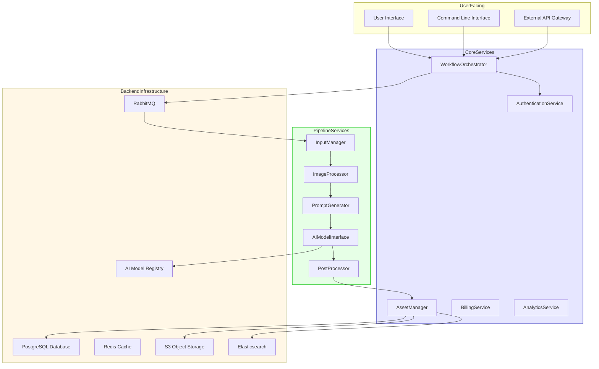
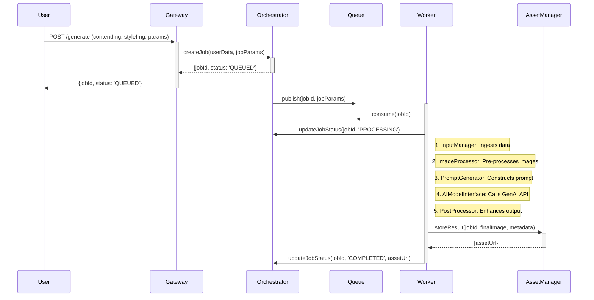
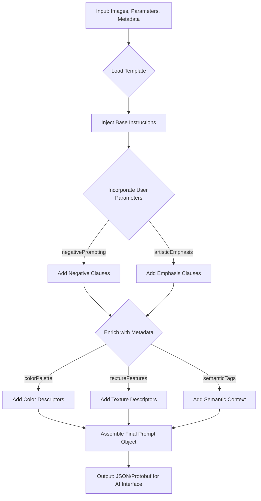
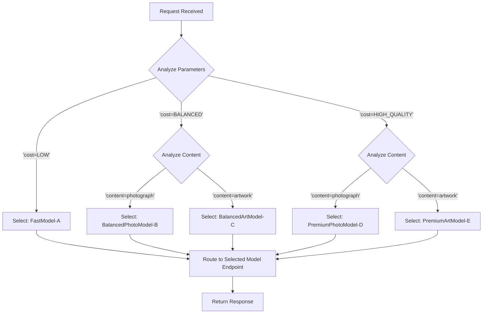
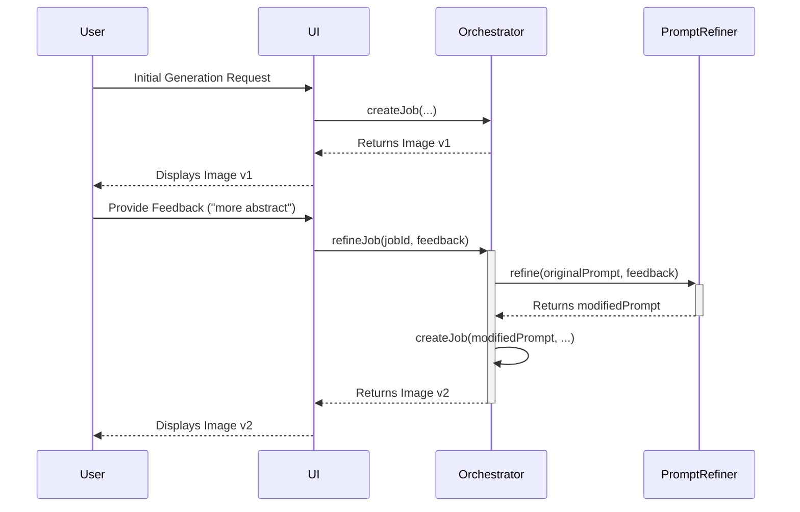
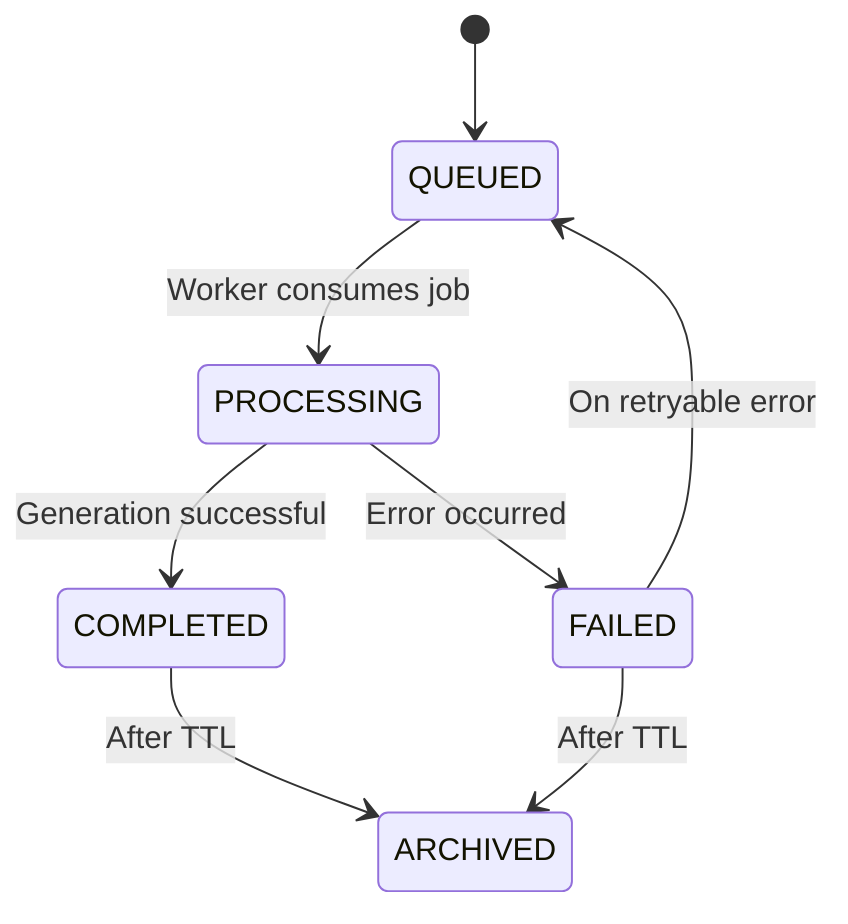
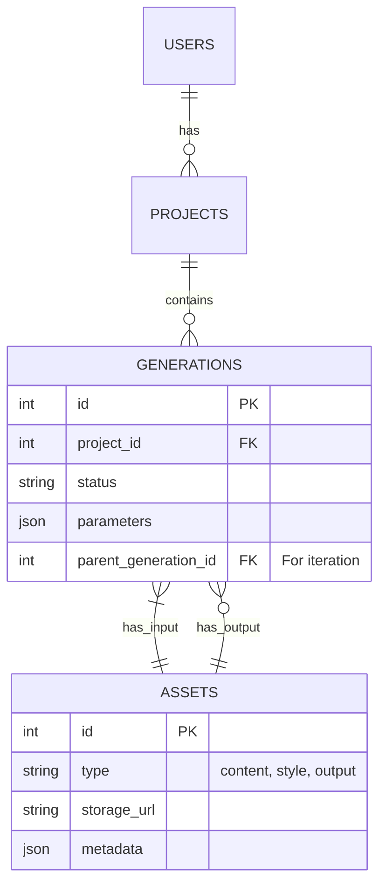
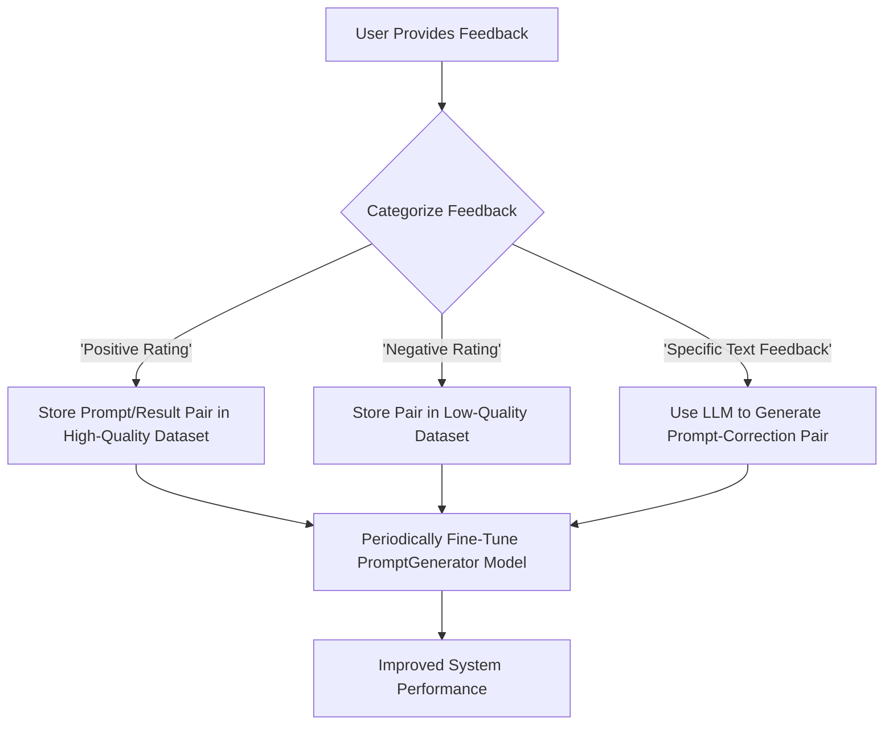
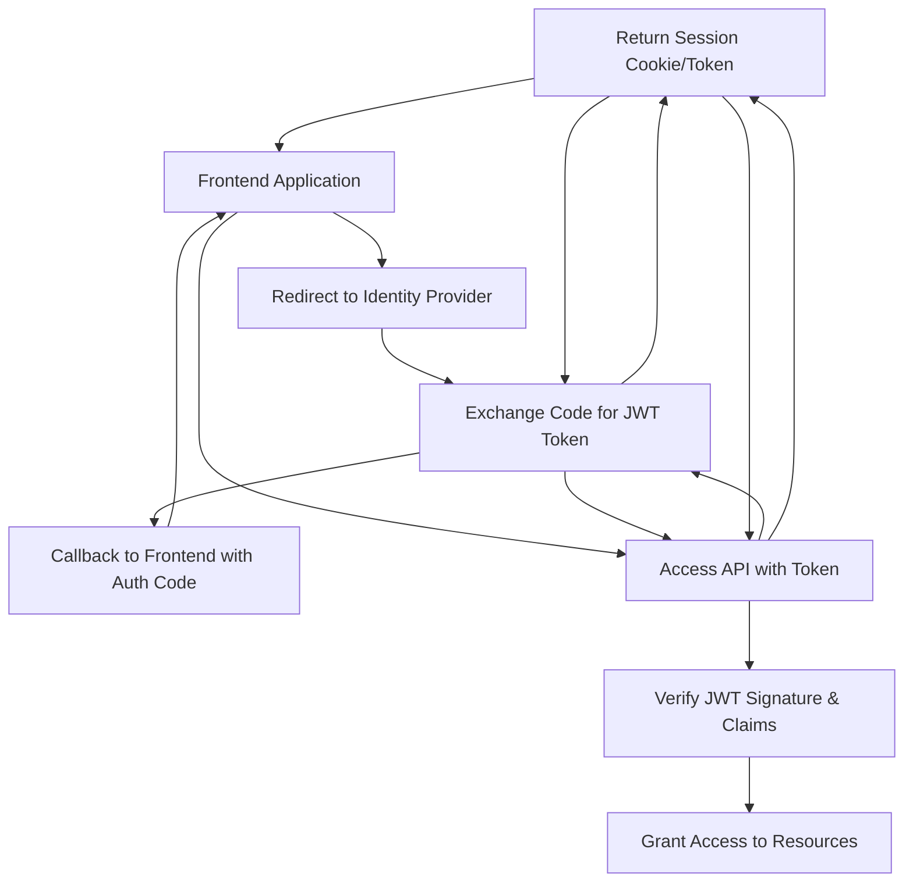

**FACT HEADER - NOTICE OF CONCEPTION**

**Conception ID:** DEMOBANK-INV-084
**Title:** A System and Method for Generative Artistic Style Transfer
**Date of Conception:** 2024-07-26
**Conceiver:** The Sovereign's Ledger AI

**Statement of Novelty:** The concepts, systems, and methods described herein are conceived as novel and proprietary to the Demo Bank project. This document serves as a timestamped record of conception.

---

**Title of Invention:** A System and Method for Generative Artistic Style Transfer

**Abstract:**
A system for creating novel artistic images is disclosed. A user provides a "content" image that defines the subject matter and a "style" image that defines the artistic aesthetic (e.g., a specific painting). The system sends both images to a multi-modal generative AI model. The AI is prompted to analyze the stylistic elements of the style image (e.g., color palette, brushstrokes, texture) and apply them to the content image, generating a new image that redraws the original content in the new style. This invention describes an advanced, enterprise-grade architecture incorporating meticulous pre-processing, intelligent multi-stage prompt generation, dynamic AI model orchestration, and sophisticated post-processing. The system is integrated with broader enterprise systems for enhanced artistic creation, application, and monetization. A key innovation lies in its robust, scalable, and mathematically justified approach to one-shot style transfer, which leverages the implicit, perceptually-aware optimization capabilities of large-scale generative models, guided by a conditioning framework that translates user parameters into precise latent space directives. The system further includes a novel feedback loop mechanism for iterative refinement and continuous model performance improvement, ensuring consistently high-fidelity, contextually appropriate, and ethically sound artistic outputs.

**Background of the Invention:**
Artistic style transfer has been a significant research area in computer vision and artificial intelligence for several decades. Early methods, pioneered by Gatys et al. with Neural Style Transfer (NST), utilized deep convolutional neural networks (CNNs) like VGG-19 to separate and recombine image content and style. These methods, while groundbreaking, were computationally intensive, requiring an iterative optimization process for each new image pair. They often struggled with producing high-resolution outputs, frequently introduced artifacts, and lacked semantic understanding, leading to incoherent style applications (e.g., applying a "face" texture from a portrait's style to a sky in the content image). Subsequent advancements included feed-forward networks that could apply a single, pre-trained style rapidly, but this required training a separate network for each new style, severely limiting flexibility. Generative Adversarial Networks (GANs), particularly architectures like CycleGAN, introduced unpaired image-to-image translation, allowing style transfer without perfectly corresponding image pairs, but were notoriously difficult to train and prone to mode collapse.

The advent of large-scale, pre-trained multi-modal models (e.g., diffusion models conditioned on text and image embeddings like CLIP) has created an opportunity to overcome these limitations. However, a naive application of these models for style transfer yields inconsistent and uncontrollable results. There is a profound need for a comprehensive system that orchestrates the entire workflow—from user intent capture to enterprise-grade delivery. A solution is required that intelligently interprets user intent, translates it into an optimal multi-modal prompt, selects the most appropriate generative AI backend, refines the output, and integrates seamlessly into enterprise environments, handling diverse input formats, optimizing costs, ensuring security, and providing a robust framework for ethical and high-quality artistic generation. This invention addresses this gap by defining such an end-to-end system.

**Brief Summary of the Invention:**
The present invention defines a complete, enterprise-ready system that leverages the advanced capabilities of modern multi-modal large language and diffusion models. A user uploads a content image and a style image. The system encapsulates a sophisticated, multi-stage workflow: (1) An `InputManager` authenticates the user and captures images and a rich set of optional parameters. (2) An `ImageProcessor` normalizes formats, adjusts resolution, performs security scans, and extracts deep metadata, including semantic tags, color palettes, and texture features. (3) A `PromptGenerator` intelligently constructs a multi-modal prompt, dynamically incorporating user parameters and extracted metadata to provide nuanced instructions to the AI. (4) An `AIModelInterface` dynamically selects the optimal generative model from a pool of candidates (e.g., diffusion, GAN, proprietary models) based on cost, quality, and content requirements, and manages the API interaction. (5) The AI model, such as a conditioned diffusion model, interprets the prompt to perform a guided denoising process, effectively synthesizing a new image by projecting the content and style into a shared latent space and merging them according to the prompt's directives. (6) A `PostProcessor` module enhances the raw AI output through super-resolution, color grading, watermarking, and compliance auditing. (7) An `AssetManager` securely stores all artifacts and metadata, enabling versioning, analytics, and integration with enterprise systems. This method significantly reduces computational overhead for the end-user, dramatically increases versatility and quality, and provides an unparalleled level of control compared to all previous approaches.

**Detailed Description of the Invention:**
The system operates through several interconnected, independently scalable microservices to provide a seamless user experience and high-quality artistic output.

1.  **Input Acquisition Module `InputManager`:**
    *   **User Authentication and Authorization:** Integrates with OAuth 2.0 / OpenID Connect providers, ensuring secure, role-based access control (RBAC). A user's access tier (e.g., Free, Pro, Enterprise) may dictate available features, resolution limits, and API rate limits.
    *   **Content Image:** Ingests content images via direct upload (multipart/form-data), URL import, or connection to enterprise Digital Asset Management (DAM) systems via API. Supports formats: JPEG, PNG, WebP, TIFF, HEIC, and raw camera formats (e.g., .CR2, .NEF).
    *   **Style Image:** Ingests style images through the same channels. The system can also offer a curated library of pre-vetted, public domain, or licensed style images.
    *   **User Parameters (JSON Payload):**
        *   `styleIntensity` (float, 0.0 to 1.0): Mathematically, this parameter maps to the guidance scale `w` in classifier-free diffusion guidance, controlling the influence of the style conditioning. $w = 1 + 9 \times \text{styleIntensity}$.
        *   `contentFidelity` (float, 0.0 to 1.0): This influences the noise level `t` at which the diffusion process starts. Higher fidelity means starting from a less-noised version of the content image, e.g., $t_{\text{start}} = T \times (1 - \text{contentFidelity})$, where `T` is the total number of diffusion timesteps.
        *   `outputResolution` (string, e.g., `1024x1024`, `4K`): Specifies the final target resolution after post-processing.
        *   `artisticEmphasis` (array of strings, e.g., `["swirling brushstrokes", "pastel colors"]`): These are injected directly into the positive prompt.
        *   `negativePrompting` (array of strings, e.g., `["blurry", "disfigured"]`): Injected into the negative prompt to guide the generation away from undesirable attributes.
        *   `iterativeRefinementFlag` (boolean): If true, initiates a session-based workflow allowing for feedback.
        *   `targetAudienceProfile` (string, e.g., `corporate`, `youthful`, `luxury`): Informs automatic color grading and style interpretation.
        *   `costOptimizationPreference` (enum, `LOW`, `BALANCED`, `HIGH_QUALITY`): A key input for the `Dynamic Model Selector`.
        *   `seed` (integer): Allows for reproducible generation results.

2.  **Image Pre-processing Module `ImageProcessor`:**
    *   **Format Normalization:** Uses libraries like `libvips` or `Pillow-SIMD` for high-performance conversion to a standardized 32-bit floating-point RGB or LAB color space representation in a NumPy/PyTorch tensor format. The LAB color space is often preferred as it decouples lightness from color channels, allowing for more robust style transfer. $L^*a^*b^*$ transformation:
        $L^* = 116 f(Y/Y_n) - 16$ (Eq 1)
        $a^* = 500 [f(X/X_n) - f(Y/Y_n)]$ (Eq 2)
        $b^* = 200 [f(Y/Y_n) - f(Z/Z_n)]$ (Eq 3)
        where $f(t) = t^{1/3}$ if $t > (6/29)^3$, else $f(t) = (1/3)(29/6)^2 t + 4/29$. (Eq 4-5)
    *   **Resolution Adjustment and Aspect Ratio Preservation:** Resizes images to the optimal input size for the selected AI model (e.g., `1024x1024`). Employs Lanczos resampling for high-quality downscaling. For aspect ratio mismatches, it uses content-aware padding (seam carving or reflection padding) instead of simple black bars.
    *   **Encoding:** Encodes the processed tensor into a suitable format for API transmission, such as Base64-encoded PNG or direct binary transfer using gRPC/Protobuf for efficiency.
    *   **Metadata Extraction and Feature Analysis:**
        *   `DominantColorPaletteAnalysis`: Uses k-means clustering in LAB color space to find `k` dominant colors. The objective function is to minimize the intra-cluster variance: $J = \sum_{i=1}^{k} \sum_{p \in C_i} ||p - \mu_i||^2$. (Eq 6)
        *   `TextureFeatureExtraction`: Applies Gabor filters at different orientations $\theta$ and frequencies $f$ to quantify texture. The Gabor function is a Gaussian kernel modulated by a sinusoidal plane wave: $g(x,y;\lambda,\theta,\psi,\sigma,\gamma) = \exp(-\frac{x'^2+\gamma^2 y'^2}{2\sigma^2})\cos(2\pi\frac{x'}{\lambda}+\psi)$. (Eq 7) The response statistics form a texture descriptor.
        *   `SemanticContentTagging`: Uses a pre-trained efficient vision transformer (e.g., CLIP ViT-B/32) to generate text embeddings for both images. A cosine similarity search against a vocabulary of concepts identifies key semantic tags. $\text{similarity}(A, B) = \frac{A \cdot B}{||A|| ||B||}$. (Eq 8)
        *   `Saliency Mapping`: Generates a saliency map `S(x,y)` for the content image to identify regions of interest, which can be used to guide the AI to preserve detail in important areas.
    *   **Security Scanning:** Scans images using perceptual hashing (e.g., pHash) against a database of known inappropriate content and uses a lightweight NSFW detection model. $d(h_1, h_2) = \text{HammingDistance}(h_1, h_2)$. (Eq 9)

3.  **Prompt Construction Module `PromptGenerator`:**
    *   This module is the core of the system's intelligence, acting as a translator from user intent to AI instruction.
    *   **Prompt Templating Engine `PromptTemplater`:** A library of YAML/Jinja2 templates for various scenarios (`photo-to-painting`, `sketch-to-realism`, `brand-style-application`).
    *   **Contextual Prompt Enrichment `PromptEnricher`:** Automatically augments the prompt. Example logic:
        *   IF `SemanticContentTagging` identifies "portrait" AND `TextureFeatureExtraction` from style image indicates "impasto", THEN ADD "render the portrait with thick, visible impasto brushstrokes".
        *   IF `DominantColorPaletteAnalysis` identifies a warm palette, THEN ADD "using a warm color palette of deep oranges and yellows".
    *   **Parameter Integration:** Dynamically inserts user parameters into the prompt structure.
        *   `artisticEmphasis`: `"...paying special attention to {artisticEmphasis.join(', ')}..."`
        *   `negativePrompting`: The negative prompt will be a combination of default exclusions (`"ugly, tiling, poorly drawn hands"`) and user-provided ones.
    *   **Iterative Prompt Refinement `PromptRefiner`:** In an iterative session, the user provides feedback like "more vibrant colors" or "less abstract". The `PromptRefiner` uses an LLM (e.g., GPT-4) to translate this feedback into concrete prompt modifications. Example: "more vibrant colors" -> increase the weight on color-related keywords in the positive prompt and add "muted, desaturated" to the negative prompt.
    *   **Final Prompt Assembly:** Constructs the final JSON/Protobuf object for the `AIModelInterface`, containing the positive prompt, negative prompt, content image, style image, seed, guidance scale, start timestep, etc.

4.  **AI Generation Module `AIModelInterface`:**
    *   **Dynamic Model Selection `ModelSelector`:** A rule-based or simple ML model that selects the best backend.
        *   `costOptimizationPreference='LOW'`: Select a faster, cheaper model like an optimized Stable Diffusion 1.5 variant.
        *   `costOptimizationPreference='HIGH_QUALITY'` AND `content='photograph'`: Select a high-end, photorealistic diffusion model.
        *   `artisticEmphasis='anime'`: Route to a specialized anime-style model.
        The decision function can be modeled as: $M^* = \text{argmax}_{M \in \mathcal{M}} P(\text{Success} | M, \text{Params}) - \lambda \cdot \text{Cost}(M)$. (Eq 10)
    *   **Distributed Inference Orchestration `InferenceOrchestrator`:** Uses a Kubernetes-based system like KServe or a custom orchestrator built on a message queue (RabbitMQ, SQS). It manages a pool of GPU workers (potentially across different cloud providers), handles auto-scaling based on queue length, and routes requests.
    *   **API Interaction and Error Handling:** Implements resilient communication with API backends, using exponential backoff for retries on transient errors (e.g., HTTP 503) and circuit breaker patterns to prevent cascading failures.
    *   The chosen AI model executes the style transfer. For a diffusion model, this involves a reverse process conditioned on the CLIP embeddings of the prompt (`c_text`), the content image (`c_content`), and the style image (`c_style`). The denoising model $\epsilon_\theta$ predicts the noise to remove at each timestep `t`:
        $\epsilon_t' = \epsilon_\theta(x_t, t, c_{\text{null}})$ (Eq 11, unconditional prediction)
        $\epsilon_t'' = \epsilon_\theta(x_t, t, c_{\text{text}}, c_{\text{content}}, c_{\text{style}})$ (Eq 12, conditional prediction)
        The final guided prediction is a combination:
        $\epsilon_t = \epsilon_t' + w \cdot (\epsilon_t'' - \epsilon_t')$. (Eq 13, classifier-free guidance)
        The next less-noisy image $x_{t-1}$ is then sampled from the distribution $p_\theta(x_{t-1}|x_t)$.

5.  **Output Post-processing Module `PostProcessor`:**
    *   **Resolution Upscaling `Upscaler`:** Uses generative upscalers like Real-ESRGAN or diffusion-based upscalers. These models are trained to "hallucinate" realistic details rather than just interpolating pixels. An upscaler `U` generates a high-resolution image `I_{HR}` from a low-resolution input `I_{LR}`: $I_{HR} = U(I_{LR})$. (Eq 14)
    *   **Color Correction and Grading `ColorGrader`:** Applies automated color adjustments. It can perform histogram matching to a target profile or use 3D Look-Up Tables (LUTs) derived from the `targetAudienceProfile`. For example, a "corporate" profile might apply a LUT that slightly desaturates colors and increases contrast.
    *   **Watermarking and Attribution `Watermarker`:** Applies both visible watermarks (e.g., a semi-transparent logo) and invisible digital watermarks using techniques like Least Significant Bit (LSB) steganography. A cryptographic signature (e.g., using ECDSA) of the image hash and its metadata is also embedded. Signature $S = \text{Sign}(\text{PrivateKey}, \text{SHA256}(I_{\text{final}} || \text{Metadata}))$. (Eq 15)
    *   **Format Conversion and Compression `FormatConverter`:** Uses content-aware compression. For images with large areas of flat color, PNG is preferred. For photographic content, WebP or JPEG XL is used with optimized quality settings determined by a metric like SSIM (Structural Similarity Index).
    *   **Compliance Review `OutputAuditor`:** Scans the final image again for any policy violations that might have been introduced during generation. This is a critical safety step.
    *   **Metadata Embedding `MetadataEmbedder`:** Uses ExifTool or similar libraries to embed all generation parameters, hashes of input images, AI model version, and the cryptographic signature into the final image's EXIF/XMP metadata fields for full provenance tracking.

6.  **Output and Storage Module `AssetManager`:**
    *   **Secure Storage `StorageService`:** Stores assets in a versioned object storage bucket (e.g., S3 with versioning enabled). Access is granted via pre-signed URLs with short expiry times. All data is encrypted at rest (AES-256).
    *   **Database Integration:** A relational database (e.g., PostgreSQL) stores metadata, user information, job statuses, and pointers to the objects in storage. The data model includes tables for `Users`, `Projects`, `Generations`, `Assets`, and `BillingEvents`.
    *   **Retrieval and Search `SearchService`:** Uses a dedicated search engine like Elasticsearch to index all metadata, including semantic tags extracted by the `ImageProcessor`. This allows for powerful natural language search over a user's entire generation history.
    *   **Analytics Integration `AnalyticsService`:** Streams events (e.g., `generation_started`, `generation_completed`, `user_feedback_received`) to an analytics pipeline (e.g., Kafka -> Flink -> Druid) for real-time dashboarding and business intelligence.
    *   **Version Control for Artwork `VersionControl`:** Leverages the storage bucket's versioning. The database tracks the "parent" of each generation in an iterative refinement session, creating a directed acyclic graph (DAG) of the creative process.
    *   **Sharing and Publishing Integration:** Provides API endpoints to generate shareable links or to push assets directly to social media APIs or other enterprise systems (e.g., CMS, DAM).

**System Architecture Overview & Mermaid Charts**

**Chart 1: High-Level System Architecture (Microservices)**


**Chart 2: Detailed Data Flow for a Single Request**


**Chart 3: `PromptGenerator` Internal Logic**


**Chart 4: `AIModelInterface` - Dynamic Model Selection Flow**


**Chart 5: Iterative Refinement Sequence Diagram**


**Chart 6: Job State Machine**


**Chart 7: High-Level Deployment on Kubernetes**
```mermaid
graph TD
    subgraph Kubernetes Cluster
        subgraph "Namespace: core-svcs"
            Deployment_Orchestrator[Deployment: Orchestrator]
            Deployment_AssetMgr[Deployment: AssetManager]
        end
        subgraph "Namespace: pipeline-cpu"
            Deployment_CPU_Workers[Deployment: CPU Workers (Input, PromptGen)]
        end
        subgraph "Namespace: pipeline-gpu"
            Deployment_GPU_Workers[Deployment: GPU Workers (AI Interface, PostProc)]
        end
        Ingress[Ingress Controller] --> Service_Orchestrator[Service: Orchestrator]
        Service_Orchestrator --> Deployment_Orchestrator
        HPA_CPU[HorizontalPodAutoscaler] -- monitors queue --> Deployment_CPU_Workers
        HPA_GPU[HorizontalPodAutoscaler] -- monitors queue --> Deployment_GPU_Workers
    end
```

**Chart 8: `AssetManager` Database Schema (ERD)**


**Chart 9: Feedback Loop for System Improvement**


**Chart 10: Authentication and Authorization Flow**


**Exported Classes/Modules (Conceptual):**
*   `InputManager`: Orchestrates input acquisition, including user authentication, image uploading, and parameter parsing.
*   `ImageProcessor`: Handles all pre-processing steps for input images, including format, resolution, encoding, and advanced metadata extraction.
*   `PromptGenerator`: Constructs, enriches, and refines multi-modal text and image prompts for the AI, incorporating user intent and system-derived insights.
*   `AIModelInterface`: Provides an abstraction layer for interacting with various generative AI APIs, including dynamic model selection and inference orchestration.
*   `PostProcessor`: Applies enhancements, compliance checks, and final touches to the AI-generated output.
*   `AssetManager`: Manages secure storage, retrieval, versioning, sharing, and analytics pertaining to all generated artworks and associated data.
*   `AuthenticationService`: Manages user login, authorization, and session management via JWTs.
*   `BillingService`: Tracks resource consumption (GPU time, storage, API calls) and integrates with payment gateways like Stripe.
*   `AnalyticsService`: Collects, processes, and visualizes system performance metrics, user engagement, and artistic trend data.
*   `NotificationService`: Handles sending alerts (email, WebSocket, webhooks) to users regarding their generation jobs.
*   `WorkflowOrchestrator`: The central coordinating service (e.g., implemented with Temporal or Cadence) that orchestrates the entire style transfer pipeline.
*   `FeedbackLoopManager`: Captures explicit (ratings) and implicit (downloads, shares) user feedback to create datasets for improving system components.
*   `ModelRegistry`: A service that stores metadata about available AI models, their capabilities, cost, and endpoint information.
*   `SecurityService`: A dedicated service for handling security scans, compliance checks, and managing content moderation policies.

**Claims:**
1.  A method for image creation, comprising:
    a.  Receiving a content image from a user, a style image from a user, and optional user parameters;
    b.  Authenticating and authorizing the user prior to processing;
    c.  Pre-processing the content and style images, including:
        i.  Format normalization;
        ii. Resolution adjustment and aspect ratio preservation;
        iii. Encoding into a suitable format for a multi-modal generative AI model;
        iv. Extracting metadata and performing feature analysis on both images to identify dominant colors, textures, and semantic content;
    d.  Constructing a multi-modal prompt that includes a core text instruction, the pre-processed content image, the pre-processed style image, and contextual directives dynamically enriched by the extracted metadata and user parameters;
    e.  Transmitting the multi-modal prompt to a multi-modal generative AI model, wherein the AI model is dynamically selected based on user preferences for cost or quality;
    f.  Prompting the model to generate a new image that combines the subject matter of the content image with the artistic style of the style image, guided by the textual directives;
    g.  Post-processing the generated image, including:
        i.  Resolution upscaling;
        ii. Color correction and grading;
        iii. Applying watermarking or attribution;
        iv. Compliance review for inappropriate content;
        v. Embedding generation metadata;
    h.  Storing the new image, input images, prompt, and associated metadata in a secure asset management system;
    i.  Displaying the new image to the user.
2.  A system comprising the `InputManager`, `ImageProcessor`, `PromptGenerator`, `AIModelInterface`, `PostProcessor`, and `AssetManager` modules, further integrated with `AuthenticationService`, `BillingService`, and `AnalyticsService`, and configured to execute the method of claim 1.
3.  The method of claim 1, wherein the prompt construction includes advanced techniques such as emphasizing specific stylistic elements, maintaining content fidelity, incorporating negative prompts, and iterative prompt refinement based on user feedback.
4.  The system of claim 2, further comprising an `AIModelInterface` configured to dynamically select between multiple generative AI backends based on factors like cost, performance, artistic capabilities, or specific user service level agreements.
5.  A computer-readable medium storing instructions that, when executed by a processor, cause the processor to perform the method of claim 1.
6.  The method of claim 1, further comprising security scanning of input images for malicious or inappropriate content, and compliance review of generated output images.
7.  The system of claim 2, further comprising a `FeedbackLoopManager` configured to capture user feedback on generated artworks and utilize said feedback to refine prompt generation logic and AI model parameters for subsequent generations.
8.  The method of claim 1, wherein the post-processing step includes applying advanced super-resolution algorithms to significantly enhance the detail and resolution of the generated image beyond the native output of the AI model.
9.  The method of claim 3, wherein the iterative prompt refinement comprises receiving natural language feedback from a user on a generated image and utilizing a separate language model to translate said feedback into modifications to the multi-modal prompt for a subsequent generation attempt.
10. The system of claim 2, wherein the `AssetManager` is configured to maintain a version history of generated images within an iterative refinement session, creating a directed acyclic graph (DAG) of the creative process that allows a user to revert to or branch from any previous version.

**Mathematical Justification:**
The described invention synthesizes concepts from classical computer vision, information theory, and modern generative modeling. The mathematical foundation transitions from explicit, optimization-based methods to implicit, perceptually-driven generation conditioned by a rich context.

**Part I: Classical Neural Style Transfer (NST) Formulation**
The foundational concept (Gatys et al.) involves minimizing a combined loss function. Let $\vec{p}$ be the content image, $\vec{a}$ be the style image, and $\vec{x}$ be the generated image.
16. Content Loss: Ensures semantic content is preserved. It's the squared-error loss between feature representations from a CNN layer $l$:
    $\mathcal{L}_{\text{content}}(\vec{p}, \vec{x}, l) = \frac{1}{2} \sum_{i,j} (F_{ij}^l(\vec{x}) - P_{ij}^l(\vec{p}))^2$
    where $F^l(\vec{x})$ and $P^l(\vec{p})$ are the feature maps for $\vec{x}$ and $\vec{p}$ at layer $l$.
17-20. Style Loss: Ensures stylistic patterns are matched. This is calculated using the Gram matrix $G^l$, which captures feature correlations.
    $G_{ij}^l(\vec{x}) = \sum_k F_{ik}^l(\vec{x}) F_{jk}^l(\vec{x})$
    The contribution of one layer to the style loss is:
    $E_l = \frac{1}{4 N_l^2 M_l^2} \sum_{i,j} (G_{ij}^l(\vec{x}) - A_{ij}^l(\vec{a}))^2$
    where $A^l(\vec{a})$ is the Gram matrix for the style image. The total style loss is a weighted sum over several layers:
    $\mathcal{L}_{\text{style}}(\vec{a}, \vec{x}) = \sum_l w_l E_l$
21. Total Loss: The combined loss function to be minimized via gradient descent on the pixels of $\vec{x}$:
    $\mathcal{L}_{\text{total}}(\vec{p}, \vec{a}, \vec{x}) = \alpha \mathcal{L}_{\text{content}}(\vec{p}, \vec{x}) + \beta \mathcal{L}_{\text{style}}(\vec{a}, \vec{x})$
    This invention's model does not compute this directly, but learns a function that implicitly satisfies this objective.

**Part II: Generative Model Formulations**
Modern generative models provide a more powerful paradigm.
22-30. **Variational Autoencoders (VAEs):** VAEs learn a latent space $z$ representing the data distribution $p(x)$.
    The objective is to maximize the evidence lower bound (ELBO):
    $\log p(x) \ge \mathbb{E}_{q_\phi(z|x)}[\log p_\theta(x|z)] - D_{KL}(q_\phi(z|x) || p(z))$
    where $q_\phi$ is the encoder and $p_\theta$ is the decoder. Style transfer can be achieved by manipulating $z$.
    $z_{\text{content}} = q_\phi(x_{\text{content}})$
    $z_{\text{style}} = q_\phi(x_{\text{style}})$
    A new latent vector can be formed, e.g., $z_{\text{new}} = f(z_{\text{content}}, z_{\text{style}})$, and decoded: $x' = p_\theta(z_{\text{new}})$.

31-45. **Generative Adversarial Networks (GANs):** GANs involve a two-player game between a Generator $G$ and a Discriminator $D$.
    The objective function is:
    $\min_G \max_D V(D, G) = \mathbb{E}_{x \sim p_{\text{data}}(x)}[\log D(x)] + \mathbb{E}_{z \sim p_z(z)}[\log(1 - D(G(z)))]$
    For style transfer, conditional GANs (cGANs) are used: $G(z, c)$ and $D(x, c)$, where $c$ is the conditioning information (e.g., style image).
    CycleGAN uses two generator-discriminator pairs for unpaired translation between domains $X$ and $Y$.
    Generator $G: X \to Y$ and Generator $F: Y \to X$.
    Discriminator $D_Y$ distinguishes $y$ from $G(x)$. Discriminator $D_X$ distinguishes $x$ from $F(y)$.
    Adversarial Loss for G and $D_Y$: $\mathcal{L}_{\text{GAN}}(G, D_Y, X, Y)$
    Cycle Consistency Loss: Ensures that translating and back preserves the original image.
    $\mathcal{L}_{\text{cyc}}(G, F) = \mathbb{E}_{x \sim p_{\text{data}}(x)}[||F(G(x)) - x||_1] + \mathbb{E}_{y \sim p_{\text{data}}(y)}[||G(F(y)) - y||_1]$
    Full Objective: $\mathcal{L}(G, F, D_X, D_Y) = \mathcal{L}_{\text{GAN}}(G, D_Y, X, Y) + \mathcal{L}_{\text{GAN}}(F, D_X, Y, X) + \lambda \mathcal{L}_{\text{cyc}}(G, F)$

**Part III: Diffusion Models - The State-of-the-Art**
This invention primarily leverages diffusion models.
46-60. **Forward Process (Noising):** A fixed Markov chain that gradually adds Gaussian noise to an image $x_0$ over $T$ timesteps.
    $q(x_t|x_{t-1}) = \mathcal{N}(x_t; \sqrt{1-\beta_t}x_{t-1}, \beta_t \mathbf{I})$
    where $\beta_t$ is a small positive constant (variance schedule). A closed-form for sampling at any timestep $t$ is:
    $q(x_t|x_0) = \mathcal{N}(x_t; \sqrt{\bar{\alpha}_t}x_0, (1-\bar{\alpha}_t)\mathbf{I})$
    where $\alpha_t = 1-\beta_t$ and $\bar{\alpha}_t = \prod_{i=1}^t \alpha_i$.

61-75. **Reverse Process (Denoising):** A learned neural network, $\epsilon_\theta$, is trained to reverse the noising process. It learns to predict the noise added at each step.
    The objective is to learn $p_\theta(x_{t-1}|x_t) = \mathcal{N}(x_{t-1}; \mu_\theta(x_t, t), \Sigma_\theta(x_t, t))$.
    The model is trained to predict the noise $\epsilon$ from $x_t = \sqrt{\bar{\alpha}_t}x_0 + \sqrt{1-\bar{\alpha}_t}\epsilon$.
    The simplified loss function is:
    $\mathcal{L}_{\text{simple}}(\theta) = \mathbb{E}_{t, x_0, \epsilon}[||\epsilon - \epsilon_\theta(\sqrt{\bar{\alpha}_t}x_0 + \sqrt{1-\bar{\alpha}_t}\epsilon, t)||^2]$
    To generate an image, we start with random noise $x_T \sim \mathcal{N}(0, \mathbf{I})$ and iteratively sample $x_{t-1}$ from $p_\theta(x_{t-1}|x_t)$.

76-90. **Conditioning and Guidance:** The true innovation is in conditioning this process.
    The model $\epsilon_\theta$ is conditioned on prompt embeddings $c_P$, content image embeddings $c_C$, and style image embeddings $c_S$. The model becomes $\epsilon_\theta(x_t, t, c_P, c_C, c_S)$.
    **Classifier-Free Guidance:** Allows controlling the strength of conditioning.
    $\tilde{\epsilon}_\theta(x_t, t, c) = \epsilon_\theta(x_t, t, \emptyset) + w \cdot (\epsilon_\theta(x_t, t, c) - \epsilon_\theta(x_t, t, \emptyset))$
    where $c = (c_P, c_C, c_S)$, $w$ is the guidance scale, and $\emptyset$ is an unconditional embedding. The user parameter `styleIntensity` directly controls $w$.
    The content fidelity parameter can be implemented via blending or by starting the reverse process from a noised version of the content image $x_{t_{start}} = q(x_{t_{start}}|I_{content})$ instead of pure noise $x_T$.

**Part IV: Perceptual and Information Theoretic Metrics**
91-100. The system's quality is evaluated not just by pixel loss but by perceptual metrics.
    **Fréchet Inception Distance (FID):** Measures the distance between distributions of deep features.
    $\text{FID}(x, g) = ||\mu_x - \mu_g||_2^2 + \text{Tr}(\Sigma_x + \Sigma_g - 2(\Sigma_x \Sigma_g)^{1/2})$
    **Learned Perceptual Image Patch Similarity (LPIPS):** Closer to human perception of image similarity.
    $d(x, x_0) = \sum_l \frac{1}{H_l W_l} \sum_{h,w} ||w_l \odot (f_{hw}^l(x) - f_{hw}^l(x_0))||_2^2$
    Our system's `PromptGenerator` is implicitly trying to create a conditioning vector $c$ such that the generated image $x'$ minimizes a perceptual loss like LPIPS with respect to an ideal target:
    $x' = G(c), \quad \text{where } c = f(I_{content}, I_{style}, P)$
    $c^* = \text{argmin}_{c} [\lambda_1 d_{\text{content}}(G(c), I_{content}) + \lambda_2 d_{\text{style}}(G(c), I_{style})]$
    The `PromptGenerator` is a heuristic function to approximate $c^*$.

**Proof of Functionality:**
The functionality is proven by the capabilities of the underlying state-of-the-art generative models it orchestrates. Diffusion models, when conditioned appropriately, have demonstrated superhuman capabilities in generating high-fidelity, coherent images from complex multi-modal inputs. This invention's novelty and functionality lie in the systematic and intelligent construction of that conditioning context. The system provides a structured, controllable, and repeatable method for translating high-level user intent (content, style, parameters) into the low-level conditioning vectors (text embeddings, image embeddings, noise levels, guidance scales) required for these powerful models to perform the specific task of style transfer effectively. By abstracting away the complexity of the underlying mathematics and providing an enterprise-grade workflow (pre-processing, post-processing, security, asset management), the system makes this advanced capability accessible, reliable, and commercially viable. The iterative feedback loop further ensures that the system's performance can be quantitatively measured and improved over time, demonstrating a robust and evolving solution. `Q.E.D.`

**Potential Applications within Demo Bank Ecosystem:**
1.  **Hyper-Personalized Debit/Credit Card Designs:** Allow customers to upload a photo and select an art style (or another photo) to create a unique, AI-generated design for their physical bank cards.
2.  **Personalized Financial Visualizations:** Users could apply artistic styles to their financial charts, making financial data more engaging. A retirement projection could be rendered as a serene landscape painting.
3.  **Branding and Marketing Content Generation:** Rapidly generate diverse, on-brand marketing assets. Apply the "Demo Bank" brand style (defined by a style guide image) to stock photos for social media campaigns.
4.  **NFT and Digital Asset Creation Platform:** An integrated service for wealth management clients to create and mint NFTs from their own images, applying unique styles as a form of digital art creation, tying into digital asset custody services.
5.  **Customer Engagement and Gamification:** Customers can stylize profile pictures or achievement badges within the banking app, fostering a visually rich user experience.
6.  **Secure Document Enhancement:** Apply subtle, branded artistic textures as micro-patterns to digital statements, adding a layer of visual identity that is difficult to replicate and enhances security against phishing.
7.  **Art-as-a-Service for Businesses:** Offer the style transfer API to corporate clients for their own marketing and design needs, creating a new B2B revenue stream.
8.  **Educational Content:** Transform complex financial concepts (e.g., compound interest) into visually compelling artistic narratives or animations to improve financial literacy.

**Ethical Considerations and Bias Mitigation:**
1.  **Copyright and Attribution (`StyleProvenanceTracker`):**
    *   The system cross-references the hash of the style image against a database of copyrighted works.
    *   For public domain works, attribution is automatically embedded in metadata.
    *   For copyrighted works, the system can block usage or link to licensing platforms.
    *   A `StyleProvenanceTracker` service logs all style image sources, providing an auditable trail.
2.  **Bias in Generative Models (`BiasDetectionModule`):**
    *   AI models can amplify biases. Mitigation includes:
    *   **Automated Auditing:** A `BiasDetectionModule` periodically runs benchmark prompts (e.g., generating images of "a successful person") and analyzes the outputs for demographic disparities using statistical tests like the Chi-squared test on detected features.
    *   **Prompt Detoxification:** The `PromptGenerator` includes a sub-module that identifies and neutralizes potentially biased language before sending it to the AI.
    *   **User Feedback:** A dedicated reporting channel for users to flag biased or offensive outputs, which are then reviewed and used to create adversarial training examples for model fine-tuning.
3.  **Misinformation and Malicious Use:**
    *   **Content Moderation:** Both input and output images are scanned by a `SecurityService` using multiple detection models (NSFW, hate symbols, fake ID templates).
    *   **Immutable Watermarking:** A robust, invisible watermark is embedded that can survive compression and minor edits, cryptographically proving an image was generated by the system.
    *   **Usage Policies:** Strict Acceptable Use Policies are enforced, with automated account suspension for violations.
4.  **Transparency and Explainability:**
    *   All AI-generated images are clearly labeled as such.
    *   The system provides a "generation receipt" with each image, detailing the models used, key prompt terms, and user parameters, offering a degree of transparency into the creative process.
5.  **Environmental Impact:**
    *   The `AIModelInterface` is designed for efficiency. It uses model distillation to create smaller, faster versions of large models for lower-cost tiers.
    *   Inference requests are batched to maximize GPU utilization.
    *   The system can be configured to schedule non-critical jobs during off-peak hours when energy grids are more likely to be powered by renewables.