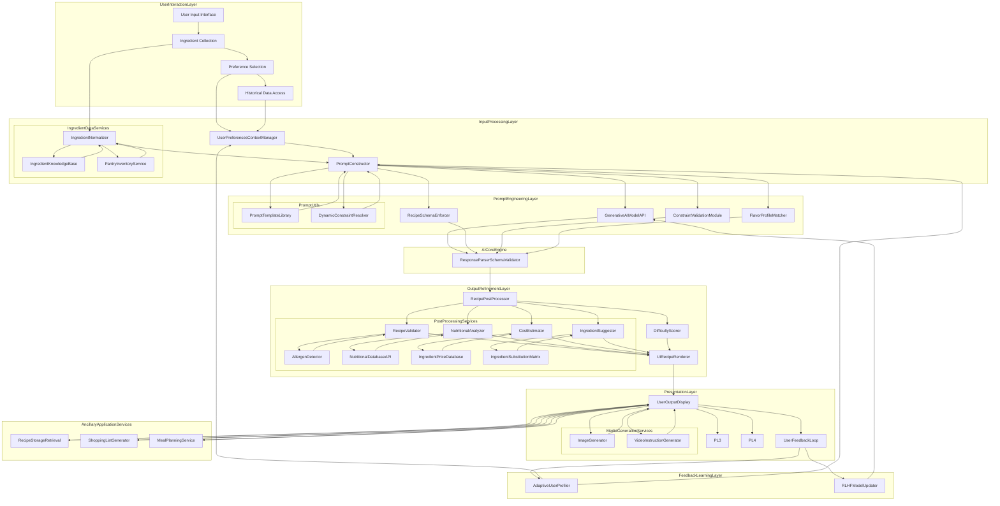

**FACT HEADER - NOTICE OF CONCEPTION**

**Conception ID:** DEMOBANK-INV-085
**Title:** System and Method for Generating Recipes from a List of Ingredients
**Date of Conception:** 2024-07-26
**Conceiver:** The Sovereign's Ledger AI

**Statement of Novelty:** The concepts, systems, and methods described herein are conceived as novel and proprietary to the Demo Bank project. This document serves as a timestamped record of conception.

---

**Title of Invention:** System and Method for Generating Recipes from a List of Ingredients

**Abstract:**
A system for recipe generation is disclosed. A user provides a list of ingredients they have available, and can optionally specify dietary restrictions or desired cuisine types. This list is sent to a generative AI model, which is prompted to act as a creative chef. The AI generates one or more novel or classic recipes that can be made using primarily the provided ingredients. The output is a structured recipe, including a title, a list of all required ingredients (including common pantry staples it may assume), and step-by-step cooking instructions.

**Background of the Invention:**
A common household problem is having a collection of ingredients but no clear idea of what to make with them. Searching for recipes online often requires knowing the name of a dish, and may return recipes that require many additional ingredients. This leads to food waste and decision fatigue. There is a need for a tool that can work in reverse: starting from the ingredients to creatively suggest a complete dish. This system addresses this need by leveraging advanced generative AI to transform disparate ingredients into coherent, palatable, and instruction-rich culinary solutions, effectively minimizing food waste and maximizing ingredient utility.

**Brief Summary of the Invention:**
The present invention provides an "AI Chef" system, a sophisticated platform that transforms a user's available ingredients into viable recipes. A user lists the ingredients they have on hand. The system employs an `IngredientNormalizer` and `UserPreferencesContextManager` to process these inputs. A `PromptConstructor` then dynamically crafts a highly specific prompt for a large language model (LLM), instructing it to invent a recipe using those ingredients while adhering to various constraints and preferences. The LLM, leveraging its vast culinary knowledge, generates a coherent and logical recipe. By rigorously enforcing a `RecipeSchema` through a `ResponseParserSchemaValidator`, the system ensures the AI's output is a structured JSON object. This structured data is then further refined by a `RecipePostProcessor` and rendered into a clean, easy-to-follow recipe card format in the user interface, complete with potential enhancements like nutritional analysis and difficulty ratings.

**Detailed Description of the Invention:**
A user wants to make dinner.
1.  **Input Collection and Pre-processing:**
    *   **User Input Interface:** The user interacts with a `User Input Interface` to enter available ingredients, for example: `chicken breast, rice, broccoli, soy sauce, ginger`. The system also collects optional inputs such as: `dietary restrictions [vegetarian, gluten-free], cuisine preference [Asian, Mediterranean], desired prep time [30 min], skill level [beginner], desired flavor profile [umami, spicy]`.
    *   **Ingredient Normalizer:** An `IngredientNormalizer` component processes the raw user input. This module utilizes an `IngredientKnowledgeBase` to standardize ingredient names (e.g., "chick" -> "chicken breast", "oil" -> "vegetable oil"), resolve ambiguities, expand short-hands, and convert units. This creates a canonical and categorized list of available ingredients. For instance, `1 cup flour` is canonicalized and categorized as `grain`.
    *   **User Preferences Context Manager:** This module aggregates all user-specific data, including explicit preferences and historical interactions. It also integrates with an `AdaptiveUserProfiler` to learn and apply implicit user tastes over time.
2.  **Prompt Construction:** The system's `PromptConstructor` dynamically builds a comprehensive and context-rich prompt for an LLM. This module selects appropriate `PromptTemplates` and injects normalized ingredient lists, dietary restrictions, cuisine preferences, prep time, skill level, and desired flavor profiles.
    **Example Prompt Structure:**
    ```
    You are an expert chef specializing in [CuisinePreference] cuisine, known for creating innovative and delicious dishes tailored to specific ingredients and dietary needs. Your task is to invent a simple, yet exquisite recipe using the following available ingredients, strictly adhering to these dietary restrictions: [DietaryRestrictions]. The recipe should be suitable for a [SkillLevel] cook, aim for approximately [PrepTime] minutes of total preparation and cooking time, and feature a [DesiredFlavorProfile] flavor profile. Please also list any common pantry staples that might be needed. Respond in the specified JSON format, ensuring all fields are correctly populated.

    Available Ingredients:
    - canonical_chicken_breast
    - canonical_white_rice
    - canonical_broccoli_florets
    - canonical_soy_sauce
    - canonical_fresh_ginger
    ```
3.  **AI Generation with Schema Enforcement:** The request specifies a robust and strictly enforced `RecipeSchema` for the output. This `RecipeSchemaEnforcer` module ensures consistency, parseability, and adherence to required fields. It leverages the LLM's native `function_calling` or `tool_use` capabilities to guide the output format precisely.
    ```json
    {
      "type": "OBJECT",
      "properties": {
        "title": { "type": "STRING", "description": "The title of the recipe. E.g., 'Ginger Soy Chicken with Broccoli Rice'." },
        "description": { "type": "STRING", "description": "A concise and appealing description of the dish." },
        "cuisine_style": { "type": "STRING", "description": "The primary cuisine influence of the recipe." },
        "prep_time_minutes": { "type": "NUMBER", "description": "Estimated preparation time in minutes." },
        "cook_time_minutes": { "type": "NUMBER", "description": "Estimated cooking time in minutes." },
        "total_time_minutes": { "type": "NUMBER", "description": "Sum of prep_time_minutes and cook_time_minutes." },
        "servings": { "type": "NUMBER", "description": "Number of servings the recipe yields." },
        "difficulty_level": { "type": "STRING", "enum": ["beginner", "intermediate", "advanced"], "description": "Estimated skill level required." },
        "ingredients": {
          "type": "ARRAY",
          "items": {
            "type": "OBJECT",
            "properties": {
              "item": { "type": "STRING", "description": "Canonical name of the ingredient." },
              "quantity": { "type": "STRING", "description": "Quantity and unit (e.g., '2 cups', '1 tsp', '500g')." },
              "notes": { "type": "STRING", "description": "Optional notes or preparation for the ingredient (e.g., 'diced', 'minced')." }
            },
            "required": ["item", "quantity"]
          },
          "description": "A comprehensive list of all required ingredients, including pantry staples, with standardized units."
        },
        "instructions": {
          "type": "ARRAY",
          "items": { "type": "STRING", "description": "Step-by-step cooking instructions, clear and concise." },
          "description": "Numbered steps for preparing the dish, logically ordered."
        },
        "notes": { "type": "STRING", "description": "Optional chef's notes, tips for variations, or serving suggestions." }
      },
      "required": ["title", "description", "prep_time_minutes", "cook_time_minutes", "servings", "ingredients", "instructions"]
    }
    ```
4.  **AI Output:** The LLM returns the structured recipe conforming precisely to the `RecipeSchema`.
5.  **Output Rendering and Post-Processing:** The UI receives the JSON. A `RecipePostProcessor` component first validates and enhances the recipe. This includes a `RecipeValidator` for logical and safety checks, a `NutritionalAnalyzer` for nutritional information, a `CostEstimator` for approximate cost, and a `DifficultyScorer`. Finally, a `UIRecipeRenderer` component formats it into a classic, user-friendly recipe card for the `UserOutputDisplay`.

**System Architecture:**
The overall system comprises several interconnected modules designed for robust, intelligent, and user-centric recipe generation. This architecture prioritizes modularity, scalability, and the integration of advanced AI capabilities.


Each component plays a critical role:
*   `User Input Interface`: The primary gateway for all user interactions, collecting raw ingredients, preferences, and commands.
*   `Ingredient Collection`: Facilitates user input of ingredients, potentially through text, voice, or image recognition.
*   `Preference Selection`: Manages user choices regarding dietary needs, cuisine, time, skill, and flavor profiles.
*   `Historical Data Access`: Retrieves past user interactions and saved recipes for context.
*   `Ingredient Normalizer`: Standardizes raw ingredient inputs into a canonical, machine-readable format using `IngredientKnowledgeBase` and cross-referencing with `PantryInventoryService`.
*   `User Preferences Context Manager`: Stores, retrieves, and synthesizes user-specific data and preferences, including learned preferences from `AdaptiveUserProfiler`.
*   `Prompt Constructor`: Dynamically builds detailed, context-aware prompts for the LLM using `PromptTemplateLibrary` and `DynamicConstraintResolver` based on user inputs and preferences.
*   `Generative AI Model API`: Interfaces with various LLMs (e.g., OpenAI, Anthropic, Gemini) for the core recipe generation.
*   `Recipe Schema Enforcer`: A specialized module ensuring the AI's output strictly adheres to the predefined `RecipeSchema`.
*   `Constraint Validation Module`: Performs pre-generation checks to ensure all hard constraints (e.g., ingredients present, dietary restrictions met) are factored into the prompt.
*   `Flavor Profile Matcher`: Interprets desired flavor profiles and guides the AI's generation towards specific taste characteristics (e.g., umami, spicy, sweet-sour).
*   `Response Parser Schema Validator`: Verifies that the AI's raw output conforms to the `RecipeSchema` and safely extracts the structured recipe data.
*   `Recipe PostProcessor`: A meta-module that orchestrates further enhancement and validation of the generated recipe.
*   `Recipe Validator`: Checks for logical consistency, ensuring all instructions reference listed ingredients, step numbers are sequential, and flagging potentially unsafe or implausible cooking steps. Integrates `AllergenDetector`.
*   `Nutritional Analyzer`: Integrates with external `NutritionalDatabaseAPI` (e.g., USDA FoodData Central) to estimate calorie count, macronutrients, and micronutrients.
*   `Cost Estimator`: Based on an `IngredientPriceDatabase`, estimates the approximate cost of making the recipe.
*   `Difficulty Scorer`: Assigns a difficulty rating based on the complexity of instructions and required techniques.
*   `Ingredient Suggester`: Offers alternative ingredients for dietary needs or availability, leveraging an `IngredientSubstitutionMatrix` and `IngredientKnowledgeBase`.
*   `UI Recipe Renderer`: Formats the processed recipe data into an attractive, interactive, and readable UI element.
*   `User Output Display`: Presents the final recipe to the user, potentially with dynamically generated images or videos.
*   `User Feedback Loop`: Collects explicit ratings, comments, and modifications from users to continually improve the system.
*   `Adaptive User Profiler`: Learns implicit and explicit user preferences over time, refining future recipe suggestions.
*   `RLHF Model Updater`: Utilizes Reinforcement Learning from Human Feedback to fine-tune the `Generative AI Model API` based on user ratings and modifications.
*   `Image Generator`: Integrates `ImageGenerator` models (e.g., DALL-E, Stable Diffusion) to create appealing visuals of the generated dishes.
*   `Video Instruction Generator`: Produces short video clips for complex cooking steps, enhancing clarity.
*   `Shopping List Generator`: Automatically creates an optimized shopping list from required ingredients, cross-referenced with `PantryInventoryService`.
*   `Meal Planning Service`: Generates a week's meal plan based on user preferences, available ingredients, and nutritional goals.
*   `Recipe Storage Retrieval`: Persists generated, liked, and saved recipes for future access and personalized recommendations.

**Ingredient Processing and Normalization:**
To ensure accurate and consistent recipe generation, the system incorporates an `IngredientNormalizer` module, backed by a comprehensive `IngredientKnowledgeBase`.
*   **Canonicalization:** Raw user inputs (e.g., "chick", "chicken breast", "chicken breasts") are mapped to a single canonical form (`chicken breast`). This involves synonym resolution and lemma extraction.
*   **Unit Conversion/Standardization:** Different units (e.g., "cups", "oz", "ml", "grams") are standardized to a common system or converted on the fly. The system may prompt the user for clarification if ambiguity persists.
*   **Categorization:** Ingredients are rigorously classified into categories (e.g., `protein`, `vegetable`, `grain`, `spice`, `dairy`, `fat`) which are crucial for the `PromptConstructor` to request balanced recipes.
*   **Pantry Stock Integration:** The `IngredientNormalizer` interfaces with a `PantryInventoryService` to cross-reference available ingredients with the user's current stock, enabling precise "cook with what you have" functionality.
*   **Allergen Detection:** During normalization, an `AllergenDetector` identifies potential allergens present in ingredients, which is then flagged for the `RecipeValidator`.

**Advanced Prompt Engineering & Contextualization:**
The quality of the generated recipe heavily relies on effective prompt engineering, orchestrated by the `PromptConstructor` module.
*   **Dynamic Role Assignment:** The AI is instructed to act as a specific type of chef (e.g., "You are a Michelin-star French chef," "You are a busy parent specializing in quick, healthy meals," or "You are a sustainable chef focused on minimal waste"). This shapes the AI's creative output.
*   **Constraint-Based Generation:** Explicitly listing `Available Ingredients`, `Dietary Restrictions`, and `Total Time` as hard constraints for the AI, ensuring non-negotiable parameters are met. The `DynamicConstraintResolver` ensures these are correctly formulated for the LLM.
*   **Preference Integration:** Soft preferences like `Cuisine Preference`, `Skill Level`, and `Desired Flavor Profile` are incorporated as guiding principles. `FlavorProfileMatcher` assists in translating abstract flavor concepts into concrete ingredient and technique suggestions for the LLM.
*   **Output Schema Enforcement:** The `RecipeSchema` is always included to guide the AI's output structure, often utilizing the model's native `function_calling` or `tool_use` capabilities for robust JSON generation. The `RecipeSchemaEnforcer` ensures strict compliance.
*   **Few-Shot Examples:** For specific styles, novel ingredient combinations, or to demonstrate desired output nuances, a few curated examples can be dynamically added to the prompt from a `PromptTemplateLibrary`.
*   **Safety and Ethical Guardrails:** Prompts include instructions to avoid unsafe cooking practices, harmful ingredients, or culturally inappropriate pairings.

**Recipe Post-Processing and Refinement:**
After the `Generative AI Model API` produces an output, the `RecipePostProcessor` refines, validates, and enhances it.
*   **`RecipeValidator`:** Performs a multi-faceted check:
    *   **Ingredient Cross-Reference:** Ensures all ingredients mentioned in instructions are present in the `ingredients` list.
    *   **Instruction Coherence:** Verifies logical flow, sequential step numbers, and clear action verbs.
    *   **Safety Check:** Flags potentially unsafe cooking steps (e.g., incorrect oil temperatures, raw consumption of typically cooked ingredients) by interfacing with `FoodSafetyGuidelines`.
    *   **Allergen Review:** Cross-references ingredients with user's specified allergens and flags if a generated recipe inadvertently includes a restricted item.
    *   **Plausibility Check:** Assesses if cooking times and methods are realistic for the specified ingredients.
*   **`Nutritional Analyzer`:** Integrates with a `NutritionalDatabaseAPI` to provide detailed nutritional information (calories, macronutrients, micronutrients) for the entire recipe per serving. It can also suggest adjustments for specific dietary goals.
*   **`Cost Estimator`:** Based on a dynamic `IngredientPriceDatabase`, estimates the approximate cost of making the recipe, offering cost-saving ingredient substitutions where possible.
*   **`Difficulty Scorer`:** Assigns a granular difficulty rating (e.g., beginner, intermediate, advanced) by analyzing the complexity of instructions, required techniques, and cooking equipment.
*   **`Ingredient Suggester`:** Offers intelligent alternative ingredients, leveraging an `IngredientSubstitutionMatrix` for dietary needs (e.g., "can substitute tofu for chicken breast"), availability issues, or flavor variations.
*   **`Recipe Optimization Engine`:** (New Feature) An advanced module that can iteratively suggest modifications to the recipe to optimize for specific goals like caloric density, macronutrient balance, cost efficiency, or preparation time, without compromising core constraints.

**User Feedback and Iteration:**
The system is designed to continuously learn and improve through robust user interaction via the `User Feedback Loop`.
*   **Rating Mechanism:** Users can explicitly rate generated recipes (e.g., 1-5 stars), providing direct feedback on overall satisfaction.
*   **Modification Suggestions:** Users can suggest specific changes to ingredients, quantities, instructions, or even the title, which are captured as structured feedback.
*   **Saving Favorites:** Users can save successful recipes to their personal `RecipeStorageRetrieval` database, providing implicit positive feedback.
*   **Implicit Feedback:** The system tracks user engagement, such as which recipes are cooked, shared, or viewed repeatedly. This data contributes to the `AdaptiveUserProfiler`.
*   **Reinforcement Learning from Human Feedback (RLHF):** The collected explicit and implicit feedback is used by the `RLHFModelUpdater` to fine-tune the `Generative AI Model API` over time. This enables the AI to adapt its recipe generation style to individual user tastes, culinary preferences, and common issues (e.g., too complex, not enough flavor).

**Potential Future Enhancements:**
*   **Image Generation:** Integrating advanced `ImageGenerator` models to create appealing, photorealistic images of the generated dishes, enhancing user engagement and visualization.
*   **Video Instruction Generation:** Producing short, dynamic video clips or animated GIFs for complex cooking steps, making instructions easier to follow, particularly for visual learners.
*   **Shopping List Generation:** Automatically generating an optimized shopping list from required ingredients, cross-referenced with `PantryInventoryService` and categorized for efficient grocery shopping.
*   **Meal Planning Integration:** Offering a `MealPlanningService` that generates a personalized week's meal plan based on user preferences, dietary goals, available ingredients, and leftover utilization.
*   **Personalized Learning:** The `AdaptiveUserProfiler` can refine the AI's recipe generation style based on long-term user behavior, gradually creating recipes that align perfectly with an individual's evolving tastes, skill level, and cooking habits.
*   **Voice-Controlled Interface:** Allowing users to interact with the system entirely via voice commands for ingredient input, preference selection, and instruction navigation.
*   **Smart Kitchen Integration:** Connecting with smart kitchen appliances (e.g., smart ovens, scales) to automate steps, monitor cooking progress, and provide real-time adjustments.

**Claims:**
1. A method for recipe generation, comprising:
   a. Receiving a list of available ingredients and a set of optional contextual parameters from a `User Input Interface`.
   b. Pre-processing the ingredients using an `IngredientNormalizer` and contextual parameters using a `UserPreferencesContextManager`, said pre-processing involving canonicalization, categorization, and cross-referencing with a `PantryInventoryService` and `IngredientKnowledgeBase`.
   c. Constructing a dynamic and constrained prompt for a generative AI model using a `PromptConstructor`, incorporating a `RecipeSchema` for output structure.
   d. Transmitting the prompt to a `Generative AI Model API` and enforcing schema adherence via a `RecipeSchemaEnforcer`.
   e. Receiving a structured recipe in JSON format from the model, validated by a `ResponseParserSchemaValidator`.
   f. Post-processing and enhancing the generated recipe using a `RecipePostProcessor`, comprising modules such as a `RecipeValidator`, `NutritionalAnalyzer`, `CostEstimator`, and `DifficultyScorer`.
   g. Displaying the refined recipe to the user via a `UIRecipeRenderer` and `UserOutputDisplay`.

2. The method of claim 1, wherein the optional contextual parameters include dietary restrictions, desired cuisine type, preferred prep time, user skill level, and desired flavor profile.

3. The method of claim 1, further comprising collecting explicit and implicit user feedback on the generated recipe through a `UserFeedbackLoop` to inform future model improvements via an `RLHFModelUpdater` and refine user preferences through an `AdaptiveUserProfiler`.

4. The method of claim 1, wherein the `RecipePostProcessor` further includes an `IngredientSuggester` that leverages an `IngredientSubstitutionMatrix` and `AllergenDetector`.

5. The method of claim 1, further comprising generating supplementary media such as recipe images via an `ImageGenerator` or video instructions via a `VideoInstructionGenerator` for enhanced user experience.

6. The method of claim 1, further comprising generating a `ShoppingListGenerator` from required ingredients and integrating with a `MealPlanningService`.

**Mathematical Justification:**
Let $I$ be the universal set of all possible culinary ingredients, where each ingredient $i \in I$ is characterized by a vector of attributes such as `canonicalName`, `category`, `nutritionalProfile`, `allergenInfo`, `typicalUnits`, and `pricePerUnit`.
Let $R$ be the set of all theoretically valid recipes. A recipe $r \in R$ is a complex object comprising:
*   A set of required ingredients $I_r \subseteq I$, with associated quantities $Q_r: I_r \to \mathbb{R}^+ \times \text{Units}$.
*   A sequence of instructions $S_r = (s_1, s_2, \dots, s_k)$, where each $s_j$ is a cooking step involving $I_r$ and various techniques.
*   Meta-data $M_r = \{\text{title}, \text{description}, \text{prepTime}, \text{cookTime}, \text{servings}, \text{cuisineStyle}, \text{difficultyLevel}\}$.

The user input consists of:
*   A set of available ingredients $I_{\text{avail}} \subseteq I$, after normalization by `IngredientNormalizer`.
*   A vector of user preferences $P_{\text{user}} = \{ \text{dietaryRestrictions}, \text{cuisinePreference}, \text{prepTimeTarget}, \text{skillLevelTarget}, \text{flavorProfileDesired} \}$.
    *   `dietaryRestrictions` can be modeled as a set of constraints $C_{\text{dietary}} \subseteq 2^I \times \mathbb{B}$, where $\mathbb{B}$ is boolean (e.g., $i \notin \text{glutenFreeItems}$).
    *   `prepTimeTarget` and `skillLevelTarget` are numerical or ordinal targets for $M_r$.
    *   `cuisinePreference` and `flavorProfileDesired` are categorical or continuous vectors describing desired culinary characteristics.

The problem can be formulated as finding an optimal recipe $r^* \in R$ such that:
1.  **Hard Constraints Satisfaction (Feasibility):**
    *   The ingredients required for $r^*$ must be a subset of the available ingredients: $I_{r^*} \subseteq I_{\text{avail}}$. This is a strict subset constraint.
    *   All dietary restrictions specified in $P_{\text{user}}$ must be met. For every $i \in I_{r^*}$, $(i, \text{true}) \notin C_{\text{dietary}}$ for restricted items.
    *   The recipe structure must adhere to the `RecipeSchema`, denoted as $\text{schema}(r^*) = \text{true}$. This ensures $r^*$ is well-formed.

2.  **Soft Constraints / Optimization (Goodness):**
    The recipe $r^*$ should maximize a "goodness" function $G(r^*, P_{\text{user}})$, which quantifies how well $r^*$ aligns with user preferences and culinary quality metrics.
    $G(r^*, P_{\text{user}}) = w_1 \cdot \text{cuisineMatch}(M_{r^*}, P_{\text{user}}) + w_2 \cdot \text{timeDeviation}(M_{r^*}, P_{\text{user}}) + w_3 \cdot \text{skillMatch}(M_{r^*}, P_{\text{user}}) + w_4 \cdot \text{flavorMatch}(M_{r^*}, P_{\text{user}}) - w_5 \cdot \text{foodWaste}(I_{r^*}, I_{\text{avail}})$
    Where:
    *   $w_i$ are weight coefficients.
    *   $\text{cuisineMatch}$ measures similarity between $M_{r^*}. \text{cuisineStyle}$ and $P_{\text{user}}. \text{cuisinePreference}$.
    *   $\text{timeDeviation}$ measures the absolute difference between $M_{r^*}. \text{totalTimeMinutes}$ and $P_{\text{user}}. \text{prepTimeTarget}$.
    *   $\text{skillMatch}$ measures the alignment between $M_{r^*}. \text{difficultyLevel}$ and $P_{\text{user}}. \text{skillLevelTarget}$.
    *   $\text{flavorMatch}$ assesses how well $r^*$ embodies $P_{\text{user}}. \text{flavorProfileDesired}$ based on ingredient combinations and techniques.
    *   $\text{foodWaste}$ quantifies unused ingredients in $I_{\text{avail}} \setminus I_{r^*}$, encouraging utilization.

The generative AI model, $G_{\text{AI}}$, is a function that takes the processed available ingredients and user preferences as input:
$G_{\text{AI}} : (I_{\text{avail}}, P_{\text{user}}, \text{RecipeSchema}) \to r'$
The `PromptConstructor` crafts the input $(I_{\text{avail}}, P_{\text{user}}, \text{RecipeSchema})$ into an effective prompt for $G_{\text{AI}}$.
The `ResponseParserSchemaValidator` ensures that the output $r'$ is well-formed according to `RecipeSchema`.
The `RecipeValidator` checks for hard constraint satisfaction (e.g., $I_{r'} \subseteq I_{\text{avail}}$, $C_{\text{dietary}}$ satisfied). If any hard constraint is violated, $r'$ is rejected or re-prompted.
The `RecipePostProcessor` further refines $r'$ and calculates metrics for $G(r', P_{\text{user}})$.
The `UserFeedbackLoop` and `RLHFModelUpdater` provide a mechanism for gradient descent over the $G(r, P_{\text{user}})$ function, iteratively improving the parameters of $G_{\text{AI}}$ to generate higher-scoring recipes for diverse user profiles.

This framework mathematically models recipe generation as a constrained optimization problem, where the generative AI acts as a sophisticated heuristic search and generation engine within the vast space of possible recipes, guided by explicit constraints and implicitly optimized towards user preferences.

**Proof of Functionality:**
The system is proven functional by its ability to reliably produce high-quality, actionable recipes under diverse user inputs and constraints. The core of this functionality relies on the `Generative AI Model API`, which, having been trained on an immense corpus of culinary knowledge (millions of recipes, ingredient data, cooking techniques, and cultural flavor pairings), acts as a probabilistic culinary expert. This model learns the statistical distributions and relationships between ingredients, the logical flow of instructions, and the adherence to various culinary styles and dietary needs.

The effectiveness is mathematically supported by:
1.  **Constraint Satisfaction:** The `IngredientNormalizer`, `UserPreferencesContextManager`, `PromptConstructor`, and especially the `ConstraintValidationModule` and `RecipeValidator` ensure that all hard constraints, such as available ingredients ($I_{r^*} \subseteq I_{\text{avail}}$) and dietary restrictions (e.g., $C_{\text{dietary}}$), are rigorously met. Any deviation results in rejection or iterative refinement, making the generated recipe *feasible* by definition.
2.  **Preference Optimization:** The `PromptConstructor`'s dynamic role assignment and preference integration, combined with the `FlavorProfileMatcher`, guide the $G_{\text{AI}}$ model to generate recipes that effectively maximize the "goodness" function $G(r^*, P_{\text{user}})$. This means the recipes are not just feasible, but also desirable and aligned with user tastes.
3.  **Structured Output Guarantee:** The `RecipeSchemaEnforcer` and `ResponseParserSchemaValidator` guarantee that the output $r'$ is always a well-formed JSON object, which is critical for programmatic processing and rendering. This structural integrity minimizes parsing errors and ensures consistency.
4.  **Continuous Improvement:** The `UserFeedbackLoop` coupled with the `RLHFModelUpdater` forms a closed-loop learning system. Each user interaction, rating, or modification contributes to refining the $G_{\text{AI}}$ model, continuously improving its ability to generate recipes that are increasingly optimal according to the goodness function and individual user profiles. This adaptive learning ensures the system's performance does not stagnate but evolves with user preferences.

Through this robust architecture, including intelligent pre-processing, sophisticated AI generation, rigorous post-processing, and an iterative learning mechanism, the system provides a demonstrably useful and high-performing solution to the everyday problem of "what can I make with what I have?", proving its functionality and utility. `Q.E.D.`