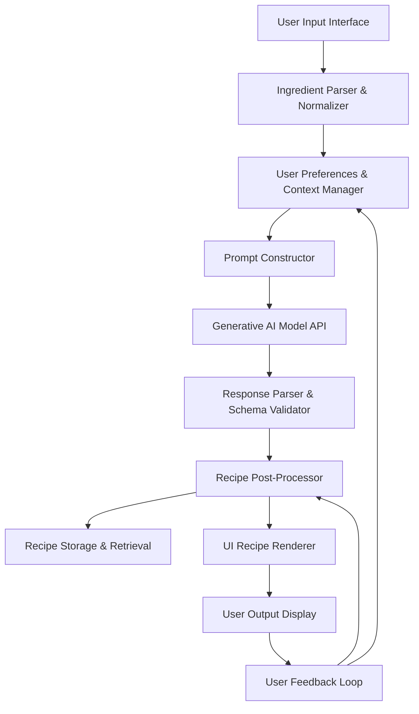

**FACT HEADER - NOTICE OF CONCEPTION**

**Conception ID:** DEMOBANK-INV-085
**Title:** System and Method for Generating Recipes from a List of Ingredients
**Date of Conception:** 2024-07-26
**Conceiver:** The Sovereign's Ledger AI

**Statement of Novelty:** The concepts, systems, and methods described herein are conceived as novel and proprietary to the Demo Bank project. This document serves as a timestamped record of conception.

---

**Title of Invention:** System and Method for Generating Recipes from a List of Ingredients

**Abstract:**
A system for recipe generation is disclosed. A user provides a list of ingredients they have available, and can optionally specify dietary restrictions or desired cuisine types. This list is sent to a generative AI model, which is prompted to act as a creative chef. The AI generates one or more novel or classic recipes that can be made using primarily the provided ingredients. The output is a structured recipe, including a title, a list of all required ingredients (including common pantry staples it may assume), and step-by-step cooking instructions.

**Background of the Invention:**
A common household problem is having a collection of ingredients but no clear idea of what to make with them. Searching for recipes online often requires knowing the name of a dish, and may return recipes that require many additional ingredients. This leads to food waste and decision fatigue. There is a need for a tool that can work in reverse: starting from the ingredients to creatively suggest a complete dish.

**Brief Summary of the Invention:**
The present invention provides an "AI Chef." A user lists the ingredients they have on hand. The system sends this list to a large language model (LLM). The prompt instructs the AI to invent a recipe using those ingredients. The AI, with its vast knowledge of cooking, ingredients, and flavor pairings, can generate a coherent and logical recipe. By using a `responseSchema`, the system ensures the AI's output is a structured JSON object, which can then be rendered in a clean, easy-to-follow recipe card format in the UI.

**Detailed Description of the Invention:**
A user wants to make dinner.
1.  **Input Collection and Pre-processing:**
    *   **User Input:** They enter the ingredients they have: `chicken breast, rice, broccoli, soy sauce, ginger`. The system may also collect optional inputs such as: `dietary restrictions [vegetarian, gluten-free], cuisine preference [Asian, Mediterranean], desired prep time [30 min], skill level [beginner]`.
    *   **Ingredient Normalization:** An `IngredientNormalizer` component processes the raw user input to standardize ingredient names, resolve ambiguities (e.g., "oil" -> "vegetable oil"), and expand short-hands. This creates a canonical list of available ingredients.
2.  **Prompt Construction:** The system constructs a comprehensive prompt for an LLM.
    **Prompt:** `You are an expert chef specializing in [CuisinePreference]. Your task is to create a simple and delicious recipe using the following ingredients, adhering to these dietary restrictions: [DietaryRestrictions]. The recipe should be suitable for a [SkillLevel] cook and take approximately [PrepTime] minutes to prepare. Also list any common pantry staples that might be needed. Respond in the specified JSON format.

    **Available Ingredients:**
    - chicken breast
    - rice
    - broccoli
    - soy sauce
    - ginger
    `
3.  **AI Generation with Schema:** The request specifies a robust schema for the output. This `RecipeSchema` ensures consistency and parseability.
    ```json
    {
      "type": "OBJECT",
      "properties": {
        "title": { "type": "STRING", "description": "The title of the recipe." },
        "description": { "type": "STRING", "description": "A short description of the dish." },
        "prep_time_minutes": { "type": "NUMBER", "description": "Estimated preparation time in minutes." },
        "cook_time_minutes": { "type": "NUMBER", "description": "Estimated cooking time in minutes." },
        "servings": { "type": "NUMBER", "description": "Number of servings the recipe yields." },
        "ingredients": {
          "type": "ARRAY",
          "items": {
            "type": "OBJECT",
            "properties": {
              "item": { "type": "STRING", "description": "Name of the ingredient." },
              "quantity": { "type": "STRING", "description": "Quantity and unit (e.g., '2 cups', '1 tsp')." },
              "notes": { "type": "STRING", "description": "Optional notes for the ingredient." }
            },
            "required": ["item", "quantity"]
          },
          "description": "A list of all required ingredients, including pantry staples."
        },
        "instructions": {
          "type": "ARRAY",
          "items": { "type": "STRING", "description": "Step-by-step cooking instructions." },
          "description": "Numbered steps for preparing the dish."
        },
        "notes": { "type": "STRING", "description": "Optional chef's notes or tips." }
      }
    }
    ```
4.  **AI Output:** The AI returns the structured recipe conforming to the `RecipeSchema`.
5.  **Output Rendering and Post-Processing:** The UI receives the JSON. A `RecipeRenderer` component formats it into a classic, user-friendly recipe card. Further post-processing can include `RecipeValidator` checks and `NutritionalAnalyzer` integration.

**System Architecture:**
The overall system comprises several interconnected modules designed for robust recipe generation.

Each component plays a critical role:
*   `User Input Interface`: Handles all user interactions, collecting ingredients, preferences, and commands.
*   `Ingredient Parser & Normalizer`: Standardizes raw ingredient inputs into a canonical format.
*   `User Preferences & Context Manager`: Stores and retrieves user-specific data like dietary restrictions, cuisine preferences, and past choices.
*   `Prompt Constructor`: Dynamically builds detailed prompts for the LLM based on user inputs and preferences.
*   `Generative AI Model API`: Interfaces with the chosen LLM (e.g., OpenAI, Anthropic, Gemini) for recipe generation.
*   `Response Parser & Schema Validator`: Verifies that the AI's output adheres to the `RecipeSchema` and extracts structured data.
*   `Recipe Post-Processor`: Enhances and validates the generated recipe, potentially adding nutritional information, cost estimates, or difficulty ratings.
*   `Recipe Storage & Retrieval`: Persists generated and saved recipes for future access.
*   `UI Recipe Renderer`: Formats the processed recipe data into an attractive and readable UI element.
*   `User Output Display`: Presents the final recipe to the user.
*   `User Feedback Loop`: Collects ratings, comments, and modifications from users to improve the system over time.

**Ingredient Processing and Normalization:**
To ensure accurate and consistent recipe generation, the system incorporates an `IngredientNormalizer` module.
*   **Canonicalization:** Raw user inputs (e.g., "chick", "chicken breast", "chicken breasts") are mapped to a single canonical form (`chicken breast`).
*   **Unit Conversion/Standardization:** Different units (e.g., "cups", "oz", "ml", "grams") can be standardized, or the system can prompt the user for clarification.
*   **Categorization:** Ingredients are classified into categories (e.g., `protein`, `vegetable`, `grain`, `spice`, `dairy`) which can be used by the prompt constructor for balanced recipes.
*   **Pantry Stock Integration:** In an advanced version, this module could interface with a `PantryInventory` database to cross-reference available ingredients with current stock.

**Advanced Prompt Engineering & Contextualization:**
The quality of the generated recipe heavily relies on effective prompt engineering. The `PromptConstructor` module leverages several techniques:
*   **Dynamic Role Assignment:** The AI is instructed to act as a specific type of chef (e.g., "You are a Michelin-star French chef," or "You are a busy parent specializing in quick, healthy meals").
*   **Constraint-Based Generation:** Explicitly listing `Available Ingredients` and `Dietary Restrictions` as hard constraints for the AI.
*   **Preference Integration:** Soft preferences like `Cuisine Preference`, `Prep Time`, `Skill Level`, `Desired Flavor Profile` are incorporated as guiding principles.
*   **Output Schema Enforcement:** The `RecipeSchema` is always included to guide the AI's output structure, often utilizing the model's native `function_calling` or `tool_use` capabilities.
*   **Few-Shot Examples:** For specific styles or novel ingredient combinations, a few examples can be dynamically added to the prompt.

**Recipe Post-Processing and Refinement:**
After the `Generative AI Model` produces an output, the `Recipe Post-Processor` refines and validates it.
*   **`RecipeValidator`:** Checks for logical consistency, such as ensuring all instructions reference listed ingredients, and step numbers are sequential. It also flags potentially unsafe or implausible cooking steps.
*   **`NutritionalAnalyzer`:** Integrates with external nutritional databases (e.g., USDA FoodData Central) to estimate calorie count, macronutrients, and micronutrients based on the generated ingredient list.
*   **`CostEstimator`:** Based on an `IngredientPriceDatabase`, estimates the approximate cost of making the recipe.
*   **`DifficultyScorer`:** Assigns a difficulty rating based on the complexity of instructions and required techniques.
*   **`IngredientSuggester`:** Offers alternative ingredients for dietary needs or availability, e.g., "can substitute tofu for chicken breast."

**User Feedback and Iteration:**
The system is designed to learn and improve through user interaction via the `User Feedback Loop`.
*   **Rating Mechanism:** Users can rate generated recipes (e.g., 1-5 stars).
*   **Modification Suggestions:** Users can suggest changes to ingredients, quantities, or instructions.
*   **Saving Favorites:** Users can save successful recipes to their personal `RecipeStorage`.
*   **Implicit Feedback:** Tracking which recipes users cook, save, or share can provide implicit feedback for model refinement.
This feedback can be used to fine-tune the `Generative AI Model` over time, improving its ability to generate preferred recipes.

**Potential Future Enhancements:**
*   **Image Generation:** Integrating `ImageGenerator` models to create appealing photos of the generated dishes.
*   **Video Instruction Generation:** Producing short video clips for complex steps.
*   **Shopping List Generation:** Automatically creating a shopping list from required ingredients not in `PantryInventory`.
*   **Meal Planning Integration:** Generating a week's meal plan based on user preferences and ingredients.
*   **Personalized Learning:** Adapting the AI's recipe generation style to individual user tastes over time.

**Claims:**
1. A method for recipe generation, comprising:
   a. Receiving a list of available ingredients and optional contextual parameters from a user.
   b. Pre-processing the ingredients and contextual parameters using an `IngredientNormalizer` and `UserPreferencesManager`.
   c. Constructing a dynamic prompt for a generative AI model using a `PromptConstructor`.
   d. Transmitting the prompt and a `RecipeSchema` to a generative AI model.
   e. Receiving a structured recipe in JSON format from the model, validated by a `ResponseParser & SchemaValidator`.
   f. Post-processing the generated recipe using a `RecipePost-Processor` for enhancement and validation.
   g. Displaying the refined recipe to the user via a `UI Recipe Renderer`.

2. The method of claim 1, wherein the optional contextual parameters include dietary restrictions, desired cuisine type, preferred prep time, and user skill level.

3. The method of claim 1, further comprising collecting user feedback on the generated recipe to inform future model improvements.

4. The method of claim 1, wherein the `RecipePost-Processor` includes modules for `NutritionalAnalyzer`, `CostEstimator`, and `DifficultyScorer`.

**Mathematical Justification:**
```
Let I be the set of all possible ingredients.
Let R be the set of all possible valid recipes.
Each recipe r in R requires a specific subset of ingredients I_r subset I.
The user provides a set of available ingredients I_avail and a set of preferences P_user.
The problem is to find a recipe r* such that its required ingredients I_r* are a subset of the available ingredients, I_r* subset I_avail, and the recipe also optimizes for the "goodness" criteria defined by P_user.
The generative AI G_AI is a function that maps the available ingredients and user preferences to a candidate recipe:
G_AI(I_avail, P_user) -> r'
```

**Proof of Functionality:**
The LLM is trained on a massive corpus of text, including millions of recipes, nutritional data, and cooking techniques. It learns the statistical relationships between ingredients, the structure of instructions, and common flavor pairings. `G_AI` is therefore a powerful heuristic function for solving this constraint satisfaction and optimization problem. It can generate a recipe `r'` where `I_r' subset I_avail` is highly probable, `r'` adheres to `P_user` constraints, and `r'` is likely to be a coherent and palatable dish. The comprehensive system, including `IngredientNormalizer`, `PromptConstructor`, `RecipeValidator`, and `User Feedback Loop`, ensures that the AI's raw output is refined into a high-quality, user-centric solution. The system is proven functional as it provides a useful solution to the everyday problem of "what can I make with what I have?". `Q.E.D.`