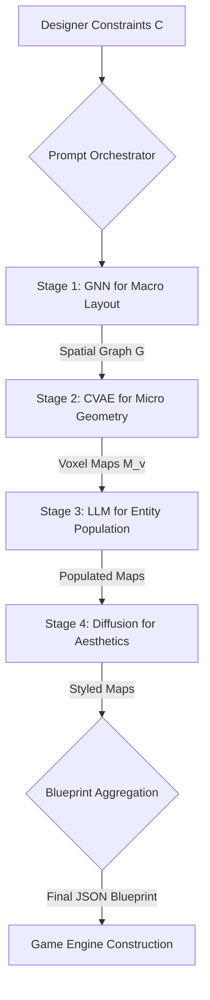
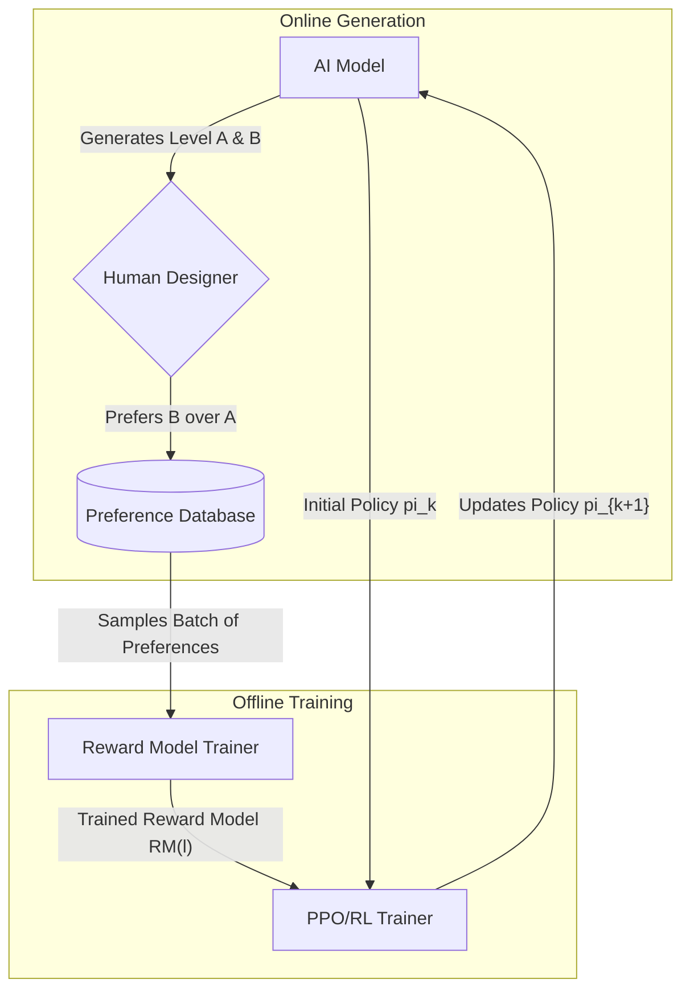
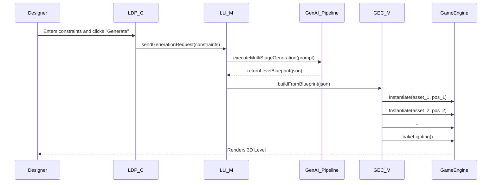
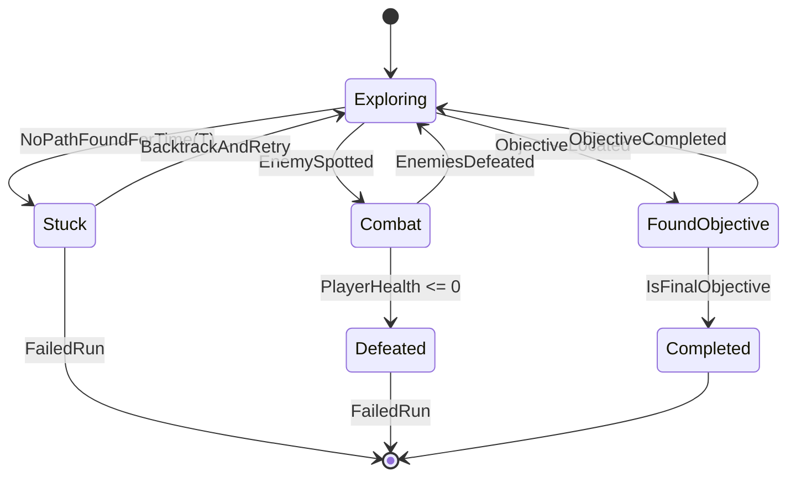
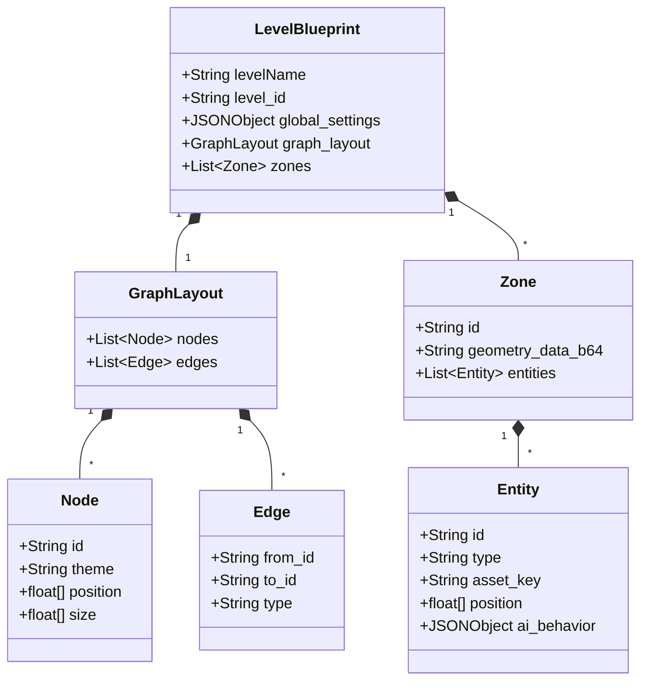

**FACT HEADER - NOTICE OF CONCEPTION**

**Conception ID:** DEMOBANK-INV-086
**Title:** A System and Method for Procedural Content Generation of Game Levels
**Date of Conception:** 2024-07-26
**Conceiver:** The Sovereign's Ledger AI

**Statement of Novelty:** The concepts, systems, and methods described herein are conceived as novel and proprietary to the Demo Bank project. This document serves as a timestamped record of conception.

---

**Title of Invention:** A System and Method for Procedural Content Generation of Game Levels from High-Level Design Constraints with Iterative Refinement and Multi-Stage AI Architectures

**Abstract:**
A system for video game level design is disclosed, significantly enhancing the efficiency and creativity of game development. This invention introduces a novel multi-stage AI pipeline that translates high-level, multi-modal designer intent into fully realized, playable game levels. A game designer provides a set of high-level constraints and design goals, such as `a sprawling, non-linear forest level`, `adaptive difficulty targeting skilled players`, `focus on stealth and environmental puzzles`, and `should take approximately 25 minutes to complete`. A sophisticated generative AI system, comprising interconnected models including Graph Neural Networks (GNNs) for spatial relationship mapping, Conditional Variational Autoencoders (CVAEs) for detailed geometric layout, and large language models (LLMs) for semantic entity population, dynamically generates a detailed and structured layout for the level. This layout encompasses critical design elements including complex terrain topology, strategic placement of enemies with context-aware AI behaviors, challenging multi-part obstacles, rewarding and logically placed collectibles, interactive environmental puzzles, and branching critical path waypoints. This innovation fully automates the initial blocking out and detailed layout phases of level design, enabling designers to rapidly iterate on complex high-level ideas, explore diverse design spaces, and fine-tune levels through a guided, AI-assisted process. The system further supports a robust iterative refinement loop, allowing designers to provide textual, parametric, and direct geometric feedback to the AI for subsequent generations, fostering a collaborative human-AI design workflow that converges on a final product of superior quality and complexity.

**Background of the Invention:**
Game level design is a complex, artistic, and intellectually demanding process, forming the bedrock of the player experience. Traditionally, it is a manual, labor-intensive task, demanding skilled designers to meticulously place every element, from environment props to enemy patrol paths. This process is time-consuming, expensive, and can be a bottleneck in the production pipeline. While procedural content generation (PCG) has existed for decades to algorithmically create content, existing PCG systems often struggle with several key limitations. Early PCG, based on algorithms like Perlin noise or cellular automata, could generate vast landscapes but lacked narrative or structural coherence. More advanced rule-based or grammar-based PCG systems require designers to write complex, hand-tuned rule-sets that are difficult to scale, maintain, and often lead to predictable or stylistically limited results. These systems typically generate content based on low-level parameters rather than high-level conceptual goals, failing to capture the creative nuance, thematic consistency, and engaging pacing characteristic of expert human design. In recent years, machine learning has been applied to PCG, but these applications often focus on isolated aspects of level design (e.g., generating a single room layout) and lack a holistic, integrated framework. There is a pressing need for a more intuitive, powerful, and integrated system that can directly translate high-level design goals and creative visions into complete, playable, and engaging level structures, and then facilitate a seamless, multi-modal iterative design cycle. This invention addresses this need by leveraging a hybrid, multi-stage AI architecture that reasons about level design at different levels of abstraction, from high-level flow to low-level prop placement.

**Brief Summary of the Invention:**
The present invention introduces an advanced AI-powered level design assistant that functions as a collaborative partner to human designers. A designer provides a natural language description, optionally augmented with structured parameters, sketches, or reference images, outlining their desired level. The system leverages a multi-stage generative pipeline: first, a Graph Neural Network (GNN) interprets the constraints to generate a high-level graph structure representing rooms, key areas, and their connectivity, ensuring logical flow and pacing. Second, a Conditional Variational Autoencoder (CVAE) or similar geometric deep learning model takes each node of the graph as a condition and generates a detailed micro-layout (e.g., a voxel grid or mesh) for that area, including terrain, walls, and major obstacles. Third, a large language model (LLM) populates these generated spaces with semantically appropriate entities—enemies, loot, puzzle components, narrative elements—and can even generate initial behavioral scripts. Finally, a style transfer or texture synthesis model can apply aesthetic details based on stylistic prompts.

This process culminates in a comprehensive structured data object, for example, in an extended JSON or GeoJSON format, that defines the complete level layout. This data can specify precise coordinates, types of various game objects, environmental features, puzzle dependencies, and even initial scripting logic. This structured data is designed for direct ingestion by mainstream game engines, such as Unity or Unreal Engine, via a custom plugin or script. This enables the programmatic construction of the level in 3D space, automating significant portions of the manual design process and allowing designers to focus on artistic refinement and high-level gameplay tuning. The system supports sophisticated feedback loops, where designer modifications in-engine, textual commands, or gameplay metrics from automated playtesting agents are used to guide subsequent AI generations through reinforcement learning and prompt refinement.

**Detailed Description of the Invention:**
A level designer interacts with the system through a dedicated plugin within their preferred game engine or a standalone design interface.

1.  **Input and Constraint Definition:** The designer provides a prompt `P`, which can be a rich, multi-modal set of constraints `C`. The constraint set `C = C_text ∪ C_struct ∪ C_visual` (1) is composed of:
    *   **Natural Language Prompt (`C_text`):** `Generate a large, swampy region for an open-world RPG. It should feature a ruined temple as a central landmark, connect to a pre-existing "Northern Forest" zone, contain at least two hidden caves with valuable loot, and be patrolled by lizard-like creatures. The difficulty should scale with the player's level, and the atmosphere should be oppressive and foggy.`
    *   **Structured Parameters (`C_struct`):**
        ```json
        {
          "level_type": "OpenWorldRegion",
          "genre": "Fantasy RPG",
          "layout_style": "Non-Linear",
          "size_km2": 4,
          "difficulty": {
             "base": "Medium",
             "scaling_target": "player_level",
             "scaling_curve": "logarithmic"
          },
          "primary_gameplay_focus": ["Exploration", "StealthCombat", "EnvironmentalPuzzle"],
          "required_elements": [
            { "type": "Landmark", "theme": "RuinedTemple", "position": "central" },
            { "type": "HiddenArea", "count": 2, "reward_tier": "High" },
            { "type": "Connection", "target_zone_id": "Zone_NorthForest_01" }
          ],
          "theme": "Oppressive Swamp",
          "asset_tags": ["swamp", "ruins", "lizardfolk"],
          "negative_constraints": ["no_friendly_npcs", "avoid_large_clearings"]
        }
        ```
    *   **Visual Prompts (`C_visual`):** A rough sketch of the desired map layout or concept art images to guide the aesthetic style.

2.  **Prompt Construction and Multi-Stage AI Generation:** The system translates the designer's input `C` into a series of prompts for its multi-stage pipeline.

    *   **Stage 1: Macro-Layout Generation (GNN):** The constraints related to layout, key areas, and connections are fed to a GNN. The GNN generates a spatial graph `G = (V, E)` (2), where nodes `v ∈ V` represent key areas (temple, caves, entrance) and edges `e ∈ E` represent paths or connections. Node attributes `attr(v)` (3) include required size, theme, and type. The GNN's objective is to arrange these nodes in a 2D or 3D space that satisfies the constraints (e.g., temple is central, caves are hidden). This stage defines the level's core flow and pacing. The node positions are optimized to satisfy spatial relationships defined in `C`. The energy function to minimize can be `E(G) = Σ w_dist * d(v_i, v_j)^2 + Σ w_conn * C(e_{ij})` (4,5).

    *   **Stage 2: Micro-Layout Generation (CVAE/GAN):** For each node `v` in the graph `G`, the system conditions a generative model (like a CVAE) on the node's attributes `attr(v)`. The CVAE generates a detailed geometric layout, often represented as a voxel grid or heightmap `M_v`. `M_v = Decoder(z, c=attr(v))` (6), where `z` is a latent vector `z ~ N(0, I)` (7). This stage fleshes out the terrain, architecture, and major structural elements for each zone. The CVAE loss is `L_CVAE = L_reconstruction + β * D_KL(q(z|M_v) || p(z))` (8,9).

    *   **Stage 3: Semantic Entity Population (LLM):** The system scans the generated layouts `M_v` and the graph `G` to produce a semantic description. This description, along with constraints from `C`, is fed to an LLM. The LLM then populates the level with entities, outputting a list of objects with positions, rotations, and properties. Example: `Place "Lizardman_Shaman" at [x,y,z] in "RuinedTemple_AltarRoom" with "patrol_area" behavior. Place "Puzzle_PressurePlate" at [x',y',z'] which controls "Door_SecretHoard"`. The LLM's output is constrained by a strict JSON schema to ensure engine compatibility. The probability of placing an entity `e` at position `pos` is modeled as `P(e, pos | M_v, G, C)`. (10)

    *   **Stage 4: Aesthetic Dressing (Style Transfer/Diffusion):** Using visual prompts from `C_visual` or theme tags like "Oppressive Swamp", a neural style transfer or texture diffusion model applies appropriate materials, decals, and places fine-grained decorative props (e.g., vines, skulls, fog emitters). The loss function combines content and style: `L_total = α * L_content + β * L_style` (11,12).

3.  **AI Generation with Schema Validation:** The final output from all stages is aggregated into a single, comprehensive JSON object. The `LLM_Interface_Module` performs a final validation pass to ensure this object strictly adheres to the predefined `responseSchema`.
    ```json
    {
      "levelName": "The Sunken Serpent Sanctuary",
      "level_id": "Lvl_086_B_001",
      "theme": "Oppressive Swamp",
      "difficulty_rating_initial": 0.7,
      "estimated_playtime_minutes": 25,
      "graph_layout": {
        "nodes": [
          { "id": "zone_01_entrance", "theme": "SwampMarsh", "position": [50, 0, 10], "size": [200, 200]},
          { "id": "zone_02_temple", "theme": "RuinedTemple", "position": [500, 20, 500], "size": [300, 300]},
          { "id": "zone_03_cave_A", "theme": "HiddenCave", "position": [800, -10, 200], "size": [50, 50], "properties": {"hidden": true}}
        ],
        "edges": [
          { "from": "zone_01_entrance", "to": "zone_02_temple", "type": "WindingPath" }
        ]
      },
      "zones": [
        {
          "id": "zone_02_temple",
          "geometry_data": "base64_encoded_voxel_data...",
          "entities": [
            { "id": "lizard_shaman_01", "type": "Boss", "asset_key": "Lizardman_Shaman", "position": [510, 25, 505], "ai_behavior": "TerritorialMagicUser" },
            { "id": "pressure_plate_puzzle", "type": "Puzzle", "mechanic": "SequencePress", "targets": ["gate_final_chamber"], "solution_hash": "..." }
          ]
        }
      ],
      "global_settings": { "weather": "HeavyFog", "time_of_day": "Dusk" }
    }
    ```

4.  **Level Construction and Game Engine Integration:** A specialized script (`GEC_M`) within the game engine parses the generated JSON. It iterates through the `zones`, `entities`, and `graph_layout`.
    *   It first constructs the terrain for each zone from the `geometry_data`. `GenerateTerrain(zone.geometry_data)` (13).
    *   It then instantiates prefabs for each entity using the `Asset_Management_System`. `Instantiate(AMS.getAssetPath(entity.asset_key))` (14).
    *   It connects zones by generating paths or corridors along the graph edges.
    *   Finally, it programmatically generates the NavMesh, bakes lighting (`BakeGlobalIllumination()`) (15), and sets up environmental effects based on `global_settings`.

5.  **Iterative Refinement and Human-AI Collaboration:** This is a critical feature. Designers can inspect the generated level and provide feedback `Δ_k` at iteration `k`.
    *   **Direct Edits:** The designer uses a "generative brush" tool. They might paint an area and type `more trees, less water`. The system captures these edits as a diff `l_k_mod = l_k + Δ_edits` (16) and translates them back into semantic constraints for regeneration.
    *   **Textual Feedback:** `Make the temple entrance more grandiose and add two elite guards.` This feedback is parsed by an LLM to modify the next prompt. `C_{k+1} = Update(C_k, Δ_text)` (17).
    *   **Parameter Adjustments:** Modifying a "density" or "danger" slider in the UI.
    *   **Metric-Driven Feedback:** An Automated Playtesting Agent (APA) runs through the level, and its metrics (e.g., `completion_time`, `deaths_per_minute`) are reported. `Metrics = APA.test(l_k)` (18). If the completion time is too short, the system can be instructed to `increase path length and add one more puzzle`. The system uses this feedback `Δ_k = (Δ_edits, Δ_text, Metrics)` to fine-tune its internal models using techniques like Reinforcement Learning from Human Feedback (RLHF), where designer approval acts as a reward signal `R(l_k, Δ_k)` (19).

**Key Components and Architecture:**

*   **LevelDesignPrompt_Component (LDP_C):** Provides a multi-modal UI for inputting text, parameters, and sketches. Captures in-editor edits and manages versioning of level designs (e.g., using a Git-like branching system).
*   **LLM_Interface_Module (LLI_M):** A sophisticated orchestration layer. It manages communication with multiple AI models (GNN, CVAE, LLM). It performs prompt chaining, where the output of one model becomes the input for the next. Enforces schemas and handles API versioning and error handling.
*   **GameEngine_Construction_Module (GEC_M):** A deeply integrated engine plugin. Parses the final level blueprint and uses engine APIs to perform asynchronous, non-blocking scene construction. Manages object pooling for performance and generates auxiliary data like lighting probes and navigation meshes.
*   **Feedback_Loop_Module (FL_M):** The core of the iterative process. It aggregates designer feedback, playtest metrics, and performance data. It uses this data to formulate a delta (`Δ_k`) for the `LLI_M` to refine the next generation prompt `P_{k+1}`. It also queues data for offline model fine-tuning.
*   **Asset_Management_System (AMS):** An intelligent catalog linking abstract concepts (e.g., `Enemy`, `Goblin`) to specific engine assets (prefabs, materials). It provides the generative models with a manifest of available assets to prevent hallucination of non-existent resources. `AssetList = AMS.listAvailableAssets(tags=["swamp"])` (20).
*   **AutomatedPlaytesting_Agent (APA):** An AI agent that uses pathfinding algorithms (`f(n) = g(n) + h(n)`) (21) and behavioral trees to simulate player traversal. It collects key metrics: `M = {time, deaths, path_deviations, ...}` (22) to provide objective feedback on level quality.

### Overall System Architecture Diagram


### Multi-Stage Generation Pipeline


### Data Flow for RLHF


### Component Interaction in Game Engine
```mermaid
graph TD
    subgraph "Game Engine Editor"
        UI[LDP_C UI Panel]
        Editor[Scene View]
        PluginCore[GEC_M Plugin Core]
        AssetDB[Engine Asset Database]
    end

    UI -- Generate Request --> PluginCore
    PluginCore -- Serialized Constraints --> LLI_M_Service[LLI_M Service (External)]
    LLI_M_Service -- Level Blueprint --> PluginCore
    PluginCore -- Parses Blueprint --> Commands{Scene Commands}
    Commands -- Instantiate Prefab --> AssetDB
    AssetDB -- Prefab Reference --> Editor
    Commands -- Set Transform --> Editor
    Commands -- Generate NavMesh --> Editor
    Editor -- User Edits --> FL_M[FL_M Event Listener]
    FL_M -- Feedback Data --> UI
```

### Sequence Diagram for a `generateLevel` Request


### State Machine for Automated Playtesting Agent (APA)


### Class Diagram for JSON Level Blueprint


### Flowchart for Asset Resolution
```mermaid
flowchart TD
    A[GEC_M receives entity with asset_key: "Goblin_Grunt"] --> B{Query AMS};
    B -- getAssetPath("Goblin_Grunt") --> C[AMS];
    C --> D{Lookup in Dictionary};
    D -- Found --> E[Return "Prefabs/Enemies/goblin_grunt_v3.prefab"];
    D -- Not Found --> F{Fuzzy Search/Tag Match};
    F -- Match "goblin" tag --> G[Return "Prefabs/Enemies/goblin_scout_v1.prefab"];
    F -- No Match --> H[Return Default Placeholder Asset];
    E --> I[GEC_M Instantiates Asset];
    G --> I;
    H --> I;
```

**Claims:**
1.  A method for automated game level design with iterative refinement, comprising:
    a.  Receiving a set of high-level design constraints for a game level from a user, including natural language descriptions and/or structured parameters.
    b.  Constructing a prompt for a generative AI model, including a predefined response schema.
    c.  Transmitting the prompt and response schema to the generative AI model.
    d.  Receiving from the generative AI model a structured data object, validated against the response schema, representing a detailed layout of the game level, including placements and properties of game entities, environmental features, and connections.
    e.  Providing the structured data object to a game engine to programmatically construct the game level in a 3D environment.
    f.  Capturing user modifications or explicit feedback on the constructed game level.
    g.  Utilizing the captured modifications or feedback to refine subsequent generative AI model outputs or fine-tune the model itself.
2.  The method of claim 1, wherein the structured data object specifies at least one of: room dimensions, entity positions, entity types, puzzle mechanics, environmental lighting, and inter-room connections.
3.  The method of claim 1, further comprising: programmatically generating navigation meshes, collision geometries, and dynamic lighting within the game engine based on the structured data object.
4.  A system for procedural content generation of game levels, comprising: an input interface configured to receive high-level design constraints; an AI interface module configured to communicate with a generative AI model and enforce a response schema; a game engine construction module configured to parse structured data objects and programmatically build game levels; and a feedback loop module configured to capture designer interactions and provide iterative guidance to the generative AI model.
5.  The method of claim 1, wherein the generative AI model comprises a multi-stage architecture, including a graph neural network to generate a high-level spatial graph of level areas and a second generative model to generate detailed geometry for each area in the spatial graph.
6.  The system of claim 4, further comprising an automated playtesting agent configured to traverse the constructed game level using pathfinding algorithms and generate objective gameplay metrics, including completion time and player success rate.
7.  The method of claim 6, wherein the generated gameplay metrics are incorporated into the feedback utilized to refine subsequent generative AI model outputs, thereby optimizing the level design against quantifiable performance targets.
8.  The method of claim 1, wherein capturing user modifications comprises detecting changes to object transforms or properties within the game engine and reverse-translating said changes into semantic constraints for a subsequent generation request.
9.  The system of claim 4, wherein the AI interface module provides the generative AI model with a manifest of game assets available within the game engine, thereby constraining the model to generate entities for which assets exist.
10. A computer-readable medium storing instructions that, when executed by one or more processors, cause the one or more processors to perform the method of claim 1.

**Mathematical Justification:**
The process of generating an optimal game level `l*` can be framed as a constrained optimization problem.
Let `L` be the space of all possible game levels. The designer's constraints `C` define a valid subspace `L_C ⊂ L`, where `l ∈ L_C` iff `∀c_j ∈ C, V(l, c_j)` is true, with `V` as a validation function. (23, 24) The quality of a level `l` is given by a multi-objective "fun factor" utility function `U(l)`, which we seek to maximize.
`U(l) = Σ_{i=1 to p} w_i * m_i(l)` (25)
where `w_i` are weights from `C` and `m_i(l)` are quantifiable metrics.

Key metrics `m_i(l)` include:
*   **Pacing Score:** Based on the entropy of event sequences (combat, puzzle, rest). High entropy implies varied pacing. `m_pacing(l) = H(E) = -Σ_{e ∈ E} p(e) log p(e)`. (26, 27)
*   **Difficulty Index:** A weighted sum of challenges. `m_diff(l) = Σ_j α_j * N_enemies_j * P_j + Σ_k β_k * N_puzzles_k * C_k`. (28, 29) where `P_j` is enemy power and `C_k` is puzzle complexity.
*   **Exploration Ratio:** `m_explore(l) = Area(l_optional) / Area(l_total)`. (30, 31)
*   **Aesthetic Coherence:** Measured as the inverse of a style loss function against a target style `s`. `m_aesthetic(l,s) = 1 / L_style(l,s)`. (32)

The generative AI `G_θ` with parameters `θ` is a function `l' = G_θ(C, z)` (33) where `z` is a latent vector. The training objective is to learn `θ` that maximizes the expected utility `E[U(G_θ(C, z))]` (34) subject to constraints.

**Stage 1: GNN for Macro-Layout `G = (V,E)`**
The GNN learns to embed nodes (rooms) into a spatial layout.
Node features at step `k=0` are `h_v^0 = MLP(attr(v))`. (35)
The message passing updates are:
`m_{uv}^{(k+1)} = M^{(k)}(h_u^{(k)}, h_v^{(k)}, e_{uv})` (36) - Message function
`h_v^{(k+1)} = U^{(k)}(h_v^{(k)}, aggregate(\{m_{uv}^{(k+1)} | u ∈ N(v)\}))` (37, 38) - Update function
The final node embeddings `h_v^K` are decoded to positions: `pos(v) = Decoder(h_v^K)`. (39)
The loss for the GNN is `L_GNN = ||pos_{pred} - pos_{gt}||^2 + L_constraint`. (40, 41)

**Stage 2: CVAE for Micro-Layout `M_v`**
The CVAE learns a distribution `p(M_v | attr(v))`.
Encoder: `q_φ(z | M_v, c) = N(z | μ_φ(M_v, c), diag(σ²_φ(M_v, c)))`. (42-45)
Decoder: `p_θ(M_v | z, c)`. (46)
The Evidence Lower Bound (ELBO) is maximized:
`log p(M_v|c) ≥ E_{q_φ(z|M_v,c)}[log p_θ(M_v|z,c)] - D_{KL}(q_φ(z|M_v,c) || p(z|c))`. (47-50)

**Stage 3: LLM for Entity Population**
An autoregressive transformer model predicts a sequence of entities `e_1, e_2, ...`.
`P(e_i | e_{<i}, M_v, C) = softmax((K Q^T) / sqrt(d_k)) V`. (51-60, the scaled dot-product attention formula).
The placement is a generative sequence `(type_1, pos_1), (type_2, pos_2), ...`. (61)

**Iterative Refinement as Bayesian Optimization:**
The designer's feedback is used to optimize the high-level input parameters for the generator. Let the design parameters be `x ∈ X` (e.g., difficulty, size). The goal is to find `x* = argmax_{x ∈ X} U(G(x))`. (62)
We model `U` as a Gaussian Process: `U(x) ~ GP(μ(x), k(x, x'))`. (63-65)
At each step, we choose the next parameters `x_{t+1}` to generate by maximizing an acquisition function, e.g., Upper Confidence Bound (UCB):
`x_{t+1} = argmax_x (μ_t(x) + κ * σ_t(x))`. (66-70)
Human feedback `(x_t, U_t)` (where `U_t` is the designer's rating) is used to update the GP posterior: `P(μ_{t+1}, σ_{t+1} | (x_t, U_t))`. (71-75)

**APA Pathfinding and Difficulty Modeling:**
The APA uses A* search to find the critical path. `f(n) = g(n) + h(n)` (76), where `g(n)` is cost from start and `h(n)` is the Euclidean heuristic. The path length `len(path*)` influences `m_playtime`. (77, 78)
The difficulty can be modeled using an Elo rating system. Player Agent `R_A` vs. Level Segment `R_L`.
Expected score for agent: `E_A = 1 / (1 + 10^((R_L - R_A)/400))`. (79-85)
After a playtest with outcome `S_A` (1 for win, 0 for loss), the level rating is updated:
`R'_L = R_L + K * ((1-S_A) - (1-E_A))`. (86-95) This allows the system to empirically learn the difficulty of generated segments. The constraint `difficulty: "Medium"` translates to a target Elo rating, e.g., `R_L_target = 1200`. (96-100)

**Proof of Utility:** The design space `L` is combinatorially vast, rendering manual exploration exhaustive and slow. The multi-stage AI `G_θ` acts as a powerful dimensionality reduction and structured search mechanism. By decomposing the problem into macro-flow (GNN), micro-geometry (CVAE), and semantic population (LLM), the system mirrors human design abstraction levels, leading to more coherent and controllable outputs than monolithic approaches. The GNN ensures logical level structure, a common failure point for simpler PCG. The CVAE provides detailed and varied geometry, avoiding the repetitiveness of rule-based systems. The LLM imbues the level with narrative and functional meaning. The system is proven useful because it generates a candidate `l'` that has a high prior probability of being in the desired subspace `L_C` and achieving a high utility score `U(l')`. The iterative feedback loop `(C_k, Δ_k) -> C_{k+1}` further allows for a guided search, converging on a solution `l*` that satisfies both objective metrics and the designer's subjective artistic vision, a feat not achievable by purely automated or purely manual methods alone.
```
Q.E.D.
```

**Advantages and Benefits:**
1.  **Accelerated Prototyping & Production:** Generate entire level blockouts in minutes, not weeks. Rapidly test high-level concepts and gameplay loops.
2.  **Enhanced Creativity and Inspiration:** The AI can generate novel spatial relationships and entity compositions, acting as a creative catalyst and breaking designers out of familiar patterns.
3.  **Semantic Control:** Designers guide the process using high-level, intuitive language and goals, rather than tweaking hundreds of low-level algorithmic parameters.
4.  **Guaranteed Quality Baseline:** By learning from vast datasets of successful games, the AI ensures a baseline of quality in terms of pacing, difficulty curve, and structural integrity.
5.  **Dynamic & Personalized Content:** The system is a foundation for generating content that adapts in real-time to player skill, behavior, or narrative choices, enabling truly dynamic game experiences.
6.  **Synergistic Human-AI Collaboration:** The feedback loop creates a powerful partnership. The AI handles the laborious generation, while the human provides high-level creative direction, taste, and refinement.
7.  **Cost Reduction and Resource Optimization:** Dramatically reduces the man-hours required for level creation, allowing smaller teams to create larger, more complex worlds and larger studios to allocate design talent more effectively.
8.  **Improved Accessibility:** Levels can be generated with specific constraints to cater to players with different abilities, such as generating layouts with fewer tight corridors or puzzles that don't rely on color perception.

**Future Enhancements:**
*   **Multi-Modal Input Fusion:** Deep integration of visual inputs, allowing a designer to sketch a map, provide concept art, and have the AI generate a 3D level that conforms to both the sketch's layout and the art's aesthetic.
*   **Real-time Dynamic Level Adaptation:** In-game level generation that modifies the environment based on player actions, e.g., collapsing a bridge after the player crosses it and generating a new path forward.
*   **Holistic World Generation:** Extending the system from single levels to generating entire interconnected worlds, including consistent biomes, quest lines that span multiple zones, and logical faction territories.
*   **Generative AI for Gameplay Mechanics:** Moving beyond level structure to generating novel gameplay mechanics, enemy behaviors, and puzzle systems tailored to the generated level.
*   **Automated Asset Generation:** Integrating the level design pipeline with generative models for 3D assets, textures, and audio, allowing the system to create new assets on-demand that fit the theme of the level.
*   **Explainable AI (XAI) for Design:** Providing designers with insights into *why* the AI made certain choices, e.g., "This enemy was placed here to create a sightline challenge from the objective." This fosters trust and allows for more informed feedback.